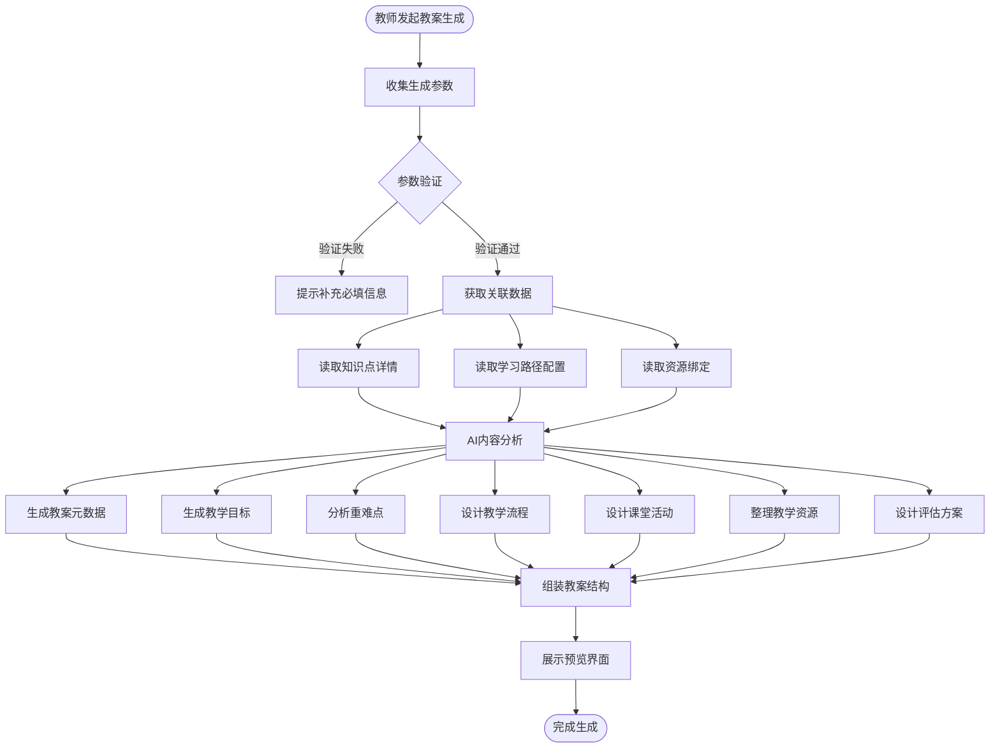
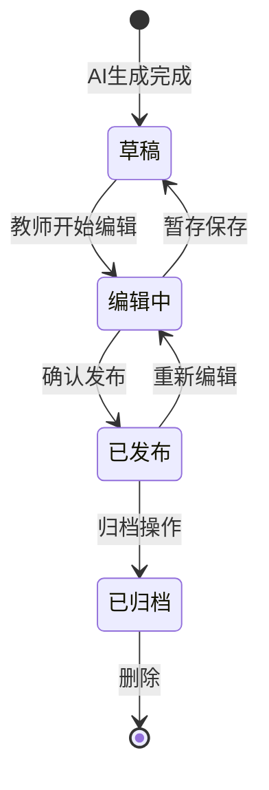
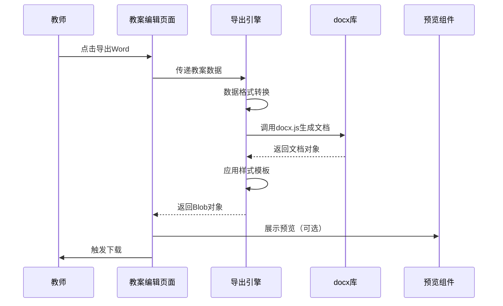
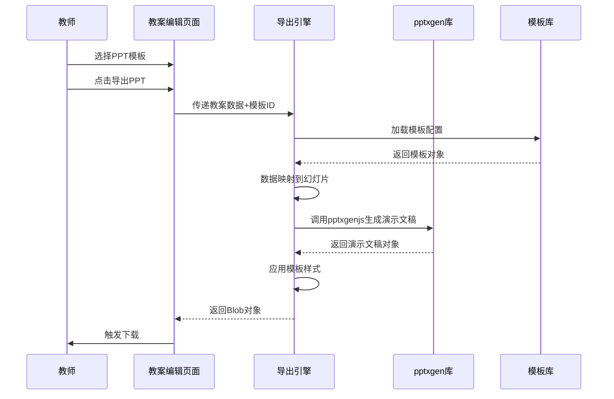
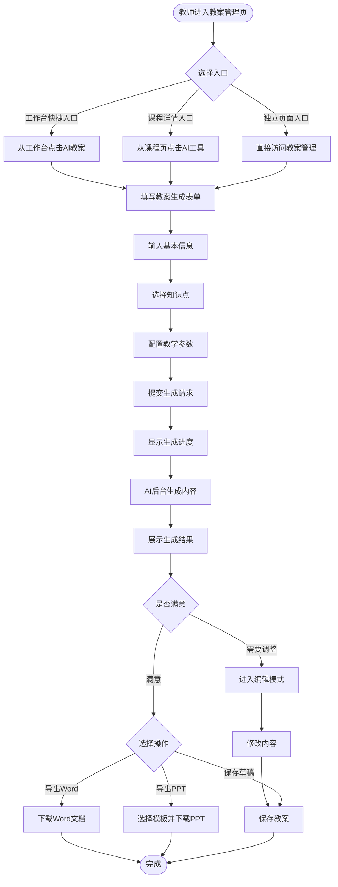
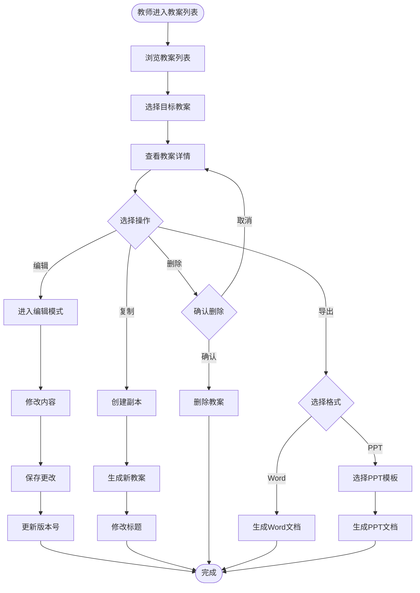
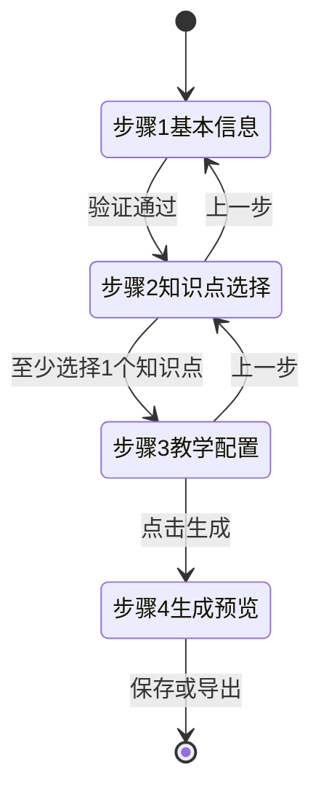
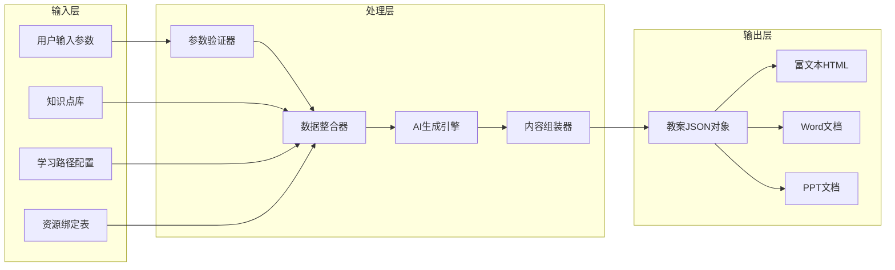
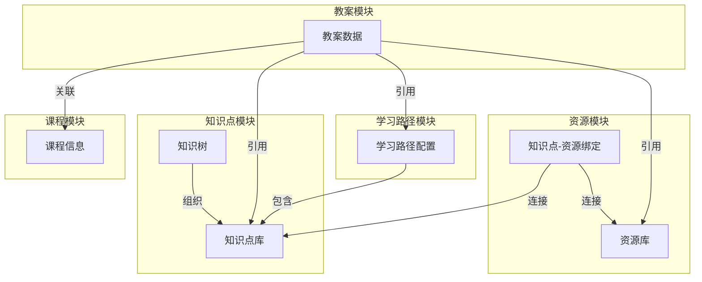

# AI教案功能设计文档

## 功能概述

为教师端添加AI智能教案生成功能，支持基于课程内容、知识点库和学习路径自动生成结构化教案，并提供Word文档和PPT两种导出格式。教师可在线预览、编辑教案内容，并对生成的文档进行个性化调整。

## 业务价值

- **提升教学效率**：自动生成教案框架，节省教师备课时间，将精力集中在教学内容优化
- **保障教案质量**：基于知识点库和学习路径，确保教案内容的系统性和完整性
- **促进教学标准化**：提供统一的教案模板和结构，便于教学管理和质量监控
- **支持个性化教学**：根据不同难度级别和学习风格生成差异化教案，满足分层教学需求

## 核心功能模块

### 模块1：AI教案生成引擎

**功能职责**
- 根据用户输入的教学参数（课程信息、知识点选择、难度级别、课时安排）生成教案内容
- 整合知识点库、学习路径配置、资源绑定等数据源
- 运用AI算法生成教学目标、重难点分析、教学流程、课堂活动设计等结构化内容

**输入数据**
- 课程基本信息（课程名称、课程编号、授课教师、学生人数）
- 知识点选择（从知识点库中选择的知识点列表）
- 教学配置（难度级别、课时数、教学风格偏好）
- 学习路径引用（可选，关联现有学习路径）

**输出内容**
- 教案元数据（标题、编号、创建时间、版本）
- 教学目标（知识目标、能力目标、情感态度目标）
- 教学重难点分析（重点内容、难点内容、突破策略）
- 教学流程设计（导入环节、讲授环节、练习环节、总结环节）
- 课堂活动方案（活动类型、活动步骤、时间分配）
- 教学资源清单（视频、练习题、交互资源、参考资料）
- 评估与反馈方案（评估方式、评估标准、反馈机制）

**生成策略**

### 模块2：教案内容编辑器

**功能职责**
- 提供富文本编辑能力，支持教师对AI生成的教案进行调整和优化
- 支持教案结构的增删改操作（添加章节、调整顺序、删除内容）
- 实时保存编辑内容，防止数据丢失

**编辑能力**
- 文本格式化（字体、字号、加粗、斜体、下划线、颜色）
- 段落样式（标题层级、列表、引用、代码块）
- 内容插入（表格、图片、链接、公式）
- 结构调整（章节拖拽排序、折叠展开）

**数据结构**

教案数据采用JSON格式存储，包含以下字段：

| 字段名 | 类型 | 说明 |
|--------|------|------|
| id | string | 教案唯一标识符 |
| courseId | string | 关联课程ID |
| title | string | 教案标题 |
| version | number | 版本号 |
| status | enum | 状态（草稿/已发布/已归档） |
| metadata | object | 元数据（作者、创建时间、更新时间、课时数） |
| teachingGoals | array | 教学目标列表 |
| keyPoints | object | 重难点（重点数组、难点数组、突破策略） |
| teachingFlow | array | 教学流程（环节名称、时长、活动描述） |
| activities | array | 课堂活动（活动类型、步骤、时间分配） |
| resources | array | 教学资源（资源类型、资源名称、资源链接） |
| assessment | object | 评估方案（评估方式、评估标准、反馈机制） |
| content | string | 富文本内容（HTML格式） |

**状态管理流程**

### 模块3：Word文档导出

**功能职责**
- 将教案数据转换为符合Word格式的文档结构
- 生成可下载的.docx文件
- 提供文档预览功能（基于HTML转换）

**导出流程**

**文档结构**

- 封面页（课程名称、授课教师、日期、版本）
- 目录页（自动生成章节索引）
- 教学信息页（课程基本信息、教学对象、课时安排）
- 教学目标页（知识目标、能力目标、情感态度目标）
- 重难点分析页（教学重点、教学难点、突破策略）
- 教学流程页（各环节详细描述、时间分配表）
- 课堂活动页（活动设计方案、实施步骤）
- 教学资源页（资源清单表格、获取方式）
- 评估方案页（评估方式、评估标准、反馈机制）
- 附录页（参考资料、扩展阅读）

**样式规范**

| 元素类型 | 字体 | 字号 | 颜色 | 对齐方式 |
|----------|------|------|------|----------|
| 一级标题 | 黑体 | 18pt | #1a1a1a | 居中 |
| 二级标题 | 黑体 | 16pt | #333333 | 左对齐 |
| 三级标题 | 黑体 | 14pt | #666666 | 左对齐 |
| 正文 | 宋体 | 12pt | #333333 | 两端对齐 |
| 表格标题 | 黑体 | 12pt | #ffffff | 居中 |
| 表格内容 | 宋体 | 11pt | #333333 | 左对齐 |

### 模块4：PPT文档导出

**功能职责**
- 将教案数据转换为PPT格式的演示文稿
- 提供多种PPT模板供选择
- 生成可下载的.pptx文件

**导出流程**

**幻灯片结构**

1. 标题幻灯片（课程名称、副标题、教师姓名、日期）
2. 目录幻灯片（章节导航）
3. 教学信息幻灯片（课程概况表格）
4. 教学目标幻灯片（三维目标列表）
5. 重点难点幻灯片（要点展示）
6. 教学流程幻灯片组（每个环节一张）
7. 课堂活动幻灯片组（每个活动一张）
8. 资源展示幻灯片（资源类型分类展示）
9. 评估方案幻灯片（评估标准表格）
10. 总结幻灯片（关键要点回顾）

**模板类型**

| 模板名称 | 适用场景 | 设计风格 | 主色调 |
|----------|----------|----------|--------|
| 经典商务 | 正式教学场景 | 简洁专业 | 蓝色系 |
| 现代简约 | 创新课程 | 扁平化设计 | 渐变色系 |
| 学术风格 | 理论课程 | 传统严谨 | 灰色系 |
| 活力青春 | 互动课程 | 明亮活泼 | 多彩系 |
| 科技未来 | 技术类课程 | 科技感 | 紫蓝色系 |

### 模块5：教案管理

**功能职责**
- 提供教案列表查看、检索、筛选功能
- 支持教案的创建、编辑、删除、复制操作
- 支持教案版本管理和历史记录查看

**管理功能**

| 功能项 | 说明 |
|--------|------|
| 列表展示 | 表格或卡片形式展示教案，包含标题、课程、创建时间、状态 |
| 搜索过滤 | 按标题、课程、状态、日期范围搜索 |
| 批量操作 | 批量删除、批量归档、批量导出 |
| 排序功能 | 按创建时间、更新时间、标题排序 |
| 快速预览 | 鼠标悬停显示教案摘要 |
| 状态标识 | 通过颜色标签区分草稿/已发布/已归档 |

**数据持久化**

- 采用本地存储（localStorage）存储教案数据
- 数据存储键名：`lesson_plans`
- 数据结构：数组形式存储多个教案对象
- 存储容量限制：建议单个教案不超过1MB，总容量不超过5MB

## 用户交互流程

### 流程1：创建新教案

### 流程2：编辑现有教案

## 页面结构设计

### 页面1：教案管理主页

**页面路径**：`/teacher/lesson-plans`

**布局结构**

- 顶部工具栏
  - 左侧：页面标题"AI教案管理"
  - 右侧：创建新教案按钮（渐变按钮，带Sparkles图标）
- 筛选搜索栏
  - 搜索框（支持标题搜索）
  - 课程筛选下拉框
  - 状态筛选标签（全部/草稿/已发布/已归档）
  - 日期范围选择器
- 教案列表区域
  - 表格模式：展示标题、课程、创建时间、更新时间、状态、操作
  - 卡片模式：每张卡片显示教案封面、标题、摘要、状态标签
- 分页器（每页10条）

**交互行为**

| 交互元素 | 触发事件 | 响应行为 |
|----------|----------|----------|
| 创建新教案按钮 | 点击 | 跳转到教案生成页面 |
| 搜索框 | 输入文字 | 实时过滤列表 |
| 筛选器 | 选择变化 | 刷新列表展示 |
| 教案标题 | 点击 | 进入教案详情页 |
| 编辑按钮 | 点击 | 进入编辑模式 |
| 删除按钮 | 点击 | 弹出确认对话框 |
| 导出按钮 | 点击 | 展开格式选择菜单 |
| 复制按钮 | 点击 | 创建副本并提示成功 |

### 页面2：教案生成配置页

**页面路径**：`/teacher/lesson-plans/create`

**布局结构**

- 进度指示器（步骤1: 基本信息 → 步骤2: 知识点选择 → 步骤3: 教学配置 → 步骤4: 生成预览）
- 表单内容区
  - 步骤1：课程选择、教案标题、授课教师、学生人数、课时数
  - 步骤2：知识点库展示（支持多选、搜索、分类筛选）
  - 步骤3：难度级别选择、教学风格偏好、关联学习路径（可选）
  - 步骤4：生成中动画 → 生成结果预览
- 底部操作栏
  - 上一步按钮
  - 下一步/生成按钮
  - 取消按钮

**步骤切换逻辑**

### 页面3：教案编辑详情页

**页面路径**：`/teacher/lesson-plans/edit/:planId`

**布局结构**

- 顶部工具栏
  - 左侧：返回按钮、教案标题（可编辑）、状态标签
  - 右侧：保存按钮、导出菜单（Word/PPT）、发布按钮
- 左侧大纲导航
  - 章节树形结构（可折叠展开）
  - 支持拖拽调整顺序
  - 点击章节跳转到对应内容
- 中间编辑区域
  - 富文本编辑器（工具栏包含格式化、插入、样式功能）
  - 内容分块展示（元数据、教学目标、重难点、教学流程等）
  - 支持章节添加、删除、上移、下移操作
- 右侧属性面板
  - 教案基本信息展示
  - 版本历史记录
  - AI优化建议（可选）

**编辑器工具栏功能**

| 工具项 | 功能说明 |
|--------|----------|
| 撤销/重做 | 支持操作历史回退 |
| 字体设置 | 字体、字号、颜色选择 |
| 格式化 | 加粗、斜体、下划线、删除线 |
| 段落样式 | 标题1-6、正文、引用 |
| 列表 | 有序列表、无序列表、任务列表 |
| 插入 | 表格、图片、链接、分割线 |
| 对齐 | 左对齐、居中、右对齐、两端对齐 |
| 清除格式 | 清除选中文本的所有格式 |

## 技术实现要点

### 前端技术选型

| 技术项 | 推荐方案 | 用途说明 |
|--------|----------|----------|
| 富文本编辑器 | Quill / TinyMCE | 支持富文本编辑和格式化 |
| Word导出 | docx.js | 生成.docx格式文档 |
| PPT导出 | pptxgenjs | 生成.pptx格式演示文稿 |
| 文档预览 | docx-preview | 预览Word文档内容 |
| 拖拽排序 | react-beautiful-dnd | 实现章节拖拽排序 |
| 状态管理 | React Hooks (useState/useReducer) | 管理编辑器状态和表单数据 |
| 数据持久化 | localStorage API | 本地存储教案数据 |

### AI生成算法策略

**内容生成规则**

1. **教学目标生成**
   - 从知识点描述中提取关键能力词汇（理解、掌握、应用、分析）
   - 根据难度级别调整目标深度（简单侧重理解，困难侧重应用）
   - 自动生成三维目标（知识与技能、过程与方法、情感态度与价值观）

2. **重难点分析生成**
   - 基于知识点难度字段识别难点
   - 从知识点标签中提取核心概念作为重点
   - 根据学习路径前置依赖关系推荐突破策略

3. **教学流程生成**
   - 默认四环节结构：导入（5分钟）→ 讲授（20分钟）→ 练习（15分钟）→ 总结（5分钟）
   - 根据课时数自动调整各环节时长占比
   - 从资源库匹配对应环节的教学资源

4. **课堂活动生成**
   - 根据教学风格偏好推荐活动类型（视觉型推荐演示、学术型推荐讨论、逻辑型推荐推理）
   - 活动数量与知识点数量关联（1-2个知识点1个活动，3-5个知识点2个活动）
   - 为每个活动生成实施步骤（准备、实施、总结）

5. **资源清单生成**
   - 从知识点-资源绑定表中读取关联资源
   - 按资源类型分组（视频、练习题、交互资源、参考资料）
   - 为每种资源生成简要说明和使用建议

### 数据流转机制

### 文档导出技术实现

**Word导出示例流程**

1. 引入docx库：`import { Document, Packer, Paragraph, TextRun, Table, TableRow, TableCell } from 'docx'`
2. 创建文档对象：`const doc = new Document({ sections: [...] })`
3. 遍历教案数据，为每个章节创建段落或表格元素
4. 应用样式配置（字体、颜色、对齐方式）
5. 使用Packer生成Blob：`Packer.toBlob(doc).then(blob => {...})`
6. 触发浏览器下载：`saveAs(blob, '教案标题.docx')`

**PPT导出示例流程**

1. 引入pptxgenjs库：`import pptxgen from 'pptxgenjs'`
2. 创建演示文稿对象：`const pres = new pptxgen()`
3. 加载选定的模板配置（背景色、字体、布局）
4. 遍历教案章节，为每个章节添加幻灯片：`const slide = pres.addSlide()`
5. 向幻灯片添加文本、表格、图片元素：`slide.addText('标题', {...})`
6. 生成并下载：`pres.writeFile({ fileName: '教案标题.pptx' })`

### 本地存储数据结构

**存储键名**：`lesson_plans`

**数据格式**：JSON数组

**单条记录示例结构**

| 一级字段 | 二级字段 | 类型 | 示例值 |
|----------|----------|------|--------|
| id | - | string | "lp_20240315_001" |
| courseId | - | string | "course_123" |
| courseName | - | string | "建筑材料与构造" |
| title | - | string | "混凝土材料性能教案" |
| version | - | number | 1 |
| status | - | string | "draft" |
| metadata | author | string | "王睿" |
| metadata | createdAt | string | "2024-03-15T10:00:00Z" |
| metadata | updatedAt | string | "2024-03-15T14:30:00Z" |
| metadata | duration | number | 45 |
| teachingGoals | - | array | [{type: "knowledge", content: "理解混凝土的基本组成"}] |
| keyPoints | highlights | array | ["混凝土配合比", "强度等级"] |
| keyPoints | difficulties | array | ["水灰比对强度的影响机理"] |
| keyPoints | strategies | array | ["通过实验对比演示"] |
| teachingFlow | - | array | [{phase: "导入", duration: 5, activities: [...]}] |
| activities | - | array | [{type: "实验", steps: [...], time: 15}] |
| resources | - | array | [{type: "video", name: "混凝土制作流程", url: "..."}] |
| assessment | methods | array | ["课堂问答", "练习题"] |
| assessment | criteria | object | {excellent: "90分以上", good: "75-90分"} |
| content | - | string | "\<h2\>教学目标\</h2\>\<p\>..." |

## 路由配置

| 路由路径 | 对应页面组件 | 页面说明 |
|----------|--------------|----------|
| `/teacher/lesson-plans` | LessonPlanManager | 教案管理主页（列表、搜索、筛选） |
| `/teacher/lesson-plans/create` | LessonPlanCreate | 教案生成配置页（步骤表单） |
| `/teacher/lesson-plans/edit/:planId` | LessonPlanEditor | 教案编辑详情页（富文本编辑器） |

## 集成点设计

### 集成点1：教师工作台快捷入口

**位置**：TeacherDashboard 页面统计卡片区域下方

**展示形式**：横幅卡片或功能卡片

**卡片内容**
- 图标：Sparkles + FileText 组合图标
- 标题：AI智能教案
- 描述：一键生成结构化教案，支持导出Word和PPT
- 操作按钮：立即使用

**跳转目标**：`/teacher/lesson-plans/create`

### 集成点2：课程详情页AI工具标签

**位置**：TeacherCoursePage 页面的"AI工具"标签内容区

**展示形式**：功能卡片（类似现有的管理卡片样式）

**卡片内容**
- 图标：FileText（渐变背景：from-indigo-500 to-purple-500）
- 标题：AI教案生成
- 描述：基于课程内容智能生成教案
- 点击行为：携带当前课程ID跳转到`/teacher/lesson-plans/create?courseId=xxx`

### 集成点3：学习路径管理器关联

**位置**：TeacherPathManager 页面路径列表的操作按钮

**展示形式**：操作菜单项

**菜单项内容**
- 图标：FileText
- 文本：生成教案
- 点击行为：携带路径ID跳转到`/teacher/lesson-plans/create?pathId=xxx`，自动填充关联的知识点

## 数据依赖关系

## 用户权限控制

| 角色 | 权限范围 |
|------|----------|
| 教师 | 创建、查看、编辑、删除自己的教案；导出Word/PPT文档 |
| 管理员 | 查看所有教案；删除任意教案；导出任意教案 |
| 学生 | 无访问权限 |

**权限验证时机**
- 页面进入时：验证用户角色是否为教师或管理员
- 操作执行时：验证操作对象所属权限（删除、编辑时验证是否为创建者）

## 异常处理策略

| 异常场景 | 处理方式 |
|----------|----------|
| 知识点数据缺失 | 提示用户补充知识点，禁用生成按钮 |
| AI生成超时 | 显示超时提示，提供重试按钮，记录失败日志 |
| 编辑内容丢失 | 定时自动保存（每30秒），退出前提示保存 |
| 导出文件失败 | 显示错误提示，建议检查浏览器兼容性，提供降级方案（导出HTML） |
| 本地存储超限 | 提示清理旧教案或归档，提供批量删除功能 |
| 文档样式异常 | 提供默认样式模板兜底，错误上报到控制台 |
| 网络请求失败 | 显示网络错误提示，提供离线模式（仅支持编辑和保存） |

## 性能优化考虑

**优化策略**

1. **懒加载富文本编辑器**：仅在进入编辑页面时加载Quill/TinyMCE库，减少首屏加载时间
2. **虚拟滚动列表**：教案列表超过50条时启用虚拟滚动，优化渲染性能
3. **防抖处理**：搜索框输入、自动保存等操作添加防抖（300ms延迟）
4. **分块生成内容**：AI生成过程展示进度条，按模块逐步生成（元数据 → 目标 → 流程）
5. **文档导出优化**：大文件导出时使用Web Worker处理，避免阻塞主线程
6. **缓存模板配置**：PPT模板配置加载后缓存到内存，避免重复读取

**性能指标**

| 指标项 | 目标值 |
|--------|--------|
| 页面首屏加载时间 | < 2秒 |
| AI生成完整教案时间 | < 10秒 |
| Word文档导出时间 | < 5秒 |
| PPT文档导出时间 | < 8秒 |
| 自动保存响应时间 | < 500ms |
| 搜索过滤响应时间 | < 300ms |

## 扩展性设计

**未来扩展方向**

1. **多语言教案支持**：支持英文、日文等多语言教案生成
2. **协作编辑功能**：多位教师共同编辑同一份教案，实时同步修改
3. **教案模板库**：预设多种教案模板供快速套用（实验课模板、理论课模板、实践课模板）
4. **AI优化建议**：基于教学大数据分析，提供教案优化建议（增加互动环节、调整时长分配）
5. **教案评审流程**：支持教研组长审核教案，添加评审意见和修改建议
6. **教案分享社区**：优秀教案可发布到社区供其他教师参考学习
7. **移动端适配**：支持在平板和手机上查看、编辑教案
8. **云端同步存储**：教案数据同步到云端，支持跨设备访问

## 验收标准

| 功能项 | 验收条件 |
|--------|----------|
| 教案生成 | 输入完整参数后，能在10秒内生成包含所有章节的结构化教案 |
| 内容编辑 | 富文本编辑器支持基本格式化、插入表格图片，自动保存正常工作 |
| Word导出 | 生成的Word文档包含所有教案内容，样式符合规范，可在Microsoft Word中正常打开 |
| PPT导出 | 生成的PPT包含完整幻灯片，模板样式正确应用，可在PowerPoint中正常打开 |
| 文档预览 | Word预览功能能够正确展示文档内容和基本格式 |
| 教案管理 | 列表、搜索、筛选、排序功能正常，支持编辑、删除、复制操作 |
| 数据持久化 | 教案保存到本地存储，刷新页面后数据不丢失 |
| 集成入口 | 教师工作台、课程详情页、学习路径管理器的入口链接正确跳转 |
| 异常处理 | 各类异常场景能正确提示错误信息，不出现白屏或卡死 |
| 性能表现 | 关键操作响应时间符合性能指标要求 |

## 风险评估

| 风险项 | 影响程度 | 缓解措施 |
|--------|----------|----------|
| 富文本编辑器兼容性问题 | 中 | 选择成熟稳定的编辑器库，做好浏览器兼容性测试 |
| Word/PPT导出库功能限制 | 中 | 提前评估库的能力边界，复杂样式提供降级方案 |
| AI生成质量不稳定 | 高 | 优化生成算法，提供人工编辑能力作为补充 |
| 本地存储容量限制 | 中 | 添加存储用量提示，引导用户清理或归档旧数据 |
| 大文件导出性能问题 | 低 | 使用Web Worker处理，添加导出进度提示 |
| 用户学习成本较高 | 中 | 提供操作引导和帮助文档，简化生成配置流程 || 大文件导出性能问题 | 低 | 使用Web Worker处理，添加导出进度提示 |
