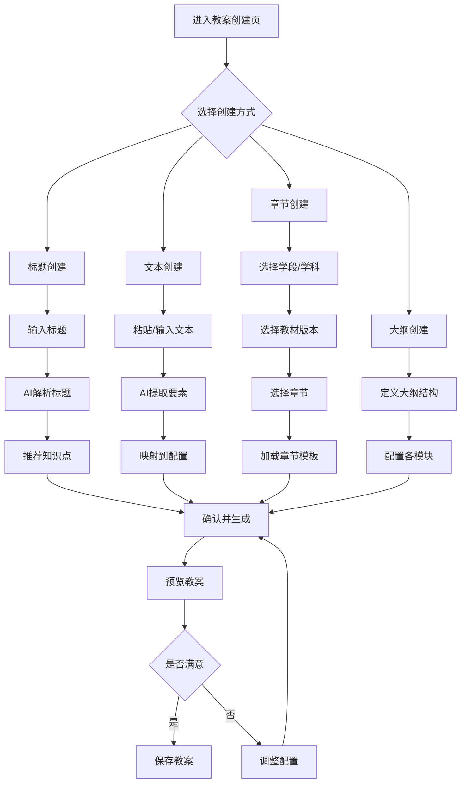
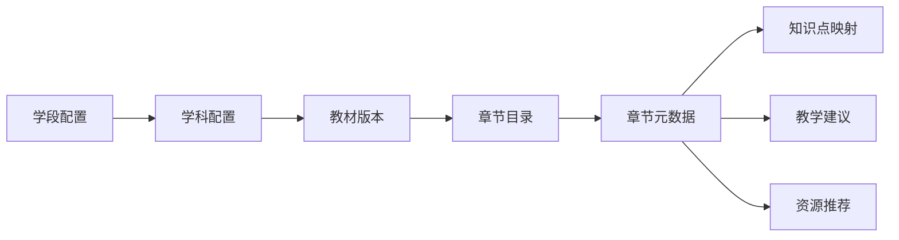
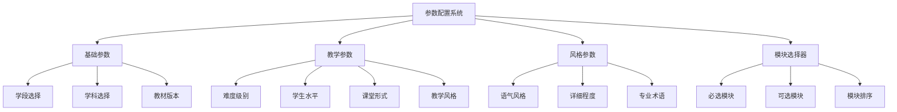
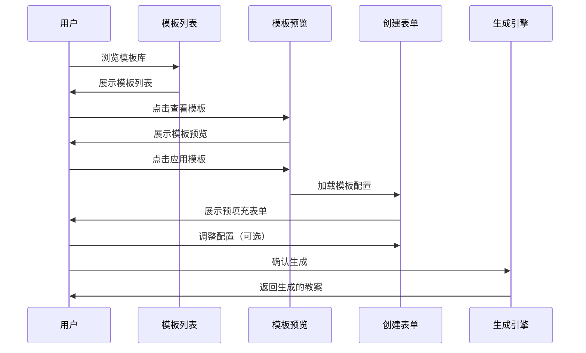
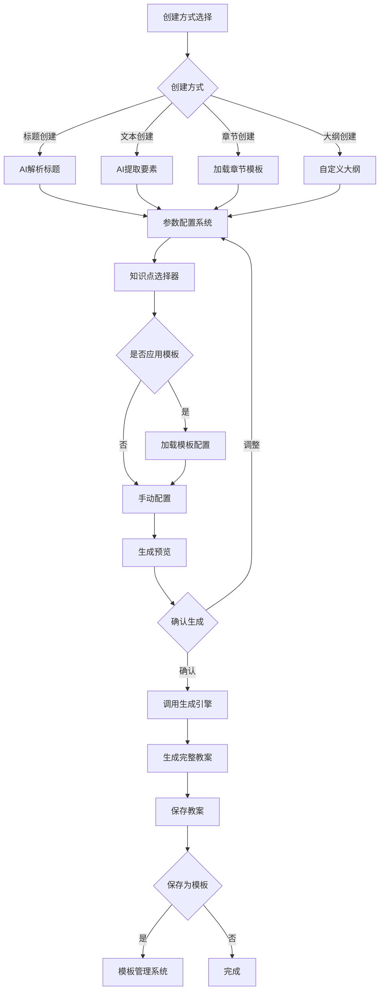

# AI教案系统功能增强设计

## 设计概述

本设计文档针对AI教案生成系统的功能扩展，覆盖多创建方式支持、参数配置优化、知识点联动UI增强以及模板管理系统四个核心阶段。当前系统已实现基础的教案生成、编辑、导出功能，但在创建方式的灵活性、参数配置的全面性以及模板化管理方面存在空白。

### 设计范围

| 阶段 | 功能模块 | 优先级 |
|------|---------|--------|
| 阶段二 | 多创建方式支持 | 高 |
| 阶段三 | 参数配置系统 | 高 |
| 阶段四 | 知识点目录联动UI | 中 |
| 阶段五 | 模板管理系统 | 中 |

### 设计目标

提升教案创建的灵活性、规范性与效率，使教师能够根据不同场景快速生成符合教学需求的高质量教案，同时支持个性化定制与模板复用。

---

## 阶段二：多创建方式支持

### 功能定位

当前系统仅支持标准流程创建（三步骤向导），缺乏快速创建和灵活创建的能力。本阶段设计四种创建方式，满足不同教学场景与时间约束下的教案生成需求。

### 创建方式矩阵

| 创建方式 | 适用场景 | 输入内容 | 生成策略 | 预计时长 |
|---------|---------|---------|---------|---------|
| 标题创建 | 快速生成教案框架 | 教案标题 | AI根据标题关键词智能推断知识点和教学内容 | 30秒 |
| 文本创建 | 复用已有文档内容 | 自由文本描述 | AI提取关键信息并映射到知识点库 | 1分钟 |
| 章节创建 | 依据教材章节生成 | 章节号、章节标题 | 按预设章节模板生成结构化内容 | 45秒 |
| 大纲创建 | 精细控制教案结构 | 自定义大纲结构 | 依照用户提供的大纲生成对应模块 | 2分钟 |

### 用户交互流程



### 详细设计

#### 2.1 标题创建

**核心价值**：30秒快速启动教案生成，适用于时间紧迫或标准化课程场景。

**交互设计**
- 页面布局
  - 顶部：创建方式选项卡（标题/文本/章节/大纲）
  - 主区域：标题输入框（带智能提示）
  - 右侧：AI解析预览区
- 输入增强
  - 提供常用标题模板（如"[学段][学科][章节]教案"）
  - 自动补全功能（基于历史教案标题）
  - 字符长度限制（5-50字）

**AI解析逻辑**
- 关键词提取
  - 识别学科名称（数学、物理、建筑材料等）
  - 识别章节信息（第X章、单元X等）
  - 识别知识点名称（函数、向量、混凝土等）
- 知识点推荐
  - 基于关键词在知识点库中模糊匹配
  - 考虑知识点间的前置依赖关系
  - 推荐3-5个最相关知识点
- 默认参数生成
  - 难度级别：根据标题关键词（如"基础""进阶"）推断
  - 教学风格：默认学术型
  - 课堂形式：默认讲授式
  - 课时：45分钟

**示例场景**
| 输入标题 | AI解析结果 | 推荐知识点 |
|---------|-----------|----------|
| 高一数学函数基础教案 | 学段:高一, 学科:数学, 难度:简单 | 函数概念、集合与逻辑 |
| 建筑材料混凝土性能分析 | 学科:建筑材料, 难度:中等 | 混凝土基础、材料性能测试 |
| 三角函数图像与性质探究 | 学科:数学, 难度:中等 | 三角函数图像、函数性质分析 |

#### 2.2 文本创建

**核心价值**：复用已有文档内容，避免重复劳动，适用于已有教学材料需数字化的场景。

**交互设计**
- 输入方式
  - 文本框（支持粘贴，最多5000字符）
  - 文件上传（支持.txt, .docx, .pdf）
  - 示例文本模板（供参考）
- 解析反馈
  - 实时显示提取进度
  - 高亮显示识别到的关键要素
  - 展示置信度评分

**AI提取要素**

提取的核心要素及映射关系：

| 要素类型 | 识别标志 | 映射目标 |
|---------|---------|---------|
| 课程名称 | "课程""科目" | formData.courseName |
| 教案标题 | "题目""主题" | formData.title |
| 授课对象 | "年级""班级" | formData.className |
| 课时安排 | "X分钟""X课时" | formData.duration |
| 知识点 | 专业术语、章节名 | formData.knowledgePointIds |
| 教学目标 | "目标""掌握""理解" | 教学目标生成参考 |
| 重难点 | "重点""难点" | 重难点生成参考 |
| 教学活动 | "实验""讨论""练习" | 推断classFormat |

**文本智能分析策略**
- 分段处理：按段落或标题结构分块
- 实体识别：识别课程名、知识点、教学方法等实体
- 语义理解：判断难度等级、教学风格倾向
- 缺失补全：未提取到的字段使用智能推断或默认值

#### 2.3 章节创建

**核心价值**：标准化教学进度管理，适用于按教材章节系统授课的场景。

**交互设计**
- 层级选择
  - 学段选择（小学/初中/高中/大学）
  - 学科选择（数学/物理/化学/建筑等）
  - 教材版本（人教版/苏教版/自编教材等）
  - 章节树形选择器
- 预览面板
  - 显示章节知识点列表
  - 显示章节教学建议
  - 显示章节预计学时

**章节数据结构**



章节元数据包含：
- 章节编号与标题
- 关联知识点ID列表
- 推荐难度级别
- 推荐课时数
- 教学重难点提示
- 预设教学活动类型

**章节模板生成规则**
- 知识点自动绑定：根据章节元数据加载关联知识点
- 参数预设：应用章节推荐的难度、课时等参数
- 内容框架预填充：按章节教学建议生成教学流程初稿

#### 2.4 大纲创建

**核心价值**：精细化控制教案结构，适用于有特殊教学设计需求的场景。

**交互设计**
- 模块勾选器
  - 展示11个教案核心模块（基本信息、教学目标...教学反思）
  - 支持勾选/取消勾选
  - 支持拖拽调整模块顺序
- 模块配置面板
  - 点击模块展开配置选项
  - 配置内容包括：模块标题、生成策略、详细程度
- 实时预览
  - 右侧实时预览大纲结构
  - 显示每个模块的预估内容量

**模块配置表**

| 模块名称 | 可配置项 | 生成策略选项 |
|---------|---------|-------------|
| 教学目标 | 目标数量、维度选择 | 标准三维目标/自定义目标 |
| 教学重难点 | 重点数量、难点数量 | AI自动分析/手动指定 |
| 教学准备 | 准备类型 | 基础准备/实验准备/讨论准备 |
| 教学流程 | 环节数量、时间分配 | 标准四环节/自定义环节 |
| 课堂活动 | 活动类型、数量 | 实验/讨论/案例分析 |
| 板书设计 | 复杂度 | 简洁型/详细型 |
| 教学资源 | 资源类型、数量 | 视频/练习/阅读 |
| 作业设计 | 难度层次 | 基础题/拓展题/实践题 |
| 教学评估 | 评估方式 | 课堂问答/测验/项目 |
| 教学反思 | 是否预留 | 预留空白/生成提示 |

**大纲保存与复用**
- 大纲模板保存：用户可保存自定义大纲为模板
- 模板命名与分类：按学科、课程类型分类管理
- 快速应用：下次创建时直接选择已保存模板

---

## 阶段三：参数配置系统

### 功能定位

当前系统参数配置项有限（难度、教学风格、课堂形式、学生水平），缺乏学段、学科、语气风格等关键维度。本阶段设计全面的参数配置系统，支持精细化控制教案生成质量。

### 参数分类体系



### 详细设计

#### 3.1 学段选择

**设计目的**：不同学段的教学目标、方法、语言风格差异显著，需针对性生成内容。

**选项定义**

| 学段 | 年龄范围 | 教学特点 | 语言风格 | 知识深度 |
|------|---------|---------|---------|---------|
| 小学 | 6-12岁 | 趣味性、互动性强 | 简单易懂、生动形象 | 浅显直观 |
| 初中 | 12-15岁 | 逻辑性、系统性 | 准确规范、适度严谨 | 系统基础 |
| 高中 | 15-18岁 | 抽象性、应用性 | 严谨专业、层次分明 | 深入拓展 |
| 大学 | 18岁以上 | 研究性、实践性 | 学术规范、专业术语 | 专业深入 |
| 职业培训 | 成人 | 实用性、技能性 | 实操导向、案例丰富 | 应用为主 |

**影响生成的维度**
- 教学目标表述：小学强调"初步了解"，高中强调"深入理解"，大学强调"研究探索"
- 教学活动设计：小学多游戏化活动，高中多探究实验，大学多项目研讨
- 作业难度分层：小学以基础练习为主，大学含研究性作业
- 语言复杂度：词汇量、句式复杂度随学段递增

#### 3.2 学科选择

**设计目的**：不同学科的知识体系、教学方法、资源类型各异，需适配学科特性。

**学科分类与特性**

| 学科类别 | 典型学科 | 教学方法偏好 | 资源类型偏好 | 知识点库 |
|---------|---------|-------------|-------------|---------|
| 理科 | 数学、物理、化学 | 演绎推理、实验验证 | 公式推导、实验视频 | 数理知识点库 |
| 工科 | 建筑、机械、电气 | 工程实践、案例分析 | CAD图纸、施工视频 | 工程知识点库 |
| 文科 | 语文、历史、政治 | 阅读理解、讨论辩论 | 文献资料、视频讲座 | 人文知识点库 |
| 艺体 | 音乐、美术、体育 | 技能训练、作品鉴赏 | 示范视频、作品库 | 技能知识点库 |

**学科参数联动**
- 学科选择后自动加载对应知识点库
- 推荐适配该学科的教学风格（如理科推荐逻辑型，文科推荐讨论式）
- 调整教学资源推荐策略（如理科多推荐实验视频，文科多推荐阅读资料）

#### 3.3 语气风格

**设计目的**：教案语言风格影响教师使用感受与教学实施效果，需支持多样化选择。

**风格选项矩阵**

| 风格类型 | 适用场景 | 语言特点 | 示例 |
|---------|---------|---------|------|
| 标准规范 | 正式教学、教案归档 | 符合教育部规范，用语准确 | "通过本节课学习，学生能够掌握..." |
| 简洁明了 | 快速备课、新手教师 | 省略冗余表述，突出要点 | "知识点：函数概念；目标：掌握定义" |
| 详细指导 | 公开课、观摩课 | 详细阐述教学意图与步骤 | "在导入环节，教师通过展示生活中的实例，引导学生思考函数关系，设计意图是..." |
| 活泼生动 | 小学、兴趣课程 | 多用比喻、故事，语言亲和 | "小朋友们，今天我们要一起探索数字王国的秘密..." |
| 学术严谨 | 大学、专业课程 | 学术术语规范，逻辑严密 | "本课程旨在系统阐述XX理论的核心范式..." |

**语气风格实现方式**
- 模板变量替换：为不同风格准备不同的语言模板
- 语言后处理：生成后根据风格要求调整措辞
- 示例库切换：不同风格使用不同的示例案例

#### 3.4 模块选择器

**设计目的**：教师可根据实际需求灵活选择教案包含的模块，避免冗余内容。

**模块分级管理**

| 模块级别 | 模块名称 | 默认状态 | 说明 |
|---------|---------|---------|------|
| 必选模块 | 基本信息 | 强制包含 | 标题、课程、教师等基础信息 |
| 必选模块 | 教学目标 | 强制包含 | 核心教学目标 |
| 必选模块 | 教学流程 | 强制包含 | 教学过程设计 |
| 推荐模块 | 教学重难点 | 默认勾选 | 重点难点分析 |
| 推荐模块 | 作业设计 | 默认勾选 | 课后作业 |
| 可选模块 | 教学准备 | 默认不勾选 | 教师学生环境准备 |
| 可选模块 | 课堂活动 | 默认不勾选 | 详细活动设计 |
| 可选模块 | 板书设计 | 默认不勾选 | 板书框架 |
| 可选模块 | 教学资源 | 默认不勾选 | 资源清单 |
| 可选模块 | 教学评估 | 默认不勾选 | 评估方案 |
| 可选模块 | 教学反思 | 默认不勾选 | 反思预留区 |

**模块配置交互**
- 分组展示：必选/推荐/可选分组显示
- 一键预设：提供"简洁版""标准版""完整版"三种快速预设
- 模块依赖提示：如勾选"课堂活动"时提示建议同时勾选"教学准备"

**参数配置持久化**
- 保存为个人默认配置：用户可将常用配置保存为默认值
- 场景化预设：提供"公开课配置""常规课配置""复习课配置"等预设

---

## 阶段四：知识点与目录联动UI

### 功能定位

当前知识点选择采用卡片式列表，缺乏层级结构展示，不便于理解知识点间的关系。本阶段设计树形选择器，实现知识点与目录结构的可视化联动。

### 核心设计

#### 4.1 树形选择器结构

**层级关系**


**示例树结构**

以数学学科为例：

```
数学
├── 代数
│   ├── 函数
│   │   ├── 函数概念 (k1)
│   │   ├── 复合函数 (k8)
│   │   └── 函数应用
│   ├── 方程与不等式
│   │   ├── 一元二次方程 (k2)
│   │   └── 不等式 (k5)
│   └── 数列
│       ├── 数列通项 (k7)
│       └── 数列求和 (k12)
├── 几何
│   ├── 平面几何
│   │   └── 向量运算 (k3)
│   ├── 立体几何 (k9)
│   └── 解析几何
│       └── 圆锥曲线 (k13)
└── 分析
    ├── 三角函数
    │   ├── 三角函数图像 (k6)
    │   └── 三角恒等变换 (k16)
    ├── 导数
    │   └── 导数应用 (k11)
    └── 积分
        └── 积分计算 (k14)
```

#### 4.2 交互设计

**树形控件特性**
- 节点展开/折叠：点击节点展开下级，再次点击折叠
- 复选框选择：每个知识点前显示复选框
- 半选状态：父节点部分子节点被选中时显示半选状态
- 搜索功能：支持关键词搜索，自动展开并高亮匹配节点
- 统计信息：显示已选知识点数量、预计总学时

**视觉设计要点**
- 层级缩进：每级缩进20px，最多显示5级
- 连接线：显示父子节点连接线（可选）
- 图标区分：文件夹图标（模块）、文档图标（知识点）
- 颜色标记：按难度级别显示不同颜色徽标（绿色-基础，蓝色-进阶，红色-高级）

#### 4.3 联动机制

**目录与知识点同步**
- 章节选择联动：在章节创建模式下，选中章节自动勾选该章节关联的知识点
- 知识点依赖检查：选中某知识点时，自动提示并建议勾选其前置知识点
- 知识点互斥检查：检测同时选中的知识点是否存在逻辑冲突

**智能推荐**
- 基于已选推荐：根据已选知识点，推荐相关或进阶知识点
- 难度平衡提示：如已选知识点难度分布不均，提示调整建议
- 学时预警：实时计算已选知识点总学时，超过课时限制时发出警告

#### 4.4 数据结构设计

**知识点树节点数据模型**

| 字段 | 类型 | 说明 |
|------|------|------|
| id | String | 节点唯一标识 |
| name | String | 节点名称 |
| type | Enum | node（模块）/ leaf（知识点） |
| level | Number | 层级深度（1-5） |
| knowledgePointId | String | 对应知识点ID（仅叶子节点） |
| children | Array | 子节点列表 |
| metadata | Object | 元数据（难度、学时等） |
| prerequisites | Array | 前置知识点ID列表 |

**树形数据与知识点库映射**

知识点库（KNOWLEDGE_POINTS_LIBRARY）为扁平结构，需构建映射关系：

- 映射配置文件：定义知识点ID到树节点路径的映射
- 动态构建树：页面加载时根据映射配置动态构建树结构
- 反向索引：建立知识点ID到树节点的快速查找索引

---

## 阶段五：模板管理系统

### 功能定位

当前系统无模板化管理能力，优秀教案无法复用，重复劳动严重。本阶段设计完整的模板管理系统，支持模板创建、存储、分享与应用。

### 核心设计

#### 5.1 模板分类体系

**模板类型定义**

| 模板类型 | 用途 | 包含内容 | 典型场景 |
|---------|-----|---------|---------|
| 参数模板 | 保存参数配置 | 学段、学科、难度等所有配置参数 | 同类课程快速复用配置 |
| 大纲模板 | 保存结构框架 | 模块选择、排序、配置 | 特殊课型（实验课、复习课） |
| 内容模板 | 保存完整教案 | 完整教案内容（可替换知识点） | 标准课程模板复用 |
| 混合模板 | 参数+大纲 | 参数配置+大纲结构 | 综合场景 |

#### 5.2 模板管理功能

**模板创建**

创建入口：
- 从现有教案保存为模板
- 从当前配置保存为模板
- 从零创建模板

**模板元数据**

| 字段 | 类型 | 必填 | 说明 |
|------|------|------|------|
| templateId | String | 是 | 模板唯一ID |
| name | String | 是 | 模板名称 |
| type | Enum | 是 | 参数/大纲/内容/混合 |
| category | String | 否 | 分类标签（学科、课型等） |
| description | String | 否 | 模板描述 |
| author | String | 是 | 创建者 |
| scope | Enum | 是 | 个人/团队/公开 |
| tags | Array | 否 | 标签列表 |
| usageCount | Number | 是 | 使用次数 |
| createdAt | DateTime | 是 | 创建时间 |
| updatedAt | DateTime | 是 | 更新时间 |
| previewData | Object | 否 | 预览数据 |

**模板存储策略**
- 个人模板：存储在本地LocalStorage（与教案数据分离）
- 团队模板：存储在团队共享存储（需权限管理）
- 公开模板：存储在平台模板库（需审核机制）

#### 5.3 模板应用流程



**应用模板交互**
- 模板选择器：支持按类型、学科、标签筛选
- 模板预览：展示模板包含的配置项和示例效果
- 一键应用：直接应用模板配置并跳转到生成步骤
- 调整应用：应用模板后允许微调参数

#### 5.4 模板分享与协作

**分享机制**

| 分享方式 | 实现方式 | 适用场景 |
|---------|---------|---------|
| 导出分享 | 导出为JSON文件 | 离线分享、跨平台传输 |
| 链接分享 | 生成分享链接（含模板ID） | 在线快速分享 |
| 二维码分享 | 生成二维码 | 移动端分享 |
| 发布到平台 | 提交审核后发布到公开库 | 广泛传播 |

**团队协作功能**
- 团队模板库：团队成员共享模板
- 权限管理：创建者可设置编辑权限（仅查看/可编辑）
- 版本控制：记录模板修改历史，支持回退
- 使用统计：统计团队成员使用频次，识别优质模板

#### 5.5 模板管理界面

**模板库主界面**

布局结构：
- 左侧：分类筛选器（类型、学科、标签、作者）
- 中间：模板卡片网格
  - 卡片信息：名称、类型、作者、使用次数、创建时间
  - 卡片操作：预览、应用、编辑、删除、分享
- 右侧：详情面板（点击卡片时展开）

**模板卡片设计**

卡片元素：
- 类型图标（左上角）
- 模板名称（标题）
- 作者与创建时间（副标题）
- 标签列表
- 使用次数与评分（如有）
- 操作按钮组（预览/应用/更多）

---

## 数据流与集成设计

### 数据流图



### 与现有系统集成

**现有组件复用**
- 继续使用 `generateLessonPlan` 作为核心生成引擎
- 扩展 `lessonPlanStorage` 添加模板存储功能
- 复用 `KNOWLEDGE_POINTS_LIBRARY` 作为知识点数据源

**新增工具模块**

| 模块名称 | 职责 | 主要函数 |
|---------|-----|---------|
| titleParser | 标题解析 | parseTitle(title) → config |
| textExtractor | 文本要素提取 | extractElements(text) → config |
| chapterLoader | 章节加载 | loadChapter(subject, chapter) → config |
| outlineBuilder | 大纲构建 | buildOutline(modules) → outline |
| templateManager | 模板管理 | saveTemplate(), loadTemplate(), listTemplates() |
| knowledgeTreeBuilder | 知识树构建 | buildTree(knowledgePoints) → tree |

**配置对象扩展**

当前 `formData` 结构需扩展以下字段：

```javascript
{
  // 现有字段保持不变
  courseId, courseName, title, author, studentCount, duration,
  knowledgePointIds, difficulty, teachingStyle, classFormat, 
  studentLevel, className, teachingDate, pathId,
  
  // 新增字段
  gradeLevel: 'high_school',        // 学段
  subject: 'mathematics',           // 学科
  textbook: 'renmin_edition',       // 教材版本
  toneStyle: 'standard',            // 语气风格
  detailLevel: 'moderate',          // 详细程度
  enabledModules: ['basicInfo', 'teachingGoals', ...], // 启用模块
  moduleConfigs: {},                // 模块配置
  createMethod: 'title',            // 创建方式
  templateId: null,                 // 应用的模板ID
}
```

---

## 实施建议

### 开发优先级

建议按以下顺序迭代开发：

| 阶段 | 工作量 | 依赖关系 | 建议周期 |
|------|--------|---------|---------|
| 阶段三 参数配置系统 | 中 | 无 | 1周 |
| 阶段二.1 标题创建 | 小 | 阶段三 | 3天 |
| 阶段二.2 文本创建 | 中 | 阶段三 | 5天 |
| 阶段五 模板管理（基础） | 中 | 阶段三 | 1周 |
| 阶段二.4 大纲创建 | 小 | 阶段三、阶段五 | 3天 |
| 阶段四 树形选择器 | 中 | 无 | 1周 |
| 阶段二.3 章节创建 | 大 | 阶段四 | 1.5周 |
| 阶段五 模板管理（高级） | 中 | 阶段五基础 | 1周 |

### 技术考虑

**前端组件**
- 树形选择器：推荐使用 Ant Design Tree 组件
- 拖拽排序：推荐使用 react-beautiful-dnd
- 富文本编辑：复用现有 contentEditable 方案

**数据持久化**
- 模板数据：单独的 LocalStorage Key（`lesson_plan_templates`）
- 配置预设：用户配置存储在 `user_preferences`
- 章节数据：考虑引入静态JSON文件或远程API

**AI能力需求**
- 标题解析：NLP关键词提取 + 规则匹配
- 文本要素提取：实体识别 + 语义分析
- 知识点推荐：基于关键词的相似度匹配

### 用户引导策略

**新手引导**
- 首次进入创建页面时，显示创建方式选择引导
- 提供示例模板供快速体验
- 在关键步骤显示工具提示

**功能发现**
- 模板库入口提示：在创建页面显著位置展示模板库入口
- 使用提示：在参数配置时提示可保存为模板
- 最佳实践：在文档中提供不同场景的推荐配置

---

## 预期成果

完成本设计后，AI教案系统将实现：

1. **创建效率提升**：通过4种创建方式，满足不同时间约束下的快速创建需求，标题创建仅需30秒启动。

2. **配置灵活性增强**：全面的参数配置系统支持学段、学科、语气等多维度定制，生成教案更贴合教学实际。

3. **知识点管理优化**：树形选择器清晰展示知识体系，联动机制减少配置错误，提升选择效率。

4. **模板化复用**：模板管理系统支持优秀教案复用与分享，减少重复劳动，促进团队协作。

5. **用户体验提升**：从粗放式配置到精细化控制，从单一流程到多路径选择，显著提升教师使用满意度。

---

## 风险与对策

| 风险项 | 影响 | 对策 |
|--------|------|------|
| AI解析准确度不足 | 标题/文本创建生成质量低 | 提供预览确认环节，允许人工调整；积累解析规则优化 |
| 参数过多导致选择困难 | 用户配置负担加重 | 提供智能推荐、快速预设、默认配置 |
| 树形选择器性能问题 | 大数据量时卡顿 | 虚拟滚动、懒加载、节点缓存 |
| 模板数据膨胀 | LocalStorage空间不足 | 限制个人模板数量、提供云端存储选项 |
| 章节数据维护成本高 | 数据更新滞后 | 采用开放数据格式，支持教师自定义补充 |

---

## 附录

### 术语表

| 术语 | 定义 |
|------|------|
| 学段 | 教育阶段分类（小学/初中/高中/大学等） |
| 学科 | 教学科目分类（数学/物理/建筑等） |
| 语气风格 | 教案文本的语言表达风格 |
| 模块 | 教案中的功能性组成部分（如教学目标、教学流程） |
| 知识点库 | 系统预置的知识点数据集合 |
| 模板 | 可复用的教案配置或内容框架 |

### 参考资料

- 现有代码：`LessonPlanCreate.jsx`, `lessonPlanGenerator.js`, `lessonPlanStorage.js`
- 知识点数据：`knowledge_points_library.js`
- UI组件：Ant Design Tree, react-beautiful-dnd
