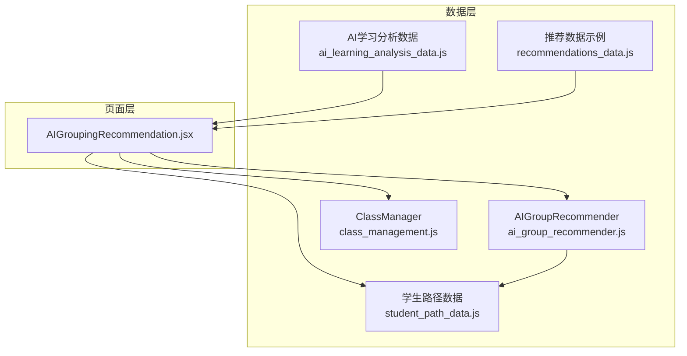
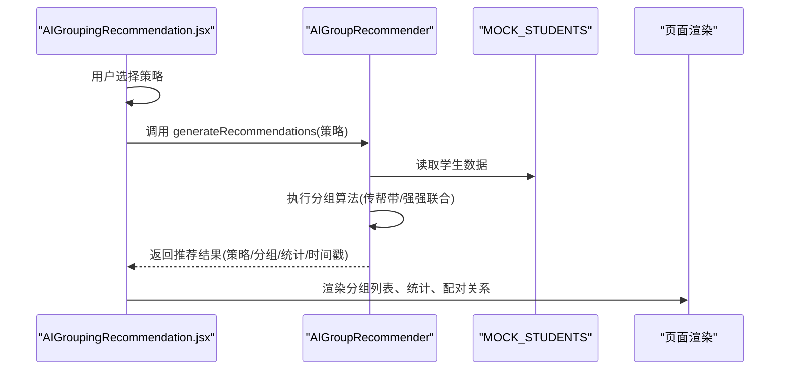
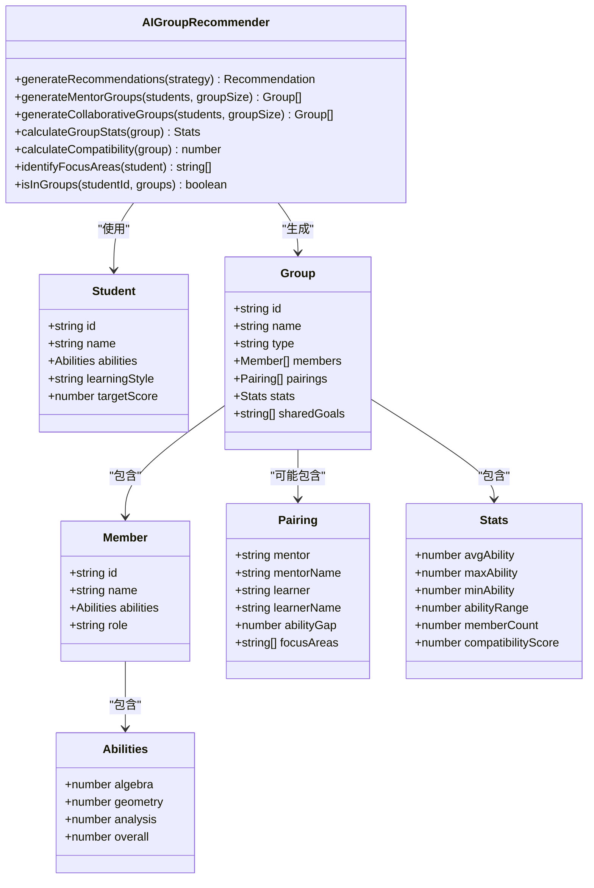
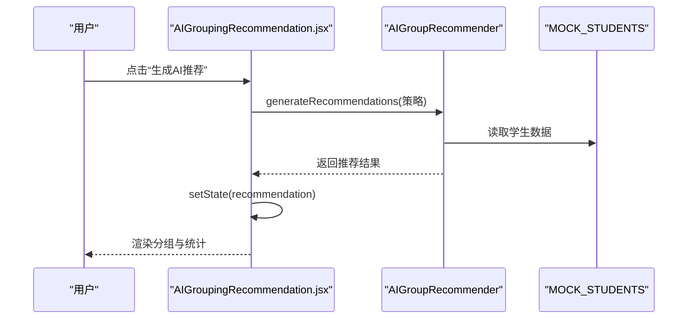
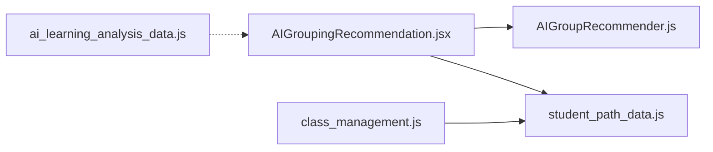

# AI推荐引擎API

<cite>
**本文引用的文件**
- [ai_group_recommender.js](file://src/data/ai_group_recommender.js)
- [ai_learning_analysis_data.js](file://src/data/ai_learning_analysis_data.js)
- [class_management.js](file://src/data/class_management.js)
- [AIGroupingRecommendation.jsx](file://src/pages/AIGroupingRecommendation.jsx)
- [student_path_data.js](file://src/data/student_path_data.js)
- [recommendations_data.js](file://src/data/recommendations_data.js)
</cite>

## 目录
1. [简介](#简介)
2. [项目结构](#项目结构)
3. [核心组件](#核心组件)
4. [架构总览](#架构总览)
5. [详细组件分析](#详细组件分析)
6. [依赖分析](#依赖分析)
7. [性能考虑](#性能考虑)
8. [故障排查指南](#故障排查指南)
9. [结论](#结论)
10. [附录](#附录)

## 简介
本文件面向AI驱动的推荐系统数据接口，围绕以下目标展开：
- 深入解析 ai_group_recommender.js 中的分组算法输入输出格式、特征向量结构与聚类逻辑
- 说明 ai_learning_analysis_data.js 中学习行为分析结果的数据组织方式
- 解释 class_management.js 中的班级分组策略配置
- 结合 AIGroupingRecommendation.jsx 页面展示推荐结果的前端集成方式
- 为每个API提供请求参数、响应结构、置信度指标与更新频率说明
- 包含推荐触发条件、冷启动处理、反馈闭环机制与性能调优建议

## 项目结构
本项目采用“数据层 + 页面层”的分层设计：
- 数据层：包含AI分组推荐器、学习分析数据、班级管理、学生路径数据等
- 页面层：包含AIGroupingRecommendation.jsx等页面，负责展示与交互

图表来源
- [ai_group_recommender.js](file://src/data/ai_group_recommender.js#L1-L214)
- [ai_learning_analysis_data.js](file://src/data/ai_learning_analysis_data.js#L1-L313)
- [class_management.js](file://src/data/class_management.js#L1-L66)
- [AIGroupingRecommendation.jsx](file://src/pages/AIGroupingRecommendation.jsx#L1-L269)
- [student_path_data.js](file://src/data/student_path_data.js#L1-L305)
- [recommendations_data.js](file://src/data/recommendations_data.js#L1-L164)

章节来源
- [ai_group_recommender.js](file://src/data/ai_group_recommender.js#L1-L214)
- [AIGroupingRecommendation.jsx](file://src/pages/AIGroupingRecommendation.jsx#L1-L269)

## 核心组件
- AIGroupRecommender：提供分组策略与推荐生成能力，支持传帮带、强强联合等策略
- AI学习分析数据：提供综合学情、维度分析、预测与对比等结构化数据
- ClassManager：提供班级列表、当前班级、班级学生查询等能力
- AIGroupingRecommendation页面：前端集成与展示，触发生成、渲染分组与统计

章节来源
- [ai_group_recommender.js](file://src/data/ai_group_recommender.js#L1-L214)
- [ai_learning_analysis_data.js](file://src/data/ai_learning_analysis_data.js#L1-L313)
- [class_management.js](file://src/data/class_management.js#L1-L66)
- [AIGroupingRecommendation.jsx](file://src/pages/AIGroupingRecommendation.jsx#L1-L269)

## 架构总览
AI推荐引擎由“数据源 + 推荐器 + 展示层”构成：
- 数据源：MOCK_STUDENTS、AI_LEARNING_ANALYSIS_DATA、TEACHER_CLASSES
- 推荐器：AIGroupRecommender.generateRecommendations
- 展示层：AIGroupingRecommendation.jsx 渲染策略选择、生成推荐、展示分组与统计

图表来源
- [AIGroupingRecommendation.jsx](file://src/pages/AIGroupingRecommendation.jsx#L1-L269)
- [ai_group_recommender.js](file://src/data/ai_group_recommender.js#L190-L209)
- [student_path_data.js](file://src/data/student_path_data.js#L1-L80)

## 详细组件分析

### AIGroupRecommender 分组算法
- 输入
  - 策略标识：mentor（传帮带）、collaborative（强强联合）
  - 学生集合：MOCK_STUDENTS（包含id、name、abilities、learningStyle、targetScore等）
  - 可选参数：groupSize（默认3），用于控制每组人数
- 输出
  - 推荐对象包含：
    - strategy：策略标识
    - groups：分组数组，每组包含：
      - id、name、type（mentor/collaborative/balanced）
      - members：成员数组，含id、name、abilities、role（mentor/learner/member）
      - stats：组统计，包含avgAbility、maxAbility、minAbility、abilityRange、memberCount、compatibilityScore
      - pairings：配对关系（传帮带策略），含mentor、learner、abilityGap、focusAreas
      - sharedGoals：共同目标（强强联合策略）
    - timestamp：生成时间
    - totalStudents、groupCount：统计信息
- 特征向量结构
  - abilities：包含algebra、geometry、analysis、overall等维度
  - learningStyle：visual、logical、practical
  - targetScore：目标分数
- 聚类/分组逻辑
  - 传帮带（mentor）：按overall降序排序，每组1位导师+若干学员；计算abilityGap与focusAreas；统计compatibilityScore
  - 强强联合（collaborative）：按overall降序分组，按平均能力设定sharedGoals；统计compatibilityScore
  - 公共统计：计算avgAbility、abilityRange、memberCount，并据此计算compatibilityScore
- 置信度指标
  - compatibilityScore：范围0~1，传帮带策略偏好适度差距，强强联合策略偏好较小差距
- 更新频率
  - 当前实现为一次性生成，未内置缓存或定时刷新逻辑；建议在页面侧按需触发或引入本地缓存

图表来源
- [ai_group_recommender.js](file://src/data/ai_group_recommender.js#L31-L209)
- [student_path_data.js](file://src/data/student_path_data.js#L1-L80)

章节来源
- [ai_group_recommender.js](file://src/data/ai_group_recommender.js#L31-L209)
- [student_path_data.js](file://src/data/student_path_data.js#L1-L80)

### AI学习分析数据组织
- 数据结构
  - comprehensiveAnalysis：综合学情
    - overallAssessment：等级、分数、摘要、表情符号
    - learningState：状态、描述、颜色
    - keyFindings：亮点（id、type、icon、title、content、color）
    - strengths/improvements：优势与改进维度（dimension、score、description、建议）
    - recommendations：建议（priority、icon、title、reason、actions、expectedResult、timeframe）
    - prediction：短期/长期预测（period、expectedProgress、confidence、milestones、goalAchievement）
    - comparison：vs上周、vs班级均值、vs尖子生（progressDiff/accuracyDiff/ranking/percentile/gap/mainDifference、catchUpPlan）
    - encouragement：鼓励语
  - dimensionAnalysis：维度与知识点分析
    - abilities：维度分析（dimension、score、trend、analysis、strengths、improvements、resources）
    - knowledgePoints：知识点（mastered/learning/weak/locked，含topics、analysis、focusPoints、urgency、nextToUnlock、unlockCondition、estimatedUnlockDate）
- 使用场景
  - 页面通过导入AI_LEARNING_ANALYSIS_DATA进行渲染展示，如学习报告详情页、建议页等

章节来源
- [ai_learning_analysis_data.js](file://src/data/ai_learning_analysis_data.js#L1-L313)

### 班级分组策略配置
- 策略类型
  - mentor：传帮带
  - collaborative：强强联合
  - balanced：均衡分组（预留）
- ClassManager
  - getAllClasses：返回班级列表
  - getCurrentClass：从本地存储读取当前班级
  - setCurrentClass：设置当前班级
  - getClassStudents：根据班级ID获取学生（当前返回MOCK_STUDENTS）

章节来源
- [ai_group_recommender.js](file://src/data/ai_group_recommender.js#L6-L28)
- [class_management.js](file://src/data/class_management.js#L1-L66)
- [student_path_data.js](file://src/data/student_path_data.js#L1-L80)

### 前端集成与展示（AIGroupingRecommendation.jsx）
- 功能要点
  - 策略选择：渲染GROUP_STRATEGIES，支持切换
  - 生成推荐：调用AIGroupRecommender.generateRecommendations，设置recommendation状态
  - 展示分组：渲染groups，显示组统计（平均能力、最高/最低能力、能力差距、成员数）、兼容度星级与百分比
  - 成员列表：展示成员基本信息与角色（导师/学员/成员）
  - 传帮带配对：展示mentor→learner与focusAreas
  - 共同目标：展示sharedGoals
  - 操作按钮：采纳分组（当前为提示）、调整成员
- 交互流程

图表来源
- [AIGroupingRecommendation.jsx](file://src/pages/AIGroupingRecommendation.jsx#L1-L269)
- [ai_group_recommender.js](file://src/data/ai_group_recommender.js#L190-L209)
- [student_path_data.js](file://src/data/student_path_data.js#L1-L80)

章节来源
- [AIGroupingRecommendation.jsx](file://src/pages/AIGroupingRecommendation.jsx#L1-L269)

## 依赖分析
- 模块耦合
  - AIGroupingRecommendation.jsx 依赖 AIGroupRecommender 与 MOCK_STUDENTS
  - ClassManager 依赖 student_path_data.js 的MOCK_STUDENTS（当前）
  - AI学习分析数据独立于分组推荐器，供学习报告等页面使用
- 外部依赖
  - lucide-react 图标库
  - react-router-dom 导航

图表来源
- [AIGroupingRecommendation.jsx](file://src/pages/AIGroupingRecommendation.jsx#L1-L269)
- [ai_group_recommender.js](file://src/data/ai_group_recommender.js#L1-L214)
- [class_management.js](file://src/data/class_management.js#L1-L66)
- [student_path_data.js](file://src/data/student_path_data.js#L1-L305)
- [ai_learning_analysis_data.js](file://src/data/ai_learning_analysis_data.js#L1-L313)

章节来源
- [AIGroupingRecommendation.jsx](file://src/pages/AIGroupingRecommendation.jsx#L1-L269)
- [ai_group_recommender.js](file://src/data/ai_group_recommender.js#L1-L214)
- [class_management.js](file://src/data/class_management.js#L1-L66)
- [student_path_data.js](file://src/data/student_path_data.js#L1-L305)
- [ai_learning_analysis_data.js](file://src/data/ai_learning_analysis_data.js#L1-L313)

## 性能考虑
- 时间复杂度
  - 传帮带：排序O(n log n)，分组遍历O(n)，总体O(n log n)
  - 强强联合：排序O(n log n)，分组遍历O(n)，总体O(n log n)
  - 统计计算与兼容度评分均为O(n)
- 空间复杂度
  - 输出groups为O(n)
- 优化建议
  - 缓存策略：对相同策略与学生集合的结果进行本地缓存，减少重复计算
  - 并行化：若学生规模扩大，可考虑Web Worker或分片处理
  - 懒加载：仅在用户点击生成时执行算法
  - 前端渲染：对大数据量分页或虚拟滚动优化

[本节为通用性能讨论，不直接分析具体文件]

## 故障排查指南
- 无推荐结果
  - 检查是否选择了策略并点击生成
  - 确认MOCK_STUDENTS是否为空
- 分组异常
  - 检查学生abilities字段是否完整
  - 确认传帮带策略下是否存在重复分组
- 班级学生为空
  - ClassManager.getClassStudents当前返回MOCK_STUDENTS，若需真实数据，请替换为按classId查询
- 建议与资源
  - 参考recommendations_data.js的结构，确保页面正确消费weeklyPlan、actionItems等

章节来源
- [AIGroupingRecommendation.jsx](file://src/pages/AIGroupingRecommendation.jsx#L1-L269)
- [class_management.js](file://src/data/class_management.js#L54-L60)
- [recommendations_data.js](file://src/data/recommendations_data.js#L1-L164)

## 结论
本AI推荐引擎以简洁的数据结构与明确的分组策略为核心，实现了从学生特征到分组结果的端到端流程。通过AIGroupingRecommendation.jsx的前端集成，用户可直观地查看推荐方案、组统计与兼容度。建议后续完善冷启动处理、反馈闭环与性能优化，以适配更大规模与更丰富的业务场景。

[本节为总结性内容，不直接分析具体文件]

## 附录

### API定义与规范

- 生成分组推荐
  - 请求参数
    - strategy：字符串，可选值为 mentor 或 collaborative
    - groupSize：可选，整数，默认3
  - 响应结构
    - strategy：策略标识
    - groups：数组，元素包含
      - id、name、type
      - members：数组，元素包含id、name、abilities、role
      - stats：对象，包含avgAbility、maxAbility、minAbility、abilityRange、memberCount、compatibilityScore
      - pairings：传帮带策略的配对关系数组（可选）
      - sharedGoals：强强联合策略的共同目标数组（可选）
    - timestamp：ISO时间字符串
    - totalStudents、groupCount：整数
  - 置信度指标
    - compatibilityScore：0~1之间的数值，用于衡量组内匹配度
  - 更新频率
    - 当前实现为一次性生成；建议在页面侧按需触发或引入缓存

- 获取班级列表
  - 请求参数：无
  - 响应结构：数组，元素包含id、name、grade、subject、studentCount、description、classTeacher、schedule

- 获取当前班级
  - 请求参数：无
  - 响应结构：单个班级对象（若无记录则返回默认班级）

- 设置当前班级
  - 请求参数：classId（字符串）
  - 响应结构：无

- 获取班级学生
  - 请求参数：classId（字符串）
  - 响应结构：MOCK_STUDENTS（当前实现），后续应改为按classId查询真实数据

- 学习分析数据
  - 请求参数：无
  - 响应结构：AI_LEARNING_ANALYSIS_DATA（综合学情、维度分析、预测、对比、鼓励语等）

章节来源
- [ai_group_recommender.js](file://src/data/ai_group_recommender.js#L190-L209)
- [class_management.js](file://src/data/class_management.js#L36-L60)
- [ai_learning_analysis_data.js](file://src/data/ai_learning_analysis_data.js#L1-L313)