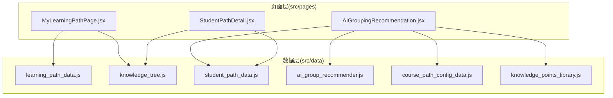
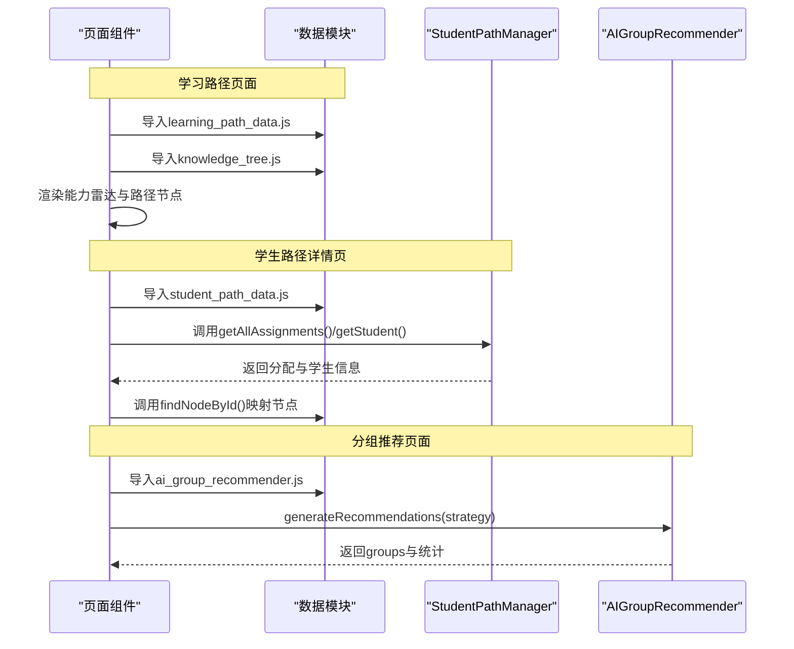
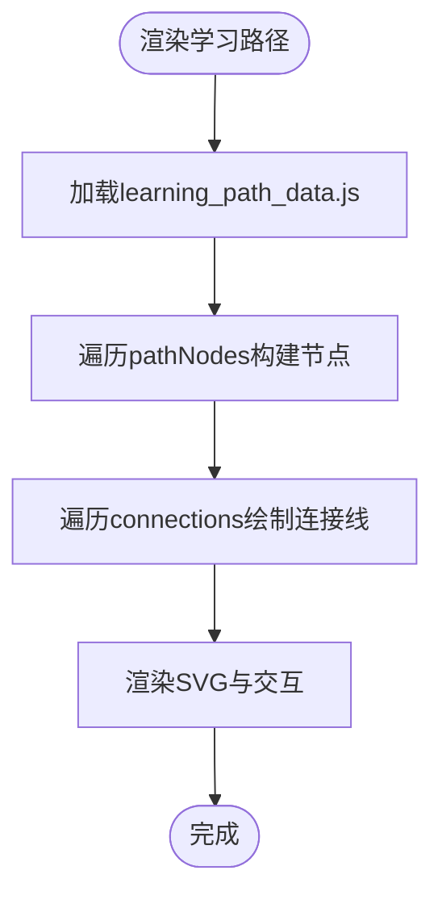
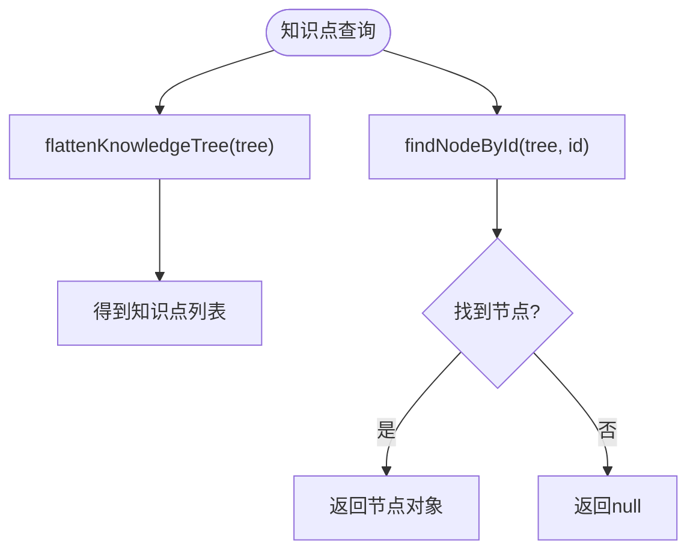
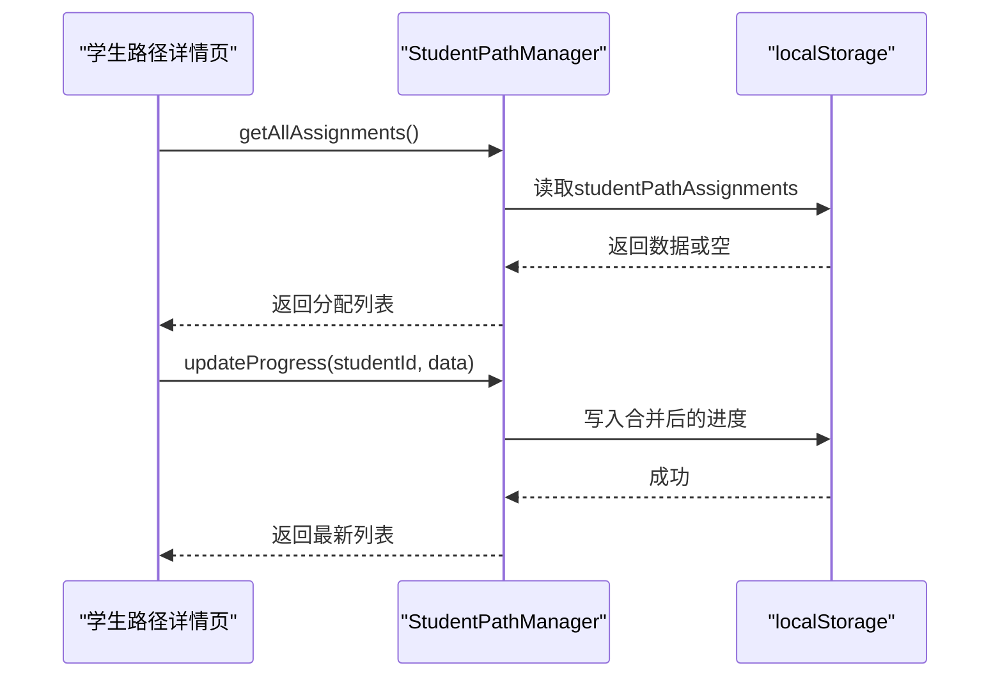
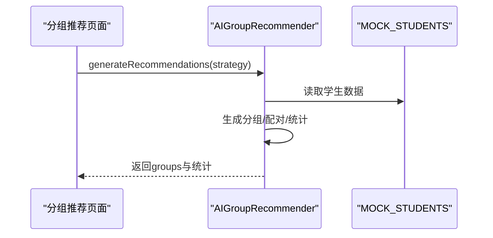
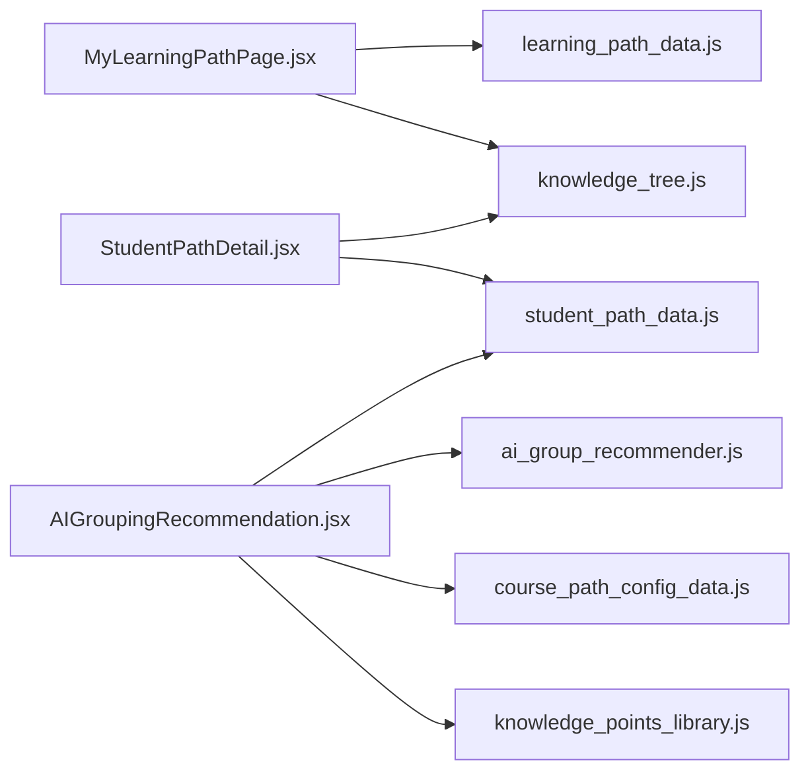

# API参考

<cite>
**本文档引用的文件**
- [src/data/learning_path_data.js](file://src/data/learning_path_data.js)
- [src/data/knowledge_tree.js](file://src/data/knowledge_tree.js)
- [src/data/student_path_data.js](file://src/data/student_path_data.js)
- [src/data/ai_group_recommender.js](file://src/data/ai_group_recommender.js)
- [src/data/course_path_config_data.js](file://src/data/course_path_config_data.js)
- [src/pages/MyLearningPathPage.jsx](file://src/pages/MyLearningPathPage.jsx)
- [src/pages/AIGroupingRecommendation.jsx](file://src/pages/AIGroupingRecommendation.jsx)
- [src/pages/StudentPathDetail.jsx](file://src/pages/StudentPathDetail.jsx)
- [src/data/knowledge_points_library.js](file://src/data/knowledge_points_library.js)
</cite>

## 目录
1. [简介](#简介)
2. [项目结构](#项目结构)
3. [核心数据模型](#核心数据模型)
4. [架构总览](#架构总览)
5. [详细组件分析](#详细组件分析)
6. [依赖关系分析](#依赖关系分析)
7. [性能考量](#性能考量)
8. [故障排查指南](#故障排查指南)
9. [结论](#结论)

## 简介
本API参考聚焦于src/data目录下的核心数据模型与配置，涵盖以下主题：
- 学习路径数据结构：学习路径节点、连接关系、能力模型与个性化建议
- 知识点层级关系：层级化知识点树、扁平化与路径查询辅助函数
- 学生路径实例：学生能力画像、路径分配、进度与活动日志
- 分组算法输入输出：基于学生能力的智能分组策略与推荐结果

本文将为每个数据模型定义字段名称、数据类型、约束条件与业务含义，并提供JSON示例与使用场景，帮助开发者在组件中正确引用与操作这些数据。

## 项目结构
- 数据层位于src/data，包含学习路径、知识点树、学生路径、分组算法与课程配置等数据文件
- 页面层位于src/pages，通过导入数据文件在组件中消费数据，如学习路径页面、分组推荐页面、学生路径详情页

图表来源
- [src/data/learning_path_data.js](file://src/data/learning_path_data.js#L1-L182)
- [src/data/knowledge_tree.js](file://src/data/knowledge_tree.js#L1-L378)
- [src/data/student_path_data.js](file://src/data/student_path_data.js#L1-L305)
- [src/data/ai_group_recommender.js](file://src/data/ai_group_recommender.js#L1-L215)
- [src/data/course_path_config_data.js](file://src/data/course_path_config_data.js#L1-L333)
- [src/pages/MyLearningPathPage.jsx](file://src/pages/MyLearningPathPage.jsx#L1-L673)
- [src/pages/AIGroupingRecommendation.jsx](file://src/pages/AIGroupingRecommendation.jsx#L1-L269)
- [src/pages/StudentPathDetail.jsx](file://src/pages/StudentPathDetail.jsx#L1-L361)

章节来源
- [src/data/learning_path_data.js](file://src/data/learning_path_data.js#L1-L182)
- [src/data/knowledge_tree.js](file://src/data/knowledge_tree.js#L1-L378)
- [src/data/student_path_data.js](file://src/data/student_path_data.js#L1-L305)
- [src/data/ai_group_recommender.js](file://src/data/ai_group_recommender.js#L1-L215)
- [src/data/course_path_config_data.js](file://src/data/course_path_config_data.js#L1-L333)
- [src/pages/MyLearningPathPage.jsx](file://src/pages/MyLearningPathPage.jsx#L1-L673)
- [src/pages/AIGroupingRecommendation.jsx](file://src/pages/AIGroupingRecommendation.jsx#L1-L269)
- [src/pages/StudentPathDetail.jsx](file://src/pages/StudentPathDetail.jsx#L1-L361)

## 核心数据模型

### 学习路径数据 learning_path_data.js
- 文件作用：提供“我的学习路径”页面所需的能力模型、个性化建议、路径节点与连接关系
- 关键对象与字段
  - abilityModel
    - 字段：studentName、currentGoal、categories[]、learningGoal、targetTime、studyDuration
    - 类型：字符串、字符串、数组对象、字符串、字符串、字符串
    - 约束：categories元素包含name、value、max；value与max均为数值
    - 业务含义：展示学生能力雷达、目标班级、学习目标、预计时长等
  - aiRecommendation
    - 字段：title、suggestion
    - 类型：字符串、字符串
    - 业务含义：个性化学习建议标题与建议内容
  - pathNodes[]
    - 字段：id、label、stage、status、progress、description、stats、position、color
    - 类型：字符串、字符串、整数、枚举字符串、整数、字符串、对象、对象、十六进制颜色
    - 约束：status取值范围为"completed"|"current"|"locked"；position包含x、y；stats包含resources、exercises、questions
    - 业务含义：路径节点的标识、标签、阶段、状态、进度、描述、统计、坐标与颜色
  - connections[]
    - 字段：from、to
    - 类型：字符串、字符串
    - 约束：from与to必须存在于pathNodes.id集合中
    - 业务含义：节点之间的连接关系，形成有向流程图

- 使用场景
  - 在学习路径页面渲染能力雷达图、节点流程图与连接线
  - 根据节点状态切换样式与交互行为
  - 通过connections绘制贝塞尔曲线连接线

章节来源
- [src/data/learning_path_data.js](file://src/data/learning_path_data.js#L1-L182)
- [src/pages/MyLearningPathPage.jsx](file://src/pages/MyLearningPathPage.jsx#L1-L673)

### 知识点层级关系 knowledge_tree.js
- 文件作用：提供层级化知识点树，支持扁平化、路径查询与节点查找
- 关键对象与字段
  - KNOWLEDGE_TREE
    - 字段：id、name、level、children[]
    - 类型：字符串、字符串、整数、数组对象
    - 约束：level为0/1/2/3；level=3为叶子节点（实际知识点）
    - 业务含义：高中数学知识点的层级结构
  - 扁平化函数 flattenKnowledgeTree(tree)
    - 输出：数组，元素包含id、name、estimatedHours、difficulty、tags、path
    - 业务含义：将树结构转换为知识点列表，便于搜索与选择
  - 路径查询函数 getNodePath(nodeId)
    - 输出：字符串，用“>”拼接的路径
    - 业务含义：根据节点ID生成从根到该节点的路径文本
  - 节点查找函数 findNodeById(tree, targetId)
    - 输出：节点对象或null
    - 业务含义：在树中定位指定ID的节点

- 使用场景
  - 在学生路径详情页将assignment中的知识点ID映射为节点名称与状态
  - 在知识点选择界面提供层级浏览与面包屑导航

章节来源
- [src/data/knowledge_tree.js](file://src/data/knowledge_tree.js#L1-L378)
- [src/pages/StudentPathDetail.jsx](file://src/pages/StudentPathDetail.jsx#L1-L361)

### 学生路径实例 student_path_data.js
- 文件作用：提供学生能力画像、路径分配、进度与活动日志，以及路径管理类
- 关键对象与字段
  - MOCK_STUDENTS[]
    - 字段：id、name、studentId、class、avatar、abilities、learningStyle、targetScore
    - 类型：字符串、字符串、字符串、字符串、字符串、对象、字符串、数值
    - 约束：abilities包含algebra、geometry、analysis、overall；learningStyle取值为"visual"|"logical"|"practical"
    - 业务含义：学生基本信息与能力画像
  - STUDENT_PATH_ASSIGNMENTS[]
    - 字段：studentId、pathId、pathName、assignedDate、progress、estimatedCompletion、actualHoursSpent、activityLogs[]
    - 类型：字符串、字符串、字符串、字符串、对象、字符串、数值、数组对象
    - 约束：progress包含completedNodes[]、currentNode、totalNodes、percentage；activityLogs元素包含type、timestamp、title、duration、details、status；type取值为"study"|"exercise"|"resource"|"agent"|"system"
    - 业务含义：学生路径分配、进度统计与学习轨迹日志
  - StudentPathManager
    - 方法：getAllAssignments()、assignPath(studentId, pathId, pathName)、updateProgress(studentId, progressData)、getStudent(studentId)、getClassStats()
    - 业务含义：封装本地存储与路径管理逻辑

- 使用场景
  - 在学生路径详情页展示能力雷达、路径图、学习轨迹
  - 在教师端进行路径分配与进度统计

章节来源
- [src/data/student_path_data.js](file://src/data/student_path_data.js#L1-L305)
- [src/pages/StudentPathDetail.jsx](file://src/pages/StudentPathDetail.jsx#L1-L361)

### 分组算法输入输出 ai_group_recommender.js
- 文件作用：提供基于学生能力的智能分组策略与推荐结果
- 关键对象与字段
  - GROUP_STRATEGIES
    - 字段：mentor、collaborative、balanced
    - 类型：对象字典，每个条目包含id、name、description、icon、color
    - 业务含义：三种分组策略的元数据
  - AIGroupRecommender
    - 方法：generateMentorGroups(students, groupSize)、generateCollaborativeGroups(students, groupSize)、generateRecommendations(strategy)
    - 输出：对象，包含strategy、groups[]、timestamp、totalStudents、groupCount
    - groups[]元素字段：id、name、type、members[]、pairings[]（传帮带）、sharedGoals[]（强强联合）、stats
    - members[]元素字段：id、name、abilities、learningStyle、role、avatar
    - pairings[]元素字段：mentor、mentorName、learner、learnerName、abilityGap、focusAreas
    - stats字段：avgAbility、maxAbility、minAbility、abilityRange、memberCount、compatibilityScore
    - 业务含义：根据策略生成小组，计算组内统计与匹配度

- 使用场景
  - 在AI智能学习小组推荐页面展示分组策略、推荐方案与组内成员信息

章节来源
- [src/data/ai_group_recommender.js](file://src/data/ai_group_recommender.js#L1-L215)
- [src/pages/AIGroupingRecommendation.jsx](file://src/pages/AIGroupingRecommendation.jsx#L1-L269)

### 课程学习路径配置 course_path_config_data.js
- 文件作用：提供难度级别、学习路径模板与默认课程配置
- 关键对象与字段
  - DIFFICULTY_LEVELS
    - 字段：simple、medium、hard
    - 类型：对象字典，每个条目包含id、label、color、description、totalKnowledgePoints、estimatedHours、targetScore
    - 业务含义：不同难度级别的配置
  - LEARNING_PATH_TEMPLATES
    - 字段：simple、medium、hard
    - 类型：对象字典，每个条目包含pathNodes[]、connections[]
    - 业务含义：按难度预设的学习路径节点与连接关系
  - DEFAULT_COURSE_CONFIG
    - 字段：difficulty、userTypeAdaptation
    - 类型：对象，userTypeAdaptation包含visual、academic、logical，每个包含preferredTypes[]与additionalResources[]
    - 业务含义：默认课程配置与用户类型适配

- 使用场景
  - 作为教师路径编辑与课程设置的基础配置

章节来源
- [src/data/course_path_config_data.js](file://src/data/course_path_config_data.js#L1-L333)

## 架构总览
下图展示了数据模型与页面组件之间的交互关系，以及分组算法与学生数据的耦合方式。

图表来源
- [src/pages/MyLearningPathPage.jsx](file://src/pages/MyLearningPathPage.jsx#L1-L673)
- [src/pages/StudentPathDetail.jsx](file://src/pages/StudentPathDetail.jsx#L1-L361)
- [src/pages/AIGroupingRecommendation.jsx](file://src/pages/AIGroupingRecommendation.jsx#L1-L269)
- [src/data/learning_path_data.js](file://src/data/learning_path_data.js#L1-L182)
- [src/data/knowledge_tree.js](file://src/data/knowledge_tree.js#L1-L378)
- [src/data/student_path_data.js](file://src/data/student_path_data.js#L1-L305)
- [src/data/ai_group_recommender.js](file://src/data/ai_group_recommender.js#L1-L215)

## 详细组件分析

### 学习路径数据模型（learning_path_data.js）
- 数据结构要点
  - abilityModel.categories[]：雷达图维度数据，包含name、value、max
  - pathNodes[]：节点数组，包含位置、状态、进度与统计
  - connections[]：节点连接关系，用于绘制流程图
- 复杂度与性能
  - 渲染流程图时，connections数量与pathNodes数量直接影响SVG绘制开销
  - 建议在大数据量时采用虚拟化或分批渲染策略
- 错误处理
  - 节点状态非法时，应降级为默认样式
  - 连接关系缺失时，应避免绘制无效连线

图表来源
- [src/data/learning_path_data.js](file://src/data/learning_path_data.js#L1-L182)
- [src/pages/MyLearningPathPage.jsx](file://src/pages/MyLearningPathPage.jsx#L1-L673)

章节来源
- [src/data/learning_path_data.js](file://src/data/learning_path_data.js#L1-L182)
- [src/pages/MyLearningPathPage.jsx](file://src/pages/MyLearningPathPage.jsx#L1-L673)

### 知识点层级关系（knowledge_tree.js）
- 数据结构要点
  - KNOWLEDGE_TREE：树形结构，level=3为叶子节点
  - flattenKnowledgeTree：O(N)遍历，N为节点总数
  - getNodePath/findNodeById：递归查找，最坏O(N)
- 性能优化建议
  - 对频繁查询的节点建立索引缓存
  - 在扁平化时仅收集level=3节点，减少冗余

图表来源
- [src/data/knowledge_tree.js](file://src/data/knowledge_tree.js#L1-L378)

章节来源
- [src/data/knowledge_tree.js](file://src/data/knowledge_tree.js#L1-L378)
- [src/pages/StudentPathDetail.jsx](file://src/pages/StudentPathDetail.jsx#L1-L361)

### 学生路径实例（student_path_data.js）
- 数据结构要点
  - MOCK_STUDENTS：学生能力画像与学习风格
  - STUDENT_PATH_ASSIGNMENTS：路径分配、进度与活动日志
  - StudentPathManager：封装本地存储与路径管理
- 使用建议
  - 在更新进度时合并现有进度，避免覆盖
  - activityLogs按时间戳排序，确保展示顺序正确

图表来源
- [src/data/student_path_data.js](file://src/data/student_path_data.js#L1-L305)
- [src/pages/StudentPathDetail.jsx](file://src/pages/StudentPathDetail.jsx#L1-L361)

章节来源
- [src/data/student_path_data.js](file://src/data/student_path_data.js#L1-L305)
- [src/pages/StudentPathDetail.jsx](file://src/pages/StudentPathDetail.jsx#L1-L361)

### 分组算法（ai_group_recommender.js）
- 策略说明
  - 传帮带：每组1名导师（高能力）+ 若干学员（低能力），生成配对关系与关注领域
  - 强强联合：按能力排序分组，设定共同目标
  - 均衡分组：按能力范围划分组别
- 输入输出
  - 输入：MOCK_STUDENTS（来自student_path_data.js）
  - 输出：generateRecommendations返回包含strategy、groups、timestamp、统计信息的对象
- 性能与约束
  - 分组算法复杂度与学生数量线性相关
  - compatibilityScore根据策略类型计算，用于评估分组质量

图表来源
- [src/data/ai_group_recommender.js](file://src/data/ai_group_recommender.js#L1-L215)
- [src/pages/AIGroupingRecommendation.jsx](file://src/pages/AIGroupingRecommendation.jsx#L1-L269)

章节来源
- [src/data/ai_group_recommender.js](file://src/data/ai_group_recommender.js#L1-L215)
- [src/pages/AIGroupingRecommendation.jsx](file://src/pages/AIGroupingRecommendation.jsx#L1-L269)

## 依赖关系分析
- 组件与数据模块的依赖
  - MyLearningPathPage.jsx 依赖 learning_path_data.js 与 knowledge_tree.js
  - StudentPathDetail.jsx 依赖 student_path_data.js 与 knowledge_tree.js
  - AIGroupingRecommendation.jsx 依赖 ai_group_recommender.js 与 student_path_data.js
- 数据模块间的耦合
  - ai_group_recommender.js 依赖 student_path_data.js 提供的MOCK_STUDENTS
  - student_path_data.js 与 knowledge_tree.js 协作用于路径详情页的节点映射

图表来源
- [src/pages/MyLearningPathPage.jsx](file://src/pages/MyLearningPathPage.jsx#L1-L673)
- [src/pages/StudentPathDetail.jsx](file://src/pages/StudentPathDetail.jsx#L1-L361)
- [src/pages/AIGroupingRecommendation.jsx](file://src/pages/AIGroupingRecommendation.jsx#L1-L269)
- [src/data/learning_path_data.js](file://src/data/learning_path_data.js#L1-L182)
- [src/data/knowledge_tree.js](file://src/data/knowledge_tree.js#L1-L378)
- [src/data/student_path_data.js](file://src/data/student_path_data.js#L1-L305)
- [src/data/ai_group_recommender.js](file://src/data/ai_group_recommender.js#L1-L215)
- [src/data/course_path_config_data.js](file://src/data/course_path_config_data.js#L1-L333)
- [src/data/knowledge_points_library.js](file://src/data/knowledge_points_library.js#L1-L214)

章节来源
- [src/pages/MyLearningPathPage.jsx](file://src/pages/MyLearningPathPage.jsx#L1-L673)
- [src/pages/StudentPathDetail.jsx](file://src/pages/StudentPathDetail.jsx#L1-L361)
- [src/pages/AIGroupingRecommendation.jsx](file://src/pages/AIGroupingRecommendation.jsx#L1-L269)
- [src/data/learning_path_data.js](file://src/data/learning_path_data.js#L1-L182)
- [src/data/knowledge_tree.js](file://src/data/knowledge_tree.js#L1-L378)
- [src/data/student_path_data.js](file://src/data/student_path_data.js#L1-L305)
- [src/data/ai_group_recommender.js](file://src/data/ai_group_recommender.js#L1-L215)
- [src/data/course_path_config_data.js](file://src/data/course_path_config_data.js#L1-L333)
- [src/data/knowledge_points_library.js](file://src/data/knowledge_points_library.js#L1-L214)

## 性能考量
- 渲染性能
  - 学习路径流程图节点与连接线数量较多时，建议采用虚拟滚动或分页渲染
  - 贝塞尔曲线连接线在大量节点时可能造成重绘压力，可考虑延迟绘制或简化样式
- 查询性能
  - 知识点树的扁平化与路径查询为O(N)，建议在首次加载后缓存结果
  - findNodeById为递归查找，建议在高频场景下增加索引
- 存储与更新
  - StudentPathManager使用localStorage，频繁写入可能导致阻塞，建议批量更新与节流
- 分组算法
  - 分组算法复杂度与学生数量线性相关，建议在大数据量时异步执行或分批处理

## 故障排查指南
- 节点状态异常
  - 现象：节点样式不符合预期
  - 排查：确认pathNodes[].status取值是否为"completed"|"current"|"locked"
- 连接关系缺失
  - 现象：流程图缺少连线
  - 排查：确认connections[].from与[].to是否存在于pathNodes[].id集合
- 节点映射失败
  - 现象：学生路径详情页无法显示节点名称
  - 排查：确认assignment.progress.completedNodes/currentNode中的ID与KNOWLEDGE_TREE中的ID一致
- 分组结果为空
  - 现象：generateRecommendations返回空组
  - 排查：确认MOCK_STUDENTS是否存在且具备abilities字段；groupSize是否合理
- 本地存储异常
  - 现象：进度更新后未持久化
  - 排查：确认localStorage可用；StudentPathManager.updateProgress是否调用成功

章节来源
- [src/data/learning_path_data.js](file://src/data/learning_path_data.js#L1-L182)
- [src/data/knowledge_tree.js](file://src/data/knowledge_tree.js#L1-L378)
- [src/data/student_path_data.js](file://src/data/student_path_data.js#L1-L305)
- [src/data/ai_group_recommender.js](file://src/data/ai_group_recommender.js#L1-L215)

## 结论
本文档系统梳理了src/data目录的核心数据模型与配置，明确了字段定义、约束条件与业务含义，并结合页面组件展示了数据在UI中的使用方式。开发者可据此在组件中正确引用与操作这些数据，同时遵循性能与错误处理的最佳实践，确保学习路径、知识点层级、学生路径与分组算法的稳定运行。