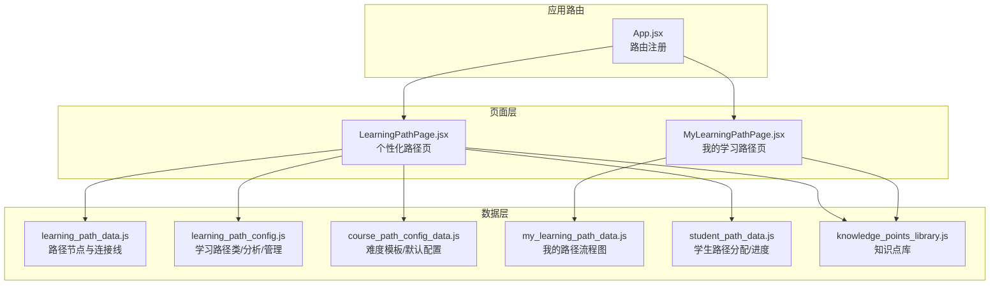
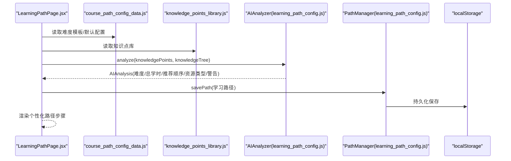
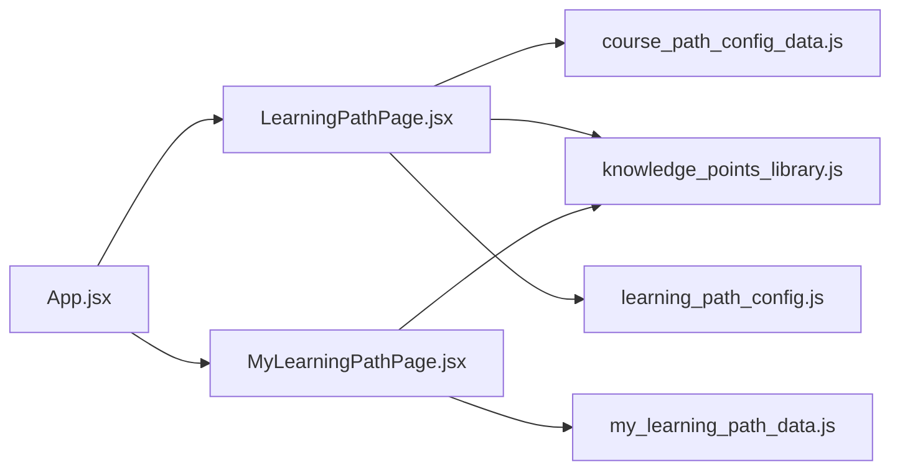

# 学习路径API

<cite>
**本文引用的文件列表**
- [learning_path_data.js](file://src/data/learning_path_data.js)
- [learning_path_config.js](file://src/data/learning_path_config.js)
- [course_path_config_data.js](file://src/data/course_path_config_data.js)
- [my_learning_path_data.js](file://src/data/my_learning_path_data.js)
- [LearningPathPage.jsx](file://src/pages/LearningPathPage.jsx)
- [MyLearningPathPage.jsx](file://src/pages/MyLearningPathPage.jsx)
- [App.jsx](file://src/App.jsx)
- [student_path_data.js](file://src/data/student_path_data.js)
- [knowledge_points_library.js](file://src/data/knowledge_points_library.js)
</cite>

## 目录
1. [简介](#简介)
2. [项目结构](#项目结构)
3. [核心组件](#核心组件)
4. [架构总览](#架构总览)
5. [详细组件分析](#详细组件分析)
6. [依赖分析](#依赖分析)
7. [性能考虑](#性能考虑)
8. [故障排查指南](#故障排查指南)
9. [结论](#结论)
10. [附录](#附录)

## 简介
本文件聚焦于gemini项目中“学习路径”相关数据模型与前端渲染的完整API文档，重点覆盖：
- learning_path_data.js中的路径节点结构、阶段配置与课程映射关系
- learning_path_config.js中的动态配置参数与AI分析模型
- 与LearningPathPage.jsx组件的数据绑定与交互机制
- 常见使用场景与错误处理策略

目标是帮助开发者与产品人员快速理解学习路径数据结构、字段语义、约束与默认值，并掌握在前端如何渲染与交互。

## 项目结构
学习路径相关的核心文件分布如下：
- 数据层：learning_path_data.js、learning_path_config.js、course_path_config_data.js、my_learning_path_data.js、student_path_data.js、knowledge_points_library.js
- 页面层：LearningPathPage.jsx、MyLearningPathPage.jsx
- 应用路由：App.jsx

图表来源
- [learning_path_data.js](file://src/data/learning_path_data.js#L1-L182)
- [learning_path_config.js](file://src/data/learning_path_config.js#L1-L180)
- [course_path_config_data.js](file://src/data/course_path_config_data.js#L1-L333)
- [my_learning_path_data.js](file://src/data/my_learning_path_data.js#L1-L148)
- [student_path_data.js](file://src/data/student_path_data.js#L82-L263)
- [knowledge_points_library.js](file://src/data/knowledge_points_library.js#L1-L214)
- [LearningPathPage.jsx](file://src/pages/LearningPathPage.jsx#L1-L166)
- [MyLearningPathPage.jsx](file://src/pages/MyLearningPathPage.jsx#L1-L673)
- [App.jsx](file://src/App.jsx#L24-L75)

章节来源
- [App.jsx](file://src/App.jsx#L24-L75)

## 核心组件
本节概述学习路径API的关键数据结构与职责边界。

- 路径节点与连接线
  - 节点包含：唯一标识、标签、阶段编号、状态、进度、描述、统计信息、坐标位置、颜色等
  - 连接线定义前后节点关系，支持主干与分支合并等拓扑
- 动态配置参数
  - 学习路径类：包含路径ID、名称、描述、知识点集合、学习顺序、创建/更新时间、AI建议等
  - AI分析类：难度评级、总学时、推荐顺序、资源类型、警告信息、时间戳
  - 路径管理工具：本地持久化、查询、保存、删除、复制
  - AI分析工具：基于知识点集合计算难度、推荐顺序、资源类型、生成警告
- 难度模板与默认配置
  - 预置简单/中等/困难模板，包含节点序列与连接关系
  - 默认课程配置：难度偏好、用户类型适配的资源偏好
- 知识点库
  - 知识点ID、名称、分类、描述、预估学时、难度、标签
- 学生路径分配
  - 学生与路径的分配关系、进度、活动日志等

章节来源
- [learning_path_data.js](file://src/data/learning_path_data.js#L1-L182)
- [learning_path_config.js](file://src/data/learning_path_config.js#L1-L180)
- [course_path_config_data.js](file://src/data/course_path_config_data.js#L1-L333)
- [knowledge_points_library.js](file://src/data/knowledge_points_library.js#L1-L214)
- [student_path_data.js](file://src/data/student_path_data.js#L82-L263)

## 架构总览
学习路径数据流从“模板/配置/知识点库”出发，经由“AI分析/管理工具”生成或更新“学习路径”，最终在“页面组件”中渲染与交互。

图表来源
- [LearningPathPage.jsx](file://src/pages/LearningPathPage.jsx#L1-L166)
- [course_path_config_data.js](file://src/data/course_path_config_data.js#L1-L333)
- [knowledge_points_library.js](file://src/data/knowledge_points_library.js#L1-L214)
- [learning_path_config.js](file://src/data/learning_path_config.js#L86-L172)
- [learning_path_config.js](file://src/data/learning_path_config.js#L30-L83)

## 详细组件分析

### learning_path_data.js：路径节点与连接线
- 能力模型与AI建议
  - 能力模型：学生姓名、当前目标、维度雷达图数据、学习目标、目标时间、学习时长等
  - AI建议：标题与建议内容
- 路径节点
  - 字段：id、label、stage、status、progress、description、stats、position、color
  - 状态：completed、current、locked
  - 统计：资源数、练习数、问题数
  - 位置：二维坐标用于流程图布局
  - 颜色：主题色，用于视觉区分
- 连接线
  - from、to：节点ID
  - 定义主干/分支/合并等拓扑关系

字段与约束说明
- id：字符串，唯一标识，建议使用短横线分隔的语义化ID
- label：字符串，节点显示名称
- stage：整数，阶段编号，用于分组与排序
- status：枚举值，"completed"/"current"/"locked"
- progress：整数百分比，0-100
- description：字符串，节点描述
- stats：对象，包含resources/exercises/questions
- position：对象，包含x/y坐标
- color：十六进制颜色字符串

JSON示例（简化）
- 节点示例
  - {
      "id": "linear-function",
      "label": "一次函数",
      "stage": 2,
      "status": "completed",
      "progress": 100,
      "description": "理解一次函数的定义、图像和性质...",
      "stats": { "resources": 8, "exercises": 35, "questions": 5 },
      "position": { "x": 300, "y": 300 },
      "color": "#3b82f6"
    }
- 连接线示例
  - { "from": "linear-function", "to": "equation-group" }

章节来源
- [learning_path_data.js](file://src/data/learning_path_data.js#L1-L182)

### learning_path_config.js：学习路径类、AI分析与管理
- LearningPath类
  - id：字符串，默认自动生成
  - name：字符串，默认"未命名路径"
  - description：字符串
  - knowledgePoints：数组，知识点ID集合
  - order：数组，学习顺序
  - createdAt/updatedAt：ISO时间戳
  - aiSuggestions：对象或null
- AIAnalysis类
  - difficulty：字符串，难度评级
  - totalHours：数字，总学时
  - recommendedOrder：数组，推荐学习顺序
  - resourceTypes：数组，推荐资源类型
  - warnings：数组，警告信息
  - timestamp：ISO时间戳
- PathManager工具
  - getAllPaths：从localStorage读取并实例化
  - savePath：保存或更新路径
  - deletePath：删除路径
  - getPath：按ID获取路径
  - duplicatePath：复制路径并重命名
- AIAnalyzer工具
  - analyze：聚合知识点，计算难度、总学时、推荐顺序、资源类型、警告
  - calculateDifficulty：按难度等级映射计算平均难度
  - suggestOrder：按ID排序生成推荐顺序
  - suggestResources：按难度给出资源类型
  - getWarnings：检查空集、数量过少/过多、总学时过长等

字段与约束说明
- id：字符串，全局唯一；若未提供则自动生成
- name/description：字符串，长度无硬性限制
- knowledgePoints：数组，元素为字符串ID
- order：数组，元素为字符串ID，应与knowledgePoints一致
- createdAt/updatedAt：ISO字符串
- aiSuggestions：任意对象，用于承载AI建议
- difficulty：枚举值，"基础"/"中等"/"高级"/"未知"
- totalHours：非负数
- recommendedOrder/resourceTypes/warnings：数组
- timestamp：ISO字符串

章节来源
- [learning_path_config.js](file://src/data/learning_path_config.js#L1-L180)

### course_path_config_data.js：难度模板与默认配置
- 难度级别
  - id、label、color、description、totalKnowledgePoints、estimatedHours、targetScore
- 学习路径模板
  - simple/medium/hard：每级包含pathNodes与connections
  - pathNodes：节点数组，含id、label、stage、status、progress、description、stats、position、color
  - connections：连接数组，from/to
- 默认课程配置
  - difficulty：默认难度
  - userTypeAdaptation：按视觉/学术/逻辑类型给出偏好资源类型与附加资源

字段与约束说明
- 难度级别：id为"simple"/"medium"/"hard"，其他字段为字符串/数字
- 模板节点：与learning_path_data.js节点字段一致
- 默认配置：userTypeAdaptation为对象，键为"visual"/"academic"/"logical"

章节来源
- [course_path_config_data.js](file://src/data/course_path_config_data.js#L1-L333)

### my_learning_path_data.js：我的学习路径流程图
- 能力模型：学生姓名、当前目标、目标分数、学习时长、雷达图维度、AI建议
- 流程节点：id、type(stage/branch)、title、stage、status、position、color
- 连接关系：from、to、type(main/branch/merge)

字段与约束说明
- type：枚举值，"stage"/"branch"
- status：枚举值，"completed"/"current"/"locked"
- 其他字段与learning_path_data.js类似

章节来源
- [my_learning_path_data.js](file://src/data/my_learning_path_data.js#L1-L148)

### LearningPathPage.jsx：前端渲染与交互
- 路由参数
  - difficulty：简单/中等/困难
  - userType：视觉/学术/逻辑
- 动态内容
  - 根据userType生成不同的步骤集合，包含id、title、type、status、score等
- 交互
  - 点击左侧时间线节点，右侧详情面板切换
  - 根据status渲染不同按钮（开始学习/暂未解锁/再次复习）

字段与约束说明
- steps：数组，元素包含id、title、type、status、score等
- selectedStep：当前选中步骤

章节来源
- [LearningPathPage.jsx](file://src/pages/LearningPathPage.jsx#L1-L166)

### MyLearningPathPage.jsx：我的学习路径流程图渲染
- 数据绑定
  - 使用my_learning_path_data.js中的abilityModel、flowNodes、connections
- 渲染
  - 雷达图、进度统计、流程图SVG连线、节点悬停详情、继续学习/复习按钮
- 交互
  - 节点hover显示详情，点击节点选中，弹出推荐模态框后跳转学习对话页

字段与约束说明
- abilityModel.dimensions：雷达图数据
- flowNodes：流程节点数组
- connections：连接关系数组

章节来源
- [MyLearningPathPage.jsx](file://src/pages/MyLearningPathPage.jsx#L1-L673)

### student_path_data.js：学生路径分配与进度
- STUDENT_PATH_ASSIGNMENTS：学生路径分配示例
  - studentId、pathId、pathName、assignedDate、progress、estimatedCompletion、actualHoursSpent、activityLogs
- StudentPathManager：静态方法
  - getAllAssignments、assignPath、updateProgress、deleteAssignment

字段与约束说明
- progress.completedNodes：数组，字符串ID
- progress.currentNode：字符串ID或null
- progress.totalNodes/percentage：数字
- activityLogs：数组，包含学习记录

章节来源
- [student_path_data.js](file://src/data/student_path_data.js#L82-L263)

### 知识点库与难度信息
- KNOWLEDGE_POINTS_LIBRARY：知识点数组，包含id/name/category/description/estimatedHours/difficulty/tags
- KNOWLEDGE_CATEGORIES：分类数组
- DIFFICULTY_INFO：难度信息，包含推荐数量范围与目标分数

字段与约束说明
- difficulty：枚举值，"basic"/"intermediate"/"advanced"
- estimatedHours：数字，预估学时

章节来源
- [knowledge_points_library.js](file://src/data/knowledge_points_library.js#L1-L214)

## 依赖分析
- 数据依赖
  - LearningPathPage.jsx依赖course_path_config_data.js（难度模板）与knowledge_points_library.js（知识点库）
  - MyLearningPathPage.jsx依赖my_learning_path_data.js与knowledge_points_library.js
  - learning_path_config.js中的AI分析与管理工具被LearningPathPage.jsx间接使用（通过PathManager/学习路径实例）
- 路由依赖
  - App.jsx注册LearningPathPage与MyLearningPathPage路由

图表来源
- [LearningPathPage.jsx](file://src/pages/LearningPathPage.jsx#L1-L166)
- [MyLearningPathPage.jsx](file://src/pages/MyLearningPathPage.jsx#L1-L673)
- [course_path_config_data.js](file://src/data/course_path_config_data.js#L1-L333)
- [knowledge_points_library.js](file://src/data/knowledge_points_library.js#L1-L214)
- [learning_path_config.js](file://src/data/learning_path_config.js#L1-L180)
- [App.jsx](file://src/App.jsx#L24-L75)

章节来源
- [App.jsx](file://src/App.jsx#L24-L75)

## 性能考虑
- 路径渲染
  - 流程图节点与连接线采用SVG绘制，建议控制节点数量与层级，避免过度重绘
- AI分析
  - analyze方法对知识点集合进行遍历与计算，建议在大数据量时进行分页或缓存中间结果
- 本地存储
  - PathManager与StudentPathManager使用localStorage，注意存储大小限制与序列化开销

## 故障排查指南
- 路径ID冲突
  - 现象：保存路径失败或覆盖旧路径
  - 处理：确保id唯一；使用duplicatePath生成新ID
- 节点状态异常
  - 现象：节点状态不在"completed"/"current"/"locked"
  - 处理：校验状态枚举值；默认状态建议使用"locked"
- 连接线缺失
  - 现象：流程图断链
  - 处理：检查from/to是否存在于pathNodes.id集合
- 学生路径未分配
  - 现象：无法更新进度
  - 处理：先调用assignPath创建分配记录
- AI分析警告
  - 现象：出现"未选择任何知识点"、"只选择了1个知识点"、"选择的知识点较多"、"预计学时较长"
  - 处理：根据警告提示调整知识点数量与难度

章节来源
- [learning_path_config.js](file://src/data/learning_path_config.js#L30-L83)
- [student_path_data.js](file://src/data/student_path_data.js#L222-L263)

## 结论
本API文档系统性地梳理了学习路径数据模型、动态配置与前端渲染机制。通过标准化的节点字段、严格的枚举约束与清晰的拓扑关系，配合AI分析与管理工具，能够高效构建与维护个性化学习路径。前端组件与数据模型之间通过路由参数与本地存储实现松耦合绑定，便于扩展与迭代。

## 附录

### 字段定义与默认值对照表
- 路径节点（learning_path_data.js）
  - id：字符串，必填
  - label：字符串，必填
  - stage：整数，必填
  - status：枚举，"completed"/"current"/"locked"
  - progress：整数，0-100
  - description：字符串
  - stats.resources/exercises/questions：整数
  - position.x/y：整数
  - color：十六进制颜色字符串
- 学习路径类（learning_path_config.js）
  - id：字符串，默认自动生成
  - name：字符串，默认"未命名路径"
  - description：字符串
  - knowledgePoints：数组，默认[]
  - order：数组，默认[]
  - createdAt/updatedAt：ISO时间戳
  - aiSuggestions：对象或null
- AI分析类（learning_path_config.js）
  - difficulty：字符串，默认"unknown"
  - totalHours：数字，默认0
  - recommendedOrder：数组，默认[]
  - resourceTypes：数组，默认[]
  - warnings：数组，默认[]
  - timestamp：ISO时间戳
- 难度模板（course_path_config_data.js）
  - 难度级别：id、label、color、description、totalKnowledgePoints、estimatedHours、targetScore
  - 模板节点：id、label、stage、status、progress、description、stats、position、color
  - connections：from、to
- 我的学习路径（my_learning_path_data.js）
  - abilityModel.dimensions：name/value/max/color
  - flowNodes：id、type(stage/branch)、title、stage、status、position、color
  - connections：from、to、type(main/branch/merge)
- 学生路径分配（student_path_data.js）
  - progress.completedNodes/currentNode/totalNodes/percentage：数组/字符串/数字
  - activityLogs：数组，包含学习记录

### 常见使用场景
- 构建标准学习路径
  - 从course_path_config_data.js选择难度模板，填充pathNodes与connections
  - 使用learning_path_config.js的AIAnalyzer生成recommendedOrder与resourceTypes
  - 通过PathManager保存至localStorage
- 个性化路径渲染
  - LearningPathPage.jsx根据userType与difficulty动态生成步骤集合
  - 绑定selectedStep实现详情面板切换
- 我的学习路径渲染
  - MyLearningPathPage.jsx使用my_learning_path_data.js渲染流程图与雷达图
  - 支持节点hover详情与继续学习/复习交互

### 错误处理策略
- 输入校验
  - 校验节点id唯一性与status枚举值
  - 校验connections的from/to必须存在于pathNodes.id集合
- 存储安全
  - 使用PathManager统一保存与读取，避免直接操作localStorage
  - 对空集合与异常数据进行防御性处理
- 用户反馈
  - AIAnalyzer的warnings作为提示信息展示给用户
  - 学生路径未分配时引导先创建分配记录