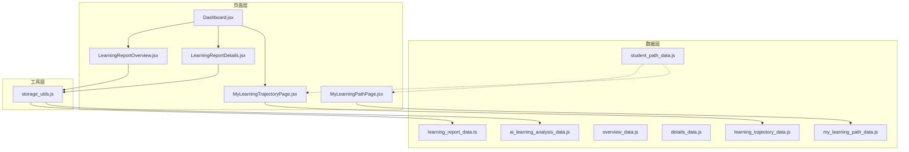
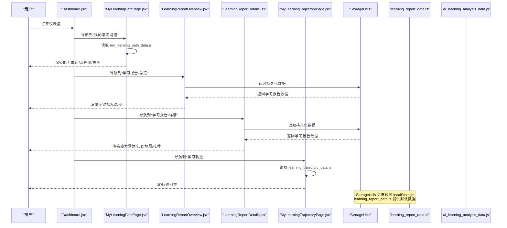
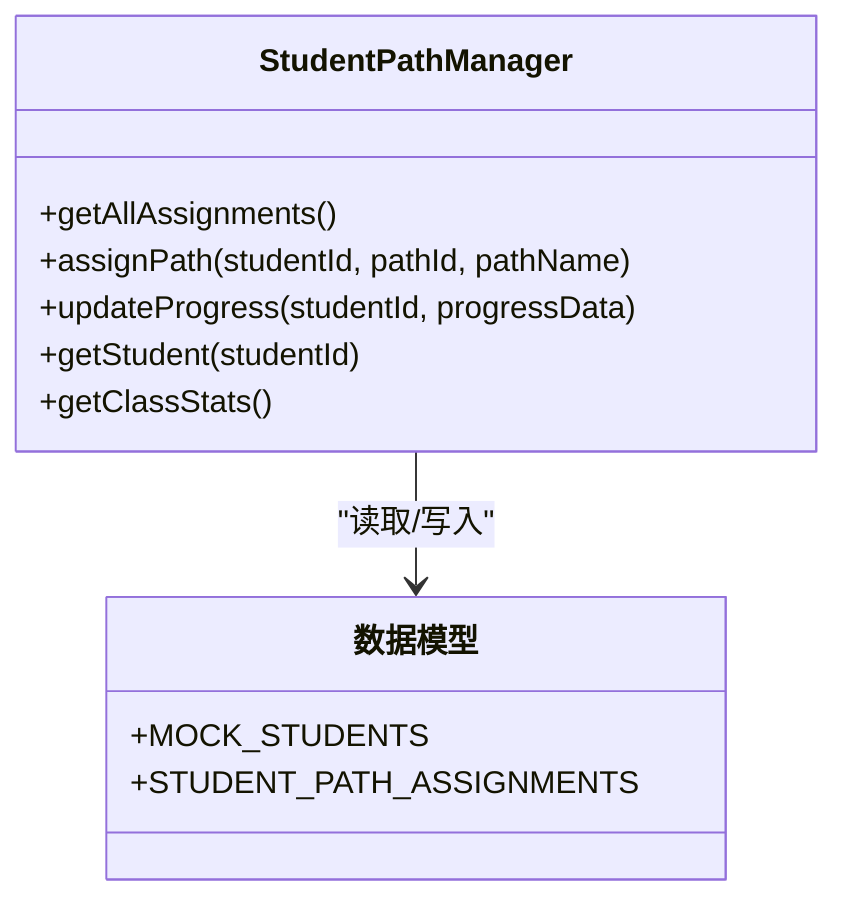
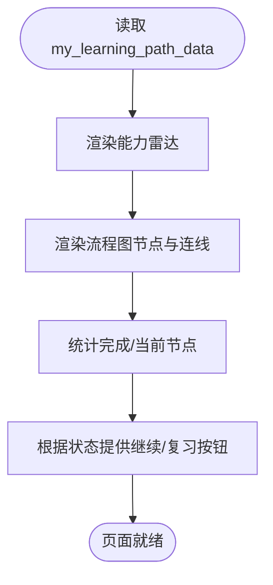
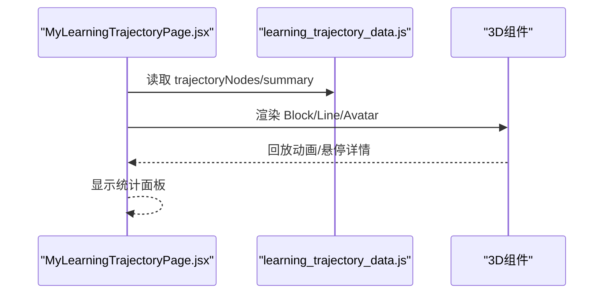
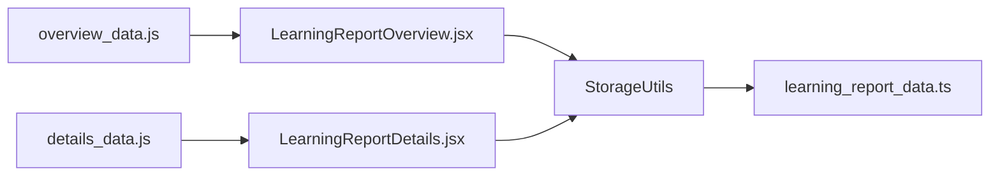
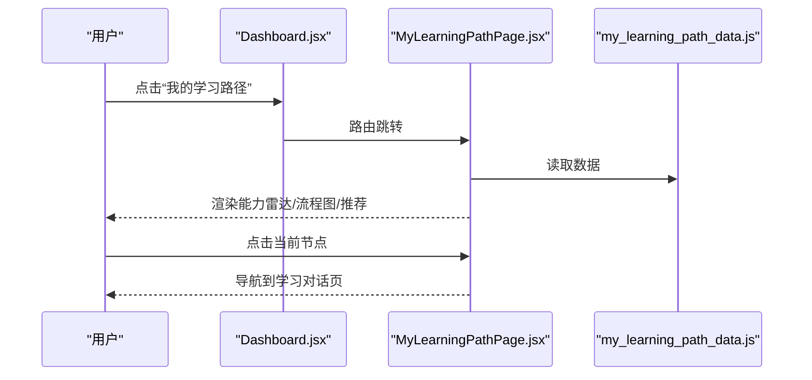
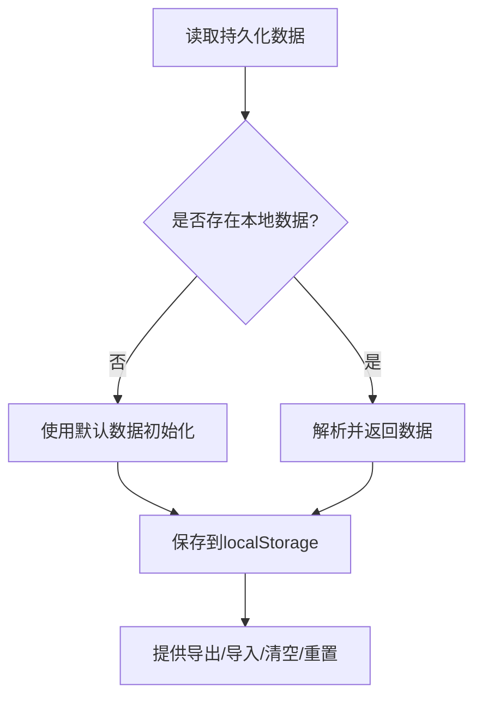
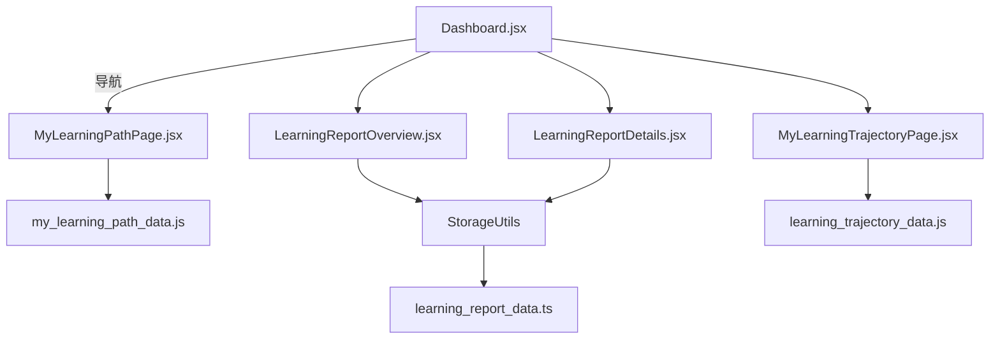

# 学生数据API

<cite>
**本文引用的文件**
- [src/data/student_path_data.js](file://src/data/student_path_data.js)
- [src/data/my_learning_path_data.js](file://src/data/my_learning_path_data.js)
- [src/data/learning_trajectory_data.js](file://src/data/learning_trajectory_data.js)
- [src/data/overview_data.js](file://src/data/overview_data.js)
- [src/data/details_data.js](file://src/data/details_data.js)
- [src/pages/Dashboard.jsx](file://src/pages/Dashboard.jsx)
- [src/pages/MyLearningPathPage.jsx](file://src/pages/MyLearningPathPage.jsx)
- [src/pages/LearningReportOverview.jsx](file://src/pages/LearningReportOverview.jsx)
- [src/pages/LearningReportDetails.jsx](file://src/pages/LearningReportDetails.jsx)
- [src/pages/MyLearningTrajectoryPage.jsx](file://src/pages/MyLearningTrajectoryPage.jsx)
- [src/utils/storage_utils.js](file://src/utils/storage_utils.js)
- [src/data/learning_report_data.ts](file://src/data/learning_report_data.ts)
- [src/data/ai_learning_analysis_data.js](file://src/data/ai_learning_analysis_data.js)
</cite>

## 目录
1. [引言](#引言)
2. [项目结构](#项目结构)
3. [核心组件](#核心组件)
4. [架构总览](#架构总览)
5. [详细组件分析](#详细组件分析)
6. [依赖分析](#依赖分析)
7. [性能考虑](#性能考虑)
8. [故障排查指南](#故障排查指南)
9. [结论](#结论)
10. [附录](#附录)

## 引言
本文件面向“学生个性化数据模型”的全面文档化需求，围绕以下目标展开：
- 学生专属路径：解析 student_path_data.js 的生成逻辑与字段结构，说明路径分配、进度更新与活动日志。
- 用户进度存储：解释 my_learning_path_data.js 的数据形态与前端渲染要点。
- 行为日志记录：梳理 learning_trajectory_data.js 的历史轨迹与统计聚合。
- 仪表盘数据聚合：阐述 overview_data.js 与 details_data.js 在报告页中的作用与联动。
- 数据流闭环：从 AI 推荐到路径落地的端到端数据流，结合 Dashboard.jsx 与 MyLearningPathPage.jsx 的前端消费模式。
- 持久化策略：基于 localStorage 的本地持久化、同步与异常恢复方案。

## 项目结构
该项目采用“数据驱动 + 页面渲染”的前端架构，数据集中在 src/data 下，页面集中在 src/pages 下，工具类集中在 src/utils 下。核心数据文件与页面组件如下所示：

图表来源
- [src/data/student_path_data.js](file://src/data/student_path_data.js#L1-L305)
- [src/data/my_learning_path_data.js](file://src/data/my_learning_path_data.js#L1-L148)
- [src/data/learning_trajectory_data.js](file://src/data/learning_trajectory_data.js#L1-L121)
- [src/data/overview_data.js](file://src/data/overview_data.js#L1-L89)
- [src/data/details_data.js](file://src/data/details_data.js#L1-L106)
- [src/pages/Dashboard.jsx](file://src/pages/Dashboard.jsx#L1-L211)
- [src/pages/MyLearningPathPage.jsx](file://src/pages/MyLearningPathPage.jsx#L1-L673)
- [src/pages/LearningReportOverview.jsx](file://src/pages/LearningReportOverview.jsx#L1-L269)
- [src/pages/LearningReportDetails.jsx](file://src/pages/LearningReportDetails.jsx#L1-L422)
- [src/pages/MyLearningTrajectoryPage.jsx](file://src/pages/MyLearningTrajectoryPage.jsx#L1-L410)
- [src/utils/storage_utils.js](file://src/utils/storage_utils.js#L1-L438)
- [src/data/learning_report_data.ts](file://src/data/learning_report_data.ts#L1-L375)
- [src/data/ai_learning_analysis_data.js](file://src/data/ai_learning_analysis_data.js#L1-L313)

章节来源
- [src/pages/Dashboard.jsx](file://src/pages/Dashboard.jsx#L1-L211)
- [src/pages/MyLearningPathPage.jsx](file://src/pages/MyLearningPathPage.jsx#L1-L673)
- [src/pages/LearningReportOverview.jsx](file://src/pages/LearningReportOverview.jsx#L1-L269)
- [src/pages/LearningReportDetails.jsx](file://src/pages/LearningReportDetails.jsx#L1-L422)
- [src/pages/MyLearningTrajectoryPage.jsx](file://src/pages/MyLearningTrajectoryPage.jsx#L1-L410)

## 核心组件
- 学生专属路径管理：提供路径分配、进度更新、统计与本地持久化。
- 个性化学习路径：提供能力雷达、流程图节点、连接关系与推荐建议。
- 学习轨迹回放：提供历史节点、统计汇总与3D可视化。
- 仪表盘数据聚合：提供概览与详情两套数据源，分别用于总览页与详情页。
- 前端消费模式：Dashboard.jsx 引导导航，MyLearningPathPage.jsx 展示路径，LearningReport* 页面消费持久化数据，MyLearningTrajectoryPage.jsx 展示轨迹。

章节来源
- [src/data/student_path_data.js](file://src/data/student_path_data.js#L223-L305)
- [src/data/my_learning_path_data.js](file://src/data/my_learning_path_data.js#L1-L148)
- [src/data/learning_trajectory_data.js](file://src/data/learning_trajectory_data.js#L1-L121)
- [src/data/overview_data.js](file://src/data/overview_data.js#L1-L89)
- [src/data/details_data.js](file://src/data/details_data.js#L1-L106)

## 架构总览
下图展示了从前端页面到数据层的数据流与交互关系：

图表来源
- [src/pages/Dashboard.jsx](file://src/pages/Dashboard.jsx#L1-L211)
- [src/pages/MyLearningPathPage.jsx](file://src/pages/MyLearningPathPage.jsx#L1-L673)
- [src/pages/LearningReportOverview.jsx](file://src/pages/LearningReportOverview.jsx#L1-L269)
- [src/pages/LearningReportDetails.jsx](file://src/pages/LearningReportDetails.jsx#L1-L422)
- [src/pages/MyLearningTrajectoryPage.jsx](file://src/pages/MyLearningTrajectoryPage.jsx#L1-L410)
- [src/utils/storage_utils.js](file://src/utils/storage_utils.js#L1-L170)
- [src/data/learning_report_data.ts](file://src/data/learning_report_data.ts#L1-L375)
- [src/data/ai_learning_analysis_data.js](file://src/data/ai_learning_analysis_data.js#L1-L313)

## 详细组件分析

### 学生专属路径：student_path_data.js
- 数据结构
  - MOCK_STUDENTS：模拟学生列表，包含基础信息与能力画像。
  - STUDENT_PATH_ASSIGNMENTS：路径分配与进度，包含进度百分比、节点集合、预估完成时间、实际耗时与活动日志。
  - StudentPathManager：提供路径分配、进度更新、统计与本地持久化。
- 生成与更新逻辑
  - 分配路径：若已有分配则更新路径与日期；否则新增分配并初始化进度。
  - 更新进度：合并传入进度字段，保留已有字段不变。
  - 统计：计算班级路径分布与平均进度。
- 字段要点
  - progress.completedNodes：已完成节点集合。
  - progress.currentNode：当前节点。
  - progress.totalNodes/percentage：总量与完成百分比。
  - activityLogs：行为日志数组，包含类型、时间戳、标题、时长/分数、详情与状态。
- 本地持久化
  - 使用 localStorage 存储“studentPathAssignments”，首次加载若无数据则回退到内置默认数据。

图表来源
- [src/data/student_path_data.js](file://src/data/student_path_data.js#L223-L305)

章节来源
- [src/data/student_path_data.js](file://src/data/student_path_data.js#L1-L305)

### 个性化学习路径：my_learning_path_data.js
- 数据形态
  - abilityModel：包含学生姓名、目标班级、目标分数、预计学习时长、雷达维度与AI建议。
  - flowNodes：流程图节点，含阶段、状态、位置与颜色。
  - connections：节点连接关系，支持主干、分支与合并。
- 前端消费
  - MyLearningPathPage.jsx 直接引入该数据，渲染能力雷达、流程图、推荐与统计。
  - 节点状态决定样式与交互，当前节点提供继续学习入口。

图表来源
- [src/data/my_learning_path_data.js](file://src/data/my_learning_path_data.js#L1-L148)
- [src/pages/MyLearningPathPage.jsx](file://src/pages/MyLearningPathPage.jsx#L1-L673)

章节来源
- [src/data/my_learning_path_data.js](file://src/data/my_learning_path_data.js#L1-L148)
- [src/pages/MyLearningPathPage.jsx](file://src/pages/MyLearningPathPage.jsx#L1-L673)

### 学习轨迹：learning_trajectory_data.js
- 数据形态
  - trajectoryNodes：历史节点数组，包含标题、副标题、日期、统计、位置与状态（完成/当前），以及节点分数。
  - summary：学习统计总览，包含总天数、主题数、完成主题数、资源/练习/提问总数与平均分。
- 前端消费
  - MyLearningTrajectoryPage.jsx 以3D方式呈现轨迹，支持回放动画、悬停详情与统计面板。
  - 通过节点状态与分数映射颜色，当前节点高亮发光。

图表来源
- [src/pages/MyLearningTrajectoryPage.jsx](file://src/pages/MyLearningTrajectoryPage.jsx#L1-L410)
- [src/data/learning_trajectory_data.js](file://src/data/learning_trajectory_data.js#L1-L121)

章节来源
- [src/data/learning_trajectory_data.js](file://src/data/learning_trajectory_data.js#L1-L121)
- [src/pages/MyLearningTrajectoryPage.jsx](file://src/pages/MyLearningTrajectoryPage.jsx#L1-L410)

### 仪表盘数据聚合：overview_data.js 与 details_data.js
- overview_data.js
  - 提供学习报告总览所需的基础信息、整体进度、学习天数、连续学习天数、本周亮点、成就徽章、排名信息与学习趋势关键指标。
- details_data.js
  - 提供能力雷达（当前/上周/目标）、知识地图（模块状态、进度、子主题）、每周对比等。
- 前端消费
  - LearningReportOverview.jsx 与 LearningReportDetails.jsx 通过 StorageUtils 读取持久化数据，渲染图表与卡片。

图表来源
- [src/data/overview_data.js](file://src/data/overview_data.js#L1-L89)
- [src/data/details_data.js](file://src/data/details_data.js#L1-L106)
- [src/pages/LearningReportOverview.jsx](file://src/pages/LearningReportOverview.jsx#L1-L269)
- [src/pages/LearningReportDetails.jsx](file://src/pages/LearningReportDetails.jsx#L1-L422)
- [src/utils/storage_utils.js](file://src/utils/storage_utils.js#L1-L170)
- [src/data/learning_report_data.ts](file://src/data/learning_report_data.ts#L1-L375)

章节来源
- [src/data/overview_data.js](file://src/data/overview_data.js#L1-L89)
- [src/data/details_data.js](file://src/data/details_data.js#L1-L106)
- [src/pages/LearningReportOverview.jsx](file://src/pages/LearningReportOverview.jsx#L1-L269)
- [src/pages/LearningReportDetails.jsx](file://src/pages/LearningReportDetails.jsx#L1-L422)
- [src/utils/storage_utils.js](file://src/utils/storage_utils.js#L1-L170)
- [src/data/learning_report_data.ts](file://src/data/learning_report_data.ts#L1-L375)

### 前端消费模式：Dashboard.jsx 与 MyLearningPathPage.jsx
- Dashboard.jsx
  - 作为入口页，提供“我的学习路径”“我的学习轨迹”“我的学习报告”“AI错题本”等卡片导航。
  - 通过路由参数传递难度与学习风格，便于后续个性化。
- MyLearningPathPage.jsx
  - 直接消费 my_learning_path_data.js，渲染能力雷达、流程图、推荐与统计。
  - 节点点击触发继续学习，导航到对话式学习页面。

图表来源
- [src/pages/Dashboard.jsx](file://src/pages/Dashboard.jsx#L1-L211)
- [src/pages/MyLearningPathPage.jsx](file://src/pages/MyLearningPathPage.jsx#L1-L673)
- [src/data/my_learning_path_data.js](file://src/data/my_learning_path_data.js#L1-L148)

章节来源
- [src/pages/Dashboard.jsx](file://src/pages/Dashboard.jsx#L1-L211)
- [src/pages/MyLearningPathPage.jsx](file://src/pages/MyLearningPathPage.jsx#L1-L673)
- [src/data/my_learning_path_data.js](file://src/data/my_learning_path_data.js#L1-L148)

### 数据持久化策略、同步机制与异常恢复
- 持久化策略
  - StorageUtils：统一管理学习报告数据的读取、保存、更新与导出。
  - 默认数据：首次加载若无本地数据，则使用 learning_report_data.ts 的默认数据初始化。
- 同步机制
  - 错题本与学习报告的双向同步：StorageUtils.updateQuestionStatus/addRetryRecord 会同步更新学习报告中的薄弱维度与能力分数。
- 异常恢复
  - 读取失败时返回默认数据；保存失败时捕获错误并返回失败状态；提供导出/导入/清空/重置等运维能力。

图表来源
- [src/utils/storage_utils.js](file://src/utils/storage_utils.js#L1-L170)
- [src/data/learning_report_data.ts](file://src/data/learning_report_data.ts#L1-L375)

章节来源
- [src/utils/storage_utils.js](file://src/utils/storage_utils.js#L1-L438)
- [src/data/learning_report_data.ts](file://src/data/learning_report_data.ts#L1-L375)
- [src/data/ai_learning_analysis_data.js](file://src/data/ai_learning_analysis_data.js#L1-L313)

## 依赖分析
- 组件耦合
  - MyLearningPathPage.jsx 直接依赖 my_learning_path_data.js，耦合度低，便于替换数据源。
  - LearningReport* 页面依赖 StorageUtils 与 learning_report_data.ts，形成稳定的持久化依赖。
  - MyLearningTrajectoryPage.jsx 依赖 learning_trajectory_data.js，独立于其他数据源。
  - Dashboard.jsx 仅负责导航，不直接依赖具体数据，耦合度最低。
- 外部依赖
  - Recharts 用于图表渲染。
  - Three.js 生态（@react-three/fiber/@react-three/drei）用于3D轨迹回放。
- 循环依赖
  - 未发现循环依赖；数据文件之间为单向消费关系。

图表来源
- [src/pages/MyLearningPathPage.jsx](file://src/pages/MyLearningPathPage.jsx#L1-L673)
- [src/pages/LearningReportOverview.jsx](file://src/pages/LearningReportOverview.jsx#L1-L269)
- [src/pages/LearningReportDetails.jsx](file://src/pages/LearningReportDetails.jsx#L1-L422)
- [src/pages/MyLearningTrajectoryPage.jsx](file://src/pages/MyLearningTrajectoryPage.jsx#L1-L410)
- [src/pages/Dashboard.jsx](file://src/pages/Dashboard.jsx#L1-L211)
- [src/utils/storage_utils.js](file://src/utils/storage_utils.js#L1-L170)
- [src/data/my_learning_path_data.js](file://src/data/my_learning_path_data.js#L1-L148)
- [src/data/learning_trajectory_data.js](file://src/data/learning_trajectory_data.js#L1-L121)
- [src/data/learning_report_data.ts](file://src/data/learning_report_data.ts#L1-L375)

章节来源
- [src/pages/MyLearningPathPage.jsx](file://src/pages/MyLearningPathPage.jsx#L1-L673)
- [src/pages/LearningReportOverview.jsx](file://src/pages/LearningReportOverview.jsx#L1-L269)
- [src/pages/LearningReportDetails.jsx](file://src/pages/LearningReportDetails.jsx#L1-L422)
- [src/pages/MyLearningTrajectoryPage.jsx](file://src/pages/MyLearningTrajectoryPage.jsx#L1-L410)
- [src/pages/Dashboard.jsx](file://src/pages/Dashboard.jsx#L1-L211)
- [src/utils/storage_utils.js](file://src/utils/storage_utils.js#L1-L170)
- [src/data/my_learning_path_data.js](file://src/data/my_learning_path_data.js#L1-L148)
- [src/data/learning_trajectory_data.js](file://src/data/learning_trajectory_data.js#L1-L121)
- [src/data/learning_report_data.ts](file://src/data/learning_report_data.ts#L1-L375)

## 性能考虑
- 图表渲染
  - Recharts 在大数据量时建议分页或抽样，避免一次性渲染过多数据点。
- 3D 动画
  - MyLearningTrajectoryPage.jsx 使用 Three.js，注意帧率与几何数量控制，避免过度细分网格。
- 本地存储
  - localStorage 写入频繁时建议批量更新与节流，减少主线程阻塞。
- 路由与懒加载
  - 页面组件可配合路由懒加载，减少首屏压力。

## 故障排查指南
- 无法加载学习报告
  - 检查 localStorage 是否被清理或损坏；StorageUtils.getLearningData 会在读取失败时回退默认数据。
- 错题本与报告不同步
  - 确认调用了 StorageUtils.updateQuestionStatus/addRetryRecord，并触发了同步逻辑。
- 路径分配/进度更新无效
  - 检查 StudentPathManager 的 assignPath/updateProgress 是否正确传入 studentId 与进度字段。
- 3D 轨迹回放卡顿
  - 降低几何细分、减少节点数量或关闭自动旋转，观察性能变化。

章节来源
- [src/utils/storage_utils.js](file://src/utils/storage_utils.js#L1-L170)
- [src/data/student_path_data.js](file://src/data/student_path_data.js#L223-L305)
- [src/pages/MyLearningTrajectoryPage.jsx](file://src/pages/MyLearningTrajectoryPage.jsx#L1-L410)

## 结论
本项目通过“数据文件 + 页面组件 + 工具类”的清晰分层，实现了学生个性化数据模型的完整闭环：
- 路径分配与进度管理由 student_path_data.js 与 StudentPathManager 提供。
- 个性化学习路径由 my_learning_path_data.js 驱动前端渲染。
- 学习轨迹由 learning_trajectory_data.js 提供历史与统计，并通过 3D 回放增强体验。
- 仪表盘与报告页通过 overview_data.js 与 details_data.js 聚合数据，结合 StorageUtils 实现本地持久化与同步。
- 从 AI 推荐到路径落地的端到端数据流清晰，前端消费模式简洁直观。

## 附录
- 真实数据示例（字段路径）
  - 学生专属路径进度：[src/data/student_path_data.js](file://src/data/student_path_data.js#L83-L220)
  - 个性化学习路径节点与连接：[src/data/my_learning_path_data.js](file://src/data/my_learning_path_data.js#L34-L145)
  - 学习轨迹节点与统计：[src/data/learning_trajectory_data.js](file://src/data/learning_trajectory_data.js#L5-L118)
  - 仪表盘概览数据：[src/data/overview_data.js](file://src/data/overview_data.js#L4-L89)
  - 仪表盘详情数据：[src/data/details_data.js](file://src/data/details_data.js#L4-L106)
- 前端消费示例（页面路径）
  - 仪表盘导航：[src/pages/Dashboard.jsx](file://src/pages/Dashboard.jsx#L54-L187)
  - 路径页面渲染：[src/pages/MyLearningPathPage.jsx](file://src/pages/MyLearningPathPage.jsx#L1-L673)
  - 报告总览渲染：[src/pages/LearningReportOverview.jsx](file://src/pages/LearningReportOverview.jsx#L1-L269)
  - 报告详情渲染：[src/pages/LearningReportDetails.jsx](file://src/pages/LearningReportDetails.jsx#L1-L422)
  - 轨迹回放渲染：[src/pages/MyLearningTrajectoryPage.jsx](file://src/pages/MyLearningTrajectoryPage.jsx#L1-L410)
- 持久化与同步工具：[src/utils/storage_utils.js](file://src/utils/storage_utils.js#L1-L438)
- 默认学习报告数据：[src/data/learning_report_data.ts](file://src/data/learning_report_data.ts#L1-L375)
- AI学情分析数据：[src/data/ai_learning_analysis_data.js](file://src/data/ai_learning_analysis_data.js#L1-L313)