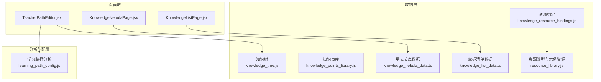
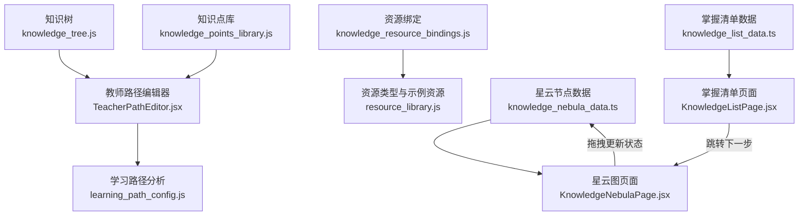
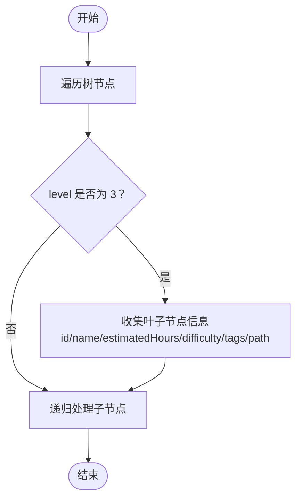
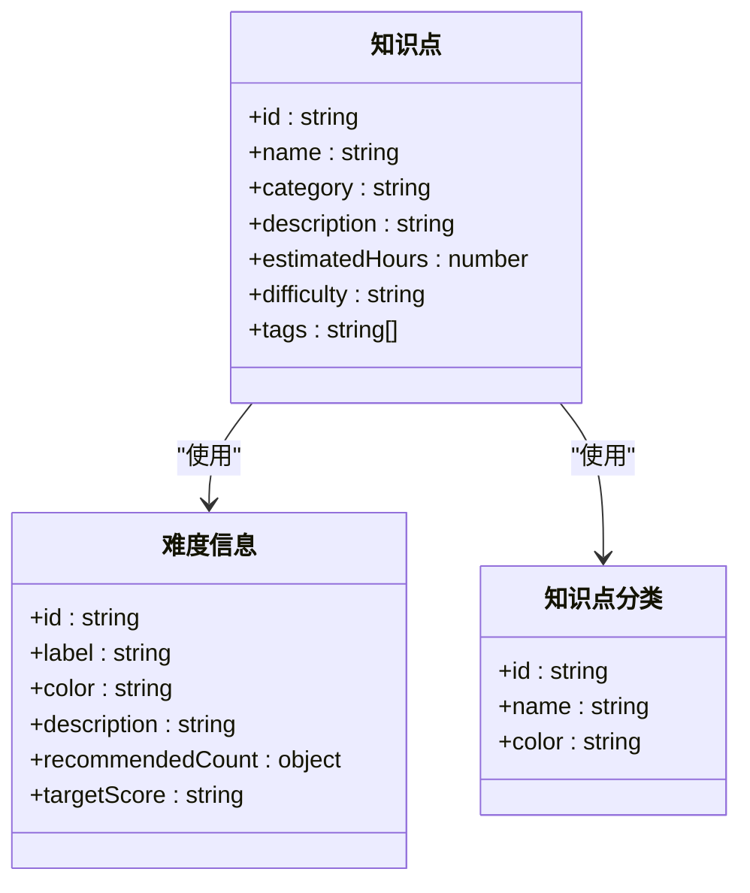
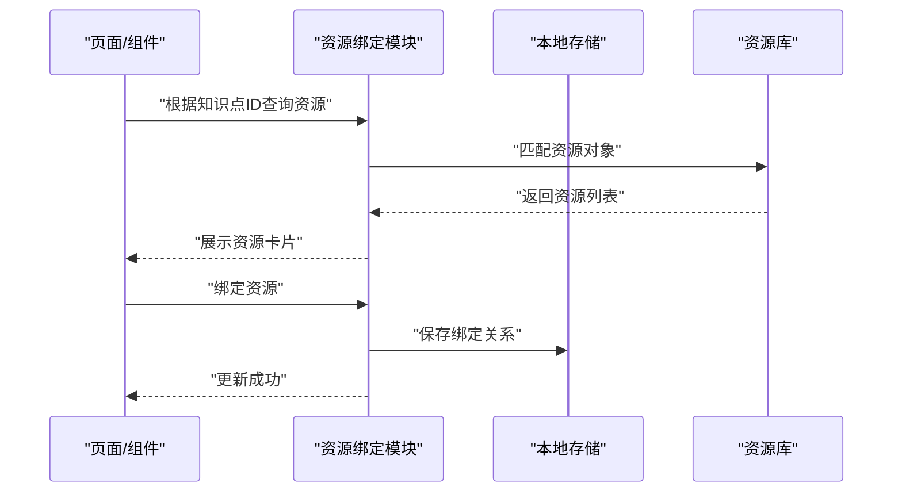
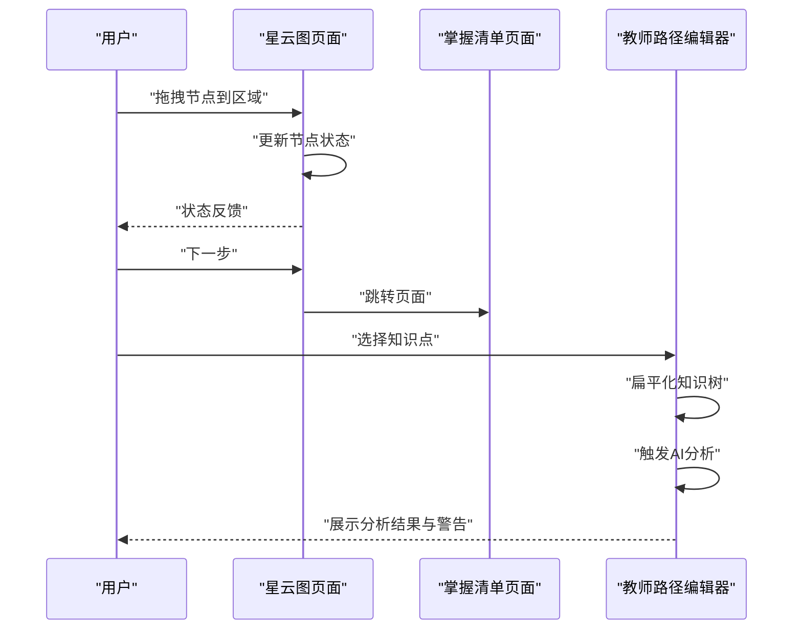
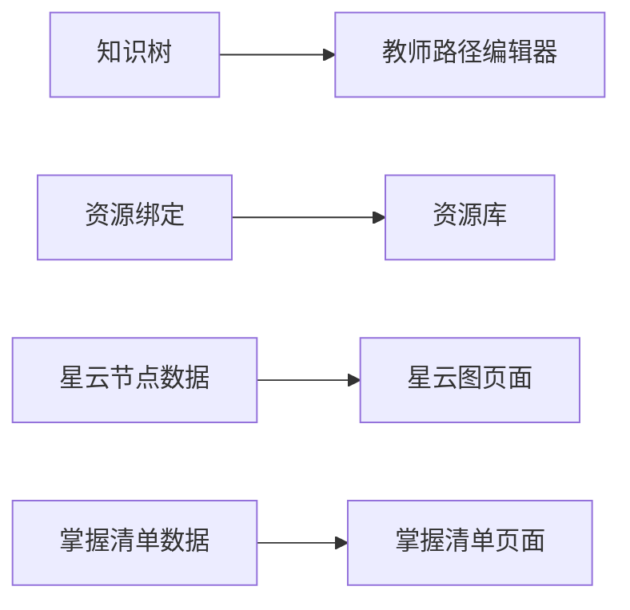

# 知识图谱API

<cite>
**本文引用的文件**
- [knowledge_tree.js](file://src/data/knowledge_tree.js)
- [knowledge_points_library.js](file://src/data/knowledge_points_library.js)
- [knowledge_resource_bindings.js](file://src/data/knowledge_resource_bindings.js)
- [knowledge_nebula_data.ts](file://src/data/knowledge_nebula_data.ts)
- [knowledge_list_data.ts](file://src/data/knowledge_list_data.ts)
- [resource_library.js](file://src/data/resource_library.js)
- [KnowledgeNebulaPage.jsx](file://src/pages/KnowledgeNebulaPage.jsx)
- [KnowledgeListPage.jsx](file://src/pages/KnowledgeListPage.jsx)
- [TeacherPathEditor.jsx](file://src/pages/TeacherPathEditor.jsx)
- [learning_path_config.js](file://src/data/learning_path_config.js)
</cite>

## 目录
1. [简介](#简介)
2. [项目结构](#项目结构)
3. [核心组件](#核心组件)
4. [架构总览](#架构总览)
5. [详细组件分析](#详细组件分析)
6. [依赖关系分析](#依赖关系分析)
7. [性能考虑](#性能考虑)
8. [故障排查指南](#故障排查指南)
9. [结论](#结论)
10. [附录](#附录)

## 简介
本文件围绕知识图谱相关数据模型进行系统化梳理，重点覆盖以下方面：
- 树状层级结构：知识树的组织方式、层级关系与路径导航
- 知识点元数据：难度、类型、掌握阈值等属性的定义与使用
- 资源绑定机制：知识点与学习资源的映射与持久化
- 应用页面：星云图与掌握清单页面如何消费这些数据
- 数据初始化、动态更新与性能优化建议

## 项目结构
知识图谱相关数据与页面主要分布在以下位置：
- 数据层：知识树、知识点库、资源绑定、星云与清单示例数据
- 页面层：星云图交互页、掌握清单页
- 分析与配置：教师路径编辑器中对树的扁平化与AI分析调用
- 资源类型：资源类型的枚举与示例资源库

图表来源
- [knowledge_tree.js](file://src/data/knowledge_tree.js#L1-L377)
- [knowledge_points_library.js](file://src/data/knowledge_points_library.js#L1-L214)
- [knowledge_resource_bindings.js](file://src/data/knowledge_resource_bindings.js#L1-L61)
- [knowledge_nebula_data.ts](file://src/data/knowledge_nebula_data.ts#L1-L23)
- [knowledge_list_data.ts](file://src/data/knowledge_list_data.ts#L1-L12)
- [resource_library.js](file://src/data/resource_library.js#L1-L113)
- [KnowledgeNebulaPage.jsx](file://src/pages/KnowledgeNebulaPage.jsx#L1-L166)
- [KnowledgeListPage.jsx](file://src/pages/KnowledgeListPage.jsx#L1-L111)
- [TeacherPathEditor.jsx](file://src/pages/TeacherPathEditor.jsx#L33-L72)
- [learning_path_config.js](file://src/data/learning_path_config.js#L91-L179)

章节来源
- [knowledge_tree.js](file://src/data/knowledge_tree.js#L1-L377)
- [knowledge_points_library.js](file://src/data/knowledge_points_library.js#L1-L214)
- [knowledge_resource_bindings.js](file://src/data/knowledge_resource_bindings.js#L1-L61)
- [knowledge_nebula_data.ts](file://src/data/knowledge_nebula_data.ts#L1-L23)
- [knowledge_list_data.ts](file://src/data/knowledge_list_data.ts#L1-L12)
- [resource_library.js](file://src/data/resource_library.js#L1-L113)
- [KnowledgeNebulaPage.jsx](file://src/pages/KnowledgeNebulaPage.jsx#L1-L166)
- [KnowledgeListPage.jsx](file://src/pages/KnowledgeListPage.jsx#L1-L111)
- [TeacherPathEditor.jsx](file://src/pages/TeacherPathEditor.jsx#L33-L72)
- [learning_path_config.js](file://src/data/learning_path_config.js#L91-L179)

## 核心组件
本节从数据模型角度，逐项说明关键字段、数据类型、业务约束与关系规则。

- 知识树（KNOWLEDGE_TREE）
  - 字段与类型
    - id: 字符串
    - name: 字符串
    - level: 数字（层级编号，0为主节点，1-3为章节/子章节/知识点）
    - children: 数组（可选），元素为同构对象
  - 叶子节点（level=3）附加字段
    - estimatedHours: 数字（预估学时）
    - difficulty: 字符串（难度：basic/intermediate/advanced）
    - tags: 字符串数组（标签）
  - 关联规则
    - level=3 的节点即为“知识点”，用于学习与评估
    - 路径由父链构成，可通过 getNodePath 构建“章节 > 子章节 > 知识点”的层级路径
  - 业务约束
    - level=3 的节点应具备 difficulty、estimatedHours、tags
    - 节点 id 必须唯一
  - 复杂度
    - 扁平化遍历复杂度 O(N)，N 为树节点总数
    - 路径查找为 DFS，最坏 O(N)

- 知识点库（KNOWLEDGE_POINTS_LIBRARY）
  - 字段与类型
    - id: 字符串（如 k1、k2…）
    - name: 字符串
    - category: 字符串（基础/进阶/高级）
    - description: 字符串
    - estimatedHours: 数字
    - difficulty: 字符串（basic/intermediate/advanced）
    - tags: 字符串数组
  - 关联规则
    - 与知识树中的叶子节点 id 对应（如 k1 对应 1.1.1）
    - 作为教师选择构建学习路径的来源
  - 业务约束
    - category 与 difficulty 一致使用统一枚举
    - estimatedHours 用于学习时长估算

- 资源绑定（KNOWLEDGE_RESOURCE_BINDINGS）
  - 结构
    - 键：知识点ID（字符串）
    - 值：资源ID数组（字符串数组）
  - 关联规则
    - 通过 getResourcesForKnowledge 将知识点ID映射到资源对象
    - 支持动态绑定/解绑，并持久化到本地存储
  - 业务约束
    - 绑定去重，避免重复资源
    - 本地存储键名固定，便于跨会话恢复

- 星云节点数据（KNOWLEDGE_NODES）
  - 字段与类型
    - id: 字符串（对应知识点库或知识树中的知识点ID）
    - label: 字符串（显示名称）
    - status: 字符串（mastered/fuzzy/unknown）
    - size: 数字（节点大小）
    - x/y: 数字（初始位置）
  - 关联规则
    - 与知识点库中的 id 对应
    - 用于星云图交互页面的状态可视化

- 掌握清单数据（KNOWLEDGE_LIST_DATA）
  - 字段与类型
    - id: 字符串
    - label: 字符串
    - status: 字符串（mastered/fuzzy/unknown）
    - score: 数字（百分制）
  - 关联规则
    - 与星云节点数据 id 对应
    - 用于掌握清单页面的进度与状态展示

- 资源类型与示例资源（RESOURCE_TYPES/SAMPLE_RESOURCES）
  - 字段与类型
    - RESOURCE_TYPES：资源类型枚举（name/icon/color/bgColor）
    - SAMPLE_RESOURCES：资源列表（id/type/title/url/description/preview/uploadDate/author 等）
  - 关联规则
    - 与资源绑定通过 id 关联
    - 用于渲染资源卡片与类型标识

章节来源
- [knowledge_tree.js](file://src/data/knowledge_tree.js#L1-L377)
- [knowledge_points_library.js](file://src/data/knowledge_points_library.js#L1-L214)
- [knowledge_resource_bindings.js](file://src/data/knowledge_resource_bindings.js#L1-L61)
- [knowledge_nebula_data.ts](file://src/data/knowledge_nebula_data.ts#L1-L23)
- [knowledge_list_data.ts](file://src/data/knowledge_list_data.ts#L1-L12)
- [resource_library.js](file://src/data/resource_library.js#L1-L113)

## 架构总览
下图展示了知识图谱数据模型在页面中的消费路径与交互流程。

图表来源
- [knowledge_tree.js](file://src/data/knowledge_tree.js#L1-L377)
- [knowledge_points_library.js](file://src/data/knowledge_points_library.js#L1-L214)
- [knowledge_resource_bindings.js](file://src/data/knowledge_resource_bindings.js#L1-L61)
- [knowledge_nebula_data.ts](file://src/data/knowledge_nebula_data.ts#L1-L23)
- [knowledge_list_data.ts](file://src/data/knowledge_list_data.ts#L1-L12)
- [resource_library.js](file://src/data/resource_library.js#L1-L113)
- [KnowledgeNebulaPage.jsx](file://src/pages/KnowledgeNebulaPage.jsx#L1-L166)
- [KnowledgeListPage.jsx](file://src/pages/KnowledgeListPage.jsx#L1-L111)
- [TeacherPathEditor.jsx](file://src/pages/TeacherPathEditor.jsx#L33-L72)
- [learning_path_config.js](file://src/data/learning_path_config.js#L91-L179)

## 详细组件分析

### 树状层级结构与扁平化
- 结构特征
  - 采用多叉树，level=0 主节点（学科）、level=1-3 为章节/子章节/知识点
  - 叶子节点（level=3）携带难度、预估学时、标签等学习元数据
- 扁平化逻辑
  - 仅收集 level=3 的叶子节点，生成可用于选择与搜索的平面列表
  - 时间复杂度 O(N)，空间复杂度 O(M)（M 为叶子节点数）
- 路径导航
  - 通过 DFS 查找目标节点并拼接路径，用于面包屑展示
- 拓扑排序
  - 当前实现未显式进行拓扑排序；推荐在需要严格前置依赖时引入邻接表与 Kahn 算法，按章节顺序或难度递增进行排序

图表来源
- [knowledge_tree.js](file://src/data/knowledge_tree.js#L308-L327)

章节来源
- [knowledge_tree.js](file://src/data/knowledge_tree.js#L1-L377)

### 知识点元数据与难度体系
- 元数据字段
  - id、name、category、description、estimatedHours、difficulty、tags
- 难度与类别
  - difficulty：basic/intermediate/advanced
  - category：基础/进阶/高级
- 使用场景
  - 教师路径编辑器中用于计算平均难度、推荐学习顺序与资源类型
  - 星云图与掌握清单页面用于状态与评分展示

图表来源
- [knowledge_points_library.js](file://src/data/knowledge_points_library.js#L1-L214)

章节来源
- [knowledge_points_library.js](file://src/data/knowledge_points_library.js#L1-L214)

### 知识点与学习资源的映射机制
- 映射结构
  - 键：知识点ID（字符串）
  - 值：资源ID数组（字符串数组）
- 查询与绑定
  - 根据知识点ID查询资源列表
  - 动态绑定/解绑资源，自动去重
- 持久化
  - 绑定关系保存至本地存储，重启后可恢复
- 资源类型
  - 提供多种资源类型（PPT、文档、H5、AI智能体、视频、练习题库）

图表来源
- [knowledge_resource_bindings.js](file://src/data/knowledge_resource_bindings.js#L1-L61)
- [resource_library.js](file://src/data/resource_library.js#L1-L113)

章节来源
- [knowledge_resource_bindings.js](file://src/data/knowledge_resource_bindings.js#L1-L61)
- [resource_library.js](file://src/data/resource_library.js#L1-L113)

### 页面应用与数据消费
- 星云图页面（KnowledgeNebulaPage.jsx）
  - 初始化：从星云节点数据与初始消息创建界面
  - 交互：拖拽节点到“已掌握/待巩固”区域，更新节点状态
  - 导航：点击下一步跳转到掌握清单页面
- 掌握清单页面（KnowledgeListPage.jsx）
  - 展示：按状态分组显示知识点，带进度条与标签
  - 评论：展示教师点评
  - 导航：点击下一步进入后续流程
- 教师路径编辑器（TeacherPathEditor.jsx）
  - 扁平化知识树，用于选择知识点
  - 触发 AI 分析，生成学习路径建议与警告

图表来源
- [KnowledgeNebulaPage.jsx](file://src/pages/KnowledgeNebulaPage.jsx#L1-L166)
- [KnowledgeListPage.jsx](file://src/pages/KnowledgeListPage.jsx#L1-L111)
- [TeacherPathEditor.jsx](file://src/pages/TeacherPathEditor.jsx#L33-L72)

章节来源
- [KnowledgeNebulaPage.jsx](file://src/pages/KnowledgeNebulaPage.jsx#L1-L166)
- [KnowledgeListPage.jsx](file://src/pages/KnowledgeListPage.jsx#L1-L111)
- [TeacherPathEditor.jsx](file://src/pages/TeacherPathEditor.jsx#L33-L72)

## 依赖关系分析
- 组件耦合
  - 知识树与教师路径编辑器强耦合：扁平化与分析依赖
  - 星云图与掌握清单依赖外部数据（星云节点与清单数据）
  - 资源绑定依赖资源库与本地存储
- 外部依赖
  - framer-motion 用于动画与拖拽
  - lucide-react 图标库
- 循环依赖
  - 当前文件间无循环导入迹象

图表来源
- [knowledge_tree.js](file://src/data/knowledge_tree.js#L1-L377)
- [knowledge_resource_bindings.js](file://src/data/knowledge_resource_bindings.js#L1-L61)
- [resource_library.js](file://src/data/resource_library.js#L1-L113)
- [KnowledgeNebulaPage.jsx](file://src/pages/KnowledgeNebulaPage.jsx#L1-L166)
- [KnowledgeListPage.jsx](file://src/pages/KnowledgeListPage.jsx#L1-L111)
- [TeacherPathEditor.jsx](file://src/pages/TeacherPathEditor.jsx#L33-L72)

章节来源
- [knowledge_tree.js](file://src/data/knowledge_tree.js#L1-L377)
- [knowledge_resource_bindings.js](file://src/data/knowledge_resource_bindings.js#L1-L61)
- [resource_library.js](file://src/data/resource_library.js#L1-L113)
- [KnowledgeNebulaPage.jsx](file://src/pages/KnowledgeNebulaPage.jsx#L1-L166)
- [KnowledgeListPage.jsx](file://src/pages/KnowledgeListPage.jsx#L1-L111)
- [TeacherPathEditor.jsx](file://src/pages/TeacherPathEditor.jsx#L33-L72)

## 性能考虑
- 树遍历与扁平化
  - 当前为单次 DFS，复杂度 O(N)；若频繁操作，建议缓存扁平化结果
- 路径查找
  - 每次 getNodePath 都执行一次 DFS，建议对常用路径进行缓存
- 资源绑定
  - 绑定/解绑时去重与本地存储写入为 O(M)（M 为资源ID数组长度），建议批量更新
- 页面渲染
  - 星云图与掌握清单使用动画与滚动，建议启用虚拟滚动与懒加载以提升大列表性能
- 学习路径分析
  - 计算难度与推荐顺序为 O(K)（K 为知识点数），可进一步按难度权重与前置依赖进行优化

## 故障排查指南
- 知识树扁平化为空
  - 检查 level=3 的叶子节点是否存在，以及是否正确传入根节点
- 资源绑定无效
  - 确认知识点ID与资源ID一致，检查本地存储键名是否正确
- 路径导航异常
  - 确认 getNodePath 的目标ID存在且唯一
- 页面状态不同步
  - 星云图拖拽后未更新掌握清单，确认状态更新逻辑与数据传递链路

章节来源
- [knowledge_tree.js](file://src/data/knowledge_tree.js#L308-L377)
- [knowledge_resource_bindings.js](file://src/data/knowledge_resource_bindings.js#L1-L61)
- [KnowledgeNebulaPage.jsx](file://src/pages/KnowledgeNebulaPage.jsx#L1-L166)
- [KnowledgeListPage.jsx](file://src/pages/KnowledgeListPage.jsx#L1-L111)

## 结论
本知识图谱数据模型以树形结构承载知识点层级，辅以扁平化与路径导航，满足教师路径构建与学生学习路径规划的需求。资源绑定模块提供了灵活的映射与持久化能力。页面层通过星云图与掌握清单直观呈现学习状态。建议在未来引入拓扑排序与前置依赖校验，以进一步提升学习路径的合理性与可执行性。

## 附录
- 数据初始化流程
  - 知识树：直接导入常量数据
  - 知识点库：直接导入常量数据
  - 资源绑定：从本地存储加载，若无则使用默认空映射
  - 星云节点与清单：从示例数据初始化
- 动态更新策略
  - 星云图拖拽更新状态后，可同步更新清单数据
  - 资源绑定变更后，刷新资源卡片列表
- 性能优化建议
  - 缓存扁平化结果与路径查找结果
  - 虚拟滚动与懒加载
  - 批量更新与防抖