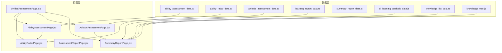
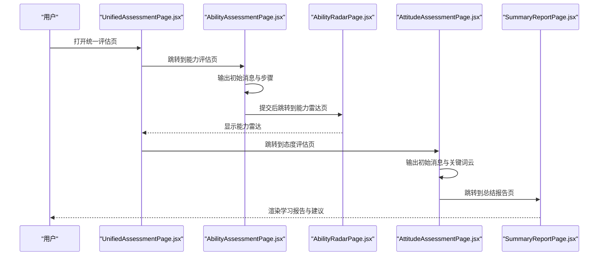
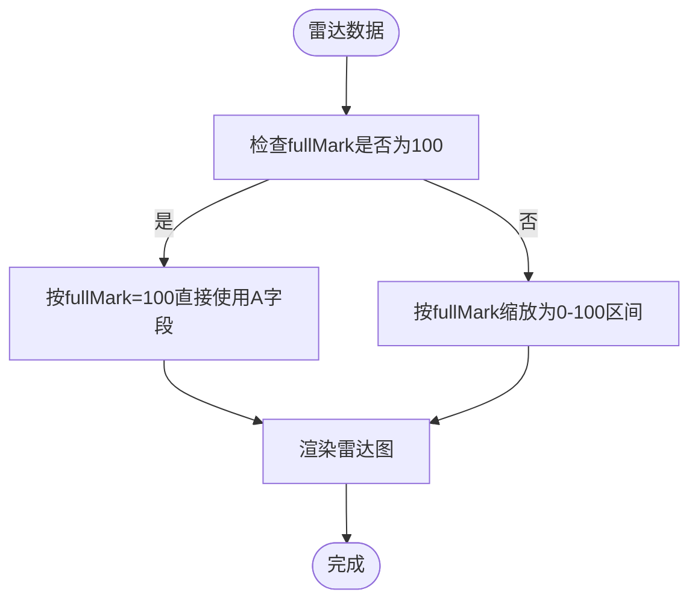
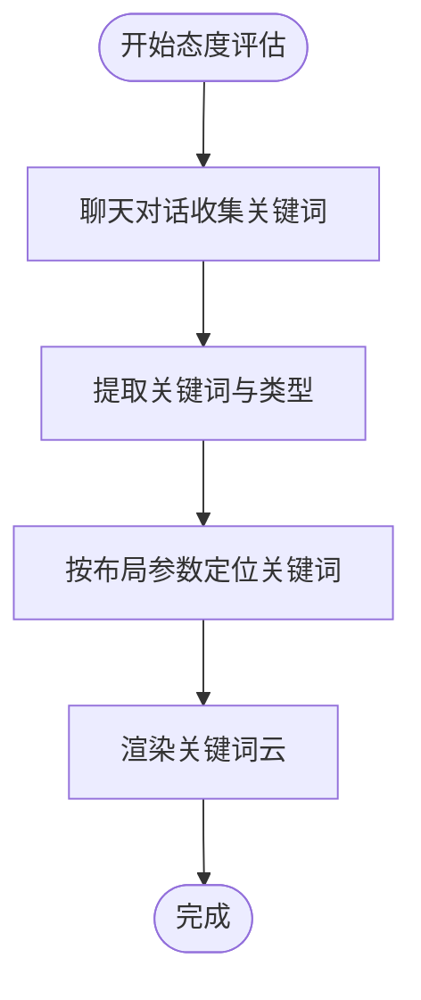
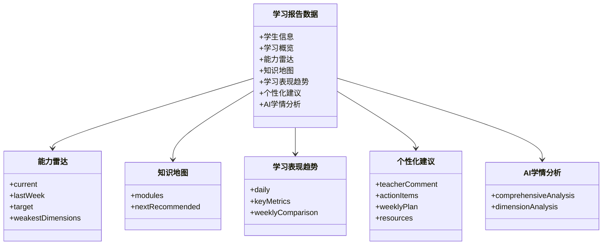
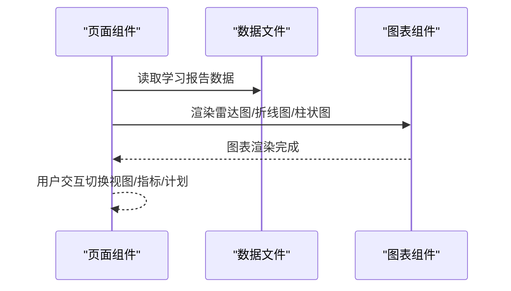
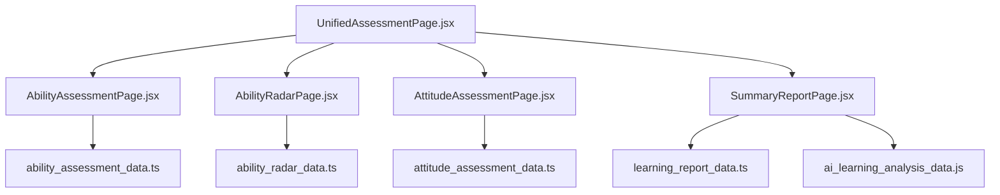

# 评估报告API

<cite>
**本文引用的文件**
- [ability_assessment_data.ts](file://src/data/ability_assessment_data.ts)
- [ability_radar_data.ts](file://src/data/ability_radar_data.ts)
- [attitude_assessment_data.ts](file://src/data/attitude_assessment_data.ts)
- [learning_report_data.ts](file://src/data/learning_report_data.ts)
- [summary_report_data.ts](file://src/data/summary_report_data.ts)
- [ai_learning_analysis_data.js](file://src/data/ai_learning_analysis_data.js)
- [AbilityAssessmentPage.jsx](file://src/pages/AbilityAssessmentPage.jsx)
- [AbilityRadarPage.jsx](file://src/pages/AbilityRadarPage.jsx)
- [AttitudeAssessmentPage.jsx](file://src/pages/AttitudeAssessmentPage.jsx)
- [AssessmentReportPage.jsx](file://src/pages/AssessmentReportPage.jsx)
- [SummaryReportPage.jsx](file://src/pages/SummaryReportPage.jsx)
- [UnifiedAssessmentPage.jsx](file://src/pages/UnifiedAssessmentPage.jsx)
- [knowledge_list_data.ts](file://src/data/knowledge_list_data.ts)
- [knowledge_tree.js](file://src/data/knowledge_tree.js)
</cite>

## 目录
1. [引言](#引言)
2. [项目结构](#项目结构)
3. [核心组件](#核心组件)
4. [架构总览](#架构总览)
5. [详细组件分析](#详细组件分析)
6. [依赖分析](#依赖分析)
7. [性能考虑](#性能考虑)
8. [故障排查指南](#故障排查指南)
9. [结论](#结论)
10. [附录](#附录)

## 引言
本文件系统化文档化多维度评估数据模型，覆盖知识能力、技能雷达和学习态度三大评估体系，以及学习报告与总结报告的数据整合机制。通过对数据文件与页面组件的深入分析，明确字段清单、评分算法说明、可视化映射规则，并结合AssessmentReportPage.jsx与SummaryReportPage.jsx展示报告渲染流程。同时提供评估周期、数据归一化方法与结果解释指南，帮助开发者与使用者高效理解与扩展评估系统。

## 项目结构
评估系统由三类文件构成：
- 数据层：能力评估、雷达数据、态度评估、学习报告、总结报告、AI学情分析等数据文件
- 页面层：能力评估页、雷达页、态度评估页、综合报告页、摘要报告页、统一评估页
- 知识体系：知识点列表与层级树，支撑知识掌握与推荐

**图表来源**
- [ability_assessment_data.ts](file://src/data/ability_assessment_data.ts#L1-L21)
- [ability_radar_data.ts](file://src/data/ability_radar_data.ts#L1-L10)
- [attitude_assessment_data.ts](file://src/data/attitude_assessment_data.ts#L1-L23)
- [learning_report_data.ts](file://src/data/learning_report_data.ts#L1-L375)
- [summary_report_data.ts](file://src/data/summary_report_data.ts#L1-L28)
- [ai_learning_analysis_data.js](file://src/data/ai_learning_analysis_data.js#L1-L313)
- [AbilityAssessmentPage.jsx](file://src/pages/AbilityAssessmentPage.jsx#L1-L117)
- [AbilityRadarPage.jsx](file://src/pages/AbilityRadarPage.jsx#L1-L91)
- [AttitudeAssessmentPage.jsx](file://src/pages/AttitudeAssessmentPage.jsx#L1-L121)
- [AssessmentReportPage.jsx](file://src/pages/AssessmentReportPage.jsx#L1-L320)
- [SummaryReportPage.jsx](file://src/pages/SummaryReportPage.jsx#L1-L736)
- [UnifiedAssessmentPage.jsx](file://src/pages/UnifiedAssessmentPage.jsx#L1-L208)
- [knowledge_list_data.ts](file://src/data/knowledge_list_data.ts#L1-L12)
- [knowledge_tree.js](file://src/data/knowledge_tree.js#L1-L378)

**章节来源**
- [ability_assessment_data.ts](file://src/data/ability_assessment_data.ts#L1-L21)
- [ability_radar_data.ts](file://src/data/ability_radar_data.ts#L1-L10)
- [attitude_assessment_data.ts](file://src/data/attitude_assessment_data.ts#L1-L23)
- [learning_report_data.ts](file://src/data/learning_report_data.ts#L1-L375)
- [summary_report_data.ts](file://src/data/summary_report_data.ts#L1-L28)
- [ai_learning_analysis_data.js](file://src/data/ai_learning_analysis_data.js#L1-L313)
- [AbilityAssessmentPage.jsx](file://src/pages/AbilityAssessmentPage.jsx#L1-L117)
- [AbilityRadarPage.jsx](file://src/pages/AbilityRadarPage.jsx#L1-L91)
- [AttitudeAssessmentPage.jsx](file://src/pages/AttitudeAssessmentPage.jsx#L1-L121)
- [AssessmentReportPage.jsx](file://src/pages/AssessmentReportPage.jsx#L1-L320)
- [SummaryReportPage.jsx](file://src/pages/SummaryReportPage.jsx#L1-L736)
- [UnifiedAssessmentPage.jsx](file://src/pages/UnifiedAssessmentPage.jsx#L1-L208)
- [knowledge_list_data.ts](file://src/data/knowledge_list_data.ts#L1-L12)
- [knowledge_tree.js](file://src/data/knowledge_tree.js#L1-L378)

## 核心组件
- 知识能力评估（ability_assessment_data.ts）
  - 字段：初始消息数组、思维步骤数组
  - 作用：引导用户输出解题思路，形成能力画像输入
- 技能雷达（ability_radar_data.ts）
  - 字段：雷达数据数组、雷达评语
  - 作用：展示能力维度得分与评语
- 学习态度评估（attitude_assessment_data.ts）
  - 字段：初始消息数组、关键词云布局参数
  - 作用：通过聊天与关键词云呈现学习状态
- 学习报告（learning_report_data.ts）
  - 字段：学生信息、学习概览、能力雷达、知识地图、学习趋势、个性化建议、AI学情分析
  - 作用：汇总学习成果与建议，驱动报告页渲染
- 总结报告（summary_report_data.ts）
  - 字段：学生姓名、评估日期、总分、优势、劣势、建议
  - 作用：生成简洁版综合评估
- AI学情分析（ai_learning_analysis_data.js）
  - 字段：整体评价、学习状态、关键发现、优势与改进、建议、预测性分析、对比分析、鼓励语
  - 作用：为学习报告提供深度分析与预测

**章节来源**
- [ability_assessment_data.ts](file://src/data/ability_assessment_data.ts#L1-L21)
- [ability_radar_data.ts](file://src/data/ability_radar_data.ts#L1-L10)
- [attitude_assessment_data.ts](file://src/data/attitude_assessment_data.ts#L1-L23)
- [learning_report_data.ts](file://src/data/learning_report_data.ts#L1-L375)
- [summary_report_data.ts](file://src/data/summary_report_data.ts#L1-L28)
- [ai_learning_analysis_data.js](file://src/data/ai_learning_analysis_data.js#L1-L313)

## 架构总览
评估系统采用“交互式评估 + 数据驱动报告”的架构：
- 用户在能力评估页与态度评估页完成输入
- 雷达页展示能力画像
- 统一评估页串联流程并生成路由状态
- 报告页读取学习报告数据并渲染可视化图表

**图表来源**
- [UnifiedAssessmentPage.jsx](file://src/pages/UnifiedAssessmentPage.jsx#L1-L208)
- [AbilityAssessmentPage.jsx](file://src/pages/AbilityAssessmentPage.jsx#L1-L117)
- [AbilityRadarPage.jsx](file://src/pages/AbilityRadarPage.jsx#L1-L91)
- [AttitudeAssessmentPage.jsx](file://src/pages/AttitudeAssessmentPage.jsx#L1-L121)
- [SummaryReportPage.jsx](file://src/pages/SummaryReportPage.jsx#L1-L736)

## 详细组件分析

### 知识能力评估（ability_assessment_data.ts）
- 字段清单
  - 初始消息数组：包含教师引导消息
  - 思维步骤数组：包含固定步骤与可编辑步骤
- 评分算法说明
  - 该数据文件不直接定义评分算法；其作用是通过用户输出的解题步骤与对话，为能力雷达提供输入依据
- 可视化映射规则
  - 能力评估页使用聊天组件与可拖拽步骤列表，最终触发能力雷达页渲染
- 评估周期
  - 无固定周期，随用户交互推进
- 归一化方法
  - 无数值归一化，依赖后续雷达数据文件中的满分为基准

**章节来源**
- [ability_assessment_data.ts](file://src/data/ability_assessment_data.ts#L1-L21)
- [AbilityAssessmentPage.jsx](file://src/pages/AbilityAssessmentPage.jsx#L1-L117)
- [AbilityRadarPage.jsx](file://src/pages/AbilityRadarPage.jsx#L1-L91)

### 技能雷达（ability_radar_data.ts）
- 字段清单
  - 雷达数据数组：包含维度名称与得分、满分
  - 雷达评语：对能力画像的总结性点评
- 评分算法说明
  - 雷达数据数组中的A字段即为维度得分，满分为fullMark
  - 未见显式归一化处理，通常以fullMark为基准
- 可视化映射规则
  - 使用雷达图组件渲染，维度为角度轴，得分填充为面积
- 评估周期
  - 无固定周期，随用户完成能力评估后生成
- 归一化方法
  - 若需跨周期比较，建议将各维度得分按fullMark归一化为百分比

**图表来源**
- [ability_radar_data.ts](file://src/data/ability_radar_data.ts#L1-L10)
- [AbilityRadarPage.jsx](file://src/pages/AbilityRadarPage.jsx#L1-L91)

**章节来源**
- [ability_radar_data.ts](file://src/data/ability_radar_data.ts#L1-L10)
- [AbilityRadarPage.jsx](file://src/pages/AbilityRadarPage.jsx#L1-L91)

### 学习态度评估（attitude_assessment_data.ts）
- 字段清单
  - 初始消息数组：教师引导与问题
  - 关键词云布局参数：包含关键词、类型、字号、位置
- 行为指标采集逻辑
  - 通过聊天记录捕获用户情绪关键词，生成关键词云布局
  - 关键词类型决定颜色与样式，位置由布局参数控制
- 评估周期
  - 无固定周期，随用户完成态度评估后生成
- 归一化方法
  - 未见数值归一化；关键词云为定性可视化

**图表来源**
- [attitude_assessment_data.ts](file://src/data/attitude_assessment_data.ts#L1-L23)
- [AttitudeAssessmentPage.jsx](file://src/pages/AttitudeAssessmentPage.jsx#L1-L121)

**章节来源**
- [attitude_assessment_data.ts](file://src/data/attitude_assessment_data.ts#L1-L23)
- [AttitudeAssessmentPage.jsx](file://src/pages/AttitudeAssessmentPage.jsx#L1-L121)

### 学习报告（learning_report_data.ts）
- 字段清单
  - 学生基础信息：姓名、头像、年级、学科、当前主题
  - 学习概览：整体进度、学习天数、连续学习天数、本周亮点、成就徽章、排名信息
  - 能力雷达：当前、上周、目标、最弱维度
  - 知识地图：模块列表、子主题、进度、状态、下一步推荐
  - 学习表现趋势：近30天数据、关键指标、每周对比
  - 个性化建议：AI总评、行动建议（按优先级）、周计划、资源推荐
  - AI学情分析：整体评价、学习状态、关键发现、优势与改进、建议、预测性分析、对比分析、鼓励语
- 评分算法说明
  - 能力雷达维度得分来自数据源，未见内部算法；知识地图模块进度为百分比
  - 趋势指标如平均正确率、总时长、总题数等为统计聚合
- 可视化映射规则
  - 报告页使用多种图表组件渲染：环形进度、折线/面积图、柱状图、雷达图、卡片与列表
- 评估周期
  - 以周为单位生成，包含本周与上周对比
- 归一化方法
  - 趋势数据按日聚合；雷达数据按fullMark归一化为百分比

**图表来源**
- [learning_report_data.ts](file://src/data/learning_report_data.ts#L1-L375)
- [SummaryReportPage.jsx](file://src/pages/SummaryReportPage.jsx#L1-L736)

**章节来源**
- [learning_report_data.ts](file://src/data/learning_report_data.ts#L1-L375)
- [SummaryReportPage.jsx](file://src/pages/SummaryReportPage.jsx#L1-L736)

### 总结报告（summary_report_data.ts）
- 字段清单
  - 学生姓名、评估日期、总分、优势、劣势、建议列表（含类型）
- 评分算法说明
  - 未见具体算法；建议列表按类型分级
- 可视化映射规则
  - 报告页渲染卡片与列表，突出优势与劣势
- 评估周期
  - 无固定周期，通常在评估完成后生成
- 归一化方法
  - 未见数值归一化

**章节来源**
- [summary_report_data.ts](file://src/data/summary_report_data.ts#L1-L28)
- [SummaryReportPage.jsx](file://src/pages/SummaryReportPage.jsx#L1-L736)

### AI学情分析（ai_learning_analysis_data.js）
- 字段清单
  - 综合学情分析：整体评价、学习状态、关键发现、优势、改进、建议、预测性分析、对比分析、鼓励语
  - 维度分析：能力维度与知识点深度分析
- 评分算法说明
  - 未见显式算法；整体评价与建议来源于内部结构化数据
- 可视化映射规则
  - 报告页渲染卡片与列表，突出优势与改进建议
- 评估周期
  - 以周为单位生成
- 归一化方法
  - 未见数值归一化

**章节来源**
- [ai_learning_analysis_data.js](file://src/data/ai_learning_analysis_data.js#L1-L313)
- [SummaryReportPage.jsx](file://src/pages/SummaryReportPage.jsx#L1-L736)

### 报告渲染流程（AssessmentReportPage.jsx 与 SummaryReportPage.jsx）
- AssessmentReportPage.jsx
  - 功能：展示学习路径时间线、知识掌握矩阵、趋势图等
  - 数据来源：本地硬编码数据与路由状态
  - 流程：初始化步骤、选择当前节点、悬停显示详情、渲染图表
- SummaryReportPage.jsx
  - 功能：展示学习概览、能力雷达、知识地图、趋势、个性化建议、周计划、资源推荐
  - 数据来源：学习报告数据文件
  - 流程：切换雷达视图、选择指标、展开/收起计划、渲染各类图表与卡片

**图表来源**
- [AssessmentReportPage.jsx](file://src/pages/AssessmentReportPage.jsx#L1-L320)
- [SummaryReportPage.jsx](file://src/pages/SummaryReportPage.jsx#L1-L736)
- [learning_report_data.ts](file://src/data/learning_report_data.ts#L1-L375)

**章节来源**
- [AssessmentReportPage.jsx](file://src/pages/AssessmentReportPage.jsx#L1-L320)
- [SummaryReportPage.jsx](file://src/pages/SummaryReportPage.jsx#L1-L736)

## 依赖分析
- 组件耦合
  - 页面组件依赖对应数据文件，耦合度低，便于维护
  - 统一评估页串联能力评估、雷达与态度评估流程
- 外部依赖
  - 图表库：雷达图、折线图、柱状图等
  - 动画库：页面过渡与元素动画
- 潜在循环依赖
  - 未发现循环依赖

**图表来源**
- [UnifiedAssessmentPage.jsx](file://src/pages/UnifiedAssessmentPage.jsx#L1-L208)
- [AbilityAssessmentPage.jsx](file://src/pages/AbilityAssessmentPage.jsx#L1-L117)
- [AbilityRadarPage.jsx](file://src/pages/AbilityRadarPage.jsx#L1-L91)
- [AttitudeAssessmentPage.jsx](file://src/pages/AttitudeAssessmentPage.jsx#L1-L121)
- [SummaryReportPage.jsx](file://src/pages/SummaryReportPage.jsx#L1-L736)
- [ability_assessment_data.ts](file://src/data/ability_assessment_data.ts#L1-L21)
- [ability_radar_data.ts](file://src/data/ability_radar_data.ts#L1-L10)
- [attitude_assessment_data.ts](file://src/data/attitude_assessment_data.ts#L1-L23)
- [learning_report_data.ts](file://src/data/learning_report_data.ts#L1-L375)
- [ai_learning_analysis_data.js](file://src/data/ai_learning_analysis_data.js#L1-L313)

**章节来源**
- [UnifiedAssessmentPage.jsx](file://src/pages/UnifiedAssessmentPage.jsx#L1-L208)
- [AbilityAssessmentPage.jsx](file://src/pages/AbilityAssessmentPage.jsx#L1-L117)
- [AbilityRadarPage.jsx](file://src/pages/AbilityRadarPage.jsx#L1-L91)
- [AttitudeAssessmentPage.jsx](file://src/pages/AttitudeAssessmentPage.jsx#L1-L121)
- [SummaryReportPage.jsx](file://src/pages/SummaryReportPage.jsx#L1-L736)
- [ability_assessment_data.ts](file://src/data/ability_assessment_data.ts#L1-L21)
- [ability_radar_data.ts](file://src/data/ability_radar_data.ts#L1-L10)
- [attitude_assessment_data.ts](file://src/data/attitude_assessment_data.ts#L1-L23)
- [learning_report_data.ts](file://src/data/learning_report_data.ts#L1-L375)
- [ai_learning_analysis_data.js](file://src/data/ai_learning_analysis_data.js#L1-L313)

## 性能考虑
- 图表渲染
  - 集中使用响应式容器，避免重复渲染
  - 在SummaryReportPage.jsx中对指标切换与计划展开进行条件渲染
- 数据加载
  - 学习报告数据为静态文件，无需网络请求
- 交互优化
  - 页面过渡与元素动画使用轻量级库，注意在低端设备上的性能

[本节为通用指导，无需特定文件来源]

## 故障排查指南
- 雷达图不显示
  - 检查雷达数据数组是否为空或字段缺失
  - 确认fullMark与A字段存在且为数值
- 关键词云不出现
  - 检查聊天消息是否触发关键词云显示
  - 确认关键词布局参数合法
- 报告数据未更新
  - 确认路由状态传递正确
  - 检查学习报告数据文件是否被正确导入

**章节来源**
- [AbilityRadarPage.jsx](file://src/pages/AbilityRadarPage.jsx#L1-L91)
- [AttitudeAssessmentPage.jsx](file://src/pages/AttitudeAssessmentPage.jsx#L1-L121)
- [SummaryReportPage.jsx](file://src/pages/SummaryReportPage.jsx#L1-L736)

## 结论
本评估系统通过能力评估、雷达画像与态度评估三个维度，结合学习报告与总结报告的数据整合，实现了从交互到可视化的闭环。数据层提供结构化字段与默认数据，页面层负责渲染与交互，AI学情分析为报告提供深度洞察。建议在后续迭代中补充评分算法与归一化策略，增强跨周期对比能力，并完善数据校验与错误处理。

[本节为总结，无需特定文件来源]

## 附录

### 评估周期与数据归一化指南
- 评估周期
  - 能力评估与态度评估：按用户交互推进，无固定周期
  - 学习报告：以周为单位生成，包含本周与上周对比
- 数据归一化
  - 雷达图：以fullMark为基准，将维度得分转换为百分比
  - 趋势图：按日聚合，确保时间序列连续性
  - 百分比卡片：直接使用百分比字段

[本节为通用指导，无需特定文件来源]

### 字段清单与可视化映射对照
- 能力雷达
  - 字段：维度、得分、满分
  - 可视化：雷达图
- 学习报告
  - 字段：概览、雷达（当前/上周/目标）、知识地图、趋势、建议、AI分析
  - 可视化：环形进度、折线/面积图、柱状图、雷达图、卡片与列表
- 总结报告
  - 字段：姓名、日期、总分、优势、劣势、建议
  - 可视化：卡片与列表

**章节来源**
- [ability_radar_data.ts](file://src/data/ability_radar_data.ts#L1-L10)
- [learning_report_data.ts](file://src/data/learning_report_data.ts#L1-L375)
- [summary_report_data.ts](file://src/data/summary_report_data.ts#L1-L28)
- [SummaryReportPage.jsx](file://src/pages/SummaryReportPage.jsx#L1-L736)