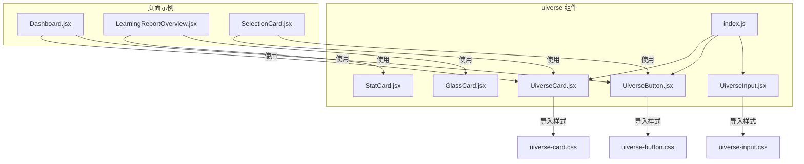
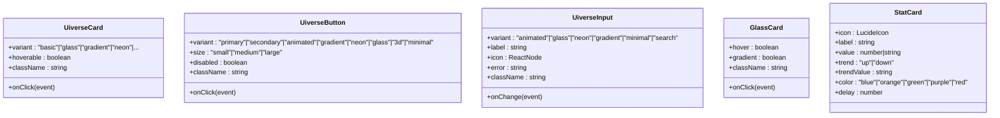
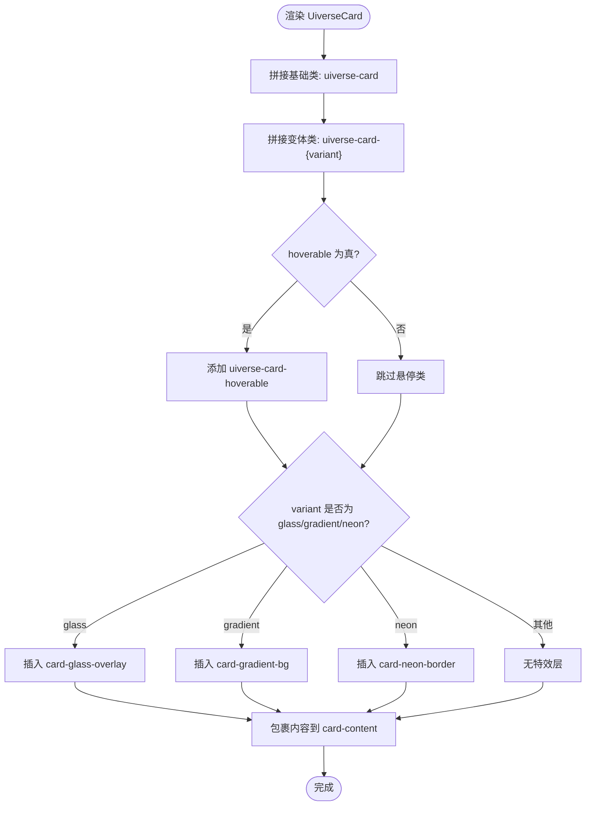
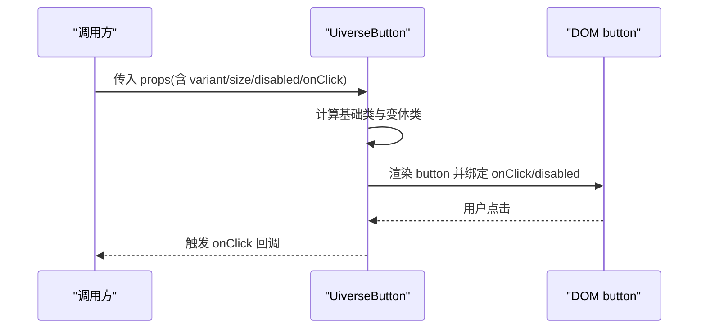
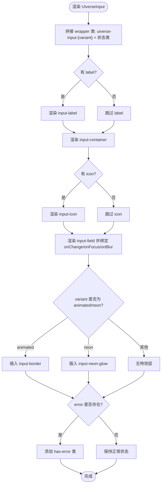
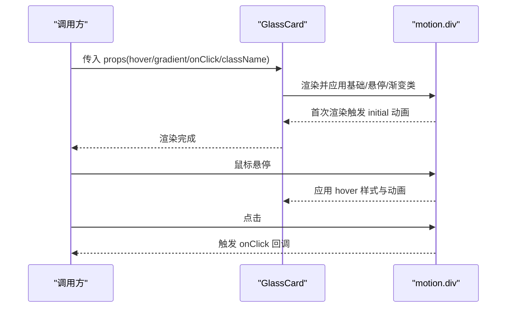
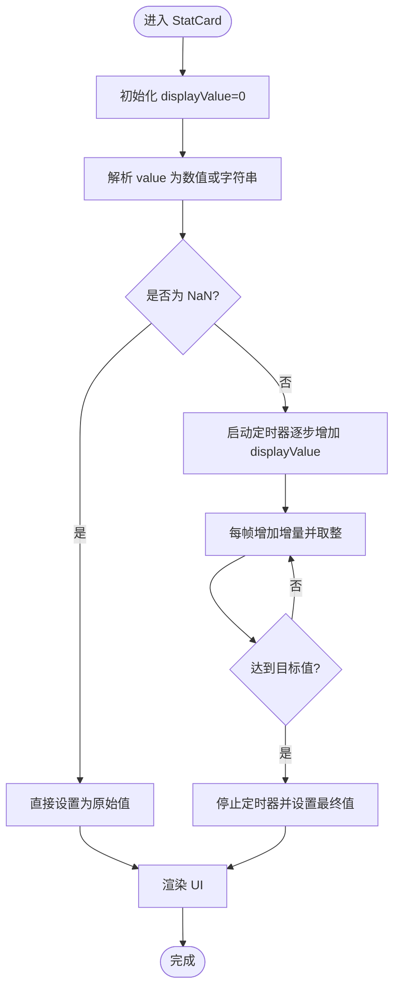
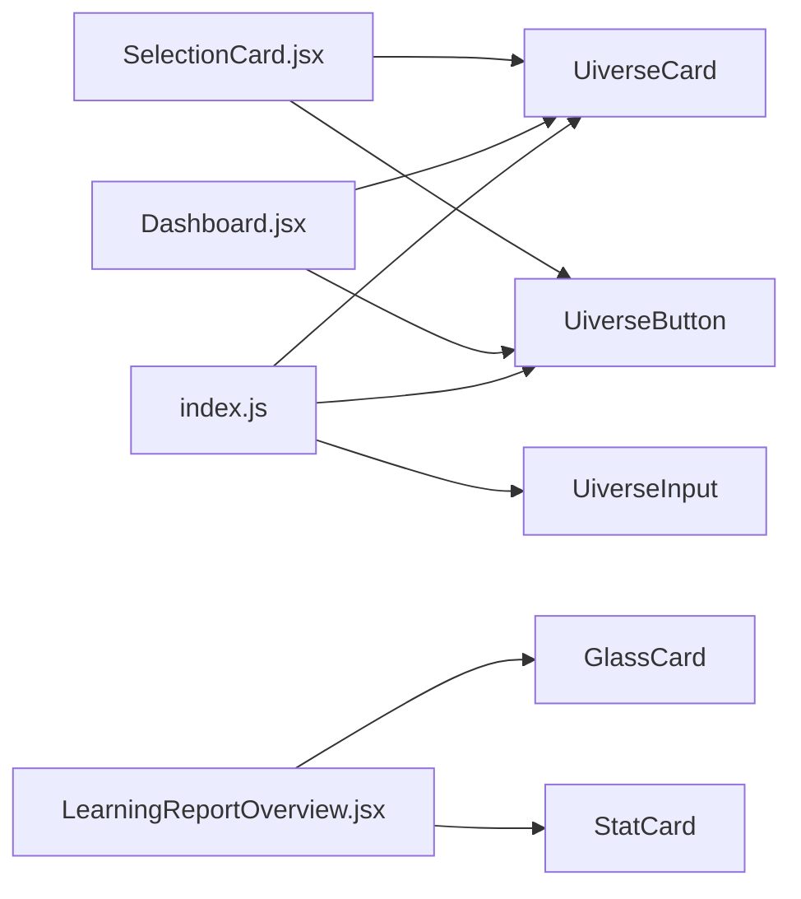

# Uiverse基础UI元素

<cite>
**本文引用的文件列表**
- [UiverseCard.jsx](file://src/components/uiverse/UiverseCard.jsx)
- [uiverse-card.css](file://src/components/uiverse/uiverse-card.css)
- [UiverseButton.jsx](file://src/components/uiverse/UiverseButton.jsx)
- [uiverse-button.css](file://src/components/uiverse/uiverse-button.css)
- [UiverseInput.jsx](file://src/components/uiverse/UiverseInput.jsx)
- [uiverse-input.css](file://src/components/uiverse/uiverse-input.css)
- [GlassCard.jsx](file://src/components/uiverse/GlassCard.jsx)
- [StatCard.jsx](file://src/components/uiverse/StatCard.jsx)
- [index.js](file://src/components/uiverse/index.js)
- [Dashboard.jsx](file://src/pages/Dashboard.jsx)
- [LearningReportOverview.jsx](file://src/pages/LearningReportOverview.jsx)
- [SelectionCard.jsx](file://src/components/SelectionCard.jsx)
</cite>

## 目录
1. [简介](#简介)
2. [项目结构](#项目结构)
3. [核心组件](#核心组件)
4. [架构总览](#架构总览)
5. [组件详解](#组件详解)
6. [依赖关系分析](#依赖关系分析)
7. [性能考量](#性能考量)
8. [故障排查指南](#故障排查指南)
9. [结论](#结论)
10. [附录：使用示例与最佳实践](#附录使用示例与最佳实践)

## 简介
本文件系统化梳理Uiverse组件库中的基础UI元素，包括UiverseCard（卡片容器）、UiverseButton（按钮）、UiverseInput（输入框）、GlassCard（玻璃态卡片）、StatCard（统计卡片）。内容覆盖：
- 样式架构：基于Tailwind与自定义CSS混合的设计体系
- 支持的props与事件处理机制
- 特效实现原理：如GlassCard的背景模糊、StatCard的数值动画与布局
- 导出机制与在页面中的使用示例
- 设计一致性、可定制性与性能优化建议

## 项目结构
Uiverse基础组件位于src/components/uiverse目录，采用“按组件分层”的组织方式：每个组件一个JS文件与其配套的CSS样式文件；index.js统一导出，便于在页面中按需引入。

**图示来源**
- [UiverseCard.jsx](file://src/components/uiverse/UiverseCard.jsx#L1-L33)
- [UiverseButton.jsx](file://src/components/uiverse/UiverseButton.jsx#L1-L48)
- [UiverseInput.jsx](file://src/components/uiverse/UiverseInput.jsx#L1-L54)
- [GlassCard.jsx](file://src/components/uiverse/GlassCard.jsx#L1-L60)
- [StatCard.jsx](file://src/components/uiverse/StatCard.jsx#L1-L108)
- [index.js](file://src/components/uiverse/index.js#L1-L4)
- [Dashboard.jsx](file://src/pages/Dashboard.jsx#L1-L200)
- [LearningReportOverview.jsx](file://src/pages/LearningReportOverview.jsx#L1-L200)
- [SelectionCard.jsx](file://src/components/SelectionCard.jsx#L1-L28)

**章节来源**
- [index.js](file://src/components/uiverse/index.js#L1-L4)
- [Dashboard.jsx](file://src/pages/Dashboard.jsx#L1-L200)
- [LearningReportOverview.jsx](file://src/pages/LearningReportOverview.jsx#L1-L200)
- [SelectionCard.jsx](file://src/components/SelectionCard.jsx#L1-L28)

## 核心组件
- UiverseCard：卡片容器，支持多种变体（basic、glass、gradient、neon、3d、interactive、shine、border-gradient等），可配置hoverable与点击回调
- UiverseButton：按钮，支持多种变体（primary、secondary、animated、gradient、neon、glass、3d、minimal等）与尺寸（small、medium、large），支持disabled与点击回调
- UiverseInput：输入框，支持多种变体（animated、glass、neon、gradient、minimal、search等），内置标签浮动、错误状态、图标与焦点状态
- GlassCard：深色主题玻璃态卡片，具备backdrop滤镜、渐变边框与悬停动效
- StatCard：统计卡片，带数字动画、趋势指示器与多色彩主题

**章节来源**
- [UiverseCard.jsx](file://src/components/uiverse/UiverseCard.jsx#L1-L33)
- [UiverseButton.jsx](file://src/components/uiverse/UiverseButton.jsx#L1-L48)
- [UiverseInput.jsx](file://src/components/uiverse/UiverseInput.jsx#L1-L54)
- [GlassCard.jsx](file://src/components/uiverse/GlassCard.jsx#L1-L60)
- [StatCard.jsx](file://src/components/uiverse/StatCard.jsx#L1-L108)

## 架构总览
Uiverse组件遵循“原子化+变体”的设计原则：
- 原子类：每个组件以基础类名作为根，再拼接变体类名与尺寸/状态类名
- Tailwind与自定义CSS混合：大量使用Tailwind原子类进行布局与基础样式，同时通过自定义CSS实现复杂特效（如玻璃态、霓虹光晕、渐变过渡）
- 变体与状态：通过props控制variant、size、disabled、hoverable、gradient、error等，动态拼接className
- 动画与交互：部分组件使用framer-motion实现入场/悬停动画，提升交互体验

**图示来源**
- [UiverseCard.jsx](file://src/components/uiverse/UiverseCard.jsx#L1-L33)
- [UiverseButton.jsx](file://src/components/uiverse/UiverseButton.jsx#L1-L48)
- [UiverseInput.jsx](file://src/components/uiverse/UiverseInput.jsx#L1-L54)
- [GlassCard.jsx](file://src/components/uiverse/GlassCard.jsx#L1-L60)
- [StatCard.jsx](file://src/components/uiverse/StatCard.jsx#L1-L108)

## 组件详解

### UiverseCard（卡片容器）
- 样式架构
  - 基础类：uiverse-card
  - 变体类：uiverse-card-{variant}，支持basic、glass、gradient、neon、3d、interactive、shine、border-gradient等
  - 悬停类：uiverse-card-hoverable（由hoverable prop决定是否添加）
  - 内容层：card-content，确保z-index高于特效层
  - 特效层：glass使用card-glass-overlay；gradient使用card-gradient-bg；neon使用card-neon-border
- props
  - variant：卡片变体
  - hoverable：是否启用悬停效果
  - onClick：点击回调
  - className：扩展类名
  - 其余props透传至外层div
- 事件处理
  - 外层div绑定onClick，便于卡片级交互
- 使用示例
  - 在Dashboard中以variant="glass"与hoverable组合使用
  - 在SelectionCard中以variant="border-gradient"展示强调边框

**图示来源**
- [UiverseCard.jsx](file://src/components/uiverse/UiverseCard.jsx#L1-L33)
- [uiverse-card.css](file://src/components/uiverse/uiverse-card.css#L1-L246)

**章节来源**
- [UiverseCard.jsx](file://src/components/uiverse/UiverseCard.jsx#L1-L33)
- [uiverse-card.css](file://src/components/uiverse/uiverse-card.css#L1-L246)
- [Dashboard.jsx](file://src/pages/Dashboard.jsx#L55-L187)
- [SelectionCard.jsx](file://src/components/SelectionCard.jsx#L1-L28)

### UiverseButton（按钮）
- 样式架构
  - 基础类：uiverse-btn
  - 尺寸类：uiverse-btn-{size}（small、medium、large）
  - 变体类：uiverse-btn-{variant}（primary、secondary、animated、gradient、neon、glass、3d、minimal）
  - 禁用态：:disabled选择器控制透明度与光标
  - 特效层：animated使用btn-glow；gradient使用btn-gradient-overlay；neon使用btn-neon-border
- props
  - variant：按钮变体
  - size：按钮尺寸
  - disabled：禁用态
  - onClick：点击回调
  - className：扩展类名
  - 其余props透传至button
- 事件处理
  - button原生onClick与disabled属性
- 使用示例
  - 在Dashboard中以variant="gradient"/"animated"/"primary"与size="medium"组合使用
  - 在SelectionCard中根据buttonType切换variant="secondary"/"primary"

**图示来源**
- [UiverseButton.jsx](file://src/components/uiverse/UiverseButton.jsx#L1-L48)
- [uiverse-button.css](file://src/components/uiverse/uiverse-button.css#L1-L249)

**章节来源**
- [UiverseButton.jsx](file://src/components/uiverse/UiverseButton.jsx#L1-L48)
- [uiverse-button.css](file://src/components/uiverse/uiverse-button.css#L1-L249)
- [Dashboard.jsx](file://src/pages/Dashboard.jsx#L78-L184)
- [SelectionCard.jsx](file://src/components/SelectionCard.jsx#L1-L28)

### UiverseInput（输入框）
- 样式架构
  - 容器：uiverse-input-wrapper，支持has-error、is-focused、has-value等状态类
  - 输入区：input-container，内含input-field与可选icon
  - 标签：input-label（animated变体支持浮动标签）
  - 错误提示：input-error-message
  - 变体类：animated、glass、neon、gradient、minimal、search
  - 特效层：animated使用input-border；neon使用input-neon-glow
- props
  - type、placeholder、value、onChange、variant、label、icon、error、className
  - 其余props透传至input
- 事件处理
  - 内部管理isFocused与hasValue状态，onChange会同步更新hasValue
  - input聚焦/失焦分别设置isFocused
- 使用示例
  - 在页面中作为通用输入控件，配合label与icon使用

**图示来源**
- [UiverseInput.jsx](file://src/components/uiverse/UiverseInput.jsx#L1-L54)
- [uiverse-input.css](file://src/components/uiverse/uiverse-input.css#L1-L254)

**章节来源**
- [UiverseInput.jsx](file://src/components/uiverse/UiverseInput.jsx#L1-L54)
- [uiverse-input.css](file://src/components/uiverse/uiverse-input.css#L1-L254)

### GlassCard（玻璃态卡片）
- 样式架构
  - 基础：使用Tailwind原子类设置圆角、背景、边框、阴影与过渡
  - 玻璃态：backdrop-blur-xl、半透明背景与边框
  - 悬停：hover:bg-slate-800/80、hover:border-slate-600/50、hover:shadow-2xl、hover:-translate-y-1
  - 渐变边框：通过before伪元素与hover时opacity变化实现
  - 内容层：相对定位与z-index确保内容在特效之上
- props
  - hover、gradient、onClick、className
  - 其余props透传至motion.div
- 动画与交互
  - 初始入场：initial={{ opacity: 0, y: 20 }}，animate={{ opacity: 1, y: 0 }}
- 实现要点
  - 使用backdrop-filter与opacity控制玻璃态与渐变边框
  - 通过z-index与pointer-events确保渐变层不影响交互

**图示来源**
- [GlassCard.jsx](file://src/components/uiverse/GlassCard.jsx#L1-L60)

**章节来源**
- [GlassCard.jsx](file://src/components/uiverse/GlassCard.jsx#L1-L60)

### StatCard（统计卡片）
- 样式架构
  - 基础：白色背景、浅灰边框、阴影与hover效果
  - 背景装饰：绝对定位的渐变圆形，按颜色主题配置透明度
  - 图标区：圆角背景与图标颜色随主题变化
  - 趋势指示器：根据trend值显示上升/下降图标与数值
  - 数值文本：使用渐变文字背景与裁剪实现彩色数字
- props
  - icon、label、value、trend、trendValue、color、delay
- 动画与交互
  - framer-motion入场：opacity/scale动画，支持delay
  - 数字动画：通过useEffect与setInterval实现从0到目标值的平滑过渡
- 数据可视化布局
  - 上方图标与趋势，下方label与数值，整体采用相对定位与z-index分层

**图示来源**
- [StatCard.jsx](file://src/components/uiverse/StatCard.jsx#L1-L108)

**章节来源**
- [StatCard.jsx](file://src/components/uiverse/StatCard.jsx#L1-L108)
- [LearningReportOverview.jsx](file://src/pages/LearningReportOverview.jsx#L159-L196)

## 依赖关系分析
- 组件间依赖
  - UiverseCard、UiverseButton、UiverseInput各自导入对应CSS文件，形成“组件+样式”的强耦合
  - GlassCard与StatCard内部使用framer-motion，属于外部依赖
- 页面使用
  - Dashboard：引入UiverseCard与UiverseButton，用于主页功能入口卡片
  - LearningReportOverview：引入GlassCard与StatCard，用于统计卡片与玻璃态容器
  - SelectionCard：引入UiverseCard与UiverseButton，用于选择卡片
- 导出机制
  - index.js统一导出UiverseButton、UiverseCard、UiverseInput，便于集中引入与Tree Shaking

**图示来源**
- [index.js](file://src/components/uiverse/index.js#L1-L4)
- [Dashboard.jsx](file://src/pages/Dashboard.jsx#L1-L200)
- [LearningReportOverview.jsx](file://src/pages/LearningReportOverview.jsx#L1-L200)
- [SelectionCard.jsx](file://src/components/SelectionCard.jsx#L1-L28)

**章节来源**
- [index.js](file://src/components/uiverse/index.js#L1-L4)
- [Dashboard.jsx](file://src/pages/Dashboard.jsx#L1-L200)
- [LearningReportOverview.jsx](file://src/pages/LearningReportOverview.jsx#L1-L200)
- [SelectionCard.jsx](file://src/components/SelectionCard.jsx#L1-L28)

## 性能考量
- 避免重绘与重排
  - 使用Tailwind原子类减少自定义样式的复杂度，降低样式计算成本
  - 将复杂特效（如backdrop-filter、渐变边框）限制在必要层级，避免影响内容层
- 动画与过渡
  - 使用transform与opacity等可合成属性，减少强制同步布局
  - 控制动画时长与延迟，避免密集动画堆积
- 数字动画
  - StatCard的数字动画采用setInterval与固定帧率，建议在大数据量场景下考虑使用requestAnimationFrame或更高效的动画库
- 变体与状态
  - 通过className拼接而非内联样式，有利于浏览器缓存与复用
- Tree Shaking与按需引入
  - 通过index.js集中导出，结合ES模块特性，减少未使用代码打包体积

[本节为通用性能建议，不直接分析具体文件，故无“章节来源”]

## 故障排查指南
- 按钮禁用无效
  - 检查是否正确传递disabled属性；确认CSS中:disabled选择器生效
  - 参考路径：[uiverse-button.css](file://src/components/uiverse/uiverse-button.css#L13-L16)
- 输入框标签不浮动
  - 确认variant为animated且已设置label；检查is-focused/has-value状态类是否正确添加
  - 参考路径：[uiverse-input.css](file://src/components/uiverse/uiverse-input.css#L54-L101)
- 玻璃态卡片模糊不生效
  - 确认浏览器支持backdrop-filter；检查backdrop-blur-xl与半透明背景是否被上层元素遮挡
  - 参考路径：[GlassCard.jsx](file://src/components/uiverse/GlassCard.jsx#L15-L21)
- 统计卡片数字不变化
  - 检查value类型是否为数字或可解析字符串；确认useEffect依赖与定时器清理
  - 参考路径：[StatCard.jsx](file://src/components/uiverse/StatCard.jsx#L17-L42)
- 卡片点击无响应
  - 确认onClick是否传入；检查外层div是否被其他元素覆盖
  - 参考路径：[UiverseCard.jsx](file://src/components/uiverse/UiverseCard.jsx#L16-L21)

**章节来源**
- [uiverse-button.css](file://src/components/uiverse/uiverse-button.css#L13-L16)
- [uiverse-input.css](file://src/components/uiverse/uiverse-input.css#L54-L101)
- [GlassCard.jsx](file://src/components/uiverse/GlassCard.jsx#L15-L21)
- [StatCard.jsx](file://src/components/uiverse/StatCard.jsx#L17-L42)
- [UiverseCard.jsx](file://src/components/uiverse/UiverseCard.jsx#L16-L21)

## 结论
Uiverse基础UI元素通过“原子化+变体”的设计，实现了高一致性与强可定制性：
- 样式体系清晰：Tailwind负责布局与基础样式，自定义CSS承载复杂特效
- 交互体验丰富：通过变体与动画增强视觉反馈
- 使用便捷：index.js统一导出，页面按需引入
- 性能友好：优先使用可合成属性与原子类，减少重绘风险

[本节为总结性内容，不直接分析具体文件，故无“章节来源”]

## 附录：使用示例与最佳实践

### 组件导出机制（index.js）
- 作用：集中导出UiverseButton、UiverseCard、UiverseInput，便于在页面中统一引入
- 引入方式：在页面中通过import { UiverseButton, UiverseCard, UiverseInput } from '../components/uiverse'使用
- 参考路径：[index.js](file://src/components/uiverse/index.js#L1-L4)

**章节来源**
- [index.js](file://src/components/uiverse/index.js#L1-L4)

### 在不同主题下的复用示例
- 主题一：Dashboard（浅色背景+卡片玻璃态）
  - 使用UiverseCard(variant="glass")与UiverseButton(variant="gradient"/"animated"/"primary")构建功能入口卡片
  - 参考路径：[Dashboard.jsx](file://src/pages/Dashboard.jsx#L55-L187)
- 主题二：学习报告页（深色背景+玻璃态容器+统计卡片）
  - 使用GlassCard作为容器，StatCard展示关键指标，配合趋势指示器
  - 参考路径：[LearningReportOverview.jsx](file://src/pages/LearningReportOverview.jsx#L159-L196)
- 主题三：选择卡片（强调边框）
  - 使用UiverseCard(variant="border-gradient")与UiverseButton(variant="secondary"/"primary")组合
  - 参考路径：[SelectionCard.jsx](file://src/components/SelectionCard.jsx#L1-L28)

**章节来源**
- [Dashboard.jsx](file://src/pages/Dashboard.jsx#L55-L187)
- [LearningReportOverview.jsx](file://src/pages/LearningReportOverview.jsx#L159-L196)
- [SelectionCard.jsx](file://src/components/SelectionCard.jsx#L1-L28)

### 设计系统一致性与可定制性
- 一致性
  - 所有组件均以基础类名+变体类名的命名规范，确保视觉与交互的一致性
  - 变体与状态类名遵循统一前缀（如uiverse-card-*、uiverse-btn-*、uiverse-input-*）
- 可定制性
  - 通过className扩展，可在不修改源码的前提下覆盖样式
  - 变体与状态props提供灵活的外观与行为控制
- 性能优化
  - 优先使用Tailwind原子类与可合成属性
  - 控制动画数量与时长，避免密集重绘
  - 对于复杂特效（如backdrop-filter），仅在必要场景启用

[本节为通用指导，不直接分析具体文件，故无“章节来源”]