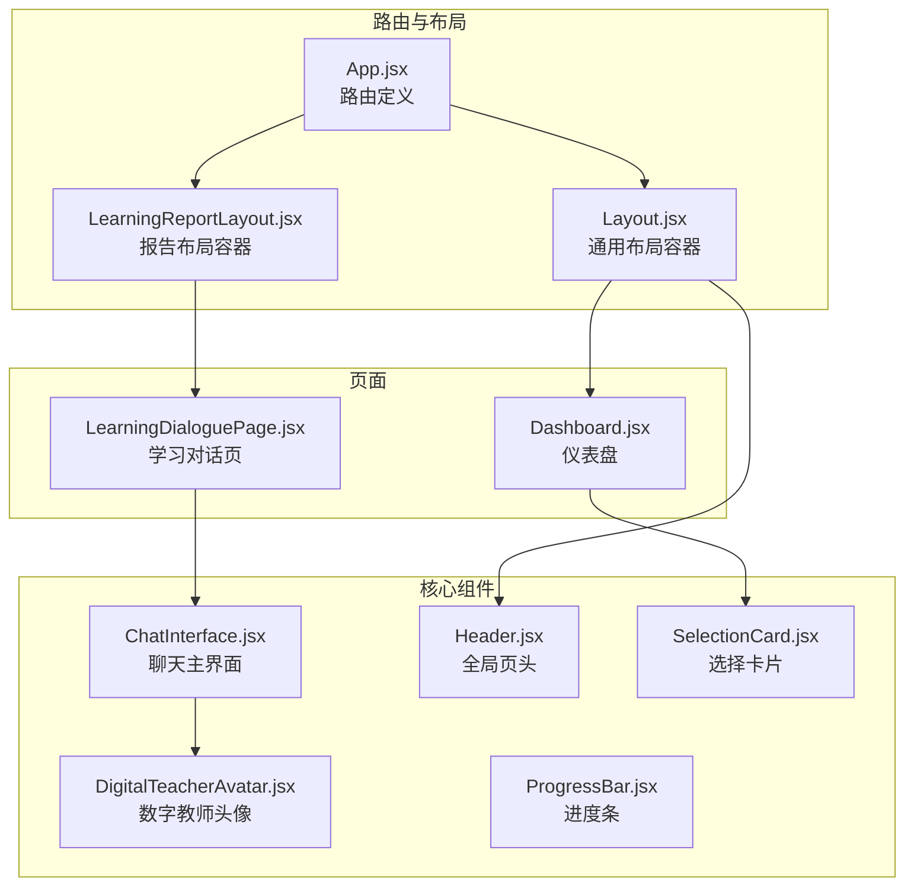
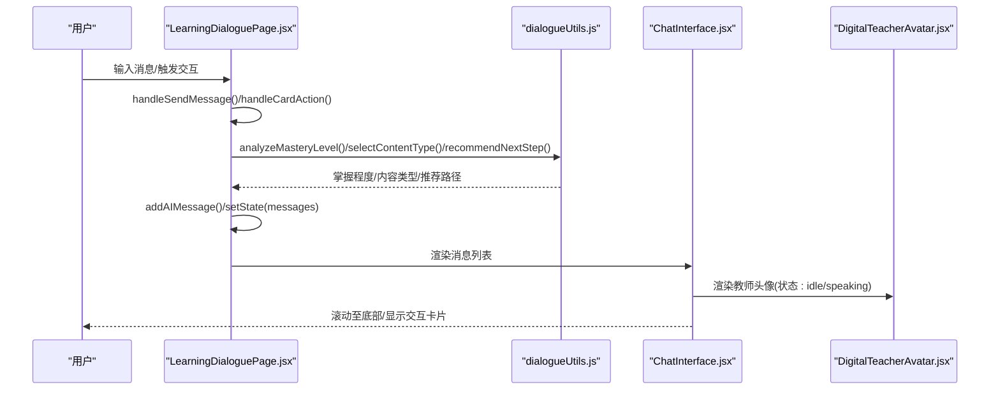
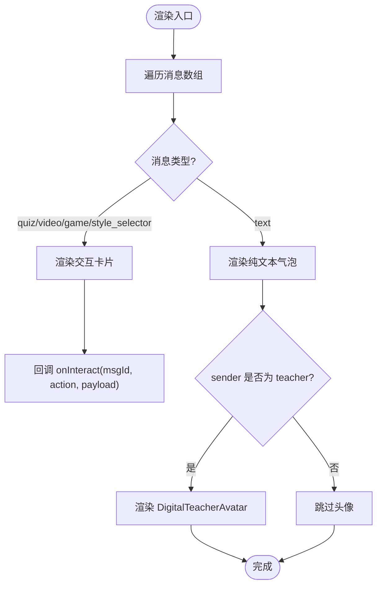
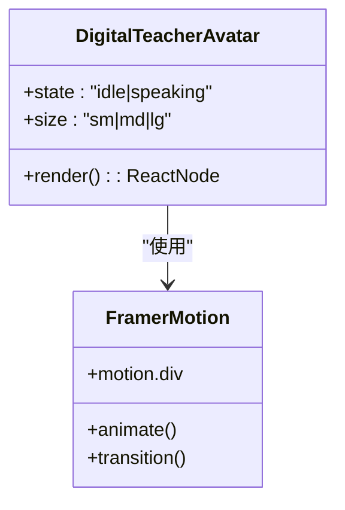
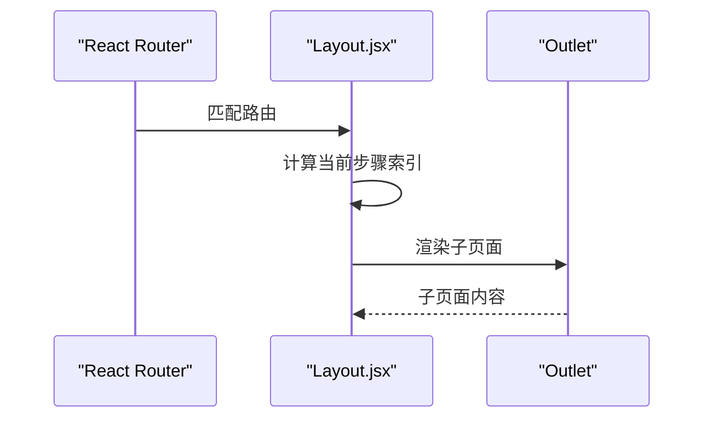
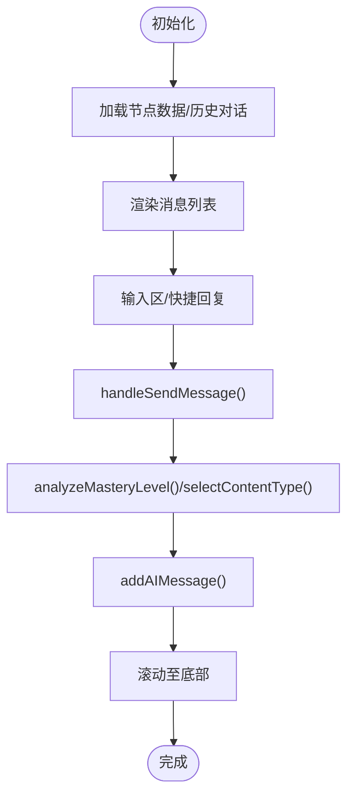
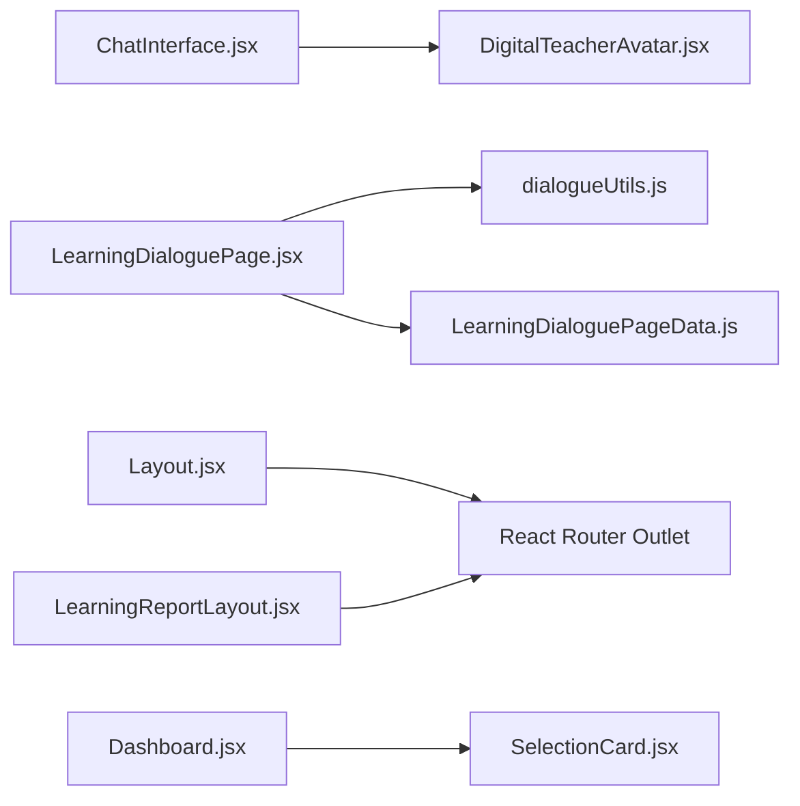

# 核心界面组件

<cite>
**本文引用的文件**
- [ChatInterface.jsx](file://src/components/ChatInterface.jsx)
- [DigitalTeacherAvatar.jsx](file://src/components/DigitalTeacherAvatar.jsx)
- [Header.jsx](file://src/components/Header.jsx)
- [Layout.jsx](file://src/components/Layout.jsx)
- [LearningReportLayout.jsx](file://src/components/LearningReportLayout.jsx)
- [ProgressBar.jsx](file://src/components/ProgressBar.jsx)
- [SelectionCard.jsx](file://src/components/SelectionCard.jsx)
- [Dashboard.jsx](file://src/pages/Dashboard.jsx)
- [LearningDialoguePage.jsx](file://src/pages/LearningDialoguePage.jsx)
- [App.jsx](file://src/App.jsx)
- [dialogueUtils.js](file://src/utils/dialogueUtils.js)
- [LearningDialoguePageData.js](file://src/data/LearningDialoguePageData.js)
</cite>

## 目录
1. [引言](#引言)
2. [项目结构](#项目结构)
3. [核心组件](#核心组件)
4. [架构总览](#架构总览)
5. [详细组件分析](#详细组件分析)
6. [依赖关系分析](#依赖关系分析)
7. [性能考量](#性能考量)
8. [故障排查指南](#故障排查指南)
9. [结论](#结论)
10. [附录](#附录)

## 引言
本文件面向开发者与产品人员，系统化梳理项目中的核心界面组件，重点覆盖：
- ChatInterface（聊天主界面）的消息流渲染机制、输入区集成逻辑与滚动行为优化
- DigitalTeacherAvatar（数字教师形象）的3D模型集成现状与动画状态管理
- Header（全局页头）、Layout（通用布局容器）、LearningReportLayout（报告专用布局）
- ProgressBar（进度条）、SelectionCard（选择卡片）
并结合 Dashboard、LearningDialoguePage 等场景说明组件间的通信模式（props/context）、潜在性能瓶颈与优化策略。

## 项目结构
项目采用按功能域分层组织：components（通用UI组件）、pages（页面）、data（静态数据）、utils（工具函数）、App.jsx（路由入口）。核心组件均位于 src/components 下，页面位于 src/pages 下，路由在 App.jsx 中集中配置。

图示来源
- [App.jsx](file://src/App.jsx#L1-L101)
- [Layout.jsx](file://src/components/Layout.jsx#L1-L90)
- [LearningReportLayout.jsx](file://src/components/LearningReportLayout.jsx#L1-L129)
- [Dashboard.jsx](file://src/pages/Dashboard.jsx#L1-L211)
- [LearningDialoguePage.jsx](file://src/pages/LearningDialoguePage.jsx#L1-L536)
- [ChatInterface.jsx](file://src/components/ChatInterface.jsx#L1-L170)
- [DigitalTeacherAvatar.jsx](file://src/components/DigitalTeacherAvatar.jsx#L1-L63)
- [Header.jsx](file://src/components/Header.jsx#L1-L27)
- [ProgressBar.jsx](file://src/components/ProgressBar.jsx#L1-L23)
- [SelectionCard.jsx](file://src/components/SelectionCard.jsx#L1-L29)

章节来源
- [App.jsx](file://src/App.jsx#L1-L101)

## 核心组件
- ChatInterface：负责消息列表渲染、输入区处理、滚动至底部、交互卡片渲染（测验、视频、游戏、风格选择等），并与父组件通过 props 传递 onSendMessage/onInteract 回调。
- DigitalTeacherAvatar：提供教师头像占位与状态指示，支持 idle/speaking 动画状态，使用 Framer Motion 实现呼吸/脉冲效果。
- Header：全局页头，包含品牌标识与帮助按钮。
- Layout：通用布局容器，内含顶部进度步骤条与 Outlet 内容区，用于评估流程页面的统一导航。
- LearningReportLayout：学习报告系统的专用布局，提供报告页签导航、导出/分享能力与学生信息展示。
- ProgressBar：轻量进度条组件，用于步骤提示与进度展示。
- SelectionCard：卡片式选择入口，封装 Uiverse 卡片与按钮，便于在 Dashboard 等页面进行功能入口选择。

章节来源
- [ChatInterface.jsx](file://src/components/ChatInterface.jsx#L1-L170)
- [DigitalTeacherAvatar.jsx](file://src/components/DigitalTeacherAvatar.jsx#L1-L63)
- [Header.jsx](file://src/components/Header.jsx#L1-L27)
- [Layout.jsx](file://src/components/Layout.jsx#L1-L90)
- [LearningReportLayout.jsx](file://src/components/LearningReportLayout.jsx#L1-L129)
- [ProgressBar.jsx](file://src/components/ProgressBar.jsx#L1-L23)
- [SelectionCard.jsx](file://src/components/SelectionCard.jsx#L1-L29)

## 架构总览
组件间通信与数据流：
- 页面向 ChatInterface 传入 messages、isTyping、placeholder，并通过 onSendMessage/onInteract 与父组件交互。
- LearningDialoguePage 内部维护消息列表与输入值，使用工具函数进行对话历史持久化、掌握程度分析与内容类型选择。
- Layout/LearningReportLayout 通过 Outlet 插槽承载子页面，实现路由级别的内容切换与统一头部导航。
- Dashboard 通过 SelectionCard 展示功能入口，点击后导航至对应页面。

图示来源
- [LearningDialoguePage.jsx](file://src/pages/LearningDialoguePage.jsx#L1-L536)
- [dialogueUtils.js](file://src/utils/dialogueUtils.js#L1-L495)
- [ChatInterface.jsx](file://src/components/ChatInterface.jsx#L1-L170)
- [DigitalTeacherAvatar.jsx](file://src/components/DigitalTeacherAvatar.jsx#L1-L63)

## 详细组件分析

### ChatInterface 组件
职责与实现要点：
- 消息流渲染：基于消息数组逐条渲染，区分用户与教师消息，使用 Framer Motion 的 AnimatePresence/motion 实现入场/离场动画。
- 交互卡片：根据消息类型渲染 QuizCard、VideoCard、LogicGameCard、StyleSelector 等，通过 onInteract 回调向上层传递交互结果。
- 输入区集成：受控输入框、回车发送、禁用态控制、发送按钮与图标。
- 滚动行为优化：useEffect 在 messages/isTyping 变化时平滑滚动至底部，保证新消息可见。
- 教师头像：在教师消息旁渲染 DigitalTeacherAvatar，状态随 isTyping 切换为 speaking。

图示来源
- [ChatInterface.jsx](file://src/components/ChatInterface.jsx#L1-L170)

章节来源
- [ChatInterface.jsx](file://src/components/ChatInterface.jsx#L1-L170)

### DigitalTeacherAvatar 组件
职责与实现要点：
- 3D 模型集成现状：当前未集成 Three.js，而是通过 SVG/Framer Motion 实现“发光环+抽象人脸”的视觉效果，配合状态 state 控制呼吸/脉冲动画与状态指示灯。
- 动画状态管理：idle/speaking 两种状态，speaking 时放大/透明度变化，pulse 状态指示灯持续跳动。
- 尺寸控制：通过 size 参数控制尺寸类名，适配不同密度场景。

图示来源
- [DigitalTeacherAvatar.jsx](file://src/components/DigitalTeacherAvatar.jsx#L1-L63)

章节来源
- [DigitalTeacherAvatar.jsx](file://src/components/DigitalTeacherAvatar.jsx#L1-L63)

### Header 组件
职责与实现要点：
- 全局页头，左侧品牌标识，右侧帮助按钮，简洁一致的品牌风格。

章节来源
- [Header.jsx](file://src/components/Header.jsx#L1-L27)

### Layout 组件
职责与实现要点：
- 顶部进度步骤条：根据当前路由计算步骤索引，高亮当前步骤并绘制连接线。
- 内容区：通过 Outlet 插槽承载子页面，使用 Framer Motion 实现路由切换的淡入/滑入动画。
- 与路由集成：App.jsx 中以 Layout 包裹评估流程相关路由，形成统一导航体验。

图示来源
- [Layout.jsx](file://src/components/Layout.jsx#L1-L90)
- [App.jsx](file://src/App.jsx#L1-L101)

章节来源
- [Layout.jsx](file://src/components/Layout.jsx#L1-L90)
- [App.jsx](file://src/App.jsx#L1-L101)

### LearningReportLayout 组件
职责与实现要点：
- 报告系统专用布局：顶部返回与学生信息展示，右侧导出/分享按钮。
- 导航标签：三个报告页签（概览/详情/建议），使用 layoutId 实现活动指示器的平滑过渡。
- 子页面：通过 Outlet 承载 LearningReportOverview/Details/Recommendations。

章节来源
- [LearningReportLayout.jsx](file://src/components/LearningReportLayout.jsx#L1-L129)

### ProgressBar 组件
职责与实现要点：
- 步骤进度展示：标题+百分比进度条，颜色与轨道可配置，适合评估流程中的步骤提示。

章节来源
- [ProgressBar.jsx](file://src/components/ProgressBar.jsx#L1-L23)

### SelectionCard 组件
职责与实现要点：
- 卡片式入口：图标、标题、描述、按钮，统一使用 Uiverse 卡片与按钮样式，便于在 Dashboard 等页面进行功能入口选择。

章节来源
- [SelectionCard.jsx](file://src/components/SelectionCard.jsx#L1-L29)

### Dashboard 场景集成
- 通过 SelectionCard 将功能入口（学习路径、学习轨迹、报告、错题本）统一展示，点击后导航至对应页面。
- 与 Header/Layout 协同，形成完整的评估流程与主页体验。

章节来源
- [Dashboard.jsx](file://src/pages/Dashboard.jsx#L1-L211)
- [SelectionCard.jsx](file://src/components/SelectionCard.jsx#L1-L29)
- [Header.jsx](file://src/components/Header.jsx#L1-L27)
- [Layout.jsx](file://src/components/Layout.jsx#L1-L90)

### LearningDialoguePage 场景集成
- 内置消息气泡渲染与输入区，支持快捷回复与模式切换（问答/教学）。
- 通过工具函数实现对话历史持久化、掌握程度分析、内容类型选择与下一步推荐。
- 与 ChatInterface 的消息流渲染思路一致，但页面内部自行管理状态与滚动。

图示来源
- [LearningDialoguePage.jsx](file://src/pages/LearningDialoguePage.jsx#L1-L536)
- [dialogueUtils.js](file://src/utils/dialogueUtils.js#L1-L495)
- [LearningDialoguePageData.js](file://src/data/LearningDialoguePageData.js#L1-L159)

章节来源
- [LearningDialoguePage.jsx](file://src/pages/LearningDialoguePage.jsx#L1-L536)
- [dialogueUtils.js](file://src/utils/dialogueUtils.js#L1-L495)
- [LearningDialoguePageData.js](file://src/data/LearningDialoguePageData.js#L1-L159)

## 依赖关系分析
- 组件耦合与内聚
  - ChatInterface 与 DigitalTeacherAvatar：弱耦合，通过 props 传入 state/size，渲染层依赖。
  - LearningDialoguePage 与 ChatInterface：页面内部自管消息与输入，通过工具函数与外部交互，组件间通过 props 传递消息与回调。
  - Layout/LearningReportLayout：通过 Outlet 插槽承载子页面，路由层与视图层解耦。
- 外部依赖
  - Framer Motion：用于动画与过渡（ChatInterface、DigitalTeacherAvatar、Layout）。
  - Ant Design：ProgressBar、Button、Avatar 等（在部分页面中使用）。
  - Lucide Icons：图标库贯穿多个组件与页面。
- 潜在循环依赖
  - 组件间无直接循环导入；工具函数与数据模块独立，避免循环依赖风险。

图示来源
- [ChatInterface.jsx](file://src/components/ChatInterface.jsx#L1-L170)
- [DigitalTeacherAvatar.jsx](file://src/components/DigitalTeacherAvatar.jsx#L1-L63)
- [LearningDialoguePage.jsx](file://src/pages/LearningDialoguePage.jsx#L1-L536)
- [dialogueUtils.js](file://src/utils/dialogueUtils.js#L1-L495)
- [LearningDialoguePageData.js](file://src/data/LearningDialoguePageData.js#L1-L159)
- [Layout.jsx](file://src/components/Layout.jsx#L1-L90)
- [LearningReportLayout.jsx](file://src/components/LearningReportLayout.jsx#L1-L129)
- [Dashboard.jsx](file://src/pages/Dashboard.jsx#L1-L211)
- [SelectionCard.jsx](file://src/components/SelectionCard.jsx#L1-L29)

## 性能考量
- 频繁重渲染风险
  - ChatInterface：messages/isTyping 变化即触发滚动与动画，若消息数组过大或频繁更新，可能导致重排与重绘压力。建议：
    - 使用稳定 key（已使用 msg.id 或索引）；确保消息对象引用稳定，避免不必要的重渲染。
    - 对长列表启用虚拟滚动（如 react-window/react-virtual）以减少 DOM 节点数量。
  - LearningDialoguePage：messages 状态在每次新增消息时全量替换，建议：
    - 使用不可变更新策略，仅追加最新消息，避免整体数组引用变更。
    - 对输入框与快捷回复区域使用局部状态，减少无关区域重渲染。
- 动画与滚动
  - Framer Motion 动画在大量元素同时入场/离场时可能造成帧率抖动，建议：
    - 限制同时动画元素数量，或延迟非首屏元素的入场。
    - 使用 transform/opacity 等代价较低的属性，避免强制同步布局。
- 本地存储与计算
  - 对话历史读写与掌握程度分析在主线程执行，建议：
    - 将分析逻辑拆分为 Web Worker 或使用 requestIdleCallback。
    - 对历史数据进行分页/节流写入，避免阻塞 UI。
- 图标与样式
  - Lucide 图标按需引入，避免整库打包；Tailwind 类名应尽量复用，减少重复样式。

[本节为通用指导，不直接分析具体文件]

## 故障排查指南
- 消息未滚动至底部
  - 检查 ChatInterface/useEffect 依赖项是否包含 messages/isTyping，确保 ref 更新顺序正确。
  - 确认父组件传入的 isTyping 与 messages 变化时机。
- 交互卡片无响应
  - 确认 onInteract 回调在 ChatInterface 中被正确调用，且携带正确的 msgId/action/payload。
  - 检查子卡片组件（QuizCard/VideoCard 等）的回调是否正确转发。
- 掌握程度分析不生效
  - 检查 dialogueUtils.analyzeMasteryLevel 的关键词匹配逻辑与输入文本是否包含预期关键字。
  - 确认 LearningDialoguePage.handleCardAction/saveLearningProgress 的调用链路。
- 报告布局导航异常
  - 检查 LearningReportLayout 的 navItems 与 useNavigate 调用，确保路径与当前路由一致。
- 头像动画异常
  - 确认 DigitalTeacherAvatar 的 state 传入是否正确（idle/speaking），以及 Framer Motion 版本兼容性。

章节来源
- [ChatInterface.jsx](file://src/components/ChatInterface.jsx#L1-L170)
- [LearningDialoguePage.jsx](file://src/pages/LearningDialoguePage.jsx#L1-L536)
- [dialogueUtils.js](file://src/utils/dialogueUtils.js#L1-L495)
- [LearningReportLayout.jsx](file://src/components/LearningReportLayout.jsx#L1-L129)
- [DigitalTeacherAvatar.jsx](file://src/components/DigitalTeacherAvatar.jsx#L1-L63)

## 结论
本项目的核心界面组件围绕“消息流渲染、交互卡片、统一布局与导航、进度与入口卡片”构建，配合工具函数实现对话历史、掌握程度与内容类型智能推荐。ChatInterface 与 LearningDialoguePage 在消息流与输入区设计上高度一致，Layout/LearningReportLayout 提供统一的导航体验。建议在高频更新场景中引入虚拟滚动、不可变更新与 Web Worker，以进一步提升性能与稳定性。

[本节为总结性内容，不直接分析具体文件]

## 附录
- 组件间通信模式
  - Props 传递：messages、isTyping、placeholder、state/size 等。
  - 回调传递：onSendMessage/onInteract，用于页面与子组件之间的事件回传。
  - 路由插槽：Layout/LearningReportLayout 通过 Outlet 承载子页面，实现路由级别的内容切换。
- 场景集成示例
  - Dashboard：使用 SelectionCard 作为功能入口，点击后导航至对应页面。
  - LearningDialoguePage：内置消息气泡与输入区，结合工具函数实现对话闭环。

[本节为概览性内容，不直接分析具体文件]