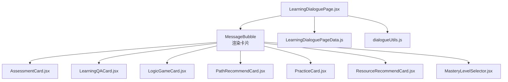
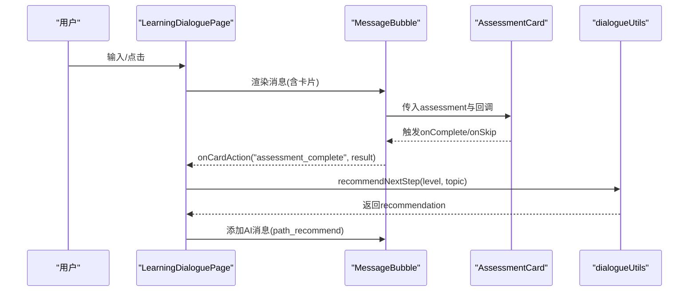
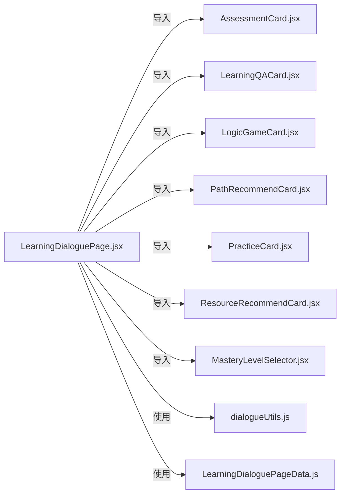

# 聊天小部件

<cite>
**本文引用的文件**
- [AssessmentCard.jsx](file://src/components/chat-widgets/AssessmentCard.jsx)
- [LearningQACard.jsx](file://src/components/chat-widgets/LearningQACard.jsx)
- [LogicGameCard.jsx](file://src/components/chat-widgets/LogicGameCard.jsx)
- [PathRecommendCard.jsx](file://src/components/chat-widgets/PathRecommendCard.jsx)
- [PracticeCard.jsx](file://src/components/chat-widgets/PracticeCard.jsx)
- [ResourceRecommendCard.jsx](file://src/components/chat-widgets/ResourceRecommendCard.jsx)
- [MasteryLevelSelector.jsx](file://src/components/chat-widgets/MasteryLevelSelector.jsx)
- [StyleSelector.jsx](file://src/components/chat-widgets/StyleSelector.jsx)
- [QuizCard.jsx](file://src/components/chat-widgets/QuizCard.jsx)
- [VideoCard.jsx](file://src/components/chat-widgets/VideoCard.jsx)
- [LearningDialoguePage.jsx](file://src/pages/LearningDialoguePage.jsx)
- [LearningDialoguePageData.js](file://src/data/LearningDialoguePageData.js)
- [dialogueUtils.js](file://src/utils/dialogueUtils.js)
</cite>

## 目录
1. [简介](#简介)
2. [项目结构](#项目结构)
3. [核心组件](#核心组件)
4. [架构总览](#架构总览)
5. [组件详解](#组件详解)
6. [依赖关系分析](#依赖关系分析)
7. [性能与可访问性](#性能与可访问性)
8. [故障排查指南](#故障排查指南)
9. [结论](#结论)
10. [附录](#附录)

## 简介
本文件系统性梳理聊天界面中使用的各类“功能卡片组件”，重点覆盖 AssessmentCard（评估卡）、LearningQACard（学习问答卡）、LogicGameCard（逻辑游戏卡）、PathRecommendCard（路径推荐卡）等。文档从视觉风格、交互流程、props 类型、事件回调、在 LearningDialoguePage 中的集成方式、共性与差异、响应式与可访问性、常见错误与调试建议等方面进行深入说明，帮助开发者快速理解并正确使用这些组件。

## 项目结构
聊天小部件集中位于 src/components/chat-widgets 下，页面 LearningDialoguePage 负责渲染消息气泡与调度卡片；数据与工具函数分别来自 src/data 与 src/utils。

**图表来源**
- [LearningDialoguePage.jsx](file://src/pages/LearningDialoguePage.jsx#L36-L126)
- [AssessmentCard.jsx](file://src/components/chat-widgets/AssessmentCard.jsx#L1-L335)
- [LearningQACard.jsx](file://src/components/chat-widgets/LearningQACard.jsx#L1-L140)
- [LogicGameCard.jsx](file://src/components/chat-widgets/LogicGameCard.jsx#L1-L99)
- [PathRecommendCard.jsx](file://src/components/chat-widgets/PathRecommendCard.jsx#L1-L168)
- [PracticeCard.jsx](file://src/components/chat-widgets/PracticeCard.jsx#L1-L272)
- [ResourceRecommendCard.jsx](file://src/components/chat-widgets/ResourceRecommendCard.jsx#L1-L169)
- [MasteryLevelSelector.jsx](file://src/components/chat-widgets/MasteryLevelSelector.jsx#L1-L177)
- [LearningDialoguePageData.js](file://src/data/LearningDialoguePageData.js#L1-L159)
- [dialogueUtils.js](file://src/utils/dialogueUtils.js#L1-L495)

**章节来源**
- [LearningDialoguePage.jsx](file://src/pages/LearningDialoguePage.jsx#L36-L126)
- [LearningDialoguePageData.js](file://src/data/LearningDialoguePageData.js#L1-L159)
- [dialogueUtils.js](file://src/utils/dialogueUtils.js#L1-L495)

## 核心组件
- AssessmentCard：综合评测与能力分析，包含计时、答题、结果页与建议。
- LearningQACard：AI导师对知识点的多角度讲解卡片，支持解释方式切换。
- LogicGameCard：记忆力挑战小游戏，演示-记忆-输入三阶段。
- PathRecommendCard：基于掌握程度的智能学习路径推荐，支持单选与多选项。
- PracticeCard：随堂练习题，支持选择题与判断题，带解析与评分。
- ResourceRecommendCard：学习资源卡片，支持视频/文章/图表等多类型资源。
- MasteryLevelSelector：掌握程度可视化选择器，五档分级。
- StyleSelector：学习风格选择器（视觉/听觉/实践/社交）。
- QuizCard：简版问答卡，用于课堂小测。
- VideoCard：视频播放卡片，模拟播放与进度。

**章节来源**
- [AssessmentCard.jsx](file://src/components/chat-widgets/AssessmentCard.jsx#L1-L335)
- [LearningQACard.jsx](file://src/components/chat-widgets/LearningQACard.jsx#L1-L140)
- [LogicGameCard.jsx](file://src/components/chat-widgets/LogicGameCard.jsx#L1-L99)
- [PathRecommendCard.jsx](file://src/components/chat-widgets/PathRecommendCard.jsx#L1-L168)
- [PracticeCard.jsx](file://src/components/chat-widgets/PracticeCard.jsx#L1-L272)
- [ResourceRecommendCard.jsx](file://src/components/chat-widgets/ResourceRecommendCard.jsx#L1-L169)
- [MasteryLevelSelector.jsx](file://src/components/chat-widgets/MasteryLevelSelector.jsx#L1-L177)
- [StyleSelector.jsx](file://src/components/chat-widgets/StyleSelector.jsx#L1-L35)
- [QuizCard.jsx](file://src/components/chat-widgets/QuizCard.jsx#L1-L79)
- [VideoCard.jsx](file://src/components/chat-widgets/VideoCard.jsx#L1-L73)

## 架构总览
LearningDialoguePage 作为页面入口，负责：
- 加载节点数据与历史对话
- 渲染消息气泡 MessageBubble
- 在消息气泡中按 type 动态挂载对应卡片
- 通过 onCardAction 回调处理卡片事件，驱动后续 AI 推荐与内容流转

**图表来源**
- [LearningDialoguePage.jsx](file://src/pages/LearningDialoguePage.jsx#L36-L126)
- [AssessmentCard.jsx](file://src/components/chat-widgets/AssessmentCard.jsx#L1-L335)
- [dialogueUtils.js](file://src/utils/dialogueUtils.js#L182-L297)

**章节来源**
- [LearningDialoguePage.jsx](file://src/pages/LearningDialoguePage.jsx#L173-L214)
- [dialogueUtils.js](file://src/utils/dialogueUtils.js#L182-L297)

## 组件详解

### AssessmentCard（评估卡）
- 视觉风格：深色玻璃拟态背景、渐变边条、圆角卡片、阴影与发光效果。
- 交互流程：
  - intro：展示评测基本信息与说明，支持“稍后再测”与“开始评测”。
  - testing：逐题答题，自动计时，进度条与倒计时显示，最后提交。
  - result：展示得分、通过与否、维度分数与学习建议。
- props
  - assessment: 包含 title/description/questions/timeLimit/passingScore 等
  - onComplete(result): 评测完成回调，result 含 totalScore/maxScore/percentage/passed/dimensionScores
  - onSkip(): 跳过回调
- 事件与状态
  - 计时器管理、答题收集、自动进入下一题、最终计算与回调
- 适用场景
  - 知识点阶段性评测、能力诊断、生成学习建议

**章节来源**
- [AssessmentCard.jsx](file://src/components/chat-widgets/AssessmentCard.jsx#L1-L335)

### LearningQACard（学习问答卡）
- 视觉风格：发光背景、渐变边条、卡片内嵌图标与难度标签。
- 交互流程：
  - 顶部展示问题与难度/相关概念
  - 解释方式切换按钮，支持多种讲解风格
  - 点击“换个方式讲解”触发 onChangeExplanation 回调
- props
  - qaData: 包含 question/answers/difficulty/relatedConcepts 等
  - onChangeExplanation(type): 切换解释方式回调
- 适用场景
  - 多角度解释同一知识点，满足不同认知风格

**章节来源**
- [LearningQACard.jsx](file://src/components/chat-widgets/LearningQACard.jsx#L1-L140)

### LogicGameCard（逻辑游戏卡）
- 视觉风格：网格四色按钮，简洁卡片，带高亮与缩放反馈。
- 交互流程：
  - 初始化：随机生成序列
  - 演示阶段：逐个高亮按钮，提示“请记住顺序”
  - 玩家阶段：点击按钮，错误即失败，全部正确则成功并回调 onComplete(true)
- props
  - onComplete(success): 成功回调
  - onSkip(): 跳过回调
- 适用场景
  - 记忆力训练、注意力与反应力练习

**章节来源**
- [LogicGameCard.jsx](file://src/components/chat-widgets/LogicGameCard.jsx#L1-L99)

### PathRecommendCard（路径推荐卡）
- 视觉风格：根据 action 类型动态选择图标、渐变色与边框，支持单选与多选项卡片网格。
- 交互流程：
  - 单一推荐：展示标题/描述/图标，点击“开始学习”触发 onSelectPath(action)
  - 多选项：展示多个选项卡片，点击任一选项触发 onSelectPath(action)
- props
  - recommendation: 包含 title/description/action/nextStep/options 等
  - onSelectPath(action): 选择路径回调
- 适用场景
  - 基于掌握程度的个性化学习路径推荐

**章节来源**
- [PathRecommendCard.jsx](file://src/components/chat-widgets/PathRecommendCard.jsx#L1-L168)

### PracticeCard（随堂练习卡）
- 视觉风格：渐变边条、进度条、难度标签、分值与时限标签。
- 交互流程：
  - 支持选择题与判断题
  - 提交后显示正确/错误状态与解析
  - 自动进入下一题，完成后汇总得分与答案
- props
  - practiceSet: 包含 exercises/title/estimatedTime 等
  - onComplete(result): 完成回调，result 含 score/totalScore/answers
  - onSkip(): 跳过回调
- 适用场景
  - 巩固理解、即时反馈、形成性评价

**章节来源**
- [PracticeCard.jsx](file://src/components/chat-widgets/PracticeCard.jsx#L1-L272)

### ResourceRecommendCard（资源推荐卡）
- 视觉风格：卡片网格、缩略图/图标、难度色块、元信息标签。
- 交互流程：
  - 点击任一资源触发 onSelectResource(resource)
  - 支持视频/文章/图表等多类型资源
- props
  - resources: 资源数组
  - onSelectResource(resource): 选择资源回调
- 适用场景
  - 多媒体学习资源聚合与导航

**章节来源**
- [ResourceRecommendCard.jsx](file://src/components/chat-widgets/ResourceRecommendCard.jsx#L1-L169)

### MasteryLevelSelector（掌握程度选择器）
- 视觉风格：五档渐变色块、表情图标、悬停/选中反馈。
- 交互流程：
  - 鼠标悬停高亮，点击选中，延时触发 onSelect(level)
- props
  - onSelect(level): 选择回调
- 适用场景
  - 掌握程度自评，驱动后续路径推荐

**章节来源**
- [MasteryLevelSelector.jsx](file://src/components/chat-widgets/MasteryLevelSelector.jsx#L1-L177)

### StyleSelector（学习风格选择器）
- 视觉风格：四类风格卡片，图标+标签，悬停缩放。
- 交互流程：
  - 点击任一风格触发 onSelect(style)
- props
  - onSelect(style): 选择回调
- 适用场景
  - 学习风格偏好收集

**章节来源**
- [StyleSelector.jsx](file://src/components/chat-widgets/StyleSelector.jsx#L1-L35)

### QuizCard（课堂小测卡）
- 视觉风格：简洁卡片，选中/正确/错误状态区分。
- 交互流程：
  - 选择答案后提交，显示正确/错误标识
- props
  - question/options/correctAnswer/onAnswer(isCorrect)/onSkip()
- 适用场景
  - 快速检测与课堂互动

**章节来源**
- [QuizCard.jsx](file://src/components/chat-widgets/QuizCard.jsx#L1-L79)

### VideoCard（视频播放卡）
- 视觉风格：占位图+播放/暂停遮罩，进度条与时长。
- 交互流程：
  - 点击遮罩切换播放状态，模拟进度推进，完成后回调 onComplete()
- props
  - title/duration/onComplete()/onSkip()
- 适用场景
  - 视频资源播放引导

**章节来源**
- [VideoCard.jsx](file://src/components/chat-widgets/VideoCard.jsx#L1-L73)

## 依赖关系分析

**图表来源**
- [LearningDialoguePage.jsx](file://src/pages/LearningDialoguePage.jsx#L25-L32)
- [dialogueUtils.js](file://src/utils/dialogueUtils.js#L1-L495)
- [LearningDialoguePageData.js](file://src/data/LearningDialoguePageData.js#L1-L159)

**章节来源**
- [LearningDialoguePage.jsx](file://src/pages/LearningDialoguePage.jsx#L25-L32)
- [dialogueUtils.js](file://src/utils/dialogueUtils.js#L1-L495)
- [LearningDialoguePageData.js](file://src/data/LearningDialoguePageData.js#L1-L159)

## 性能与可访问性

- 性能
  - 动画与过渡：各卡片普遍使用 framer-motion 的初始/动画过渡，注意在大量卡片同时出现时控制动画数量与复杂度。
  - 计时器：AssessmentCard 使用 setInterval，需在组件卸载时清理，避免内存泄漏。
  - DOM 操作：LogicGameCard 使用 document.getElementById 直接操作元素，建议改为 React refs 以提升可维护性。
  - 渲染优化：MessageBubble 使用 AnimatePresence 控制卡片切换，减少不必要的重渲染。

- 可访问性（a11y）
  - 语义化标签：为按钮与交互元素提供明确的 aria-label 或文本替代。
  - 键盘导航：确保按钮可通过 Tab 聚焦，Enter/Space 触发。
  - 对比度：深色背景卡片需保证文字对比度符合 WCAG 建议。
  - 屏幕阅读器：为动态内容（如进度、计时、结果）提供可读的文本描述。
  - 跳过链接：为长列表资源提供“跳过”快捷入口。

[本节为通用指导，不直接分析具体文件，故无章节来源]

## 故障排查指南

- 常见问题
  - 评测未结束即触发 onComplete：检查 AssessmentCard 的计时器与提交逻辑，确保仅在最后一题或倒计时归零时触发。
  - 练习卡无法提交：确认用户已选择答案，disabled 状态与提交条件一致。
  - 路径推荐无选项：确认 recommendation.options 是否存在，否则应走单一推荐分支。
  - 逻辑游戏卡点击无效：检查 status 是否为 playing，以及按钮索引与 sequence 对齐。
  - 问答卡解释方式切换无效：确认 qaData.answers 数组非空，selectedType 不越界。
  - MasteryLevelSelector 选中后无回调：检查 onSelect 回调链路是否被上层拦截。

- 调试建议
  - 在各组件入口打印 props 与内部状态，定位数据流断点。
  - 使用浏览器开发者工具检查动画与布局异常。
  - 逐步注释卡片渲染，确认是某卡片导致的页面卡顿或崩溃。
  - 对计时器与定时器进行单元测试，确保生命周期内正确清理。

**章节来源**
- [AssessmentCard.jsx](file://src/components/chat-widgets/AssessmentCard.jsx#L23-L83)
- [PracticeCard.jsx](file://src/components/chat-widgets/PracticeCard.jsx#L22-L58)
- [PathRecommendCard.jsx](file://src/components/chat-widgets/PathRecommendCard.jsx#L68-L126)
- [LogicGameCard.jsx](file://src/components/chat-widgets/LogicGameCard.jsx#L41-L57)
- [LearningQACard.jsx](file://src/components/chat-widgets/LearningQACard.jsx#L115-L133)
- [MasteryLevelSelector.jsx](file://src/components/chat-widgets/MasteryLevelSelector.jsx#L75-L80)

## 结论
上述聊天小部件围绕“评测—问答—练习—资源—路径—游戏”的闭环设计，既保证了统一的视觉风格与交互体验，又通过 props 与回调机制实现了灵活扩展。在 LearningDialoguePage 中，通过消息气泡与 onCardAction 回调，将卡片事件串联为智能对话与学习路径推荐。建议在集成时关注计时器清理、DOM 操作规范化、动画性能与可访问性，以获得稳定、流畅、包容的用户体验。

[本节为总结性内容，不直接分析具体文件，故无章节来源]

## 附录

### 在 LearningDialoguePage 中的集成与配置要点
- MessageBubble 根据 message.type 渲染对应卡片，并将 onCardAction 传递给卡片。
- AssessmentCard：传入 assessment 数据，处理 onComplete/onSkip 回调，结合 dialogueUtils.recommendNextStep 生成路径推荐。
- LearningQACard：传入 qaData，onChangeExplanation 用于记录用户偏好。
- PracticeCard：传入 practiceSet，onComplete 用于统计得分与反馈。
- PathRecommendCard：传入 recommendation，onSelectPath 用于执行下一步动作。
- MasteryLevelSelector：传入 onSelect，保存掌握程度并触发路径推荐。

**章节来源**
- [LearningDialoguePage.jsx](file://src/pages/LearningDialoguePage.jsx#L36-L126)
- [dialogueUtils.js](file://src/utils/dialogueUtils.js#L182-L297)

### 组件共性与差异
- 共性
  - 统一的卡片容器与渐变边条风格
  - 使用 framer-motion 的入场/切换动画
  - 通过 props 与回调解耦交互与业务逻辑
- 差异
  - AssessmentCard 强调计时与结果汇总
  - LearningQACard 强调多解释方式与难度标签
  - LogicGameCard 强调交互反馈与状态机
  - PathRecommendCard 强调路径决策与多选项
  - PracticeCard 强调即时反馈与解析
  - ResourceRecommendCard 强调多媒体资源与元信息
  - MasteryLevelSelector 强调可视化选择与分级
  - QuizCard/VideoCard 作为轻量卡片，聚焦特定场景

[本节为概念性总结，不直接分析具体文件，故无章节来源]