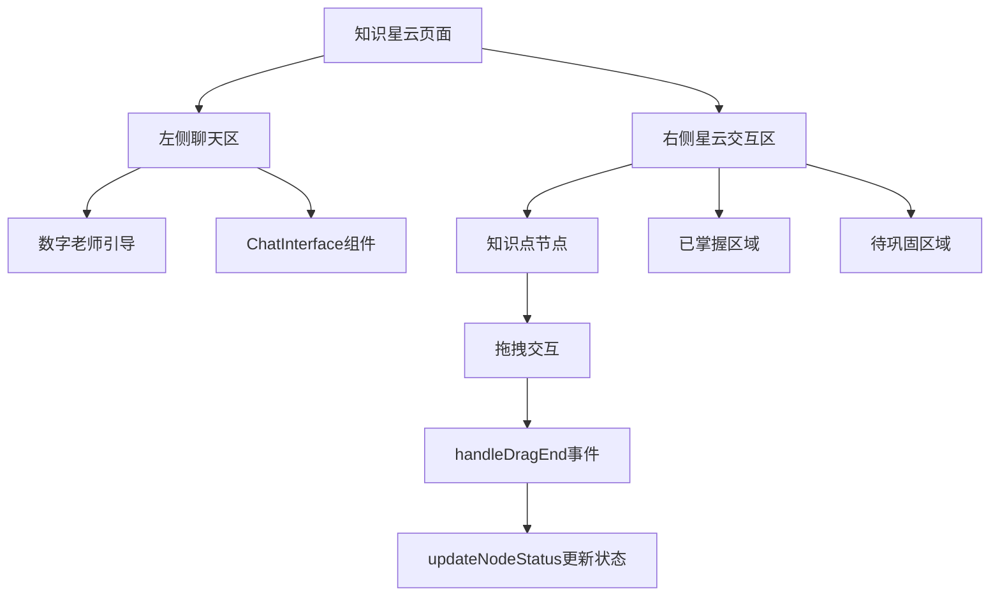
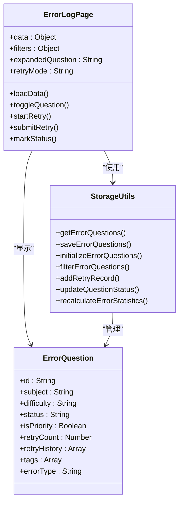
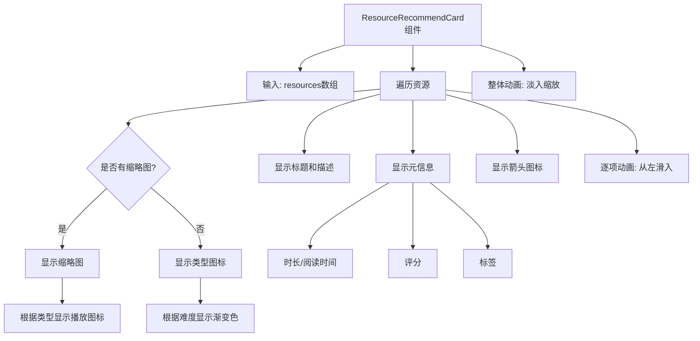

# 公共功能

<cite>
**本文档引用的文件**   
- [KnowledgeNebulaPage.jsx](file://src/pages/KnowledgeNebulaPage.jsx)
- [error_log_data.js](file://src/data/error_log_data.js)
- [error_questions_data.js](file://src/data/error_questions_data.js)
- [ErrorLogPage.jsx](file://src/pages/ErrorLogPage.jsx)
- [ResourceRecommendCard.jsx](file://src/components/chat-widgets/ResourceRecommendCard.jsx)
- [recommendations_data.js](file://src/data/recommendations_data.js)
- [storage_utils.js](file://src/utils/storage_utils.js)
- [knowledge_nebula_data.ts](file://src/data/knowledge_nebula_data.ts)
- [knowledge_list_data.ts](file://src/data/knowledge_list_data.ts)
- [resource_library.js](file://src/data/resource_library.js)
- [learning_dialogue_resources_data.js](file://src/data/learning_dialogue_resources_data.js)
</cite>

## 目录
1. [引言](#引言)
2. [知识星云可视化](#知识星云可视化)
3. [错题日志追踪与分析](#错题日志追踪与分析)
4. [资源推荐卡智能推送](#资源推荐卡智能推送)
5. [跨角色功能应用](#跨角色功能应用)
6. [学习体验提升](#学习体验提升)
7. [结论](#结论)

## 引言

本系统为学生和教师提供了一套完整的公共功能模块，旨在通过数据驱动的方式提升学习效率和教学效果。核心功能包括知识星云（Knowledge Nebula）的可视化展示、错题日志（Error Log）的追踪与分析，以及资源推荐卡（ResourceRecommendCard）的智能推送机制。这些功能共同构建了一个闭环的学习反馈系统，帮助学生精准定位知识薄弱点，制定个性化学习路径，并通过智能推荐获取最匹配的学习资源。

**Section sources**
- [KnowledgeNebulaPage.jsx](file://src/pages/KnowledgeNebulaPage.jsx#L1-L166)
- [ErrorLogPage.jsx](file://src/pages/ErrorLogPage.jsx#L1-L699)
- [ResourceRecommendCard.jsx](file://src/components/chat-widgets/ResourceRecommendCard.jsx#L1-L169)

## 知识星云可视化

知识星云功能通过一个交互式的可视化界面，帮助学生直观地评估和管理自己对各个知识点的掌握情况。该功能的核心实现位于 `KnowledgeNebulaPage.jsx` 组件中。

### 实现机制

知识星云页面采用了一种创新的拖拽交互模式。页面被分为左右两个区域：左侧是聊天区，由 `ChatInterface` 组件构成，数字老师会通过对话引导学生；右侧是星云交互区，展示了代表不同知识点的可拖拽节点。

这些节点的数据来源于 `knowledge_nebula_data.ts` 文件中的 `KNOWLEDGE_NODES` 数组，每个节点包含ID、标签、状态、大小和位置坐标。节点的状态（如“已掌握”、“待巩固”）决定了其颜色，通过 `getColor` 函数映射为不同的背景色。

**Diagram sources**
- [KnowledgeNebulaPage.jsx](file://src/pages/KnowledgeNebulaPage.jsx#L1-L166)
- [knowledge_nebula_data.ts](file://src/data/knowledge_nebula_data.ts#L1-L23)

### 交互流程

当学生将一个知识点节点拖拽到右侧的“已掌握区域”或“待巩固区域”时，`handleDragEnd` 事件处理器会被触发。该函数通过比较节点中心点与目标区域的边界坐标来判断是否发生碰撞，如果碰撞成功，则调用 `updateNodeStatus` 函数来更新该节点的状态。

状态更新后，会触发React的重新渲染，节点的颜色随之改变，从而在视觉上反馈学生的操作。最终，学生可以点击“下一步”按钮，导航到知识掌握清单页面，查看其最新的知识画像。

**Section sources**
- [KnowledgeNebulaPage.jsx](file://src/pages/KnowledgeNebulaPage.jsx#L30-L58)
- [knowledge_nebula_data.ts](file://src/data/knowledge_nebula_data.ts#L14-L22)

## 错题日志追踪与分析

错题日志功能为学生提供了一个强大的复盘工具，帮助他们系统性地分析错误、追踪复习进度并进行针对性练习。该功能由 `ErrorLogPage.jsx` 组件驱动，结合 `storage_utils.js` 中的工具类和 `error_questions_data.js` 中的初始数据。

### 数据结构与管理

错题数据的核心是一个包含错题列表、诊断分析和个性化推荐的对象。每道错题都包含丰富的元数据，如科目、难度、错误类型、AI解析、标签、重做历史和优先级标记。这些数据被存储在浏览器的 `localStorage` 中，由 `StorageUtils` 类进行管理。

`StorageUtils` 提供了 `initializeErrorQuestions`、`getErrorQuestions`、`saveErrorQuestions` 和 `filterErrorQuestions` 等方法，实现了错题数据的持久化、初始化、读取和筛选。当学生进行重做或标记状态时，`addRetryRecord` 和 `updateQuestionStatus` 方法会更新数据，并通过 `recalculateErrorStatistics` 重新计算统计信息。

**Diagram sources**
- [ErrorLogPage.jsx](file://src/pages/ErrorLogPage.jsx#L38-L699)
- [storage_utils.js](file://src/utils/storage_utils.js#L1-L438)
- [error_questions_data.js](file://src/data/error_questions_data.js#L1-L173)

### 功能特性

错题日志页面提供了多维度的分析和操作：
- **智能诊断**：通过饼图展示错因分析（如概念不清、计算错误），通过柱状图展示薄弱知识点，并通过折线图呈现错误率趋势。
- **筛选与过滤**：学生可以根据科目、难度、状态和知识点进行筛选，快速定位特定类型的错题。
- **重做与复盘**：学生可以点击题目展开详情，查看题目内容、自己的答案、正确答案和AI解析。通过“重做此题”按钮，可以输入新答案并即时获得反馈。
- **状态管理**：学生可以将题目标记为“未复习”、“复习中”或“已掌握”，系统会根据重做历史自动更新状态。
- **优先级标记**：通过星标功能，学生可以将重要错题设为优先，便于集中攻克。

**Section sources**
- [ErrorLogPage.jsx](file://src/pages/ErrorLogPage.jsx#L130-L699)
- [error_log_data.js](file://src/data/error_log_data.js#L1-L125)

## 资源推荐卡智能推送

资源推荐卡组件（`ResourceRecommendCard`）是系统智能推送机制的核心，它能够根据学生的学习上下文，动态生成并展示个性化的学习资源。

### 组件设计与交互

该组件接收一个 `resources` 数组作为输入，并为每个资源渲染一个卡片。卡片采用 `framer-motion` 实现了流畅的动画效果，包括整体的淡入缩放和每个资源项的逐个滑入。

每个资源卡片包含缩略图（或根据难度生成的渐变色背景）、资源标题、描述和元信息（如时长、阅读时间、评分、标签）。资源的类型（视频、文章、图表）决定了其显示的图标。卡片设计为可点击，通过 `onSelectResource` 回调通知父组件用户的选择。

**Diagram sources**
- [ResourceRecommendCard.jsx](file://src/components/chat-widgets/ResourceRecommendCard.jsx#L1-L169)

### 推荐逻辑

虽然 `ResourceRecommendCard` 本身是展示层组件，但其背后的推荐逻辑贯穿于整个系统。例如，在 `recommendations_data.js` 中定义了基于学生能力的推荐策略，包括“重点突破”、“提升技能”、“巩固知识”等。在 `ErrorLogPage` 中，AI会根据错因分析和薄弱知识点，推荐“补救内容”、“专项训练”和“补学路径”。

此外，`learning_dialogue_resources_data.js` 和 `dialogueUtils.js` 中的 `recommendNextStep` 函数实现了基于掌握程度的动态推荐，能够根据学生对当前知识点的掌握水平（从“完全不会”到“完全掌握”），推荐返回基础、加强学习、维持难度、突破进阶或进入下一知识点。

**Section sources**
- [ResourceRecommendCard.jsx](file://src/components/chat-widgets/ResourceRecommendCard.jsx#L1-L169)
- [recommendations_data.js](file://src/data/recommendations_data.js#L1-L164)
- [learning_dialogue_resources_data.js](file://src/data/learning_dialogue_resources_data.js#L144-L160)
- [dialogueUtils.js](file://src/utils/dialogueUtils.js#L183-L213)

## 跨角色功能应用

本系统的公共功能不仅服务于学生，也为教师提供了强大的教学支持工具。

### 学生视角

对于学生而言，这些功能构成了一个完整的自主学习闭环：
1.  **评估**：通过知识星云页面，学生可以快速评估自己的知识掌握状态。
2.  **复盘**：通过错题日志页面，学生可以深入分析错误原因，进行针对性练习。
3.  **学习**：通过资源推荐卡，学生可以获取最适合当前学习需求的优质资源，进行高效学习。
4.  **提升**：整个过程形成一个正向循环，持续提升学习效果。

### 教师视角

对于教师而言，这些功能提供了宝贵的学情洞察：
- **错题日志**：教师可以查看班级的整体错题数据，了解学生的普遍薄弱点和常见错误类型，从而调整教学重点。
- **知识星云**：教师可以观察学生群体的知识掌握分布，识别需要集体辅导的知识点。
- **资源推荐**：教师可以利用系统推荐的资源库，快速为学生准备补充材料，或根据AI建议优化教学路径。

**Section sources**
- [ErrorLogPage.jsx](file://src/pages/ErrorLogPage.jsx#L130-L699)
- [KnowledgeNebulaPage.jsx](file://src/pages/KnowledgeNebulaPage.jsx#L1-L166)
- [ResourceRecommendCard.jsx](file://src/components/chat-widgets/ResourceRecommendCard.jsx#L1-L169)

## 学习体验提升

这些公共功能的整合极大地提升了整体学习体验：

- **直观性**：知识星云的可视化设计将抽象的知识结构具象化，使学习状态一目了然。
- **互动性**：拖拽、重做、标记等交互操作增强了学生的参与感和主动性。
- **个性化**：基于数据分析的智能推荐确保了学习资源与学生需求的高度匹配，避免了“一刀切”的教学模式。
- **闭环性**：从评估到复盘再到学习，形成了一个完整的反馈和改进循环，帮助学生持续进步。

## 结论

知识星云、错题日志和资源推荐卡三大公共功能，共同构建了一个智能化、个性化的学习支持系统。它们不仅为学生提供了强大的自我管理工具，也为教师提供了精准的教学决策依据。通过将数据可视化、错误分析和智能推荐有机结合，系统有效提升了学习的效率和质量，为实现因材施教的教育理念提供了坚实的技术支撑。