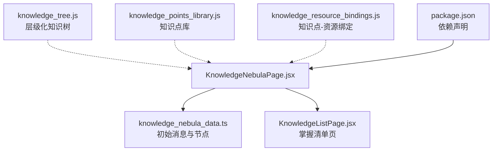
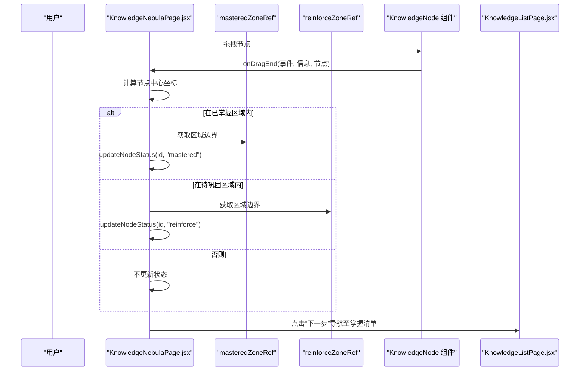
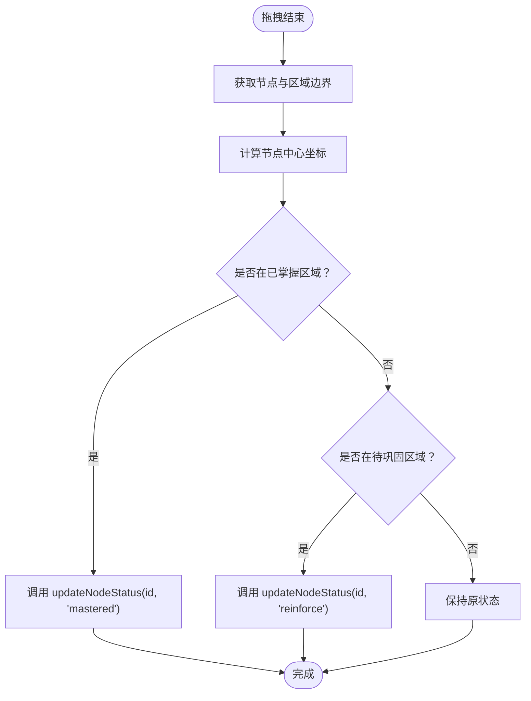
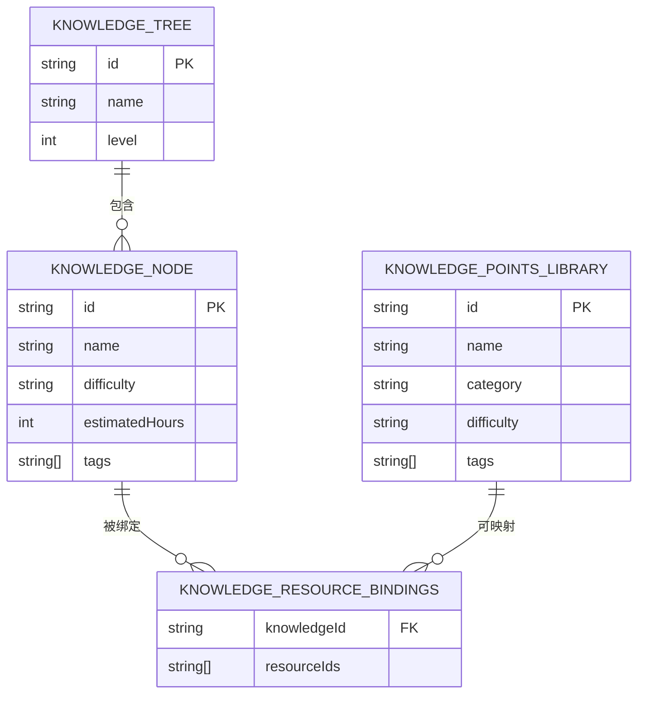
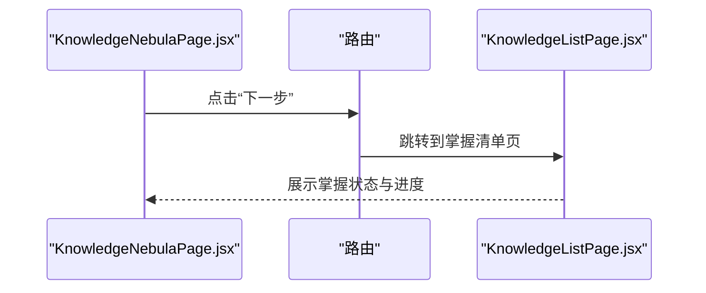
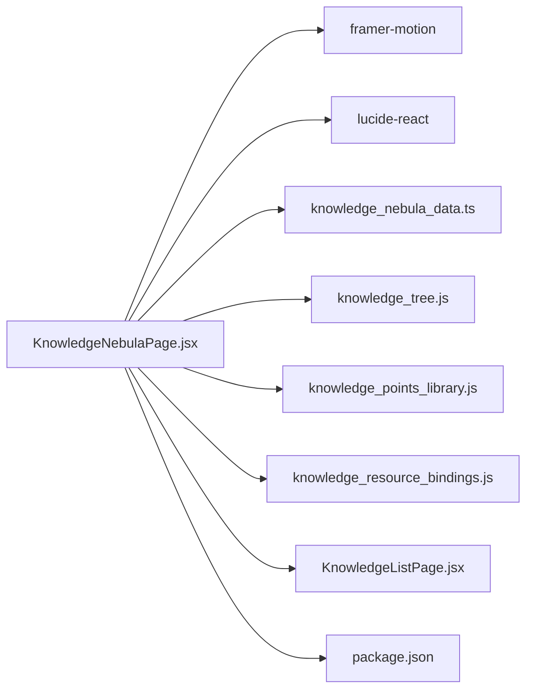

# 知识图谱

<cite>
**本文引用的文件列表**
- [KnowledgeNebulaPage.jsx](file://src/pages/KnowledgeNebulaPage.jsx)
- [knowledge_nebula_data.ts](file://src/data/knowledge_nebula_data.ts)
- [knowledge_tree.js](file://src/data/knowledge_tree.js)
- [knowledge_points_library.js](file://src/data/knowledge_points_library.js)
- [knowledge_resource_bindings.js](file://src/data/knowledge_resource_bindings.js)
- [KnowledgeListPage.jsx](file://src/pages/KnowledgeListPage.jsx)
- [package.json](file://package.json)
</cite>

## 目录
1. [引言](#引言)
2. [项目结构](#项目结构)
3. [核心组件](#核心组件)
4. [架构总览](#架构总览)
5. [详细组件分析](#详细组件分析)
6. [依赖关系分析](#依赖关系分析)
7. [性能考量](#性能考量)
8. [故障排查指南](#故障排查指南)
9. [结论](#结论)
10. [附录](#附录)

## 引言
本文件系统化梳理“知识图谱”功能的实现，重点围绕 KnowledgeNebulaPage.jsx 如何通过 Framer Motion 实现知识节点的二维拖拽交互与状态更新，并解释其与知识树（knowledge_tree.js）、知识点库（knowledge_points_library.js）、以及知识资源绑定（knowledge_resource_bindings.js）之间的数据关联。文档还提供可视化流程图与序列图，帮助学生直观理解知识结构并主动管理学习进度；同时说明教师如何利用该视图进行教学设计与资源匹配。

## 项目结构
本功能涉及页面、数据与导航的协同：
- 页面层：KnowledgeNebulaPage.jsx 提供交互式知识星云视图，包含聊天区与拖拽节点区域。
- 数据层：knowledge_nebula_data.ts 提供初始消息与节点数据；knowledge_tree.js 定义层级化知识树；knowledge_points_library.js 提供知识点库；knowledge_resource_bindings.js 提供知识点与资源的映射。
- 导航层：KnowledgeListPage.jsx 展示掌握清单，作为从星云视图到后续评估的跳转目标。

图表来源
- [KnowledgeNebulaPage.jsx](file://src/pages/KnowledgeNebulaPage.jsx#L1-L166)
- [knowledge_nebula_data.ts](file://src/data/knowledge_nebula_data.ts#L1-L23)
- [knowledge_tree.js](file://src/data/knowledge_tree.js#L1-L378)
- [knowledge_points_library.js](file://src/data/knowledge_points_library.js#L1-L214)
- [knowledge_resource_bindings.js](file://src/data/knowledge_resource_bindings.js#L1-L61)
- [KnowledgeListPage.jsx](file://src/pages/KnowledgeListPage.jsx#L1-L111)
- [package.json](file://package.json#L1-L42)

章节来源
- [KnowledgeNebulaPage.jsx](file://src/pages/KnowledgeNebulaPage.jsx#L1-L166)
- [knowledge_nebula_data.ts](file://src/data/knowledge_nebula_data.ts#L1-L23)
- [knowledge_tree.js](file://src/data/knowledge_tree.js#L1-L378)
- [knowledge_points_library.js](file://src/data/knowledge_points_library.js#L1-L214)
- [knowledge_resource_bindings.js](file://src/data/knowledge_resource_bindings.js#L1-L61)
- [KnowledgeListPage.jsx](file://src/pages/KnowledgeListPage.jsx#L1-L111)
- [package.json](file://package.json#L1-L42)

## 核心组件
- KnowledgeNebulaPage.jsx
  - 负责渲染聊天区与知识星云交互区，包含两个拖拽目标区域（已掌握、待巩固），以及可拖拽的知识节点。
  - 使用 Framer Motion 的 drag 控制实现节点拖拽，使用 useRef 引用两个目标区域进行碰撞检测。
  - 通过 updateNodeStatus 更新节点状态，支持 mastered 与 reinforce 两类状态切换。
- knowledge_nebula_data.ts
  - 提供初始对话消息与节点集合，节点包含 id、label、status、size、x、y 等字段。
- knowledge_tree.js
  - 提供层级化的知识树结构，包含章节、单元、知识点三级节点，以及辅助函数（扁平化、路径查询、按ID查找）。
- knowledge_points_library.js
  - 提供知识点库与难度分类信息，便于教师选择与构建学习路径。
- knowledge_resource_bindings.js
  - 提供知识点与资源的映射关系，支持查询、绑定、解绑与本地持久化。
- KnowledgeListPage.jsx
  - 展示掌握清单，作为从星云视图到下一步评估的导航入口。

章节来源
- [KnowledgeNebulaPage.jsx](file://src/pages/KnowledgeNebulaPage.jsx#L1-L166)
- [knowledge_nebula_data.ts](file://src/data/knowledge_nebula_data.ts#L1-L23)
- [knowledge_tree.js](file://src/data/knowledge_tree.js#L1-L378)
- [knowledge_points_library.js](file://src/data/knowledge_points_library.js#L1-L214)
- [knowledge_resource_bindings.js](file://src/data/knowledge_resource_bindings.js#L1-L61)
- [KnowledgeListPage.jsx](file://src/pages/KnowledgeListPage.jsx#L1-L111)

## 架构总览
下图展示了从用户拖拽到状态更新的端到端流程，以及与数据层的交互关系。

图表来源
- [KnowledgeNebulaPage.jsx](file://src/pages/KnowledgeNebulaPage.jsx#L1-L166)
- [KnowledgeListPage.jsx](file://src/pages/KnowledgeListPage.jsx#L1-L111)

## 详细组件分析

### KnowledgeNebulaPage.jsx：拖拽交互与状态更新
- 节点渲染
  - 使用 Framer Motion 的 drag 能力实现可拖拽圆形节点，节点尺寸与标签来自数据源。
  - 初始动画与悬停/拖拽态通过 motion 的生命周期属性控制，增强交互反馈。
- 拖拽目标区域
  - 通过 useRef 引用“已掌握区域”和“待巩固区域”，在拖拽结束时计算节点中心坐标与区域边界进行碰撞检测。
- 状态更新
  - updateNodeStatus 接收节点 id 与新状态，使用不可变更新方式替换对应节点的状态字段。
- 导航
  - 提供“下一步”按钮，导航至掌握清单页面。

图表来源
- [KnowledgeNebulaPage.jsx](file://src/pages/KnowledgeNebulaPage.jsx#L1-L166)

章节来源
- [KnowledgeNebulaPage.jsx](file://src/pages/KnowledgeNebulaPage.jsx#L1-L166)

### 数据层：知识树、知识点库与资源绑定
- 知识树（knowledge_tree.js）
  - 结构：顶层为学科，第二层为章节，第三层为具体知识点，包含估算学时、难度、标签等元数据。
  - 辅助函数：扁平化树生成叶子节点列表、根据ID获取路径、按ID查找节点。
- 知识点库（knowledge_points_library.js）
  - 提供知识点条目与难度分类，便于教师选择与路径构建。
- 知识资源绑定（knowledge_resource_bindings.js）
  - 以知识点ID为键，维护资源ID数组；提供查询、绑定、解绑与本地持久化方法。

图表来源
- [knowledge_tree.js](file://src/data/knowledge_tree.js#L1-L378)
- [knowledge_points_library.js](file://src/data/knowledge_points_library.js#L1-L214)
- [knowledge_resource_bindings.js](file://src/data/knowledge_resource_bindings.js#L1-L61)

章节来源
- [knowledge_tree.js](file://src/data/knowledge_tree.js#L1-L378)
- [knowledge_points_library.js](file://src/data/knowledge_points_library.js#L1-L214)
- [knowledge_resource_bindings.js](file://src/data/knowledge_resource_bindings.js#L1-L61)

### 与掌握清单页面的衔接
- KnowledgeNebulaPage.jsx 提供“下一步”按钮，导航至 KnowledgeListPage.jsx。
- KnowledgeListPage.jsx 展示各知识点的掌握状态与评分条，形成闭环反馈。

图表来源
- [KnowledgeNebulaPage.jsx](file://src/pages/KnowledgeNebulaPage.jsx#L1-L166)
- [KnowledgeListPage.jsx](file://src/pages/KnowledgeListPage.jsx#L1-L111)

章节来源
- [KnowledgeNebulaPage.jsx](file://src/pages/KnowledgeNebulaPage.jsx#L1-L166)
- [KnowledgeListPage.jsx](file://src/pages/KnowledgeListPage.jsx#L1-L111)

## 依赖关系分析
- 依赖声明
  - @react-three/fiber 与 @react-three/drei 用于 3D 渲染（本仓库未在 KnowledgeNebulaPage.jsx 中直接使用，但存在同名依赖声明）。
  - framer-motion 用于节点拖拽与动画。
  - lucide-react 用于图标。
- 与 Three.js/Drei 的关系
  - 当前 KnowledgeNebulaPage.jsx 使用的是二维拖拽与 Framer Motion 动画，未直接引入 Three.js 或 Drei。
  - 仓库中存在 MyLearningTrajectoryPage.jsx 使用了 Three.js 与 Drei，表明项目具备 3D 能力，但本功能未采用。

图表来源
- [KnowledgeNebulaPage.jsx](file://src/pages/KnowledgeNebulaPage.jsx#L1-L166)
- [knowledge_nebula_data.ts](file://src/data/knowledge_nebula_data.ts#L1-L23)
- [knowledge_tree.js](file://src/data/knowledge_tree.js#L1-L378)
- [knowledge_points_library.js](file://src/data/knowledge_points_library.js#L1-L214)
- [knowledge_resource_bindings.js](file://src/data/knowledge_resource_bindings.js#L1-L61)
- [KnowledgeListPage.jsx](file://src/pages/KnowledgeListPage.jsx#L1-L111)
- [package.json](file://package.json#L1-L42)

章节来源
- [package.json](file://package.json#L1-L42)
- [KnowledgeNebulaPage.jsx](file://src/pages/KnowledgeNebulaPage.jsx#L1-L166)

## 性能考量
- 节点拖拽
  - 使用 Framer Motion 的 drag 与 onDragEnd，避免复杂 3D 物理引擎带来的开销，保证交互流畅。
- 状态更新
  - updateNodeStatus 使用不可变更新（map 替换），避免不必要的重渲染，提升响应速度。
- 数据规模
  - 当前节点数量有限，若未来扩展至数百个节点，建议：
    - 将节点渲染拆分为虚拟滚动或分批渲染。
    - 对碰撞检测进行节流或使用更高效的包围盒算法。
    - 将状态持久化到本地存储，减少重复计算。

## 故障排查指南
- 拖拽无效
  - 检查节点是否正确传入 onDragEnd 回调，确认节点元素可见且未被遮挡。
- 碰撞检测不生效
  - 确认 masteredZoneRef 与 reinforceZoneRef 已正确挂载，且容器无绝对定位导致边界计算异常。
- 状态未更新
  - 确认 updateNodeStatus 的 id 匹配正确，且节点状态枚举值与 UI 显示一致。
- 导航失败
  - 检查路由配置与按钮点击事件绑定，确保路径正确。

章节来源
- [KnowledgeNebulaPage.jsx](file://src/pages/KnowledgeNebulaPage.jsx#L1-L166)

## 结论
本功能通过二维拖拽与状态更新，帮助学生直观识别知识掌握状况，并与掌握清单页面形成闭环反馈。数据层由知识树、知识点库与资源绑定共同支撑，既可用于学生自评，也可为教师的教学设计与资源匹配提供依据。当前实现基于 Framer Motion，简洁高效；未来如需引入 3D 视图，可在现有数据模型基础上扩展。

## 附录
- 术语说明
  - 知识树：按章节与知识点层级组织的知识结构。
  - 知识点库：可供教师选择的知识条目集合。
  - 资源绑定：知识点与学习资源的映射关系。
- 教师使用建议
  - 使用知识树与知识点库构建课程路径，结合资源绑定为每个知识点匹配合适的学习材料。
  - 在星云视图中观察学生对不同知识点的掌握分布，针对性调整教学策略。