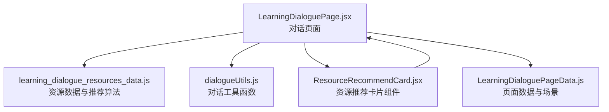
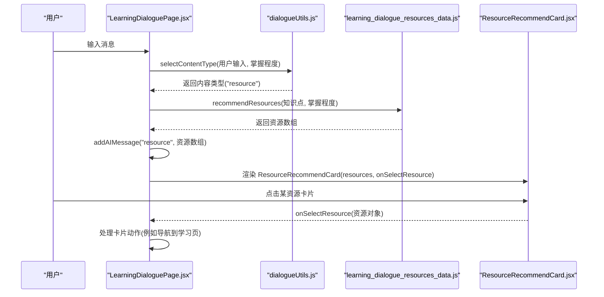
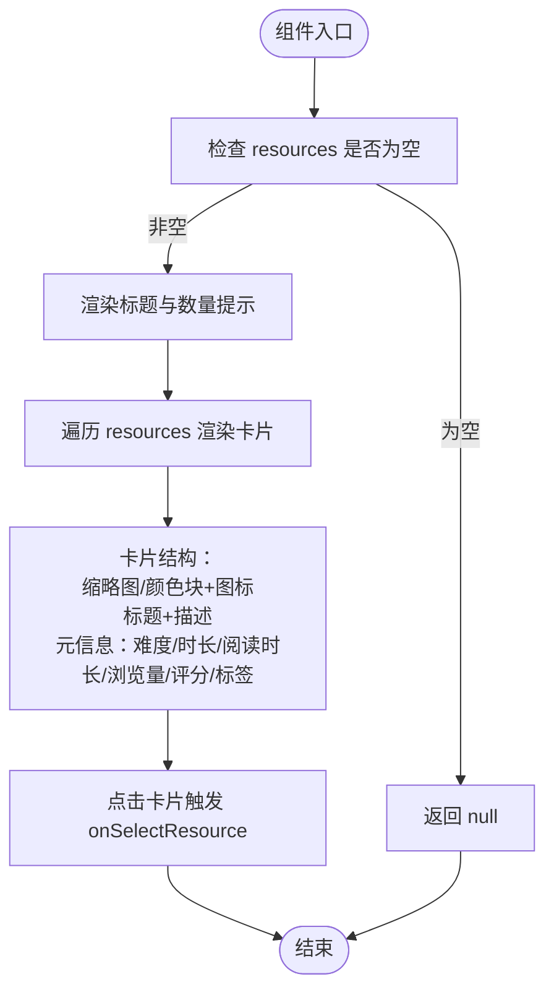
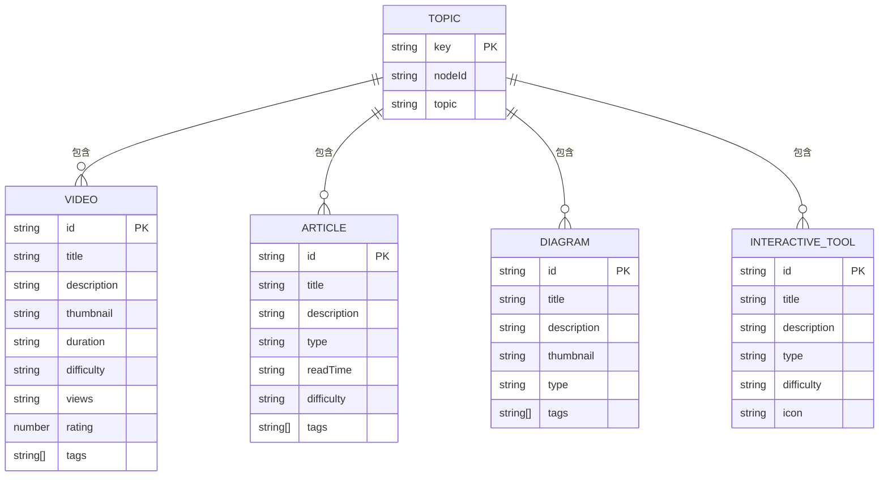
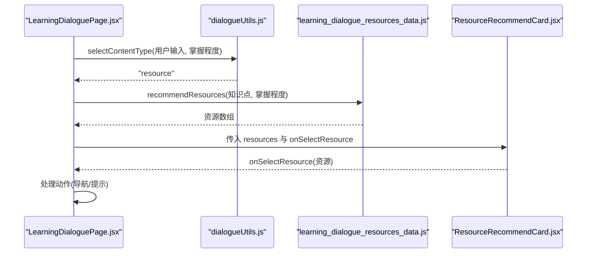
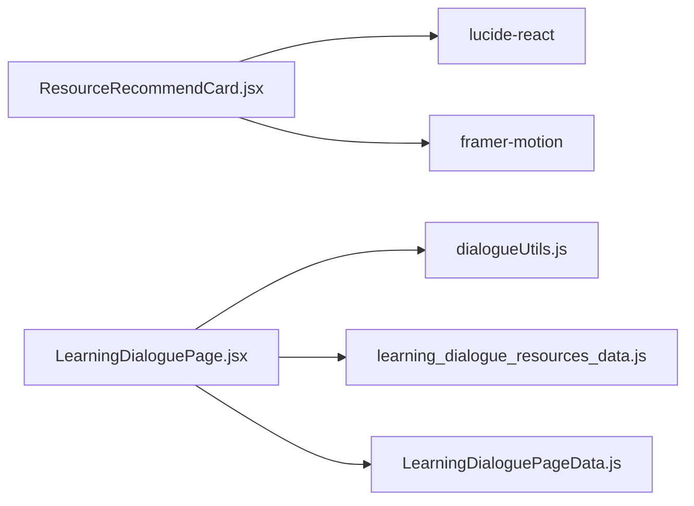

# 资源推荐

<cite>
**本文引用的文件**
- [ResourceRecommendCard.jsx](file://src/components/chat-widgets/ResourceRecommendCard.jsx)
- [LearningDialoguePage.jsx](file://src/pages/LearningDialoguePage.jsx)
- [dialogueUtils.js](file://src/utils/dialogueUtils.js)
- [learning_dialogue_resources_data.js](file://src/data/learning_dialogue_resources_data.js)
- [LearningDialoguePageData.js](file://src/data/LearningDialoguePageData.js)
</cite>

## 目录
1. [简介](#简介)
2. [项目结构](#项目结构)
3. [核心组件](#核心组件)
4. [架构总览](#架构总览)
5. [详细组件分析](#详细组件分析)
6. [依赖分析](#依赖分析)
7. [性能考虑](#性能考虑)
8. [故障排查指南](#故障排查指南)
9. [结论](#结论)
10. [附录](#附录)

## 简介
本文件聚焦于资源推荐功能的实现，重点解析 ResourceRecommendCard 组件如何根据传入的 resources 数组动态渲染推荐内容。文档将详细说明：
- 空值处理逻辑（!resources || resources.length === 0）与组件的短路返回机制
- 资源项的渲染结构：缩略图、类型图标（视频/讲义/图表）、标题与元信息展示
- recommendations_data.js 中的数据结构与推荐类型（视频、文章、图表等），以及属性如 title、thumbnail、duration、difficulty、rating、tags 等
- onSelectResource 回调函数的集成机制与交互流程
- 该组件在学习对话等上下文中的嵌入方式，以及如何实现个性化推送
- 通过代码片段路径展示资源列表的映射渲染与交互逻辑，说明该功能如何提升学习资源的精准度与学习效率

## 项目结构
资源推荐功能涉及多个层次：
- 页面层：LearningDialoguePage.jsx 负责对话与消息流管理，触发资源推荐并渲染 ResourceRecommendCard
- 工具层：dialogueUtils.js 提供掌握程度分析、内容类型选择、消息格式化等逻辑
- 数据层：learning_dialogue_resources_data.js 提供按知识点与掌握程度的资源推荐算法；LearningDialoguePageData.js 提供页面初始化消息与场景配置
- 组件层：ResourceRecommendCard.jsx 负责资源卡片的 UI 渲染与交互

**图表来源**
- [LearningDialoguePage.jsx](file://src/pages/LearningDialoguePage.jsx#L1-L536)
- [learning_dialogue_resources_data.js](file://src/data/learning_dialogue_resources_data.js#L1-L188)
- [dialogueUtils.js](file://src/utils/dialogueUtils.js#L1-L495)
- [ResourceRecommendCard.jsx](file://src/components/chat-widgets/ResourceRecommendCard.jsx#L1-L169)
- [LearningDialoguePageData.js](file://src/data/LearningDialoguePageData.js#L1-L159)

**章节来源**
- [LearningDialoguePage.jsx](file://src/pages/LearningDialoguePage.jsx#L1-L536)
- [learning_dialogue_resources_data.js](file://src/data/learning_dialogue_resources_data.js#L1-L188)
- [dialogueUtils.js](file://src/utils/dialogueUtils.js#L1-L495)
- [ResourceRecommendCard.jsx](file://src/components/chat-widgets/ResourceRecommendCard.jsx#L1-L169)
- [LearningDialoguePageData.js](file://src/data/LearningDialoguePageData.js#L1-L159)

## 核心组件
- ResourceRecommendCard：接收 resources 与 onSelectResource，负责渲染资源卡片列表，包含缩略图、类型图标、标题、描述、难度标签、时长/阅读时长、评分、浏览量、标签等元信息，并支持点击跳转学习
- LearningDialoguePage：在用户表达“资源/视频/文章/材料”等意图时，调用 recommendResources 获取推荐资源并以消息形式渲染 ResourceRecommendCard
- dialogueUtils：提供 analyzeMasteryLevel、selectContentType 等逻辑，辅助决定何时推送资源
- learning_dialogue_resources_data：提供按知识点与掌握程度的资源推荐算法，返回视频/文章/图表等资源集合

**章节来源**
- [ResourceRecommendCard.jsx](file://src/components/chat-widgets/ResourceRecommendCard.jsx#L1-L169)
- [LearningDialoguePage.jsx](file://src/pages/LearningDialoguePage.jsx#L230-L241)
- [dialogueUtils.js](file://src/utils/dialogueUtils.js#L117-L179)
- [learning_dialogue_resources_data.js](file://src/data/learning_dialogue_resources_data.js#L155-L185)

## 架构总览
资源推荐的端到端流程如下：
- 用户输入触发内容类型判断（selectContentType）
- 若判定为资源推荐，则根据掌握程度调用 recommendResources 获取资源集合
- LearningDialoguePage 将资源集合封装为消息类型 resource，并渲染 ResourceRecommendCard
- 用户点击卡片项触发 onSelectResource 回调，传递具体资源对象

**图表来源**
- [LearningDialoguePage.jsx](file://src/pages/LearningDialoguePage.jsx#L289-L358)
- [dialogueUtils.js](file://src/utils/dialogueUtils.js#L301-L344)
- [learning_dialogue_resources_data.js](file://src/data/learning_dialogue_resources_data.js#L155-L185)
- [ResourceRecommendCard.jsx](file://src/components/chat-widgets/ResourceRecommendCard.jsx#L1-L169)

## 详细组件分析

### ResourceRecommendCard 组件
- 空值处理：当 resources 不存在或长度为 0 时，组件直接返回空，避免无意义渲染
- 类型图标选择：根据资源的 type 或存在 duration/readTime/thumbnail 字段判断视频/文章/图表等类型，并选择相应图标
- 难度颜色：根据 difficulty 返回渐变色类名，用于装饰卡片
- 列表渲染：遍历 resources，为每个资源生成卡片，包含缩略图或基于难度的颜色块与图标、标题、描述、元信息（难度、时长/阅读时长、浏览量、评分、标签等）
- 交互：点击卡片触发 onSelectResource 回调，传递资源对象
- 动画：使用 Framer Motion 实现入场动画与悬停效果

**图表来源**
- [ResourceRecommendCard.jsx](file://src/components/chat-widgets/ResourceRecommendCard.jsx#L1-L169)

**章节来源**
- [ResourceRecommendCard.jsx](file://src/components/chat-widgets/ResourceRecommendCard.jsx#L1-L169)

### 数据结构与推荐类型
- learning_dialogue_resources_data.js 提供按知识点组织的资源数据，包含 videos、articles、diagrams、interactiveTools 等类别
- recommendResources 根据掌握程度返回对应难度的资源集合，最多返回 3 个
- ResourceRecommendCard 支持的资源类型与字段：
  - 视频：duration、views、rating、difficulty、tags、thumbnail
  - 文章：readTime、difficulty、tags
  - 图表：thumbnail、tags
  - 通用：title、description、difficulty、rating、tags 等

**图表来源**
- [learning_dialogue_resources_data.js](file://src/data/learning_dialogue_resources_data.js#L1-L188)

**章节来源**
- [learning_dialogue_resources_data.js](file://src/data/learning_dialogue_resources_data.js#L1-L188)

### 在学习对话中的集成与个性化推送
- LearningDialoguePage 在用户输入后，通过 dialogueUtils 的 selectContentType 判断是否需要资源推荐
- 若为资源推荐，调用 recommendResources 获取资源集合，并以消息类型 resource 渲染 ResourceRecommendCard
- 用户点击卡片后，onSelectResource 回调由父组件处理，实现后续学习引导（如跳转到学习页）

**图表来源**
- [LearningDialoguePage.jsx](file://src/pages/LearningDialoguePage.jsx#L289-L358)
- [dialogueUtils.js](file://src/utils/dialogueUtils.js#L301-L344)
- [learning_dialogue_resources_data.js](file://src/data/learning_dialogue_resources_data.js#L155-L185)
- [ResourceRecommendCard.jsx](file://src/components/chat-widgets/ResourceRecommendCard.jsx#L1-L169)

**章节来源**
- [LearningDialoguePage.jsx](file://src/pages/LearningDialoguePage.jsx#L289-L358)
- [dialogueUtils.js](file://src/utils/dialogueUtils.js#L301-L344)
- [learning_dialogue_resources_data.js](file://src/data/learning_dialogue_resources_data.js#L155-L185)
- [ResourceRecommendCard.jsx](file://src/components/chat-widgets/ResourceRecommendCard.jsx#L1-L169)

## 依赖分析
- ResourceRecommendCard 依赖：
  - 图标库：lucide-react（Play、FileText、Image、Star、Clock、Eye、ChevronRight）
  - 动画库：framer-motion（motion、AnimatePresence）
- LearningDialoguePage 依赖：
  - recommendResources：来自 learning_dialogue_resources_data.js
  - dialogueUtils：analyzeMasteryLevel、selectContentType、formatUserMessage、formatAIMessage
  - 页面数据：LearningDialoguePageData.js
- 数据依赖：
  - learning_dialogue_resources_data.js：提供按知识点与掌握程度的资源推荐算法
  - LearningDialoguePageData.js：提供页面初始化消息与场景配置

**图表来源**
- [ResourceRecommendCard.jsx](file://src/components/chat-widgets/ResourceRecommendCard.jsx#L1-L169)
- [LearningDialoguePage.jsx](file://src/pages/LearningDialoguePage.jsx#L1-L536)
- [dialogueUtils.js](file://src/utils/dialogueUtils.js#L1-L495)
- [learning_dialogue_resources_data.js](file://src/data/learning_dialogue_resources_data.js#L1-L188)
- [LearningDialoguePageData.js](file://src/data/LearningDialoguePageData.js#L1-L159)

**章节来源**
- [ResourceRecommendCard.jsx](file://src/components/chat-widgets/ResourceRecommendCard.jsx#L1-L169)
- [LearningDialoguePage.jsx](file://src/pages/LearningDialoguePage.jsx#L1-L536)
- [dialogueUtils.js](file://src/utils/dialogueUtils.js#L1-L495)
- [learning_dialogue_resources_data.js](file://src/data/learning_dialogue_resources_data.js#L1-L188)
- [LearningDialoguePageData.js](file://src/data/LearningDialoguePageData.js#L1-L159)

## 性能考虑
- 列表渲染优化：使用 key 为 resource.id 或索引，减少不必要的重排
- 条件渲染：空值时直接返回 null，避免渲染空列表
- 动画开销：入场动画与悬停效果使用轻量级过渡，避免过度动画导致卡顿
- 数据规模：recommendResources 默认最多返回 3 个资源，控制单次渲染负载

[本节为一般性指导，不直接分析具体文件]

## 故障排查指南
- 资源列表为空
  - 现象：组件不渲染任何内容
  - 排查：确认传入的 resources 是否存在且长度大于 0；检查 recommendResources 的返回值
  - 参考路径：
    - [ResourceRecommendCard.jsx](file://src/components/chat-widgets/ResourceRecommendCard.jsx#L8-L10)
    - [learning_dialogue_resources_data.js](file://src/data/learning_dialogue_resources_data.js#L155-L185)
- 点击卡片无响应
  - 现象：点击卡片不触发 onSelectResource
  - 排查：确认父组件是否传入 onSelectResource；检查 onClick 事件绑定
  - 参考路径：
    - [ResourceRecommendCard.jsx](file://src/components/chat-widgets/ResourceRecommendCard.jsx#L60-L67)
    - [LearningDialoguePage.jsx](file://src/pages/LearningDialoguePage.jsx#L83-L90)
- 资源类型图标不正确
  - 现象：视频/文章/图表图标显示异常
  - 排查：确认资源对象是否包含 duration、readTime、thumbnail 等字段；检查 getResourceIcon 的判断逻辑
  - 参考路径：
    - [ResourceRecommendCard.jsx](file://src/components/chat-widgets/ResourceRecommendCard.jsx#L12-L17)
- 元信息缺失
  - 现象：难度、时长、阅读时长、评分、浏览量、标签未显示
  - 排查：确认资源对象是否包含对应字段；检查条件渲染分支
  - 参考路径：
    - [ResourceRecommendCard.jsx](file://src/components/chat-widgets/ResourceRecommendCard.jsx#L104-L145)
    - [learning_dialogue_resources_data.js](file://src/data/learning_dialogue_resources_data.js#L1-L188)

**章节来源**
- [ResourceRecommendCard.jsx](file://src/components/chat-widgets/ResourceRecommendCard.jsx#L8-L17)
- [LearningDialoguePage.jsx](file://src/pages/LearningDialoguePage.jsx#L83-L90)
- [learning_dialogue_resources_data.js](file://src/data/learning_dialogue_resources_data.js#L1-L188)

## 结论
ResourceRecommendCard 通过简洁的空值处理与灵活的资源渲染结构，实现了对视频、文章、图表等多种资源类型的统一展示。配合 LearningDialoguePage 的上下文感知与 dialogueUtils 的掌握程度分析，能够根据用户当前学习状态与意图，精准推送个性化资源，从而提升学习资源的命中率与学习效率。组件的交互设计与动画体验进一步增强了用户的学习参与感与流畅度。

[本节为总结性内容，不直接分析具体文件]

## 附录
- 代码片段路径示例（不展示具体代码内容）：
  - 资源推荐卡片渲染与交互：[ResourceRecommendCard.jsx](file://src/components/chat-widgets/ResourceRecommendCard.jsx#L53-L156)
  - 学习对话中触发资源推荐：[LearningDialoguePage.jsx](file://src/pages/LearningDialoguePage.jsx#L289-L358)
  - 掌握程度分析与内容类型选择：[dialogueUtils.js](file://src/utils/dialogueUtils.js#L117-L179)
  - 按掌握程度推荐资源：[learning_dialogue_resources_data.js](file://src/data/learning_dialogue_resources_data.js#L155-L185)
  - 页面初始化与场景配置：[LearningDialoguePageData.js](file://src/data/LearningDialoguePageData.js#L1-L159)