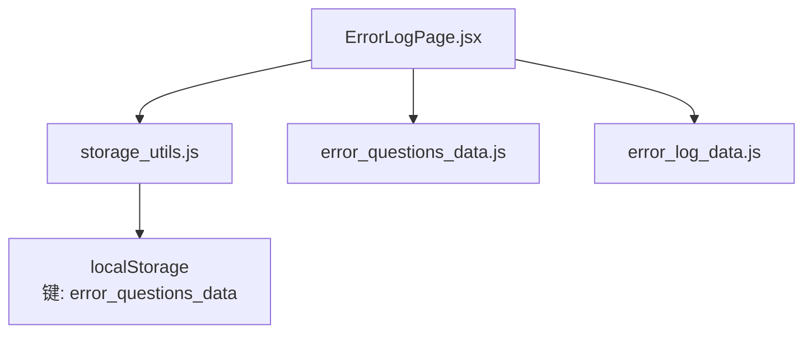
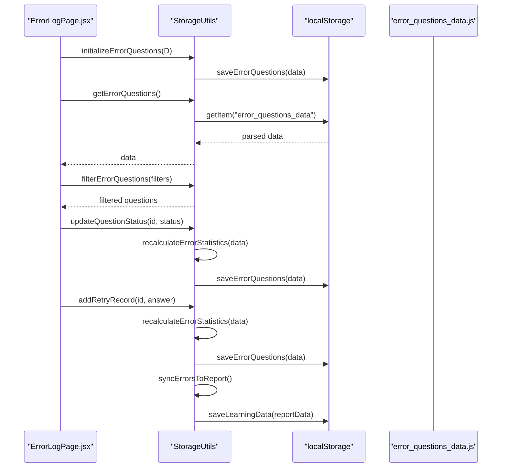
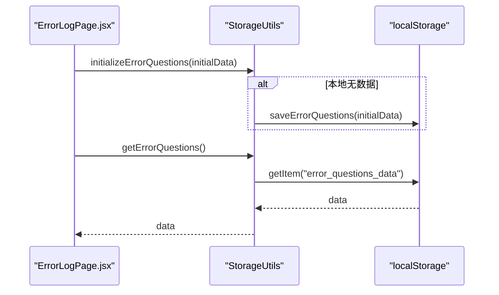
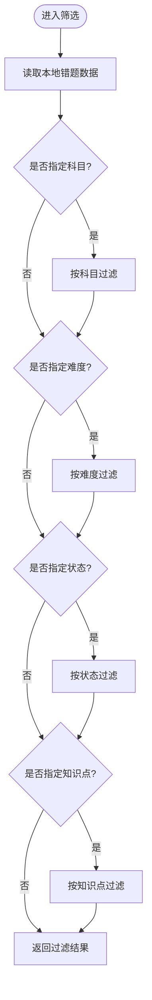
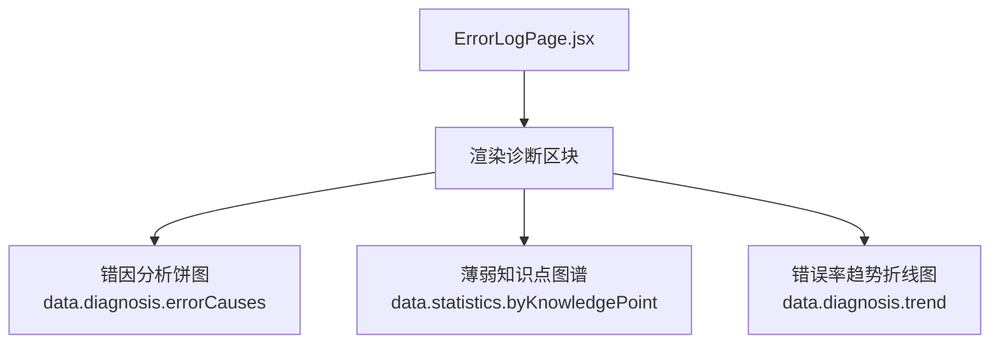
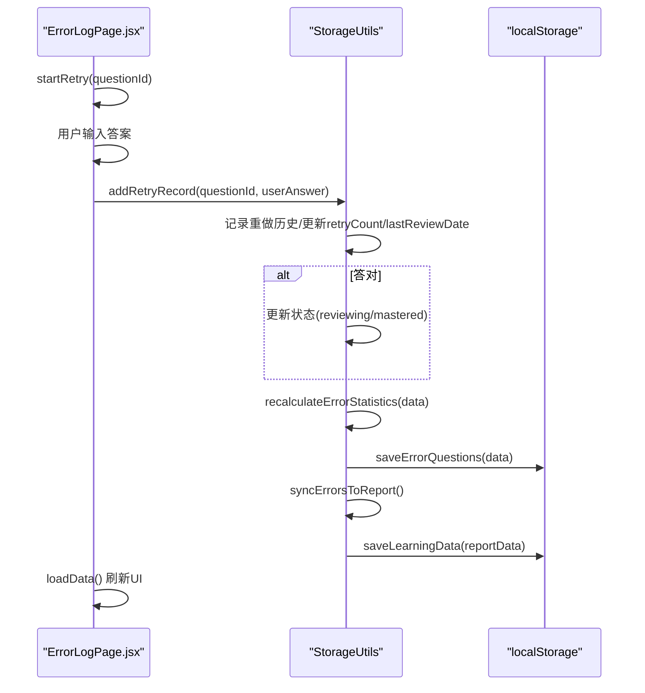
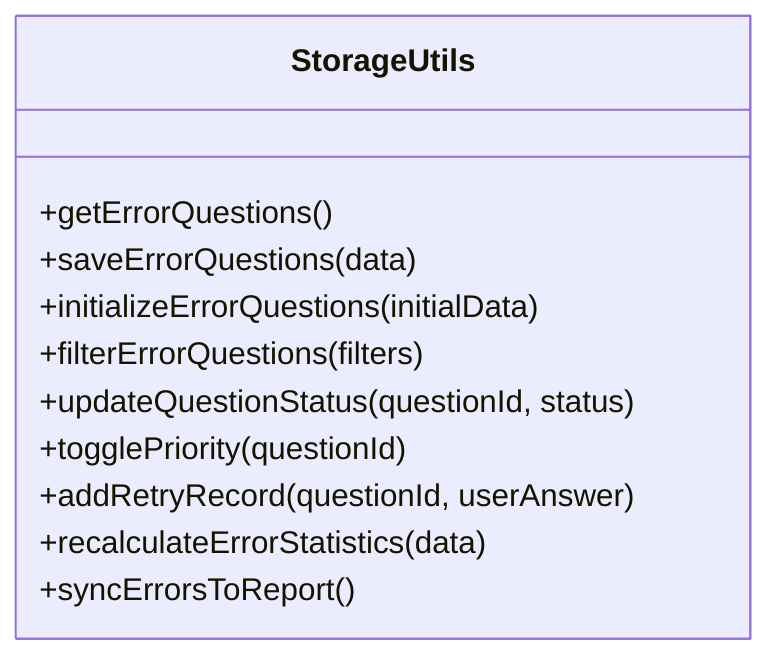
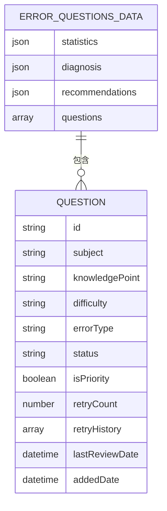
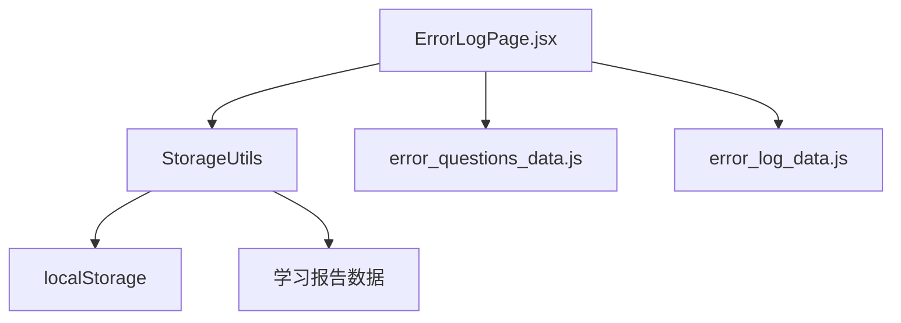

# 错题管理

<cite>
**本文引用的文件**
- [ErrorLogPage.jsx](file://src/pages/ErrorLogPage.jsx)
- [storage_utils.js](file://src/utils/storage_utils.js)
- [error_questions_data.js](file://src/data/error_questions_data.js)
- [error_log_data.js](file://src/data/error_log_data.js)
</cite>

## 目录
1. [引言](#引言)
2. [项目结构](#项目结构)
3. [核心组件](#核心组件)
4. [架构总览](#架构总览)
5. [详细组件分析](#详细组件分析)
6. [依赖关系分析](#依赖关系分析)
7. [性能考量](#性能考量)
8. [故障排查指南](#故障排查指南)
9. [结论](#结论)
10. [附录](#附录)

## 引言
本文件系统性梳理错题管理系统的实现机制，围绕 ErrorLogPage.jsx 的核心功能展开，重点覆盖：
- 错题数据的初始化加载（useEffect + StorageUtils.initializeErrorQuestions）
- 多维度筛选系统（科目、难度、状态、知识点）
- 错题诊断分析模块（错因分析饼图、薄弱知识点图谱、错误率趋势折线图）
- 错题重做流程（startRetry、submitRetry）
- StorageUtils 工具在错题数据持久化、状态更新（updateQuestionStatus）、优先级切换（togglePriority）和重做记录添加中的关键作用
- error_log_data.js 和 error_questions_data.js 中的数据结构与统计、过滤逻辑（filterErrorQuestions）和诊断数据组织方式
- 数据流与状态管理的实际代码片段路径
- 如何帮助学生进行学习复盘与教师进行学情分析

## 项目结构
错题管理系统由页面组件、数据源与本地存储工具三部分组成：
- 页面组件：ErrorLogPage.jsx 负责渲染界面、处理用户交互、调用存储工具并驱动 UI 更新
- 数据源：error_questions_data.js 提供初始错题数据；error_log_data.js 提供诊断与推荐模板数据
- 存储工具：storage_utils.js 封装 localStorage 的读写、初始化、筛选、统计与同步逻辑

**图表来源**
- [ErrorLogPage.jsx](file://src/pages/ErrorLogPage.jsx#L35-L69)
- [storage_utils.js](file://src/utils/storage_utils.js#L182-L219)
- [error_questions_data.js](file://src/data/error_questions_data.js#L1-L173)
- [error_log_data.js](file://src/data/error_log_data.js#L1-L125)

**章节来源**
- [ErrorLogPage.jsx](file://src/pages/ErrorLogPage.jsx#L35-L69)
- [storage_utils.js](file://src/utils/storage_utils.js#L182-L219)
- [error_questions_data.js](file://src/data/error_questions_data.js#L1-L173)
- [error_log_data.js](file://src/data/error_log_data.js#L1-L125)

## 核心组件
- 错题页面组件 ErrorLogPage.jsx
  - 负责初始化、筛选、展开详情、重做、标记状态、切换优先级、渲染诊断与推荐、复盘入口
  - 使用 useState/ useEffect 管理本地状态与副作用
- 存储工具 StorageUtils
  - 提供 getErrorQuestions/saveErrorQuestions/initializeErrorQuestions
  - 提供 filterErrorQuestions/updateQuestionStatus/togglePriority/addRetryRecord
  - 提供 recalculateErrorStatistics/syncErrorsToReport 等统计与同步方法
- 数据源
  - error_questions_data.js：包含 questions 列表与初始 statistics、diagnosis、recommendations
  - error_log_data.js：提供诊断与推荐模板数据（用于展示）

**章节来源**
- [ErrorLogPage.jsx](file://src/pages/ErrorLogPage.jsx#L35-L120)
- [storage_utils.js](file://src/utils/storage_utils.js#L182-L435)
- [error_questions_data.js](file://src/data/error_questions_data.js#L1-L173)
- [error_log_data.js](file://src/data/error_log_data.js#L1-L125)

## 架构总览
下图展示了从页面到存储工具再到本地持久化的整体流程：

**图表来源**
- [ErrorLogPage.jsx](file://src/pages/ErrorLogPage.jsx#L53-L105)
- [storage_utils.js](file://src/utils/storage_utils.js#L182-L326)
- [error_questions_data.js](file://src/data/error_questions_data.js#L1-L173)

## 详细组件分析

### 错题数据初始化与加载
- 初始化：页面挂载时调用 StorageUtils.initializeErrorQuestions，若本地无错题数据则写入初始数据
- 加载：loadData 通过 StorageUtils.getErrorQuestions 从 localStorage 读取并设置到组件状态
- 筛选变更：filters 改变后触发重新加载，保证 UI 与筛选结果一致

**图表来源**
- [ErrorLogPage.jsx](file://src/pages/ErrorLogPage.jsx#L53-L69)
- [storage_utils.js](file://src/utils/storage_utils.js#L182-L219)

**章节来源**
- [ErrorLogPage.jsx](file://src/pages/ErrorLogPage.jsx#L53-L69)
- [storage_utils.js](file://src/utils/storage_utils.js#L182-L219)

### 多维度筛选系统
- 筛选项：科目、难度、状态、知识点
- 实现：StorageUtils.filterErrorQuestions 根据 filters.subject/filters.difficulty/filters.status/filters.knowledgePoint 逐项过滤
- UI：页面通过 select 控件与按钮切换 filters，随后触发重新加载

**图表来源**
- [storage_utils.js](file://src/utils/storage_utils.js#L222-L248)
- [ErrorLogPage.jsx](file://src/pages/ErrorLogPage.jsx#L205-L263)

**章节来源**
- [storage_utils.js](file://src/utils/storage_utils.js#L222-L248)
- [ErrorLogPage.jsx](file://src/pages/ErrorLogPage.jsx#L205-L263)

### 错题诊断分析模块
- 错因分析饼图：使用 data.diagnosis.errorCauses 渲染
- 薄弱知识点图谱：基于 data.statistics.byKnowledgePoint 排序展示
- 错误率趋势折线图：使用 data.diagnosis.trend 渲染

**图表来源**
- [ErrorLogPage.jsx](file://src/pages/ErrorLogPage.jsx#L266-L364)
- [error_log_data.js](file://src/data/error_log_data.js#L1-L125)

**章节来源**
- [ErrorLogPage.jsx](file://src/pages/ErrorLogPage.jsx#L266-L364)
- [error_log_data.js](file://src/data/error_log_data.js#L1-L125)

### 错题重做流程
- startRetry：进入重做模式，清空用户答案与结果提示
- submitRetry：调用 StorageUtils.addRetryRecord，根据是否正确显示结果，短暂延迟后刷新数据
- StorageUtils.addRetryRecord：
  - 记录重做历史（answer、isCorrect、date）
  - 更新 retryCount、lastReviewDate
  - 若答对，依据重做次数自动更新状态（reviewing/mastered）
  - 重新计算统计并保存，同步到学习报告

**图表来源**
- [ErrorLogPage.jsx](file://src/pages/ErrorLogPage.jsx#L81-L105)
- [storage_utils.js](file://src/utils/storage_utils.js#L273-L310)
- [storage_utils.js](file://src/utils/storage_utils.js#L328-L382)
- [storage_utils.js](file://src/utils/storage_utils.js#L384-L427)

**章节来源**
- [ErrorLogPage.jsx](file://src/pages/ErrorLogPage.jsx#L81-L105)
- [storage_utils.js](file://src/utils/storage_utils.js#L273-L310)
- [storage_utils.js](file://src/utils/storage_utils.js#L328-L382)
- [storage_utils.js](file://src/utils/storage_utils.js#L384-L427)

### StorageUtils 工具的关键作用
- 数据持久化
  - getErrorQuestions/saveErrorQuestions：读写键为 "error_questions_data" 的 localStorage
  - initializeErrorQuestions：首次使用时写入初始数据
- 状态更新
  - updateQuestionStatus：更新单题状态、最后复习时间，并重新计算统计与学习报告同步
- 优先级切换
  - togglePriority：切换 isPriority 并保存
- 重做记录添加
  - addRetryRecord：记录重做历史、更新 retryCount、根据正确率自动更新状态、重新计算统计并同步学习报告
- 统计与同步
  - recalculateErrorStatistics：按状态/科目/难度/知识点统计，计算正确率与掌握度
  - syncErrorsToReport：将薄弱知识点与能力分数同步到学习报告

**图表来源**
- [storage_utils.js](file://src/utils/storage_utils.js#L182-L435)

**章节来源**
- [storage_utils.js](file://src/utils/storage_utils.js#L182-L435)

### 数据结构与统计、过滤逻辑
- 错题数据结构（来自 error_questions_data.js）
  - questions：每道题包含 subject、knowledgePoint、difficulty、errorType、status、isPriority、retryCount、retryHistory、lastReviewDate、addedDate 等字段
  - statistics：初始统计（由工具实时计算）
  - diagnosis/recommendations：诊断与推荐模板
- 统计计算（recalculateErrorStatistics）
  - 按状态、科目、难度、知识点统计
  - 计算每个知识点的正确率与掌握度
- 过滤逻辑（filterErrorQuestions）
  - 支持按 subject/difficulty/status/knowledgePoint 过滤

**图表来源**
- [error_questions_data.js](file://src/data/error_questions_data.js#L1-L173)
- [storage_utils.js](file://src/utils/storage_utils.js#L328-L382)

**章节来源**
- [error_questions_data.js](file://src/data/error_questions_data.js#L1-L173)
- [storage_utils.js](file://src/utils/storage_utils.js#L328-L382)

## 依赖关系分析
- ErrorLogPage.jsx 依赖
  - StorageUtils：数据读写、筛选、统计、同步
  - error_questions_data.js：初始数据
  - error_log_data.js：诊断与推荐模板（仅用于展示）
- StorageUtils 依赖
  - localStorage：键 "error_questions_data" 与 "learning_report_data"
  - 学习报告数据（通过 getLearningData/saveLearningData）用于同步

**图表来源**
- [ErrorLogPage.jsx](file://src/pages/ErrorLogPage.jsx#L35-L69)
- [storage_utils.js](file://src/utils/storage_utils.js#L1-L42)
- [storage_utils.js](file://src/utils/storage_utils.js#L182-L435)

**章节来源**
- [ErrorLogPage.jsx](file://src/pages/ErrorLogPage.jsx#L35-L69)
- [storage_utils.js](file://src/utils/storage_utils.js#L1-L42)
- [storage_utils.js](file://src/utils/storage_utils.js#L182-L435)

## 性能考量
- 本地存储读写：localStorage 为同步 API，建议避免在高频事件中频繁写入；当前实现已在关键操作（状态更新、重做记录、优先级切换）后统一保存，减少重复 IO
- 过滤复杂度：filterErrorQuestions 对 questions 数组进行线性过滤，时间复杂度 O(n)，n 为错题数量；在移动端设备上应控制错题规模或采用虚拟滚动优化渲染
- 统计计算：recalculateErrorStatistics 对每道题遍历计算，时间复杂度 O(n)；可在批量更新时合并多次修改后再一次性计算
- UI 重绘：useEffect 依赖 filters 触发重新加载，建议在筛选条件变化时进行防抖或节流，避免频繁重绘

[本节为通用指导，无需具体文件引用]

## 故障排查指南
- 无法加载错题数据
  - 检查 localStorage 中是否存在键 "error_questions_data"
  - 确认 StorageUtils.getErrorQuestions 是否被调用
  - 确认 ErrorLogPage.jsx 中是否执行 initializeErrorQuestions
- 筛选无效
  - 检查 filters 状态是否正确更新
  - 确认 StorageUtils.filterErrorQuestions 的过滤条件是否匹配题目字段
- 重做无响应
  - 检查 submitRetry 是否调用 StorageUtils.addRetryRecord
  - 确认 addRetryRecord 返回 success 且 isCorrect 结果符合预期
- 状态未更新
  - 检查 updateQuestionStatus 是否被调用
  - 确认 recalculateErrorStatistics 与 saveErrorQuestions 是否执行
- 同步学习报告异常
  - 检查 syncErrorsToReport 是否被调用
  - 确认学习报告数据键 "learning_report_data" 是否存在

**章节来源**
- [ErrorLogPage.jsx](file://src/pages/ErrorLogPage.jsx#L53-L105)
- [storage_utils.js](file://src/utils/storage_utils.js#L222-L310)
- [storage_utils.js](file://src/utils/storage_utils.js#L328-L427)

## 结论
错题管理系统通过 ErrorLogPage.jsx 与 StorageUtils 协作，实现了从数据初始化、多维筛选、诊断分析到重做与状态管理的完整闭环。StorageUtils 将错题数据持久化并提供统计与同步能力，使系统既能支撑学生的学习复盘，也能辅助教师进行学情分析。通过清晰的数据结构与稳定的过滤/统计逻辑，系统具备良好的可维护性与扩展性。

[本节为总结，无需具体文件引用]

## 附录
- 实际代码片段路径（用于定位实现细节）
  - 初始化与加载：[ErrorLogPage.jsx](file://src/pages/ErrorLogPage.jsx#L53-L69)
  - 筛选逻辑：[storage_utils.js](file://src/utils/storage_utils.js#L222-L248)
  - 重做流程：[ErrorLogPage.jsx](file://src/pages/ErrorLogPage.jsx#L81-L105)、[storage_utils.js](file://src/utils/storage_utils.js#L273-L310)
  - 状态更新与统计：[storage_utils.js](file://src/utils/storage_utils.js#L251-L306)、[storage_utils.js](file://src/utils/storage_utils.js#L328-L382)
  - 同步学习报告：[storage_utils.js](file://src/utils/storage_utils.js#L384-L427)
  - 数据结构与统计字段：[error_questions_data.js](file://src/data/error_questions_data.js#L1-L173)

[本节为补充说明，无需具体文件引用]