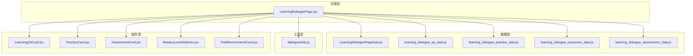
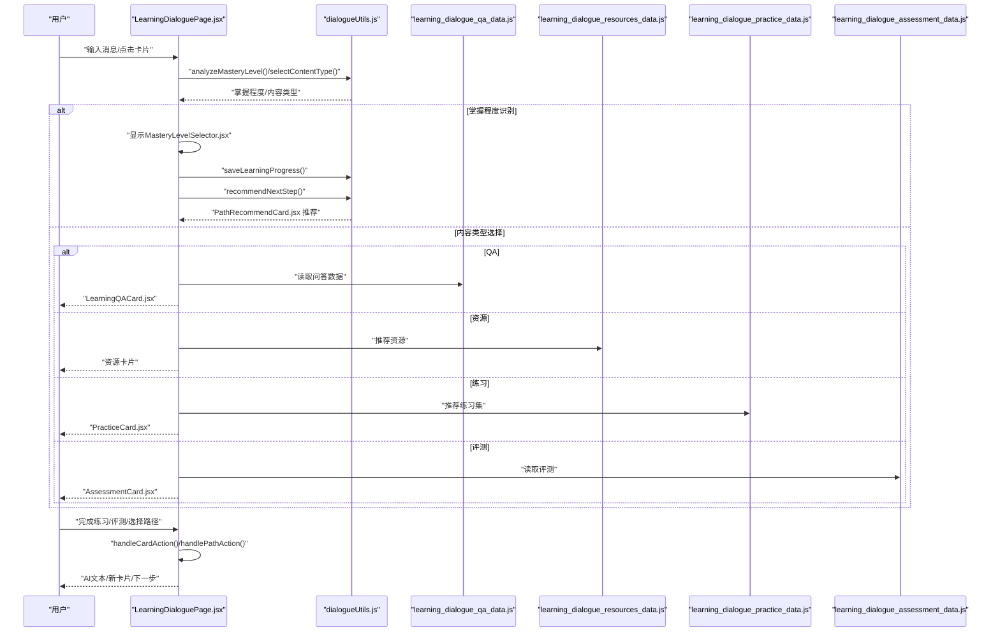
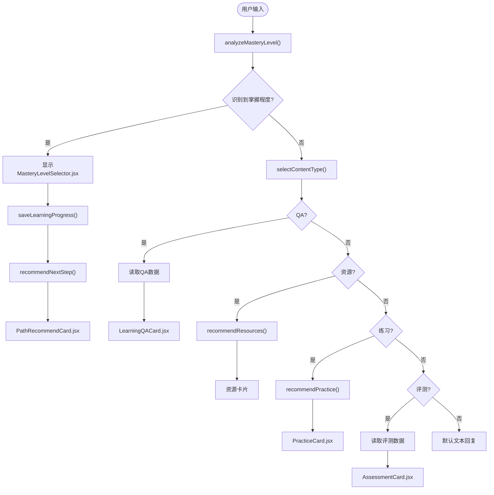
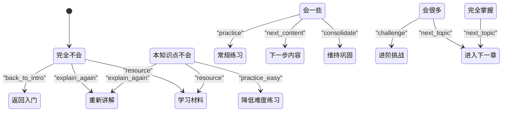
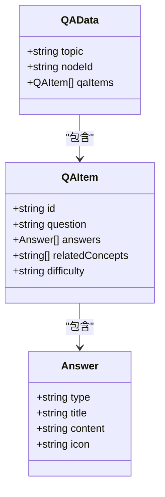
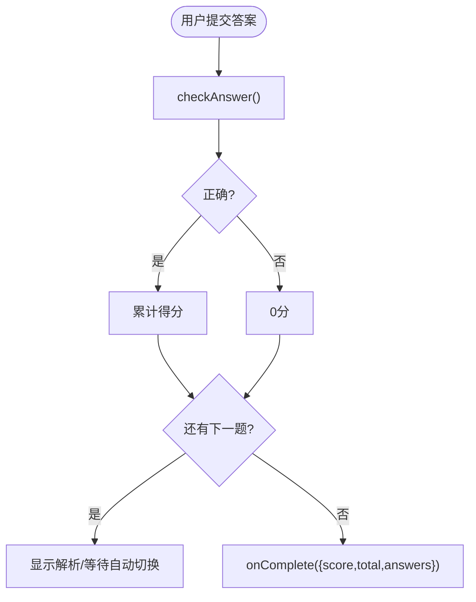
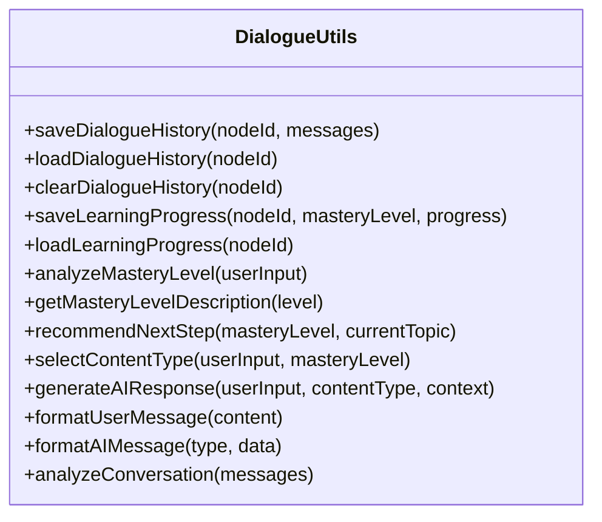
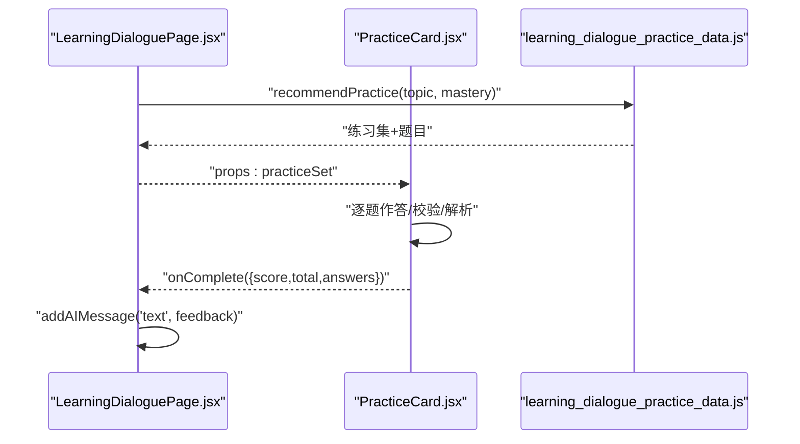
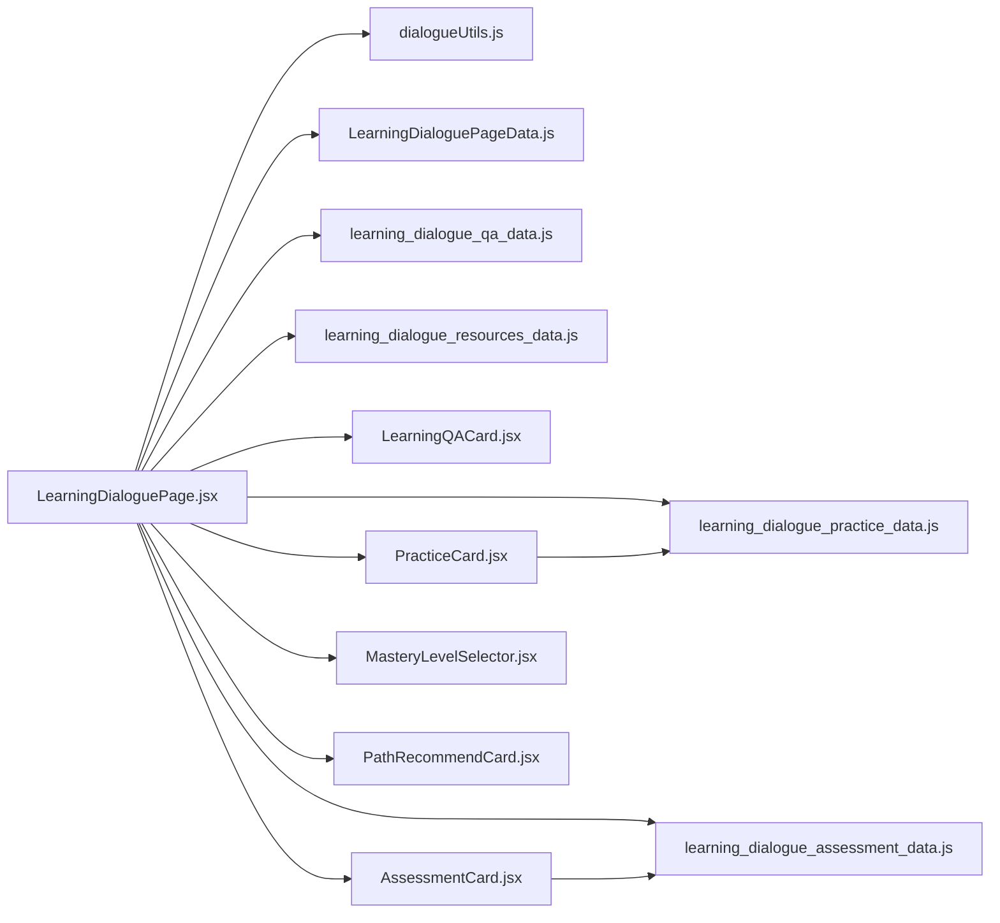

# 学习对话

<cite>
**本文引用的文件**
- [LearningDialoguePage.jsx](file://src/pages/LearningDialoguePage.jsx)
- [LearningDialoguePageData.js](file://src/data/LearningDialoguePageData.js)
- [learning_dialogue_qa_data.js](file://src/data/learning_dialogue_qa_data.js)
- [learning_dialogue_practice_data.js](file://src/data/learning_dialogue_practice_data.js)
- [dialogueUtils.js](file://src/utils/dialogueUtils.js)
- [learning_dialogue_resources_data.js](file://src/data/learning_dialogue_resources_data.js)
- [learning_dialogue_assessment_data.js](file://src/data/learning_dialogue_assessment_data.js)
- [LearningQACard.jsx](file://src/components/chat-widgets/LearningQACard.jsx)
- [PracticeCard.jsx](file://src/components/chat-widgets/PracticeCard.jsx)
- [AssessmentCard.jsx](file://src/components/chat-widgets/AssessmentCard.jsx)
- [MasteryLevelSelector.jsx](file://src/components/chat-widgets/MasteryLevelSelector.jsx)
- [PathRecommendCard.jsx](file://src/components/chat-widgets/PathRecommendCard.jsx)
</cite>

## 目录
1. [简介](#简介)
2. [项目结构](#项目结构)
3. [核心组件](#核心组件)
4. [架构总览](#架构总览)
5. [详细组件分析](#详细组件分析)
6. [依赖关系分析](#依赖关系分析)
7. [性能考量](#性能考量)
8. [故障排查指南](#故障排查指南)
9. [结论](#结论)
10. [附录](#附录)

## 简介
本文件系统性地文档化学习对话系统的架构与实现，聚焦 LearningDialoguePage.jsx 如何驱动交互式学习流程。结合 LearningDialoguePageData.js 中的对话流程定义，说明节点跳转逻辑与状态机设计；分析 learning_dialogue_qa_data.js 和 learning_dialogue_practice_data.js 中的问答与练习数据结构，及其在 QuizCard.jsx 和 PracticeCard.jsx 组件中的渲染方式；提供对话中断恢复、答案验证与反馈生成等关键机制的实现细节，并列举典型对话场景的调试方法。

## 项目结构
学习对话系统围绕“页面-数据-工具-组件”的分层组织：
- 页面层：LearningDialoguePage.jsx 负责对话控制流、消息渲染与交互事件处理
- 数据层：LearningDialoguePageData.js 定义节点初始消息与掌握程度场景；QA/练习/评测/资源数据分别位于独立文件
- 工具层：dialogueUtils.js 提供对话历史持久化、掌握程度分析、内容类型选择、消息格式化、智能推荐等通用能力
- 组件层：各类聊天卡片组件负责具体交互（答疑、练习、评测、路径推荐、掌握程度选择）

**图表来源**
- [LearningDialoguePage.jsx](file://src/pages/LearningDialoguePage.jsx#L1-L536)
- [LearningDialoguePageData.js](file://src/data/LearningDialoguePageData.js#L1-L159)
- [learning_dialogue_qa_data.js](file://src/data/learning_dialogue_qa_data.js#L1-L148)
- [learning_dialogue_practice_data.js](file://src/data/learning_dialogue_practice_data.js#L1-L223)
- [dialogueUtils.js](file://src/utils/dialogueUtils.js#L1-L495)
- [LearningQACard.jsx](file://src/components/chat-widgets/LearningQACard.jsx#L1-L140)
- [PracticeCard.jsx](file://src/components/chat-widgets/PracticeCard.jsx#L1-L272)
- [AssessmentCard.jsx](file://src/components/chat-widgets/AssessmentCard.jsx#L1-L335)
- [MasteryLevelSelector.jsx](file://src/components/chat-widgets/MasteryLevelSelector.jsx#L1-L177)
- [PathRecommendCard.jsx](file://src/components/chat-widgets/PathRecommendCard.jsx#L1-L168)

**章节来源**
- [LearningDialoguePage.jsx](file://src/pages/LearningDialoguePage.jsx#L1-L536)
- [LearningDialoguePageData.js](file://src/data/LearningDialoguePageData.js#L1-L159)

## 核心组件
- LearningDialoguePage.jsx：对话主控，负责消息管理、发送与接收、卡片交互回调、模式切换、路径推荐与内容类型选择
- LearningQACard.jsx：展示问答数据，支持解释方式切换
- PracticeCard.jsx：交互式练习题卡，支持多题轮播、答案校验、即时反馈与统计
- AssessmentCard.jsx：评测卡片，支持倒计时、逐题作答、结果汇总与建议
- MasteryLevelSelector.jsx：掌握程度选择器，五档可视化选择
- PathRecommendCard.jsx：基于掌握程度的路径推荐卡片，支持单选与多选项
- dialogueUtils.js：对话历史持久化、掌握程度分析、内容类型选择、消息格式化、智能推荐

**章节来源**
- [LearningDialoguePage.jsx](file://src/pages/LearningDialoguePage.jsx#L1-L536)
- [LearningQACard.jsx](file://src/components/chat-widgets/LearningQACard.jsx#L1-L140)
- [PracticeCard.jsx](file://src/components/chat-widgets/PracticeCard.jsx#L1-L272)
- [AssessmentCard.jsx](file://src/components/chat-widgets/AssessmentCard.jsx#L1-L335)
- [MasteryLevelSelector.jsx](file://src/components/chat-widgets/MasteryLevelSelector.jsx#L1-L177)
- [PathRecommendCard.jsx](file://src/components/chat-widgets/PathRecommendCard.jsx#L1-L168)
- [dialogueUtils.js](file://src/utils/dialogueUtils.js#L1-L495)

## 架构总览
系统采用“页面-数据-工具-组件”四层架构，页面层集中控制状态与流程，工具层提供通用能力，组件层负责具体交互。对话流程通过节点定义与掌握程度状态机驱动，结合问答、练习、评测、资源推荐等模块，形成闭环学习体验。

**图表来源**
- [LearningDialoguePage.jsx](file://src/pages/LearningDialoguePage.jsx#L1-L536)
- [dialogueUtils.js](file://src/utils/dialogueUtils.js#L1-L495)
- [learning_dialogue_qa_data.js](file://src/data/learning_dialogue_qa_data.js#L1-L148)
- [learning_dialogue_resources_data.js](file://src/data/learning_dialogue_resources_data.js#L1-L188)
- [learning_dialogue_practice_data.js](file://src/data/learning_dialogue_practice_data.js#L1-L223)
- [learning_dialogue_assessment_data.js](file://src/data/learning_dialogue_assessment_data.js#L1-L369)

## 详细组件分析

### LearningDialoguePage.jsx：对话主控与状态机
- 节点与初始消息：根据 nodeId 从 LearningDialoguePageData.js 读取节点配置与初始消息，若无历史记录则使用初始消息
- 对话历史：通过 dialogueUtils.js 的 saveDialogueHistory/loadDialogueHistory 实现本地持久化与7天有效期清理
- 掌握程度分析：analyzeMasteryLevel 基于关键词识别用户掌握程度，触发 MasteryLevelSelector.jsx 二次确认
- 内容类型选择：selectContentType 基于用户输入与掌握程度推荐 QA/资源/练习/评测
- 路径推荐：recommendNextStep 根据掌握程度生成推荐项（回退入门、重新讲解、练习、挑战、下一主题等）
- 卡片交互：handleCardAction/handlePathAction 处理卡片回调，生成 AI 文本反馈或推送新内容
- 模式切换：支持问答模式与教学模式，影响默认推荐策略
- 输入处理：handleSendMessage 添加用户消息，延时后生成 AI 回复，包含文本、QA、资源、练习、评测等类型

**图表来源**
- [LearningDialoguePage.jsx](file://src/pages/LearningDialoguePage.jsx#L1-L536)
- [dialogueUtils.js](file://src/utils/dialogueUtils.js#L1-L495)
- [learning_dialogue_resources_data.js](file://src/data/learning_dialogue_resources_data.js#L1-L188)
- [learning_dialogue_practice_data.js](file://src/data/learning_dialogue_practice_data.js#L1-L223)
- [learning_dialogue_assessment_data.js](file://src/data/learning_dialogue_assessment_data.js#L1-L369)

**章节来源**
- [LearningDialoguePage.jsx](file://src/pages/LearningDialoguePage.jsx#L1-L536)
- [LearningDialoguePageData.js](file://src/data/LearningDialoguePageData.js#L1-L159)
- [dialogueUtils.js](file://src/utils/dialogueUtils.js#L1-L495)

### LearningDialoguePageData.js：节点与掌握程度场景
- 节点定义：title/subtitle/initialMessages/rightPanel 等
- 掌握程度场景：level_1 到 level_4 的标签、摘要、描述、推荐动作与下一步
- 场景动作：back_to_intro/explain_again/resource/practice/next_content/consolidate/challenge/next_topic 等

**图表来源**
- [LearningDialoguePageData.js](file://src/data/LearningDialoguePageData.js#L104-L155)

**章节来源**
- [LearningDialoguePageData.js](file://src/data/LearningDialoguePageData.js#L1-L159)

### learning_dialogue_qa_data.js：问答数据结构与渲染
- 数据结构：topic、qaItems 数组，每个问答包含 question、answers（simple/analogy/technical）、relatedConcepts、difficulty
- 渲染方式：LearningQACard.jsx 支持解释方式切换与“换个方式讲解”操作，onChangeExplanation 用于记录用户偏好

**图表来源**
- [learning_dialogue_qa_data.js](file://src/data/learning_dialogue_qa_data.js#L1-L148)
- [LearningQACard.jsx](file://src/components/chat-widgets/LearningQACard.jsx#L1-L140)

**章节来源**
- [learning_dialogue_qa_data.js](file://src/data/learning_dialogue_qa_data.js#L1-L148)
- [LearningQACard.jsx](file://src/components/chat-widgets/LearningQACard.jsx#L1-L140)

### learning_dialogue_practice_data.js：练习数据结构与答案校验
- 数据结构：topic、exercises（choice/true-false/fill-blank）、practiceSets（按难度分组）
- 答案校验：checkAnswer 支持选择题/判断题/填空题（可接受答案列表），返回 isCorrect、explanation、points
- 推荐策略：recommendPractice 根据掌握程度返回对应难度的练习集与题目

**图表来源**
- [learning_dialogue_practice_data.js](file://src/data/learning_dialogue_practice_data.js#L196-L221)
- [PracticeCard.jsx](file://src/components/chat-widgets/PracticeCard.jsx#L1-L272)

**章节来源**
- [learning_dialogue_practice_data.js](file://src/data/learning_dialogue_practice_data.js#L1-L223)
- [PracticeCard.jsx](file://src/components/chat-widgets/PracticeCard.jsx#L1-L272)

### dialogueUtils.js：对话历史、掌握程度与智能推荐
- 对话历史：saveDialogueHistory/loadDialogueHistory/clearDialogueHistory，带7天有效期
- 学习进度：saveLearningProgress/loadLearningProgress
- 掌握程度：analyzeMasteryLevel（关键词匹配）、getMasteryLevelDescription
- 内容类型：selectContentType（关键词+掌握程度）
- 推荐：recommendNextStep（场景化路径推荐）
- 消息格式化：generateAIResponse/formatUserMessage/formatAIMessage
- 统计：analyzeConversation

**图表来源**
- [dialogueUtils.js](file://src/utils/dialogueUtils.js#L1-L495)

**章节来源**
- [dialogueUtils.js](file://src/utils/dialogueUtils.js#L1-L495)

### 组件层：卡片与交互
- LearningQACard.jsx：问答展示与解释切换
- PracticeCard.jsx：练习题卡，支持多题轮播、答案校验、解析与统计
- AssessmentCard.jsx：评测卡片，支持倒计时、逐题作答、结果汇总与建议
- MasteryLevelSelector.jsx：五档掌握程度选择器
- PathRecommendCard.jsx：路径推荐卡片，支持单选与多选项

**图表来源**
- [LearningDialoguePage.jsx](file://src/pages/LearningDialoguePage.jsx#L1-L536)
- [PracticeCard.jsx](file://src/components/chat-widgets/PracticeCard.jsx#L1-L272)
- [learning_dialogue_practice_data.js](file://src/data/learning_dialogue_practice_data.js#L156-L194)

**章节来源**
- [LearningQACard.jsx](file://src/components/chat-widgets/LearningQACard.jsx#L1-L140)
- [PracticeCard.jsx](file://src/components/chat-widgets/PracticeCard.jsx#L1-L272)
- [AssessmentCard.jsx](file://src/components/chat-widgets/AssessmentCard.jsx#L1-L335)
- [MasteryLevelSelector.jsx](file://src/components/chat-widgets/MasteryLevelSelector.jsx#L1-L177)
- [PathRecommendCard.jsx](file://src/components/chat-widgets/PathRecommendCard.jsx#L1-L168)

## 依赖关系分析
- 页面对工具：依赖 analyzeMasteryLevel/selectContentType/recommendNextStep/formatUserMessage/formatAIMessage/saveDialogueHistory/loadDialogueHistory/saveLearningProgress
- 页面对数据：依赖 LearningDialoguePageData.js 获取节点与场景；依赖 QA/练习/评测/资源数据
- 组件对页面：通过 onCardAction/onComplete/onSkip 回调与页面通信
- 组件对数据：PracticeCard.jsx 依赖 checkAnswer/recommendPractice；AssessmentCard.jsx 依赖 analyzeAssessment

**图表来源**
- [LearningDialoguePage.jsx](file://src/pages/LearningDialoguePage.jsx#L1-L536)
- [dialogueUtils.js](file://src/utils/dialogueUtils.js#L1-L495)
- [LearningDialoguePageData.js](file://src/data/LearningDialoguePageData.js#L1-L159)
- [learning_dialogue_qa_data.js](file://src/data/learning_dialogue_qa_data.js#L1-L148)
- [learning_dialogue_resources_data.js](file://src/data/learning_dialogue_resources_data.js#L1-L188)
- [learning_dialogue_practice_data.js](file://src/data/learning_dialogue_practice_data.js#L1-L223)
- [learning_dialogue_assessment_data.js](file://src/data/learning_dialogue_assessment_data.js#L1-L369)

**章节来源**
- [LearningDialoguePage.jsx](file://src/pages/LearningDialoguePage.jsx#L1-L536)
- [dialogueUtils.js](file://src/utils/dialogueUtils.js#L1-L495)

## 性能考量
- 本地存储：对话历史与学习进度使用 localStorage，注意容量与序列化开销；建议在页面卸载或定期清理过期数据
- 组件渲染：PracticeCard.jsx 使用动画与逐题切换，建议在大量题目时优化重渲染（如 memo 化）
- 推荐算法：recommendNextStep/recommendPractice/recommendResources 为 O(n) 查找，建议在数据量增长时引入索引或缓存
- 网络与外部依赖：当前实现未使用外部网络请求，性能瓶颈主要在前端计算与渲染

[本节为通用指导，不涉及具体文件分析]

## 故障排查指南
- 对话历史异常
  - 现象：历史无法加载或显示为空
  - 排查：检查 localStorage 是否可用、数据是否过期（7天）、key 命名是否一致
  - 参考路径：[对话历史函数](file://src/utils/dialogueUtils.js#L1-L120)
- 掌握程度识别失败
  - 现象：未触发 MasteryLevelSelector.jsx
  - 排查：确认用户输入是否包含关键词；检查 analyzeMasteryLevel 的关键词表
  - 参考路径：[掌握程度分析](file://src/utils/dialogueUtils.js#L117-L179)
- 内容类型选择错误
  - 现象：推荐内容与期望不符
  - 排查：检查 selectContentType 的关键词匹配与掌握程度分支
  - 参考路径：[内容类型选择](file://src/utils/dialogueUtils.js#L307-L344)
- 练习答案校验异常
  - 现象：填空题无法通过或得分不正确
  - 排查：核对 acceptableAnswers 与用户输入格式；确认 exerciseId 正确
  - 参考路径：[答案校验](file://src/data/learning_dialogue_practice_data.js#L196-L221)
- 评测结果异常
  - 现象：总分/通过率与预期不符
  - 排查：核对题目 points 与 correctAnswer；确认维度权重与 passingScore
  - 参考路径：[评测分析](file://src/data/learning_dialogue_assessment_data.js#L250-L307)
- 路径推荐不符合预期
  - 现象：推荐动作与掌握程度不匹配
  - 排查：核对 LearningDialoguePageData.js 的 masteryScenarios 与 dialogueUtils.js 的 recommendNextStep
  - 参考路径：[节点场景](file://src/data/LearningDialoguePageData.js#L104-L155)、[推荐逻辑](file://src/utils/dialogueUtils.js#L196-L297)

**章节来源**
- [dialogueUtils.js](file://src/utils/dialogueUtils.js#L1-L495)
- [learning_dialogue_practice_data.js](file://src/data/learning_dialogue_practice_data.js#L196-L221)
- [learning_dialogue_assessment_data.js](file://src/data/learning_dialogue_assessment_data.js#L250-L307)
- [LearningDialoguePageData.js](file://src/data/LearningDialoguePageData.js#L104-L155)

## 结论
学习对话系统通过页面-数据-工具-组件的清晰分层，实现了以掌握程度为核心的自适应学习流程。节点跳转逻辑与状态机设计使得系统能够根据用户反馈动态调整学习路径；问答、练习、评测、资源推荐四大模块协同工作，形成闭环学习体验。对话中断恢复、答案验证与反馈生成等机制确保了良好的用户体验与可维护性。

[本节为总结性内容，不涉及具体文件分析]

## 附录
- 典型对话场景调试步骤
  - 场景A：用户表达“完全不会”，应触发 MasteryLevelSelector.jsx 并推荐回退入门
    - 步骤：输入关键词 -> analyzeMasteryLevel -> 显示选择器 -> recommendNextStep(back_to_intro) -> PathRecommendCard.jsx
    - 参考路径：[掌握程度分析](file://src/utils/dialogueUtils.js#L117-L179)、[推荐逻辑](file://src/utils/dialogueUtils.js#L196-L297)、[节点场景](file://src/data/LearningDialoguePageData.js#L104-L155)
  - 场景B：用户输入“给我做练习”，应推荐对应难度的练习集
    - 步骤：selectContentType(practice) -> recommendPractice -> PracticeCard.jsx
    - 参考路径：[内容类型选择](file://src/utils/dialogueUtils.js#L307-L344)、[练习推荐](file://src/data/learning_dialogue_practice_data.js#L156-L194)
  - 场景C：用户完成练习，应生成分数与反馈
    - 步骤：PracticeCard.jsx onComplete -> 计算总分 -> addAIMessage 文本反馈
    - 参考路径：[练习组件](file://src/components/chat-widgets/PracticeCard.jsx#L1-L272)、[页面处理](file://src/pages/LearningDialoguePage.jsx#L199-L209)

[本节为实践指导，不涉及具体文件分析]