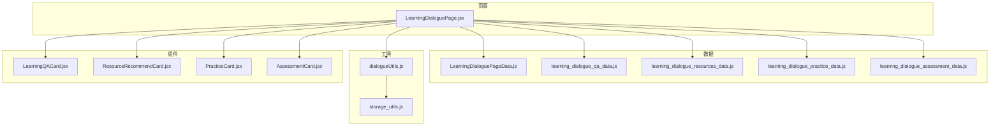
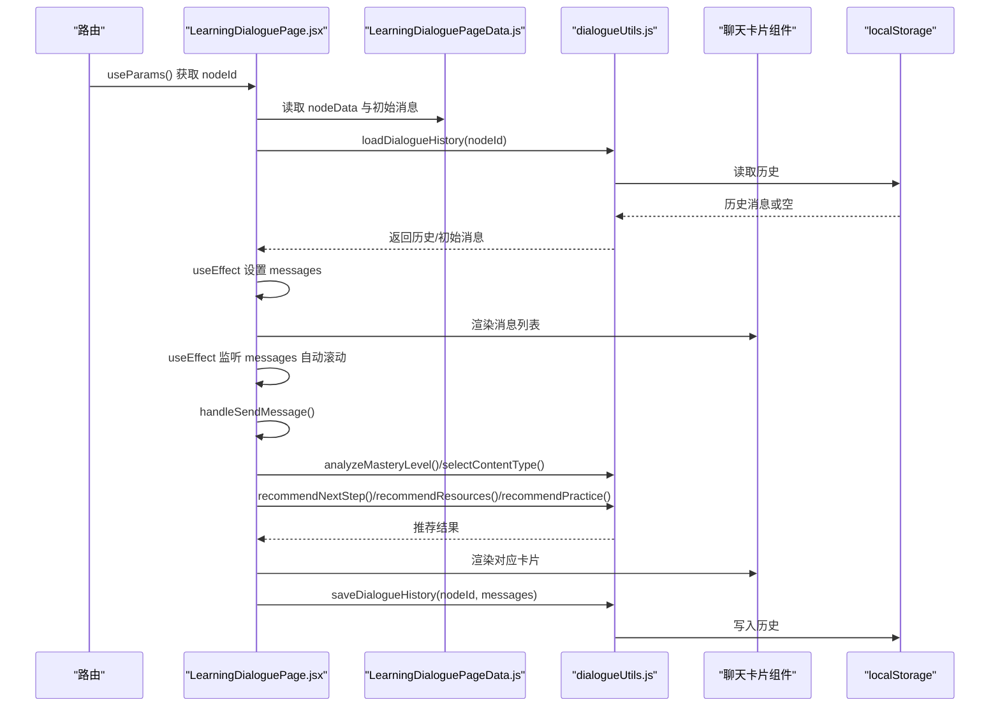
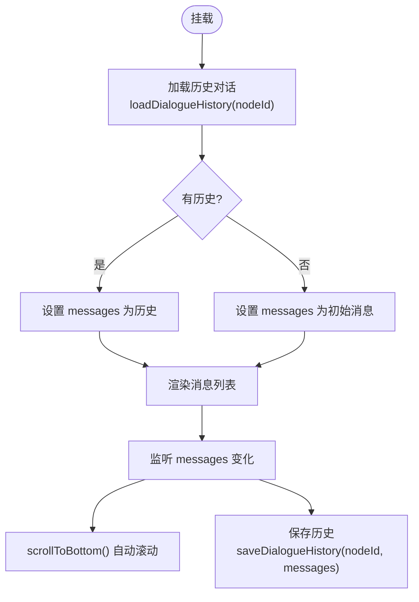
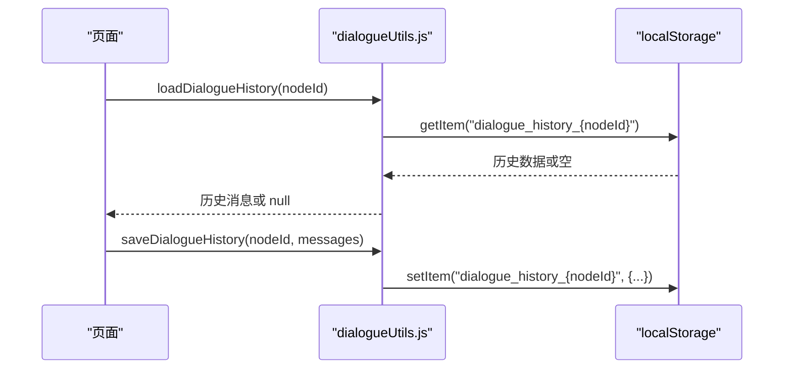
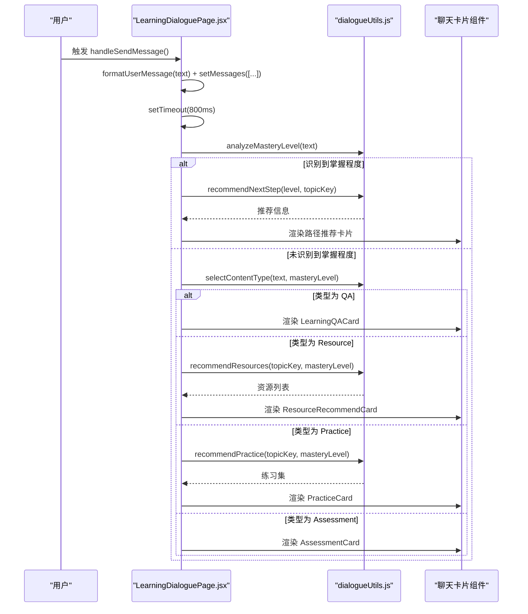
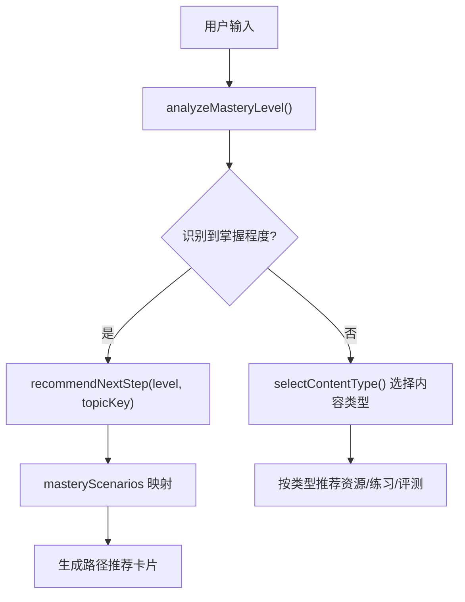
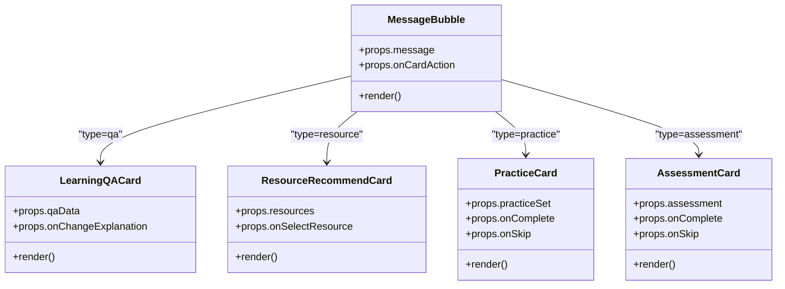
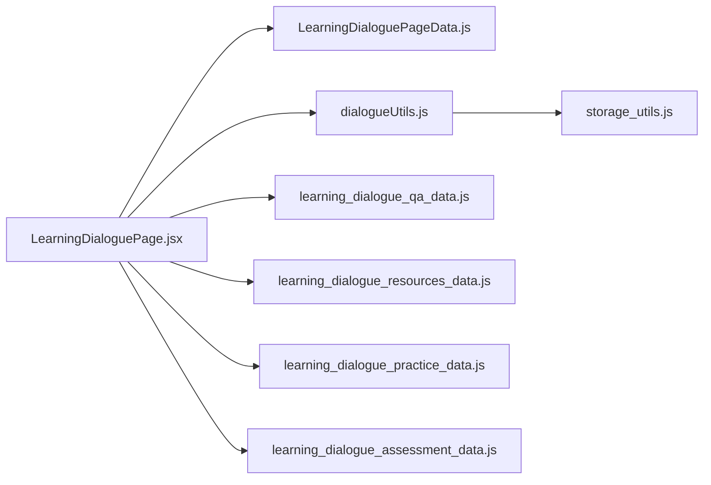

# 核心流程

<cite>
**本文引用的文件**
- [LearningDialoguePage.jsx](file://src/pages/LearningDialoguePage.jsx)
- [LearningDialoguePageData.js](file://src/data/LearningDialoguePageData.js)
- [dialogueUtils.js](file://src/utils/dialogueUtils.js)
- [storage_utils.js](file://src/utils/storage_utils.js)
- [LearningQACard.jsx](file://src/components/chat-widgets/LearningQACard.jsx)
- [ResourceRecommendCard.jsx](file://src/components/chat-widgets/ResourceRecommendCard.jsx)
- [PracticeCard.jsx](file://src/components/chat-widgets/PracticeCard.jsx)
- [AssessmentCard.jsx](file://src/components/chat-widgets/AssessmentCard.jsx)
- [learning_dialogue_qa_data.js](file://src/data/learning_dialogue_qa_data.js)
- [learning_dialogue_resources_data.js](file://src/data/learning_dialogue_resources_data.js)
- [learning_dialogue_practice_data.js](file://src/data/learning_dialogue_practice_data.js)
- [learning_dialogue_assessment_data.js](file://src/data/learning_dialogue_assessment_data.js)
</cite>

## 目录
1. [简介](#简介)
2. [项目结构](#项目结构)
3. [核心组件](#核心组件)
4. [架构总览](#架构总览)
5. [详细组件分析](#详细组件分析)
6. [依赖关系分析](#依赖关系分析)
7. [性能考量](#性能考量)
8. [故障排查指南](#故障排查指南)
9. [结论](#结论)

## 简介
本文件系统性地文档化学习对话页面的核心流程，聚焦于 LearningDialoguePage.jsx 的状态管理与生命周期控制。重点说明：
- useParams 获取 nodeId 后如何加载 LearningDialoguePageData.js 中的初始消息与对话配置；
- useEffect 如何协同 loadDialogueHistory 与 saveDialogueHistory 实现对话历史持久化；
- scrollToBottom 如何确保消息容器自动滚动；
- handleSendMessage 中 800ms 延迟模拟 AI 响应的机制；
- mode 状态如何控制问答与教学两种交互模式的切换；
- 结合 LearningDialoguePageData.js 中 masteryScenarios 字段，说明掌握程度评估结果如何驱动路径推荐逻辑。

## 项目结构
学习对话页面位于 pages 目录，核心数据与工具函数分别位于 data 与 utils 目录；消息卡片组件位于 components/chat-widgets 目录。整体采用“页面 + 数据 + 工具 + 组件”的分层组织。

**图表来源**
- [LearningDialoguePage.jsx](file://src/pages/LearningDialoguePage.jsx#L1-L120)
- [LearningDialoguePageData.js](file://src/data/LearningDialoguePageData.js#L1-L159)
- [dialogueUtils.js](file://src/utils/dialogueUtils.js#L1-L120)
- [learning_dialogue_qa_data.js](file://src/data/learning_dialogue_qa_data.js)
- [learning_dialogue_resources_data.js](file://src/data/learning_dialogue_resources_data.js#L1-L188)
- [learning_dialogue_practice_data.js](file://src/data/learning_dialogue_practice_data.js#L1-L223)
- [learning_dialogue_assessment_data.js](file://src/data/learning_dialogue_assessment_data.js)

**章节来源**
- [LearningDialoguePage.jsx](file://src/pages/LearningDialoguePage.jsx#L1-L120)
- [LearningDialoguePageData.js](file://src/data/LearningDialoguePageData.js#L1-L159)

## 核心组件
- 页面主组件：负责路由参数解析、初始消息加载、对话历史持久化、消息发送与 AI 延迟回复、模式切换、消息渲染与自动滚动。
- 数据模块：提供节点初始消息、右侧资源面板、掌握程度场景映射等。
- 工具模块：封装对话历史读写、学习进度保存、掌握程度分析、内容类型选择、消息格式化、路径推荐等。
- 卡片组件：用于展示问答、资源、练习、评测等交互内容。

**章节来源**
- [LearningDialoguePage.jsx](file://src/pages/LearningDialoguePage.jsx#L120-L220)
- [LearningDialoguePageData.js](file://src/data/LearningDialoguePageData.js#L1-L159)
- [dialogueUtils.js](file://src/utils/dialogueUtils.js#L1-L120)

## 架构总览
学习对话页面采用“页面状态 + 工具函数 + 数据模块 + 组件”的分层架构。页面通过 params 获取 nodeId，加载对应节点的数据；通过工具函数实现对话历史的本地持久化；通过消息卡片组件承载不同类型的交互内容；通过掌握程度场景驱动路径推荐。

**图表来源**
- [LearningDialoguePage.jsx](file://src/pages/LearningDialoguePage.jsx#L130-L220)
- [LearningDialoguePageData.js](file://src/data/LearningDialoguePageData.js#L1-L159)
- [dialogueUtils.js](file://src/utils/dialogueUtils.js#L1-L220)

## 详细组件分析

### 状态管理与生命周期控制
- useParams 获取 nodeId，并据此从 LearningDialoguePageData.js 读取 nodeData 与初始消息。
- useEffect 在挂载时尝试加载历史对话；若无历史，则使用 nodeData.initialMessages。
- useEffect 在 messages 变化时触发 scrollToBottom，确保消息容器自动滚动至底部。
- useEffect 在 messages 变化时保存历史，保证对话断开重连仍可恢复。

**图表来源**
- [LearningDialoguePage.jsx](file://src/pages/LearningDialoguePage.jsx#L140-L172)
- [dialogueUtils.js](file://src/utils/dialogueUtils.js#L1-L120)

**章节来源**
- [LearningDialoguePage.jsx](file://src/pages/LearningDialoguePage.jsx#L130-L172)
- [dialogueUtils.js](file://src/utils/dialogueUtils.js#L1-L120)

### 对话历史持久化与恢复
- 加载策略：loadDialogueHistory 读取 localStorage 中以“dialogue_history_{nodeId}”命名的键值，若超过 7 天则视为过期并清理。
- 保存策略：saveDialogueHistory 将 messages 与时间戳写入 localStorage，作为后续恢复依据。
- 进度保存：saveLearningProgress 用于保存掌握程度与进度，供后续路径推荐使用。

**图表来源**
- [dialogueUtils.js](file://src/utils/dialogueUtils.js#L1-L120)

**章节来源**
- [dialogueUtils.js](file://src/utils/dialogueUtils.js#L1-L120)

### 消息发送与 AI 延迟回复机制
- handleSendMessage 将用户输入格式化为用户消息并加入消息列表，清空快捷回复，隐藏快捷回复区。
- 800ms 延迟后执行 AI 回复逻辑：
  - analyzeMasteryLevel 识别用户输入中的掌握程度关键词，若识别成功则显示路径推荐卡片；
  - 若未识别，则根据 selectContentType 选择内容类型（问答/资源/练习/评测），并调用相应推荐函数（recommendResources/recommendPractice/assessment）生成 AI 消息。
- formatUserMessage/formatAIMessage 统一消息格式，包含 id、sender、type、content、timestamp 等字段。

**图表来源**
- [LearningDialoguePage.jsx](file://src/pages/LearningDialoguePage.jsx#L289-L358)
- [dialogueUtils.js](file://src/utils/dialogueUtils.js#L117-L220)
- [learning_dialogue_resources_data.js](file://src/data/learning_dialogue_resources_data.js#L156-L188)
- [learning_dialogue_practice_data.js](file://src/data/learning_dialogue_practice_data.js#L156-L194)

**章节来源**
- [LearningDialoguePage.jsx](file://src/pages/LearningDialoguePage.jsx#L289-L358)
- [dialogueUtils.js](file://src/utils/dialogueUtils.js#L117-L220)

### 掌握程度评估与路径推荐
- 掌握程度关键词识别：analyzeMasteryLevel 通过关键词匹配判断用户反馈属于哪一级别（level_1 到 level_4）。
- 场景映射：LearningDialoguePageData.js 的 masteryScenarios 字段定义了不同掌握程度下的推荐动作与描述。
- 推荐策略：recommendNextStep 根据掌握程度返回推荐动作（如 back_to_intro/explain_again/resource/practice/challenge/next_topic 等），页面据此生成 AI 消息并渲染路径推荐卡片。

**图表来源**
- [dialogueUtils.js](file://src/utils/dialogueUtils.js#L117-L297)
- [LearningDialoguePageData.js](file://src/data/LearningDialoguePageData.js#L103-L155)

**章节来源**
- [dialogueUtils.js](file://src/utils/dialogueUtils.js#L117-L297)
- [LearningDialoguePageData.js](file://src/data/LearningDialoguePageData.js#L103-L155)

### 模式切换（问答/教学）
- 页面提供 mode 状态，默认为 'qa'（问答模式），点击按钮可切换为 'teach'（教学模式）。
- 模式切换仅影响 UI 展示与文案提示，不改变核心对话流程；实际交互由 handleSendMessage 的内容类型选择逻辑决定。

**章节来源**
- [LearningDialoguePage.jsx](file://src/pages/LearningDialoguePage.jsx#L410-L438)

### 消息渲染与卡片交互
- MessageBubble 根据消息类型渲染文本或卡片组件；
- 卡片组件通过 onCardAction 回调与页面交互，页面处理卡片动作并生成新的 AI 消息；
- 卡片组件包括：
  - LearningQACard：问答解释与切换；
  - ResourceRecommendCard：资源推荐；
  - PracticeCard：练习题；
  - AssessmentCard：评测。

**图表来源**
- [LearningDialoguePage.jsx](file://src/pages/LearningDialoguePage.jsx#L36-L126)
- [LearningQACard.jsx](file://src/components/chat-widgets/LearningQACard.jsx#L1-L140)
- [ResourceRecommendCard.jsx](file://src/components/chat-widgets/ResourceRecommendCard.jsx#L1-L169)
- [PracticeCard.jsx](file://src/components/chat-widgets/PracticeCard.jsx#L1-L272)
- [AssessmentCard.jsx](file://src/components/chat-widgets/AssessmentCard.jsx#L1-L335)

**章节来源**
- [LearningDialoguePage.jsx](file://src/pages/LearningDialoguePage.jsx#L36-L126)
- [LearningQACard.jsx](file://src/components/chat-widgets/LearningQACard.jsx#L1-L140)
- [ResourceRecommendCard.jsx](file://src/components/chat-widgets/ResourceRecommendCard.jsx#L1-L169)
- [PracticeCard.jsx](file://src/components/chat-widgets/PracticeCard.jsx#L1-L272)
- [AssessmentCard.jsx](file://src/components/chat-widgets/AssessmentCard.jsx#L1-L335)

## 依赖关系分析
- 页面依赖：
  - 数据模块：LearningDialoguePageData.js 提供初始消息与 masteryScenarios；
  - 工具模块：dialogueUtils.js 提供对话历史、掌握程度分析、内容类型选择、消息格式化、路径推荐等；
  - 组件模块：聊天卡片组件用于承载不同交互内容；
  - 数据模块：QA/资源/练习/评测数据模块用于生成推荐内容。
- 工具模块依赖：
  - storage_utils.js 提供学习报告数据的本地存储工具类，与对话历史功能独立。

**图表来源**
- [LearningDialoguePage.jsx](file://src/pages/LearningDialoguePage.jsx#L1-L120)
- [dialogueUtils.js](file://src/utils/dialogueUtils.js#L1-L120)
- [storage_utils.js](file://src/utils/storage_utils.js#L1-L120)

**章节来源**
- [LearningDialoguePage.jsx](file://src/pages/LearningDialoguePage.jsx#L1-L120)
- [dialogueUtils.js](file://src/utils/dialogueUtils.js#L1-L120)
- [storage_utils.js](file://src/utils/storage_utils.js#L1-L120)

## 性能考量
- 对话历史保存：每次消息变更均触发保存，建议在高频输入场景下考虑节流或去抖，避免频繁写入 localStorage。
- 自动滚动：messages 变化即滚动，建议在大量消息时优化渲染（如虚拟滚动）以减少 DOM 更新压力。
- AI 延迟：800ms 延迟用于模拟真实响应，建议在移动端网络较慢时适当增加延迟或提供加载指示。
- 推荐算法：推荐函数基于关键词与难度映射，复杂度较低；若数据规模扩大，可考虑缓存热门推荐结果。

[本节为通用建议，不直接分析具体文件]

## 故障排查指南
- 历史加载失败：检查 loadDialogueHistory 是否抛出异常，确认 localStorage 可用且键名正确。
- 历史过期：若超过 7 天未使用，历史会被清理，属预期行为；可通过重新发起对话恢复。
- 掌握程度未识别：确认用户输入是否包含关键词；必要时扩展关键词表。
- 路径推荐无效：检查 masteryScenarios 与 recommendNextStep 的映射是否覆盖当前掌握程度。
- 卡片交互无响应：确认 onCardAction 回调是否正确传递至 MessageBubble，并在 handleCardAction 中处理对应动作。

**章节来源**
- [dialogueUtils.js](file://src/utils/dialogueUtils.js#L1-L120)
- [LearningDialoguePage.jsx](file://src/pages/LearningDialoguePage.jsx#L180-L287)

## 结论
学习对话页面通过 params + 数据模块 + 工具函数 + 组件的清晰分层，实现了从初始消息加载、历史持久化、自动滚动、AI 延迟回复到掌握程度驱动的路径推荐的完整闭环。mode 状态提供了问答与教学两种交互视角，配合 masteryScenarios 字段，使系统能够根据用户反馈动态调整学习路径，提升个性化体验。