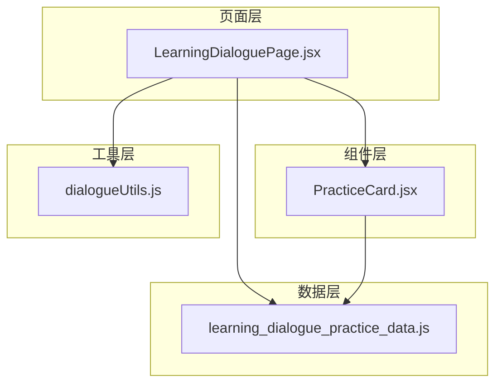
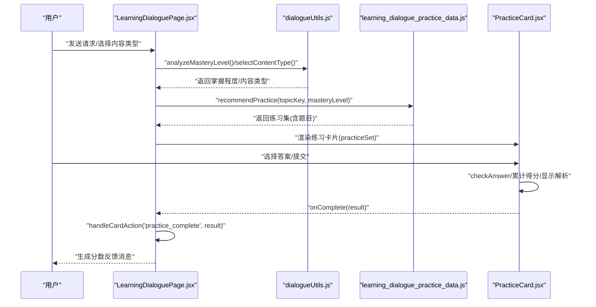
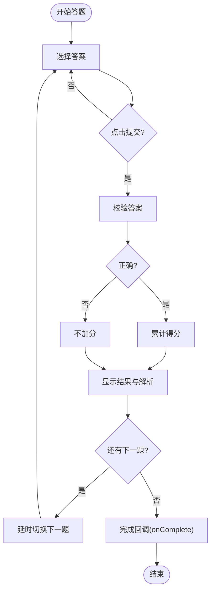
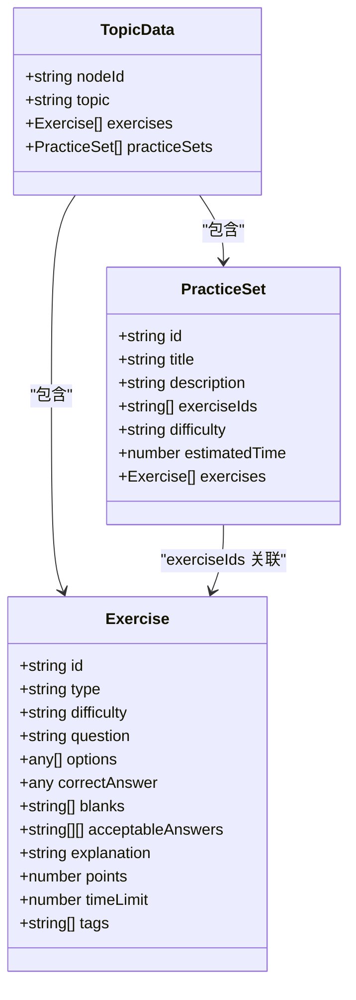
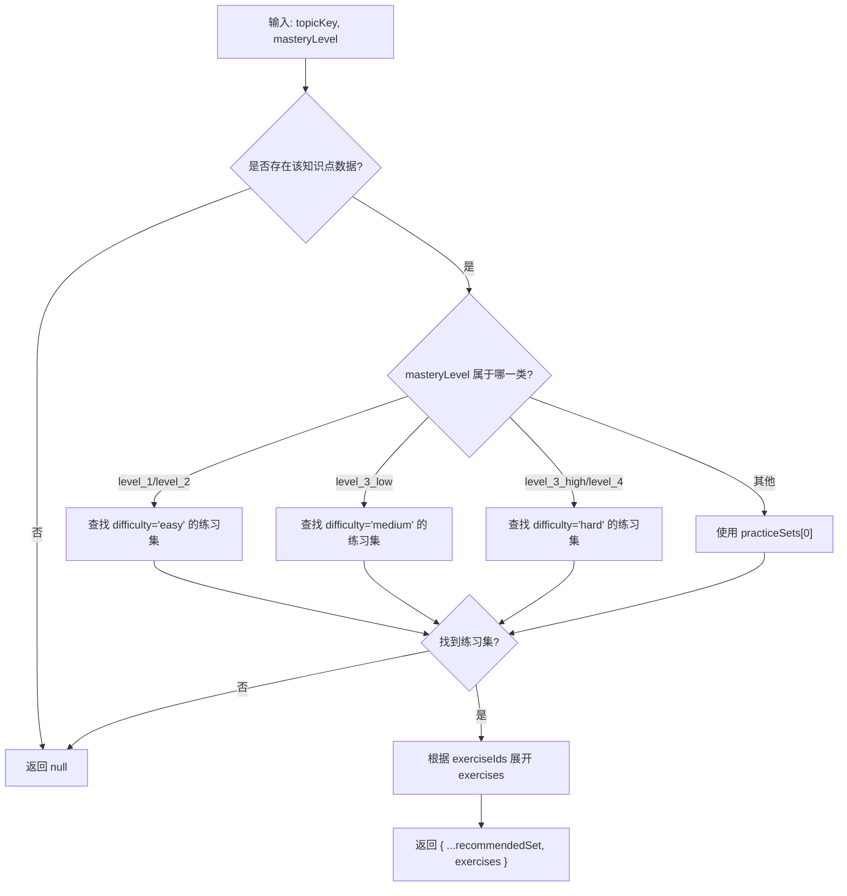
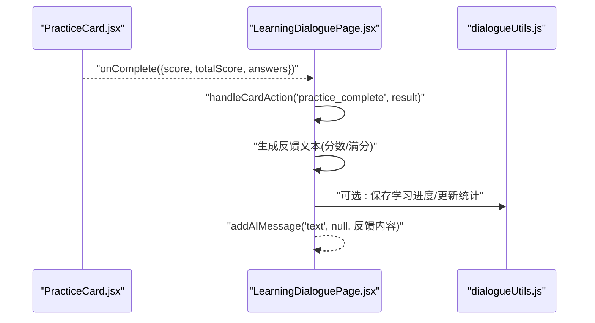
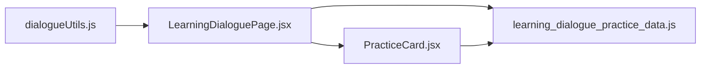

# 练习交互

<cite>
**本文引用的文件**
- [PracticeCard.jsx](file://src/components/chat-widgets/PracticeCard.jsx)
- [learning_dialogue_practice_data.js](file://src/data/learning_dialogue_practice_data.js)
- [LearningDialoguePage.jsx](file://src/pages/LearningDialoguePage.jsx)
- [dialogueUtils.js](file://src/utils/dialogueUtils.js)
</cite>

## 目录
1. [简介](#简介)
2. [项目结构](#项目结构)
3. [核心组件](#核心组件)
4. [架构总览](#架构总览)
5. [详细组件分析](#详细组件分析)
6. [依赖关系分析](#依赖关系分析)
7. [性能考量](#性能考量)
8. [故障排查指南](#故障排查指南)
9. [结论](#结论)

## 简介
本文件围绕“随堂练习”功能进行全面文档化，重点解析 PracticeCard 组件如何渲染 learning_dialogue_practice_data.js 中的多样化题型（单选 choice、判断 true-false、填空 fill-blank），并说明 PracticeCard 对不同交互模式的支持；阐述 recommendPractice 函数如何依据用户掌握程度（level_1 至 level_4）匹配对应难度的 practiceSets；最后梳理 handleCardAction 中 'practice_complete' 事件的处理流程，包括 checkAnswer 答案验证、得分计算与反馈消息生成的完整链路。

## 项目结构
- 练习相关的核心文件位于：
  - 组件层：src/components/chat-widgets/PracticeCard.jsx
  - 数据层：src/data/learning_dialogue_practice_data.js
  - 页面层：src/pages/LearningDialoguePage.jsx
  - 工具层：src/utils/dialogueUtils.js（包含掌握程度分析、内容类型选择、消息格式化等）

图表来源
- [LearningDialoguePage.jsx](file://src/pages/LearningDialoguePage.jsx#L91-L123)
- [PracticeCard.jsx](file://src/components/chat-widgets/PracticeCard.jsx#L1-L60)
- [learning_dialogue_practice_data.js](file://src/data/learning_dialogue_practice_data.js#L1-L40)
- [dialogueUtils.js](file://src/utils/dialogueUtils.js#L117-L179)

章节来源
- [LearningDialoguePage.jsx](file://src/pages/LearningDialoguePage.jsx#L91-L123)
- [PracticeCard.jsx](file://src/components/chat-widgets/PracticeCard.jsx#L1-L60)
- [learning_dialogue_practice_data.js](file://src/data/learning_dialogue_practice_data.js#L1-L40)
- [dialogueUtils.js](file://src/utils/dialogueUtils.js#L117-L179)

## 核心组件
- PracticeCard：负责展示练习集、处理用户作答、显示结果与解析、累计得分并在完成后回调上层。
- learning_dialogue_practice_data：提供练习题与练习集的数据结构、难度筛选、练习推荐、答案校验等工具函数。
- LearningDialoguePage：作为对话页面承载组件，负责派发练习卡片、接收完成事件并生成反馈消息。
- dialogueUtils：提供掌握程度分析、内容类型选择、消息格式化等通用能力。

章节来源
- [PracticeCard.jsx](file://src/components/chat-widgets/PracticeCard.jsx#L1-L60)
- [learning_dialogue_practice_data.js](file://src/data/learning_dialogue_practice_data.js#L143-L222)
- [LearningDialoguePage.jsx](file://src/pages/LearningDialoguePage.jsx#L91-L123)
- [dialogueUtils.js](file://src/utils/dialogueUtils.js#L117-L179)

## 架构总览
下面的序列图展示了从用户触发到练习完成反馈的整体流程，包括推荐练习、渲染卡片、答题与评分、最终反馈消息生成。

图表来源
- [LearningDialoguePage.jsx](file://src/pages/LearningDialoguePage.jsx#L184-L214)
- [LearningDialoguePage.jsx](file://src/pages/LearningDialoguePage.jsx#L243-L279)
- [dialogueUtils.js](file://src/utils/dialogueUtils.js#L117-L179)
- [dialogueUtils.js](file://src/utils/dialogueUtils.js#L307-L344)
- [learning_dialogue_practice_data.js](file://src/data/learning_dialogue_practice_data.js#L155-L194)
- [PracticeCard.jsx](file://src/components/chat-widgets/PracticeCard.jsx#L22-L58)

## 详细组件分析

### PracticeCard 组件：题型渲染与交互
- 支持的题型与交互模式
  - 单选题（choice）：选项为字符串列表，用户点击选项即记录答案；提交后高亮正确/错误项，并显示解析。
  - 判断题（true-false）：仅允许选择 true/false，交互与单选一致，提交后高亮正确/错误项，并显示解析。
  - 填空题（fill-blank）：当前实现未在 PracticeCard 中直接渲染填空输入框，但数据结构支持多空与可接受答案列表，答案校验由工具函数完成。
- 状态管理
  - 当前题目索引、用户答案字典、是否显示结果、累计得分。
- 提交与过渡
  - 提交时若答案为空则忽略；正确则累加该题分数；显示结果并延时自动进入下一题或完成回调。
- 完成回调
  - 在最后一题完成后，向父组件传递 {score, totalScore, answers}。

图表来源
- [PracticeCard.jsx](file://src/components/chat-widgets/PracticeCard.jsx#L22-L58)

章节来源
- [PracticeCard.jsx](file://src/components/chat-widgets/PracticeCard.jsx#L1-L272)

### learning_dialogue_practice_data.js：题型与难度设计
- 题型数据结构差异
  - choice：包含 id、type、difficulty、question、options、correctAnswer、explanation、points、timeLimit、tags。
  - true-false：包含 id、type、difficulty、question、correctAnswer、explanation、points、timeLimit、tags。
  - fill-blank：包含 id、type、difficulty、question、blanks、acceptableAnswers、explanation、points、timeLimit、tags。
- 练习集（practiceSets）
  - 每个知识点下有多个练习集，每个练习集包含 title/description/exerciseIds/difficulty/estimatedTime。
  - 练习集与题目通过 exerciseIds 关联，运行时展开为 exercises 数组。
- 难度筛选与推荐
  - filterPracticeByDifficulty(topicKey, difficulty)：按难度筛选题目。
  - recommendPractice(topicKey, masteryLevel)：根据掌握程度匹配练习集难度。
- 答案校验
  - checkAnswer(topicKey, exerciseId, userAnswer)：单选/判断直接比较；填空题需在可接受答案列表中匹配。

图表来源
- [learning_dialogue_practice_data.js](file://src/data/learning_dialogue_practice_data.js#L1-L114)
- [learning_dialogue_practice_data.js](file://src/data/learning_dialogue_practice_data.js#L143-L222)

章节来源
- [learning_dialogue_practice_data.js](file://src/data/learning_dialogue_practice_data.js#L1-L114)
- [learning_dialogue_practice_data.js](file://src/data/learning_dialogue_practice_data.js#L143-L222)

### recommendPractice：难度与掌握程度匹配
- 掌握程度映射规则
  - level_1、level_2：推荐 easy（基础）练习集
  - level_3_low：推荐 medium（进阶）练习集
  - level_3_high、level_4：推荐 hard（综合）练习集
- 默认回退：若无匹配，返回第一个练习集
- 展开题目：根据 exerciseIds 从 exercises 中提取对应题目，组装 exercises 字段

图表来源
- [learning_dialogue_practice_data.js](file://src/data/learning_dialogue_practice_data.js#L155-L194)

章节来源
- [learning_dialogue_practice_data.js](file://src/data/learning_dialogue_practice_data.js#L155-L194)

### handleCardAction 中 'practice_complete' 事件处理链路
- 触发时机：PracticeCard 在最后一题完成后调用 onComplete，LearningDialoguePage 通过 onCardAction 接收 'practice_complete'。
- 处理逻辑：
  - 计算分数与满分，生成反馈文本。
  - 可扩展：后续可接入学习分析、路径推荐、积分/徽章等。

图表来源
- [LearningDialoguePage.jsx](file://src/pages/LearningDialoguePage.jsx#L91-L123)
- [LearningDialoguePage.jsx](file://src/pages/LearningDialoguePage.jsx#L184-L214)

章节来源
- [LearningDialoguePage.jsx](file://src/pages/LearningDialoguePage.jsx#L91-L123)
- [LearningDialoguePage.jsx](file://src/pages/LearningDialoguePage.jsx#L184-L214)

## 依赖关系分析
- PracticeCard 依赖数据层的题目与练习集结构，用于渲染与答题。
- LearningDialoguePage 依赖 recommendPractice 生成练习集，并在卡片完成时处理反馈。
- dialogueUtils 提供掌握程度分析与内容类型选择，间接影响练习推荐与卡片渲染时机。

图表来源
- [LearningDialoguePage.jsx](file://src/pages/LearningDialoguePage.jsx#L91-L123)
- [PracticeCard.jsx](file://src/components/chat-widgets/PracticeCard.jsx#L1-L60)
- [learning_dialogue_practice_data.js](file://src/data/learning_dialogue_practice_data.js#L1-L40)
- [dialogueUtils.js](file://src/utils/dialogueUtils.js#L117-L179)

章节来源
- [LearningDialoguePage.jsx](file://src/pages/LearningDialoguePage.jsx#L91-L123)
- [PracticeCard.jsx](file://src/components/chat-widgets/PracticeCard.jsx#L1-L60)
- [learning_dialogue_practice_data.js](file://src/data/learning_dialogue_practice_data.js#L1-L40)
- [dialogueUtils.js](file://src/utils/dialogueUtils.js#L117-L179)

## 性能考量
- 练习渲染与动画：PracticeCard 使用轻量动画与条件渲染，避免不必要的重绘。
- 答案提交：提交时仅进行一次比较与状态切换，时间复杂度低。
- 练习集展开：recommendPractice 通过 exerciseIds 映射题目，展开成本与题目数量线性相关。
- 建议优化：
  - 填空题交互：可在 PracticeCard 中增加输入框与自动校验，减少外部依赖。
  - 缓存策略：对已加载的练习集与题目进行缓存，避免重复展开。
  - 批量更新：在多题连续作答时，减少不必要的状态更新。

## 故障排查指南
- 练习未显示
  - 检查 practiceSet 是否存在且 exercises 非空。
  - 确认 recommendPractice 返回的练习集是否包含 exerciseIds 对应的题目。
- 答案不计分
  - 确认题型为 choice/true-false 时，userAnswer 与 correctAnswer 类型一致；填空题需确保 acceptableAnswers 匹配。
- 提交按钮不可用
  - 确认用户已选择答案；提交时答案必须非 undefined。
- 完成回调未触发
  - 确认最后一题提交后 showResult 状态切换与延时逻辑正常执行。
- 掌握程度未生效
  - 检查 analyzeMasteryLevel 的关键词匹配是否覆盖用户输入；确认 masteryLevel 传入 recommendPractice 正确。

章节来源
- [PracticeCard.jsx](file://src/components/chat-widgets/PracticeCard.jsx#L22-L58)
- [learning_dialogue_practice_data.js](file://src/data/learning_dialogue_practice_data.js#L155-L194)
- [dialogueUtils.js](file://src/utils/dialogueUtils.js#L117-L179)

## 结论
本功能通过 PracticeCard 与 learning_dialogue_practice_data.js 的协作，实现了多样题型的渲染与交互；借助 recommendPractice 将用户掌握程度与练习难度精准匹配；在 LearningDialoguePage 中，'practice_complete' 事件串联起答案验证、得分计算与反馈消息生成的完整闭环。未来可在填空题交互、缓存与批量更新等方面进一步优化体验与性能。