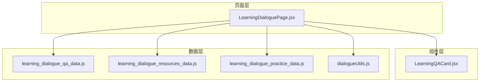
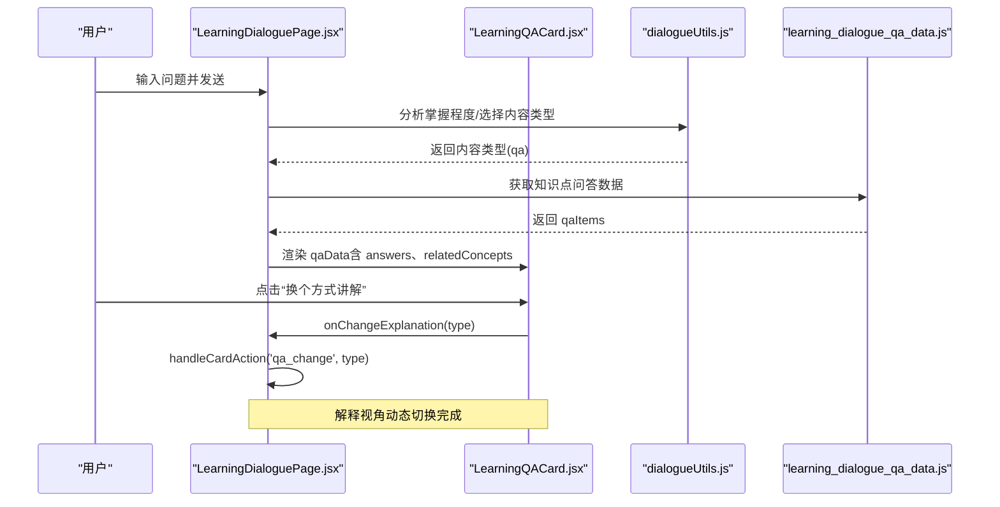
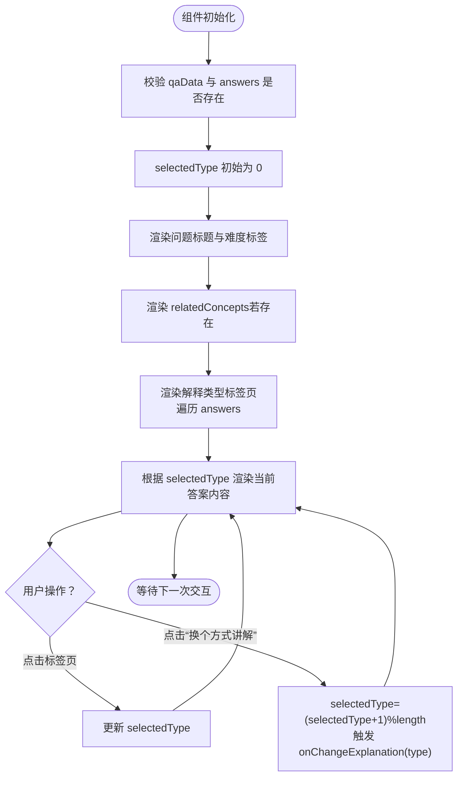
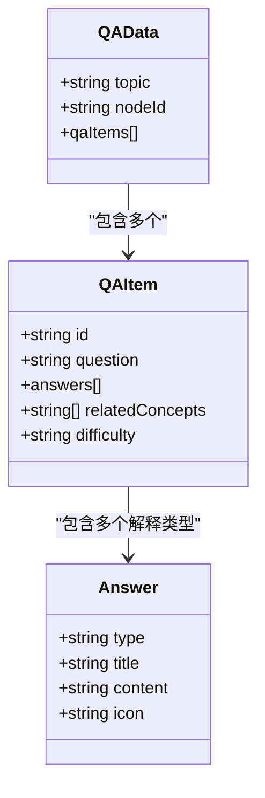
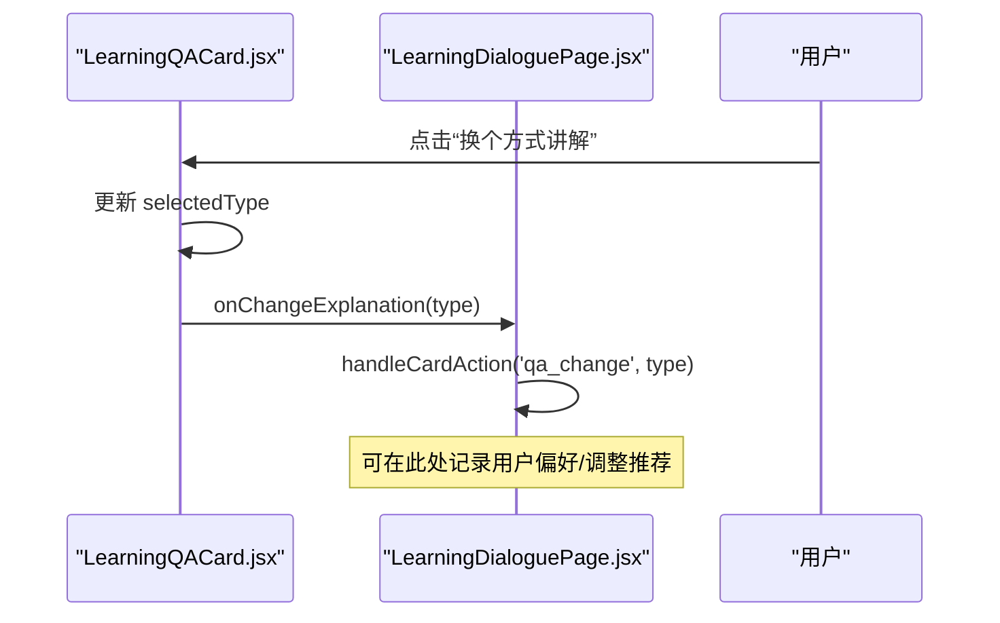
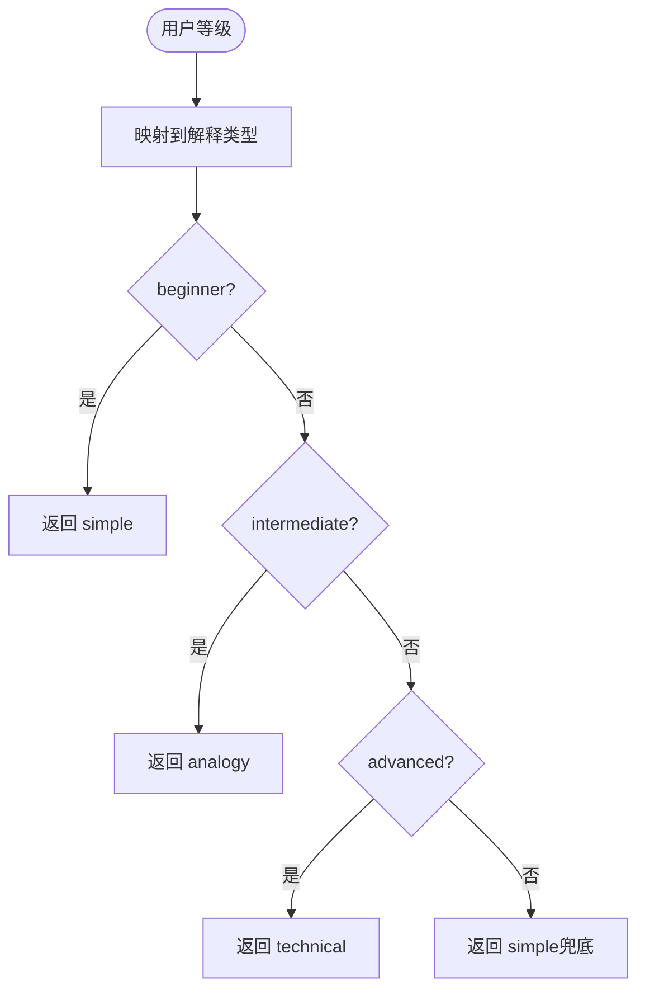
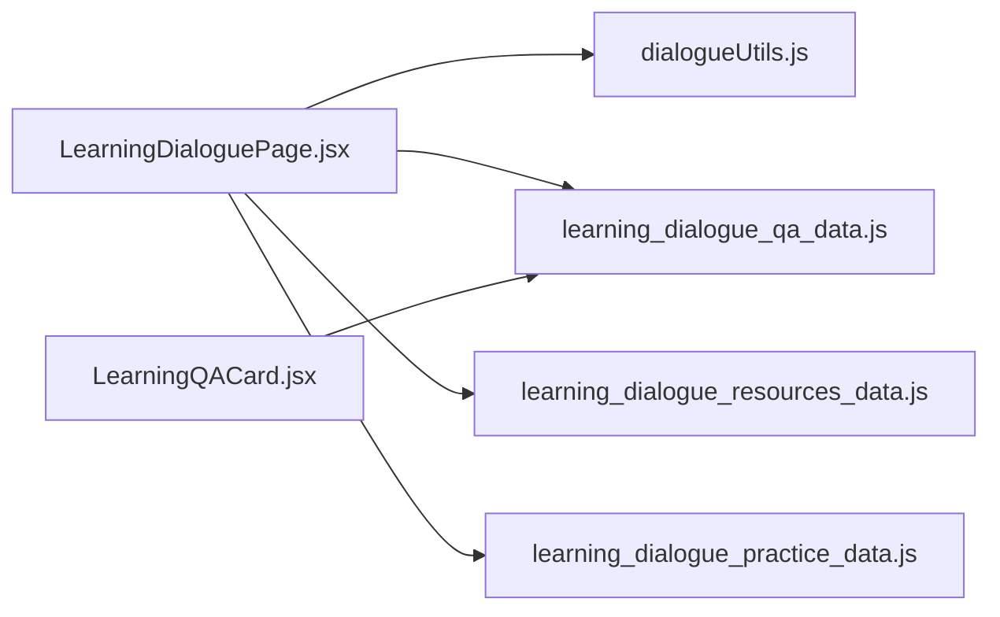

# 问答交互

<cite>
**本文引用的文件**
- [learning_dialogue_qa_data.js](file://src/data/learning_dialogue_qa_data.js)
- [LearningQACard.jsx](file://src/components/chat-widgets/LearningQACard.jsx)
- [LearningDialoguePage.jsx](file://src/pages/LearningDialoguePage.jsx)
- [dialogueUtils.js](file://src/utils/dialogueUtils.js)
- [learning_dialogue_resources_data.js](file://src/data/learning_dialogue_resources_data.js)
- [learning_dialogue_practice_data.js](file://src/data/learning_dialogue_practice_data.js)
</cite>

## 目录
1. [简介](#简介)
2. [项目结构](#项目结构)
3. [核心组件](#核心组件)
4. [架构总览](#架构总览)
5. [详细组件分析](#详细组件分析)
6. [依赖分析](#依赖分析)
7. [性能考虑](#性能考虑)
8. [故障排查指南](#故障排查指南)
9. [结论](#结论)

## 简介
本文件围绕“学习答疑”功能展开，重点解析：
- LearningQACard 组件如何渲染 learning_dialogue_qa_data.js 中的多维度解答（simple/analogy/technical 等）。
- learning_dialogue_qa_data.js 中三种解释类型的结构设计及在标签页切换中的作用。
- LearningDialoguePage.jsx 中 handleCardAction 对 'qa_change' 事件的响应，如何实现解释视角的动态切换。
- 以 wave-particle-duality（波粒二象性）为例，展示 relatedConcepts 关联概念的可视化呈现方式。
- getRecommendedAnswerType 函数如何根据用户等级推荐默认解释类型。

## 项目结构
学习答疑功能涉及数据层、页面层与组件层的协作：
- 数据层：learning_dialogue_qa_data.js 提供知识点问答与多解释类型；dialogueUtils.js 提供对话与推荐逻辑；learning_dialogue_resources_data.js、learning_dialogue_practice_data.js 提供资源与练习推荐。
- 页面层：LearningDialoguePage.jsx 负责对话流程、消息分发与事件处理。
- 组件层：LearningQACard.jsx 负责问答卡片渲染与解释类型切换。

**图表来源**
- [LearningDialoguePage.jsx](file://src/pages/LearningDialoguePage.jsx#L1-L120)
- [LearningQACard.jsx](file://src/components/chat-widgets/LearningQACard.jsx#L1-L40)
- [learning_dialogue_qa_data.js](file://src/data/learning_dialogue_qa_data.js#L1-L40)
- [learning_dialogue_resources_data.js](file://src/data/learning_dialogue_resources_data.js#L1-L40)
- [learning_dialogue_practice_data.js](file://src/data/learning_dialogue_practice_data.js#L1-L40)
- [dialogueUtils.js](file://src/utils/dialogueUtils.js#L1-L40)

**章节来源**
- [LearningDialoguePage.jsx](file://src/pages/LearningDialoguePage.jsx#L1-L120)
- [LearningQACard.jsx](file://src/components/chat-widgets/LearningQACard.jsx#L1-L40)
- [learning_dialogue_qa_data.js](file://src/data/learning_dialogue_qa_data.js#L1-L40)

## 核心组件
- LearningQACard.jsx：渲染单个问答项，支持多解释类型标签页切换与“换个方式讲解”按钮触发解释类型轮换。
- learning_dialogue_qa_data.js：定义知识点问答数据结构，包含 simple/analogy/technical 等解释类型与 relatedConcepts。
- LearningDialoguePage.jsx：负责对话消息流、事件分发与 handleCardAction 对 'qa_change' 的响应。
- dialogueUtils.js：提供对话历史、掌握程度分析、内容类型选择与推荐路径等工具函数。
- learning_dialogue_resources_data.js、learning_dialogue_practice_data.js：提供资源与练习推荐，支撑答疑后的学习闭环。

**章节来源**
- [LearningQACard.jsx](file://src/components/chat-widgets/LearningQACard.jsx#L1-L140)
- [learning_dialogue_qa_data.js](file://src/data/learning_dialogue_qa_data.js#L1-L148)
- [LearningDialoguePage.jsx](file://src/pages/LearningDialoguePage.jsx#L1-L200)
- [dialogueUtils.js](file://src/utils/dialogueUtils.js#L1-L120)
- [learning_dialogue_resources_data.js](file://src/data/learning_dialogue_resources_data.js#L1-L188)
- [learning_dialogue_practice_data.js](file://src/data/learning_dialogue_practice_data.js#L1-L200)

## 架构总览
学习答疑的端到端流程如下：
- 用户输入触发 LearningDialoguePage.jsx 的发送逻辑，按关键词与掌握程度选择内容类型（qa/resource/practice/assessment）。
- 若选择 qa，则从 learning_dialogue_qa_data.js 获取对应知识点的问答项，封装为消息类型 'qa' 发送给前端。
- LearningQACard.jsx 接收 qaData，渲染问题标题、难度标签、relatedConcepts 与多解释类型标签页。
- 用户点击“换个方式讲解”或标签页按钮，触发 onChangeExplanation 回调，携带当前解释类型。
- LearningDialoguePage.jsx 的 handleCardAction 监听 'qa_change' 事件，用于后续扩展（例如记录用户偏好、调整推荐策略）。

**图表来源**
- [LearningDialoguePage.jsx](file://src/pages/LearningDialoguePage.jsx#L289-L358)
- [LearningQACard.jsx](file://src/components/chat-widgets/LearningQACard.jsx#L115-L137)
- [dialogueUtils.js](file://src/utils/dialogueUtils.js#L300-L344)
- [learning_dialogue_qa_data.js](file://src/data/learning_dialogue_qa_data.js#L1-L120)

## 详细组件分析

### LearningQACard 组件：多解释类型渲染与标签页切换
- 状态管理：内部使用 selectedType 记录当前选中的解释类型索引。
- 渲染结构：
  - 问题标题与难度标签：来自 qaData.question 与 difficulty 字段。
  - 关联概念：当 qaData.relatedConcepts 存在时，以“相关: A, B, C”形式展示。
  - 解释类型标签页：遍历 qaData.answers，每个元素包含 type/title/content/icon。
  - 答案内容区：使用动画过渡展示当前 selectedType 对应的答案。
  - “换个方式讲解”按钮：循环切换到下一个解释类型，并通过 onChangeExplanation 回调传递当前解释类型。
- 图标映射：根据 answer.icon 选择对应图标组件，增强可读性与视觉层次。

**图表来源**
- [LearningQACard.jsx](file://src/components/chat-widgets/LearningQACard.jsx#L1-L140)

**章节来源**
- [LearningQACard.jsx](file://src/components/chat-widgets/LearningQACard.jsx#L1-L140)

### learning_dialogue_qa_data.js：解释类型结构设计与推荐函数
- 结构设计要点：
  - 每个知识点包含 topic、nodeId、qaItems 数组。
  - 每个 qaItem 包含 id、question、answers 数组、relatedConcepts、difficulty。
  - answers 数组中每项为一个解释类型对象，包含 type/title/content/icon。
  - 支持的解释类型示例：simple（简单解释）、analogy（类比解释）、technical（技术解释）、visual（可视化说明）等。
- 辅助函数：
  - getQAByTopic(topicKey)：按知识点 ID 获取问答集合。
  - getQAById(topicKey, qaId)：按问题 ID 获取具体问答。
  - getRecommendedAnswerType(userLevel)：根据用户等级返回默认解释类型映射（beginner→simple，intermediate→analogy，advanced→technical）。

**图表来源**
- [learning_dialogue_qa_data.js](file://src/data/learning_dialogue_qa_data.js#L1-L120)

**章节来源**
- [learning_dialogue_qa_data.js](file://src/data/learning_dialogue_qa_data.js#L1-L148)

### LearningDialoguePage.jsx：handleCardAction 对 'qa_change' 的响应与解释视角动态切换
- 卡片交互回调：MessageBubble 在渲染 LearningQACard 时传入 onCardAction，将卡片内部的 onChangeExplanation(type) 事件透传为 'qa_change'。
- handleCardAction：当前仅处理 'mastery_select'、'path_select' 等路径相关事件；对于 'qa_change'，可在此处扩展记录用户偏好的解释类型、调整后续推荐策略等。
- 动态切换机制：
  - 用户在 LearningQACard 中点击“换个方式讲解”，selectedType 循环切换。
  - onChangeExplanation(type) 将当前解释类型回传至父组件。
  - 父组件通过 handleCardAction('qa_change', type) 接收并可据此做进一步处理（例如统计、个性化推荐）。

**图表来源**
- [LearningDialoguePage.jsx](file://src/pages/LearningDialoguePage.jsx#L70-L90)
- [LearningDialoguePage.jsx](file://src/pages/LearningDialoguePage.jsx#L184-L214)
- [LearningQACard.jsx](file://src/components/chat-widgets/LearningQACard.jsx#L115-L137)

**章节来源**
- [LearningDialoguePage.jsx](file://src/pages/LearningDialoguePage.jsx#L70-L90)
- [LearningDialoguePage.jsx](file://src/pages/LearningDialoguePage.jsx#L184-L214)
- [LearningQACard.jsx](file://src/components/chat-widgets/LearningQACard.jsx#L115-L137)

### wave-particle-duality 示例：relatedConcepts 可视化呈现与 getRecommendedAnswerType 推荐
- relatedConcepts 可视化呈现：
  - 在 LearningQACard.jsx 中，当 qaData.relatedConcepts 存在时，会在问题标题下方以“相关: 概念A, 概念B, 概念C”的形式展示，帮助用户建立知识网络。
- getRecommendedAnswerType 推荐：
  - 根据用户等级（beginner/intermediate/advanced）返回默认解释类型：simple/analogy/technical。
  - 该函数可用于在首次进入答疑时，为用户自动选择最合适的解释起点，提升理解效率。

**图表来源**
- [learning_dialogue_qa_data.js](file://src/data/learning_dialogue_qa_data.js#L137-L146)

**章节来源**
- [LearningQACard.jsx](file://src/components/chat-widgets/LearningQACard.jsx#L60-L70)
- [learning_dialogue_qa_data.js](file://src/data/learning_dialogue_qa_data.js#L137-L146)

## 依赖分析
- 组件耦合：
  - LearningDialoguePage.jsx 依赖 dialogueUtils.js 的对话与推荐能力，以及 learning_dialogue_qa_data.js 的问答数据。
  - LearningQACard.jsx 仅依赖传入的 qaData，耦合度低，便于复用。
- 数据依赖：
  - learning_dialogue_qa_data.js 为问答数据源，LearningDialoguePage.jsx 通过 topicKey（如 'wave-particle-duality'）获取 qaItems。
  - relatedConcepts 由数据层提供，组件层仅负责展示。
- 外部依赖：
  - 使用 framer-motion 实现卡片与内容切换的动画效果。
  - 使用 lucide-react 图标库提供统一的视觉符号。

**图表来源**
- [LearningDialoguePage.jsx](file://src/pages/LearningDialoguePage.jsx#L1-L120)
- [LearningQACard.jsx](file://src/components/chat-widgets/LearningQACard.jsx#L1-L40)
- [learning_dialogue_qa_data.js](file://src/data/learning_dialogue_qa_data.js#L1-L40)
- [learning_dialogue_resources_data.js](file://src/data/learning_dialogue_resources_data.js#L1-L40)
- [learning_dialogue_practice_data.js](file://src/data/learning_dialogue_practice_data.js#L1-L40)

**章节来源**
- [LearningDialoguePage.jsx](file://src/pages/LearningDialoguePage.jsx#L1-L120)
- [LearningQACard.jsx](file://src/components/chat-widgets/LearningQACard.jsx#L1-L40)

## 性能考虑
- 渲染优化：
  - 使用动画库进行局部过渡，避免整页重绘。
  - 标签页切换通过 key 变化驱动动画，减少不必要的状态更新。
- 数据访问：
  - 问答数据按知识点 ID 一次性加载，避免频繁 IO。
  - relatedConcepts 仅在存在时渲染，减少 DOM 开销。
- 交互响应：
  - “换个方式讲解”采用循环索引切换，时间复杂度 O(1)，开销极小。

[本节为通用性能建议，不直接分析具体文件，故无章节来源]

## 故障排查指南
- 问答数据为空：
  - 确认 topicKey 是否正确，且 learning_dialogue_qa_data.js 中存在对应节点。
  - 检查 qaData.answers 是否存在，组件在空数据时会直接返回空。
- 解释类型不显示：
  - 确认 answers 数组中每项包含 type/title/content/icon。
  - 检查 icon 是否在 iconMap 中有对应映射，否则将回退为默认图标。
- relatedConcepts 未显示：
  - 确认 qaData.relatedConcepts 是否为数组且非空。
- 'qa_change' 事件未生效：
  - 确认 MessageBubble 中是否正确传入 onCardAction，并在父组件中实现 handleCardAction。
  - 检查 onChangeExplanation 回调是否被调用，以及 selectedType 是否更新。

**章节来源**
- [LearningQACard.jsx](file://src/components/chat-widgets/LearningQACard.jsx#L1-L140)
- [LearningDialoguePage.jsx](file://src/pages/LearningDialoguePage.jsx#L70-L90)
- [learning_dialogue_qa_data.js](file://src/data/learning_dialogue_qa_data.js#L1-L120)

## 结论
- LearningQACard 通过多解释类型标签页与“换个方式讲解”按钮，提供了灵活的答疑视角切换体验。
- learning_dialogue_qa_data.js 的结构设计清晰，支持 simple/analogy/technical 等解释类型与 relatedConcepts 的可视化呈现。
- LearningDialoguePage.jsx 的 handleCardAction 为 'qa_change' 事件预留了扩展空间，可用于记录用户偏好与个性化推荐。
- getRecommendedAnswerType 依据用户等级推荐默认解释类型，有助于新手快速理解，资深用户直达技术细节。