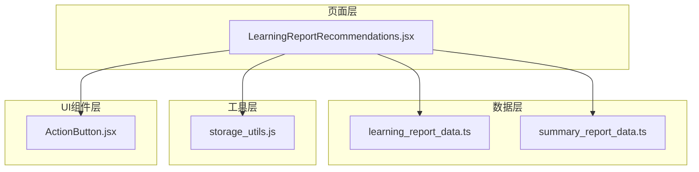
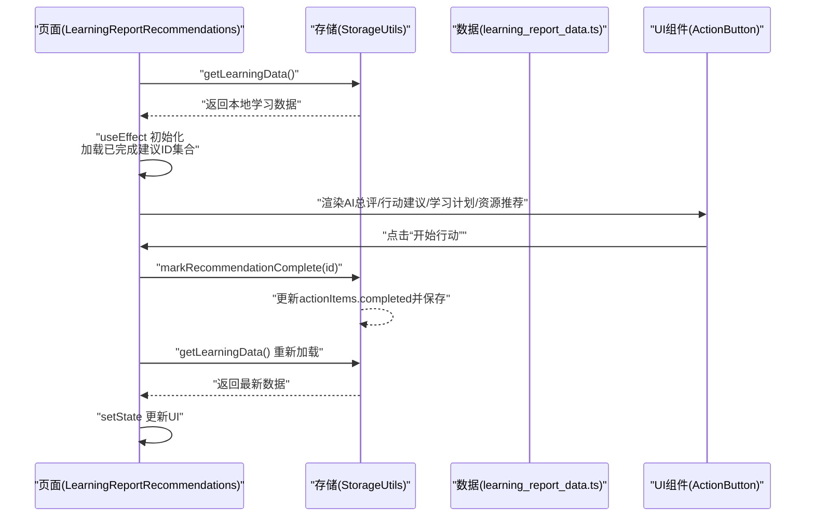
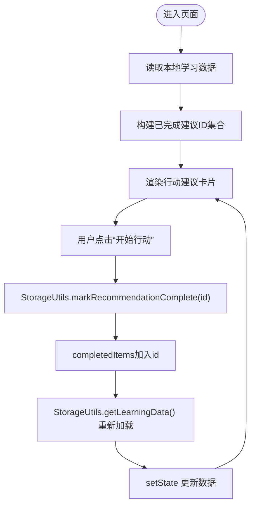
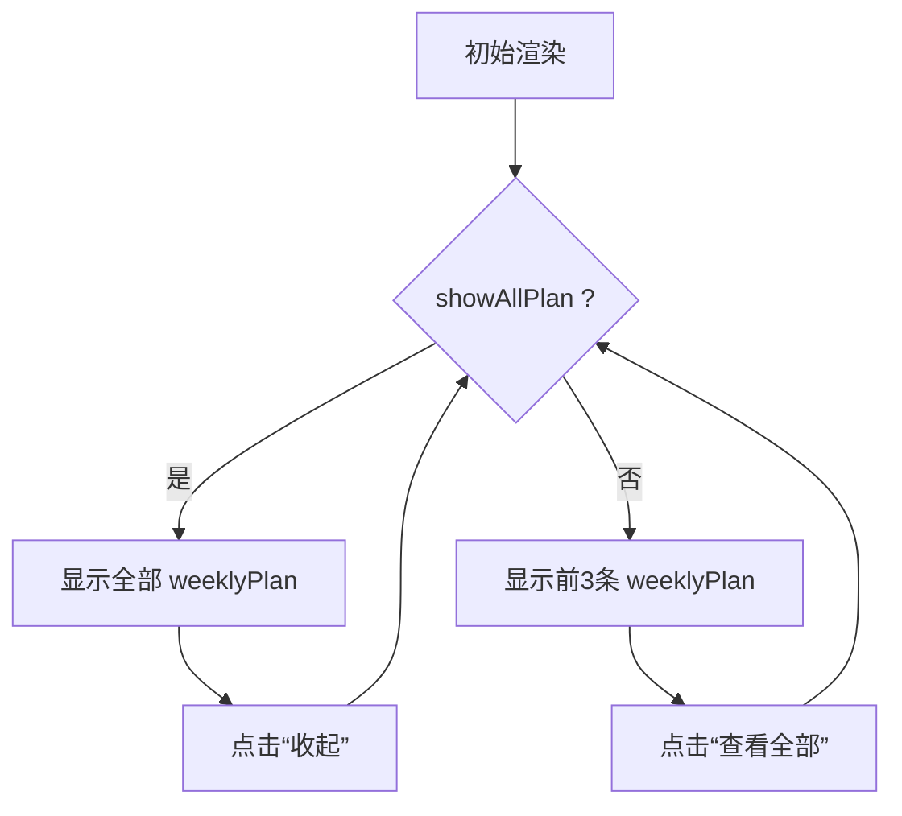
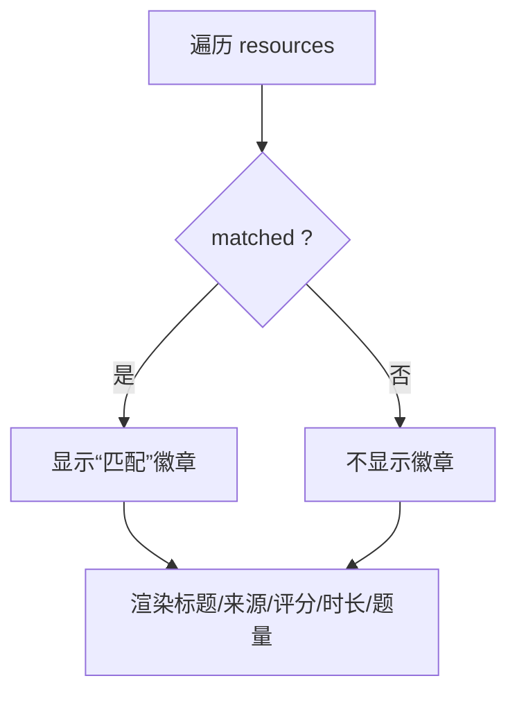
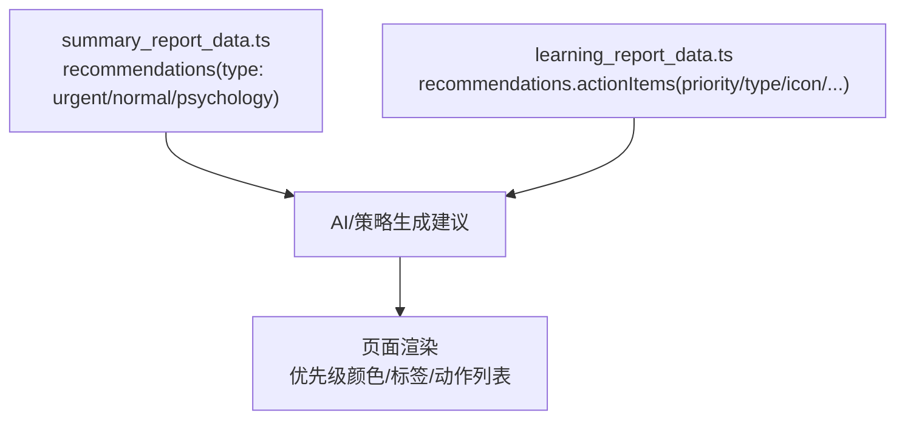
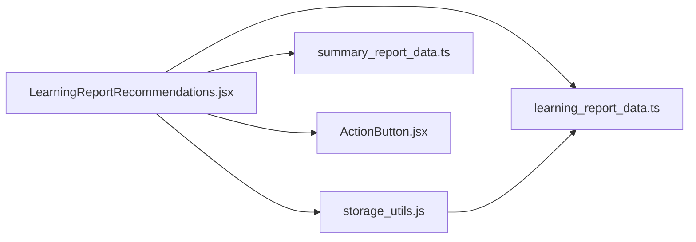

# 学习建议与计划

<cite>
**本文引用的文件**
- [LearningReportRecommendations.jsx](file://src/pages/LearningReportRecommendations.jsx)
- [storage_utils.js](file://src/utils/storage_utils.js)
- [learning_report_data.ts](file://src/data/learning_report_data.ts)
- [summary_report_data.ts](file://src/data/summary_report_data.ts)
- [ActionButton.jsx](file://src/components/uiverse/ActionButton.jsx)
</cite>

## 目录
1. [引言](#引言)
2. [项目结构](#项目结构)
3. [核心组件](#核心组件)
4. [架构总览](#架构总览)
5. [详细组件分析](#详细组件分析)
6. [依赖关系分析](#依赖关系分析)
7. [性能考量](#性能考量)
8. [故障排查指南](#故障排查指南)
9. [结论](#结论)

## 引言
本文件面向“学习建议页面”的个性化推荐系统，围绕 LearningReportRecommendations.jsx 的渲染逻辑进行深入解析，重点说明：
- 如何通过 priority 字段动态应用颜色样式（高/中/低优先级）
- handleMarkComplete 函数如何更新 localStorage 并刷新 UI 状态
- weeklyPlan 的展开/收起交互
- recommendations.resources 的资源匹配机制（matched 字段）
- 结合 summary_report_data.ts 中 recommendations 结构，阐述心理、紧急和常规三类学习建议的生成思路

## 项目结构
学习建议页面位于 pages 目录，数据来源自 data 目录的默认学习报告数据，状态持久化通过 utils 目录的存储工具类实现；UI 交互组件来自 components 目录的通用按钮组件。

图表来源
- [LearningReportRecommendations.jsx](file://src/pages/LearningReportRecommendations.jsx#L1-L292)
- [storage_utils.js](file://src/utils/storage_utils.js#L1-L120)
- [learning_report_data.ts](file://src/data/learning_report_data.ts#L210-L371)
- [summary_report_data.ts](file://src/data/summary_report_data.ts#L1-L28)
- [ActionButton.jsx](file://src/components/uiverse/ActionButton.jsx#L1-L125)

章节来源
- [LearningReportRecommendations.jsx](file://src/pages/LearningReportRecommendations.jsx#L1-L292)
- [storage_utils.js](file://src/utils/storage_utils.js#L1-L120)
- [learning_report_data.ts](file://src/data/learning_report_data.ts#L210-L371)
- [summary_report_data.ts](file://src/data/summary_report_data.ts#L1-L28)
- [ActionButton.jsx](file://src/components/uiverse/ActionButton.jsx#L1-L125)

## 核心组件
- LearningReportRecommendations 页面：负责加载本地学习数据、渲染 AI 总评、行动建议、本周学习计划、学习资源推荐，并处理完成标记与展开/收起交互。
- StorageUtils 工具类：提供 getLearningData/saveLearningData/markRecommendationComplete 等方法，统一管理 localStorage。
- learning_report_data.ts：提供完整的推荐数据结构（包含 teacherComment、actionItems、weeklyPlan、resources）。
- summary_report_data.ts：提供简化版 recommendations 数组（含 id、title、content、type），用于概览页展示。
- ActionButton 组件：提供带霓虹光效的按钮，支持 variant、completed、disabled 等属性，配合页面完成标记逻辑。

章节来源
- [LearningReportRecommendations.jsx](file://src/pages/LearningReportRecommendations.jsx#L1-L292)
- [storage_utils.js](file://src/utils/storage_utils.js#L90-L101)
- [learning_report_data.ts](file://src/data/learning_report_data.ts#L210-L371)
- [summary_report_data.ts](file://src/data/summary_report_data.ts#L1-L28)
- [ActionButton.jsx](file://src/components/uiverse/ActionButton.jsx#L1-L125)

## 架构总览
学习建议页面的数据流与交互流程如下：

图表来源
- [LearningReportRecommendations.jsx](file://src/pages/LearningReportRecommendations.jsx#L18-L38)
- [storage_utils.js](file://src/utils/storage_utils.js#L90-L101)
- [ActionButton.jsx](file://src/components/uiverse/ActionButton.jsx#L1-L125)

## 详细组件分析

### 动态优先级样式与完成态处理
- 优先级样式映射
  - getPriorityColor：根据 priority 返回渐变色背景类名（高/中/低）
  - getPriorityBg：根据 priority 返回边框/背景色类名（高/中/低）
- 完成态处理
  - 页面在 useEffect 中读取本地数据，筛选已完成的建议项，构建 completedItems Set
  - handleMarkComplete(itemId)：调用 StorageUtils.markRecommendationComplete 标记完成，同时将该 id 加入 completedItems；随后重新拉取数据并 setState 刷新 UI
  - UI 层根据 completedItems.has(item.id) 切换完成态样式与按钮文案

图表来源
- [LearningReportRecommendations.jsx](file://src/pages/LearningReportRecommendations.jsx#L18-L38)
- [storage_utils.js](file://src/utils/storage_utils.js#L90-L101)

章节来源
- [LearningReportRecommendations.jsx](file://src/pages/LearningReportRecommendations.jsx#L31-L38)
- [storage_utils.js](file://src/utils/storage_utils.js#L90-L101)

### weeklyPlan 展开/收起交互
- 状态：showAllPlan 控制是否显示全部计划
- 交互：点击“查看全部/收起”按钮切换 showAllPlan
- 渲染：当 showAllPlan 为真时显示全部 weeklyPlan，否则仅显示前 3 条；卡片首行使用强调色背景突出今日任务

图表来源
- [LearningReportRecommendations.jsx](file://src/pages/LearningReportRecommendations.jsx#L174-L238)

章节来源
- [LearningReportRecommendations.jsx](file://src/pages/LearningReportRecommendations.jsx#L174-L238)

### recommendations.resources 的资源匹配机制
- 数据结构：resources 数组每项包含 id、type、title、source、duration/readTime/questionCount、rating、matched 等字段
- 匹配标识：matched 为 true 时，在卡片右上角显示“匹配”标签，提示该资源与当前薄弱点或学习目标高度契合
- UI 渲染：matched 为真时展示“匹配”徽章，其余字段用于展示资源基本信息与时长/题量

图表来源
- [LearningReportRecommendations.jsx](file://src/pages/LearningReportRecommendations.jsx#L240-L286)
- [learning_report_data.ts](file://src/data/learning_report_data.ts#L335-L367)

章节来源
- [LearningReportRecommendations.jsx](file://src/pages/LearningReportRecommendations.jsx#L240-L286)
- [learning_report_data.ts](file://src/data/learning_report_data.ts#L335-L367)

### 心理、紧急与常规三类建议的生成思路
- 数据来源与字段
  - learning_report_data.ts 提供 recommendations.actionItems，其中包含 priority、type、icon、title、description、actions、estimatedTime、expectedImprovement 等字段
  - summary_report_data.ts 提供 recommendations 数组，包含 id、title、content、type（urgent/normal/psychology）
- 生成思路
  - 紧急（urgent）：通常对应高优先级且直接影响学习效率或薄弱环节（如计算准确性、关键知识点）
  - 常规（normal）：日常巩固与提升，如解题速度、知识体系完善
  - 心理（psychology）：关注学习动机、习惯与心态，如保持节奏、鼓励坚持
- 页面渲染
  - LearningReportRecommendations.jsx 通过 priority 字段映射颜色与标签，type 字段用于图标与动作建议分类，title/description/actions 等用于呈现具体建议内容

图表来源
- [summary_report_data.ts](file://src/data/summary_report_data.ts#L1-L28)
- [learning_report_data.ts](file://src/data/learning_report_data.ts#L222-L284)
- [LearningReportRecommendations.jsx](file://src/pages/LearningReportRecommendations.jsx#L98-L172)

章节来源
- [summary_report_data.ts](file://src/data/summary_report_data.ts#L1-L28)
- [learning_report_data.ts](file://src/data/learning_report_data.ts#L222-L284)
- [LearningReportRecommendations.jsx](file://src/pages/LearningReportRecommendations.jsx#L98-L172)

### AI导师评论、行动建议、学习计划与资源推荐的渲染要点
- AI导师评论
  - 展示头像、姓名、情感倾向（积极/需要加油）、鼓励语
  - 根据情感倾向设置标签颜色与文案
- 行动建议
  - 每条建议包含优先级、图标、标题、描述、预期提升、预估时长、动作清单
  - 完成态下卡片透明度降低、按钮文案改为“已完成”
- 本周学习计划
  - 每日任务包含类型（视频/练习/测试/阅读/演练）、内容、时长
  - focus 字段标注当日学习重点
- 学习资源推荐
  - 按类型区分图标与背景色
  - matched 为真时显示“匹配”徽章

章节来源
- [LearningReportRecommendations.jsx](file://src/pages/LearningReportRecommendations.jsx#L65-L286)
- [learning_report_data.ts](file://src/data/learning_report_data.ts#L212-L367)

## 依赖关系分析
- 页面依赖
  - 本地数据：通过 StorageUtils.getLearningData() 读取本地学习报告数据
  - 默认数据：若本地无数据，则使用 LEARNING_REPORT_DATA 作为默认值
  - UI 组件：ActionButton 提供完成态按钮
- 数据结构
  - learning_report_data.ts 提供完整的 recommendations 结构
  - summary_report_data.ts 提供概览页使用的 recommendations 数组
- 交互链路
  - 用户点击“开始行动” -> StorageUtils.markRecommendationComplete -> localStorage 更新 -> 页面重新加载数据 -> UI 刷新

图表来源
- [LearningReportRecommendations.jsx](file://src/pages/LearningReportRecommendations.jsx#L1-L292)
- [storage_utils.js](file://src/utils/storage_utils.js#L1-L120)
- [learning_report_data.ts](file://src/data/learning_report_data.ts#L210-L371)
- [summary_report_data.ts](file://src/data/summary_report_data.ts#L1-L28)
- [ActionButton.jsx](file://src/components/uiverse/ActionButton.jsx#L1-L125)

章节来源
- [LearningReportRecommendations.jsx](file://src/pages/LearningReportRecommendations.jsx#L1-L292)
- [storage_utils.js](file://src/utils/storage_utils.js#L1-L120)
- [learning_report_data.ts](file://src/data/learning_report_data.ts#L210-L371)
- [summary_report_data.ts](file://src/data/summary_report_data.ts#L1-L28)
- [ActionButton.jsx](file://src/components/uiverse/ActionButton.jsx#L1-L125)

## 性能考量
- 本地数据读写：通过 localStorage 存取，避免网络请求，渲染与交互响应迅速
- 状态最小化：completedItems 使用 Set，查找与更新均摊 O(1)，适合频繁交互
- 渲染优化：使用 framer-motion 的入场动画，延迟逐条出现，提升视觉体验但注意在大量数据时可能带来轻微开销
- 建议
  - 若 actionItems 数量较多，可考虑虚拟滚动或分页
  - 对于 weeklyPlan 的展开/收起，当前 slice 方案简单直观，无需额外优化

## 故障排查指南
- 无法加载数据
  - 检查 localStorage 中是否存在学习报告数据键值
  - 若不存在，确认默认数据是否被正确写入
- 完成标记无效
  - 确认 StorageUtils.markRecommendationComplete 是否被调用
  - 检查 actionItems 中是否存在对应 id 的项
  - 确认 getLearningData() 重新加载后数据已更新
- UI 不刷新
  - 确认 handleMarkComplete 后是否执行了 setData
  - 检查 completedItems 的 Set 是否包含该 id
- 资源未显示“匹配”
  - 确认 resources 中对应项的 matched 字段为真
  - 检查卡片渲染条件是否生效

章节来源
- [LearningReportRecommendations.jsx](file://src/pages/LearningReportRecommendations.jsx#L18-L38)
- [storage_utils.js](file://src/utils/storage_utils.js#L90-L101)

## 结论
学习建议页面通过 localStorage 持久化与统一工具类管理，实现了“AI导师评论—行动建议—本周计划—资源推荐”的一体化展示。页面以 priority 字段驱动视觉优先级，以 matched 字段体现资源适配度，并通过完成标记闭环实现行为追踪与状态刷新。结合 summary_report_data.ts 的 recommendations 结构，可将建议分为心理、紧急与常规三类，满足不同学习阶段的需求。