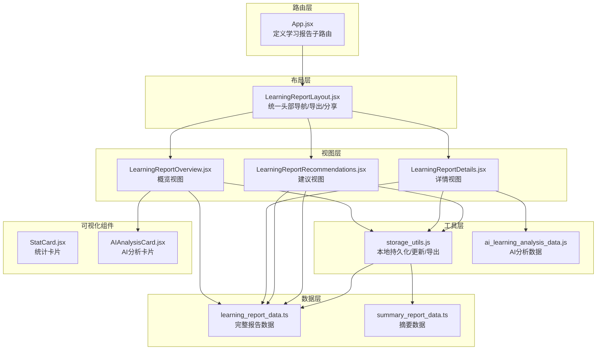
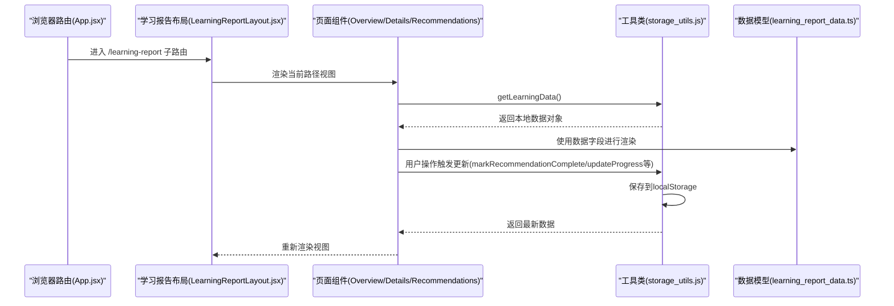
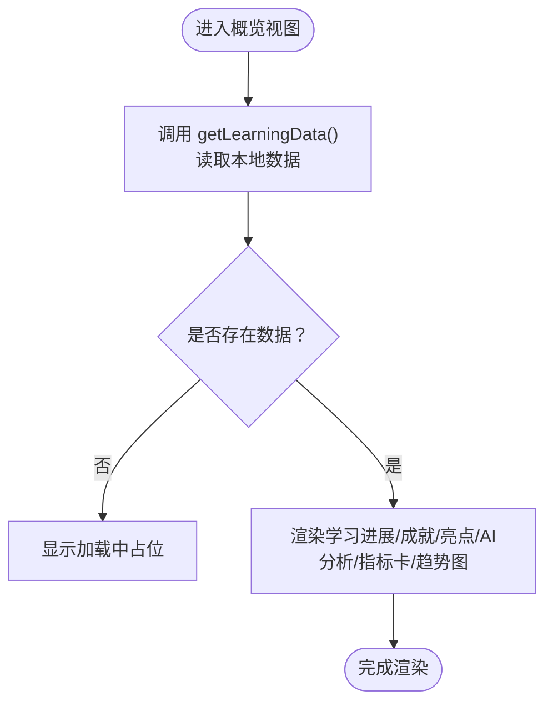
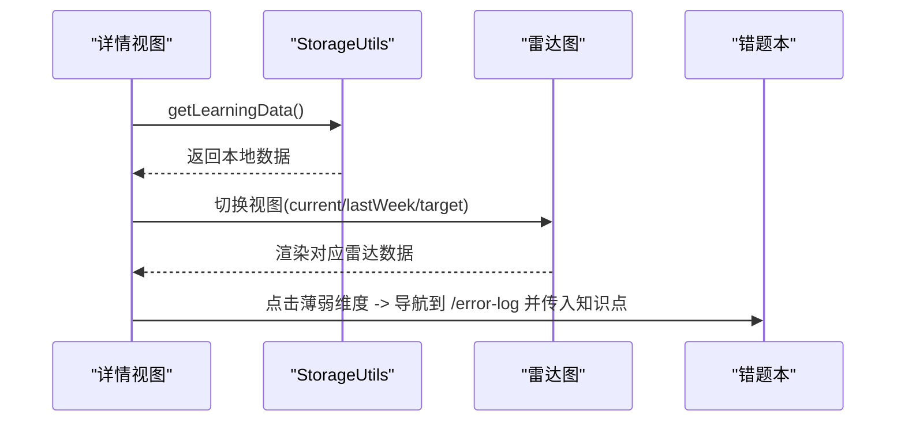
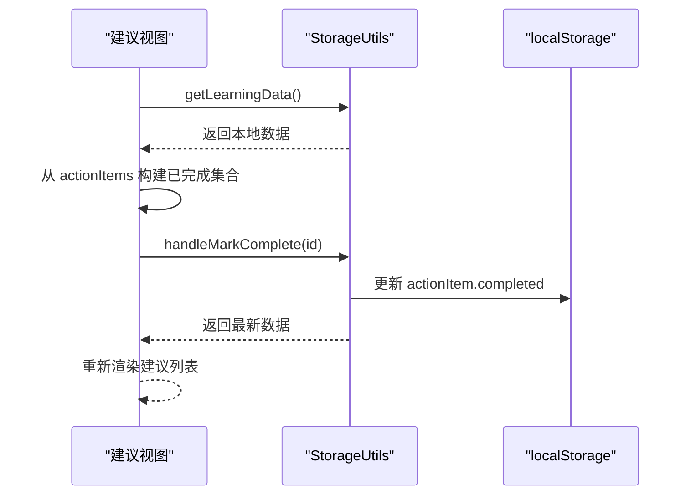
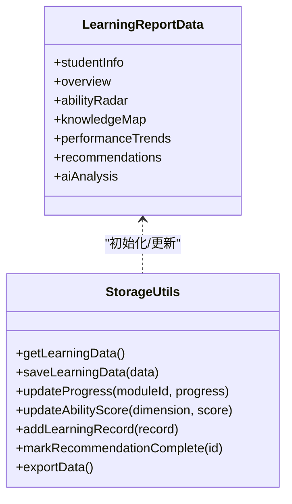
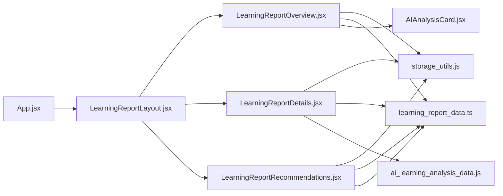

# 学习报告

<cite>
**本文引用的文件**
- [App.jsx](file://src/App.jsx)
- [LearningReportLayout.jsx](file://src/components/LearningReportLayout.jsx)
- [LearningReportOverview.jsx](file://src/pages/LearningReportOverview.jsx)
- [LearningReportDetails.jsx](file://src/pages/LearningReportDetails.jsx)
- [LearningReportRecommendations.jsx](file://src/pages/LearningReportRecommendations.jsx)
- [learning_report_data.ts](file://src/data/learning_report_data.ts)
- [summary_report_data.ts](file://src/data/summary_report_data.ts)
- [storage_utils.js](file://src/utils/storage_utils.js)
- [StatCard.jsx](file://src/components/uiverse/StatCard.jsx)
- [AIAnalysisCard.jsx](file://src/components/uiverse/AIAnalysisCard.jsx)
- [ai_learning_analysis_data.js](file://src/data/ai_learning_analysis_data.js)
</cite>

## 目录
1. [简介](#简介)
2. [项目结构](#项目结构)
3. [核心组件](#核心组件)
4. [架构总览](#架构总览)
5. [详细组件分析](#详细组件分析)
6. [依赖关系分析](#依赖关系分析)
7. [性能考量](#性能考量)
8. [故障排查指南](#故障排查指南)
9. [结论](#结论)
10. [附录](#附录)

## 简介
本文件系统化构建“学习报告”文档体系，覆盖概览、详情与建议三大视图。围绕以下目标展开：
- 基于 LearningReportOverview.jsx 分析报告首页的数据聚合与可视化展示逻辑
- 结合 learning_report_data.ts 的报告模型说明数据来源
- 阐述 LearningReportDetails.jsx 如何呈现细粒度分析
- 解释 LearningReportRecommendations.jsx 如何基于本地存储数据生成个性化建议
- 提供报告生成流程的端到端示例，包含数据加载、状态管理与用户交互
- 指导如何排查数据不一致或渲染异常问题

## 项目结构
学习报告系统采用“布局 + 页面 + 数据 + 工具”的分层组织：
- 路由层：App.jsx 定义学习报告子路由与导航
- 布局层：LearningReportLayout.jsx 提供统一头部导航与导出/分享入口
- 视图层：LearningReportOverview.jsx、LearningReportDetails.jsx、LearningReportRecommendations.jsx 分别对应三大视图
- 数据层：learning_report_data.ts 提供完整报告数据；summary_report_data.ts 提供摘要数据（用于其他报告页）
- 工具层：storage_utils.js 管理本地持久化、数据更新与导出
- 可视化组件：StatCard.jsx、AIAnalysisCard.jsx 提供卡片化展示

**图表来源**
- [App.jsx](file://src/App.jsx#L77-L83)
- [LearningReportLayout.jsx](file://src/components/LearningReportLayout.jsx#L18-L31)
- [LearningReportOverview.jsx](file://src/pages/LearningReportOverview.jsx#L1-L40)
- [LearningReportDetails.jsx](file://src/pages/LearningReportDetails.jsx#L1-L40)
- [LearningReportRecommendations.jsx](file://src/pages/LearningReportRecommendations.jsx#L1-L40)
- [learning_report_data.ts](file://src/data/learning_report_data.ts#L1-L40)
- [summary_report_data.ts](file://src/data/summary_report_data.ts#L1-L28)
- [storage_utils.js](file://src/utils/storage_utils.js#L1-L40)
- [ai_learning_analysis_data.js](file://src/data/ai_learning_analysis_data.js#L1-L40)

**章节来源**
- [App.jsx](file://src/App.jsx#L77-L83)
- [LearningReportLayout.jsx](file://src/components/LearningReportLayout.jsx#L18-L31)

## 核心组件
- 学习报告布局：统一头部、导航标签、导出/分享入口，负责承载三个视图并提供全局操作。
- 概览视图：加载本地数据，展示学习进展、成就徽章、关键指标卡片、学习趋势图表与AI学情分析卡片。
- 详情视图：展示能力雷达图（本周/上周/目标三态切换）、AI能力维度分析、知识点掌握情况、知识地图与每周表现对比。
- 建议视图：展示AI导师的个性化建议、行动建议（含优先级与完成状态）、本周学习计划与资源推荐。
- 数据模型：learning_report_data.ts 定义完整报告数据结构；summary_report_data.ts 提供摘要数据。
- 工具类：storage_utils.js 提供数据读取、写入、进度更新、建议完成标记、学习记录添加、导出导入等能力。
- 可视化组件：StatCard.jsx 提供带数字动画的统计卡片；AIAnalysisCard.jsx 提供AI学情分析卡片。

**章节来源**
- [LearningReportLayout.jsx](file://src/components/LearningReportLayout.jsx#L18-L31)
- [LearningReportOverview.jsx](file://src/pages/LearningReportOverview.jsx#L1-L40)
- [LearningReportDetails.jsx](file://src/pages/LearningReportDetails.jsx#L1-L40)
- [LearningReportRecommendations.jsx](file://src/pages/LearningReportRecommendations.jsx#L1-L40)
- [learning_report_data.ts](file://src/data/learning_report_data.ts#L1-L40)
- [summary_report_data.ts](file://src/data/summary_report_data.ts#L1-L28)
- [storage_utils.js](file://src/utils/storage_utils.js#L1-L40)
- [StatCard.jsx](file://src/components/uiverse/StatCard.jsx#L1-L40)
- [AIAnalysisCard.jsx](file://src/components/uiverse/AIAnalysisCard.jsx#L1-L40)

## 架构总览
学习报告系统遵循“数据驱动 + 组件化 + 可视化”的设计模式：
- 数据来源：首次访问时通过 StorageUtils 初始化本地数据；后续读取与更新均来自 localStorage。
- 视图渲染：各页面组件在挂载时读取本地数据，解构出 overview、abilityRadar、knowledgeMap、performanceTrends、recommendations 等字段进行渲染。
- 用户交互：支持切换雷达图视图、标记建议完成、展开/收起AI分析卡片、导出报告等。
- 端到端流程：路由 -> 布局 -> 页面 -> 工具类 -> 数据模型 -> 可视化组件。

**图表来源**
- [App.jsx](file://src/App.jsx#L77-L83)
- [LearningReportLayout.jsx](file://src/components/LearningReportLayout.jsx#L18-L31)
- [LearningReportOverview.jsx](file://src/pages/LearningReportOverview.jsx#L1-L40)
- [LearningReportDetails.jsx](file://src/pages/LearningReportDetails.jsx#L1-L40)
- [LearningReportRecommendations.jsx](file://src/pages/LearningReportRecommendations.jsx#L1-L40)
- [storage_utils.js](file://src/utils/storage_utils.js#L12-L41)
- [learning_report_data.ts](file://src/data/learning_report_data.ts#L1-L40)

## 详细组件分析

### 概览视图（LearningReportOverview.jsx）
- 数据加载与状态管理
  - 组件挂载时调用 StorageUtils.getLearningData() 从 localStorage 读取完整报告数据，设置为组件状态。
  - 若无数据，显示“加载中…”占位。
- 内容结构
  - 学习进展区：展示总天数、连续打卡、整体掌握度进度条与班级排名变化。
  - 成就徽章：展示已解锁与未解锁徽章，未解锁徽章显示进度条。
  - 本周亮点：展示本周关键突破、练习与时间增长等亮点。
  - AI学情分析：使用 AIAnalysisCard.jsx 展示综合评分、学习状态、关键发现与建议。
  - 关键指标卡片：使用 StatCard.jsx 展示平均正确率、总学习时长、完成题目数、连续打卡天数等，带数字动画与趋势指示。
  - 学习趋势图表：使用 Recharts AreaChart 展示近30天正确率趋势。
- 交互与视觉
  - 使用 Framer Motion 实现入场动画与元素延时出现。
  - 使用 Lucide React 图标增强可读性。

**图表来源**
- [LearningReportOverview.jsx](file://src/pages/LearningReportOverview.jsx#L1-L40)
- [LearningReportOverview.jsx](file://src/pages/LearningReportOverview.jsx#L150-L200)
- [StatCard.jsx](file://src/components/uiverse/StatCard.jsx#L1-L40)
- [AIAnalysisCard.jsx](file://src/components/uiverse/AIAnalysisCard.jsx#L1-L40)
- [storage_utils.js](file://src/utils/storage_utils.js#L12-L41)

**章节来源**
- [LearningReportOverview.jsx](file://src/pages/LearningReportOverview.jsx#L1-L40)
- [LearningReportOverview.jsx](file://src/pages/LearningReportOverview.jsx#L150-L200)
- [StatCard.jsx](file://src/components/uiverse/StatCard.jsx#L1-L40)
- [AIAnalysisCard.jsx](file://src/components/uiverse/AIAnalysisCard.jsx#L1-L40)
- [storage_utils.js](file://src/utils/storage_utils.js#L12-L41)

### 详情视图（LearningReportDetails.jsx）
- 数据加载与状态管理
  - 组件挂载时调用 StorageUtils.getLearningData() 读取本地数据。
  - 使用 useState 维护雷达图视图状态（current/lastWeek/target），根据状态动态选择雷达数据源。
- 内容结构
  - 能力雷达图：支持三种视图切换，展示六个能力维度的雷达图；薄弱维度可点击跳转到错题本并筛选对应知识点。
  - AI能力维度分析：展示每个维度的得分、趋势、优势与改进建议。
  - 知识点深度分析：展示已掌握、需要加强的知识点列表与分析。
  - 知识地图：展示模块状态、进度与子主题掌握度；提供AI推荐下一步学习内容。
  - 每周表现对比：使用 Recharts BarChart 展示每周得分对比。
- 交互与导航
  - 点击薄弱维度按钮跳转至错题本，并携带知识点筛选参数。
  - 使用自定义滚动条样式优化长列表阅读体验。

**图表来源**
- [LearningReportDetails.jsx](file://src/pages/LearningReportDetails.jsx#L1-L40)
- [LearningReportDetails.jsx](file://src/pages/LearningReportDetails.jsx#L42-L75)
- [LearningReportDetails.jsx](file://src/pages/LearningReportDetails.jsx#L195-L255)
- [storage_utils.js](file://src/utils/storage_utils.js#L12-L41)

**章节来源**
- [LearningReportDetails.jsx](file://src/pages/LearningReportDetails.jsx#L1-L40)
- [LearningReportDetails.jsx](file://src/pages/LearningReportDetails.jsx#L42-L75)
- [LearningReportDetails.jsx](file://src/pages/LearningReportDetails.jsx#L195-L255)
- [storage_utils.js](file://src/utils/storage_utils.js#L12-L41)

### 建议视图（LearningReportRecommendations.jsx）
- 数据加载与状态管理
  - 组件挂载时调用 StorageUtils.getLearningData() 读取本地数据。
  - 从 actionItems 中提取已完成的建议项，使用 Set 记录已完成 id，实现“已完成”状态记忆。
- 内容结构
  - AI导师总评：展示教师评论、情感标签与鼓励语。
  - 行动建议：按优先级（高/中/低）展示建议标题、描述、预期提升与耗时；支持标记完成。
  - 本周学习计划：支持展开/收起，展示每日任务与关注点。
  - 学习资源推荐：展示匹配度高的视频/练习/文章等资源。
- 交互与状态
  - 点击“开始行动”触发 StorageUtils.markRecommendationComplete() 标记完成，并重新加载数据刷新界面。
  - 优先级颜色与背景随优先级动态变化。

**图表来源**
- [LearningReportRecommendations.jsx](file://src/pages/LearningReportRecommendations.jsx#L1-L40)
- [LearningReportRecommendations.jsx](file://src/pages/LearningReportRecommendations.jsx#L98-L172)
- [storage_utils.js](file://src/utils/storage_utils.js#L93-L101)

**章节来源**
- [LearningReportRecommendations.jsx](file://src/pages/LearningReportRecommendations.jsx#L1-L40)
- [LearningReportRecommendations.jsx](file://src/pages/LearningReportRecommendations.jsx#L98-L172)
- [storage_utils.js](file://src/utils/storage_utils.js#L93-L101)

### 数据模型与来源（learning_report_data.ts）
- 数据结构要点
  - studentInfo：学生基础信息（姓名、头像、年级、学科、当前主题）
  - overview：学习概览（整体进度、总天数、连续打卡、本周亮点、成就徽章、排名）
  - abilityRadar：能力雷达（current/lastWeek/target 三态，薄弱维度）
  - knowledgeMap：知识地图（模块列表、进度、子主题、下一推荐）
  - performanceTrends：学习趋势（daily/keyMetrics/weeklyComparison）
  - recommendations：个性化建议（教师评论、行动建议、本周计划、资源推荐）
  - aiAnalysis：AI学情分析（综合评估、学习状态、关键发现、建议、预测、对比、鼓励语）
- 数据来源
  - 首次访问时由 StorageUtils.getLearningData() 初始化为 LEARNING_REPORT_DATA
  - 后续通过 StorageUtils.updateProgress、updateAbilityScore、addLearningRecord、markRecommendationComplete 等方法更新

**图表来源**
- [learning_report_data.ts](file://src/data/learning_report_data.ts#L1-L40)
- [learning_report_data.ts](file://src/data/learning_report_data.ts#L211-L367)
- [storage_utils.js](file://src/utils/storage_utils.js#L12-L41)
- [storage_utils.js](file://src/utils/storage_utils.js#L47-L60)
- [storage_utils.js](file://src/utils/storage_utils.js#L81-L88)
- [storage_utils.js](file://src/utils/storage_utils.js#L105-L123)
- [storage_utils.js](file://src/utils/storage_utils.js#L93-L101)

**章节来源**
- [learning_report_data.ts](file://src/data/learning_report_data.ts#L1-L40)
- [learning_report_data.ts](file://src/data/learning_report_data.ts#L211-L367)
- [storage_utils.js](file://src/utils/storage_utils.js#L12-L41)
- [storage_utils.js](file://src/utils/storage_utils.js#L47-L60)
- [storage_utils.js](file://src/utils/storage_utils.js#L81-L88)
- [storage_utils.js](file://src/utils/storage_utils.js#L105-L123)
- [storage_utils.js](file://src/utils/storage_utils.js#L93-L101)

### AI分析数据（ai_learning_analysis_data.js）
- comprehensiveAnalysis：综合学情分析（整体评估、学习状态、关键发现、建议、预测、对比、鼓励语）
- dimensionAnalysis：能力维度与知识点深度分析（abilities、knowledgePoints.mastered/learning/weak/locked）

**章节来源**
- [ai_learning_analysis_data.js](file://src/data/ai_learning_analysis_data.js#L1-L40)
- [ai_learning_analysis_data.js](file://src/data/ai_learning_analysis_data.js#L223-L310)

## 依赖关系分析
- 路由与布局
  - App.jsx 定义 /learning-report 子路由，嵌套 LearningReportLayout.jsx，内部包含 overview/details/recommendations 三个子路由。
- 页面与工具
  - 三个页面均依赖 StorageUtils.getLearningData() 读取数据；建议视图还依赖 StorageUtils.markRecommendationComplete() 标记完成。
- 页面与数据模型
  - 三个页面直接消费 learning_report_data.ts 中的字段；AI分析卡片使用 ai_learning_analysis_data.js 的数据。
- 页面与可视化组件
  - 概览视图使用 StatCard.jsx 与 AIAnalysisCard.jsx；详情视图使用 Recharts 组件；建议视图使用 ActionButton（组件库）。

**图表来源**
- [App.jsx](file://src/App.jsx#L77-L83)
- [LearningReportLayout.jsx](file://src/components/LearningReportLayout.jsx#L18-L31)
- [LearningReportOverview.jsx](file://src/pages/LearningReportOverview.jsx#L1-L40)
- [LearningReportDetails.jsx](file://src/pages/LearningReportDetails.jsx#L1-L40)
- [LearningReportRecommendations.jsx](file://src/pages/LearningReportRecommendations.jsx#L1-L40)
- [storage_utils.js](file://src/utils/storage_utils.js#L12-L41)
- [learning_report_data.ts](file://src/data/learning_report_data.ts#L1-L40)
- [ai_learning_analysis_data.js](file://src/data/ai_learning_analysis_data.js#L1-L40)

**章节来源**
- [App.jsx](file://src/App.jsx#L77-L83)
- [LearningReportLayout.jsx](file://src/components/LearningReportLayout.jsx#L18-L31)
- [LearningReportOverview.jsx](file://src/pages/LearningReportOverview.jsx#L1-L40)
- [LearningReportDetails.jsx](file://src/pages/LearningReportDetails.jsx#L1-L40)
- [LearningReportRecommendations.jsx](file://src/pages/LearningReportRecommendations.jsx#L1-L40)
- [storage_utils.js](file://src/utils/storage_utils.js#L12-L41)
- [learning_report_data.ts](file://src/data/learning_report_data.ts#L1-L40)
- [ai_learning_analysis_data.js](file://src/data/ai_learning_analysis_data.js#L1-L40)

## 性能考量
- 数据加载
  - 首次访问通过一次性初始化完整数据，避免多次请求；后续读取与更新均在内存中进行，减少网络开销。
- 渲染优化
  - 使用 Framer Motion 控制入场动画，合理设置延迟与过渡，避免大量元素同时渲染造成卡顿。
  - Recharts 图表在容器尺寸变化时使用 ResponsiveContainer，确保响应式渲染。
- 交互反馈
  - StatCard.jsx 的数值动画采用帧循环方式，避免大数值直接渲染导致的抖动。
- 存储与导出
  - 导出为 JSON 文件，便于离线分析与备份；导入时进行 JSON 解析与校验，失败时回退到默认数据。

[本节为通用性能建议，无需具体文件引用]

## 故障排查指南
- 数据为空或未渲染
  - 确认 localStorage 中是否存在学习报告数据键；若不存在，StorageUtils.getLearningData() 会初始化默认数据。
  - 检查页面是否在 useEffect 中正确调用 getLearningData() 并设置状态。
- 数据不一致
  - 建议视图标记完成后，需重新加载数据以刷新 UI；确认 handleMarkComplete() 是否调用了 StorageUtils.markRecommendationComplete() 并重新读取数据。
  - 知识地图进度更新需调用 StorageUtils.updateProgress()，并确保模块状态与进度联动更新。
- 渲染异常
  - Recharts 图表需保证数据字段命名与图表配置一致（如日期、正确率等）。
  - StatCard.jsx 的数值动画依赖字符串/数字格式，若传入非数值将直接显示原始值。
- 错题同步
  - 错题本数据变更后，可通过 StorageUtils.syncErrorsToReport() 同步到学习报告，更新薄弱维度与能力分数；确认该方法被调用且数据存在。

**章节来源**
- [storage_utils.js](file://src/utils/storage_utils.js#L12-L41)
- [storage_utils.js](file://src/utils/storage_utils.js#L93-L101)
- [storage_utils.js](file://src/utils/storage_utils.js#L47-L60)
- [storage_utils.js](file://src/utils/storage_utils.js#L384-L427)
- [LearningReportRecommendations.jsx](file://src/pages/LearningReportRecommendations.jsx#L31-L46)
- [LearningReportDetails.jsx](file://src/pages/LearningReportDetails.jsx#L25-L38)

## 结论
学习报告系统通过清晰的分层设计与本地数据驱动，实现了从概览到详情再到建议的完整闭环。概览视图强调宏观趋势与关键指标，详情视图聚焦能力雷达与知识点掌握，建议视图提供可执行的个性化行动方案。配合工具类的持久化与同步机制，系统具备良好的扩展性与可维护性。

[本节为总结性内容，无需具体文件引用]

## 附录

### 端到端示例：从路由到渲染
- 路由进入：/learning-report -> /learning-report/overview
- 布局渲染：LearningReportLayout.jsx 渲染头部与导航
- 页面渲染：LearningReportOverview.jsx 读取本地数据并渲染概览内容
- 用户交互：点击“开始行动” -> StorageUtils.markRecommendationComplete() -> 重新加载数据 -> 建议视图刷新

**章节来源**
- [App.jsx](file://src/App.jsx#L77-L83)
- [LearningReportLayout.jsx](file://src/components/LearningReportLayout.jsx#L18-L31)
- [LearningReportOverview.jsx](file://src/pages/LearningReportOverview.jsx#L1-L40)
- [LearningReportRecommendations.jsx](file://src/pages/LearningReportRecommendations.jsx#L31-L46)
- [storage_utils.js](file://src/utils/storage_utils.js#L93-L101)