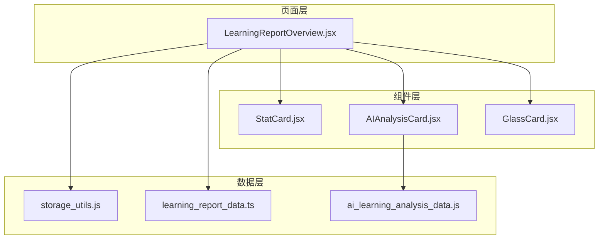
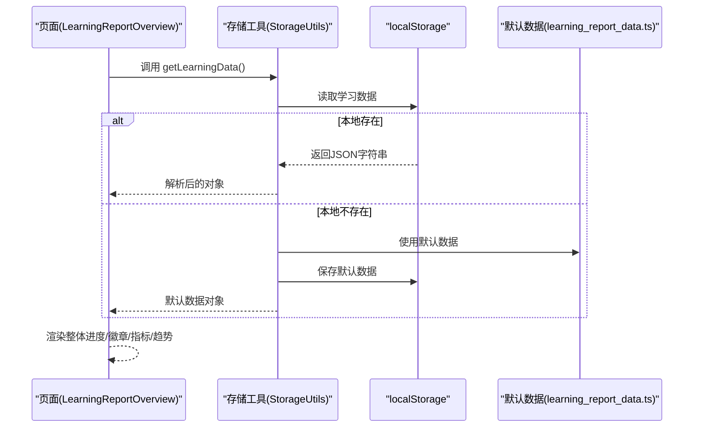
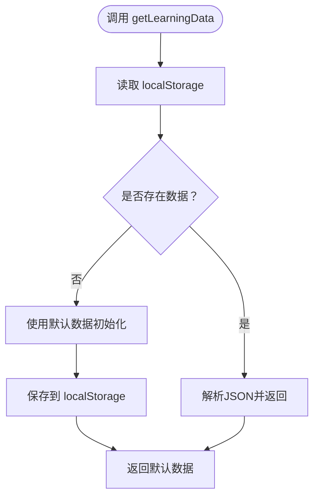
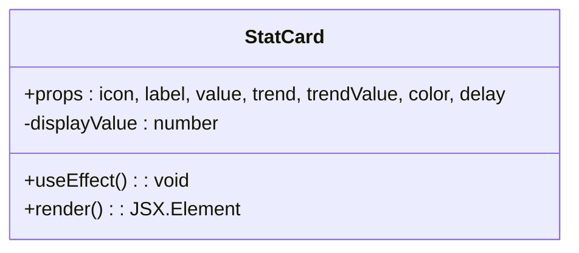
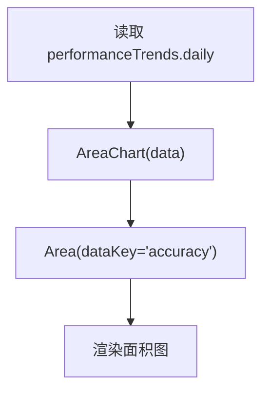
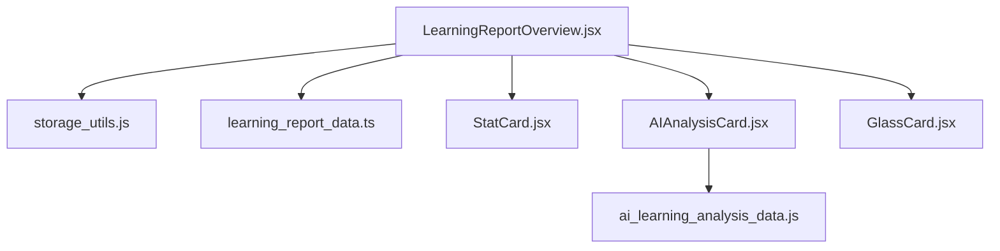

# 学习报告概览

<cite>
**本文引用的文件**
- [LearningReportOverview.jsx](file://src/pages/LearningReportOverview.jsx)
- [storage_utils.js](file://src/utils/storage_utils.js)
- [learning_report_data.ts](file://src/data/learning_report_data.ts)
- [StatCard.jsx](file://src/components/uiverse/StatCard.jsx)
- [AIAnalysisCard.jsx](file://src/components/uiverse/AIAnalysisCard.jsx)
- [GlassCard.jsx](file://src/components/uiverse/GlassCard.jsx)
- [ai_learning_analysis_data.js](file://src/data/ai_learning_analysis_data.js)
</cite>

## 目录
1. [引言](#引言)
2. [项目结构](#项目结构)
3. [核心组件](#核心组件)
4. [架构总览](#架构总览)
5. [详细组件分析](#详细组件分析)
6. [依赖关系分析](#依赖关系分析)
7. [性能考量](#性能考量)
8. [故障排查指南](#故障排查指南)
9. [结论](#结论)
10. [附录](#附录)

## 引言
本文件面向开发者与产品人员，系统梳理“学习报告概览”页面的UI布局、数据加载与可视化实现。重点解析如下内容：
- 如何通过 StorageUtils 从 localStorage 获取学习数据并进行初始化
- 页面如何渲染整体进度、成就徽章、关键指标与学习趋势图表
- performanceTrends.daily 数据如何驱动 Recharts 面积图展示准确率趋势
- StatCard 组件的动态数据绑定与数字动画机制
- 页面加载状态处理与错误边界最佳实践
- 自定义激励语与本周亮点的扩展方法

## 项目结构
学习报告概览页面位于 pages 目录，数据来源为 utils 的存储工具与 data 目录的默认数据；UI 组件来自 components/uiverse。

**图表来源**
- [LearningReportOverview.jsx](file://src/pages/LearningReportOverview.jsx#L1-L269)
- [storage_utils.js](file://src/utils/storage_utils.js#L1-L180)
- [learning_report_data.ts](file://src/data/learning_report_data.ts#L1-L210)
- [AIAnalysisCard.jsx](file://src/components/uiverse/AIAnalysisCard.jsx#L1-L238)
- [StatCard.jsx](file://src/components/uiverse/StatCard.jsx#L1-L108)
- [GlassCard.jsx](file://src/components/uiverse/GlassCard.jsx#L1-L74)
- [ai_learning_analysis_data.js](file://src/data/ai_learning_analysis_data.js#L1-L221)

**章节来源**
- [LearningReportOverview.jsx](file://src/pages/LearningReportOverview.jsx#L1-L269)
- [storage_utils.js](file://src/utils/storage_utils.js#L1-L180)
- [learning_report_data.ts](file://src/data/learning_report_data.ts#L1-L210)

## 核心组件
- 页面容器：负责数据加载、布局与可视化渲染
- 存储工具：封装 localStorage 读写、默认数据初始化、关键指标更新
- 统计卡片：带数字动画与趋势指示的关键指标展示
- AI分析卡片：综合学情、关键发现、建议与鼓励语
- 玻璃卡片：通用背景与动效组件

**章节来源**
- [LearningReportOverview.jsx](file://src/pages/LearningReportOverview.jsx#L1-L269)
- [storage_utils.js](file://src/utils/storage_utils.js#L1-L180)
- [StatCard.jsx](file://src/components/uiverse/StatCard.jsx#L1-L108)
- [AIAnalysisCard.jsx](file://src/components/uiverse/AIAnalysisCard.jsx#L1-L238)
- [GlassCard.jsx](file://src/components/uiverse/GlassCard.jsx#L1-L74)

## 架构总览
页面采用“数据驱动 + 可视化组件”的架构：
- 数据来源：localStorage 中的“学习报告数据”，若不存在则以默认数据初始化
- 数据结构：包含概览、能力雷达、知识地图、学习趋势、个性化建议与AI分析
- 可视化：使用 Recharts 渲染学习趋势面积图；使用 StatCard 渲染关键指标；使用 AIAnalysisCard 展示学情分析

**图表来源**
- [LearningReportOverview.jsx](file://src/pages/LearningReportOverview.jsx#L15-L30)
- [storage_utils.js](file://src/utils/storage_utils.js#L12-L25)
- [learning_report_data.ts](file://src/data/learning_report_data.ts#L1-L210)

## 详细组件分析

### 页面容器：LearningReportOverview
- 数据加载与空态
  - 首次渲染时调用 StorageUtils.getLearningData() 从 localStorage 读取数据；若不存在则使用默认数据初始化并保存
  - 在数据未加载完成前显示“加载中…”占位
- 整体进度区域
  - 展示学习天数、连续打卡天数、整体掌握度进度条与班级排名信息
  - 使用 Framer Motion 实现入场动画
- 成就徽章区域
  - 遍历 overview.achievements 渲染徽章列表，支持未解锁徽章的进度条与解锁态样式
- 本周亮点区域
  - 遍历 overview.weeklyHighlights 渲染多个高亮卡片，支持 hover 效果与动效延迟
- AI学情分析
  - 使用 AIAnalysisCard 展示综合评分、学习状态、关键发现、推荐行动与鼓励语
- 关键指标卡片
  - 使用 StatCard 四列布局展示平均正确率、总学习时长、完成题目数、连续打卡
  - 每个卡片传入图标、标签、数值、趋势方向与趋势值、颜色与延迟参数
- 学习趋势图表
  - 使用 Recharts AreaChart 渲染 performanceTrends.daily 的准确率趋势
  - X 轴为日期，Y 轴为准确率，配置网格、坐标轴样式与 Tooltip
- 激励语
  - 使用 Framer Motion 渐显展示激励语块

**章节来源**
- [LearningReportOverview.jsx](file://src/pages/LearningReportOverview.jsx#L15-L269)

### 数据加载与持久化：StorageUtils
- getLearningData
  - 从 localStorage 读取学习数据；若不存在则使用默认数据初始化并保存
  - 异常捕获并回退到默认数据，保证页面可用性
- addLearningRecord/updateStreak 等
  - 提供学习记录追加与连续打卡更新等方法，便于运行时更新趋势数据
- 默认数据来源
  - 默认数据由 learning_report_data.ts 提供，包含 overview、performanceTrends、knowledgeMap、recommendations、aiAnalysis 等字段

**图表来源**
- [storage_utils.js](file://src/utils/storage_utils.js#L12-L25)
- [learning_report_data.ts](file://src/data/learning_report_data.ts#L1-L210)

**章节来源**
- [storage_utils.js](file://src/utils/storage_utils.js#L12-L25)
- [learning_report_data.ts](file://src/data/learning_report_data.ts#L1-L210)

### 关键指标卡片：StatCard
- 动画机制
  - 通过 useEffect 和定时器实现从 0 到目标值的数字动画，帧率约 60fps
  - 若传入字符串数值（如百分比），会先解析为数字再动画
- 视觉与交互
  - 支持多种颜色主题（蓝、橙、绿、紫、红），对应渐变背景与图标色
  - 支持趋势指示器（上升/下降），并可设置入场延迟
  - 使用 Framer Motion 实现卡片缩放与悬停动效

**图表来源**
- [StatCard.jsx](file://src/components/uiverse/StatCard.jsx#L1-L108)

**章节来源**
- [StatCard.jsx](file://src/components/uiverse/StatCard.jsx#L1-L108)

### 学习趋势图表：Recharts 面积图
- 数据绑定
  - AreaChart 的 data 来源于 performanceTrends.daily，其中每条记录包含 date 与 accuracy 字段
- 图表配置
  - 定义线性渐变填充、网格、坐标轴样式、Tooltip 样式
  - Area 组件使用 monotone 类型，stroke 与填充色一致，形成面积图
- 准确率趋势解读
  - X 轴为日期，Y 轴为准确率，直观反映近期学习表现变化

**图表来源**
- [LearningReportOverview.jsx](file://src/pages/LearningReportOverview.jsx#L199-L249)
- [learning_report_data.ts](file://src/data/learning_report_data.ts#L166-L209)

**章节来源**
- [LearningReportOverview.jsx](file://src/pages/LearningReportOverview.jsx#L199-L249)
- [learning_report_data.ts](file://src/data/learning_report_data.ts#L166-L209)

### AI学情分析：AIAnalysisCard
- 结构组成
  - 综合评分徽章、整体评价、学习状态、关键发现、推荐行动、鼓励语
- 交互与展开
  - 支持展开/收起查看更多分析内容
- 数据来源
  - 通过 props 接收 AI_LEARNING_ANALYSIS_DATA.comprehensiveAnalysis 并渲染

**章节来源**
- [AIAnalysisCard.jsx](file://src/components/uiverse/AIAnalysisCard.jsx#L1-L238)
- [ai_learning_analysis_data.js](file://src/data/ai_learning_analysis_data.js#L1-L221)

### 玻璃卡片：GlassCard
- 作用
  - 为页面中的卡片提供统一的毛玻璃背景、阴影与动效
- 可选特性
  - 多种透明度级别、渐变边框、悬停效果与点击回调

**章节来源**
- [GlassCard.jsx](file://src/components/uiverse/GlassCard.jsx#L1-L74)

## 依赖关系分析
- 页面依赖
  - StorageUtils：数据读取与默认数据初始化
  - 默认数据：overview、performanceTrends 等结构
  - Recharts：趋势图渲染
  - StatCard：关键指标卡片
  - AIAnalysisCard：学情分析
  - GlassCard：通用卡片容器
- 数据流向
  - localStorage -> StorageUtils -> 页面 -> Recharts/StatCard/AIAnalysisCard

**图表来源**
- [LearningReportOverview.jsx](file://src/pages/LearningReportOverview.jsx#L1-L269)
- [storage_utils.js](file://src/utils/storage_utils.js#L1-L180)
- [learning_report_data.ts](file://src/data/learning_report_data.ts#L1-L210)
- [AIAnalysisCard.jsx](file://src/components/uiverse/AIAnalysisCard.jsx#L1-L238)
- [StatCard.jsx](file://src/components/uiverse/StatCard.jsx#L1-L108)
- [GlassCard.jsx](file://src/components/uiverse/GlassCard.jsx#L1-L74)
- [ai_learning_analysis_data.js](file://src/data/ai_learning_analysis_data.js#L1-L221)

**章节来源**
- [LearningReportOverview.jsx](file://src/pages/LearningReportOverview.jsx#L1-L269)
- [storage_utils.js](file://src/utils/storage_utils.js#L1-L180)
- [learning_report_data.ts](file://src/data/learning_report_data.ts#L1-L210)

## 性能考量
- 数据加载
  - 首次读取 localStorage 为 O(1)，解析 JSON 为 O(n)，n 为数据大小
  - 若数据缺失，使用默认数据初始化，避免空指针风险
- 可视化渲染
  - Recharts 渲染面积图时，建议控制 daily 数据长度，避免过多点导致卡顿
  - StatCard 数字动画使用定时器，建议在大数据量时考虑节流或禁用动画
- 动画与交互
  - Framer Motion 的入场动画与 hover 效果应适度使用，避免过度重绘

[本节为通用性能建议，不直接分析具体文件]

## 故障排查指南
- 页面空白或长时间“加载中”
  - 检查 localStorage 是否被浏览器禁用或存储空间不足
  - 确认 StorageUtils.getLearningData() 是否抛出异常并回退到默认数据
- 数据不更新
  - 确认是否调用了 addLearningRecord/updateStreak 等更新方法并保存
  - 检查 localStorage 中的键名是否正确
- 图表无数据
  - 确认 performanceTrends.daily 是否包含 date 与 accuracy 字段
  - 确保 XAxis 的 dataKey 与数据字段一致
- 激励语/本周亮点不显示
  - 检查 overview.weeklyHighlights 与 AIAnalysisCard 的传参
  - 确认数据结构与字段名一致

**章节来源**
- [storage_utils.js](file://src/utils/storage_utils.js#L12-L25)
- [LearningReportOverview.jsx](file://src/pages/LearningReportOverview.jsx#L15-L30)
- [learning_report_data.ts](file://src/data/learning_report_data.ts#L1-L210)

## 结论
学习报告概览页面通过 StorageUtils 从 localStorage 获取或初始化学习数据，结合 Recharts 与自研组件实现整体进度、成就徽章、关键指标与学习趋势的可视化展示。StatCard 的数字动画与趋势指示增强了数据表现力；AIAnalysisCard 提供了结构化的学情分析与建议。页面在加载状态与错误边界方面具备基础保障，便于后续扩展与维护。

[本节为总结性内容，不直接分析具体文件]

## 附录

### 自定义激励语与本周亮点
- 激励语
  - 当前页面在底部展示固定文案，可在 props 或状态中注入动态内容，或替换为从 AIAnalysisCard 获取的鼓励语
- 本周亮点
  - weeklyHighlights 为数组，支持添加/修改条目；建议保持 icon、title、description、improvement 字段一致，以便统一渲染

**章节来源**
- [LearningReportOverview.jsx](file://src/pages/LearningReportOverview.jsx#L126-L149)
- [AIAnalysisCard.jsx](file://src/components/uiverse/AIAnalysisCard.jsx#L214-L231)
- [ai_learning_analysis_data.js](file://src/data/ai_learning_analysis_data.js#L215-L221)