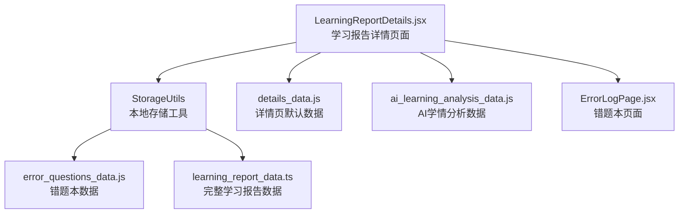
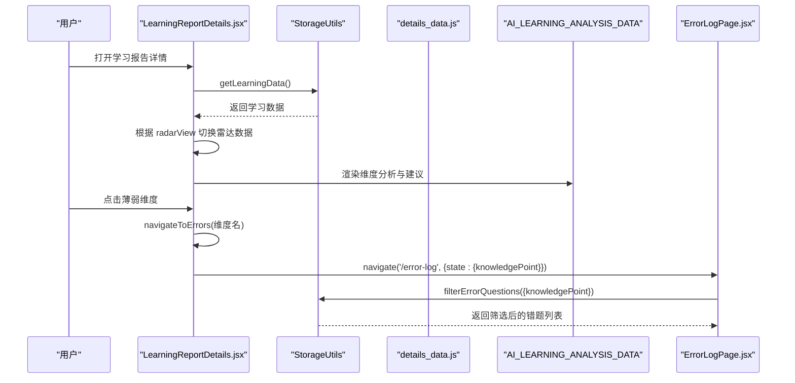
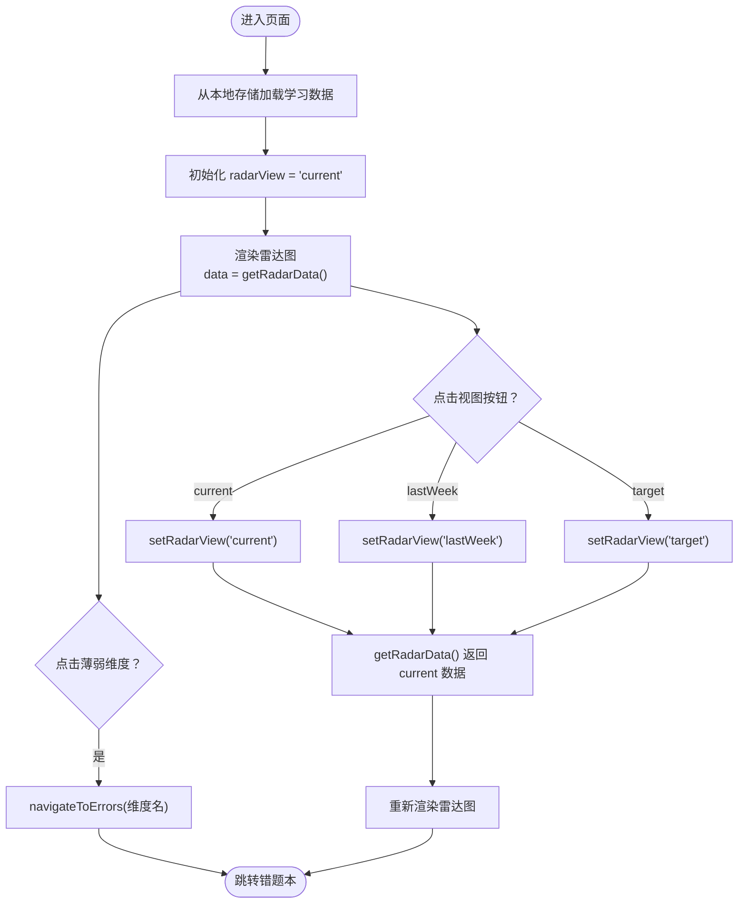
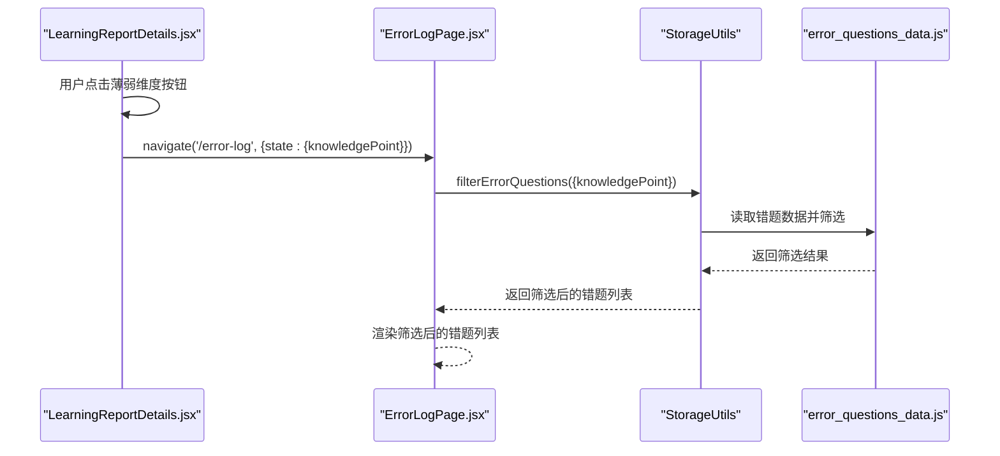
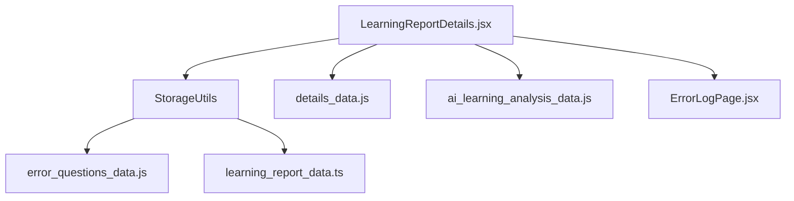

# 学习报告详情

<cite>
**本文引用的文件**
- [LearningReportDetails.jsx](file://src/pages/LearningReportDetails.jsx)
- [storage_utils.js](file://src/utils/storage_utils.js)
- [details_data.js](file://src/data/details_data.js)
- [ai_learning_analysis_data.js](file://src/data/ai_learning_analysis_data.js)
- [error_questions_data.js](file://src/data/error_questions_data.js)
- [ErrorLogPage.jsx](file://src/pages/ErrorLogPage.jsx)
- [learning_report_data.ts](file://src/data/learning_report_data.ts)
</cite>

## 目录
1. [简介](#简介)
2. [项目结构](#项目结构)
3. [核心组件](#核心组件)
4. [架构总览](#架构总览)
5. [详细组件分析](#详细组件分析)
6. [依赖分析](#依赖分析)
7. [性能考量](#性能考量)
8. [故障排查指南](#故障排查指南)
9. [结论](#结论)

## 简介
本文件深入解析学习报告详情页面的实现，围绕以下四大模块展开：
- 能力雷达图：支持“本周/上周/目标”三视图切换，展示能力维度得分与薄弱维度提示，并可一键跳转错题本。
- AI能力分析：按能力维度给出评分、趋势、优势与改进建议，辅助制定学习策略。
- 知识点深度分析：展示已掌握、正在学习、薄弱与锁定的知识点分布与分析。
- 知识地图：模块状态（mastered/learning/locked）的视觉呈现与进度条实现，配套智能推荐。

文档还说明radarView状态如何驱动雷达图数据切换，RadarChart组件的数据映射逻辑，AI_LEARNING_ANALYSIS_DATA如何提供维度分析与薄弱点建议，以及navigateToErrors函数如何实现与错题本的页面跳转联动；最后详述知识地图中模块状态与进度条的视觉设计。

## 项目结构
学习报告详情页面位于 pages 目录，数据来源包括 utils 中的本地存储工具与 data 目录中的静态数据。页面通过本地存储读取学习数据，渲染雷达图、AI分析、知识点分析与知识地图四个区域。

图表来源
- [LearningReportDetails.jsx](file://src/pages/LearningReportDetails.jsx#L1-L120)
- [storage_utils.js](file://src/utils/storage_utils.js#L1-L60)
- [details_data.js](file://src/data/details_data.js#L1-L106)
- [ai_learning_analysis_data.js](file://src/data/ai_learning_analysis_data.js#L223-L310)
- [ErrorLogPage.jsx](file://src/pages/ErrorLogPage.jsx#L1-L120)
- [error_questions_data.js](file://src/data/error_questions_data.js#L1-L173)
- [learning_report_data.ts](file://src/data/learning_report_data.ts#L65-L164)

章节来源
- [LearningReportDetails.jsx](file://src/pages/LearningReportDetails.jsx#L1-L120)
- [storage_utils.js](file://src/utils/storage_utils.js#L1-L60)
- [details_data.js](file://src/data/details_data.js#L1-L106)
- [ai_learning_analysis_data.js](file://src/data/ai_learning_analysis_data.js#L223-L310)
- [ErrorLogPage.jsx](file://src/pages/ErrorLogPage.jsx#L1-L120)
- [error_questions_data.js](file://src/data/error_questions_data.js#L1-L173)
- [learning_report_data.ts](file://src/data/learning_report_data.ts#L65-L164)

## 核心组件
- 页面容器与状态管理：通过 useState 管理 radarView（当前/上周/目标），useEffect 从本地存储加载学习数据。
- 能力雷达图：基于 Recharts RadarChart，根据 radarView 动态切换数据源，支持角度轴、半径轴与网格配置。
- AI能力分析：遍历 AI_LEARNING_ANALYSIS_DATA.dimensionAnalysis.abilities，渲染维度标题、趋势、评分、优势与改进建议。
- 知识点深度分析：展示已掌握与薄弱知识点的统计与主题列表。
- 知识地图：遍历 knowledgeMap.modules，依据 status 渲染模块卡片、进度条与子主题标签；锁定模块显示解锁提示。
- 错题本联动：navigateToErrors 将薄弱维度作为知识要点传入路由 state，跳转错题本并按知识点筛选。

章节来源
- [LearningReportDetails.jsx](file://src/pages/LearningReportDetails.jsx#L1-L120)
- [ai_learning_analysis_data.js](file://src/data/ai_learning_analysis_data.js#L223-L310)
- [details_data.js](file://src/data/details_data.js#L1-L106)

## 架构总览
下图展示页面与数据层的交互关系，以及与错题本的导航联动。

图表来源
- [LearningReportDetails.jsx](file://src/pages/LearningReportDetails.jsx#L1-L120)
- [storage_utils.js](file://src/utils/storage_utils.js#L222-L248)
- [details_data.js](file://src/data/details_data.js#L1-L106)
- [ai_learning_analysis_data.js](file://src/data/ai_learning_analysis_data.js#L223-L310)
- [ErrorLogPage.jsx](file://src/pages/ErrorLogPage.jsx#L1-L120)

## 详细组件分析

### 能力雷达图与radarView状态切换
- 状态管理
  - 使用 useState 维护 radarView，默认为 current。
  - getRadarData 根据 radarView 返回对应视图的数据数组。
- 视图切换按钮
  - 三个按钮分别映射 current/lastWeek/target，点击后更新 radarView。
  - 激活态按钮具有强调色与阴影效果。
- 图表渲染
  - 使用 Recharts RadarChart，绑定 data 为 getRadarData() 返回值。
  - PolarAngleAxis 显示维度名称；PolarRadiusAxis 设置域为[0,100]。
  - Radar 线条颜色随视图变化（目标视图使用绿色，其他使用蓝色），填充半透明。
- 薄弱维度提示
  - 从 abilityRadar.weakestDimensions 读取薄弱维度，逐项渲染为可点击按钮。
  - 点击后调用 navigateToErrors，携带知识要点名称。

图表来源
- [LearningReportDetails.jsx](file://src/pages/LearningReportDetails.jsx#L1-L120)
- [details_data.js](file://src/data/details_data.js#L1-L32)

章节来源
- [LearningReportDetails.jsx](file://src/pages/LearningReportDetails.jsx#L1-L120)
- [details_data.js](file://src/data/details_data.js#L1-L32)

### RadarChart 数据映射逻辑
- 数据结构
  - 每个雷达点包含 dimension 与 score 字段，分别映射到 PolarAngleAxis.dataKey 与 Radar.dataKey。
  - fullMark 字段存在于默认数据中，但雷达图渲染时未直接使用。
- 域与网格
  - PolarRadiusAxis 设置角度与域，PolarGrid 提供网格线，增强可读性。
- 颜色与样式
  - 根据 radarView 决定线条与填充颜色，目标视图采用绿色，其他视图采用蓝色。
- 薄弱维度联动
  - navigateToErrors 将薄弱维度名称作为 state 传递给错题本页面，实现按知识点筛选。

章节来源
- [LearningReportDetails.jsx](file://src/pages/LearningReportDetails.jsx#L1-L120)
- [details_data.js](file://src/data/details_data.js#L1-L32)

### AI能力分析：维度分析与薄弱点建议
- 数据来源
  - AI_LEARNING_ANALYSIS_DATA.dimensionAnalysis.abilities 提供每个维度的：
    - dimension：维度名称
    - score：分数
    - trend：趋势（up/stable）
    - analysis：简要分析
    - strengths：优势列表
    - improvements：改进建议列表
- 渲染策略
  - 使用动画组件逐条渲染，按分数区间设置不同强调色。
  - 优势与改进建议以分组卡片形式展示，便于阅读。
- 与薄弱维度联动
  - 薄弱维度来自 abilityRadar.weakestDimensions，点击后跳转错题本，帮助针对性巩固。

章节来源
- [LearningReportDetails.jsx](file://src/pages/LearningReportDetails.jsx#L118-L193)
- [ai_learning_analysis_data.js](file://src/data/ai_learning_analysis_data.js#L223-L310)
- [details_data.js](file://src/data/details_data.js#L1-L32)

### 知识点深度分析：已掌握与薄弱
- 已掌握
  - 展示已掌握知识点数量与简要分析，并列出主题标签。
- 薄弱
  - 展示薄弱知识点分析与高优先级标识，逐项列出薄弱主题。
- 与AI分析协同
  - 该区域直接消费 AI_LEARNING_ANALYSIS_DATA.dimensionAnalysis.knowledgePoints 的统计与主题列表。

章节来源
- [LearningReportDetails.jsx](file://src/pages/LearningReportDetails.jsx#L195-L255)
- [ai_learning_analysis_data.js](file://src/data/ai_learning_analysis_data.js#L283-L310)

### 知识地图：模块状态与进度条
- 模块状态
  - mastered：已掌握，卡片边框与背景采用绿色系，进度百分比强调绿色。
  - learning：学习中，卡片边框与背景采用蓝色系，进度百分比强调蓝色。
  - locked：未解锁，卡片透明度降低，显示“完成前置知识后解锁”的提示。
- 进度条
  - 使用两段式渐变色：已掌握模块为从 emerald-500 到 emerald-600；学习中模块为从 blue-500 到 blue-600。
  - 进度条宽度由模块 progress 百分比决定，过渡动画平滑。
- 子主题标签
  - 根据 mastery 分级显示不同颜色标签，直观反映掌握程度。
- 智能推荐
  - 展示 nextRecommended 的主题与原因，引导下一步学习。

章节来源
- [LearningReportDetails.jsx](file://src/pages/LearningReportDetails.jsx#L257-L370)
- [details_data.js](file://src/data/details_data.js#L34-L95)

### 与错题本的页面跳转联动：navigateToErrors
- 路由参数
  - navigateToErrors 接收一个知识要点名称，调用 navigate('/error-log', { state: { knowledgePoint } })。
- 错题本筛选
  - 错题本页面在加载时读取 location.state，将 knowledgePoint 作为筛选条件之一，调用 StorageUtils.filterErrorQuestions 实现精准过滤。
- 数据同步
  - 错题本内部通过 StorageUtils.updateQuestionStatus、addRetryRecord 等方法维护错题状态与统计，并在更新后同步回学习报告（如更新薄弱维度与能力分数）。

图表来源
- [LearningReportDetails.jsx](file://src/pages/LearningReportDetails.jsx#L25-L30)
- [ErrorLogPage.jsx](file://src/pages/ErrorLogPage.jsx#L38-L70)
- [storage_utils.js](file://src/utils/storage_utils.js#L222-L248)
- [error_questions_data.js](file://src/data/error_questions_data.js#L86-L170)

章节来源
- [LearningReportDetails.jsx](file://src/pages/LearningReportDetails.jsx#L25-L30)
- [ErrorLogPage.jsx](file://src/pages/ErrorLogPage.jsx#L38-L70)
- [storage_utils.js](file://src/utils/storage_utils.js#L222-L248)
- [error_questions_data.js](file://src/data/error_questions_data.js#L86-L170)

## 依赖分析
- 页面依赖
  - 本地存储：通过 StorageUtils.getLearningData() 获取学习数据；在详情页中用于初始化。
  - 默认数据：details_data.js 提供 abilityRadar、knowledgeMap、weeklyComparison 的默认结构。
  - AI分析：ai_learning_analysis_data.js 提供维度分析与知识点分析。
- 错题本联动
  - navigateToErrors 依赖 react-router 的 navigate 与 location.state。
  - 错题本通过 StorageUtils.filterErrorQuestions 读取并筛选错题数据。
- 数据一致性
  - 错题本内部通过 StorageUtils.recalculateErrorStatistics 与 syncErrorsToReport 同步统计与学习报告中的薄弱维度与能力分数。

图表来源
- [LearningReportDetails.jsx](file://src/pages/LearningReportDetails.jsx#L1-L120)
- [storage_utils.js](file://src/utils/storage_utils.js#L1-L60)
- [details_data.js](file://src/data/details_data.js#L1-L106)
- [ai_learning_analysis_data.js](file://src/data/ai_learning_analysis_data.js#L223-L310)
- [ErrorLogPage.jsx](file://src/pages/ErrorLogPage.jsx#L1-L120)
- [error_questions_data.js](file://src/data/error_questions_data.js#L1-L173)
- [learning_report_data.ts](file://src/data/learning_report_data.ts#L65-L164)

章节来源
- [LearningReportDetails.jsx](file://src/pages/LearningReportDetails.jsx#L1-L120)
- [storage_utils.js](file://src/utils/storage_utils.js#L1-L60)
- [details_data.js](file://src/data/details_data.js#L1-L106)
- [ai_learning_analysis_data.js](file://src/data/ai_learning_analysis_data.js#L223-L310)
- [ErrorLogPage.jsx](file://src/pages/ErrorLogPage.jsx#L1-L120)
- [error_questions_data.js](file://src/data/error_questions_data.js#L1-L173)
- [learning_report_data.ts](file://src/data/learning_report_data.ts#L65-L164)

## 性能考量
- 图表渲染
  - Recharts 在大数据量时建议控制点数与动画层级，避免频繁重绘。
- 本地存储
  - 大体量数据建议分片存储或懒加载，减少初次渲染压力。
- 错题本筛选
  - filterErrorQuestions 为 O(n) 线性筛选，建议在数据量较大时引入索引或分页。
- 动画与滚动
  - 页面使用 Framer Motion 与自定义滚动条，注意移动端性能优化。

## 故障排查指南
- 无法加载学习数据
  - 检查 StorageUtils.getLearningData 是否能正确读取 localStorage；若为空则会初始化默认数据。
- 雷达图无数据
  - 确认 radarView 与 getRadarData 的返回值是否匹配；检查 details_data.js 中 abilityRadar 的 current/lastWeek/target 结构。
- 薄弱维度按钮无效
  - 确认 navigateToErrors 的调用与 ErrorLogPage 的 location.state 读取逻辑一致。
- 错题本筛选无结果
  - 检查 knowledgePoint 是否与错题数据中的 knowledgePoint 字段一致；确认 StorageUtils.filterErrorQuestions 的过滤条件生效。
- 数据未同步
  - 若错题本状态变更后学习报告未更新，检查 StorageUtils.syncErrorsToReport 是否被调用。

章节来源
- [storage_utils.js](file://src/utils/storage_utils.js#L1-L60)
- [details_data.js](file://src/data/details_data.js#L1-L106)
- [ErrorLogPage.jsx](file://src/pages/ErrorLogPage.jsx#L38-L70)
- [storage_utils.js](file://src/utils/storage_utils.js#L222-L248)

## 结论
学习报告详情页面通过清晰的状态管理与数据映射，实现了能力雷达图、AI能力分析、知识点深度分析与知识地图的有机整合。radarView 状态驱动雷达图数据切换，RadarChart 组件以维度与分数为核心映射；AI_LEARNING_ANALYSIS_DATA 提供维度分析与薄弱点建议；navigateToErrors 与错题本联动形成“诊断—巩固”的闭环；知识地图以模块状态与进度条直观呈现学习进展，并提供智能推荐。整体架构层次清晰、耦合度低，具备良好的可扩展性与可维护性。