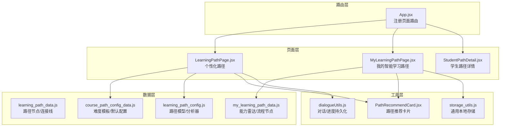
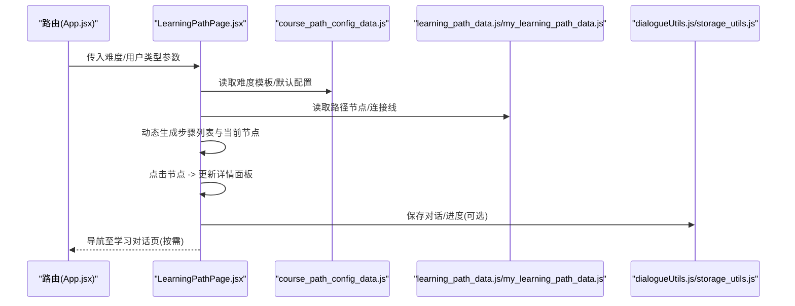
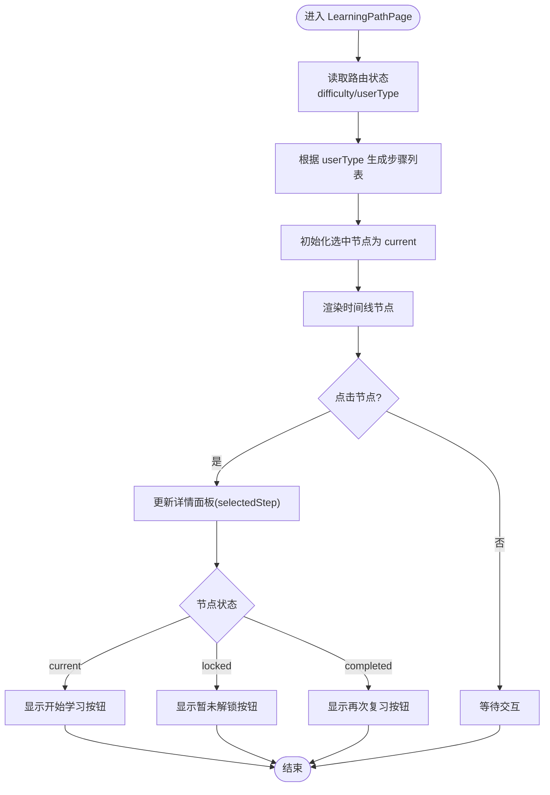
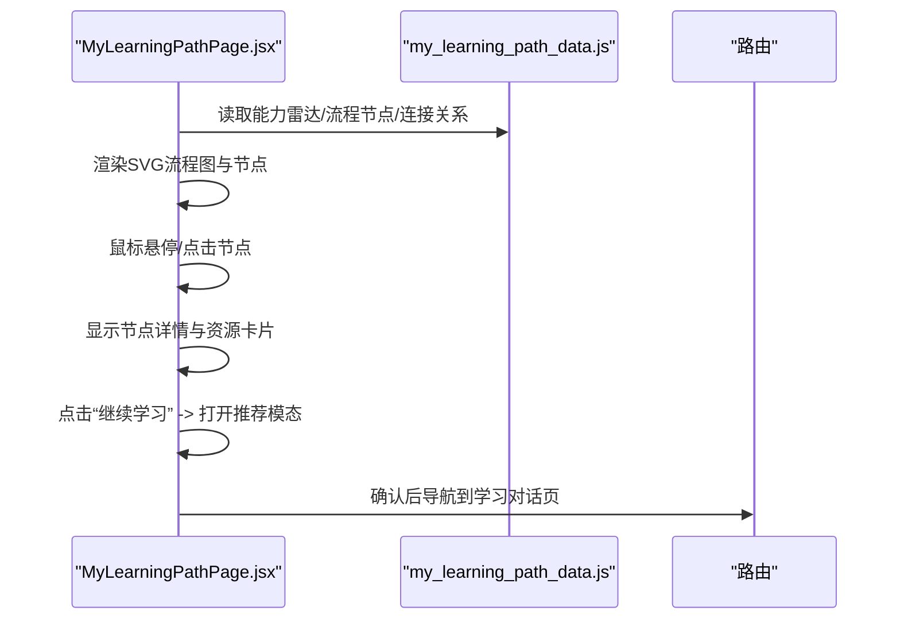
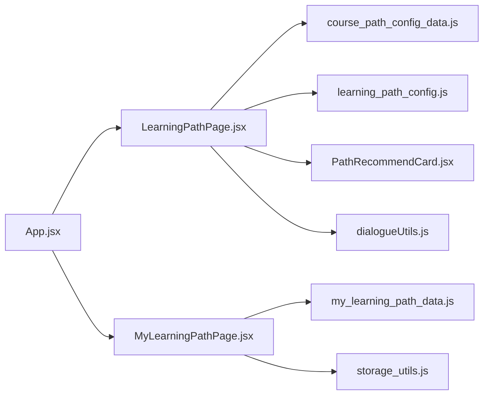

# 学习路径

<cite>
**本文引用的文件**
- [App.jsx](file://src/App.jsx)
- [LearningPathPage.jsx](file://src/pages/LearningPathPage.jsx)
- [MyLearningPathPage.jsx](file://src/pages/MyLearningPathPage.jsx)
- [learning_path_data.js](file://src/data/learning_path_data.js)
- [my_learning_path_data.js](file://src/data/my_learning_path_data.js)
- [course_path_config_data.js](file://src/data/course_path_config_data.js)
- [learning_path_config.js](file://src/data/learning_path_config.js)
- [dialogueUtils.js](file://src/utils/dialogueUtils.js)
- [storage_utils.js](file://src/utils/storage_utils.js)
- [PathRecommendCard.jsx](file://src/components/chat-widgets/PathRecommendCard.jsx)
- [StudentPathDetail.jsx](file://src/pages/StudentPathDetail.jsx)
</cite>

## 目录
1. [引言](#引言)
2. [项目结构](#项目结构)
3. [核心组件](#核心组件)
4. [架构总览](#架构总览)
5. [详细组件分析](#详细组件分析)
6. [依赖分析](#依赖分析)
7. [性能考虑](#性能考虑)
8. [故障排查指南](#故障排查指南)
9. [结论](#结论)
10. [附录](#附录)

## 引言
本文件围绕“个性化学习路径”的展示与交互逻辑展开，重点分析 LearningPathPage.jsx 的路径节点（视频、测验等）动态渲染机制；结合 learning_path_data.js 与 my_learning_path_data.js 的路径配置模型，说明如何根据学生能力与目标生成专属路径；阐述课程配置数据 course_path_config_data.js 的作用及其与 UI 状态的同步方式；并提供路径进度更新、节点跳转等核心功能的代码示例路径，最后讨论性能优化策略如懒加载与状态缓存。

## 项目结构
- 页面层：LearningPathPage.jsx（个性化路径）、MyLearningPathPage.jsx（我的路径）、StudentPathDetail.jsx（学生路径详情）
- 数据层：learning_path_data.js、my_learning_path_data.js、course_path_config_data.js、learning_path_config.js
- 工具层：dialogueUtils.js（对话/进度持久化）、storage_utils.js（通用本地存储）
- 路由层：App.jsx（页面路由注册）

图表来源
- [App.jsx](file://src/App.jsx#L50-L98)
- [LearningPathPage.jsx](file://src/pages/LearningPathPage.jsx#L1-L166)
- [MyLearningPathPage.jsx](file://src/pages/MyLearningPathPage.jsx#L1-L673)
- [learning_path_data.js](file://src/data/learning_path_data.js#L1-L182)
- [my_learning_path_data.js](file://src/data/my_learning_path_data.js#L1-L148)
- [course_path_config_data.js](file://src/data/course_path_config_data.js#L1-L333)
- [learning_path_config.js](file://src/data/learning_path_config.js#L1-L180)
- [dialogueUtils.js](file://src/utils/dialogueUtils.js#L1-L91)
- [storage_utils.js](file://src/utils/storage_utils.js#L1-L42)
- [PathRecommendCard.jsx](file://src/components/chat-widgets/PathRecommendCard.jsx#L1-L167)
- [StudentPathDetail.jsx](file://src/pages/StudentPathDetail.jsx#L181-L222)

章节来源
- [App.jsx](file://src/App.jsx#L50-L98)

## 核心组件
- LearningPathPage.jsx：基于用户类型与难度，动态生成路径节点列表，支持节点点击切换详情面板，展示视频/测验/练习等节点状态与操作入口。
- MyLearningPathPage.jsx：以流程图形式展示节点与连接线，支持节点悬停/点击查看详情，右侧展示学习资源与趋势统计。
- learning_path_data.js / my_learning_path_data.js：提供路径节点、连接线、能力雷达、阶段信息等静态配置数据。
- course_path_config_data.js：定义难度级别、路径模板、默认课程配置，作为 UI 状态与交互的基础数据源。
- learning_path_config.js：定义路径模型、AI分析器与本地存储管理工具，支撑路径的创建、保存、复制与分析。
- dialogueUtils.js / storage_utils.js：提供对话历史与学习进度的本地持久化能力，用于路径进度更新与状态同步。
- PathRecommendCard.jsx：基于掌握程度的智能推荐卡片，驱动下一步学习动作。

章节来源
- [LearningPathPage.jsx](file://src/pages/LearningPathPage.jsx#L1-L166)
- [MyLearningPathPage.jsx](file://src/pages/MyLearningPathPage.jsx#L1-L673)
- [learning_path_data.js](file://src/data/learning_path_data.js#L1-L182)
- [my_learning_path_data.js](file://src/data/my_learning_path_data.js#L1-L148)
- [course_path_config_data.js](file://src/data/course_path_config_data.js#L1-L333)
- [learning_path_config.js](file://src/data/learning_path_config.js#L1-L180)
- [dialogueUtils.js](file://src/utils/dialogueUtils.js#L1-L91)
- [storage_utils.js](file://src/utils/storage_utils.js#L1-L42)
- [PathRecommendCard.jsx](file://src/components/chat-widgets/PathRecommendCard.jsx#L1-L167)
- [StudentPathDetail.jsx](file://src/pages/StudentPathDetail.jsx#L181-L222)

## 架构总览
个性化学习路径由“路由 -> 页面 -> 数据/配置 -> 工具”四层构成：
- 路由层负责页面导航与参数传递（难度、用户类型）。
- 页面层负责动态渲染路径节点与详情面板，处理节点跳转与状态切换。
- 数据/配置层提供静态路径数据与难度模板，支撑 UI 展示与交互。
- 工具层负责持久化与分析，实现进度更新与推荐联动。

图表来源
- [App.jsx](file://src/App.jsx#L50-L98)
- [LearningPathPage.jsx](file://src/pages/LearningPathPage.jsx#L1-L166)
- [course_path_config_data.js](file://src/data/course_path_config_data.js#L1-L333)
- [learning_path_data.js](file://src/data/learning_path_data.js#L1-L182)
- [my_learning_path_data.js](file://src/data/my_learning_path_data.js#L1-L148)
- [dialogueUtils.js](file://src/utils/dialogueUtils.js#L1-L91)
- [storage_utils.js](file://src/utils/storage_utils.js#L1-L42)

## 详细组件分析

### LearningPathPage.jsx：个性化路径节点动态渲染
- 参数来源：从路由状态接收 difficulty 与 userType，用于决定节点类型与内容。
- 动态内容生成：根据 userType 返回不同的节点序列（视觉型/学术型/逻辑型），并设置状态（已完成/进行中/未解锁）。
- 交互逻辑：
  - 左侧时间线节点点击切换右侧详情面板。
  - 根据节点状态显示“开始学习”、“暂未解锁”、“再次复习”等按钮。
  - 使用动画库实现节点入场与详情面板切换。
- 节点类型与状态：
  - 类型：video（视频）、quiz（测验）、practice（练习）、reading（阅读）等。
  - 状态：completed（已完成）、current（进行中）、locked（未解锁）。
- 与课程配置的关联：
  - 通过 DEFAULT_COURSE_CONFIG.userTypeAdaptation 为不同用户类型提供偏好资源类型，指导节点内容与呈现。

图表来源
- [LearningPathPage.jsx](file://src/pages/LearningPathPage.jsx#L1-L166)
- [course_path_config_data.js](file://src/data/course_path_config_data.js#L310-L333)

章节来源
- [LearningPathPage.jsx](file://src/pages/LearningPathPage.jsx#L1-L166)
- [course_path_config_data.js](file://src/data/course_path_config_data.js#L310-L333)

### MyLearningPathPage.jsx：流程图与节点交互
- 数据来源：导入 my_learning_path_data.js，包含能力雷达、流程节点与连接关系。
- 渲染逻辑：
  - 顶部概览卡片展示总体进度、当前学习、学习时长、平均分。
  - 中部 SVG 流程图绘制连接线（主干/分支/合并），节点按位置布局。
  - 节点状态样式：已完成/进行中/未解锁，支持悬停放大与脉冲效果。
  - 右侧栏展示学习资源与趋势统计，点击节点后显示资源卡片与操作按钮。
- 节点跳转：点击节点后弹出推荐模态，确认后导航至学习对话页。

图表来源
- [MyLearningPathPage.jsx](file://src/pages/MyLearningPathPage.jsx#L1-L673)
- [my_learning_path_data.js](file://src/data/my_learning_path_data.js#L1-L148)

章节来源
- [MyLearningPathPage.jsx](file://src/pages/MyLearningPathPage.jsx#L1-L673)
- [my_learning_path_data.js](file://src/data/my_learning_path_data.js#L1-L148)

### 路径配置模型与难度模板：course_path_config_data.js
- DIFFICULTY_LEVELS：定义简单/中等/困难三种难度的标签、颜色与描述。
- LEARNING_PATH_TEMPLATES：为每种难度提供标准路径节点序列与连接关系，包含阶段、状态、统计信息与坐标位置。
- DEFAULT_COURSE_CONFIG：定义默认难度与用户类型适配策略（视觉型/学术型/逻辑型），提供偏好资源类型与附加资源建议。
- 与 UI 同步方式：
  - LearningPathPage.jsx 读取 DEFAULT_COURSE_CONFIG.userTypeAdaptation 为不同用户类型生成节点类型偏好。
  - MyLearningPathPage.jsx 通过 LEARNING_PATH_TEMPLATES 生成流程图节点与连接线，实现路径的可视化与交互。

章节来源
- [course_path_config_data.js](file://src/data/course_path_config_data.js#L1-L333)
- [LearningPathPage.jsx](file://src/pages/LearningPathPage.jsx#L1-L166)
- [MyLearningPathPage.jsx](file://src/pages/MyLearningPathPage.jsx#L1-L673)

### 路径进度更新与节点跳转：代码示例路径
- 节点跳转（学习对话页）：
  - 在 MyLearningPathPage.jsx 中，点击“继续学习”后，通过路由参数携带节点 ID 导航至学习对话页。
  - 示例路径参考：[MyLearningPathPage.jsx](file://src/pages/MyLearningPathPage.jsx#L19-L25)
- 路由注册：
  - App.jsx 注册学习对话页路由，支持带参数的节点 ID。
  - 示例路径参考：[App.jsx](file://src/App.jsx#L50-L98)
- 进度持久化（对话/进度）：
  - 使用 dialogueUtils.js 提供的 saveLearningProgress/saveDialogueHistory/loadDialogueHistory 等工具，将学习进度与对话历史写入 localStorage。
  - 示例路径参考：[dialogueUtils.js](file://src/utils/dialogueUtils.js#L1-L91)
- 状态缓存（通用数据）：
  - 使用 storage_utils.js 的 StorageUtils 封装 getLearningData/saveLearningData，实现学习报告数据的读取与保存。
  - 示例路径参考：[storage_utils.js](file://src/utils/storage_utils.js#L1-L42)

章节来源
- [MyLearningPathPage.jsx](file://src/pages/MyLearningPathPage.jsx#L19-L25)
- [App.jsx](file://src/App.jsx#L50-L98)
- [dialogueUtils.js](file://src/utils/dialogueUtils.js#L1-L91)
- [storage_utils.js](file://src/utils/storage_utils.js#L1-L42)

### 路径推荐与下一步动作：PathRecommendCard.jsx
- PathRecommendCard.jsx 基于掌握程度返回不同动作（返回入门、加强学习、练习、挑战等），并提供对应的图标与样式。
- 与学习路径的联动：在节点详情或对话过程中，根据掌握程度动态展示推荐卡片，引导下一步学习动作。
- 示例路径参考：[PathRecommendCard.jsx](file://src/components/chat-widgets/PathRecommendCard.jsx#L1-L167)

章节来源
- [PathRecommendCard.jsx](file://src/components/chat-widgets/PathRecommendCard.jsx#L1-L167)

### 学生路径详情：StudentPathDetail.jsx
- 该页面展示了节点的完成/进行中状态、节点编号与名称，体现路径的阶段推进与完成情况。
- 示例路径参考：[StudentPathDetail.jsx](file://src/pages/StudentPathDetail.jsx#L181-L222)

章节来源
- [StudentPathDetail.jsx](file://src/pages/StudentPathDetail.jsx#L181-L222)

## 依赖分析
- 组件耦合关系：
  - LearningPathPage.jsx 依赖 course_path_config_data.js 的默认配置与用户类型偏好。
  - MyLearningPathPage.jsx 依赖 my_learning_path_data.js 的流程节点与连接关系。
  - 两者均可通过 App.jsx 的路由参数（difficulty、userType）进行差异化渲染。
- 数据流：
  - 路由参数 -> 页面状态 -> 动态节点生成 -> 详情面板渲染 -> 跳转/持久化。
- 外部依赖：
  - 动画库（framer-motion）用于节点入场与详情面板切换。
  - 图表库（recharts）用于雷达图与趋势图展示。
  - 路由库（react-router-dom）用于页面跳转与参数传递。

图表来源
- [App.jsx](file://src/App.jsx#L50-L98)
- [LearningPathPage.jsx](file://src/pages/LearningPathPage.jsx#L1-L166)
- [MyLearningPathPage.jsx](file://src/pages/MyLearningPathPage.jsx#L1-L673)
- [course_path_config_data.js](file://src/data/course_path_config_data.js#L1-L333)
- [learning_path_config.js](file://src/data/learning_path_config.js#L1-L180)
- [my_learning_path_data.js](file://src/data/my_learning_path_data.js#L1-L148)
- [dialogueUtils.js](file://src/utils/dialogueUtils.js#L1-L91)
- [storage_utils.js](file://src/utils/storage_utils.js#L1-L42)
- [PathRecommendCard.jsx](file://src/components/chat-widgets/PathRecommendCard.jsx#L1-L167)

## 性能考虑
- 懒加载与按需渲染：
  - 使用动画库的 AnimatePresence 控制详情面板的挂载/卸载，减少不必要的 DOM 渲染。
  - 时间线节点采用逐项动画入场，避免一次性大量元素渲染导致的卡顿。
- 状态缓存：
  - 使用 localStorage 缓存对话历史与学习进度，避免重复计算与网络请求。
  - 通用数据可通过 StorageUtils 封装，统一管理读取与保存，降低重复代码。
- 图表与 SVG：
  - 流程图采用 SVG 渲染，配合响应式容器与固定尺寸，减少重排与重绘。
- 路由与参数：
  - 通过路由参数传递难度与用户类型，避免在页面内维护复杂状态树，降低内存占用。

章节来源
- [LearningPathPage.jsx](file://src/pages/LearningPathPage.jsx#L1-L166)
- [MyLearningPathPage.jsx](file://src/pages/MyLearningPathPage.jsx#L1-L673)
- [dialogueUtils.js](file://src/utils/dialogueUtils.js#L1-L91)
- [storage_utils.js](file://src/utils/storage_utils.js#L1-L42)

## 故障排查指南
- 节点状态异常：
  - 检查路由状态是否正确传入 difficulty 与 userType，确保动态生成的步骤列表符合预期。
  - 参考路径：[LearningPathPage.jsx](file://src/pages/LearningPathPage.jsx#L1-L63)
- 路由跳转失败：
  - 确认 App.jsx 中学习对话页路由已注册且参数名一致。
  - 参考路径：[App.jsx](file://src/App.jsx#L50-L98)
- 进度未持久化：
  - 检查 dialogueUtils.js 的 saveLearningProgress/saveDialogueHistory 是否被调用，以及 localStorage 是否可用。
  - 参考路径：[dialogueUtils.js](file://src/utils/dialogueUtils.js#L1-L91)
- 数据未更新：
  - 若使用通用数据缓存，检查 StorageUtils 的 getLearningData/saveLearningData 是否正确执行。
  - 参考路径：[storage_utils.js](file://src/utils/storage_utils.js#L1-L42)
- 流程图连线错误：
  - 检查 my_learning_path_data.js 的 connections 数组与节点 id 是否匹配。
  - 参考路径：[my_learning_path_data.js](file://src/data/my_learning_path_data.js#L130-L145)

章节来源
- [LearningPathPage.jsx](file://src/pages/LearningPathPage.jsx#L1-L63)
- [App.jsx](file://src/App.jsx#L50-L98)
- [dialogueUtils.js](file://src/utils/dialogueUtils.js#L1-L91)
- [storage_utils.js](file://src/utils/storage_utils.js#L1-L42)
- [my_learning_path_data.js](file://src/data/my_learning_path_data.js#L130-L145)

## 结论
本系统通过“路由参数 + 动态节点生成 + 配置模板 + 工具持久化”的组合，实现了个性化学习路径的动态渲染与交互。LearningPathPage.jsx 与 MyLearningPathPage.jsx 分别覆盖了“路径概览与详情”和“流程图与节点交互”，二者在数据与配置层面相互补充。课程配置数据 course_path_config_data.js 为 UI 提供了难度与用户类型适配的依据；而 dialogueUtils.js 与 storage_utils.js 则保障了路径进度与状态的持久化与同步。通过动画与懒加载等前端优化手段，系统在保证交互体验的同时兼顾性能。

## 附录
- 代码示例路径汇总：
  - 路由注册与学习对话页参数：[App.jsx](file://src/App.jsx#L50-L98)
  - 个性化路径节点渲染与交互：[LearningPathPage.jsx](file://src/pages/LearningPathPage.jsx#L1-L166)
  - 我的智能学习路径流程图与节点交互：[MyLearningPathPage.jsx](file://src/pages/MyLearningPathPage.jsx#L1-L673)
  - 路径配置与难度模板：[course_path_config_data.js](file://src/data/course_path_config_data.js#L1-L333)
  - 路径模型与分析器：[learning_path_config.js](file://src/data/learning_path_config.js#L1-L180)
  - 对话/进度持久化工具：[dialogueUtils.js](file://src/utils/dialogueUtils.js#L1-L91)
  - 通用本地存储封装：[storage_utils.js](file://src/utils/storage_utils.js#L1-L42)
  - 路径推荐卡片组件：[PathRecommendCard.jsx](file://src/components/chat-widgets/PathRecommendCard.jsx#L1-L167)
  - 学生路径详情展示：[StudentPathDetail.jsx](file://src/pages/StudentPathDetail.jsx#L181-L222)