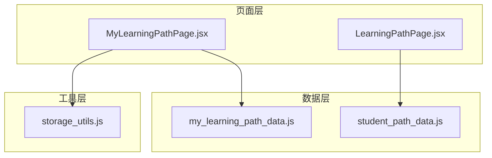
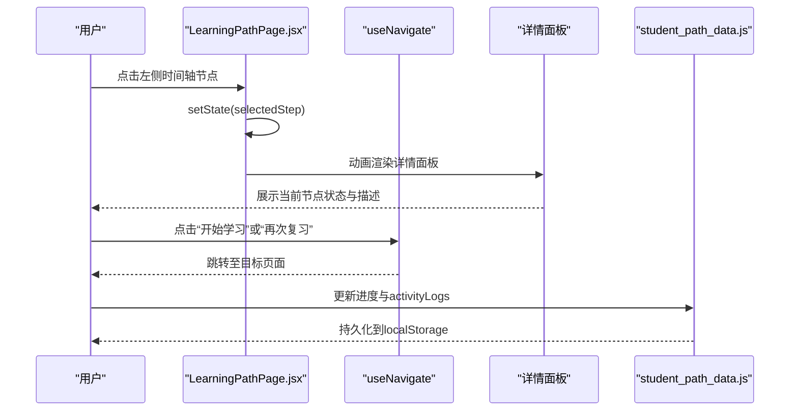
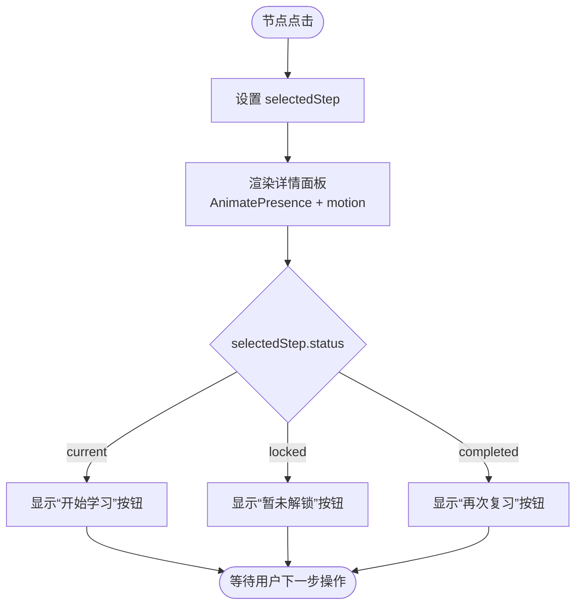
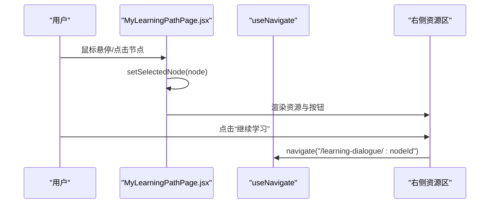
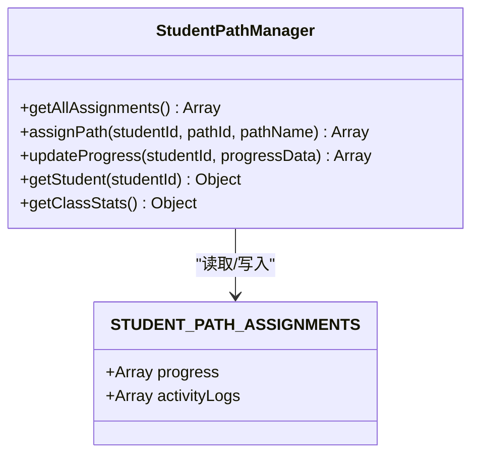
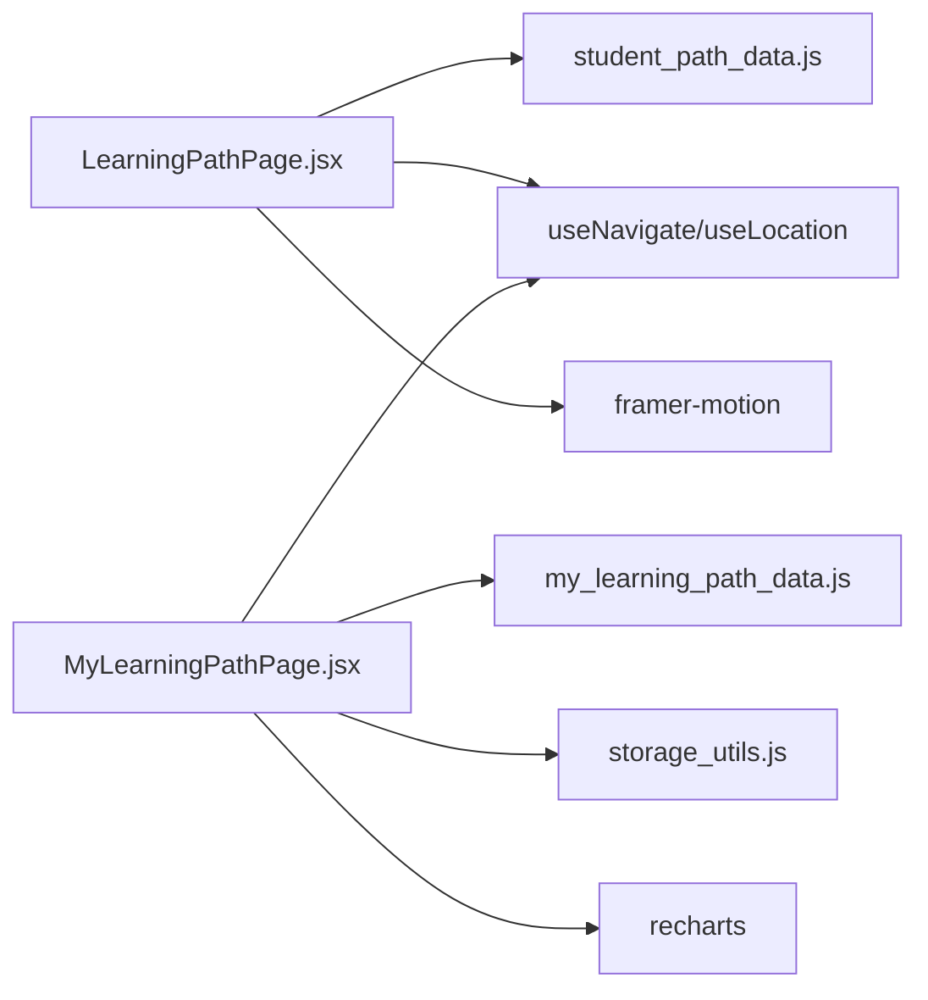

# 学习路径交互

<cite>
**本文引用的文件**
- [LearningPathPage.jsx](file://src/pages/LearningPathPage.jsx)
- [MyLearningPathPage.jsx](file://src/pages/MyLearningPathPage.jsx)
- [my_learning_path_data.js](file://src/data/my_learning_path_data.js)
- [student_path_data.js](file://src/data/student_path_data.js)
- [storage_utils.js](file://src/utils/storage_utils.js)
</cite>

## 目录
1. [引言](#引言)
2. [项目结构](#项目结构)
3. [核心组件](#核心组件)
4. [架构总览](#架构总览)
5. [详细组件分析](#详细组件分析)
6. [依赖分析](#依赖分析)
7. [性能考虑](#性能考虑)
8. [故障排查指南](#故障排查指南)
9. [结论](#结论)
10. [附录](#附录)

## 引言
本文件围绕 LearningPathPage.jsx 中“用户与学习路径”的交互逻辑展开，重点覆盖：
- 节点点击事件处理与 selectedStep 状态切换
- 详情面板的动画与状态联动
- 结合 my_learning_path_data.js 与 student_path_data.js 的进度数据模型，说明本地存储、状态同步与持久化策略
- selectedStep 状态管理、navigate 路由跳转以及 activityLogs 学习轨迹记录的实现方式
- 进度更新、节点解锁条件判断与路径完成状态检测的代码示例路径
- 多设备间状态同步的潜在扩展方案

## 项目结构
本仓库采用按页面与数据模块组织的前端结构，学习路径相关页面与数据分别位于 pages 与 data 目录；通用持久化工具位于 utils 目录。

图表来源
- [LearningPathPage.jsx](file://src/pages/LearningPathPage.jsx#L1-L166)
- [MyLearningPathPage.jsx](file://src/pages/MyLearningPathPage.jsx#L1-L200)
- [my_learning_path_data.js](file://src/data/my_learning_path_data.js#L1-L148)
- [student_path_data.js](file://src/data/student_path_data.js#L1-L305)
- [storage_utils.js](file://src/utils/storage_utils.js#L1-L180)

章节来源
- [LearningPathPage.jsx](file://src/pages/LearningPathPage.jsx#L1-L166)
- [MyLearningPathPage.jsx](file://src/pages/MyLearningPathPage.jsx#L1-L200)
- [my_learning_path_data.js](file://src/data/my_learning_path_data.js#L1-L148)
- [student_path_data.js](file://src/data/student_path_data.js#L1-L305)
- [storage_utils.js](file://src/utils/storage_utils.js#L1-L180)

## 核心组件
- LearningPathPage.jsx：展示学习路径时间轴与详情面板，支持节点点击切换 selectedStep，驱动详情面板渲染与按钮状态变化。
- MyLearningPathPage.jsx：展示流程图式学习路径，包含节点状态、连接关系、进度统计与导航跳转。
- my_learning_path_data.js：提供流程图节点与连接关系的数据模型，用于 MyLearningPathPage 的渲染与交互。
- student_path_data.js：提供学生路径分配、进度与 activityLogs 的数据模型，以及基于 localStorage 的持久化管理。
- storage_utils.js：提供通用学习报告数据的本地存储与更新工具，可作为多设备同步的参考实现。

章节来源
- [LearningPathPage.jsx](file://src/pages/LearningPathPage.jsx#L1-L166)
- [MyLearningPathPage.jsx](file://src/pages/MyLearningPathPage.jsx#L1-L200)
- [my_learning_path_data.js](file://src/data/my_learning_path_data.js#L1-L148)
- [student_path_data.js](file://src/data/student_path_data.js#L1-L305)
- [storage_utils.js](file://src/utils/storage_utils.js#L1-L180)

## 架构总览
下图展示了学习路径页面与数据模型之间的交互关系，以及路由与详情面板的联动。

图表来源
- [LearningPathPage.jsx](file://src/pages/LearningPathPage.jsx#L43-L165)
- [student_path_data.js](file://src/data/student_path_data.js#L223-L304)

## 详细组件分析

### LearningPathPage.jsx：节点点击与详情面板联动
- 节点点击事件处理
  - 时间轴节点通过 onClick 回调设置 selectedStep，从而触发详情面板的重新渲染与动画过渡。
  - 详情面板使用 AnimatePresence 与 motion 包裹，确保 key 基于 selectedStep.id，实现平滑的进入/退出动画。
- selectedStep 状态管理
  - 初始 selectedStep 由步骤数组中 status 为 current 的项确定，保证页面加载即聚焦当前节点。
  - 详情面板按钮状态依据 selectedStep.status 切换：current 显示“开始学习”，locked 显示“暂未解锁”，completed 显示“再次复习”。
- 详情面板更新机制
  - 详情面板内容根据 selectedStep 的类型(type)显示不同图标与描述；当 selectedStep 为空时提示“选择左侧节点查看详情”。

图表来源
- [LearningPathPage.jsx](file://src/pages/LearningPathPage.jsx#L43-L165)

章节来源
- [LearningPathPage.jsx](file://src/pages/LearningPathPage.jsx#L43-L165)

### MyLearningPathPage.jsx：流程图式学习路径与节点交互
- 节点状态与样式
  - getNodeStyle 根据节点 status 返回背景色、边框、阴影与图标，current 节点带脉冲效果，locked 节点显示锁图标。
- 连接关系渲染
  - renderConnections 基于 connections 数组绘制 SVG 路径，主干、分支与合并采用不同的虚线样式与箭头标记。
- 交互与导航
  - 节点 hover 时显示悬浮详情；点击节点后 setSelectedNode，右侧资源区展示对应资源与操作按钮。
  - 当节点为 current 时，点击“继续学习”弹出推荐模态并跳转至学习对话页。

图表来源
- [MyLearningPathPage.jsx](file://src/pages/MyLearningPathPage.jsx#L1-L200)
- [MyLearningPathPage.jsx](file://src/pages/MyLearningPathPage.jsx#L380-L579)

章节来源
- [MyLearningPathPage.jsx](file://src/pages/MyLearningPathPage.jsx#L1-L200)
- [MyLearningPathPage.jsx](file://src/pages/MyLearningPathPage.jsx#L380-L579)

### 数据模型与状态持久化

#### my_learning_path_data.js：流程图节点与连接关系
- flowNodes：包含阶段(stage)、标题(title)、状态(status)、位置(position)与颜色(color)，用于 MyLearningPathPage 的渲染与交互。
- connections：定义节点间的连接关系，区分 main、branch、merge 类型，用于绘制 SVG 路径。
- 使用场景：MyLearningPathPage 通过该数据源渲染节点与连线，并根据节点状态决定样式与交互。

章节来源
- [my_learning_path_data.js](file://src/data/my_learning_path_data.js#L1-L148)
- [MyLearningPathPage.jsx](file://src/pages/MyLearningPathPage.jsx#L1-L200)

#### student_path_data.js：进度与活动日志
- STUDENT_PATH_ASSIGNMENTS：包含每个学生的路径分配、进度(progress)与 activityLogs。
- progress 字段：completedNodes、currentNode、totalNodes、percentage，用于计算完成度与当前节点。
- activityLogs：记录学习轨迹，包含类型、时间戳、标题、时长、得分、状态等字段。
- StudentPathManager：封装 localStorage 的读写与进度更新，提供 getAllAssignments、assignPath、updateProgress 等静态方法，实现本地持久化。

图表来源
- [student_path_data.js](file://src/data/student_path_data.js#L223-L304)

章节来源
- [student_path_data.js](file://src/data/student_path_data.js#L1-L305)

#### storage_utils.js：通用本地存储工具
- 提供 getLearningData/saveLearningData/updateProgress/addAchievement 等方法，用于学习报告数据的读取、保存与更新。
- 可作为多设备同步的参考实现：统一的键名、时间戳字段、错误处理与导出导入功能。

章节来源
- [storage_utils.js](file://src/utils/storage_utils.js#L1-L180)

### 进度更新、节点解锁与完成状态检测

#### 进度更新
- 在 MyLearningPathPage 中，可通过 setSelectedNode 与右侧资源区的操作触发进度更新逻辑（示例路径）：
  - [MyLearningPathPage.jsx](file://src/pages/MyLearningPathPage.jsx#L500-L511)
- 在 LearningPathPage 中，selectedStep 的切换会驱动详情面板更新（示例路径）：
  - [LearningPathPage.jsx](file://src/pages/LearningPathPage.jsx#L118-L165)

#### 节点解锁条件判断
- MyLearningPathPage 中节点状态由数据模型决定，current 节点为“进行中”，completed 为“已完成”，其余为“未解锁”。（示例路径）
  - [MyLearningPathPage.jsx](file://src/pages/MyLearningPathPage.jsx#L49-L78)
  - [my_learning_path_data.js](file://src/data/my_learning_path_data.js#L33-L145)

#### 路径完成状态检测
- MyLearningPathPage 中通过统计 completedNodes 与 totalNodes 计算进度百分比。（示例路径）
  - [MyLearningPathPage.jsx](file://src/pages/MyLearningPathPage.jsx#L43-L48)

章节来源
- [MyLearningPathPage.jsx](file://src/pages/MyLearningPathPage.jsx#L43-L78)
- [my_learning_path_data.js](file://src/data/my_learning_path_data.js#L33-L145)

### selectedStep 状态管理、navigate 路由跳转与 activityLogs 记录

#### selectedStep 状态管理
- LearningPathPage 中通过 useState 管理 selectedStep，并在节点点击时更新状态，驱动详情面板渲染。（示例路径）
  - [LearningPathPage.jsx](file://src/pages/LearningPathPage.jsx#L43-L165)

#### navigate 路由跳转
- MyLearningPathPage 中通过 useNavigate 导航至学习对话页，携带节点 ID。（示例路径）
  - [MyLearningPathPage.jsx](file://src/pages/MyLearningPathPage.jsx#L19-L25)

#### activityLogs 学习轨迹记录
- student_path_data.js 中的 activityLogs 字段用于记录学习轨迹，包含类型、时间戳、标题、时长、得分、状态等。（示例路径）
  - [student_path_data.js](file://src/data/student_path_data.js#L98-L162)

章节来源
- [LearningPathPage.jsx](file://src/pages/LearningPathPage.jsx#L43-L165)
- [MyLearningPathPage.jsx](file://src/pages/MyLearningPathPage.jsx#L19-L25)
- [student_path_data.js](file://src/data/student_path_data.js#L98-L162)

## 依赖分析
- 组件耦合
  - LearningPathPage.jsx 与 MyLearningPathPage.jsx 分别消费各自的数据模型，耦合度低，便于独立演进。
  - MyLearningPathPage.jsx 依赖 my_learning_path_data.js 的数据结构，渲染流程图与连接关系。
  - student_path_data.js 通过 localStorage 提供持久化能力，StudentPathManager 封装了读写与进度更新。
- 外部依赖
  - react-router-dom 的 useNavigate/useLocation 提供路由控制。
  - framer-motion 的 motion/AnimatePresence 提供动画过渡。
  - lucide-react 图标库与 recharts 图表库用于界面与可视化。

图表来源
- [LearningPathPage.jsx](file://src/pages/LearningPathPage.jsx#L1-L166)
- [MyLearningPathPage.jsx](file://src/pages/MyLearningPathPage.jsx#L1-L200)
- [my_learning_path_data.js](file://src/data/my_learning_path_data.js#L1-L148)
- [student_path_data.js](file://src/data/student_path_data.js#L1-L305)
- [storage_utils.js](file://src/utils/storage_utils.js#L1-L180)

章节来源
- [LearningPathPage.jsx](file://src/pages/LearningPathPage.jsx#L1-L166)
- [MyLearningPathPage.jsx](file://src/pages/MyLearningPathPage.jsx#L1-L200)
- [my_learning_path_data.js](file://src/data/my_learning_path_data.js#L1-L148)
- [student_path_data.js](file://src/data/student_path_data.js#L1-L305)
- [storage_utils.js](file://src/utils/storage_utils.js#L1-L180)

## 性能考虑
- 动画与渲染
  - 使用 AnimatePresence/motion 控制面板进出动画，避免不必要的重排；建议在大量节点时启用虚拟滚动或分页。
- 状态更新
  - selectedStep 仅在节点点击时更新，避免频繁重渲染；详情面板 key 基于 selectedStep.id，确保每次切换都触发动画。
- 数据访问
  - student_path_data.js 的 StudentPathManager 通过 localStorage 读写，注意避免在高频更新场景中频繁序列化/反序列化；可在批量更新后一次性写入。
- 图表与连接线
  - MyLearningPathPage 的 SVG 连接线在节点较多时可能带来渲染压力，建议在渲染时进行节流或限制节点数量。

## 故障排查指南
- 节点点击无效
  - 检查 selectedStep 是否被正确设置，确认 onClick 回调是否绑定到节点容器。（示例路径）
    - [LearningPathPage.jsx](file://src/pages/LearningPathPage.jsx#L69-L115)
- 详情面板不显示
  - 确认 selectedStep 是否存在且 key 唯一；检查 AnimatePresence 的 key 与 selectedStep.id 是否一致。（示例路径）
    - [LearningPathPage.jsx](file://src/pages/LearningPathPage.jsx#L118-L165)
- 路由跳转失败
  - 检查 useNavigate 的目标路径是否存在；确认 MyLearningPathPage 的 navigate 调用参数正确。（示例路径）
    - [MyLearningPathPage.jsx](file://src/pages/MyLearningPathPage.jsx#L19-L25)
- 进度未持久化
  - 检查 localStorage 是否可用；确认 StudentPathManager.updateProgress 的调用与存储键名一致。（示例路径）
    - [student_path_data.js](file://src/data/student_path_data.js#L260-L271)

章节来源
- [LearningPathPage.jsx](file://src/pages/LearningPathPage.jsx#L69-L165)
- [MyLearningPathPage.jsx](file://src/pages/MyLearningPathPage.jsx#L19-L25)
- [student_path_data.js](file://src/data/student_path_data.js#L260-L271)

## 结论
- LearningPathPage.jsx 通过 selectedStep 状态与详情面板联动，实现了清晰的节点交互体验。
- MyLearningPathPage.jsx 以流程图形式呈现学习路径，节点状态与连接关系由数据模型驱动，交互直观。
- student_path_data.js 提供了完善的进度与轨迹数据模型，并通过 StudentPathManager 实现本地持久化。
- 建议在现有基础上引入统一的状态管理与多设备同步策略，以进一步提升用户体验与数据一致性。

## 附录

### 多设备间状态同步的潜在扩展方案
- 本地存储到云端
  - 在 storage_utils.js 的基础上，增加云端同步接口，将本地数据上传/下载，实现跨设备一致。
- WebSocket/Server-Sent Events
  - 在用户登录后建立长连接，实时推送进度变更与解锁通知，减少轮询开销。
- 版本控制与冲突解决
  - 为进度数据引入版本号与时间戳，发生冲突时采用“最后修改者优先”或“合并策略”。
- 缓存与离线策略
  - 采用 IndexedDB 或浏览器缓存策略，保障在网络不稳定时仍可继续学习与记录轨迹。