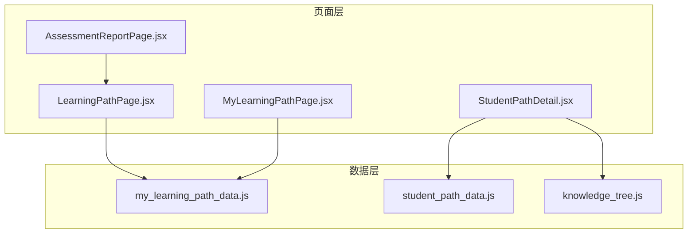
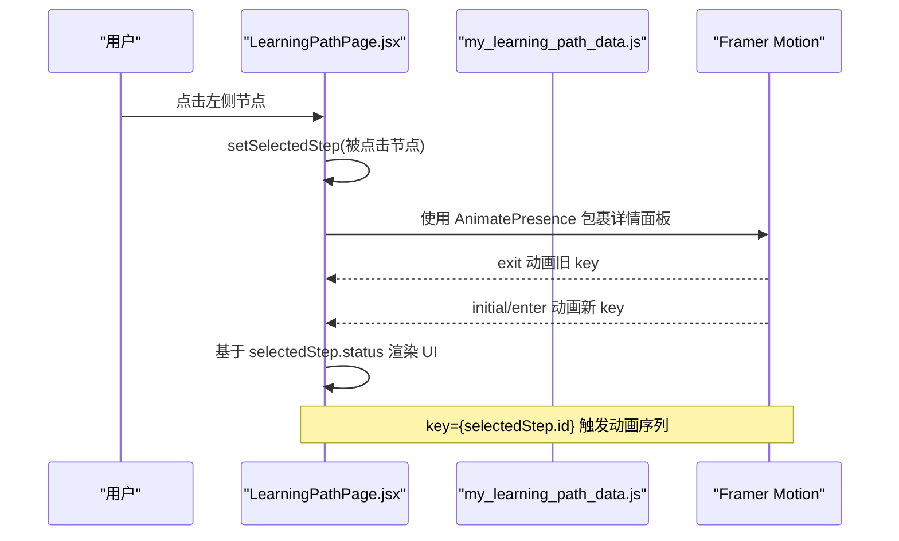
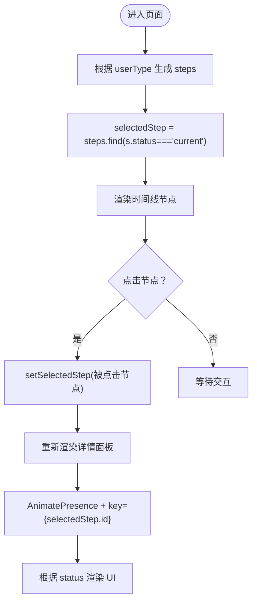
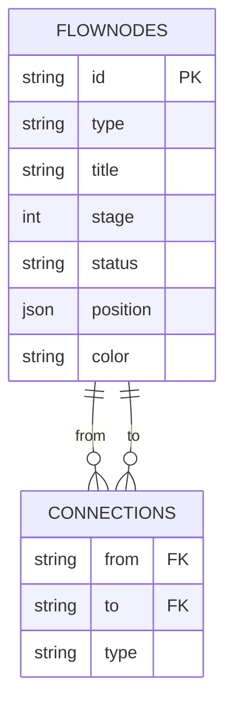
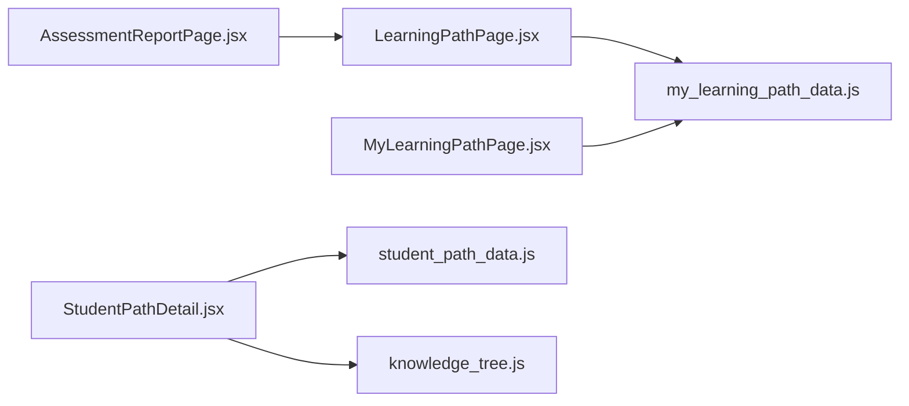

# 学习路径状态管理

<cite>
**本文引用的文件**
- [LearningPathPage.jsx](file://src/pages/LearningPathPage.jsx)
- [my_learning_path_data.js](file://src/data/my_learning_path_data.js)
- [AssessmentReportPage.jsx](file://src/pages/AssessmentReportPage.jsx)
- [MyLearningPathPage.jsx](file://src/pages/MyLearningPathPage.jsx)
- [StudentPathDetail.jsx](file://src/pages/StudentPathDetail.jsx)
- [student_path_data.js](file://src/data/student_path_data.js)
- [knowledge_tree.js](file://src/data/knowledge_tree.js)
</cite>

## 目录
1. [引言](#引言)
2. [项目结构](#项目结构)
3. [核心组件](#核心组件)
4. [架构总览](#架构总览)
5. [详细组件分析](#详细组件分析)
6. [依赖分析](#依赖分析)
7. [性能考虑](#性能考虑)
8. [故障排查指南](#故障排查指南)
9. [结论](#结论)
10. [附录](#附录)

## 引言
本文件聚焦于学习路径页面中“当前学习节点”的状态绑定与动画同步机制，结合数据层 flowNodes 结构，系统梳理初始化逻辑、状态更新流程、节点状态判定规则以及 UI 映射关系；同时给出 Framer Motion 动画与 React 状态同步的实现方式，并提供性能优化建议与扩展多步骤并行学习状态模型的思路。

## 项目结构
围绕学习路径状态管理的相关文件主要分布在 pages 与 data 目录：
- 页面层：LearningPathPage.jsx、AssessmentReportPage.jsx、MyLearningPathPage.jsx、StudentPathDetail.jsx
- 数据层：my_learning_path_data.js、student_path_data.js、knowledge_tree.js

图表来源
- [LearningPathPage.jsx](file://src/pages/LearningPathPage.jsx#L1-L166)
- [AssessmentReportPage.jsx](file://src/pages/AssessmentReportPage.jsx#L1-L320)
- [MyLearningPathPage.jsx](file://src/pages/MyLearningPathPage.jsx#L1-L673)
- [StudentPathDetail.jsx](file://src/pages/StudentPathDetail.jsx#L1-L361)
- [my_learning_path_data.js](file://src/data/my_learning_path_data.js#L1-L148)
- [student_path_data.js](file://src/data/student_path_data.js#L1-L305)
- [knowledge_tree.js](file://src/data/knowledge_tree.js#L1-L378)

章节来源
- [LearningPathPage.jsx](file://src/pages/LearningPathPage.jsx#L1-L166)
- [AssessmentReportPage.jsx](file://src/pages/AssessmentReportPage.jsx#L1-L320)
- [MyLearningPathPage.jsx](file://src/pages/MyLearningPathPage.jsx#L1-L673)
- [StudentPathDetail.jsx](file://src/pages/StudentPathDetail.jsx#L1-L361)
- [my_learning_path_data.js](file://src/data/my_learning_path_data.js#L1-L148)
- [student_path_data.js](file://src/data/student_path_data.js#L1-L305)
- [knowledge_tree.js](file://src/data/knowledge_tree.js#L1-L378)

## 核心组件
- LearningPathPage.jsx：基于用户类型动态生成学习步骤列表，使用 useState 维护 selectedStep，并通过 Framer Motion 实现节点与详情面板的动画过渡。
- my_learning_path_data.js：提供 flowNodes（阶段/分支节点）与 connections（连接关系），作为流程图数据源。
- AssessmentReportPage.jsx：与 LearningPathPage 类似的“时间线+详情”布局，同样使用 selectedStep 状态驱动详情面板。
- MyLearningPathPage.jsx：使用 my_learning_path_data.js 的 flowNodes 与 connections 渲染 SVG 流程图，维护 selectedNode 与 hoveredNode 状态。
- StudentPathDetail.jsx：基于学生路径数据构建路径节点数组，使用 completed/current/upcoming 状态，展示学习进度与轨迹。
- student_path_data.js：提供 MOCK_STUDENTS、STUDENT_PATH_ASSIGNMENTS 与 StudentPathManager，支撑学生路径与进度管理。
- knowledge_tree.js：提供知识点树结构与辅助查询工具，用于路径可视化与详情展示。

章节来源
- [LearningPathPage.jsx](file://src/pages/LearningPathPage.jsx#L1-L166)
- [AssessmentReportPage.jsx](file://src/pages/AssessmentReportPage.jsx#L1-L320)
- [MyLearningPathPage.jsx](file://src/pages/MyLearningPathPage.jsx#L1-L673)
- [StudentPathDetail.jsx](file://src/pages/StudentPathDetail.jsx#L1-L361)
- [my_learning_path_data.js](file://src/data/my_learning_path_data.js#L1-L148)
- [student_path_data.js](file://src/data/student_path_data.js#L1-L305)
- [knowledge_tree.js](file://src/data/knowledge_tree.js#L1-L378)

## 架构总览
学习路径状态管理由“页面状态 + 数据层结构 + 动画同步”三部分组成：
- 页面状态：selectedStep（LearningPathPage/AssessmentReportPage）、selectedNode/hoveredNode（MyLearningPathPage）、pathNodes（StudentPathDetail）。
- 数据层结构：flowNodes（阶段/分支节点）、connections（连接关系）、学生路径进度数据。
- 动画同步：Framer Motion 的 AnimatePresence/motion 组件与 React 状态键（key）联动，确保切换时触发动画。

图表来源
- [LearningPathPage.jsx](file://src/pages/LearningPathPage.jsx#L118-L165)
- [my_learning_path_data.js](file://src/data/my_learning_path_data.js#L1-L148)

## 详细组件分析

### LearningPathPage.jsx：useState 与 selectedStep 的绑定机制
- 初始化逻辑
  - 根据 userType 动态生成 steps 列表（包含 id、title、type、status、score 等字段）。
  - 使用 useState 初始化 selectedStep：selectedStep = steps.find(s => s.status === 'current')。
- 状态更新流程
  - 左侧时间线项点击事件调用 setSelectedStep(step)，触发重新渲染。
  - 详情面板使用 AnimatePresence + motion，key={selectedStep.id}，确保每次 selectedStep 变化时触发动画。
- UI 映射关系
  - 节点指示器：completed/current/locked 三种状态分别映射不同颜色与尺寸。
  - 详情按钮：current 锁定 disabled；locked 显示“暂未解锁”；completed 显示“再次复习”。

图表来源
- [LearningPathPage.jsx](file://src/pages/LearningPathPage.jsx#L11-L165)

章节来源
- [LearningPathPage.jsx](file://src/pages/LearningPathPage.jsx#L1-L166)

### my_learning_path_data.js：flowNodes 结构与状态判定
- flowNodes 字段
  - id、type（stage/branch）、title、stage、status（completed/current/locked）、position（x,y）、color。
- 状态判定规则
  - completed：已完成。
  - current：当前进行中。
  - locked：未解锁（默认）。
- 连接关系 connections
  - from/to 定义节点间的拓扑关系，type 支持 main/branch/merge，用于渲染流程图连线样式。

图表来源
- [my_learning_path_data.js](file://src/data/my_learning_path_data.js#L34-L145)

章节来源
- [my_learning_path_data.js](file://src/data/my_learning_path_data.js#L1-L148)

### AssessmentReportPage.jsx：与 LearningPathPage 类似的状态绑定
- 初始化与更新逻辑同 LearningPathPage，使用 selectedStep 控制右侧详情面板。
- 动画与 UI 映射一致：current/current/locked 三态映射到不同按钮与样式。

章节来源
- [AssessmentReportPage.jsx](file://src/pages/AssessmentReportPage.jsx#L1-L320)

### MyLearningPathPage.jsx：SVG 流程图与节点状态
- 数据来源：my_learning_path_data.js 的 flowNodes 与 connections。
- 状态绑定：selectedNode/hoveredNode 两个状态分别控制详情与悬停提示。
- 连接线渲染：根据 connections 计算贝塞尔曲线路径，区分 branch/main/merge。
- 节点样式：completed/current/locked 三态映射到不同背景色、边框、阴影与脉冲效果。

章节来源
- [MyLearningPathPage.jsx](file://src/pages/MyLearningPathPage.jsx#L1-L673)
- [my_learning_path_data.js](file://src/data/my_learning_path_data.js#L1-L148)

### StudentPathDetail.jsx：基于学生路径数据的节点状态
- 数据来源：student_path_data.js 的 STUDENT_PATH_ASSIGNMENTS 与 KNOWLEDGE_TREE。
- 节点状态：completed/current/upcoming 三态，来源于 completedNodes 与 currentNode。
- 渲染：时间线样式展示，连接线根据是否完成而变色。

章节来源
- [StudentPathDetail.jsx](file://src/pages/StudentPathDetail.jsx#L1-L361)
- [student_path_data.js](file://src/data/student_path_data.js#L1-L305)
- [knowledge_tree.js](file://src/data/knowledge_tree.js#L1-L378)

## 依赖分析
- 组件耦合
  - LearningPathPage 与 AssessmentReportPage 共享相同 selectedStep 状态与 UI 映射策略。
  - MyLearningPathPage 依赖 my_learning_path_data.js 的 flowNodes/connections。
  - StudentPathDetail 依赖 student_path_data.js 与 knowledge_tree.js。
- 外部依赖
  - Framer Motion：AnimatePresence、motion 用于动画过渡与出场入场。
  - Lucide Icons：PlayCircle、CheckCircle、Lock、BookOpen、Star 等图标。
  - Recharts：AssessmentReportPage 中的图表组件。

图表来源
- [LearningPathPage.jsx](file://src/pages/LearningPathPage.jsx#L1-L166)
- [AssessmentReportPage.jsx](file://src/pages/AssessmentReportPage.jsx#L1-L320)
- [MyLearningPathPage.jsx](file://src/pages/MyLearningPathPage.jsx#L1-L673)
- [StudentPathDetail.jsx](file://src/pages/StudentPathDetail.jsx#L1-L361)
- [my_learning_path_data.js](file://src/data/my_learning_path_data.js#L1-L148)
- [student_path_data.js](file://src/data/student_path_data.js#L1-L305)
- [knowledge_tree.js](file://src/data/knowledge_tree.js#L1-L378)

## 性能考虑
- 避免不必要的重渲染
  - 将 steps 作为常量数组或使用 useMemo 缓存，减少每次渲染的计算开销。
  - 在 MyLearningPathPage 中，flowNodes/connections 已在组件外定义，渲染时直接使用，避免重复构造。
  - 使用 key={selectedStep.id} 或 key={selectedNode.id} 精准触发动画与重渲染，避免整块区域重绘。
- 动画与状态同步
  - AnimatePresence 的 exit/initial/animate/exit 生命周期与 React 状态变化强关联，确保 key 唯一且稳定。
  - 在 MyLearningPathPage 中，hoveredNode 仅用于 UI 提示，不参与动画 key，避免干扰主状态切换。
- 扩展多步骤并行学习状态模型
  - 当前 selectedStep 为单值；若要支持并行学习，可将 selectedStep 改为数组或 Map（id -> 节点），并在 UI 上按状态分组渲染。
  - 为每个并行节点单独维护一个 key，确保各自动画独立执行。
  - 在数据层增加并行节点集合与依赖关系，保证解锁条件与进度推进逻辑清晰。

章节来源
- [LearningPathPage.jsx](file://src/pages/LearningPathPage.jsx#L118-L165)
- [MyLearningPathPage.jsx](file://src/pages/MyLearningPathPage.jsx#L1-L673)

## 故障排查指南
- 详情面板不出现
  - 检查 selectedStep 是否存在（steps.find(s => s.status === 'current')）。
  - 确认 AnimatePresence 的包裹范围与 key 是否随 selectedStep 变化。
- 动画不生效
  - 确保 key={selectedStep.id} 与 selectedStep 的 id 唯一且稳定。
  - 检查 AnimatePresence 的 mode="wait" 与 exit/initial/animate 的配置。
- 节点状态不正确
  - 核对 my_learning_path_data.js 中 flowNodes 的 status 字段是否符合预期。
  - 在 MyLearningPathPage 中确认 getNodeStyle 的状态映射逻辑与 UI 样式一致。

章节来源
- [LearningPathPage.jsx](file://src/pages/LearningPathPage.jsx#L118-L165)
- [AssessmentReportPage.jsx](file://src/pages/AssessmentReportPage.jsx#L158-L242)
- [MyLearningPathPage.jsx](file://src/pages/MyLearningPathPage.jsx#L1-L673)
- [my_learning_path_data.js](file://src/data/my_learning_path_data.js#L1-L148)

## 结论
LearningPathPage.jsx 通过 useState(selectedStep) 与 Framer Motion 的 AnimatePresence/motion 实现了“时间线节点点击 -> 详情面板切换”的流畅体验。结合 my_learning_path_data.js 的 flowNodes 结构，节点状态（completed/current/locked）在 UI 上有明确映射。为满足更复杂的并行学习场景，可在现有基础上扩展为多节点状态模型，并保持动画与状态的稳定同步。

## 附录
- 状态字段对照
  - completed：已完成
  - current：当前进行中
  - locked：未解锁
  - upcoming：未来节点（StudentPathDetail.jsx）

章节来源
- [StudentPathDetail.jsx](file://src/pages/StudentPathDetail.jsx#L1-L361)
- [my_learning_path_data.js](file://src/data/my_learning_path_data.js#L1-L148)