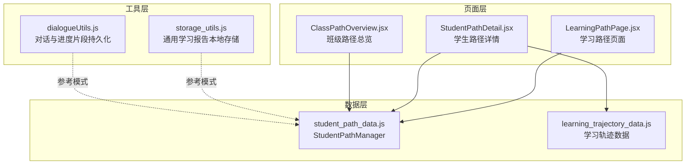
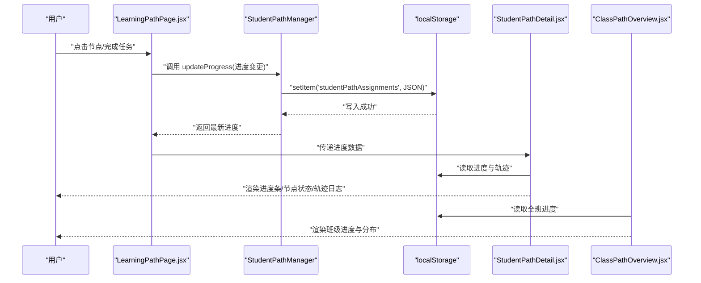
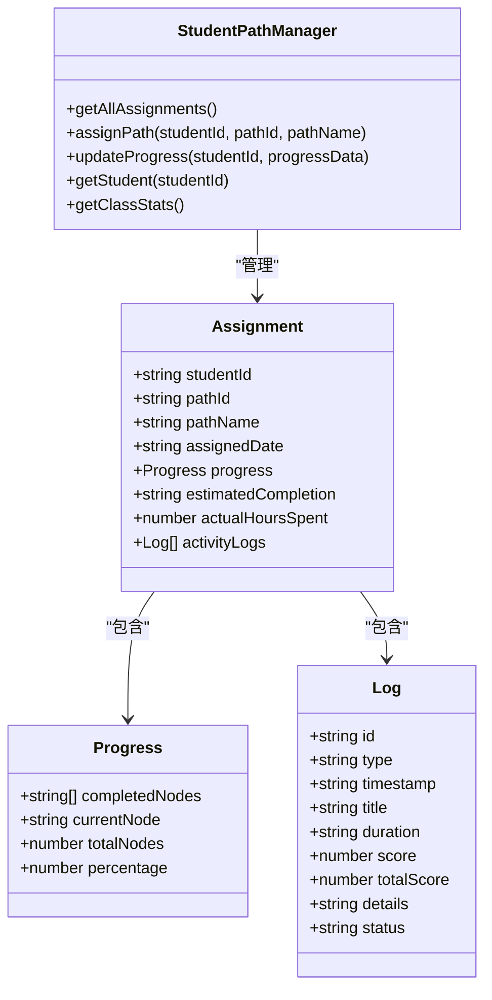
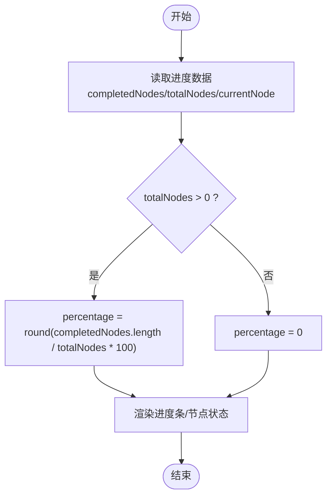
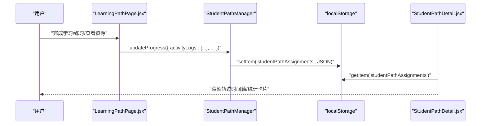
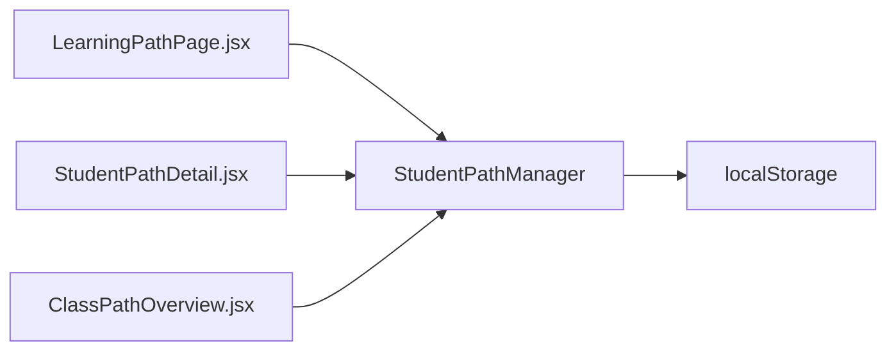

# 学习进度同步与持久化

<cite>
**本文引用的文件**
- [student_path_data.js](file://src/data/student_path_data.js)
- [LearningPathPage.jsx](file://src/pages/LearningPathPage.jsx)
- [StudentPathDetail.jsx](file://src/pages/StudentPathDetail.jsx)
- [ClassPathOverview.jsx](file://src/pages/ClassPathOverview.jsx)
- [storage_utils.js](file://src/utils/storage_utils.js)
- [learning_trajectory_data.js](file://src/data/learning_trajectory_data.js)
- [dialogueUtils.js](file://src/utils/dialogueUtils.js)
</cite>

## 目录
1. [引言](#引言)
2. [项目结构](#项目结构)
3. [核心组件](#核心组件)
4. [架构总览](#架构总览)
5. [详细组件分析](#详细组件分析)
6. [依赖分析](#依赖分析)
7. [性能考虑](#性能考虑)
8. [故障排查指南](#故障排查指南)
9. [结论](#结论)
10. [附录](#附录)

## 引言
本文件围绕“学习进度的本地存储策略与数据持久化机制”展开，结合 StudentPathManager 类的 updateProgress 方法与 activityLogs 学习轨迹日志设计，剖析 completedNodes 数组的更新逻辑、percentage 进度计算方式以及 localStorage 同步时机；同时结合 LearningPathPage.jsx 中的用户交互行为，说明进度数据如何在前端页面中被消费与展示，并讨论 activityLogs 在学习行为分析中的应用价值，以及跨设备同步时可能面临的冲突解决策略与数据一致性保障方案。

## 项目结构
本项目采用按功能域划分的组织方式，学习路径与进度相关的核心代码集中在以下位置：
- 数据层：src/data/student_path_data.js 提供学生路径分配与进度管理的数据结构与持久化接口
- 页面层：src/pages/LearningPathPage.jsx、StudentPathDetail.jsx、ClassPathOverview.jsx 展示进度与交互
- 工具层：src/utils/storage_utils.js 提供通用学习报告数据的本地存储工具
- 辅助数据：src/data/learning_trajectory_data.js 提供学习轨迹回放数据
- 其他持久化示例：src/utils/dialogueUtils.js 展示基于 localStorage 的会话与进度片段持久化

图表来源
- [student_path_data.js](file://src/data/student_path_data.js#L223-L305)
- [LearningPathPage.jsx](file://src/pages/LearningPathPage.jsx#L1-L166)
- [StudentPathDetail.jsx](file://src/pages/StudentPathDetail.jsx#L1-L361)
- [ClassPathOverview.jsx](file://src/pages/ClassPathOverview.jsx#L1-L251)
- [storage_utils.js](file://src/utils/storage_utils.js#L1-L438)
- [learning_trajectory_data.js](file://src/data/learning_trajectory_data.js#L1-L121)
- [dialogueUtils.js](file://src/utils/dialogueUtils.js#L1-L91)

章节来源
- [student_path_data.js](file://src/data/student_path_data.js#L1-L305)
- [LearningPathPage.jsx](file://src/pages/LearningPathPage.jsx#L1-L166)
- [StudentPathDetail.jsx](file://src/pages/StudentPathDetail.jsx#L1-L361)
- [ClassPathOverview.jsx](file://src/pages/ClassPathOverview.jsx#L1-L251)
- [storage_utils.js](file://src/utils/storage_utils.js#L1-L438)
- [learning_trajectory_data.js](file://src/data/learning_trajectory_data.js#L1-L121)
- [dialogueUtils.js](file://src/utils/dialogueUtils.js#L1-L91)

## 核心组件
- StudentPathManager：提供学生路径分配、进度更新、统计计算与本地持久化
- LearningPathPage：展示学习路径节点与交互入口，承载用户行为触发点
- StudentPathDetail：渲染学生路径详情、进度统计与学习轨迹日志
- ClassPathOverview：展示班级整体进度与路径分布
- storage_utils：提供通用学习报告数据的本地存储工具，可作为持久化模式参考
- learning_trajectory_data：提供学习轨迹回放数据，用于轨迹可视化
- dialogueUtils：提供对话与进度片段的 localStorage 持久化示例

章节来源
- [student_path_data.js](file://src/data/student_path_data.js#L223-L305)
- [LearningPathPage.jsx](file://src/pages/LearningPathPage.jsx#L1-L166)
- [StudentPathDetail.jsx](file://src/pages/StudentPathDetail.jsx#L1-L361)
- [ClassPathOverview.jsx](file://src/pages/ClassPathOverview.jsx#L1-L251)
- [storage_utils.js](file://src/utils/storage_utils.js#L1-L438)
- [learning_trajectory_data.js](file://src/data/learning_trajectory_data.js#L1-L121)
- [dialogueUtils.js](file://src/utils/dialogueUtils.js#L1-L91)

## 架构总览
下图展示了“学习进度与轨迹”的端到端数据流：页面交互触发进度更新，StudentPathManager 将进度写入 localStorage；页面组件读取并渲染进度与轨迹；同时提供轨迹回放与班级总览视图。

图表来源
- [student_path_data.js](file://src/data/student_path_data.js#L260-L271)
- [LearningPathPage.jsx](file://src/pages/LearningPathPage.jsx#L1-L166)
- [StudentPathDetail.jsx](file://src/pages/StudentPathDetail.jsx#L1-L361)
- [ClassPathOverview.jsx](file://src/pages/ClassPathOverview.jsx#L1-L251)

## 详细组件分析

### StudentPathManager 与 updateProgress 持久化策略
- 数据结构
  - 学生路径分配包含 progress 字段，其中 completedNodes 为字符串数组，currentNode 为当前节点标识，totalNodes 为总节点数，percentage 为百分比进度
  - activityLogs 为学习轨迹日志数组，每条日志包含类型、时间戳、标题、时长/分数、详情与状态等字段
- 进度更新
  - updateProgress 接收进度变更对象，合并到现有进度并立即写入 localStorage
  - 该方法确保每次进度变更都即时持久化，避免页面刷新丢失
- 本地存储
  - 使用 localStorage 键名为 studentPathAssignments，序列化后保存
  - 读取时若无数据则回退到内置的 MOCK 数据集合
- 统计与分布
  - getClassStats 计算平均进度与路径分布，便于班级总览展示

图表来源
- [student_path_data.js](file://src/data/student_path_data.js#L82-L220)
- [student_path_data.js](file://src/data/student_path_data.js#L223-L305)

章节来源
- [student_path_data.js](file://src/data/student_path_data.js#L82-L220)
- [student_path_data.js](file://src/data/student_path_data.js#L223-L305)

### completedNodes 更新逻辑与 percentage 计算
- completedNodes 更新逻辑
  - 页面交互（如完成节点）应调用 StudentPathManager.updateProgress，传入包含 completedNodes 的增量对象
  - 由于 updateProgress 会对现有进度进行浅合并，因此只需提供需要变更的字段即可
- percentage 计算方式
  - 页面侧常见做法：percentage = Math.round((completedNodes.length / totalNodes) * 100)
  - 在详情页与班级总览中均可见到该计算方式的应用
- currentNode 与 totalNodes
  - currentNode 用于标识当前进行中的节点
  - totalNodes 由路径配置决定，用于计算百分比与节点进度

图表来源
- [StudentPathDetail.jsx](file://src/pages/StudentPathDetail.jsx#L1-L361)
- [ClassPathOverview.jsx](file://src/pages/ClassPathOverview.jsx#L1-L251)

章节来源
- [StudentPathDetail.jsx](file://src/pages/StudentPathDetail.jsx#L1-L361)
- [ClassPathOverview.jsx](file://src/pages/ClassPathOverview.jsx#L1-L251)

### activityLogs 学习轨迹日志结构与写入流程
- 结构设计
  - 每条日志包含唯一 id、类型（study/exercise/resource/agent/system）、时间戳、标题、时长/分数、详情与状态
  - 支持按类型区分图标与样式，便于可视化呈现
- 写入流程
  - 页面交互完成后，调用 StudentPathManager.updateProgress 并传入 activityLogs 或将其追加到现有日志数组
  - updateProgress 会将完整 assignments 写回 localStorage，确保日志持久化
- 可视化与分析
  - StudentPathDetail.jsx 展示学习轨迹时间轴，支持按类型分类与排序
  - 可用于学习行为分析：识别高频学习时段、偏好学习资源类型、练习得分趋势等

图表来源
- [student_path_data.js](file://src/data/student_path_data.js#L260-L271)
- [StudentPathDetail.jsx](file://src/pages/StudentPathDetail.jsx#L269-L355)
- [LearningPathPage.jsx](file://src/pages/LearningPathPage.jsx#L1-L166)

章节来源
- [student_path_data.js](file://src/data/student_path_data.js#L82-L220)
- [StudentPathDetail.jsx](file://src/pages/StudentPathDetail.jsx#L269-L355)
- [LearningPathPage.jsx](file://src/pages/LearningPathPage.jsx#L1-L166)

### 页面交互与进度展示
- LearningPathPage.jsx
  - 提供学习路径节点的交互入口，承载用户行为（开始学习、再次复习、解锁下一节点等）
  - 通过状态管理 selectedStep 控制详情面板与节点状态
- StudentPathDetail.jsx
  - 读取并渲染学生进度：百分比、已完成节点数、总节点数、学习时长、能力雷达
  - 渲染学习轨迹日志，支持按类型与时间排序
- ClassPathOverview.jsx
  - 读取全班进度，展示平均进度、路径分布与每个学生的进度条

章节来源
- [LearningPathPage.jsx](file://src/pages/LearningPathPage.jsx#L1-L166)
- [StudentPathDetail.jsx](file://src/pages/StudentPathDetail.jsx#L1-L361)
- [ClassPathOverview.jsx](file://src/pages/ClassPathOverview.jsx#L1-L251)

### 本地存储策略与同步时机
- 策略
  - 使用 localStorage 作为单一持久化介质，键名为 studentPathAssignments
  - 所有进度变更（包括 completedNodes、percentage、currentNode、activityLogs 等）通过 updateProgress 合并后一次性写入
- 同步时机
  - 用户完成节点或产生学习行为后立即调用 updateProgress
  - 页面挂载时读取 localStorage 初始化状态
- 一致性保障
  - 采用“读取-合并-写回”的原子性操作，避免并发覆盖
  - 若需跨标签页共享，可监听 storage 事件进行同步（当前代码未实现）

章节来源
- [student_path_data.js](file://src/data/student_path_data.js#L223-L271)
- [StudentPathDetail.jsx](file://src/pages/StudentPathDetail.jsx#L1-L361)
- [ClassPathOverview.jsx](file://src/pages/ClassPathOverview.jsx#L1-L251)

### 跨设备同步与冲突解决
- 现状
  - 当前实现仅使用 localStorage，无法直接跨设备同步
- 建议方案
  - 增加 storage 事件监听：任一标签页写入后，其他标签页收到 storage 事件并刷新本地状态
  - 引入版本号或时间戳字段：写入时携带 lastModified，读取时比较版本，冲突时采用“最后修改者获胜”或“合并策略”
  - 服务端同步：将 localStorage 数据定期上传至后端，多端拉取最新快照，冲突时采用“时间戳+操作日志合并”
  - 乐观锁：在 updateProgress 中加入版本号参数，若版本不匹配则拒绝更新并提示用户刷新

[本节为通用实践建议，不直接分析具体源码文件]

## 依赖分析
- 组件耦合
  - StudentPathDetail 与 ClassPathOverview 依赖 StudentPathManager 的读取接口
  - LearningPathPage 作为交互入口，最终通过 Manager 完成持久化
- 数据流向
  - 页面 -> Manager -> localStorage -> 页面渲染
- 外部依赖
  - localStorage 作为唯一外部持久化介质
  - 无第三方持久化库依赖

图表来源
- [student_path_data.js](file://src/data/student_path_data.js#L223-L305)
- [LearningPathPage.jsx](file://src/pages/LearningPathPage.jsx#L1-L166)
- [StudentPathDetail.jsx](file://src/pages/StudentPathDetail.jsx#L1-L361)
- [ClassPathOverview.jsx](file://src/pages/ClassPathOverview.jsx#L1-L251)

章节来源
- [student_path_data.js](file://src/data/student_path_data.js#L223-L305)
- [LearningPathPage.jsx](file://src/pages/LearningPathPage.jsx#L1-L166)
- [StudentPathDetail.jsx](file://src/pages/StudentPathDetail.jsx#L1-L361)
- [ClassPathOverview.jsx](file://src/pages/ClassPathOverview.jsx#L1-L251)

## 性能考虑
- localStorage 读写
  - 单次写入整个 assignments 对象，避免频繁小粒度更新
  - 读取时进行 JSON 解析，建议在页面初始化阶段集中处理
- 渲染优化
  - 使用 React 状态管理与 memo 化减少不必要的重渲染
  - 进度计算在渲染前完成，避免重复计算
- 数据规模
  - activityLogs 随时间增长，建议在详情页实现分页或懒加载，避免一次性渲染过多日志项

[本节提供一般性指导，不直接分析具体源码文件]

## 故障排查指南
- 无法读取进度
  - 检查 localStorage 中是否存在 studentPathAssignments 键
  - 若为空，确认是否正确调用 updateProgress 或使用默认数据回退逻辑
- 进度不更新
  - 确认调用 updateProgress 的参数是否包含需要变更的字段（如 completedNodes、percentage）
  - 检查页面是否重新渲染并读取最新数据
- 轨迹日志缺失
  - 确认 activityLogs 是否随交互写入
  - 检查日志类型与时间戳格式是否符合预期
- 跨设备不同步
  - 当前未实现 storage 事件监听，建议增加监听并在标签页间同步

章节来源
- [student_path_data.js](file://src/data/student_path_data.js#L223-L271)
- [StudentPathDetail.jsx](file://src/pages/StudentPathDetail.jsx#L269-L355)

## 结论
本系统通过 StudentPathManager 将学习进度与轨迹日志统一持久化至 localStorage，实现了“即时更新、即刻生效”的本地持久化策略。completedNodes 与 totalNodes 的组合使 percentage 计算简单可靠，activityLogs 为学习行为分析提供了丰富的原始数据。页面层通过多种视图（路径详情、班级总览、轨迹回放）直观呈现进度与行为。为进一步提升用户体验与数据可靠性，建议引入跨标签页同步与冲突解决机制，并在大规模日志场景下优化渲染与存储策略。

## 附录
- 学习轨迹回放数据
  - learning_trajectory_data.js 提供历史学习节点与统计概览，可用于轨迹回放页面的数据支撑
- 对话与进度片段持久化示例
  - dialogueUtils.js 展示了基于 localStorage 的对话历史与学习进度片段持久化模式，可作为扩展持久化策略的参考

章节来源
- [learning_trajectory_data.js](file://src/data/learning_trajectory_data.js#L1-L121)
- [dialogueUtils.js](file://src/utils/dialogueUtils.js#L1-L91)