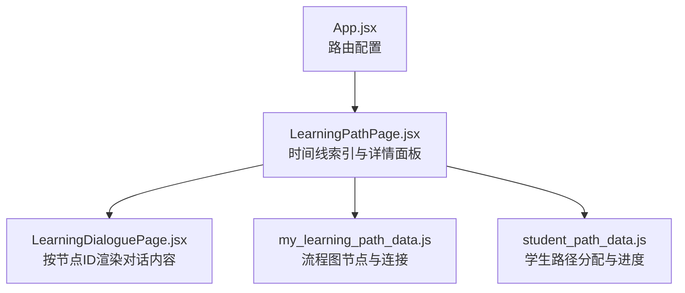
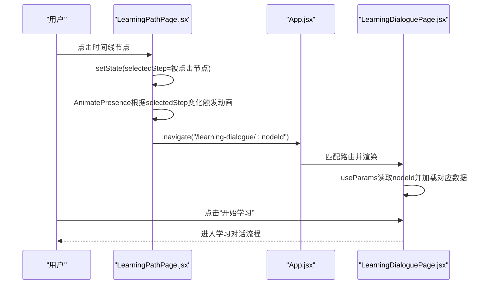
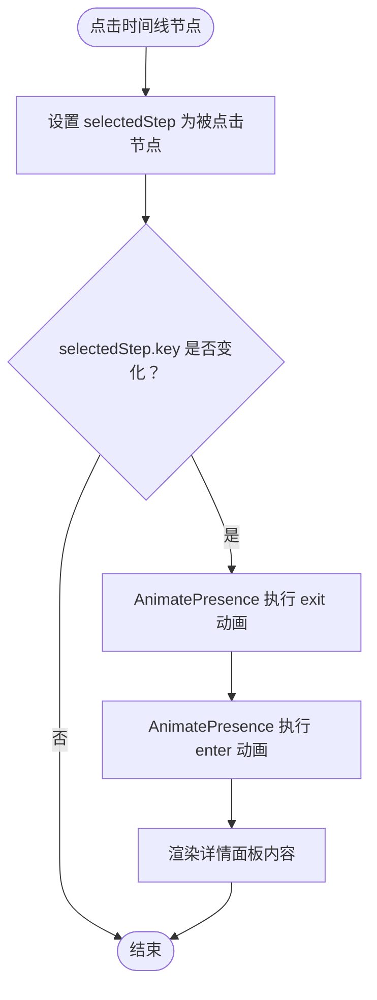
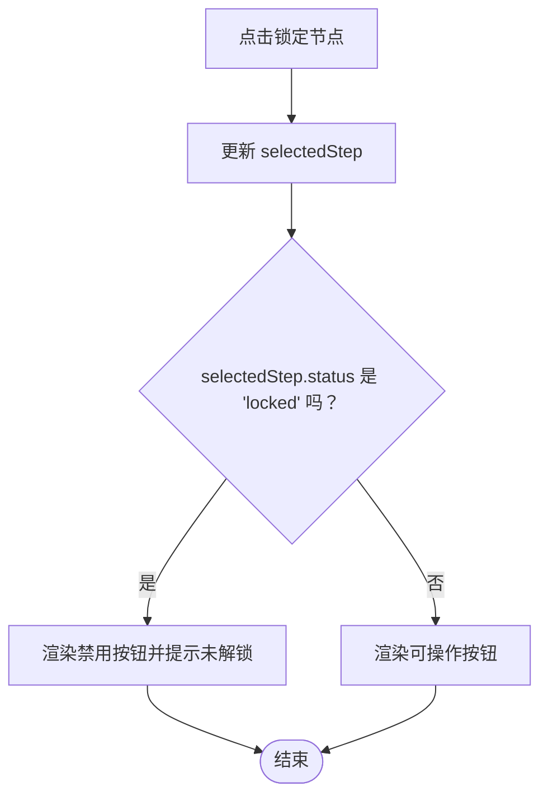
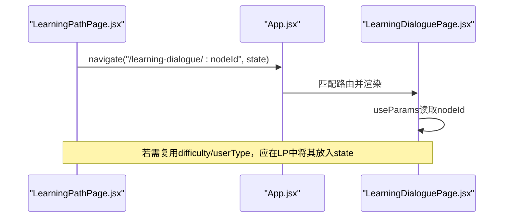
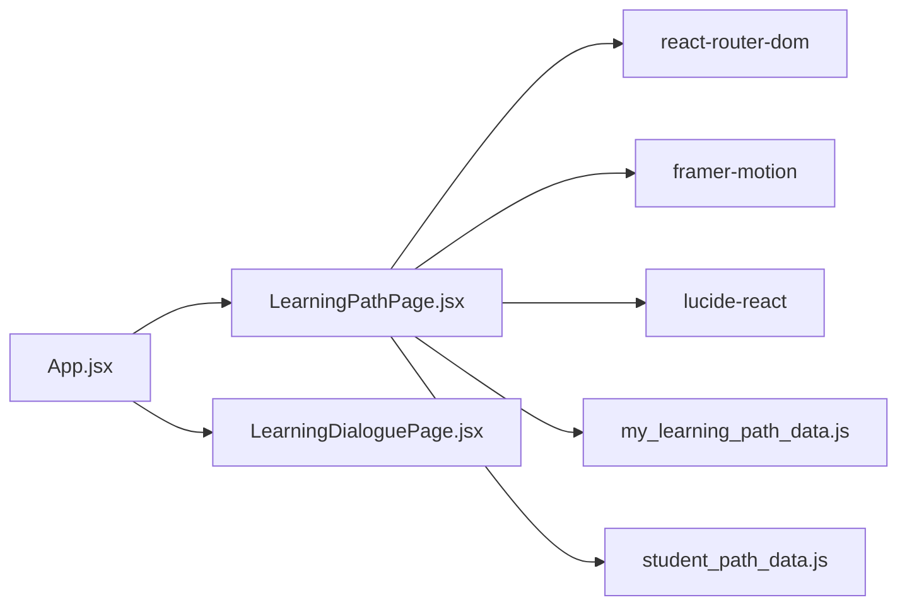

# 用户交互响应机制

<cite>
**本文引用的文件**
- [LearningPathPage.jsx](file://src/pages/LearningPathPage.jsx)
- [my_learning_path_data.js](file://src/data/my_learning_path_data.js)
- [student_path_data.js](file://src/data/student_path_data.js)
- [LearningDialoguePage.jsx](file://src/pages/LearningDialoguePage.jsx)
- [App.jsx](file://src/App.jsx)
- [MyLearningPathPage.jsx](file://src/pages/MyLearningPathPage.jsx)
</cite>

## 目录
1. [引言](#引言)
2. [项目结构](#项目结构)
3. [核心组件](#核心组件)
4. [架构总览](#架构总览)
5. [详细组件分析](#详细组件分析)
6. [依赖分析](#依赖分析)
7. [性能考虑](#性能考虑)
8. [故障排查指南](#故障排查指南)
9. [结论](#结论)

## 引言
本文件聚焦于 LearningPathPage.jsx 中时间线节点的交互响应机制，包括：
- timeline 节点 onClick 事件如何更新 selectedStep 状态
- selectedStep 的变化如何驱动详情面板的 AnimatePresence 动画切换
- 结合 my_learning_path_data.js 的节点状态与 student_path_data.js 的路径配置，说明“点击锁定节点”时的权限校验流程与用户提示机制
- “开始学习”按钮的路由跳转逻辑（useNavigate）与上下文状态传递实现
- 增强交互体验的优化建议（加载状态、防重复点击、操作回退）

## 项目结构
与本主题直接相关的文件与职责如下：
- LearningPathPage.jsx：展示个性化学习路径的时间线视图，支持节点点击查看详情、状态切换与“开始学习”跳转
- my_learning_path_data.js：提供流程图节点与连接关系的数据源，用于 MyLearningPathPage 的可视化路径
- student_path_data.js：提供学生路径分配与进度数据，用于教师端或后台管理场景
- LearningDialoguePage.jsx：学习对话页面，接收节点 ID 参数并渲染对应的学习内容
- App.jsx：路由配置，包含 /learning-path 与 /learning-dialogue/:nodeId

图表来源
- [App.jsx](file://src/App.jsx#L50-L101)
- [LearningPathPage.jsx](file://src/pages/LearningPathPage.jsx#L1-L166)
- [LearningDialoguePage.jsx](file://src/pages/LearningDialoguePage.jsx#L1-L200)
- [my_learning_path_data.js](file://src/data/my_learning_path_data.js#L1-L148)
- [student_path_data.js](file://src/data/student_path_data.js#L1-L305)

章节来源
- [App.jsx](file://src/App.jsx#L50-L101)

## 核心组件
- LearningPathPage.jsx
  - 状态：使用 useState 维护 selectedStep；根据 userType/difficulty 动态生成步骤列表
  - 交互：timeline 节点 onClick 设置 selectedStep；详情面板基于 selectedStep 渲染
  - 动画：AnimatePresence + motion 实现详情面板的进入/退出过渡
  - 路由：useNavigate 用于返回与跳转学习对话页
- my_learning_path_data.js
  - 提供 flowNodes（含 status）、connections 等数据，用于路径可视化与节点状态判断
- student_path_data.js
  - 提供 MOCK_STUDENTS、STUDENT_PATH_ASSIGNMENTS、StudentPathManager 等，支撑路径分配与进度管理
- LearningDialoguePage.jsx
  - 通过 useParams 获取 nodeId，按节点 ID 渲染对话与学习资源
- App.jsx
  - 定义 /learning-path 与 /learning-dialogue/:nodeId 路由

章节来源
- [LearningPathPage.jsx](file://src/pages/LearningPathPage.jsx#L1-L166)
- [my_learning_path_data.js](file://src/data/my_learning_path_data.js#L1-L148)
- [student_path_data.js](file://src/data/student_path_data.js#L1-L305)
- [LearningDialoguePage.jsx](file://src/pages/LearningDialoguePage.jsx#L1-L200)
- [App.jsx](file://src/App.jsx#L50-L101)

## 架构总览
下图展示了从时间线节点点击到详情面板动画切换，再到“开始学习”按钮跳转学习对话页的整体流程。

图表来源
- [LearningPathPage.jsx](file://src/pages/LearningPathPage.jsx#L65-L165)
- [App.jsx](file://src/App.jsx#L50-L101)
- [LearningDialoguePage.jsx](file://src/pages/LearningDialoguePage.jsx#L1-L200)

## 详细组件分析

### 时间线节点 onClick 与 selectedStep 状态变更
- 点击行为
  - timeline 节点的 onClick 回调直接设置 selectedStep 为当前节点
  - 该回调位于时间线条目容器上，确保每次点击都会更新详情面板所绑定的状态
- selectedStep 变更与详情面板动画
  - 详情面板外层使用 AnimatePresence，并以 selectedStep.id 作为 key
  - 当 selectedStep 改变时，key 发生变化，触发 AnimatePresence 的 exit/enter 动画序列
  - 动画采用 motion 元素包裹，分别定义初始、进入与退出状态，保证平滑过渡

图表来源
- [LearningPathPage.jsx](file://src/pages/LearningPathPage.jsx#L65-L165)

章节来源
- [LearningPathPage.jsx](file://src/pages/LearningPathPage.jsx#L65-L165)

### 锁定节点的权限校验与用户提示
- 数据来源
  - 节点状态来自 my_learning_path_data.js 的 flowNodes 数组，其中包含 status 字段（completed/current/locked）
- 权限校验与提示
  - 在 LearningPathPage.jsx 中，详情面板按钮根据 selectedStep.status 渲染不同状态：
    - current：显示“开始学习”按钮
    - locked：显示禁用按钮并带有锁图标与“暂未解锁”的提示
    - completed：显示“再次复习”按钮
  - 当用户点击 locked 节点时，selectedStep 会更新为该节点，但按钮保持禁用状态，从而形成“可选中但不可操作”的提示
- 实际业务校验建议
  - 若存在后端权限或前置条件（例如前置节点必须完成），可在 onClick 中增加条件判断：
    - 若前置节点未完成则阻止 selectedStep 更新并弹出提示
    - 或在按钮点击时进行校验，若不满足条件则弹窗提示并阻断导航
  - 当前代码未实现后端校验，仅通过前端状态控制按钮可用性

图表来源
- [LearningPathPage.jsx](file://src/pages/LearningPathPage.jsx#L139-L151)
- [my_learning_path_data.js](file://src/data/my_learning_path_data.js#L34-L145)

章节来源
- [LearningPathPage.jsx](file://src/pages/LearningPathPage.jsx#L139-L151)
- [my_learning_path_data.js](file://src/data/my_learning_path_data.js#L34-L145)

### “开始学习”按钮的路由跳转与上下文传递
- 路由跳转
  - 当 selectedStep.status 为 current 时，详情面板渲染“开始学习”按钮
  - 点击该按钮后，页面通过 useNavigate 导航至 /learning-dialogue/:nodeId
  - 路由在 App.jsx 中已配置，匹配到 LearningDialoguePage.jsx
- 上下文状态传递
  - LearningPathPage.jsx 通过 location.state 传入 difficulty 与 userType
  - LearningDialoguePage.jsx 通过 useParams 获取 nodeId，但未直接消费 location.state
  - 若需要在学习对话页复用 userType/difficulty 等上下文，可在导航时将这些字段合并到 state 中传递

图表来源
- [LearningPathPage.jsx](file://src/pages/LearningPathPage.jsx#L1-L166)
- [App.jsx](file://src/App.jsx#L50-L101)
- [LearningDialoguePage.jsx](file://src/pages/LearningDialoguePage.jsx#L1-L200)

章节来源
- [LearningPathPage.jsx](file://src/pages/LearningPathPage.jsx#L1-L166)
- [App.jsx](file://src/App.jsx#L50-L101)
- [LearningDialoguePage.jsx](file://src/pages/LearningDialoguePage.jsx#L1-L200)

### 与学生路径配置的关联
- student_path_data.js 提供：
  - MOCK_STUDENTS：学生基本信息与能力画像
  - STUDENT_PATH_ASSIGNMENTS：学生路径分配、进度与活动日志
  - StudentPathManager：路径分配与进度更新的本地存储封装
- 与 LearningPathPage 的关系
  - LearningPathPage.jsx 通过 userType/difficulty 动态生成步骤列表，体现不同学习风格与难度下的路径差异
  - 若需要将“完成前置节点”等规则与实际进度联动，可结合 STUDENT_PATH_ASSIGNMENTS 的 completedNodes/currentNode 字段进行校验

章节来源
- [student_path_data.js](file://src/data/student_path_data.js#L1-L305)
- [LearningPathPage.jsx](file://src/pages/LearningPathPage.jsx#L1-L166)

## 依赖分析
- 组件耦合
  - LearningPathPage.jsx 依赖 react-router-dom 的 useNavigate/useLocation，依赖 framer-motion 的 AnimatePresence/motion
  - 与 my_learning_path_data.js 的耦合体现在节点状态与类型，但未直接读取其 flowNodes
  - 与 student_path_data.js 的耦合体现在 userType/difficulty 的动态生成，但未直接读取其路径分配
- 外部依赖
  - lucide-react 图标库用于界面元素
  - 路由配置集中在 App.jsx，确保 /learning-dialogue/:nodeId 的正确匹配

图表来源
- [LearningPathPage.jsx](file://src/pages/LearningPathPage.jsx#L1-L166)
- [App.jsx](file://src/App.jsx#L50-L101)
- [LearningDialoguePage.jsx](file://src/pages/LearningDialoguePage.jsx#L1-L200)
- [my_learning_path_data.js](file://src/data/my_learning_path_data.js#L1-L148)
- [student_path_data.js](file://src/data/student_path_data.js#L1-L305)

章节来源
- [LearningPathPage.jsx](file://src/pages/LearningPathPage.jsx#L1-L166)
- [App.jsx](file://src/App.jsx#L50-L101)

## 性能考虑
- 动画开销
  - AnimatePresence + motion 在节点切换时会产生布局与重绘，建议：
    - 控制动画时长与缓动，避免复杂阴影与大尺寸缩放
    - 详情面板内容尽量轻量，避免在动画期间执行昂贵计算
- 状态更新
  - selectedStep 的频繁切换可能导致不必要的重渲染，建议：
    - 使用 React.memo 或 useMemo 优化详情面板子组件
    - 将大型数据结构拆分为独立模块，按需加载
- 路由跳转
  - navigate 为客户端路由切换，性能开销较低；若需预加载学习对话页数据，可在进入详情页前发起异步请求

## 故障排查指南
- 点击节点后详情面板不更新
  - 检查 selectedStep 是否被正确设置（确保 onClick 回调未被覆盖）
  - 确认 AnimatePresence 的 key 是否随 selectedStep.id 变化
- 锁定节点按钮仍可点击
  - 确认 selectedStep.status 为 locked 且按钮处于禁用状态
  - 如需更强的校验，可在 onClick 中加入前置条件判断
- 跳转学习对话页失败
  - 检查 App.jsx 中 /learning-dialogue/:nodeId 路由是否正确配置
  - 确认 navigate 的目标路径与 params 是否匹配
- 上下文状态丢失
  - 若需要在学习对话页复用 userType/difficulty，需在 LearningPathPage.jsx 的导航中将这些字段放入 state

章节来源
- [LearningPathPage.jsx](file://src/pages/LearningPathPage.jsx#L65-L165)
- [App.jsx](file://src/App.jsx#L50-L101)
- [LearningDialoguePage.jsx](file://src/pages/LearningDialoguePage.jsx#L1-L200)

## 结论
- LearningPathPage.jsx 通过 onClick 更新 selectedStep，配合 AnimatePresence 实现详情面板的流畅切换
- 锁定节点的权限校验目前由前端状态控制，可通过在 onClick 中增加前置条件与提示进一步完善
- “开始学习”按钮使用 useNavigate 跳转学习对话页，建议在导航时传递上下文状态以提升一致性
- 建议引入加载状态、防重复点击与操作回退，以增强交互稳定性与用户体验