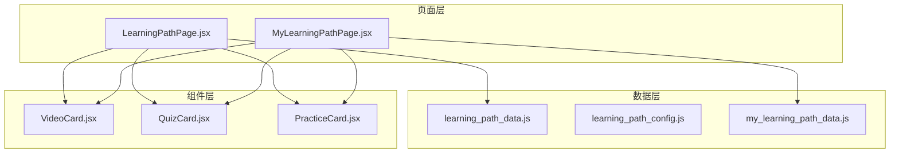
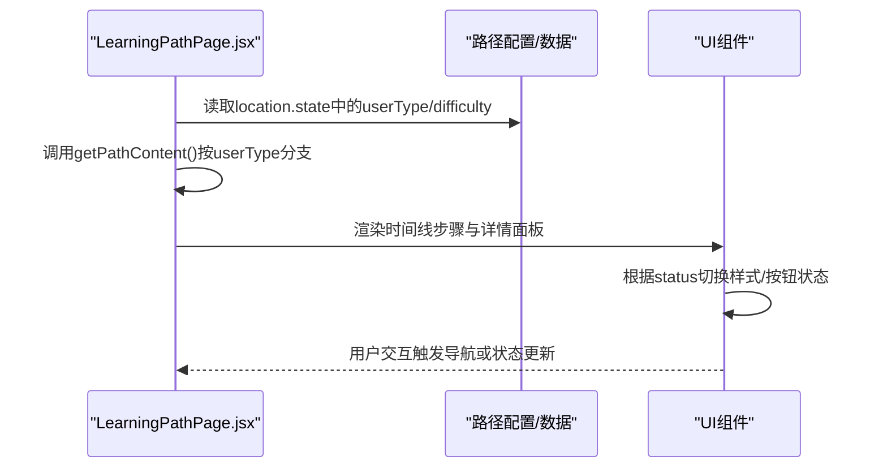
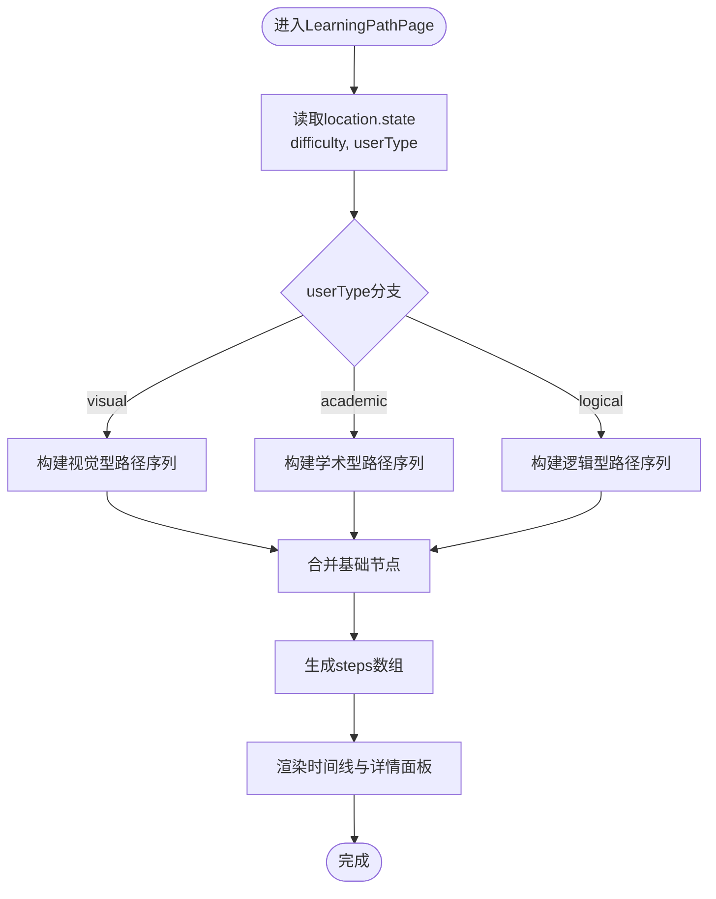
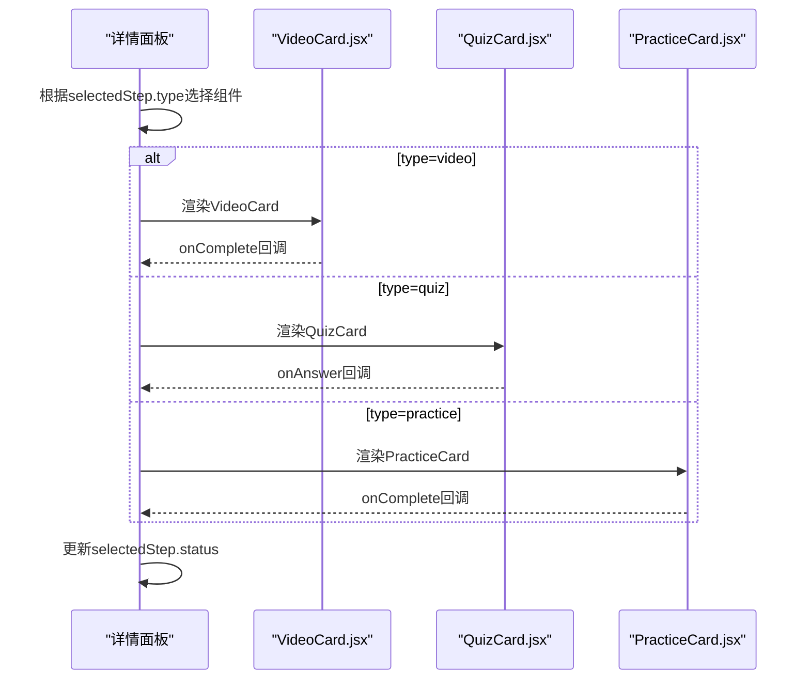
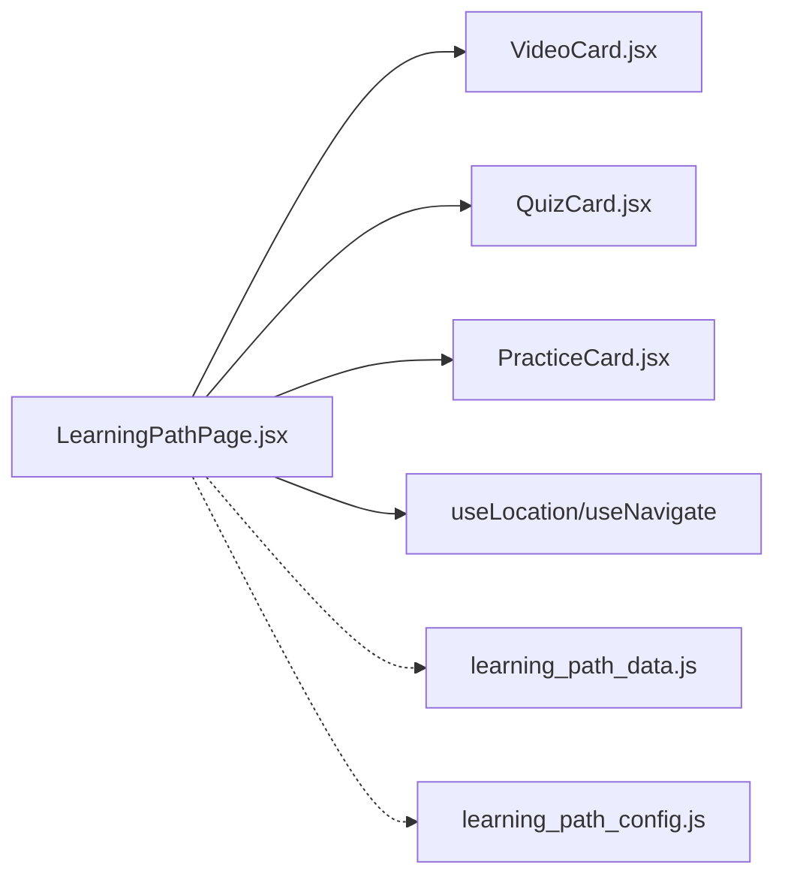

# 学习路径内容生成

<cite>
**本文引用的文件**
- [LearningPathPage.jsx](file://src/pages/LearningPathPage.jsx)
- [learning_path_data.js](file://src/data/learning_path_data.js)
- [learning_path_config.js](file://src/data/learning_path_config.js)
- [VideoCard.jsx](file://src/components/chat-widgets/VideoCard.jsx)
- [QuizCard.jsx](file://src/components/chat-widgets/QuizCard.jsx)
- [PracticeCard.jsx](file://src/components/chat-widgets/PracticeCard.jsx)
- [MyLearningPathPage.jsx](file://src/pages/MyLearningPathPage.jsx)
- [my_learning_path_data.js](file://src/data/my_learning_path_data.js)
- [UnifiedAssessmentPage.jsx](file://src/pages/UnifiedAssessmentPage.jsx)
- [StyleSelector.jsx](file://src/components/chat-widgets/StyleSelector.jsx)
</cite>

## 目录
1. [引言](#引言)
2. [项目结构](#项目结构)
3. [核心组件](#核心组件)
4. [架构总览](#架构总览)
5. [详细组件分析](#详细组件分析)
6. [依赖分析](#依赖分析)
7. [性能考虑](#性能考虑)
8. [故障排查指南](#故障排查指南)
9. [结论](#结论)
10. [附录](#附录)

## 引言
本文件聚焦于 LearningPathPage.jsx 中的 getPathContent 函数，系统性解析其如何依据用户类型（visual/academic/logical）动态构建学习路径内容。文档将结合 learning_path_data.js 的 pathNodes 结构，阐明静态数据与动态逻辑的协同机制；详细说明路径节点（视频、测验、练习等）的数据结构设计与状态映射关系（id、title、type、status、score 等），并给出基于 userType 参数的分支判断示例与在个性化推荐系统中的作用。最后，解释数据驱动的 UI 渲染模式如何支持灵活的路径配置与扩展。

## 项目结构
本项目采用按页面与数据分离的组织方式：
- 页面层：pages 下包含各业务页面，如 LearningPathPage.jsx、MyLearningPathPage.jsx 等
- 数据层：data 下包含学习路径、能力模型、配置等数据文件
- 组件层：components 下包含通用 UI 组件，如 VideoCard、QuizCard、PracticeCard 等

图表来源
- [LearningPathPage.jsx](file://src/pages/LearningPathPage.jsx#L1-L166)
- [learning_path_data.js](file://src/data/learning_path_data.js#L1-L182)
- [learning_path_config.js](file://src/data/learning_path_config.js#L1-L180)
- [VideoCard.jsx](file://src/components/chat-widgets/VideoCard.jsx#L1-L73)
- [QuizCard.jsx](file://src/components/chat-widgets/QuizCard.jsx#L1-L79)
- [PracticeCard.jsx](file://src/components/chat-widgets/PracticeCard.jsx#L1-L272)
- [MyLearningPathPage.jsx](file://src/pages/MyLearningPathPage.jsx#L1-L673)
- [my_learning_path_data.js](file://src/data/my_learning_path_data.js#L1-L148)

章节来源
- [LearningPathPage.jsx](file://src/pages/LearningPathPage.jsx#L1-L166)
- [learning_path_data.js](file://src/data/learning_path_data.js#L1-L182)
- [learning_path_config.js](file://src/data/learning_path_config.js#L1-L180)
- [VideoCard.jsx](file://src/components/chat-widgets/VideoCard.jsx#L1-L73)
- [QuizCard.jsx](file://src/components/chat-widgets/QuizCard.jsx#L1-L79)
- [PracticeCard.jsx](file://src/components/chat-widgets/PracticeCard.jsx#L1-L272)
- [MyLearningPathPage.jsx](file://src/pages/MyLearningPathPage.jsx#L1-L673)
- [my_learning_path_data.js](file://src/data/my_learning_path_data.js#L1-L148)

## 核心组件
- LearningPathPage.jsx：负责接收用户类型（userType）与难度（difficulty），通过 getPathContent 动态生成步骤列表，并渲染时间线与详情面板。
- learning_path_data.js：提供“我的学习路径”页面使用的 pathNodes 与 connections，用于流程图展示与节点状态管理。
- learning_path_config.js：提供学习路径对象与 AI 分析工具，支持路径持久化与分析建议。
- VideoCard.jsx、QuizCard.jsx、PracticeCard.jsx：分别承载视频播放、测验答题、练习题交互的 UI 与行为。

章节来源
- [LearningPathPage.jsx](file://src/pages/LearningPathPage.jsx#L1-L166)
- [learning_path_data.js](file://src/data/learning_path_data.js#L1-L182)
- [learning_path_config.js](file://src/data/learning_path_config.js#L1-L180)
- [VideoCard.jsx](file://src/components/chat-widgets/VideoCard.jsx#L1-L73)
- [QuizCard.jsx](file://src/components/chat-widgets/QuizCard.jsx#L1-L79)
- [PracticeCard.jsx](file://src/components/chat-widgets/PracticeCard.jsx#L1-L272)

## 架构总览
LearningPathPage.jsx 的渲染流程由“动态内容生成 + 组件渲染 + 状态驱动 UI”构成。getPathContent 基于 userType 返回不同类型的节点序列，再由时间线与详情面板组件进行渲染。同时，MyLearningPathPage.jsx 展示了另一种“静态数据 + 状态映射”的路径视图，二者共同体现了数据驱动的 UI 设计。

图表来源
- [LearningPathPage.jsx](file://src/pages/LearningPathPage.jsx#L1-L166)
- [VideoCard.jsx](file://src/components/chat-widgets/VideoCard.jsx#L1-L73)
- [QuizCard.jsx](file://src/components/chat-widgets/QuizCard.jsx#L1-L79)
- [PracticeCard.jsx](file://src/components/chat-widgets/PracticeCard.jsx#L1-L272)

## 详细组件分析

### LearningPathPage.jsx 中的 getPathContent 函数
- 输入参数：来自 location.state 的 difficulty 与 userType
- 输出：步骤数组 steps，每个元素包含 id、title、type、status、score、description 等字段
- 动态分支逻辑：
  - userType === 'visual'：返回以视频为主的路径序列，强调“可视化演示”
  - userType === 'academic'：返回以练习/阅读为主的路径序列，强调“实战演练”
  - 其他情况（logical）：返回以阅读/思维导图为主的路径序列，强调“逻辑推导”
- 基础节点：固定包含两个基础节点（视频与测验），作为所有分支的起点
- 状态映射：
  - status: 'completed'/'current'/'locked' 对应完成、进行中、未解锁
  - score: 仅在已完成节点显示，用于展示学习成果
  - description: 用于详情面板的补充说明
- 与 UI 的协作：
  - 时间线节点根据 status 切换颜色与图标
  - 详情面板根据 type 渲染不同的图标与按钮状态
  - selectedStep 用于控制右侧详情面板的展示

图表来源
- [LearningPathPage.jsx](file://src/pages/LearningPathPage.jsx#L1-L166)

章节来源
- [LearningPathPage.jsx](file://src/pages/LearningPathPage.jsx#L1-L166)

### 路径节点数据结构与状态映射
- 字段说明（以 LearningPathPage.jsx 的步骤为例）：
  - id：唯一标识，用于选中态与动画键值
  - title：节点标题，用于时间线与详情面板展示
  - type：节点类型，决定 UI 图标与交互组件
  - status：节点状态，决定样式与按钮可用性
  - score：仅在已完成时显示，用于展示分数
  - description：用于详情面板的补充说明
- 状态映射关系：
  - completed：完成态，显示勾选图标与分数
  - current：进行中，放大高亮、带阴影与脉冲效果
  - locked：未解锁，禁用按钮、浅色文字
- 类型映射关系：
  - video：播放图标
  - quiz：星形图标
  - practice：书本图标
  - reading：书本图标（在 academic 分支中出现）

章节来源
- [LearningPathPage.jsx](file://src/pages/LearningPathPage.jsx#L1-L166)

### learning_path_data.js 中的 pathNodes 结构
- 结构要点：
  - pathNodes：节点数组，包含 id、label、stage、status、progress、description、stats、position、color 等字段
  - connections：连接关系数组，定义节点间的流向
- 与 LearningPathPage.jsx 的差异：
  - learning_path_data.js 的 pathNodes 更偏向“流程图式”的路径规划，强调阶段与分支
  - LearningPathPage.jsx 的步骤更偏向“任务式”的学习路径，强调节点类型与状态
- 协同机制：
  - 两者均可用于“我的学习路径”视图，前者用于流程图展示，后者用于任务清单与详情面板
  - 在实际项目中，可根据业务场景选择其一或组合使用

章节来源
- [learning_path_data.js](file://src/data/learning_path_data.js#L1-L182)
- [MyLearningPathPage.jsx](file://src/pages/MyLearningPathPage.jsx#L1-L673)
- [my_learning_path_data.js](file://src/data/my_learning_path_data.js#L1-L148)

### 组件级交互与数据流
- VideoCard.jsx：模拟视频播放，完成后回调通知上层
- QuizCard.jsx：处理选择题作答，提交后反馈正确与否
- PracticeCard.jsx：处理练习题集，逐题评分并在完成后汇总结果
- 与 LearningPathPage.jsx 的集成：
  - 详情面板根据 selectedStep 的 type 渲染对应组件
  - 组件完成回调可用于更新步骤状态（例如从 current 切换为 completed）

图表来源
- [LearningPathPage.jsx](file://src/pages/LearningPathPage.jsx#L1-L166)
- [VideoCard.jsx](file://src/components/chat-widgets/VideoCard.jsx#L1-L73)
- [QuizCard.jsx](file://src/components/chat-widgets/QuizCard.jsx#L1-L79)
- [PracticeCard.jsx](file://src/components/chat-widgets/PracticeCard.jsx#L1-L272)

章节来源
- [VideoCard.jsx](file://src/components/chat-widgets/VideoCard.jsx#L1-L73)
- [QuizCard.jsx](file://src/components/chat-widgets/QuizCard.jsx#L1-L79)
- [PracticeCard.jsx](file://src/components/chat-widgets/PracticeCard.jsx#L1-L272)
- [LearningPathPage.jsx](file://src/pages/LearningPathPage.jsx#L1-L166)

### 基于 userType 的内容分支判断示例
以下示例展示了如何在代码中根据 userType 进行分支判断，以生成不同的学习路径内容。该模式可直接迁移到 getPathContent 或其他路径生成逻辑中。

- 视觉型（visual）：优先视频与可视化内容，强调直观理解
- 学术型（academic）：优先练习与阅读，强调实战与深度
- 逻辑型（logical）：优先阅读与思维导图，强调推理与体系化

章节来源
- [LearningPathPage.jsx](file://src/pages/LearningPathPage.jsx#L1-L166)

### 个性化推荐系统中的作用
- 用户类型（userType）是个性化推荐的关键输入之一。通过 getPathContent 的分支逻辑，系统可以针对不同学习风格输出差异化的内容序列，从而提升学习效率与体验。
- 在 UnifiedAssessmentPage.jsx 与 StyleSelector.jsx 中，系统会引导用户选择或识别其学习风格，随后将 userType 传递到 LearningPathPage.jsx，形成“评估—推荐—执行”的闭环。

章节来源
- [UnifiedAssessmentPage.jsx](file://src/pages/UnifiedAssessmentPage.jsx#L1-L120)
- [StyleSelector.jsx](file://src/components/chat-widgets/StyleSelector.jsx#L1-L34)
- [LearningPathPage.jsx](file://src/pages/LearningPathPage.jsx#L1-L166)

## 依赖分析
- 组件耦合：
  - LearningPathPage.jsx 依赖于 VideoCard、QuizCard、PracticeCard 的渲染与回调
  - 与路由（useNavigate、useLocation）耦合，用于接收 userType 与导航
- 数据耦合：
  - 与 learning_path_data.js 的 pathNodes 结构存在语义上的互补关系，但并非直接依赖
  - 与 learning_path_config.js 的 AI 分析工具可用于生成更复杂的路径配置
- 外部依赖：
  - framer-motion 用于动画过渡
  - lucide-react 用于图标渲染

图表来源
- [LearningPathPage.jsx](file://src/pages/LearningPathPage.jsx#L1-L166)
- [VideoCard.jsx](file://src/components/chat-widgets/VideoCard.jsx#L1-L73)
- [QuizCard.jsx](file://src/components/chat-widgets/QuizCard.jsx#L1-L79)
- [PracticeCard.jsx](file://src/components/chat-widgets/PracticeCard.jsx#L1-L272)
- [learning_path_data.js](file://src/data/learning_path_data.js#L1-L182)
- [learning_path_config.js](file://src/data/learning_path_config.js#L1-L180)

章节来源
- [LearningPathPage.jsx](file://src/pages/LearningPathPage.jsx#L1-L166)
- [VideoCard.jsx](file://src/components/chat-widgets/VideoCard.jsx#L1-L73)
- [QuizCard.jsx](file://src/components/chat-widgets/QuizCard.jsx#L1-L79)
- [PracticeCard.jsx](file://src/components/chat-widgets/PracticeCard.jsx#L1-L272)
- [learning_path_data.js](file://src/data/learning_path_data.js#L1-L182)
- [learning_path_config.js](file://src/data/learning_path_config.js#L1-L180)

## 性能考虑
- 渲染优化：
  - 使用 Framer Motion 的 AnimatePresence 与 key 值切换减少不必要的重渲染
  - 时间线节点按索引延迟动画，避免一次性大量动画造成卡顿
- 数据访问：
  - steps 在组件初始化时计算一次，避免重复分支判断
  - selectedStep 通过状态管理，仅在点击时更新，降低渲染成本
- 复杂度分析：
  - getPathContent 的时间复杂度为 O(1)，因为分支数量固定
  - 时间线渲染为 O(n)，n 为步骤数量，通常较小，影响有限

## 故障排查指南
- userType 未传入导致分支异常：
  - 现象：所有分支都走默认逻辑
  - 处理：确保路由跳转时携带 location.state，包含 userType 与 difficulty
- selectedStep 为空：
  - 现象：右侧详情面板空白
  - 处理：确认 steps 中存在 status 为 'current' 的节点，或手动设置默认选中项
- 组件回调未触发：
  - 现象：视频播放完成后未更新状态
  - 处理：检查详情面板是否根据 selectedStep.type 渲染对应组件，并确保回调函数正确传递
- 路径数据不一致：
  - 现象：流程图与任务清单显示冲突
  - 处理：区分 learning_path_data.js 与 LearningPathPage.jsx 的数据结构，避免混用

章节来源
- [LearningPathPage.jsx](file://src/pages/LearningPathPage.jsx#L1-L166)
- [VideoCard.jsx](file://src/components/chat-widgets/VideoCard.jsx#L1-L73)
- [QuizCard.jsx](file://src/components/chat-widgets/QuizCard.jsx#L1-L79)
- [PracticeCard.jsx](file://src/components/chat-widgets/PracticeCard.jsx#L1-L272)

## 结论
LearningPathPage.jsx 的 getPathContent 函数通过简单的 userType 分支，实现了面向不同学习风格的动态内容生成。配合 VideoCard、QuizCard、PracticeCard 等组件，形成了“数据驱动 + 状态驱动”的 UI 渲染模式。learning_path_data.js 的 pathNodes 与 connections 则提供了另一种“流程图式”的路径视图。两者协同，既满足了个性化推荐的需求，又保证了路径配置与扩展的灵活性。

## 附录
- 数据驱动 UI 的优势：
  - 易于扩展新的 userType 分支
  - 易于新增节点类型（如 game、reading 等）
  - 易于对接 AI 分析结果，动态调整路径
- 最佳实践：
  - 将 userType 与难度等参数统一从路由 state 注入
  - 将节点状态管理抽象为独立逻辑，便于复用
  - 为每种节点类型提供清晰的回调契约，便于上层状态同步