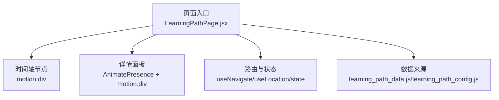
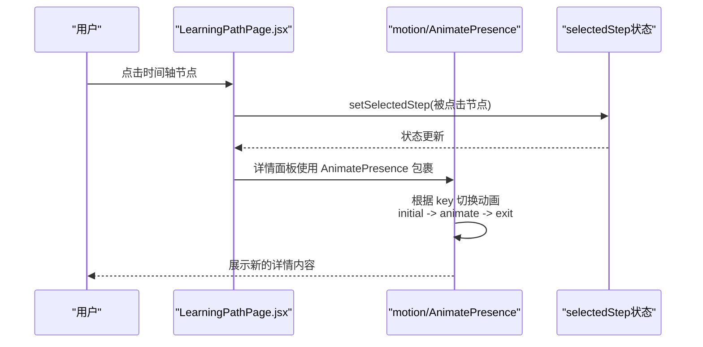
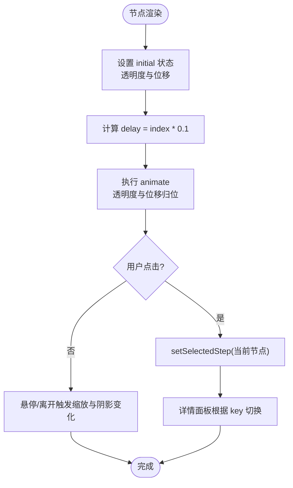
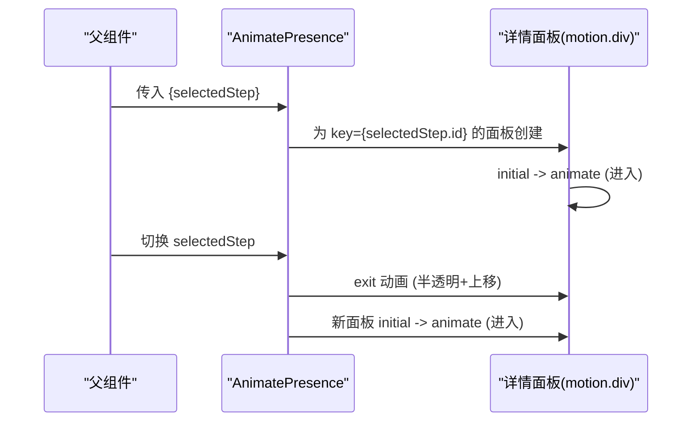
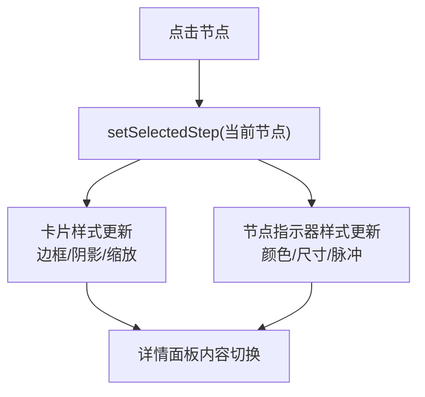
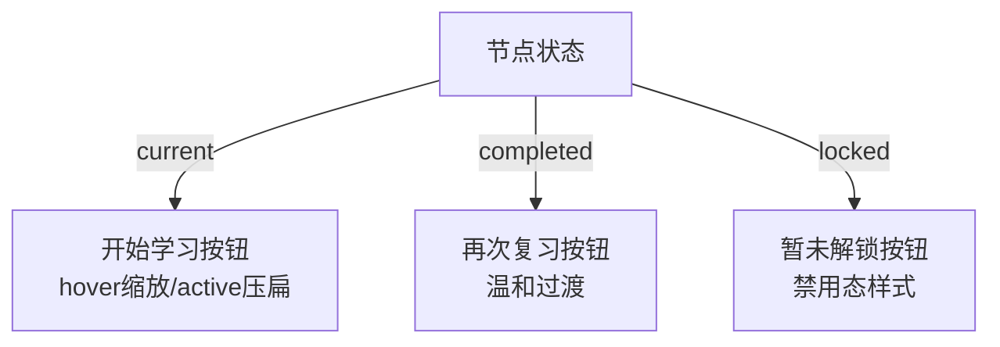
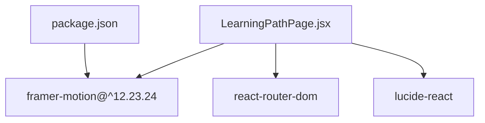

# 学习路径动画交互

<cite>
**本文引用的文件**
- [LearningPathPage.jsx](file://src/pages/LearningPathPage.jsx)
- [MyLearningPathPage.jsx](file://src/pages/MyLearningPathPage.jsx)
- [learning_path_data.js](file://src/data/learning_path_data.js)
- [learning_path_config.js](file://src/data/learning_path_config.js)
- [package.json](file://package.json)
</cite>

## 目录
1. [引言](#引言)
2. [项目结构](#项目结构)
3. [核心组件](#核心组件)
4. [架构总览](#架构总览)
5. [详细组件分析](#详细组件分析)
6. [依赖关系分析](#依赖关系分析)
7. [性能考虑](#性能考虑)
8. [故障排查指南](#故障排查指南)
9. [结论](#结论)
10. [附录](#附录)

## 引言
本文件聚焦于 LearningPathPage.jsx 中 Framer Motion 动画库的集成应用，围绕以下主题展开：
- 时间轴节点入场动画（initial/animate/transition）的配置方式
- 详情面板内容切换时的过渡效果（AnimatePresence）实现机制
- 节点点击交互的反馈逻辑（缩放、阴影、颜色过渡）
- 按钮状态交互（开始学习/再次复习/暂未解锁）的动态样式控制
- 在复杂路径场景下的动画性能优化策略（延迟加载、动画节流）

## 项目结构
LearningPathPage.jsx 位于页面层，负责渲染“个性化学习路径”界面，包含左侧时间轴节点列表与右侧详情面板。该页面直接使用 Framer Motion 的 motion 与 AnimatePresence 组件实现动画。

图表来源
- [LearningPathPage.jsx](file://src/pages/LearningPathPage.jsx#L1-L166)
- [learning_path_data.js](file://src/data/learning_path_data.js#L1-L182)
- [learning_path_config.js](file://src/data/learning_path_config.js#L1-L180)

章节来源
- [LearningPathPage.jsx](file://src/pages/LearningPathPage.jsx#L1-L166)

## 核心组件
- 时间轴节点容器：使用 motion.div 包裹每个步骤节点，设置初始状态、动画状态与过渡参数，实现逐项入场。
- 详情面板：使用 AnimatePresence 包裹，为不同 selectedStep 提供 key，确保进入、保持与退出的动画状态可控。
- 节点点击交互：onClick 设置 selectedStep，驱动详情面板内容切换与节点样式联动。
- 按钮状态交互：根据节点状态（current/completed/locked）渲染不同按钮与样式，结合 hover/active 缩放与阴影变化。

章节来源
- [LearningPathPage.jsx](file://src/pages/LearningPathPage.jsx#L65-L166)

## 架构总览
下图展示从用户点击到动画呈现的整体流程，以及关键状态与组件的关系。

图表来源
- [LearningPathPage.jsx](file://src/pages/LearningPathPage.jsx#L118-L159)

## 详细组件分析

### 时间轴节点入场动画（initial/animate/transition）
- 入场初始状态：通过 initial 设置透明度与横向位移，营造从左向右滑入的效果。
- 动画目标状态：通过 animate 设置透明度与位移归位，使节点自然出现。
- 逐项延迟：通过 transition 的 delay，按索引递增的方式实现节点依次入场，增强层次感与节奏感。
- 点击交互：onClick 触发 setSelectedStep，驱动详情面板内容切换；同时节点卡片在悬停与选中状态下有缩放与阴影变化。

图表来源
- [LearningPathPage.jsx](file://src/pages/LearningPathPage.jsx#L69-L116)

章节来源
- [LearningPathPage.jsx](file://src/pages/LearningPathPage.jsx#L69-L116)

### 详情面板过渡效果（AnimatePresence）
- 键控切换：为详情面板外层容器设置 key 为 selectedStep.id，确保每次选择不同节点时，Framer Motion 能识别为“新元素”，从而触发动画。
- 进入动画：initial 设置为半透明且轻微上移，animate 归位至完全不透明与稳定位置。
- 退出动画：exit 设置为半透明且轻微上移，实现从上方向下淡出的退出效果。
- 模式控制：mode="wait" 确保退出动画完成后才开始新的进入动画，避免重叠。

图表来源
- [LearningPathPage.jsx](file://src/pages/LearningPathPage.jsx#L118-L159)

章节来源
- [LearningPathPage.jsx](file://src/pages/LearningPathPage.jsx#L118-L159)

### 节点点击交互反馈（缩放、阴影、颜色过渡）
- 选中态样式：当卡片为当前选中节点时，卡片背景、边框、阴影与缩放均有明显变化，突出当前焦点。
- 悬停态样式：hover 时边框与阴影轻微增强，并伴随轻微缩放，提升交互感知。
- 节点指示器：根据状态（已完成/当前/锁定）采用不同的颜色与尺寸，当前节点带有脉冲与高光阴影，强化“进行中”的视觉引导。
- 点击行为：onClick 设置 selectedStep，从而驱动详情面板内容切换与卡片样式联动。

图表来源
- [LearningPathPage.jsx](file://src/pages/LearningPathPage.jsx#L79-L116)

章节来源
- [LearningPathPage.jsx](file://src/pages/LearningPathPage.jsx#L79-L116)

### 按钮状态交互（开始学习/再次复习/暂未解锁）
- 当前节点（current）：渲染“开始学习”按钮，具备 hover 缩放与 active 压扁反馈，强调可操作性。
- 已完成节点（completed）：渲染“再次复习”按钮，采用温和的背景与边框过渡，传达回顾与巩固的语义。
- 未解锁节点（locked）：渲染“暂未解锁”按钮，禁用态样式与图标，明确不可操作状态。

图表来源
- [LearningPathPage.jsx](file://src/pages/LearningPathPage.jsx#L139-L151)

章节来源
- [LearningPathPage.jsx](file://src/pages/LearningPathPage.jsx#L139-L151)

### 数据与配置支撑
- 路径数据：学习路径节点与连接关系由 learning_path_data.js 提供，包含节点状态、进度、描述等字段，用于渲染节点与连线。
- 路径配置：learning_path_config.js 定义了学习路径对象、AI分析与路径管理工具，为更复杂的路径场景提供扩展能力。

章节来源
- [learning_path_data.js](file://src/data/learning_path_data.js#L1-L182)
- [learning_path_config.js](file://src/data/learning_path_config.js#L1-L180)

## 依赖关系分析
- 动画库依赖：项目已安装 Framer Motion，版本满足当前页面动画需求。
- 页面依赖：LearningPathPage.jsx 使用 react-router-dom 的 useNavigate/useLocation，配合 lucide-react 图标库，构建完整的交互体验。

图表来源
- [package.json](file://package.json#L12-L29)
- [LearningPathPage.jsx](file://src/pages/LearningPathPage.jsx#L1-L10)

章节来源
- [package.json](file://package.json#L12-L29)
- [LearningPathPage.jsx](file://src/pages/LearningPathPage.jsx#L1-L10)

## 性能考虑
针对复杂路径场景（大量节点、分支、动态连线），建议采用以下策略降低动画开销：
- 延迟加载节点动画：仅对可见区域内的节点设置 delay，超出可视范围的节点在进入视口后再触发动画。
- 动画节流：在高频交互（如快速切换节点）时，限制动画队列长度或合并过渡，避免重排风暴。
- 简化复杂动画：对非关键路径的节点使用基础过渡（如仅透明度或位移），减少阴影与复杂缓动带来的 GPU/CPU 压力。
- 合理使用 AnimatePresence：在节点数量较多时，避免同时存在多个正在退出的面板，必要时使用 mode="wait" 控制动画时序。
- 使用 transform 与 opacity：优先使用 transform 与 opacity 动画，避免触发布局与重绘。
- 事件去抖：对鼠标悬停、点击等高频事件做去抖处理，减少状态频繁切换导致的动画抖动。

## 故障排查指南
- 动画不生效
  - 检查是否正确引入 motion 与 AnimatePresence，并确保在组件顶层使用。
  - 确认 key 是否随 selectedStep.id 变化，否则不会触发进入/退出动画。
- 节点入场错乱
  - 检查 delay 计算是否基于索引，且过渡时间与延迟协调一致。
- 详情面板闪烁
  - 确保 mode="wait" 已启用，避免退出动画与进入动画重叠。
- 样式冲突
  - 检查 Tailwind 类与动画类的组合顺序，确保动画属性覆盖预期样式。
- 性能卡顿
  - 对复杂路径场景启用延迟加载与动画节流，减少一次性渲染的动画数量。

## 结论
LearningPathPage.jsx 成功将 Framer Motion 融入学习路径的交互体验中，通过节点入场动画、详情面板过渡与节点点击反馈，构建了清晰、连贯且富有层次的用户旅程。在复杂路径场景下，建议结合延迟加载与动画节流等策略，进一步优化性能与流畅度。

## 附录
- 相关页面参考：MyLearningPathPage.jsx 展示了更多 Framer Motion 的使用范式（如节点入场、模态弹窗过渡等），可作为复杂场景的参考实现。

章节来源
- [MyLearningPathPage.jsx](file://src/pages/MyLearningPathPage.jsx#L1-L673)