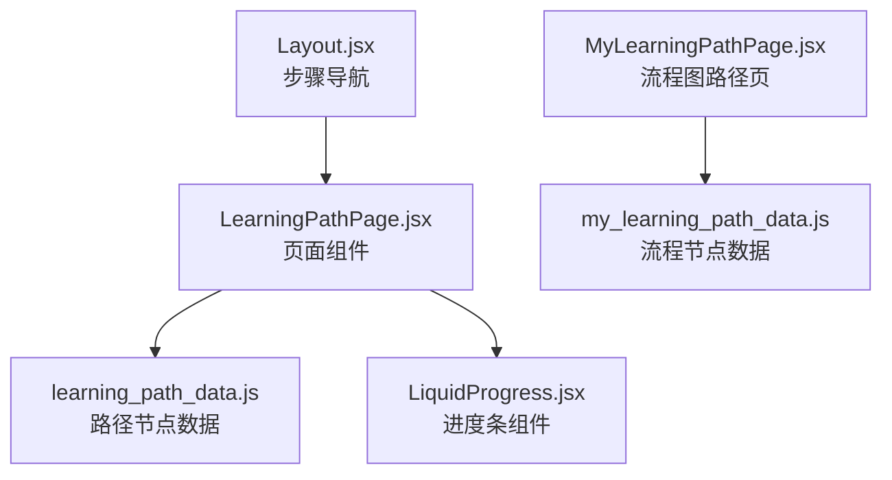
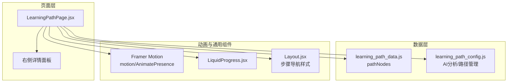
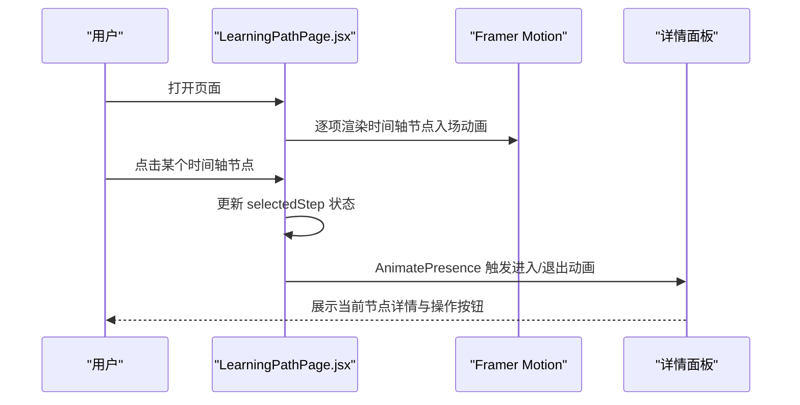
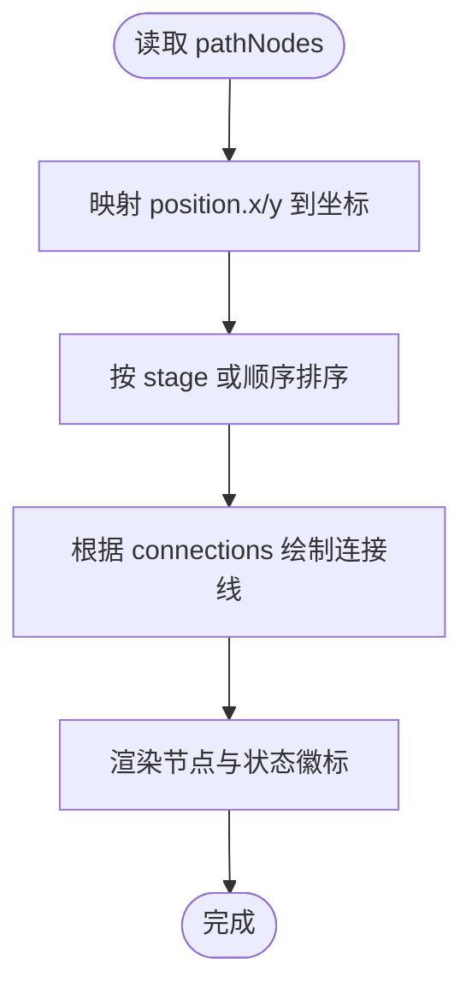
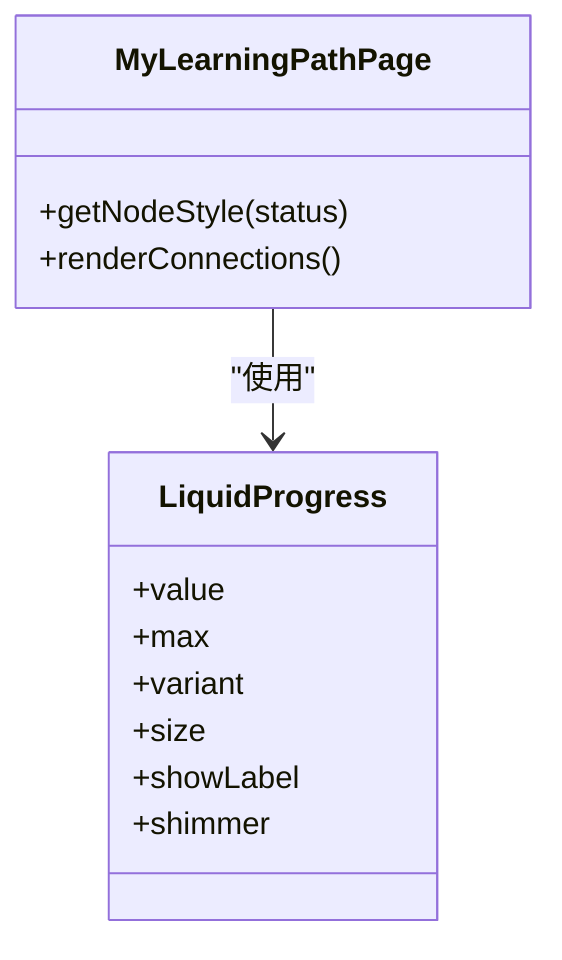
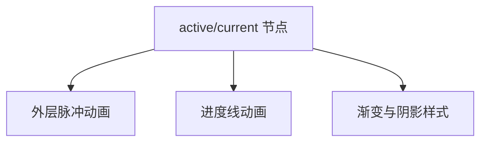
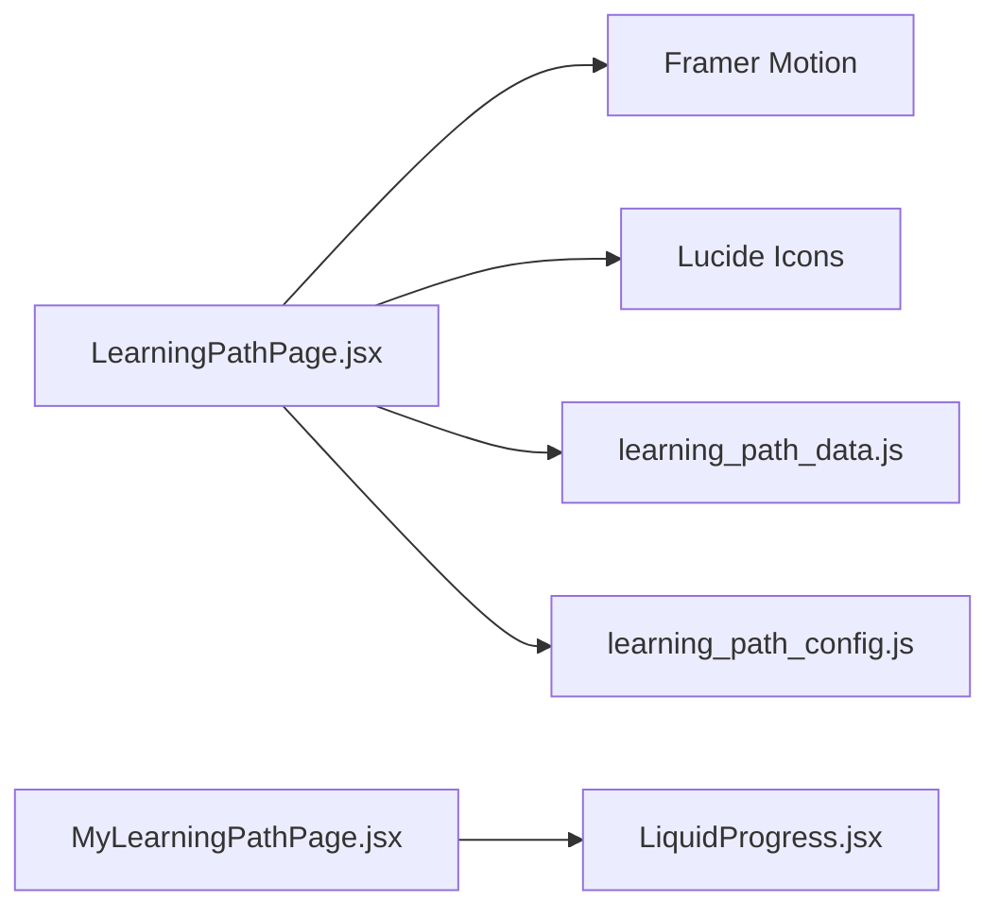

# 学习路径展示

<cite>
**本文引用的文件**
- [LearningPathPage.jsx](file://src/pages/LearningPathPage.jsx)
- [learning_path_data.js](file://src/data/learning_path_data.js)
- [my_learning_path_data.js](file://src/data/my_learning_path_data.js)
- [LiquidProgress.jsx](file://src/components/uiverse/LiquidProgress.jsx)
- [Layout.jsx](file://src/components/Layout.jsx)
- [MyLearningPathPage.jsx](file://src/pages/MyLearningPathPage.jsx)
</cite>

## 目录
1. [引言](#引言)
2. [项目结构](#项目结构)
3. [核心组件](#核心组件)
4. [架构总览](#架构总览)
5. [详细组件分析](#详细组件分析)
6. [依赖分析](#依赖分析)
7. [性能考虑](#性能考虑)
8. [故障排查指南](#故障排查指南)
9. [结论](#结论)

## 引言
本文件围绕 LearningPathPage.jsx 的 UI 渲染逻辑展开，重点解析以下主题：
- 基于用户类型（visual/academic/logical）动态生成学习步骤的机制
- 结合 learning_path_data.js 中 pathNodes 结构，说明路径节点（视频、测验、练习等）在时间轴上的可视化呈现方式
- 节点状态（completed/in-progress/locked）的样式控制与交互反馈，包括进度指示器、动画效果与选中高亮
- Framer Motion 动画集成与响应式布局的实现细节
- 节点渲染性能优化建议（虚拟滚动或懒加载策略）

## 项目结构
该功能涉及页面级组件与数据层，以及部分通用动画组件。下图展示了与“学习路径展示”直接相关的文件关系与职责分工。

图表来源
- [LearningPathPage.jsx](file://src/pages/LearningPathPage.jsx#L1-L166)
- [learning_path_data.js](file://src/data/learning_path_data.js#L1-L182)
- [my_learning_path_data.js](file://src/data/my_learning_path_data.js#L1-L148)
- [LiquidProgress.jsx](file://src/components/uiverse/LiquidProgress.jsx#L1-L154)
- [MyLearningPathPage.jsx](file://src/pages/MyLearningPathPage.jsx#L1-L200)
- [Layout.jsx](file://src/components/Layout.jsx#L64-L107)

章节来源
- [LearningPathPage.jsx](file://src/pages/LearningPathPage.jsx#L1-L166)
- [learning_path_data.js](file://src/data/learning_path_data.js#L1-L182)
- [my_learning_path_data.js](file://src/data/my_learning_path_data.js#L1-L148)
- [LiquidProgress.jsx](file://src/components/uiverse/LiquidProgress.jsx#L1-L154)
- [MyLearningPathPage.jsx](file://src/pages/MyLearningPathPage.jsx#L1-L200)
- [Layout.jsx](file://src/components/Layout.jsx#L64-L107)

## 核心组件
- LearningPathPage.jsx：负责根据用户类型动态生成学习步骤列表，渲染时间轴节点与右侧详情面板，使用 Framer Motion 实现入场与切换动画。
- learning_path_data.js：提供 pathNodes 数据结构（包含节点位置、颜色、状态、进度等），用于流程图路径页的可视化。
- my_learning_path_data.js：提供流程节点与连接关系的数据，用于 MyLearningPathPage.jsx 的流程图渲染。
- LiquidProgress.jsx：提供带光泽流动效果的进度条组件，可复用到学习路径页的进度指示器。
- Layout.jsx：提供步骤导航的节点样式与动画（脉冲、渐变、连接线），可作为时间轴节点样式的参考实现。

章节来源
- [LearningPathPage.jsx](file://src/pages/LearningPathPage.jsx#L1-L166)
- [learning_path_data.js](file://src/data/learning_path_data.js#L1-L182)
- [my_learning_path_data.js](file://src/data/my_learning_path_data.js#L1-L148)
- [LiquidProgress.jsx](file://src/components/uiverse/LiquidProgress.jsx#L1-L154)
- [Layout.jsx](file://src/components/Layout.jsx#L64-L107)

## 架构总览
下图展示了 LearningPathPage 的渲染架构与数据流向，以及与动画组件的关系。

图表来源
- [LearningPathPage.jsx](file://src/pages/LearningPathPage.jsx#L1-L166)
- [learning_path_data.js](file://src/data/learning_path_data.js#L1-L182)
- [learning_path_config.js](file://src/data/learning_path_config.js#L1-L180)
- [LiquidProgress.jsx](file://src/components/uiverse/LiquidProgress.jsx#L1-L154)
- [Layout.jsx](file://src/components/Layout.jsx#L64-L107)

## 详细组件分析

### LearningPathPage.jsx：动态步骤生成与时间轴渲染
- 用户类型驱动的内容生成
  - 通过用户类型（visual/academic/logical）拼接基础节点与差异化节点，形成步骤列表。
  - 关键实现位置：[getPathContent](file://src/pages/LearningPathPage.jsx#L12-L41)。
- 时间轴节点渲染
  - 使用相对定位的左侧竖线作为时间轴，每个步骤为一个可点击的时间轴节点，支持点击选中与高亮。
  - 关键实现位置：[时间轴容器与节点循环](file://src/pages/LearningPathPage.jsx#L67-L116)。
- 节点状态样式与交互反馈
  - completed：绿色背景与勾选图标；current：蓝色背景、放大、阴影与脉冲；locked：灰色背景与锁图标。
  - 选中高亮：右侧详情面板卡片边框与阴影随选中节点变化。
  - 关键实现位置：[节点指示器与卡片样式](file://src/pages/LearningPathPage.jsx#L79-L113)、[详情面板卡片样式](file://src/pages/LearningPathPage.jsx#L89-L113)。
- 动画与过渡
  - Framer Motion：时间轴节点逐项入场动画；详情面板使用 AnimatePresence + motion 实现进入/退出过渡。
  - 关键实现位置：[时间轴节点入场动画](file://src/pages/LearningPathPage.jsx#L70-L77)、[详情面板进出动画](file://src/pages/LearningPathPage.jsx#L120-L159)。
- 响应式布局
  - 主体采用双栏布局（时间轴占1/2，详情占1/2），详情面板使用 sticky 定位保持在可视区域内。
  - 关键实现位置：[主容器与两栏布局](file://src/pages/LearningPathPage.jsx#L65-L161)。

图表来源
- [LearningPathPage.jsx](file://src/pages/LearningPathPage.jsx#L65-L161)

章节来源
- [LearningPathPage.jsx](file://src/pages/LearningPathPage.jsx#L1-L166)

### learning_path_data.js：pathNodes 结构与可视化呈现
- 数据结构要点
  - pathNodes：包含节点 id、label、stage、status、progress、description、stats、position、color 等字段。
  - connections：定义节点之间的连接关系，用于流程图路径页的连线绘制。
- 在时间轴上的呈现思路
  - 可将 pathNodes 的 position.x/y 映射为 SVG 路径上的坐标，使用贝塞尔曲线绘制连接线，节点按 stage 或 position 排序排列。
  - 该数据结构更适合流程图路径页（MyLearningPathPage.jsx），而非当前时间轴页的线性步骤。
- 关键实现位置：[pathNodes 与 connections](file://src/data/learning_path_data.js#L27-L179)。

图表来源
- [learning_path_data.js](file://src/data/learning_path_data.js#L27-L179)

章节来源
- [learning_path_data.js](file://src/data/learning_path_data.js#L1-L182)

### MyLearningPathPage.jsx：流程图路径页的节点样式与动画
- 节点样式与状态
  - completed/current/locked 三种状态分别使用不同渐变色、边框与阴影，current 节点带有脉冲动画。
  - 关键实现位置：[getNodeStyle 与脉冲动画](file://src/pages/MyLearningPathPage.jsx#L50-L78)。
- 连接线绘制
  - 使用 SVG 贝塞尔曲线绘制主干与分支连接线，支持虚线分支与箭头标记。
  - 关键实现位置：[renderConnections](file://src/pages/MyLearningPathPage.jsx#L81-L111)。
- 进度指示器
  - 使用 LiquidProgress 组件实现带光泽的进度条动画，支持多种变体与尺寸。
  - 关键实现位置：[LiquidProgress 组件](file://src/components/uiverse/LiquidProgress.jsx#L1-L154)。

图表来源
- [MyLearningPathPage.jsx](file://src/pages/MyLearningPathPage.jsx#L50-L111)
- [LiquidProgress.jsx](file://src/components/uiverse/LiquidProgress.jsx#L1-L154)

章节来源
- [MyLearningPathPage.jsx](file://src/pages/MyLearningPathPage.jsx#L1-L200)
- [LiquidProgress.jsx](file://src/components/uiverse/LiquidProgress.jsx#L1-L154)

### Layout.jsx：步骤导航的节点样式与动画
- 节点样式
  - active/current 使用蓝色渐变与发光效果，completed 使用蓝色填充，upcoming 使用浅灰。
  - 关键实现位置：[节点样式与图标](file://src/components/Layout.jsx#L64-L99)。
- 连接线动画
  - 使用 motion.div 实现从左到右的进度线动画，配合 isCompleted 条件渲染。
  - 关键实现位置：[进度线动画](file://src/components/Layout.jsx#L104-L107)。
- 脉冲动画
  - current 节点外层包裹 motion.div 实现无限脉冲效果。
  - 关键实现位置：[脉冲动画](file://src/components/Layout.jsx#L82-L95)。

图表来源
- [Layout.jsx](file://src/components/Layout.jsx#L64-L107)

章节来源
- [Layout.jsx](file://src/components/Layout.jsx#L64-L107)

## 依赖分析
- 组件耦合
  - LearningPathPage.jsx 依赖 Framer Motion 实现动画，依赖 lucide-react 图标库，依赖本地状态 selectedStep 控制详情面板。
  - 与 learning_path_data.js 的耦合体现在数据结构与渲染逻辑的匹配上（当前页面使用自定义 steps，而 data 文件提供 pathNodes）。
- 外部依赖
  - Framer Motion：用于入场、出场与过渡动画。
  - lucide-react：提供播放、锁、书本、星形等图标。
- 潜在循环依赖
  - 当前文件间无循环导入迹象。

图表来源
- [LearningPathPage.jsx](file://src/pages/LearningPathPage.jsx#L1-L166)
- [learning_path_data.js](file://src/data/learning_path_data.js#L1-L182)
- [learning_path_config.js](file://src/data/learning_path_config.js#L1-L180)
- [MyLearningPathPage.jsx](file://src/pages/MyLearningPathPage.jsx#L1-L200)
- [LiquidProgress.jsx](file://src/components/uiverse/LiquidProgress.jsx#L1-L154)

章节来源
- [LearningPathPage.jsx](file://src/pages/LearningPathPage.jsx#L1-L166)
- [learning_path_data.js](file://src/data/learning_path_data.js#L1-L182)
- [learning_path_config.js](file://src/data/learning_path_config.js#L1-L180)
- [MyLearningPathPage.jsx](file://src/pages/MyLearningPathPage.jsx#L1-L200)
- [LiquidProgress.jsx](file://src/components/uiverse/LiquidProgress.jsx#L1-L154)

## 性能考虑
- 虚拟滚动（Virtualized List）
  - 当步骤数量增长时，建议使用虚拟滚动仅渲染可视区域内的节点，减少 DOM 节点数量与重排成本。
  - 参考实现思路：使用第三方库（如 react-window 或 react-virtualized）封装时间轴节点列表，计算每项高度与可见区间。
- 懒加载（Lazy Loading）
  - 对详情面板内容进行懒加载，仅在用户选中节点时请求或渲染具体内容（如视频、测验、练习卡片）。
  - 参考实现思路：在 AnimatePresence 的 exit 阶段延迟卸载，或使用 Suspense + React.lazy 包装详情内容组件。
- 动画性能
  - 控制入场动画数量与频率，避免同时大量元素动画造成掉帧；可使用 transform 与 opacity 动画以降低重绘成本。
- 图标与资源
  - 使用 lucide-react 的图标组件，确保按需引入以减小包体积；对视频/音频资源采用懒加载与预加载策略。

## 故障排查指南
- 节点状态显示异常
  - 检查 selectedStep 是否正确初始化为 status 为 current 的步骤；确认节点状态字符串与样式判断一致。
  - 参考位置：[selectedStep 初始化](file://src/pages/LearningPathPage.jsx#L44-L44)、[状态样式判断](file://src/pages/LearningPathPage.jsx#L79-L113)。
- 动画卡顿
  - 减少同时动画元素数量；优先使用 transform/opacity；避免在动画过程中触发重排。
  - 参考位置：[时间轴节点入场动画](file://src/pages/LearningPathPage.jsx#L70-L77)、[详情面板动画](file://src/pages/LearningPathPage.jsx#L120-L159)。
- 详情面板空白
  - 确认 selectedStep 存在且包含 title/description；检查 AnimatePresence 的 key 是否随节点变化。
  - 参考位置：[详情面板渲染](file://src/pages/LearningPathPage.jsx#L120-L159)。

章节来源
- [LearningPathPage.jsx](file://src/pages/LearningPathPage.jsx#L44-L44)
- [LearningPathPage.jsx](file://src/pages/LearningPathPage.jsx#L79-L113)
- [LearningPathPage.jsx](file://src/pages/LearningPathPage.jsx#L120-L159)

## 结论
LearningPathPage.jsx 通过用户类型动态生成学习步骤，结合 Framer Motion 实现流畅的时间轴与详情面板动画，利用状态样式与交互反馈提升用户体验。若需扩展至大规模节点场景，建议引入虚拟滚动与懒加载策略以保障性能。同时，可借鉴 MyLearningPathPage.jsx 与 Layout.jsx 的节点样式与动画实现，统一风格并增强一致性。