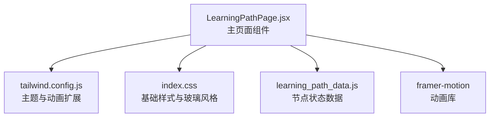
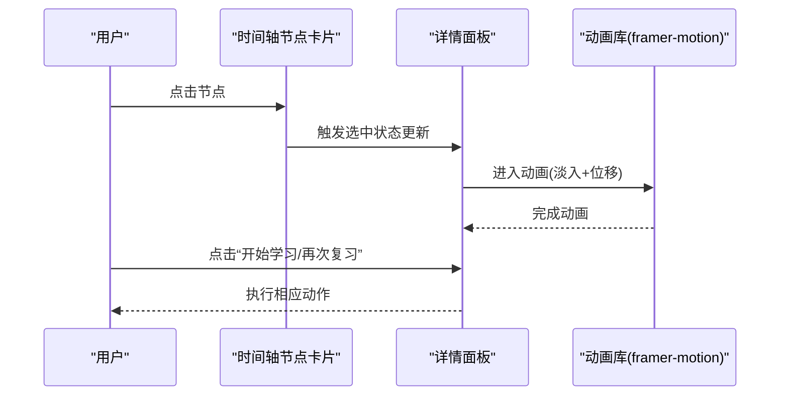
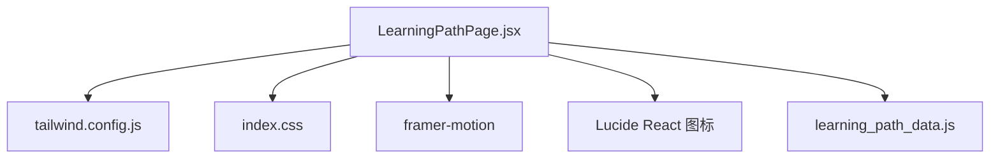

# 学习路径视觉设计

<cite>
**本文引用的文件**
- [LearningPathPage.jsx](file://src/pages/LearningPathPage.jsx)
- [learning_path_data.js](file://src/data/learning_path_data.js)
- [tailwind.config.js](file://tailwind.config.js)
- [index.css](file://src/index.css)
- [StudentPathDetail.jsx](file://src/pages/StudentPathDetail.jsx)
</cite>

## 目录
1. [引言](#引言)
2. [项目结构](#项目结构)
3. [核心组件](#核心组件)
4. [架构总览](#架构总览)
5. [详细组件分析](#详细组件分析)
6. [依赖关系分析](#依赖关系分析)
7. [性能考量](#性能考量)
8. [故障排查指南](#故障排查指南)
9. [结论](#结论)
10. [附录](#附录)

## 引言
本文件围绕 LearningPathPage.jsx 的响应式布局与视觉设计展开，重点解析“时间轴（timeline）与详情面板（detail panel）”的双栏布局策略；深入说明节点卡片的视觉样式设计，包括边框、阴影、圆角、颜色状态（已完成/进行中/未解锁）的 CSS 类应用；结合 learning_path_data.js 中的节点状态数据，解释如何通过条件渲染实现不同视觉反馈；给出节点标签（video/quiz/practice）的徽章样式实现方案，并阐述选中高亮效果的过渡动画配置；最后总结整体 UI 设计如何体现教育产品的专业性与亲和力。

## 项目结构
该页面位于 src/pages 目录下，采用 Tailwind CSS 作为主要样式工具，并通过 framer-motion 提供流畅的过渡与动效。全局样式由 src/index.css 定义，主题扩展由 tailwind.config.js 提供，包含自定义颜色、阴影、动画与过渡时长等。

图表来源
- [LearningPathPage.jsx](file://src/pages/LearningPathPage.jsx#L1-L166)
- [tailwind.config.js](file://tailwind.config.js#L1-L96)
- [index.css](file://src/index.css#L1-L143)
- [learning_path_data.js](file://src/data/learning_path_data.js#L1-L182)

章节来源
- [LearningPathPage.jsx](file://src/pages/LearningPathPage.jsx#L1-L166)
- [tailwind.config.js](file://tailwind.config.js#L1-L96)
- [index.css](file://src/index.css#L1-L143)
- [learning_path_data.js](file://src/data/learning_path_data.js#L1-L182)

## 核心组件
- 时间轴区域（左侧）：使用相对定位的垂直时间轴，节点以卡片形式展示，支持点击选中与逐项入场动画。
- 详情面板（右侧）：根据选中节点动态呈现，包含标题、描述、操作按钮与图标背景。
- 状态与类型：通过节点状态（completed/current/locked）与类型（video/quiz/practice）驱动样式与交互。
- 响应式布局：双栏布局在桌面端清晰分离，移动端可按需调整（本文件聚焦桌面端双栏策略与细节）。

章节来源
- [LearningPathPage.jsx](file://src/pages/LearningPathPage.jsx#L65-L160)

## 架构总览
页面采用“时间轴 + 详情面板”的双栏布局，左侧时间轴负责导航与状态展示，右侧详情面板负责内容与操作。两者通过状态管理联动，选中节点变化触发详情面板的进入/退出动画。

图表来源
- [LearningPathPage.jsx](file://src/pages/LearningPathPage.jsx#L65-L160)

## 详细组件分析

### 双栏布局策略
- 外层容器采用最大宽度约束与左右内边距，主内容区使用 Flex 布局与固定间距，形成稳定的双栏结构。
- 左侧时间轴占 50%，右侧详情面板占 50%，配合 sticky 定位使详情面板在滚动时保持可视高度。
- 时间轴使用相对定位与左侧竖线，节点卡片通过绝对定位的指示器与相对定位的卡片内容组合，形成清晰的时间轴视觉。

章节来源
- [LearningPathPage.jsx](file://src/pages/LearningPathPage.jsx#L65-L120)

### 时间轴节点卡片视觉设计
- 节点指示器（圆点）：
  - 已完成：使用绿色系背景与浅色边框，内部包含完成图标。
  - 进行中：使用蓝色系背景，放大并带阴影与环形光晕，突出当前状态。
  - 未解锁：使用灰白系背景与浅色边框。
- 卡片内容：
  - 选中态：白色背景、强调边框、阴影与轻微缩放，提升层级感。
  - 悬停态：边框与阴影轻微变化，提供交互反馈。
  - 锁定态：标题文字降灰，弱化不可用状态。
- 徽章标签：
  - 使用不同色系背景与文字色，区分 video/quiz/practice 类型，统一使用小号字体、圆角与紧凑内边距。
- 选中高亮与过渡：
  - 选中态通过边框、阴影、缩放与透明度叠加实现高亮。
  - 过渡时长与缓动函数来自主题扩展，保证顺滑体验。

章节来源
- [LearningPathPage.jsx](file://src/pages/LearningPathPage.jsx#L79-L113)
- [tailwind.config.js](file://tailwind.config.js#L82-L93)

### 详情面板视觉设计
- 图标背景：使用渐变背景与白色图标，营造专业且有层次的视觉焦点。
- 标题与描述：标题采用较大字号与强对比色，描述段落使用适中的行高与中性色。
- 操作按钮：
  - 进行中：使用强调色背景与阴影，悬停轻微放大与按压缩放，增强触达感。
  - 未解锁：禁用态，使用浅色背景与禁用色，明确不可用。
  - 已完成：使用温和色背景与边框，传达“可重复复习”的友好信号。
- 动画：
  - 使用进入/退出动画，配合淡入淡出与位移，确保切换自然。

章节来源
- [LearningPathPage.jsx](file://src/pages/LearningPathPage.jsx#L120-L159)

### 条件渲染与状态映射
- 节点状态映射：
  - completed → 已完成样式与完成图标。
  - current → 当前进行中样式与脉冲动画。
  - locked → 未解锁样式与禁用态按钮。
- 类型映射：
  - video → 对应徽章颜色与播放图标。
  - quiz → 对应徽章颜色与星形图标。
  - practice → 对应徽章颜色与书本图标。
- 评分显示：当节点存在分数时显示，用于强化学习成果反馈。

章节来源
- [LearningPathPage.jsx](file://src/pages/LearningPathPage.jsx#L104-L113)
- [LearningPathPage.jsx](file://src/pages/LearningPathPage.jsx#L139-L151)

### 与学习路径数据的结合
- 数据来源：页面通过用户类型与难度动态拼装节点列表，节点包含状态与类型字段，直接影响样式与交互。
- 选中默认值：初始选中当前状态节点，确保首次加载即呈现有效详情。
- 数据扩展：未来可直接复用学习路径数据结构，将节点状态与类型映射到 UI，实现一致的视觉语言。

章节来源
- [LearningPathPage.jsx](file://src/pages/LearningPathPage.jsx#L12-L41)
- [LearningPathPage.jsx](file://src/pages/LearningPathPage.jsx#L44-L45)
- [learning_path_data.js](file://src/data/learning_path_data.js#L27-L179)

### 徽章样式实现方案
- 统一采用小号字体、圆角、紧凑内边距与高对比度文字色。
- 不同类型使用不同色系背景与文字色，便于快速识别任务性质。
- 可选加分场景：在徽章上添加细边框或轻微阴影，增强层级感。

章节来源
- [LearningPathPage.jsx](file://src/pages/LearningPathPage.jsx#L95-L101)

### 选中高亮与过渡动画配置
- 选中高亮：边框强调、阴影扩散、轻微缩放与透明度叠加，形成明显的层级反馈。
- 过渡时长与缓动：通过主题扩展的过渡时长与缓动函数，保证动画自然流畅。
- 动画库：使用进入/退出动画与位移，确保面板切换具备方向感与节奏感。

章节来源
- [LearningPathPage.jsx](file://src/pages/LearningPathPage.jsx#L120-L159)
- [tailwind.config.js](file://tailwind.config.js#L82-L93)

### 教育产品专业性与亲和力体现
- 专业性：
  - 使用清晰的层级与对比，强调关键信息（标题、徽章、按钮）。
  - 阴影与边框的适度使用，提升卡片的可读性与稳定性。
  - 动画与过渡遵循 Apple 风格的缓动曲线，带来专业且顺滑的交互体验。
- 亲和力：
  - 色彩以蓝、绿、紫为主，传递积极、专注与成长感。
  - 徽章与图标简洁明了，降低认知负担。
  - 悬停与选中反馈温和而明确，增强用户的掌控感与参与感。

章节来源
- [index.css](file://src/index.css#L1-L143)
- [tailwind.config.js](file://tailwind.config.js#L1-L96)
- [LearningPathPage.jsx](file://src/pages/LearningPathPage.jsx#L65-L160)

## 依赖关系分析
- 主要依赖：
  - Tailwind CSS：提供原子化样式与主题扩展。
  - Framer Motion：提供进入/退出动画与位移动画。
  - Lucide React：提供图标资源。
- 页面内部依赖：
  - 通过状态管理驱动 UI 更新，选中节点变化触发详情面板动画。
  - 节点状态与类型决定样式与交互，形成“数据驱动 UI”的闭环。

图表来源
- [LearningPathPage.jsx](file://src/pages/LearningPathPage.jsx#L1-L166)
- [tailwind.config.js](file://tailwind.config.js#L1-L96)
- [index.css](file://src/index.css#L1-L143)
- [learning_path_data.js](file://src/data/learning_path_data.js#L1-L182)

章节来源
- [LearningPathPage.jsx](file://src/pages/LearningPathPage.jsx#L1-L166)
- [tailwind.config.js](file://tailwind.config.js#L1-L96)
- [index.css](file://src/index.css#L1-L143)
- [learning_path_data.js](file://src/data/learning_path_data.js#L1-L182)

## 性能考量
- 动画性能：使用 transform 与 opacity 动画，避免频繁重排；控制动画时长与缓动，减少卡顿。
- 渲染优化：节点卡片使用条件类名拼接，避免不必要的计算；详情面板使用动画包裹，仅在状态变更时触发。
- 响应式：双栏布局在桌面端稳定，移动端可考虑折叠或堆叠策略（本文件聚焦桌面端双栏）。

## 故障排查指南
- 选中态不生效：
  - 检查选中状态是否正确设置，确认节点状态与选中逻辑一致。
- 徽章颜色异常：
  - 确认类型映射与色系配置一致，检查 Tailwind 主题扩展是否生效。
- 动画不流畅：
  - 检查动画时长与缓动配置，避免在同一页面同时触发过多复杂动画。
- 锁定态按钮不可用：
  - 确认锁定态按钮禁用属性与样式一致，避免误触。

章节来源
- [LearningPathPage.jsx](file://src/pages/LearningPathPage.jsx#L95-L113)
- [LearningPathPage.jsx](file://src/pages/LearningPathPage.jsx#L139-L151)

## 结论
LearningPathPage.jsx 通过清晰的双栏布局与精心设计的状态反馈，实现了教育场景下的专业与亲和并存。时间轴节点卡片以状态驱动视觉，详情面板以交互驱动内容，配合主题化的动画与过渡，构建了高效、直观且富有情感的用户体验。未来可在移动端进一步优化布局与交互，以覆盖更广泛的设备形态。

## 附录
- 与同类组件的对比参考：StudentPathDetail.jsx 展示了另一种节点状态视觉表达方式，可作为扩展与统一视觉语言的参考。

章节来源
- [StudentPathDetail.jsx](file://src/pages/StudentPathDetail.jsx#L160-L217)