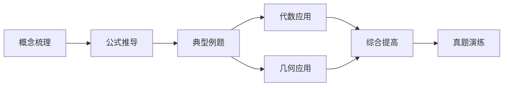
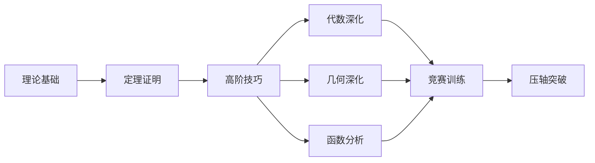
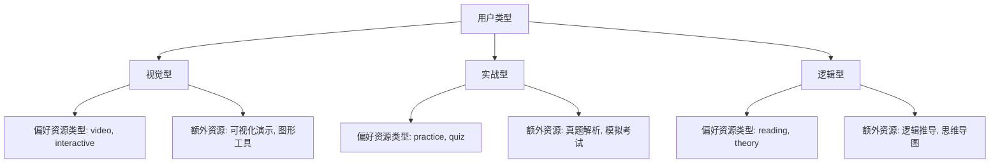

# 学习路径模板结构

<cite>
**本文档引用的文件**   
- [course_path_config_data.js](file://src/data/course_path_config_data.js)
- [learning_path_data.js](file://src/data/learning_path_data.js)
- [LearningPathPage.jsx](file://src/pages/LearningPathPage.jsx)
- [MyLearningPathPage.jsx](file://src/pages/MyLearningPathPage.jsx)
</cite>

## 目录
1. [简介](#简介)
2. [学习路径模板配置](#学习路径模板配置)
3. [难度级别元数据](#难度级别元数据)
4. [用户类型适配策略](#用户类型适配策略)
5. [模板数据驱动UI渲染](#模板数据驱动ui渲染)
6. [结论](#结论)

## 简介
本文档深入解析`LEARNING_PATH_TEMPLATES`中定义的简单、中等、困难三个难度级别的学习路径模板结构。详细说明每个模板的`pathNodes`节点配置（包括id、label、stage、position、color等属性）和`connections`连接关系，阐述不同难度下路径拓扑结构的设计理念。结合`DIFFICULTY_LEVELS`中的元数据，解释模板与难度等级的映射关系，并分析`DEFAULT_COURSE_CONFIG`中用户类型适配策略如何影响模板选择。提供模板数据驱动UI渲染的代码示例，说明前端组件如何基于此结构生成可视化学习路径图。

## 学习路径模板配置
`LEARNING_PATH_TEMPLATES`定义了三种不同难度级别的学习路径模板：简单、中等和困难。每种模板都包含`pathNodes`和`connections`两个核心部分，用于描述学习路径的节点和连接关系。

### 简单难度模板
简单难度模板设计为线性结构，适合基础薄弱的学生循序渐进地掌握核心知识点。该模板包含6个节点，每个节点代表一个学习阶段，节点之间通过单向连接形成一条直线路径。

**Diagram sources**
- [course_path_config_data.js](file://src/data/course_path_config_data.js#L35-L111)

**Section sources**
- [course_path_config_data.js](file://src/data/course_path_config_data.js#L35-L111)

### 中等难度模板
中等难度模板在第4阶段引入了分支结构，适合有一定基础的学生全面系统地学习知识体系。该模板包含7个节点，其中`medium-3`节点后分出两个分支`medium-4-1`和`medium-4-2`，分别代表代数应用和几何应用，最终在`medium-5`节点汇合。

**Diagram sources**
- [course_path_config_data.js](file://src/data/course_path_config_data.js#L113-L202)

**Section sources**
- [course_path_config_data.js](file://src/data/course_path_config_data.js#L113-L202)

### 困难难度模板
困难难度模板在第4阶段引入了三个分支，适合基础扎实的学生深入学习并挑战高难度题目。该模板包含8个节点，其中`hard-3`节点后分出三个分支`hard-4-1`、`hard-4-2`和`hard-4-3`，分别代表代数深化、几何深化和函数分析，最终在`hard-5`节点汇合。

**Diagram sources**
- [course_path_config_data.js](file://src/data/course_path_config_data.js#L204-L306)

**Section sources**
- [course_path_config_data.js](file://src/data/course_path_config_data.js#L204-L306)

## 难度级别元数据
`DIFFICULTY_LEVELS`定义了三种难度级别的元数据，包括id、label、color、description、totalKnowledgePoints、estimatedHours和targetScore。这些元数据为每种难度级别提供了详细的描述和量化指标。

| 难度级别 | id | label | color | description | totalKnowledgePoints | estimatedHours | targetScore |
| --- | --- | --- | --- | --- | --- | --- | --- |
| 简单 | simple | 简单 | #10b981 | 适合基础薄弱的学生，循序渐进掌握核心知识点 | 8 | 80 | 60-75分 |
| 中等 | medium | 中等 | #3b82f6 | 适合有一定基础的学生，全面系统学习知识体系 | 12 | 120 | 75-90分 |
| 困难 | hard | 困难 | #f43f5e | 适合基础扎实的学生，深入学习并挑战高难度题目 | 16 | 160 | 90-100分 |

**Section sources**
- [course_path_config_data.js](file://src/data/course_path_config_data.js#L4-L32)

## 用户类型适配策略
`DEFAULT_COURSE_CONFIG`中的`userTypeAdaptation`策略定义了不同用户类型的资源偏好和额外资源。该策略根据用户的类型（视觉型、实战型、逻辑型）调整学习路径的资源配置，以更好地满足不同学习风格的需求。

**Diagram sources**
- [course_path_config_data.js](file://src/data/course_path_config_data.js#L310-L325)

**Section sources**
- [course_path_config_data.js](file://src/data/course_path_config_data.js#L310-L325)

## 模板数据驱动UI渲染
前端组件通过读取`LEARNING_PATH_TEMPLATES`中的数据来动态生成可视化学习路径图。`MyLearningPathPage.jsx`组件使用`pathNodes`和`connections`数据来渲染节点和连接线，`LearningPathPage.jsx`组件根据用户类型动态调整学习内容。

### 节点渲染
节点的渲染基于`pathNodes`中的`id`、`label`、`stage`、`position`和`color`属性。每个节点的位置由`position`属性确定，颜色由`color`属性确定，阶段由`stage`属性确定。

### 连接线渲染
连接线的渲染基于`connections`中的`from`和`to`属性。每个连接线从一个节点的`id`指向另一个节点的`id`，形成学习路径的拓扑结构。

### 用户类型适配
`LearningPathPage.jsx`组件根据用户类型动态调整学习内容。例如，视觉型用户会优先看到视频和交互式资源，实战型用户会优先看到练习题和模拟考试，逻辑型用户会优先看到阅读材料和理论推导。

**Section sources**
- [MyLearningPathPage.jsx](file://src/pages/MyLearningPathPage.jsx)
- [LearningPathPage.jsx](file://src/pages/LearningPathPage.jsx)

## 结论
`LEARNING_PATH_TEMPLATES`通过定义不同难度级别的学习路径模板，为不同水平的学生提供了个性化的学习路径。`DIFFICULTY_LEVELS`中的元数据为每种难度级别提供了详细的描述和量化指标，`DEFAULT_COURSE_CONFIG`中的用户类型适配策略则根据用户的类型调整学习路径的资源配置，以更好地满足不同学习风格的需求。前端组件通过读取这些模板数据来动态生成可视化学习路径图，为用户提供直观的学习路径展示。