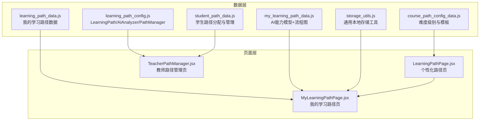
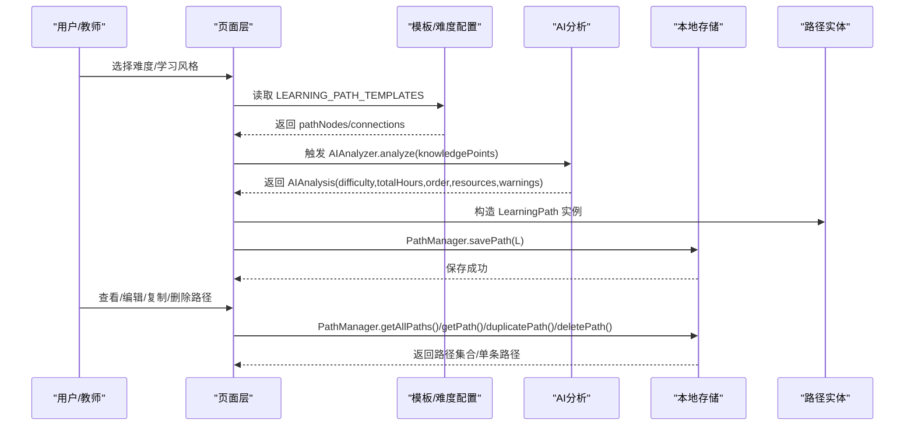
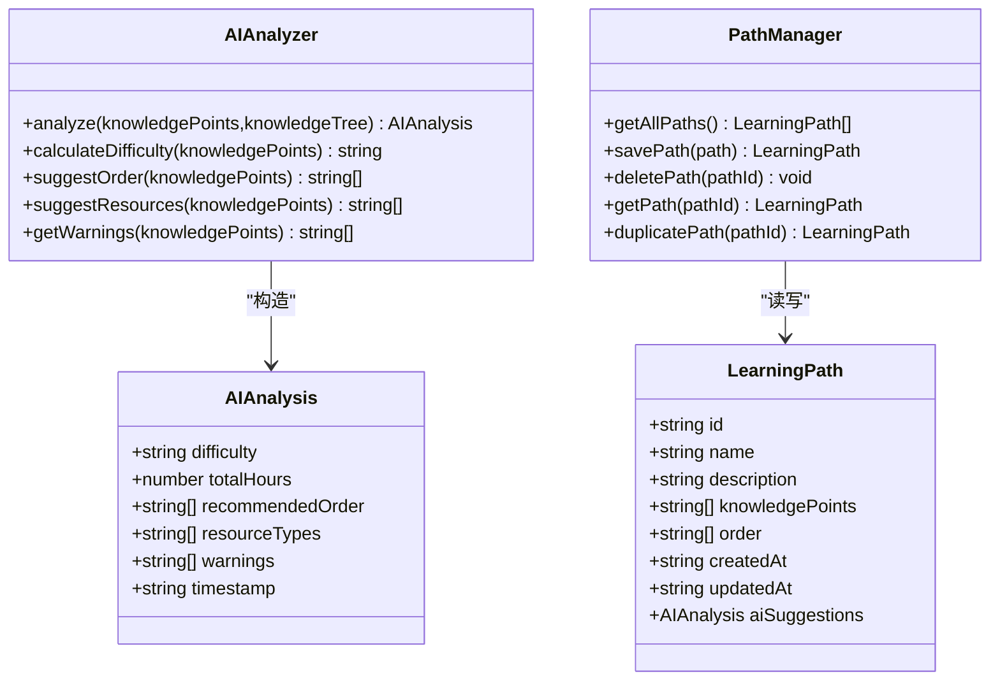
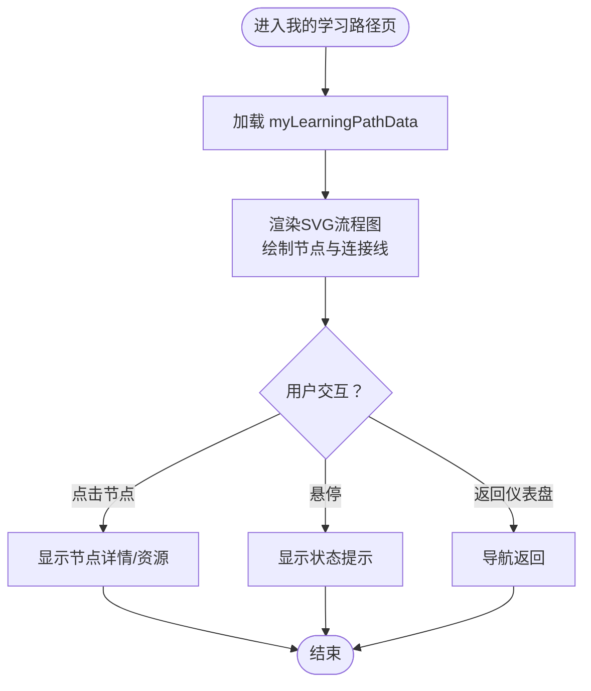
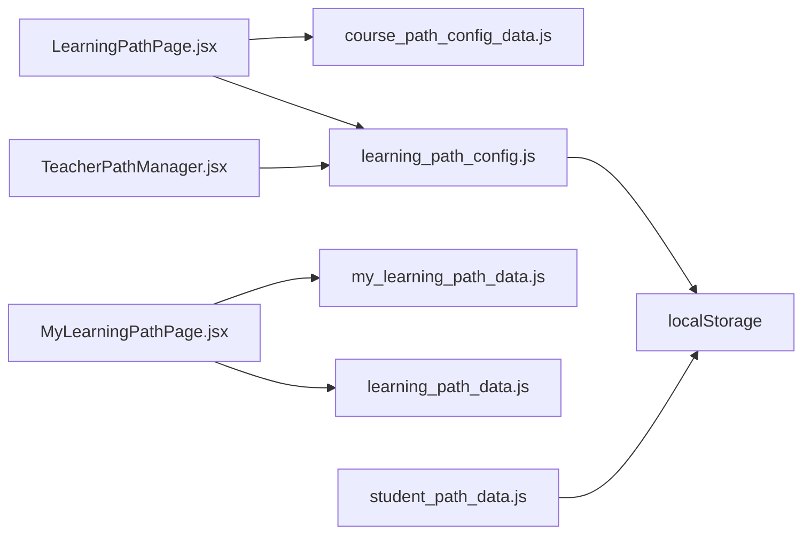

# 学习路径配置

<cite>
**本文引用的文件**
- [course_path_config_data.js](file://src/data/course_path_config_data.js)
- [learning_path_config.js](file://src/data/learning_path_config.js)
- [learning_path_data.js](file://src/data/learning_path_data.js)
- [my_learning_path_data.js](file://src/data/my_learning_path_data.js)
- [LearningPathPage.jsx](file://src/pages/LearningPathPage.jsx)
- [MyLearningPathPage.jsx](file://src/pages/MyLearningPathPage.jsx)
- [TeacherPathManager.jsx](file://src/pages/TeacherPathManager.jsx)
- [storage_utils.js](file://src/utils/storage_utils.js)
- [student_path_data.js](file://src/data/student_path_data.js)
</cite>

## 目录
1. [引言](#引言)
2. [项目结构](#项目结构)
3. [核心组件](#核心组件)
4. [架构总览](#架构总览)
5. [详细组件分析](#详细组件分析)
6. [依赖分析](#依赖分析)
7. [性能考虑](#性能考虑)
8. [故障排查指南](#故障排查指南)
9. [结论](#结论)
10. [附录](#附录)

## 引言
本文件围绕学习路径的模板配置机制展开，基于课程路径配置数据中的 LEARNING_PATH_TEMPLATES 结构，系统说明不同难度与学习风格下的路径模板设计；结合 LearningPath 类与 PathManager 工具，阐述路径的创建、存储与管理逻辑；详解路径配置数据结构（如 id、name、order、aiSuggestions）及其在个性化推荐中的作用；并提供路径模板动态加载与本地存储同步的代码示例路径，最后讨论配置扩展性与维护策略。

## 项目结构
学习路径相关代码主要分布在以下模块：
- 数据层：课程路径模板、路径配置与分析、我的学习路径数据、学生路径分配与管理
- 页面层：个性化学习路径页、我的学习路径页、教师路径管理页
- 工具层：本地存储工具类

图表来源
- [course_path_config_data.js](file://src/data/course_path_config_data.js#L1-L332)
- [learning_path_config.js](file://src/data/learning_path_config.js#L1-L180)
- [learning_path_data.js](file://src/data/learning_path_data.js#L1-L182)
- [my_learning_path_data.js](file://src/data/my_learning_path_data.js#L1-L148)
- [student_path_data.js](file://src/data/student_path_data.js#L1-L305)
- [storage_utils.js](file://src/utils/storage_utils.js#L1-L438)
- [LearningPathPage.jsx](file://src/pages/LearningPathPage.jsx#L1-L166)
- [MyLearningPathPage.jsx](file://src/pages/MyLearningPathPage.jsx#L1-L673)
- [TeacherPathManager.jsx](file://src/pages/TeacherPathManager.jsx#L1-L288)

章节来源
- [course_path_config_data.js](file://src/data/course_path_config_data.js#L1-L332)
- [learning_path_config.js](file://src/data/learning_path_config.js#L1-L180)
- [learning_path_data.js](file://src/data/learning_path_data.js#L1-L182)
- [my_learning_path_data.js](file://src/data/my_learning_path_data.js#L1-L148)
- [student_path_data.js](file://src/data/student_path_data.js#L1-L305)
- [storage_utils.js](file://src/utils/storage_utils.js#L1-L438)
- [LearningPathPage.jsx](file://src/pages/LearningPathPage.jsx#L1-L166)
- [MyLearningPathPage.jsx](file://src/pages/MyLearningPathPage.jsx#L1-L673)
- [TeacherPathManager.jsx](file://src/pages/TeacherPathManager.jsx#L1-L288)

## 核心组件
- 课程路径模板与难度级别
  - DIFFICULTY_LEVELS 定义了 simple/medium/hard 的难度参数（颜色、描述、总知识点数、预估学时、目标分数）
  - LEARNING_PATH_TEMPLATES 提供三种难度的 pathNodes（节点属性含 id、label、stage、status、progress、description、stats、position、color）与 connections（边关系）
  - DEFAULT_COURSE_CONFIG 提供用户类型偏好（visual/academic/logical）与资源偏好的映射
- 路径配置与分析
  - LearningPath：路径实体，包含 id、name、description、knowledgePoints、order、createdAt、updatedAt、aiSuggestions
  - AIAnalysis：AI分析结果，包含 difficulty、totalHours、recommendedOrder、resourceTypes、warnings、timestamp
  - AIAnalyzer：分析工具，计算难度、推荐顺序、资源类型、生成警告
  - PathManager：路径持久化工具，提供 getAllPaths/savePath/deletePath/getPath/duplicatePath
- 我的学习路径数据
  - learning_path_data.js：展示“我的学习路径”的节点与连接，包含状态、进度、统计信息
  - my_learning_path_data.js：AI能力模型与流程图节点，支持雷达图与分支合并
- 页面与工具
  - LearningPathPage.jsx：按难度与学习风格动态渲染步骤内容
  - MyLearningPathPage.jsx：流程图可视化、能力雷达、学习趋势、节点详情与资源
  - TeacherPathManager.jsx：教师端路径列表、复制、删除、统计
  - storage_utils.js：通用本地存储读写、导入导出、错题同步等

章节来源
- [course_path_config_data.js](file://src/data/course_path_config_data.js#L1-L332)
- [learning_path_config.js](file://src/data/learning_path_config.js#L1-L180)
- [learning_path_data.js](file://src/data/learning_path_data.js#L1-L182)
- [my_learning_path_data.js](file://src/data/my_learning_path_data.js#L1-L148)
- [LearningPathPage.jsx](file://src/pages/LearningPathPage.jsx#L1-L166)
- [MyLearningPathPage.jsx](file://src/pages/MyLearningPathPage.jsx#L1-L673)
- [TeacherPathManager.jsx](file://src/pages/TeacherPathManager.jsx#L1-L288)
- [storage_utils.js](file://src/utils/storage_utils.js#L1-L438)

## 架构总览
学习路径配置机制由“模板—实体—分析—持久化—页面”五层构成，数据自上而下驱动界面展示与交互。

图表来源
- [course_path_config_data.js](file://src/data/course_path_config_data.js#L1-L332)
- [learning_path_config.js](file://src/data/learning_path_config.js#L1-L180)
- [TeacherPathManager.jsx](file://src/pages/TeacherPathManager.jsx#L1-L288)

## 详细组件分析

### 1) 课程路径模板与难度级别
- 设计要点
  - 难度级别：simple/medium/hard，分别对应不同的节点数量、位置布局、颜色与描述
  - 节点属性：id、label、stage、status、progress、description、stats、position、color
  - 连接关系：通过 connections 定义有向边，支持单线推进与多分支合并
- 个性化适配
  - DEFAULT_COURSE_CONFIG 提供学习风格偏好映射，用于在页面层按风格动态渲染内容
- 示例路径
  - 简单难度：6 个节点，线性推进
  - 中等难度：7 个节点，第4阶段出现两条分支，最终合并
  - 困难难度：8 个节点，第4阶段出现三条分支，最终合并

章节来源
- [course_path_config_data.js](file://src/data/course_path_config_data.js#L1-L332)

### 2) 路径实体与分析工具
- LearningPath
  - 字段：id、name、description、knowledgePoints、order、createdAt、updatedAt、aiSuggestions
  - 用途：承载用户自定义或AI生成的学习路径
- AIAnalysis
  - 字段：difficulty、totalHours、recommendedOrder、resourceTypes、warnings、timestamp
  - 用途：作为 AI 推荐结果载体，驱动页面展示与交互
- AIAnalyzer
  - analyze：汇总知识点，计算总学时、难度、推荐顺序、资源类型、警告
  - calculateDifficulty：基于知识点难度等级计算平均难度
  - suggestOrder：按知识点ID排序（简单策略）
  - suggestResources：按难度推荐资源类型
  - getWarnings：校验知识点数量与总学时，给出建议
- PathManager
  - getAllPaths：从 localStorage 读取并实例化 LearningPath 数组
  - savePath：去重更新，写回 localStorage
  - deletePath：过滤删除
  - getPath：按 id 查询
  - duplicatePath：克隆并重命名，写回 localStorage

图表来源
- [learning_path_config.js](file://src/data/learning_path_config.js#L1-L180)

章节来源
- [learning_path_config.js](file://src/data/learning_path_config.js#L1-L180)

### 3) 我的学习路径数据与可视化
- learning_path_data.js
  - 展示“我的学习路径”的节点与连接，包含状态、进度、统计信息
- my_learning_path_data.js
  - AI能力模型：雷达图数据、推荐建议
  - 流程图节点：阶段与分支，支持合并与箭头样式
- 可视化实现
  - MyLearningPathPage.jsx 使用 SVG 渲染连接线与节点，支持 hover、点击、动画效果
  - 通过 position 坐标控制节点布局，connections 定义曲线路径

图表来源
- [my_learning_path_data.js](file://src/data/my_learning_path_data.js#L1-L148)
- [MyLearningPathPage.jsx](file://src/pages/MyLearningPathPage.jsx#L1-L673)

章节来源
- [learning_path_data.js](file://src/data/learning_path_data.js#L1-L182)
- [my_learning_path_data.js](file://src/data/my_learning_path_data.js#L1-L148)
- [MyLearningPathPage.jsx](file://src/pages/MyLearningPathPage.jsx#L1-L673)

### 4) 页面层：个性化学习路径与教师管理
- LearningPathPage.jsx
  - 从路由 state 读取 difficulty 与 userType，动态组合步骤内容
  - 支持视觉型、实战型、逻辑型三种风格的资源类型偏好
- TeacherPathManager.jsx
  - 读取 PathManager.getAllPaths，展示路径列表、统计信息、复制/删除操作
  - 显示 AI 推荐难度、知识点数量、预估学时与资源类型

章节来源
- [LearningPathPage.jsx](file://src/pages/LearningPathPage.jsx#L1-L166)
- [TeacherPathManager.jsx](file://src/pages/TeacherPathManager.jsx#L1-L288)

### 5) 动态加载与本地存储同步示例路径
- 读取模板并渲染路径
  - 读取 LEARNING_PATH_TEMPLATES.simple/medium/hard
  - 读取 DEFAULT_COURSE_CONFIG.userTypeAdaptation[userType].preferredTypes
  - 在 LearningPathPage.jsx 中按风格拼装步骤内容
  - 参考路径：[课程路径模板](file://src/data/course_path_config_data.js#L1-L332)，[个性化路径页](file://src/pages/LearningPathPage.jsx#L1-L166)
- 保存路径到本地存储
  - 构造 LearningPath 实例，调用 PathManager.savePath
  - 参考路径：[路径持久化工具](file://src/data/learning_path_config.js#L1-L180)
- 教师端管理路径
  - 读取 PathManager.getAllPaths，展示与操作
  - 参考路径：[教师路径管理页](file://src/pages/TeacherPathManager.jsx#L1-L288)
- 学生路径分配与进度
  - 使用 StudentPathManager.assignPath/updateProgress 管理分配与进度
  - 参考路径：[学生路径数据](file://src/data/student_path_data.js#L1-L305)

章节来源
- [course_path_config_data.js](file://src/data/course_path_config_data.js#L1-L332)
- [learning_path_config.js](file://src/data/learning_path_config.js#L1-L180)
- [LearningPathPage.jsx](file://src/pages/LearningPathPage.jsx#L1-L166)
- [TeacherPathManager.jsx](file://src/pages/TeacherPathManager.jsx#L1-L288)
- [student_path_data.js](file://src/data/student_path_data.js#L1-L305)

## 依赖分析
- 组件耦合
  - 页面层依赖数据层（模板与分析）、工具层（本地存储）
  - 路径实体与分析工具相互独立，通过 PathManager 解耦持久化
- 外部依赖
  - localStorage 作为轻量持久化介质
  - React 生态（路由、动画、图表库）用于页面渲染与交互
- 潜在循环依赖
  - 当前文件组织清晰，未发现直接循环依赖

图表来源
- [LearningPathPage.jsx](file://src/pages/LearningPathPage.jsx#L1-L166)
- [MyLearningPathPage.jsx](file://src/pages/MyLearningPathPage.jsx#L1-L673)
- [TeacherPathManager.jsx](file://src/pages/TeacherPathManager.jsx#L1-L288)
- [course_path_config_data.js](file://src/data/course_path_config_data.js#L1-L332)
- [learning_path_config.js](file://src/data/learning_path_config.js#L1-L180)
- [my_learning_path_data.js](file://src/data/my_learning_path_data.js#L1-L148)
- [learning_path_data.js](file://src/data/learning_path_data.js#L1-L182)
- [student_path_data.js](file://src/data/student_path_data.js#L1-L305)

章节来源
- [LearningPathPage.jsx](file://src/pages/LearningPathPage.jsx#L1-L166)
- [MyLearningPathPage.jsx](file://src/pages/MyLearningPathPage.jsx#L1-L673)
- [TeacherPathManager.jsx](file://src/pages/TeacherPathManager.jsx#L1-L288)
- [course_path_config_data.js](file://src/data/course_path_config_data.js#L1-L332)
- [learning_path_config.js](file://src/data/learning_path_config.js#L1-L180)
- [my_learning_path_data.js](file://src/data/my_learning_path_data.js#L1-L148)
- [learning_path_data.js](file://src/data/learning_path_data.js#L1-L182)
- [student_path_data.js](file://src/data/student_path_data.js#L1-L305)

## 性能考虑
- 模板渲染
  - 使用固定节点数量与坐标，避免复杂布局计算
  - SVG 路径采用二次贝塞尔曲线，减少复杂计算
- 本地存储
  - 路径列表读写为 O(n) 遍历，n 为路径数量；可通过索引优化
  - 建议限制路径数量或分页加载
- AI 分析
  - analyze 为线性扫描，复杂度 O(k)（k 为知识点数量）
  - 建议缓存中间结果，避免重复计算
- 页面交互
  - 使用动画库进行过渡，注意帧率与设备性能

## 故障排查指南
- 本地存储异常
  - PathManager 读取/保存失败时会返回空或抛错，检查 localStorage 是否可用
  - 参考路径：[路径持久化工具](file://src/data/learning_path_config.js#L1-L180)
- 数据格式错误
  - 学生路径分配数据结构变更导致读取失败，检查字段一致性
  - 参考路径：[学生路径数据](file://src/data/student_path_data.js#L1-L305)
- 可视化渲染问题
  - SVG 坐标或连接线缺失，检查 connections 与 nodes 的 id 匹配
  - 参考路径：[我的学习路径页](file://src/pages/MyLearningPathPage.jsx#L1-L673)
- 通用存储工具
  - storage_utils.js 提供学习报告数据的导入导出与重置功能，便于恢复默认
  - 参考路径：[通用存储工具](file://src/utils/storage_utils.js#L1-L438)

章节来源
- [learning_path_config.js](file://src/data/learning_path_config.js#L1-L180)
- [student_path_data.js](file://src/data/student_path_data.js#L1-L305)
- [MyLearningPathPage.jsx](file://src/pages/MyLearningPathPage.jsx#L1-L673)
- [storage_utils.js](file://src/utils/storage_utils.js#L1-L438)

## 结论
学习路径配置机制通过“模板—实体—分析—持久化—页面”五层协同，实现了难度与学习风格的灵活适配、AI 推荐与本地存储的无缝衔接。模板结构清晰、实体与分析工具职责明确、页面层交互友好，具备良好的扩展性与维护性。建议在生产环境中增加缓存与分页、完善错误处理与数据校验，以进一步提升稳定性与性能。

## 附录
- 配置扩展建议
  - 扩展难度层级：新增 hard++ 或 custom 难度，补充模板与描述
  - 扩展学习风格：新增 practical 等风格，完善 DEFAULT_COURSE_CONFIG
  - 扩展 AI 推荐：引入更复杂的排序与资源匹配算法
- 维护策略
  - 版本化模板与实体字段，提供迁移脚本
  - 增加单元测试覆盖 PathManager 与 AIAnalyzer
  - 使用 TypeScript 提升类型安全与可维护性