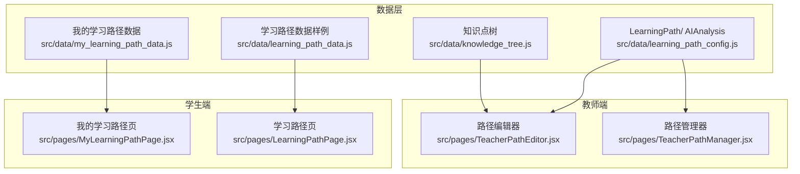
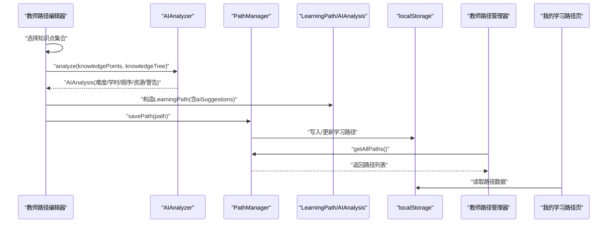
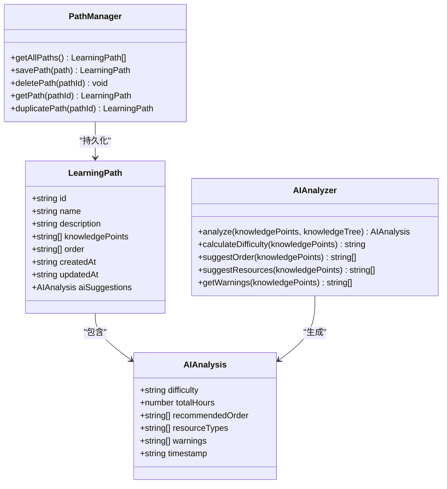
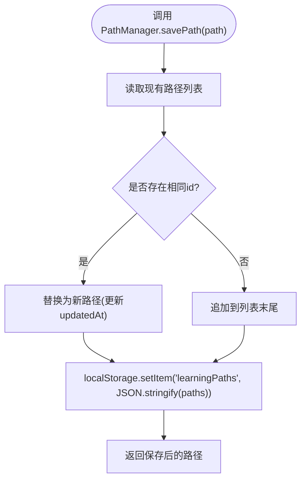
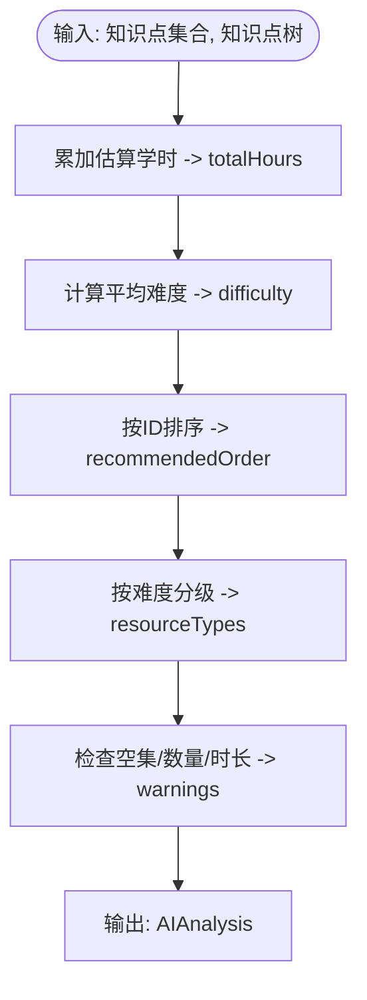
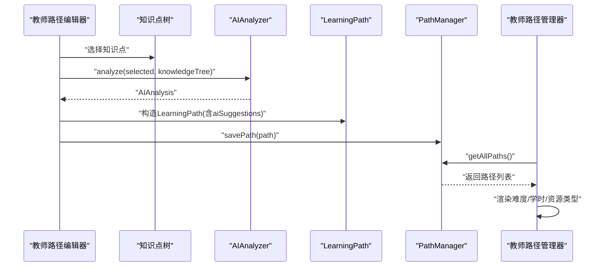
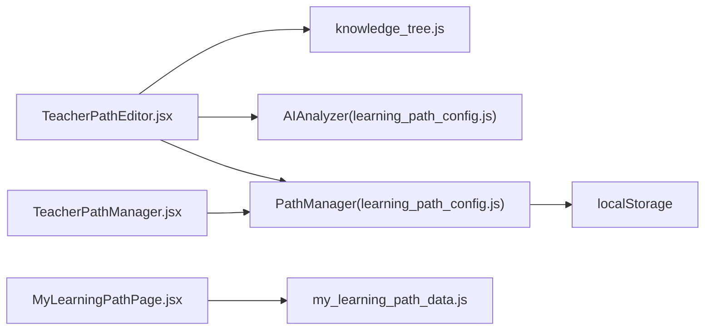

# 路径管理与AI建议

<cite>
**本文引用的文件**
- [src/data/learning_path_config.js](file://src/data/learning_path_config.js)
- [src/pages/TeacherPathEditor.jsx](file://src/pages/TeacherPathEditor.jsx)
- [src/pages/TeacherPathManager.jsx](file://src/pages/TeacherPathManager.jsx)
- [src/data/knowledge_tree.js](file://src/data/knowledge_tree.js)
- [src/data/my_learning_path_data.js](file://src/data/my_learning_path_data.js)
- [src/pages/MyLearningPathPage.jsx](file://src/pages/MyLearningPathPage.jsx)
- [src/data/learning_path_data.js](file://src/data/learning_path_data.js)
- [src/pages/LearningPathPage.jsx](file://src/pages/LearningPathPage.jsx)
</cite>

## 目录
1. [引言](#引言)
2. [项目结构](#项目结构)
3. [核心组件](#核心组件)
4. [架构总览](#架构总览)
5. [详细组件分析](#详细组件分析)
6. [依赖分析](#依赖分析)
7. [性能考虑](#性能考虑)
8. [故障排查指南](#故障排查指南)
9. [结论](#结论)
10. [附录](#附录)

## 引言
本文件围绕“学习路径”与“AI分析”的核心数据模型与工具链进行系统化梳理，重点阐释：
- LearningPath类的数据模型设计与字段语义（id、name、order、aiSuggestions等）
- PathManager工具提供的本地存储操作（getAllPaths、savePath、deletePath、duplicatePath、getPath）
- AIAnalyzer模块的analyze函数如何基于知识点集合生成AI分析结果（难度计算、学习顺序推荐、资源类型建议、警告检测）
- AIAnalysis类结构与aiSuggestions字段在个性化推荐中的作用
- 路径配置与AI建议联动的实际应用示例

## 项目结构
本项目采用按功能域划分的组织方式，学习路径相关的核心代码集中在以下位置：
- 数据模型与工具：src/data/learning_path_config.js
- 知识点树与辅助工具：src/data/knowledge_tree.js
- 教师端路径编辑与管理：src/pages/TeacherPathEditor.jsx、src/pages/TeacherPathManager.jsx
- 学生端路径展示：src/pages/MyLearningPathPage.jsx、src/pages/LearningPathPage.jsx
- 示例数据：src/data/my_learning_path_data.js、src/data/learning_path_data.js

图表来源
- [src/data/learning_path_config.js](file://src/data/learning_path_config.js#L3-L179)
- [src/data/knowledge_tree.js](file://src/data/knowledge_tree.js#L1-L378)
- [src/pages/TeacherPathEditor.jsx](file://src/pages/TeacherPathEditor.jsx#L1-L393)
- [src/pages/TeacherPathManager.jsx](file://src/pages/TeacherPathManager.jsx#L1-L288)
- [src/pages/MyLearningPathPage.jsx](file://src/pages/MyLearningPathPage.jsx#L1-L673)
- [src/pages/LearningPathPage.jsx](file://src/pages/LearningPathPage.jsx#L1-L166)
- [src/data/my_learning_path_data.js](file://src/data/my_learning_path_data.js#L1-L148)
- [src/data/learning_path_data.js](file://src/data/learning_path_data.js#L1-L182)

章节来源
- [src/data/learning_path_config.js](file://src/data/learning_path_config.js#L3-L179)
- [src/data/knowledge_tree.js](file://src/data/knowledge_tree.js#L1-L378)
- [src/pages/TeacherPathEditor.jsx](file://src/pages/TeacherPathEditor.jsx#L1-L393)
- [src/pages/TeacherPathManager.jsx](file://src/pages/TeacherPathManager.jsx#L1-L288)
- [src/pages/MyLearningPathPage.jsx](file://src/pages/MyLearningPathPage.jsx#L1-L673)
- [src/pages/LearningPathPage.jsx](file://src/pages/LearningPathPage.jsx#L1-L166)
- [src/data/my_learning_path_data.js](file://src/data/my_learning_path_data.js#L1-L148)
- [src/data/learning_path_data.js](file://src/data/learning_path_data.js#L1-L182)

## 核心组件
- LearningPath类：封装学习路径的元数据与AI建议，支持序列化/反序列化到localStorage
- AIAnalysis类：封装AI分析结果，包含难度、总学时、推荐顺序、资源类型、警告等
- PathManager工具：提供学习路径的增删改查与复制能力，基于localStorage持久化
- AIAnalyzer模块：对选中的知识点集合进行分析，输出AIAnalysis对象

章节来源
- [src/data/learning_path_config.js](file://src/data/learning_path_config.js#L3-L179)

## 架构总览
下图展示了“知识点选择—AI分析—路径保存—路径管理—前端展示”的端到端流程。

图表来源
- [src/pages/TeacherPathEditor.jsx](file://src/pages/TeacherPathEditor.jsx#L1-L393)
- [src/data/learning_path_config.js](file://src/data/learning_path_config.js#L29-L179)
- [src/pages/TeacherPathManager.jsx](file://src/pages/TeacherPathManager.jsx#L1-L288)
- [src/pages/MyLearningPathPage.jsx](file://src/pages/MyLearningPathPage.jsx#L1-L673)

## 详细组件分析

### LearningPath类与AIAnalysis类
- LearningPath字段语义
  - id：路径唯一标识，自动生成或由外部传入
  - name：路径名称，默认“未命名路径”
  - description：路径描述
  - knowledgePoints：选中的知识点ID数组
  - order：学习顺序（可由AI推荐或手动指定）
  - createdAt/updatedAt：创建与更新时间戳
  - aiSuggestions：AI分析结果对象（AIAnalysis实例）
- AIAnalysis字段语义
  - difficulty：难度评级（基础/中等/高级/未知）
  - totalHours：总学时（由知识点估算时长累加）
  - recommendedOrder：推荐学习顺序（按知识点ID排序）
  - resourceTypes：推荐资源类型（随难度分级）
  - warnings：警告信息（空集/过少/过多/时长过长等）
  - timestamp：分析时间戳

图表来源
- [src/data/learning_path_config.js](file://src/data/learning_path_config.js#L3-L179)

章节来源
- [src/data/learning_path_config.js](file://src/data/learning_path_config.js#L3-L179)

### PathManager本地存储操作
- getAllPaths：从localStorage读取并转换为LearningPath实例数组
- savePath：根据id更新或新增路径，同时维护updatedAt
- deletePath：过滤掉指定id的路径并写回localStorage
- getPath：按id查询单个路径
- duplicatePath：复制指定路径（重置id/name/时间戳）

图表来源
- [src/data/learning_path_config.js](file://src/data/learning_path_config.js#L29-L83)

章节来源
- [src/data/learning_path_config.js](file://src/data/learning_path_config.js#L29-L83)
- [src/pages/TeacherPathManager.jsx](file://src/pages/TeacherPathManager.jsx#L1-L288)

### AIAnalyzer分析流程
- analyze：聚合难度、总学时、推荐顺序、资源类型、警告
- calculateDifficulty：按知识点难度映射计算平均难度
- suggestOrder：按知识点ID排序（简单策略）
- suggestResources：按难度分级推荐资源类型
- getWarnings：检查空集、数量过少/过多、总学时过长等

图表来源
- [src/data/learning_path_config.js](file://src/data/learning_path_config.js#L86-L172)

章节来源
- [src/data/learning_path_config.js](file://src/data/learning_path_config.js#L86-L172)

### 路径配置与AI建议联动（教师端）
- 教师路径编辑器
  - 通过知识点树选择知识点，触发AI分析
  - 将AI分析结果写入LearningPath.aiSuggestions
  - 保存时可使用AI推荐的学习顺序（若存在）
- 教师路径管理器
  - 展示各路径的难度、总学时、推荐资源类型
  - 基于aiSuggestions渲染难度徽标与统计卡片

图表来源
- [src/pages/TeacherPathEditor.jsx](file://src/pages/TeacherPathEditor.jsx#L1-L393)
- [src/pages/TeacherPathManager.jsx](file://src/pages/TeacherPathManager.jsx#L1-L288)
- [src/data/knowledge_tree.js](file://src/data/knowledge_tree.js#L1-L378)
- [src/data/learning_path_config.js](file://src/data/learning_path_config.js#L86-L179)

章节来源
- [src/pages/TeacherPathEditor.jsx](file://src/pages/TeacherPathEditor.jsx#L1-L393)
- [src/pages/TeacherPathManager.jsx](file://src/pages/TeacherPathManager.jsx#L1-L288)
- [src/data/knowledge_tree.js](file://src/data/knowledge_tree.js#L1-L378)
- [src/data/learning_path_config.js](file://src/data/learning_path_config.js#L86-L179)

### 学生端路径展示（联动AI建议）
- 我的学习路径页
  - 使用my_learning_path_data.js中的能力模型与流程节点数据
  - 通过aiSuggestions渲染难度徽标与推荐资源类型
  - 支持节点详情与学习资源卡片联动

章节来源
- [src/pages/MyLearningPathPage.jsx](file://src/pages/MyLearningPathPage.jsx#L1-L673)
- [src/data/my_learning_path_data.js](file://src/data/my_learning_path_data.js#L1-L148)

## 依赖分析
- 组件耦合
  - TeacherPathEditor依赖KnowledgeTree与AIAnalyzer，输出LearningPath并交由PathManager持久化
  - TeacherPathManager依赖PathManager读取/展示路径列表
  - MyLearningPathPage依赖my_learning_path_data.js渲染流程图与能力雷达
- 外部依赖
  - localStorage：作为轻量持久化存储
  - recharts：用于雷达图与趋势图展示
- 潜在循环依赖
  - 当前模块间为单向依赖（编辑器→分析器→模型→管理器→展示），未见循环

图表来源
- [src/pages/TeacherPathEditor.jsx](file://src/pages/TeacherPathEditor.jsx#L1-L393)
- [src/pages/TeacherPathManager.jsx](file://src/pages/TeacherPathManager.jsx#L1-L288)
- [src/pages/MyLearningPathPage.jsx](file://src/pages/MyLearningPathPage.jsx#L1-L673)
- [src/data/knowledge_tree.js](file://src/data/knowledge_tree.js#L1-L378)
- [src/data/learning_path_config.js](file://src/data/learning_path_config.js#L29-L179)
- [src/data/my_learning_path_data.js](file://src/data/my_learning_path_data.js#L1-L148)

章节来源
- [src/pages/TeacherPathEditor.jsx](file://src/pages/TeacherPathEditor.jsx#L1-L393)
- [src/pages/TeacherPathManager.jsx](file://src/pages/TeacherPathManager.jsx#L1-L288)
- [src/pages/MyLearningPathPage.jsx](file://src/pages/MyLearningPathPage.jsx#L1-L673)
- [src/data/knowledge_tree.js](file://src/data/knowledge_tree.js#L1-L378)
- [src/data/learning_path_config.js](file://src/data/learning_path_config.js#L29-L179)
- [src/data/my_learning_path_data.js](file://src/data/my_learning_path_data.js#L1-L148)

## 性能考虑
- 知识点树扁平化：flattenKnowledgeTree仅收集叶子节点，避免遍历整棵树带来的开销
- AI分析复杂度：analyze对知识点集合进行常数次遍历（学时累加、难度映射、排序、资源与警告），时间复杂度O(n)
- 持久化策略：localStorage读写为O(n)（n为路径数量），建议控制路径数量与单条路径大小
- UI渲染：流程图与雷达图使用响应式组件，注意大数据量时的重绘优化

## 故障排查指南
- 保存失败
  - 检查localStorage是否可用；确认路径名称与知识点集合非空
- 路径列表为空
  - 确认localStorage中键名为“learningPaths”，且格式正确
- AI分析结果为空
  - 确认已选择至少一个知识点；检查knowledgeTree结构与flatten逻辑
- 难度/资源类型异常
  - 检查知识点difficulty字段与estimatedHours字段是否缺失或非法

章节来源
- [src/pages/TeacherPathEditor.jsx](file://src/pages/TeacherPathEditor.jsx#L120-L155)
- [src/pages/TeacherPathManager.jsx](file://src/pages/TeacherPathManager.jsx#L1-L288)
- [src/data/learning_path_config.js](file://src/data/learning_path_config.js#L29-L83)

## 结论
本项目通过LearningPath与AIAnalysis的清晰数据模型、PathManager的本地持久化工具以及AIAnalyzer的分析能力，构建了“知识点选择—AI分析—路径保存—路径管理—前端展示”的完整闭环。教师端可高效配置个性化学习路径，学生端可直观查看AI建议与学习进度。建议在后续迭代中引入更精细的学习顺序推荐算法与更丰富的资源绑定策略，以进一步提升个性化体验。

## 附录
- 示例数据参考
  - 我的学习路径数据：my_learning_path_data.js
  - 学习路径样例数据：learning_path_data.js
  - 学生端学习路径页：MyLearningPathPage.jsx
  - 教师端学习路径页：LearningPathPage.jsx

章节来源
- [src/data/my_learning_path_data.js](file://src/data/my_learning_path_data.js#L1-L148)
- [src/data/learning_path_data.js](file://src/data/learning_path_data.js#L1-L182)
- [src/pages/MyLearningPathPage.jsx](file://src/pages/MyLearningPathPage.jsx#L1-L673)
- [src/pages/LearningPathPage.jsx](file://src/pages/LearningPathPage.jsx#L1-L166)