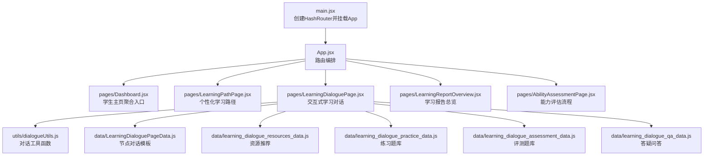
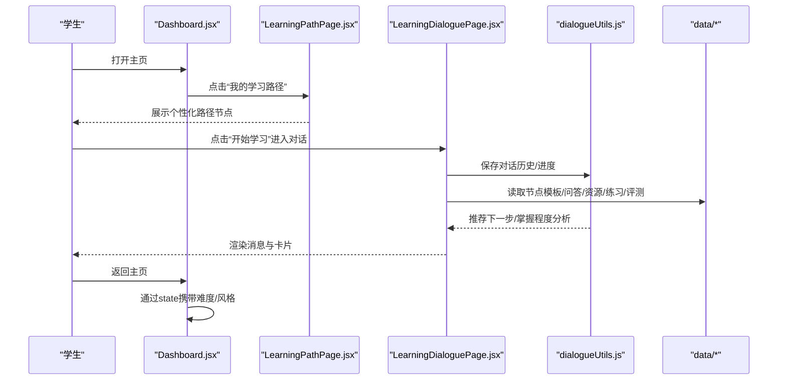
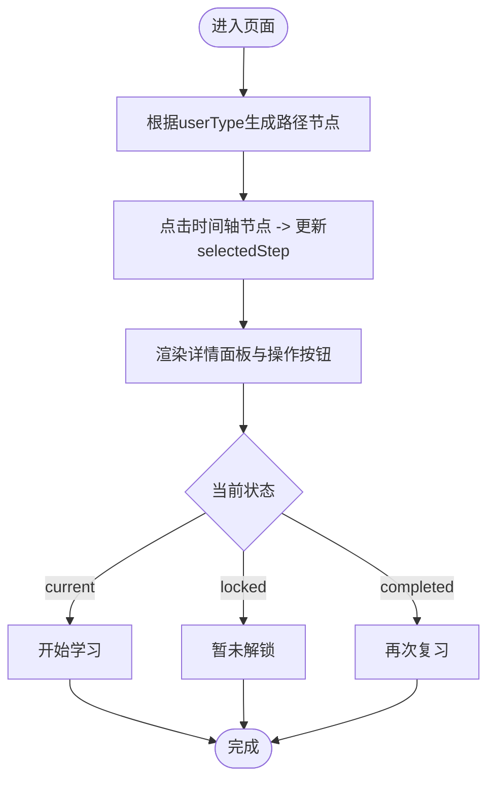
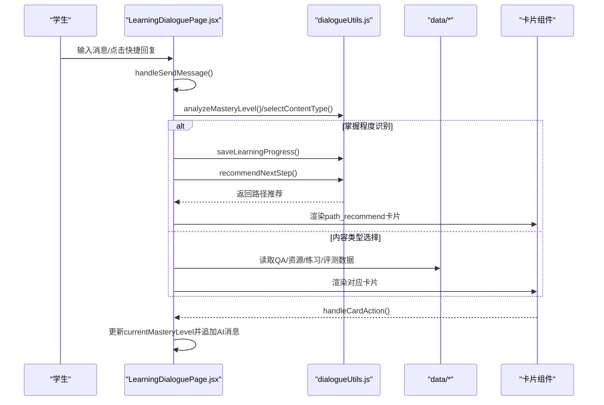
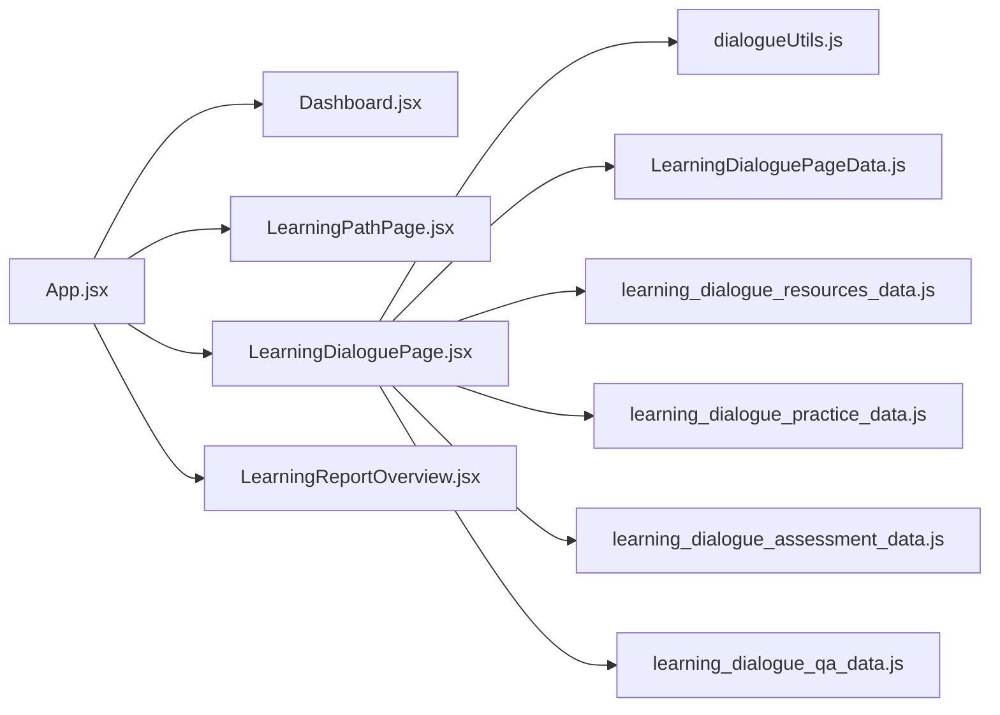

# 学生系统

<cite>
**本文引用的文件**
- [src/App.jsx](file://src/App.jsx)
- [src/main.jsx](file://src/main.jsx)
- [src/pages/Dashboard.jsx](file://src/pages/Dashboard.jsx)
- [src/pages/LearningPathPage.jsx](file://src/pages/LearningPathPage.jsx)
- [src/pages/LearningDialoguePage.jsx](file://src/pages/LearningDialoguePage.jsx)
- [src/utils/dialogueUtils.js](file://src/utils/dialogueUtils.js)
- [src/data/LearningDialoguePageData.js](file://src/data/LearningDialoguePageData.js)
- [src/data/learning_dialogue_resources_data.js](file://src/data/learning_dialogue_resources_data.js)
- [src/data/learning_dialogue_practice_data.js](file://src/data/learning_dialogue_practice_data.js)
- [src/data/learning_dialogue_assessment_data.js](file://src/data/learning_dialogue_assessment_data.js)
- [src/data/learning_dialogue_qa_data.js](file://src/data/learning_dialogue_qa_data.js)
- [src/pages/LearningReportOverview.jsx](file://src/pages/LearningReportOverview.jsx)
- [src/pages/AbilityAssessmentPage.jsx](file://src/pages/AbilityAssessmentPage.jsx)
- [src/data/ability_assessment_data.ts](file://src/data/ability_assessment_data.ts)
- [src/data/goal_selection_data.ts](file://src/data/goal_selection_data.ts)
- [src/pages/GoalSetting.jsx](file://src/pages/GoalSetting.jsx)
- [src/data/learning_report_data.ts](file://src/data/learning_report_data.ts)
</cite>

## 目录
1. [简介](#简介)
2. [项目结构](#项目结构)
3. [核心组件](#核心组件)
4. [架构总览](#架构总览)
5. [详细组件分析](#详细组件分析)
6. [依赖关系分析](#依赖关系分析)
7. [性能考量](#性能考量)
8. [故障排查指南](#故障排查指南)
9. [结论](#结论)
10. [附录](#附录)

## 简介
本文件面向学生系统从“目标设定—能力评估—学习路径执行—学习对话交互—学习报告获取”的完整生命周期，系统性梳理前端页面、数据与工具函数之间的协作关系，解释 Dashboard.jsx 如何整合学生视图，LearningPathPage.jsx 如何展示个性化路径，LearningDialoguePage.jsx 如何实现交互式学习，并结合 data 目录下的学习路径与对话数据说明状态管理与数据渲染机制。最后给出典型使用流程与常见问题排查方向，帮助开发者与使用者快速上手并高效定位问题。

## 项目结构
系统采用 React + Vite 架构，路由通过 HashRouter 管理，页面按功能域划分在 pages 与 components 目录中；数据集中在 data 目录，工具函数位于 utils 目录；App.jsx 负责路由编排，main.jsx 注入路由环境。

图表来源
- [src/main.jsx](file://src/main.jsx#L1-L14)
- [src/App.jsx](file://src/App.jsx#L1-L101)
- [src/pages/Dashboard.jsx](file://src/pages/Dashboard.jsx#L1-L211)
- [src/pages/LearningPathPage.jsx](file://src/pages/LearningPathPage.jsx#L1-L166)
- [src/pages/LearningDialoguePage.jsx](file://src/pages/LearningDialoguePage.jsx#L1-L536)
- [src/pages/LearningReportOverview.jsx](file://src/pages/LearningReportOverview.jsx#L1-L269)
- [src/pages/AbilityAssessmentPage.jsx](file://src/pages/AbilityAssessmentPage.jsx#L1-L117)
- [src/utils/dialogueUtils.js](file://src/utils/dialogueUtils.js#L1-L495)
- [src/data/LearningDialoguePageData.js](file://src/data/LearningDialoguePageData.js#L1-L159)
- [src/data/learning_dialogue_resources_data.js](file://src/data/learning_dialogue_resources_data.js#L1-L188)
- [src/data/learning_dialogue_practice_data.js](file://src/data/learning_dialogue_practice_data.js#L1-L223)
- [src/data/learning_dialogue_assessment_data.js](file://src/data/learning_dialogue_assessment_data.js#L1-L369)
- [src/data/learning_dialogue_qa_data.js](file://src/data/learning_dialogue_qa_data.js#L1-L148)

章节来源
- [src/main.jsx](file://src/main.jsx#L1-L14)
- [src/App.jsx](file://src/App.jsx#L1-L101)

## 核心组件
- Dashboard.jsx：学生主页聚合入口，提供“我的学习路径”“我的学习轨迹”“我的学习报告”“AI 错题本”等卡片导航，支持难度与学习风格状态传递。
- LearningPathPage.jsx：基于用户类型（视觉/实战/逻辑）动态生成学习路径节点，支持节点详情与状态切换（已完成/进行中/锁定），并提供开始学习/再次复习等操作。
- LearningDialoguePage.jsx：交互式学习对话页，支持问答模式与教学模式切换，集成消息气泡、卡片组件（答疑、资源推荐、练习、评测、掌握程度选择、路径推荐），并利用 localStorage 持久化对话历史与学习进度。
- AbilityAssessmentPage.jsx：能力评估流程页面，配合 INITIAL_ABILITY_MESSAGES 与 INITIAL_STEPS，引导学生输出解题思路并生成步骤框架。
- LearningReportOverview.jsx：学习报告总览页，从本地存储加载数据并渲染整体进度、排名、成就徽章、关键指标与趋势图表。

章节来源
- [src/pages/Dashboard.jsx](file://src/pages/Dashboard.jsx#L1-L211)
- [src/pages/LearningPathPage.jsx](file://src/pages/LearningPathPage.jsx#L1-L166)
- [src/pages/LearningDialoguePage.jsx](file://src/pages/LearningDialoguePage.jsx#L1-L536)
- [src/pages/AbilityAssessmentPage.jsx](file://src/pages/AbilityAssessmentPage.jsx#L1-L117)
- [src/pages/LearningReportOverview.jsx](file://src/pages/LearningReportOverview.jsx#L1-L269)

## 架构总览
系统围绕“目标设定—能力评估—学习路径—对话交互—报告”的闭环展开，路由层负责页面导航，页面层负责业务展示，数据层提供静态模板与动态推荐，工具层负责对话状态与持久化。

图表来源
- [src/pages/Dashboard.jsx](file://src/pages/Dashboard.jsx#L1-L211)
- [src/pages/LearningPathPage.jsx](file://src/pages/LearningPathPage.jsx#L1-L166)
- [src/pages/LearningDialoguePage.jsx](file://src/pages/LearningDialoguePage.jsx#L1-L536)
- [src/utils/dialogueUtils.js](file://src/utils/dialogueUtils.js#L1-L495)
- [src/data/LearningDialoguePageData.js](file://src/data/LearningDialoguePageData.js#L1-L159)

## 详细组件分析

### Dashboard.jsx：学生视图整合
- 功能要点
  - 从路由 state 读取 difficulty 与 userType，用于展示与导航。
  - 提供“我的学习路径”“我的学习轨迹”“我的学习报告”“AI 错题本”四个卡片入口。
  - “我的学习报告”支持按 section 滚动定位。
- 状态与导航
  - 使用 useNavigate 与 useLocation，通过 state 在页面间传递难度与学习风格。
- 数据渲染
  - 通过 UiverseCard/UiverseButton 组件组合，渲染卡片与按钮。
- 典型交互
  - 点击卡片跳转至对应页面，如“进入学习路径”“查看学习轨迹”“查看详细报告”“进入错题本”。

章节来源
- [src/pages/Dashboard.jsx](file://src/pages/Dashboard.jsx#L1-L211)

### LearningPathPage.jsx：个性化学习路径
- 动态路径生成
  - 根据 userType（visual/academic/logical）返回不同的节点序列，包含标题、类型（video/quiz/practice/reading）、状态（completed/current/locked）、分数等。
- 选中节点详情
  - 使用 AnimatePresence/motion 实现细节面板的平滑切换，展示节点标题、描述、类型徽标与操作按钮。
- 状态管理
  - 通过 useState 维护 selectedStep，点击时间轴节点更新选中项。
- 交互逻辑
  - current 状态提供“开始学习”，locked 状态提供“暂未解锁”，completed 状态提供“再次复习”。

图表来源
- [src/pages/LearningPathPage.jsx](file://src/pages/LearningPathPage.jsx#L1-L166)

章节来源
- [src/pages/LearningPathPage.jsx](file://src/pages/LearningPathPage.jsx#L1-L166)

### LearningDialoguePage.jsx：交互式学习对话
- 页面结构
  - 顶部：返回按钮、节点标题/副标题、在线状态、模式切换（问答/教学）。
  - 中部：消息容器，支持文本与多种卡片（答疑、资源推荐、练习、评测、掌握程度选择、路径推荐）。
  - 底部：输入区与快捷回复。
  - 右侧：相关资源面板。
- 数据驱动
  - 通过 params.nodeId 与 LearningDialoguePageData.js 获取节点模板与初始消息。
  - 通过 dialogueUtils.js 的工具函数实现：
    - 保存/加载对话历史（localStorage，带7天过期策略）
    - 保存/加载学习进度
    - 掌握程度分析（关键词匹配）
    - 推荐下一步学习路径
    - 内容类型选择（问答/资源/练习/评测）
    - 消息格式化（用户/教师）
- 交互流程
  - 用户发送消息后，延迟触发 AI 回复，根据掌握程度与内容类型选择推送相应卡片。
  - 卡片交互回调 handleCardAction，更新掌握程度并推荐路径。
  - 支持 mastery_selector 与 path_recommend 等卡片类型的双向联动。

图表来源
- [src/pages/LearningDialoguePage.jsx](file://src/pages/LearningDialoguePage.jsx#L1-L536)
- [src/utils/dialogueUtils.js](file://src/utils/dialogueUtils.js#L1-L495)
- [src/data/LearningDialoguePageData.js](file://src/data/LearningDialoguePageData.js#L1-L159)
- [src/data/learning_dialogue_resources_data.js](file://src/data/learning_dialogue_resources_data.js#L1-L188)
- [src/data/learning_dialogue_practice_data.js](file://src/data/learning_dialogue_practice_data.js#L1-L223)
- [src/data/learning_dialogue_assessment_data.js](file://src/data/learning_dialogue_assessment_data.js#L1-L369)
- [src/data/learning_dialogue_qa_data.js](file://src/data/learning_dialogue_qa_data.js#L1-L148)

章节来源
- [src/pages/LearningDialoguePage.jsx](file://src/pages/LearningDialoguePage.jsx#L1-L536)
- [src/utils/dialogueUtils.js](file://src/utils/dialogueUtils.js#L1-L495)

### AbilityAssessmentPage.jsx：能力评估流程
- 功能要点
  - 使用 INITIAL_ABILITY_MESSAGES 与 INITIAL_STEPS 引导学生输出解题思路。
  - 支持拖拽重排步骤，添加新步骤，完成后跳转能力雷达页。
- 交互流程
  - 用户输入 -> 机器人回复 -> 生成步骤框架 -> 拖拽调整/新增步骤 -> 下一步。

章节来源
- [src/pages/AbilityAssessmentPage.jsx](file://src/pages/AbilityAssessmentPage.jsx#L1-L117)
- [src/data/ability_assessment_data.ts](file://src/data/ability_assessment_data.ts#L1-L21)

### LearningReportOverview.jsx：学习报告总览
- 功能要点
  - 从本地存储加载学习数据，渲染整体进度、排名、成就徽章、本周亮点、关键指标与趋势图表。
- 数据来源
  - 通过 StorageUtils.getLearningData() 读取本地数据；若无数据则提示加载中。
- 可视化
  - 使用 recharts 绘制学习表现趋势面积图；使用 StatCard/GlassCard/AIAnalysisCard 组合展示关键指标与分析卡片。

章节来源
- [src/pages/LearningReportOverview.jsx](file://src/pages/LearningReportOverview.jsx#L1-L269)
- [src/data/learning_report_data.ts](file://src/data/learning_report_data.ts#L1-L375)

## 依赖关系分析
- 路由与页面
  - main.jsx 注入 HashRouter，App.jsx 编排路由，Dashboard/LearningPathPage/LearningDialoguePage/LearningReportOverview 等页面按需加载。
- 页面与工具
  - LearningDialoguePage.jsx 依赖 dialogueUtils.js 进行对话历史与进度持久化、掌握程度分析与路径推荐。
- 页面与数据
  - LearningDialoguePage.jsx 依赖 data 目录下的节点模板、问答、资源、练习、评测数据，实现卡片渲染与交互。
- 页面与状态
  - Dashboard.jsx 通过 useLocation/state 传递 difficulty 与 userType，影响 LearningPathPage.jsx 与 LearningDialoguePage.jsx 的动态内容。

图表来源
- [src/App.jsx](file://src/App.jsx#L1-L101)
- [src/pages/Dashboard.jsx](file://src/pages/Dashboard.jsx#L1-L211)
- [src/pages/LearningPathPage.jsx](file://src/pages/LearningPathPage.jsx#L1-L166)
- [src/pages/LearningDialoguePage.jsx](file://src/pages/LearningDialoguePage.jsx#L1-L536)
- [src/pages/LearningReportOverview.jsx](file://src/pages/LearningReportOverview.jsx#L1-L269)
- [src/utils/dialogueUtils.js](file://src/utils/dialogueUtils.js#L1-L495)
- [src/data/LearningDialoguePageData.js](file://src/data/LearningDialoguePageData.js#L1-L159)
- [src/data/learning_dialogue_resources_data.js](file://src/data/learning_dialogue_resources_data.js#L1-L188)
- [src/data/learning_dialogue_practice_data.js](file://src/data/learning_dialogue_practice_data.js#L1-L223)
- [src/data/learning_dialogue_assessment_data.js](file://src/data/learning_dialogue_assessment_data.js#L1-L369)
- [src/data/learning_dialogue_qa_data.js](file://src/data/learning_dialogue_qa_data.js#L1-L148)

章节来源
- [src/App.jsx](file://src/App.jsx#L1-L101)

## 性能考量
- 渲染优化
  - 使用 AnimatePresence/motion 与 framer-motion 提升页面切换与消息渲染的流畅度，注意控制动画层级与元素数量，避免过度重绘。
- 数据访问
  - 对话历史与进度使用 localStorage，建议在高频写入时进行节流或批量合并，减少主线程阻塞。
- 图表渲染
  - recharts 图表在大数据量时应考虑分页或采样，避免一次性渲染过多数据点。
- 资源加载
  - 右侧面板资源图片懒加载与占位符，减少首屏压力。

[本节为通用指导，不涉及具体文件分析]

## 故障排查指南
- 对话历史无法加载或过期
  - 现象：进入对话页空白或历史丢失。
  - 排查：检查 localStorage 中是否存在以 dialogue_history_{nodeId} 命名的键，确认 lastUpdated 是否超过7天。
  - 参考：[src/utils/dialogueUtils.js](file://src/utils/dialogueUtils.js#L1-L120)
- 掌握程度识别不生效
  - 现象：用户输入后未弹出掌握程度选择器。
  - 排查：确认输入文本是否包含关键词（完全不会/不会/会一些/会很多/完全掌握），必要时扩展关键词映射。
  - 参考：[src/utils/dialogueUtils.js](file://src/utils/dialogueUtils.js#L117-L179)
- 路径推荐不符合预期
  - 现象：推荐路径与掌握程度不匹配。
  - 排查：核对 recommendNextStep 的分支逻辑与 masteryLevel 映射，确保 topicKey 与节点模板一致。
  - 参考：[src/utils/dialogueUtils.js](file://src/utils/dialogueUtils.js#L182-L297)，[src/data/LearningDialoguePageData.js](file://src/data/LearningDialoguePageData.js#L104-L155)
- 资源/练习/评测未显示
  - 现象：点击卡片无响应或空白。
  - 排查：确认 topicKey 与数据文件中的键一致，检查 recommendResources/recommendPractice/getAssessmentByTopic 的返回值。
  - 参考：[src/data/learning_dialogue_resources_data.js](file://src/data/learning_dialogue_resources_data.js#L140-L188)，[src/data/learning_dialogue_practice_data.js](file://src/data/learning_dialogue_practice_data.js#L143-L195)，[src/data/learning_dialogue_assessment_data.js](file://src/data/learning_dialogue_assessment_data.js#L238-L249)
- 报告数据为空
  - 现象：学习报告总览显示加载中。
  - 排查：确认本地存储中存在学习数据，或在页面加载时调用 StorageUtils.getLearningData()。
  - 参考：[src/pages/LearningReportOverview.jsx](file://src/pages/LearningReportOverview.jsx#L1-L40)

章节来源
- [src/utils/dialogueUtils.js](file://src/utils/dialogueUtils.js#L1-L200)
- [src/data/LearningDialoguePageData.js](file://src/data/LearningDialoguePageData.js#L104-L155)
- [src/data/learning_dialogue_resources_data.js](file://src/data/learning_dialogue_resources_data.js#L140-L188)
- [src/data/learning_dialogue_practice_data.js](file://src/data/learning_dialogue_practice_data.js#L143-L195)
- [src/data/learning_dialogue_assessment_data.js](file://src/data/learning_dialogue_assessment_data.js#L238-L249)
- [src/pages/LearningReportOverview.jsx](file://src/pages/LearningReportOverview.jsx#L1-L40)

## 结论
该学生系统以“目标设定—能力评估—学习路径—对话交互—报告”为主线，通过页面、数据与工具函数的协同，实现了从能力画像到个性化路径与交互式学习的闭环。Dashboard.jsx 提供统一入口，LearningPathPage.jsx 展示可执行的学习旅程，LearningDialoguePage.jsx 以卡片化交互承载答疑、资源、练习与评测，配合 dialogueUtils.js 的状态管理与持久化，最终在 LearningReportOverview.jsx 输出学习成效。建议在实际部署中关注 localStorage 的容量与清理策略、图表渲染性能与数据一致性校验，以获得更稳定的用户体验。

[本节为总结性内容，不涉及具体文件分析]

## 附录

### 典型学生使用流程示例
- 目标设定
  - 访问首页，进入“难度模式选择”页面，选择简单/中等/困难。
  - 进入“目标选择”页面，选择“技能突破/知识点巩固/探索学习风格”等目标。
- 能力评估
  - 进入“能力评估”页面，按提示输出解题思路，生成步骤框架并进行调整。
- 学习路径执行
  - 进入“我的学习路径”，根据学习风格（视觉/实战/逻辑）查看个性化节点，点击“开始学习”进入对话。
- 学习对话交互
  - 在对话页输入问题或使用快捷回复，系统根据掌握程度与内容类型推荐答疑/资源/练习/评测卡片，完成互动后自动保存历史与进度。
- 学习报告获取
  - 返回主页，点击“我的学习报告”，查看总览、能力雷达、知识地图、趋势与个性化建议。

章节来源
- [src/pages/GoalSetting.jsx](file://src/pages/GoalSetting.jsx#L1-L88)
- [src/data/goal_selection_data.ts](file://src/data/goal_selection_data.ts#L1-L39)
- [src/pages/AbilityAssessmentPage.jsx](file://src/pages/AbilityAssessmentPage.jsx#L1-L117)
- [src/pages/Dashboard.jsx](file://src/pages/Dashboard.jsx#L1-L211)
- [src/pages/LearningPathPage.jsx](file://src/pages/LearningPathPage.jsx#L1-L166)
- [src/pages/LearningDialoguePage.jsx](file://src/pages/LearningDialoguePage.jsx#L1-L536)
- [src/pages/LearningReportOverview.jsx](file://src/pages/LearningReportOverview.jsx#L1-L269)