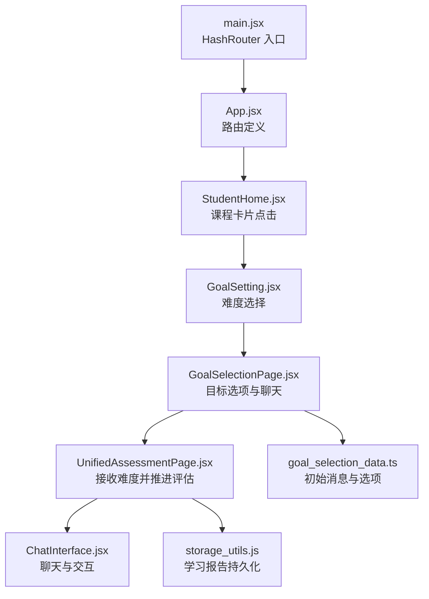
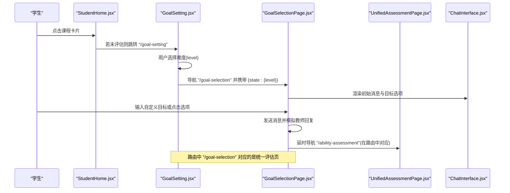
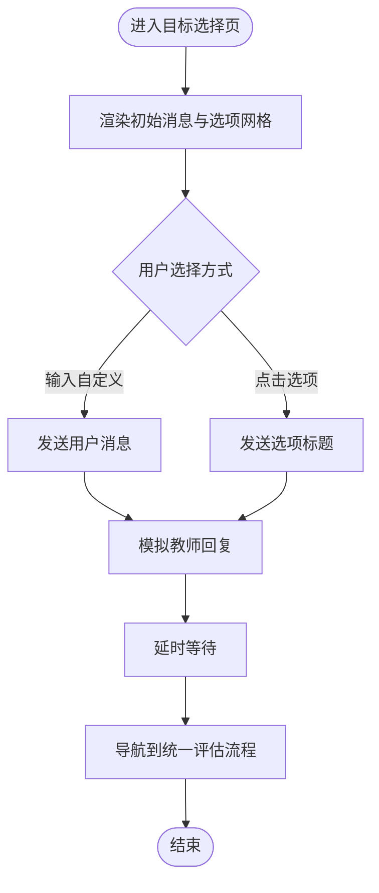
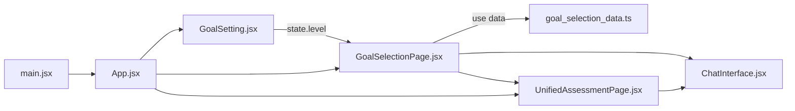

# 目标设定

<cite>
**本文引用的文件列表**
- [App.jsx](file://src/App.jsx)
- [main.jsx](file://src/main.jsx)
- [StudentHome.jsx](file://src/pages/StudentHome.jsx)
- [GoalSetting.jsx](file://src/pages/GoalSetting.jsx)
- [GoalSelectionPage.jsx](file://src/pages/GoalSelectionPage.jsx)
- [goal_selection_data.ts](file://src/data/goal_selection_data.ts)
- [UnifiedAssessmentPage.jsx](file://src/pages/UnifiedAssessmentPage.jsx)
- [ChatInterface.jsx](file://src/components/ChatInterface.jsx)
- [storage_utils.js](file://src/utils/storage_utils.js)
</cite>

## 目录
1. [简介](#简介)
2. [项目结构](#项目结构)
3. [核心组件](#核心组件)
4. [架构总览](#架构总览)
5. [详细组件分析](#详细组件分析)
6. [依赖关系分析](#依赖关系分析)
7. [性能考量](#性能考量)
8. [故障排查指南](#故障排查指南)
9. [结论](#结论)
10. [附录](#附录)

## 简介
本章节面向学生用户，围绕“目标设定”流程展开，重点说明如何通过 GoalSetting.jsx 和 GoalSelectionPage.jsx 完成学习目标的设定与确认，并解释 goal_selection_data.ts 中的目标数据结构及其在 UI 中的绑定方式。同时覆盖页面间导航逻辑（从学生首页跳转至目标设定）、用户选择后的状态传递与持久化机制，以及典型使用场景（如首次进入系统且未评估时自动跳转目标设定）。最后给出常见问题（如状态丢失或数据未更新）的排查方向。

## 项目结构
目标设定相关的关键文件与职责如下：
- 路由入口与导航：App.jsx 定义了路由映射；main.jsx 使用 HashRouter 包裹应用。
- 学生首页：StudentHome.jsx 提供课程卡片点击事件，用于触发目标设定流程。
- 目标设定页：GoalSetting.jsx 展示难度等级选项，将用户选择通过路由 state 传给后续页面。
- 目标选择页：GoalSelectionPage.jsx 展示预设目标选项与聊天交互，最终导航到统一评估流程。
- 数据源：goal_selection_data.ts 定义初始消息与目标选项，被目标选择页引用。
- 统一评估页：UnifiedAssessmentPage.jsx 接收难度等级，驱动后续评估流程。
- 聊天组件：ChatInterface.jsx 作为通用聊天界面，支持文本与多种交互卡片。
- 持久化工具：storage_utils.js 提供本地存储读写封装，可用于学习报告等数据持久化。

图表来源
- [main.jsx](file://src/main.jsx#L1-L14)
- [App.jsx](file://src/App.jsx#L50-L76)
- [StudentHome.jsx](file://src/pages/StudentHome.jsx#L43-L49)
- [GoalSetting.jsx](file://src/pages/GoalSetting.jsx#L39-L43)
- [GoalSelectionPage.jsx](file://src/pages/GoalSelectionPage.jsx#L15-L41)
- [goal_selection_data.ts](file://src/data/goal_selection_data.ts#L1-L39)
- [UnifiedAssessmentPage.jsx](file://src/pages/UnifiedAssessmentPage.jsx#L13-L23)
- [ChatInterface.jsx](file://src/components/ChatInterface.jsx#L1-L170)
- [storage_utils.js](file://src/utils/storage_utils.js#L1-L42)

章节来源
- [main.jsx](file://src/main.jsx#L1-L14)
- [App.jsx](file://src/App.jsx#L50-L76)

## 核心组件
- GoalSetting.jsx：展示三种难度等级（简单/中等/困难），用户点击后通过 useNavigate 以 state 形式携带 level 跳转至目标选择页。
- GoalSelectionPage.jsx：渲染初始消息与目标选项网格，支持用户自定义输入与点击选项两种方式；点击后通过聊天组件发送消息并延时导航到统一评估流程。
- goal_selection_data.ts：提供 INITIAL_MESSAGES 与 GOAL_OPTIONS 两个常量，分别用于聊天初始引导与目标选项展示。
- UnifiedAssessmentPage.jsx：接收来自前序页面的难度信息，驱动对话与交互流程，最终导航到仪表盘并携带难度与用户类型。
- ChatInterface.jsx：通用聊天界面，负责消息渲染、输入处理与交互卡片渲染。
- StudentHome.jsx：课程卡片点击时根据 isAssessed 字段决定跳转至目标设定或报告页；首次进入系统且未评估时会触发目标设定流程。

章节来源
- [GoalSetting.jsx](file://src/pages/GoalSetting.jsx#L12-L43)
- [GoalSelectionPage.jsx](file://src/pages/GoalSelectionPage.jsx#L15-L41)
- [goal_selection_data.ts](file://src/data/goal_selection_data.ts#L1-L39)
- [UnifiedAssessmentPage.jsx](file://src/pages/UnifiedAssessmentPage.jsx#L13-L23)
- [ChatInterface.jsx](file://src/components/ChatInterface.jsx#L1-L170)
- [StudentHome.jsx](file://src/pages/StudentHome.jsx#L43-L49)

## 架构总览
下图展示了从学生首页到目标设定再到统一评估的整体流程，以及数据在各组件之间的传递关系。

图表来源
- [StudentHome.jsx](file://src/pages/StudentHome.jsx#L43-L49)
- [GoalSetting.jsx](file://src/pages/GoalSetting.jsx#L39-L43)
- [GoalSelectionPage.jsx](file://src/pages/GoalSelectionPage.jsx#L15-L41)
- [App.jsx](file://src/App.jsx#L50-L76)

## 详细组件分析

### 目标设定页（GoalSetting.jsx）
- 功能要点
  - 展示三种难度等级卡片，点击后调用 handleSelect。
  - handleSelect 使用 useNavigate 导航至 "/goal-selection"，并通过 state 传递 level。
  - 页面包含返回按钮，便于用户撤销选择。
- 数据绑定
  - 该页面未直接引用 goal_selection_data.ts，其难度数据为本地数组，不涉及外部数据绑定。
- 状态传递
  - 通过路由 state 传递 level，后续页面可通过 useLocation 获取。

章节来源
- [GoalSetting.jsx](file://src/pages/GoalSetting.jsx#L12-L43)

### 目标选择页（GoalSelectionPage.jsx）
- 功能要点
  - 引入 INITIAL_MESSAGES 与 GOAL_OPTIONS，分别用于聊天引导与选项网格。
  - handleSendMessage 处理用户输入，添加用户消息并模拟教师回复，随后延时导航到统一评估流程。
  - handleOptionClick 将选项标题作为消息发送，实现快速选择。
- 数据绑定
  - GOAL_OPTIONS 通过映射渲染选项网格；INITIAL_MESSAGES 通过 ChatInterface 渲染初始对话。
- 导航逻辑
  - 在教师回复后延时执行导航，确保用户看到完整提示后再进入下一步。

图表来源
- [GoalSelectionPage.jsx](file://src/pages/GoalSelectionPage.jsx#L15-L41)
- [goal_selection_data.ts](file://src/data/goal_selection_data.ts#L1-L39)

章节来源
- [GoalSelectionPage.jsx](file://src/pages/GoalSelectionPage.jsx#L15-L41)
- [goal_selection_data.ts](file://src/data/goal_selection_data.ts#L1-L39)

### 统一评估页（UnifiedAssessmentPage.jsx）
- 功能要点
  - 接收来自前序页面的难度信息（通过 location.state.level），默认值为中等。
  - 通过 ChatInterface 与用户进行多轮对话，识别学习风格并进行互动验证。
  - 交互完成后导航到仪表盘，并携带 difficulty 与 userType。
- 数据绑定
  - 该页面未直接引用 goal_selection_data.ts，但通过路由 state 接收难度等级。
- 状态传递
  - 通过 useLocation 获取难度；通过 useNavigate 的 state 传递 userType 到仪表盘。

章节来源
- [UnifiedAssessmentPage.jsx](file://src/pages/UnifiedAssessmentPage.jsx#L13-L23)
- [UnifiedAssessmentPage.jsx](file://src/pages/UnifiedAssessmentPage.jsx#L103-L124)

### 路由与导航（App.jsx、main.jsx）
- 路由映射
  - "/goal-setting" 对应 GoalSetting.jsx。
  - "/goal-selection" 在路由中被映射为统一评估页（UnifiedAssessmentPage.jsx），用于承接目标选择与评估流程。
- 路由入口
  - main.jsx 使用 HashRouter 作为根组件，保证 SPA 路由正常工作。

章节来源
- [App.jsx](file://src/App.jsx#L50-L76)
- [main.jsx](file://src/main.jsx#L1-L14)

### 聊天组件（ChatInterface.jsx）
- 功能要点
  - 支持消息滚动、输入回车发送、typing 状态显示。
  - 根据消息类型渲染不同交互卡片（如 quiz、video、game、style_selector 等）。
- 与目标选择页协作
  - 目标选择页通过 ChatInterface 渲染初始消息与选项，实现自然的引导体验。

章节来源
- [ChatInterface.jsx](file://src/components/ChatInterface.jsx#L1-L170)

### 数据结构与绑定（goal_selection_data.ts）
- 结构说明
  - INITIAL_MESSAGES：数组，包含初始教师消息，用于引导用户输入或选择目标。
  - GOAL_OPTIONS：数组，包含三个目标选项，每个选项包含 id、title、description、icon。
- UI 绑定方式
  - 目标选择页直接引入并使用 INITIAL_MESSAGES 与 GOAL_OPTIONS，分别用于聊天消息与选项网格渲染。
- 作用范围
  - 该数据仅用于目标选择与评估引导阶段，不参与持久化。

章节来源
- [goal_selection_data.ts](file://src/data/goal_selection_data.ts#L1-L39)
- [GoalSelectionPage.jsx](file://src/pages/GoalSelectionPage.jsx#L6-L14)

### 首次进入系统自动跳转目标设定
- 触发条件
  - StudentHome.jsx 中课程卡片点击时，若课程 isAssessed 为 false，则跳转至 "/goal-setting"。
- 实现细节
  - 该逻辑位于 handleCourseClick 内部，满足条件即导航到目标设定页。

章节来源
- [StudentHome.jsx](file://src/pages/StudentHome.jsx#L43-L49)

### 状态持久化机制
- 当前实现
  - 目标设定流程中，难度等级通过 useNavigate 的 state 传递，未见显式写入 localStorage 或全局状态管理。
  - 学习报告相关的持久化逻辑集中在 storage_utils.js，用于学习报告数据的读取、保存与更新。
- 可能的扩展
  - 如需跨会话保留难度选择，可在目标设定页或统一评估页增加本地存储写入逻辑。

章节来源
- [GoalSetting.jsx](file://src/pages/GoalSetting.jsx#L39-L43)
- [UnifiedAssessmentPage.jsx](file://src/pages/UnifiedAssessmentPage.jsx#L13-L23)
- [storage_utils.js](file://src/utils/storage_utils.js#L1-L42)

## 依赖关系分析
- 组件耦合
  - GoalSetting.jsx 与 GoalSelectionPage.jsx 通过路由 state 间接耦合（前者传递 level，后者接收）。
  - GoalSelectionPage.jsx 依赖 goal_selection_data.ts 的数据。
  - UnifiedAssessmentPage.jsx 依赖 ChatInterface.jsx 的交互能力。
- 外部依赖
  - HashRouter 来源于 react-router-dom，保证 SPA 路由。
  - Ant Design 图标与组件用于 UI 呈现（GoalSetting.jsx）。
  - framer-motion 用于动画效果（GoalSelectionPage.jsx、UnifiedAssessmentPage.jsx）。

图表来源
- [GoalSetting.jsx](file://src/pages/GoalSetting.jsx#L39-L43)
- [GoalSelectionPage.jsx](file://src/pages/GoalSelectionPage.jsx#L15-L41)
- [goal_selection_data.ts](file://src/data/goal_selection_data.ts#L1-L39)
- [ChatInterface.jsx](file://src/components/ChatInterface.jsx#L1-L170)
- [UnifiedAssessmentPage.jsx](file://src/pages/UnifiedAssessmentPage.jsx#L13-L23)
- [App.jsx](file://src/App.jsx#L50-L76)
- [main.jsx](file://src/main.jsx#L1-L14)

章节来源
- [App.jsx](file://src/App.jsx#L50-L76)
- [main.jsx](file://src/main.jsx#L1-L14)

## 性能考量
- 路由切换与渲染
  - 使用 HashRouter 与按需组件加载可减少首屏压力；目标设定流程页面数量较少，切换开销低。
- 动画与交互
  - 目标选择页与统一评估页使用轻量动画，注意避免在低端设备上过度使用复杂动画。
- 数据绑定
  - 目标选项与初始消息均为小规模静态数据，渲染成本低。

## 故障排查指南
- 症状：从首页点击课程卡片未跳转目标设定
  - 检查课程 isAssessed 字段是否为 false；确认 handleCourseClick 是否被调用。
  - 章节来源
    - [StudentHome.jsx](file://src/pages/StudentHome.jsx#L43-L49)
- 症状：目标设定页点击难度无响应
  - 检查 handleSelect 是否被触发；确认 useNavigate 调用与路由映射。
  - 章节来源
    - [GoalSetting.jsx](file://src/pages/GoalSetting.jsx#L39-L43)
- 症状：目标选择页未显示初始消息或选项
  - 检查 goal_selection_data.ts 是否正确导出 INITIAL_MESSAGES 与 GOAL_OPTIONS；确认组件是否正确引入。
  - 章节来源
    - [goal_selection_data.ts](file://src/data/goal_selection_data.ts#L1-L39)
    - [GoalSelectionPage.jsx](file://src/pages/GoalSelectionPage.jsx#L6-L14)
- 症状：聊天消息无法发送或无回复
  - 检查 ChatInterface.jsx 的输入处理与消息渲染逻辑；确认 handleSendMessage 是否被调用。
  - 章节来源
    - [ChatInterface.jsx](file://src/components/ChatInterface.jsx#L1-L170)
- 症状：状态丢失或数据未更新
  - 当前流程未显式写入本地存储；如需持久化，可在目标设定页或统一评估页增加本地存储写入逻辑。
  - 章节来源
    - [GoalSetting.jsx](file://src/pages/GoalSetting.jsx#L39-L43)
    - [UnifiedAssessmentPage.jsx](file://src/pages/UnifiedAssessmentPage.jsx#L13-L23)
    - [storage_utils.js](file://src/utils/storage_utils.js#L1-L42)

## 结论
目标设定模块通过“难度选择—目标确认—统一评估”的链路，为学生提供了清晰的学习起点。GoalSetting.jsx 与 GoalSelectionPage.jsx 分别承担难度选择与目标确认的角色，二者通过路由 state 传递难度等级；目标选择页的数据来源于 goal_selection_data.ts。路由层将 "/goal-selection" 映射到统一评估页，从而串联起完整的评估流程。当前实现未显式持久化难度选择，如需跨会话保留，可在现有基础上增加本地存储写入逻辑。

## 附录
- 典型使用场景
  - 首次进入系统且课程未评估：点击课程卡片自动跳转至目标设定页，完成难度选择后进入统一评估流程。
- 常见问题与排查方向
  - 路由未生效：检查 App.jsx 中 "/goal-setting" 与 "/goal-selection" 的映射。
  - 数据未绑定：确认目标选择页正确引入并使用 goal_selection_data.ts。
  - 状态丢失：考虑在目标设定页或统一评估页增加本地存储写入逻辑。