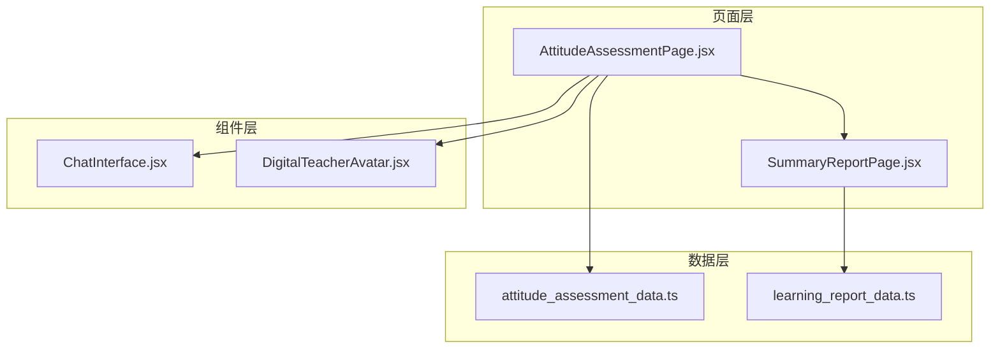
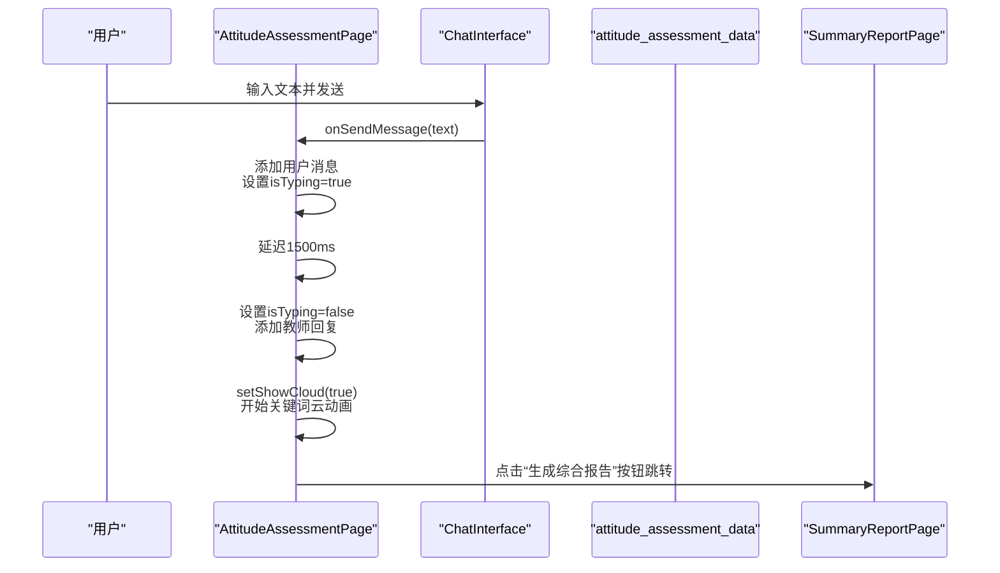
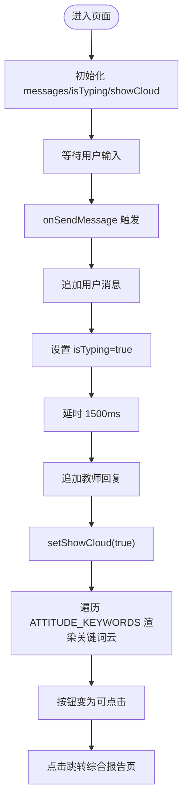
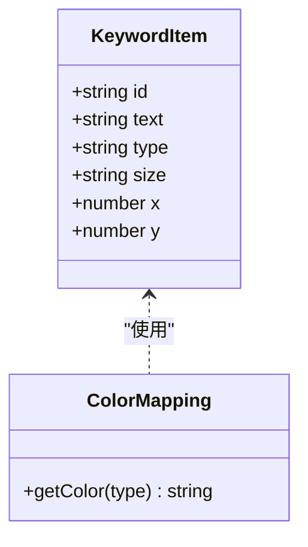
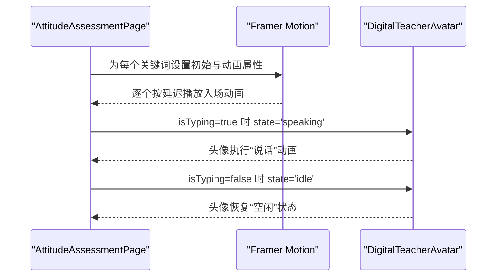
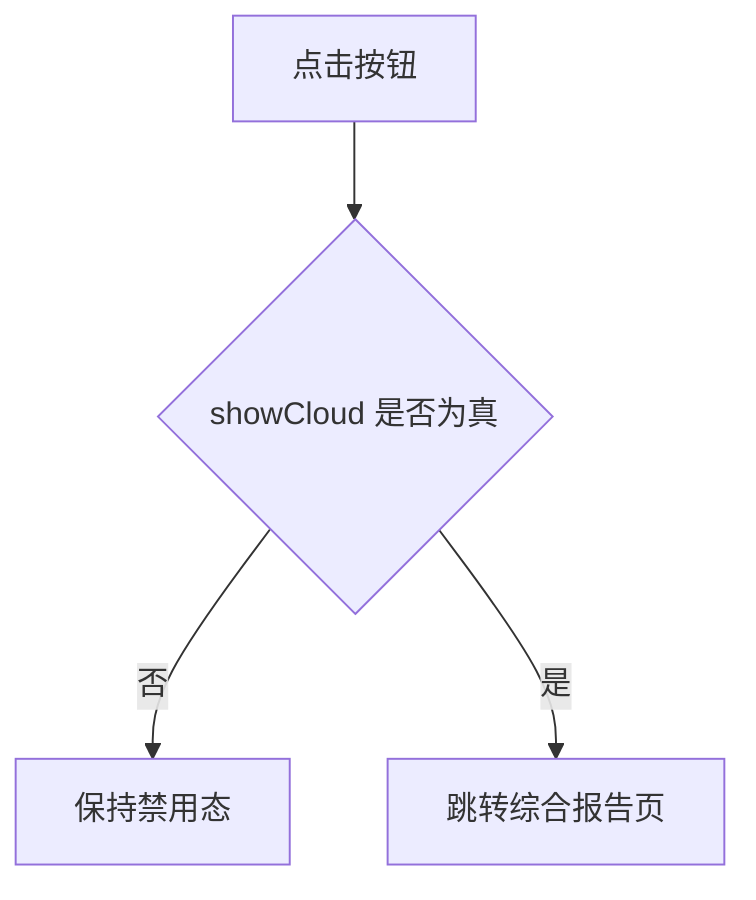
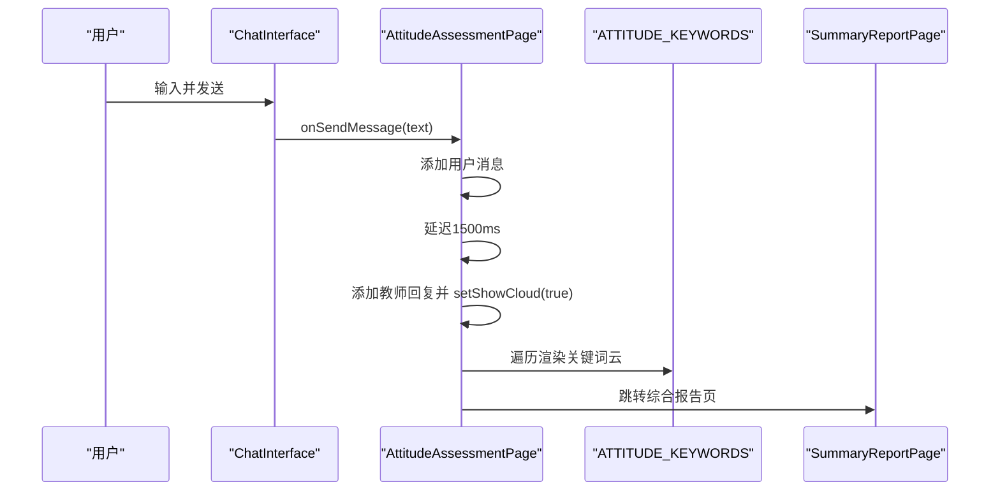
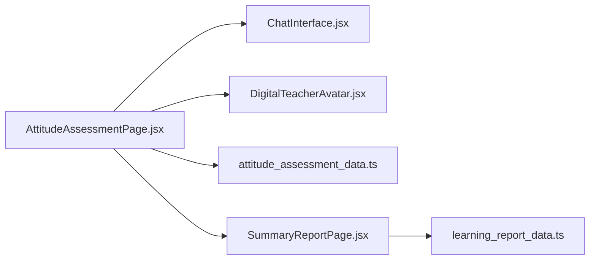

# 学习态度评估

<cite>
**本文引用的文件列表**
- [AttitudeAssessmentPage.jsx](file://src/pages/AttitudeAssessmentPage.jsx)
- [attitude_assessment_data.ts](file://src/data/attitude_assessment_data.ts)
- [ChatInterface.jsx](file://src/components/ChatInterface.jsx)
- [DigitalTeacherAvatar.jsx](file://src/components/DigitalTeacherAvatar.jsx)
- [SummaryReportPage.jsx](file://src/pages/SummaryReportPage.jsx)
- [learning_report_data.ts](file://src/data/learning_report_data.ts)
</cite>

## 目录
1. [引言](#引言)
2. [项目结构](#项目结构)
3. [核心组件](#核心组件)
4. [架构总览](#架构总览)
5. [详细组件分析](#详细组件分析)
6. [依赖关系分析](#依赖关系分析)
7. [性能考量](#性能考量)
8. [故障排查指南](#故障排查指南)
9. [结论](#结论)
10. [附录](#附录)

## 引言
本文件围绕“学习态度评估系统”的实现进行深入解析，重点聚焦于 AttitudeAssessmentPage 页面中“情绪关键词云”的动态生成机制。文档将结合 attitude_assessment_data.ts 中的 ATTITUDE_KEYWORDS 数据结构，解释不同情感类别（积极、消极、中性）在色彩映射上的逻辑；同时说明用户输入后触发的延迟动画效果（Framer Motion）与关键词云的渐进式呈现流程；并分析“生成综合报告”按钮的可用性控制模式。最后，给出从“心态采集”到“跳转综合报告页”的数据流转路径建议、关键词权重计算扩展思路以及性能优化方案。

## 项目结构
该功能位于页面层与数据层之间，采用“页面组件 + 数据常量 + 交互组件”的组合方式：
- 页面组件负责状态管理、消息流控制与路由跳转
- 数据常量提供初始对话与关键词云布局
- 交互组件负责聊天体验与教师头像状态联动

**图表来源**
- [AttitudeAssessmentPage.jsx](file://src/pages/AttitudeAssessmentPage.jsx#L1-L121)
- [attitude_assessment_data.ts](file://src/data/attitude_assessment_data.ts#L1-L23)
- [ChatInterface.jsx](file://src/components/ChatInterface.jsx#L1-L170)
- [DigitalTeacherAvatar.jsx](file://src/components/DigitalTeacherAvatar.jsx#L1-L63)
- [SummaryReportPage.jsx](file://src/pages/SummaryReportPage.jsx#L1-L736)
- [learning_report_data.ts](file://src/data/learning_report_data.ts#L1-L200)

**章节来源**
- [AttitudeAssessmentPage.jsx](file://src/pages/AttitudeAssessmentPage.jsx#L1-L121)
- [attitude_assessment_data.ts](file://src/data/attitude_assessment_data.ts#L1-L23)

## 核心组件
- AttitudeAssessmentPage：承载聊天界面与关键词云展示区域，负责消息发送、教师回复、延迟显示关键词云、按钮可用性控制与跳转综合报告页。
- ChatInterface：渲染消息气泡、输入框与发送按钮，支持回车发送、滚动到底部、打字指示器等。
- DigitalTeacherAvatar：教师头像组件，根据状态（空闲/说话）展示不同动画效果。
- attitude_assessment_data：提供初始对话与关键词云数据（包含 id、文本、类型、字号、坐标）。
- SummaryReportPage：综合报告页，用于展示学习概览、能力雷达、知识地图、趋势与个性化建议等。

**章节来源**
- [AttitudeAssessmentPage.jsx](file://src/pages/AttitudeAssessmentPage.jsx#L1-L121)
- [ChatInterface.jsx](file://src/components/ChatInterface.jsx#L1-L170)
- [DigitalTeacherAvatar.jsx](file://src/components/DigitalTeacherAvatar.jsx#L1-L63)
- [attitude_assessment_data.ts](file://src/data/attitude_assessment_data.ts#L1-L23)
- [SummaryReportPage.jsx](file://src/pages/SummaryReportPage.jsx#L1-L736)

## 架构总览
下图展示了从用户输入到关键词云呈现再到跳转综合报告的整体流程。

**图表来源**
- [AttitudeAssessmentPage.jsx](file://src/pages/AttitudeAssessmentPage.jsx#L15-L33)
- [ChatInterface.jsx](file://src/components/ChatInterface.jsx#L22-L33)
- [attitude_assessment_data.ts](file://src/data/attitude_assessment_data.ts#L1-L12)
- [SummaryReportPage.jsx](file://src/pages/SummaryReportPage.jsx#L1-L20)

## 详细组件分析

### AttitudeAssessmentPage 组件
- 状态管理
  - messages：维护初始与交互消息
  - isTyping：控制教师打字指示器
  - showCloud：控制关键词云是否展示
- 用户交互
  - handleSendMessage：添加用户消息，短暂延迟后添加教师回复并开启关键词云
  - handleNext：跳转至综合报告页
- 关键词云渲染
  - 使用 ATTITUDE_KEYWORDS 遍历渲染
  - Framer Motion 实现逐个入场动画（延迟递增、弹簧缓动）
  - 通过 getColor 根据 type 返回不同颜色类名
  - 通过 item.size 控制字号大小
  - 通过 item.x、item.y 与 translate(-50%, -50%) 实现绝对定位居中锚定
- 按钮可用性控制
  - “生成综合报告”按钮仅在 showCloud 为真时启用
  - 未启用时使用禁用样式与不可点击状态

**图表来源**
- [AttitudeAssessmentPage.jsx](file://src/pages/AttitudeAssessmentPage.jsx#L15-L33)
- [AttitudeAssessmentPage.jsx](file://src/pages/AttitudeAssessmentPage.jsx#L71-L115)
- [attitude_assessment_data.ts](file://src/data/attitude_assessment_data.ts#L1-L23)

**章节来源**
- [AttitudeAssessmentPage.jsx](file://src/pages/AttitudeAssessmentPage.jsx#L1-L121)

### 关键词云数据结构与色彩映射
- 数据结构
  - ATTITUDE_KEYWORDS：数组，元素包含 id、text、type、size、x、y
  - type：positive/negative/neutral
  - size：字号类名（如 text-2xl、text-3xl、text-4xl、text-5xl）
  - x/y：百分比坐标，配合 translate(-50%, -50%) 实现居中
- 色彩映射
  - getColor(type)：根据 type 返回对应颜色类名
    - positive → emerald-500
    - negative → rose-500
    - neutral → indigo-400
- 布局算法
  - 固定布局：直接使用预设的 x/y 百分比定位
  - 字号映射：通过 size 类名体现权重或视觉强调程度
  - 动画：按索引递增延迟，弹簧缓动，形成渐进式呈现

**图表来源**
- [attitude_assessment_data.ts](file://src/data/attitude_assessment_data.ts#L14-L22)
- [AttitudeAssessmentPage.jsx](file://src/pages/AttitudeAssessmentPage.jsx#L35-L42)

**章节来源**
- [attitude_assessment_data.ts](file://src/data/attitude_assessment_data.ts#L1-L23)
- [AttitudeAssessmentPage.jsx](file://src/pages/AttitudeAssessmentPage.jsx#L35-L42)

### 动画与交互细节
- Framer Motion 动画
  - 关键词云逐项入场：initial 透明+缩放 → animate 不透明+缩放
  - transition：delay=索引×0.1，type=spring，stiffness=100
  - hover：scale-110，transform 过渡
- 打字指示器
  - isTyping=true 时显示教师头像“说话”状态与三点动画
- 教师头像联动
  - DigitalTeacherAvatar 根据 state 切换“speaking/idle”，带动光晕与闪烁效果

**图表来源**
- [AttitudeAssessmentPage.jsx](file://src/pages/AttitudeAssessmentPage.jsx#L71-L115)
- [DigitalTeacherAvatar.jsx](file://src/components/DigitalTeacherAvatar.jsx#L1-L63)

**章节来源**
- [AttitudeAssessmentPage.jsx](file://src/pages/AttitudeAssessmentPage.jsx#L71-L115)
- [DigitalTeacherAvatar.jsx](file://src/components/DigitalTeacherAvatar.jsx#L1-L63)

### 按钮可用性控制模式
- 设计模式
  - 以 showCloud 作为开关：true 时按钮启用，false 时禁用
  - 禁用态样式：背景灰、文字灰、禁用指针、不可点击
  - 启用态样式：渐变背景、阴影、悬停放大与过渡
- 触发时机
  - 用户发送消息后，经延迟添加教师回复并设置 showCloud=true
  - 此时按钮才可点击，避免提前跳转

**图表来源**
- [AttitudeAssessmentPage.jsx](file://src/pages/AttitudeAssessmentPage.jsx#L102-L114)

**章节来源**
- [AttitudeAssessmentPage.jsx](file://src/pages/AttitudeAssessmentPage.jsx#L102-L114)

### 数据流转路径：从心态采集到综合报告
- 心态采集
  - 用户在左侧聊天区输入真实感受
  - ChatInterface 调用 onSendMessage，AttitudeAssessmentPage 追加用户消息并启动延迟
- 关键词云呈现
  - 延迟结束后添加教师回复并开启关键词云
  - 关键词云基于 ATTITUDE_KEYWORDS 的固定布局与色彩映射
- 跳转综合报告
  - 用户点击“生成综合报告”按钮，AttitudeAssessmentPage 跳转至 SummaryReportPage
  - 综合报告页使用 learning_report_data.ts 提供的静态数据进行渲染

**图表来源**
- [AttitudeAssessmentPage.jsx](file://src/pages/AttitudeAssessmentPage.jsx#L15-L33)
- [attitude_assessment_data.ts](file://src/data/attitude_assessment_data.ts#L14-L22)
- [SummaryReportPage.jsx](file://src/pages/SummaryReportPage.jsx#L1-L20)

**章节来源**
- [AttitudeAssessmentPage.jsx](file://src/pages/AttitudeAssessmentPage.jsx#L15-L33)
- [attitude_assessment_data.ts](file://src/data/attitude_assessment_data.ts#L1-L23)
- [SummaryReportPage.jsx](file://src/pages/SummaryReportPage.jsx#L1-L20)

## 依赖关系分析
- 组件耦合
  - AttitudeAssessmentPage 依赖 ChatInterface、DigitalTeacherAvatar、attitude_assessment_data
  - 关键词云渲染依赖 ATTITUDE_KEYWORDS 的结构字段（id、text、type、size、x、y）
- 外部依赖
  - Framer Motion：用于动画与过渡
  - react-router-dom：用于页面跳转
- 数据契约
  - AttitudeAssessmentPage 通过 state 与 props 与子组件通信
  - 关键词云渲染不依赖外部输入，仅依赖数据常量

**图表来源**
- [AttitudeAssessmentPage.jsx](file://src/pages/AttitudeAssessmentPage.jsx#L1-L121)
- [ChatInterface.jsx](file://src/components/ChatInterface.jsx#L1-L170)
- [DigitalTeacherAvatar.jsx](file://src/components/DigitalTeacherAvatar.jsx#L1-L63)
- [attitude_assessment_data.ts](file://src/data/attitude_assessment_data.ts#L1-L23)
- [SummaryReportPage.jsx](file://src/pages/SummaryReportPage.jsx#L1-L736)
- [learning_report_data.ts](file://src/data/learning_report_data.ts#L1-L200)

**章节来源**
- [AttitudeAssessmentPage.jsx](file://src/pages/AttitudeAssessmentPage.jsx#L1-L121)
- [attitude_assessment_data.ts](file://src/data/attitude_assessment_data.ts#L1-L23)

## 性能考量
- 当前实现
  - 关键词云为固定布局，渲染数量有限，性能开销较低
  - 动画使用 Framer Motion 的默认配置，延迟与弹簧参数可控
- 可能的优化方向
  - 动画参数调优：根据设备性能调整 stiffness 与 delay，减少卡顿
  - 虚拟化：若关键词数量增长，可考虑按可视区域渲染（视口内渲染）
  - 数据驱动权重：将 type 与 size 映射为数值权重，便于后续扩展
  - 按需加载：关键词云在首次触发时再请求或计算，避免首屏渲染压力
  - 缓存策略：对已渲染的关键词位置与样式进行缓存，减少重复计算
  - 动画合并：将多个关键词的入场动画合并为批次，降低重排次数

[本节为通用性能建议，无需特定文件引用]

## 故障排查指南
- 关键词云不出现
  - 检查 showCloud 是否被置为 true（应由 handleSendMessage 延迟触发）
  - 确认 ATTITUDE_KEYWORDS 数据存在且字段完整（id、text、type、size、x、y）
- 按钮始终不可用
  - 确认 handleNext 前 showCloud 已被置为 true
  - 检查按钮 disabled 条件与 showCloud 的绑定
- 动画异常
  - 检查 Framer Motion 版本与配置（delay、type、stiffness）
  - 确保每个关键词有唯一 id，避免 key 冲突导致重绘异常
- 教师头像状态不一致
  - 确认 isTyping 与 state 的联动逻辑（speaking/idle）

**章节来源**
- [AttitudeAssessmentPage.jsx](file://src/pages/AttitudeAssessmentPage.jsx#L15-L33)
- [AttitudeAssessmentPage.jsx](file://src/pages/AttitudeAssessmentPage.jsx#L71-L115)
- [DigitalTeacherAvatar.jsx](file://src/components/DigitalTeacherAvatar.jsx#L1-L63)

## 结论
AttitudeAssessmentPage 通过“固定布局 + 颜色映射 + 渐进式动画”的方式，实现了情绪关键词云的直观呈现。其核心在于：
- 以 ATTITUDE_KEYWORDS 为数据源，明确 type/size/x/y 的语义
- 通过延迟与状态切换，确保用户体验的节奏感
- 以 showCloud 为开关，保证“生成综合报告”按钮的可用性
- 与 ChatInterface、DigitalTeacherAvatar 协同，形成完整的交互闭环

未来可在“关键词权重计算”“动态布局算法”“按需渲染”等方面进一步扩展，以适配更复杂场景与更高性能需求。

[本节为总结性内容，无需特定文件引用]

## 附录

### 关键词权重计算扩展建议
- 基于输入文本的词频统计与情感强度评分，将 type 映射为数值权重（如 positive=1、neutral=0、negative=-1），size 与权重成正比
- 引入 NLP 情感词典或简单规则（如否定词反转、程度副词增强），对关键词进行加权
- 将权重与现有 size 类名映射结合，实现更精细的视觉强调
- 若关键词数量较多，可引入聚类或布局算法（如圆形/螺旋/网格）替代固定坐标，提升空间利用率

[本节为扩展建议，无需特定文件引用]