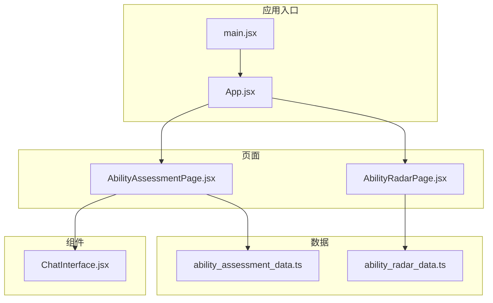
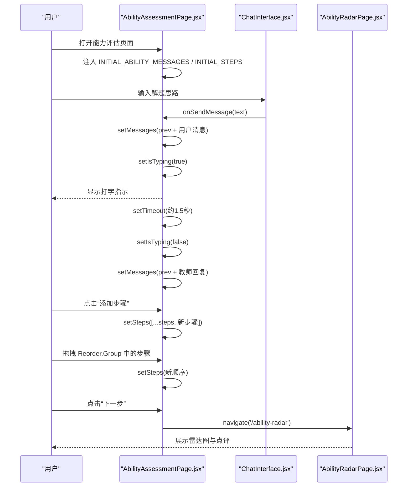
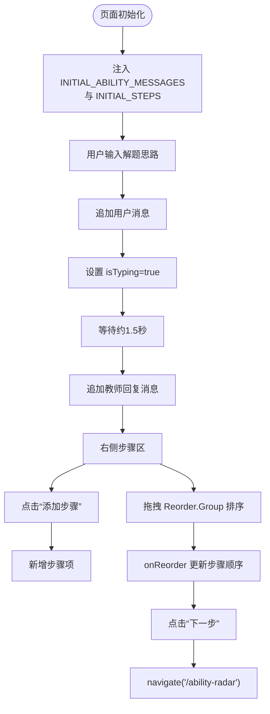
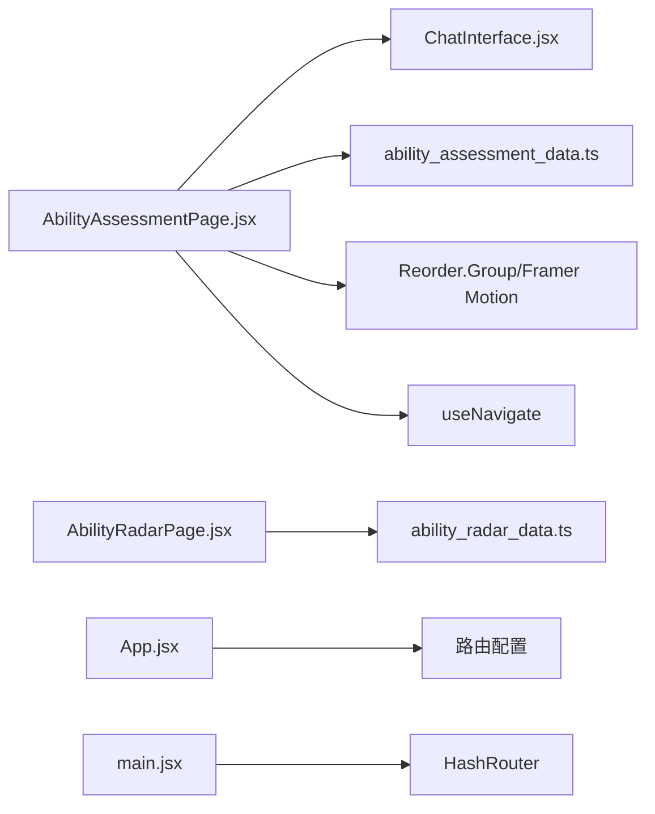

# 知识能力评估

<cite>
**本文引用的文件**
- [AbilityAssessmentPage.jsx](file://src/pages/AbilityAssessmentPage.jsx)
- [ability_assessment_data.ts](file://src/data/ability_assessment_data.ts)
- [ChatInterface.jsx](file://src/components/ChatInterface.jsx)
- [AbilityRadarPage.jsx](file://src/pages/AbilityRadarPage.jsx)
- [ability_radar_data.ts](file://src/data/ability_radar_data.ts)
- [App.jsx](file://src/App.jsx)
- [main.jsx](file://src/main.jsx)
- [dialogueUtils.js](file://src/utils/dialogueUtils.js)
</cite>

## 目录
1. [引言](#引言)
2. [项目结构](#项目结构)
3. [核心组件](#核心组件)
4. [架构总览](#架构总览)
5. [详细组件分析](#详细组件分析)
6. [依赖关系分析](#依赖关系分析)
7. [性能考量](#性能考量)
8. [故障排查指南](#故障排查指南)
9. [结论](#结论)

## 引言
本文件围绕“知识能力评估”流程进行深入解析，重点聚焦于 AbilityAssessmentPage 页面中基于 Framer Motion 的拖拽式思维步骤构建交互设计，以及从用户聊天输入到步骤排序再到跳转至能力雷达图的完整流程。文档同时说明 INITIAL_ABILITY_MESSAGES 和 INITIAL_STEPS 在页面初始化时的数据注入过程，阐述动态反馈机制与拖拽排序（Reorder.Group）如何帮助学生构建解题逻辑框架，并给出异常处理与状态同步恢复策略建议。

## 项目结构
本次分析涉及的关键文件与职责如下：
- 页面层
  - AbilityAssessmentPage.jsx：能力评估主页面，负责聊天输入、动态反馈、拖拽步骤构建与下一步导航。
  - AbilityRadarPage.jsx：能力雷达图展示页，负责渲染雷达图与教师点评。
- 数据层
  - ability_assessment_data.ts：提供初始聊天消息与初始步骤列表。
  - ability_radar_data.ts：提供雷达图数据与点评文案。
- 组件层
  - ChatInterface.jsx：通用聊天界面组件，支持文本消息、打字指示与交互式卡片。
- 应用入口与路由
  - App.jsx：定义能力评估相关路由。
  - main.jsx：应用根容器与 HashRouter 包裹。

图表来源
- [main.jsx](file://src/main.jsx#L1-L14)
- [App.jsx](file://src/App.jsx#L50-L99)
- [AbilityAssessmentPage.jsx](file://src/pages/AbilityAssessmentPage.jsx#L1-L117)
- [AbilityRadarPage.jsx](file://src/pages/AbilityRadarPage.jsx#L1-L91)
- [ability_assessment_data.ts](file://src/data/ability_assessment_data.ts#L1-L21)
- [ability_radar_data.ts](file://src/data/ability_radar_data.ts#L1-L10)

章节来源
- [main.jsx](file://src/main.jsx#L1-L14)
- [App.jsx](file://src/App.jsx#L50-L99)

## 核心组件
- AbilityAssessmentPage.jsx
  - 初始化：从 ability_assessment_data.ts 注入 INITIAL_ABILITY_MESSAGES 与 INITIAL_STEPS。
  - 交互：用户输入触发动态反馈（打字状态、教师回复），支持添加步骤与拖拽排序。
  - 导航：点击下一步跳转至能力雷达图页面。
- ChatInterface.jsx
  - 负责渲染消息气泡、打字指示、输入框与回车发送。
  - 支持不同类型的消息内容（文本、问答卡、视频卡、逻辑游戏卡等）。
- AbilityRadarPage.jsx
  - 基于 recharts 渲染雷达图，展示能力画像与教师点评。
- ability_assessment_data.ts
  - 提供初始聊天消息与初始步骤模板。
- ability_radar_data.ts
  - 提供雷达图数据与点评文案。

章节来源
- [AbilityAssessmentPage.jsx](file://src/pages/AbilityAssessmentPage.jsx#L1-L117)
- [ChatInterface.jsx](file://src/components/ChatInterface.jsx#L1-L170)
- [ability_assessment_data.ts](file://src/data/ability_assessment_data.ts#L1-L21)
- [ability_radar_data.ts](file://src/data/ability_radar_data.ts#L1-L10)

## 架构总览
能力评估流程由“聊天输入—动态反馈—步骤构建—拖拽排序—跳转雷达图”构成，页面间通过 HashRouter 进行导航。

图表来源
- [AbilityAssessmentPage.jsx](file://src/pages/AbilityAssessmentPage.jsx#L1-L117)
- [ChatInterface.jsx](file://src/components/ChatInterface.jsx#L1-L170)
- [App.jsx](file://src/App.jsx#L58-L70)
- [AbilityRadarPage.jsx](file://src/pages/AbilityRadarPage.jsx#L1-L91)

## 详细组件分析

### AbilityAssessmentPage.jsx：拖拽式思维步骤构建与动态反馈
- 初始化数据注入
  - 使用 INITIAL_ABILITY_MESSAGES 作为初始聊天消息，使用 INITIAL_STEPS 作为初始步骤模板。
  - 初始状态包含 messages、steps、isTyping 三个状态。
- 动态反馈机制
  - 用户发送消息后，立即追加用户消息；随后设置 isTyping 为真，显示打字指示。
  - 经过约 1.5 秒延迟，isTyping 设为假，并追加一条教师回复消息，提示可拖拽调整步骤或添加新步骤。
- 步骤构建与拖拽排序
  - 提供“添加步骤”按钮，向步骤列表追加一个新步骤对象（含唯一 id 与默认内容）。
  - 使用 Reorder.Group 实现纵向拖拽排序，onReorder 回调更新步骤顺序。
  - 每个步骤项使用 Reorder.Item 包裹，配合 Framer Motion 的 layout 动画与入场/出场过渡，提供顺滑的视觉反馈。
- 导航至能力雷达图
  - 点击“下一步”按钮，通过 useNavigate 导航到 /ability-radar。

图表来源
- [AbilityAssessmentPage.jsx](file://src/pages/AbilityAssessmentPage.jsx#L1-L117)

章节来源
- [AbilityAssessmentPage.jsx](file://src/pages/AbilityAssessmentPage.jsx#L1-L117)

### ability_assessment_data.ts：初始数据结构与注入过程
- 结构定义
  - INITIAL_ABILITY_MESSAGES：数组，包含两条初始教师消息，用于引导用户描述解题思路。
  - INITIAL_STEPS：数组，包含若干标准步骤模板，覆盖“理解题意—过程可视化—信息整理—原理分析—建立方程求解”等典型物理解题流程。
- 注入过程
  - AbilityAssessmentPage.jsx 在组件初始化时，将 INITIAL_ABILITY_MESSAGES 赋值给 messages 状态，将 INITIAL_STEPS 赋值给 steps 状态，完成页面初始数据注入。

章节来源
- [ability_assessment_data.ts](file://src/data/ability_assessment_data.ts#L1-L21)
- [AbilityAssessmentPage.jsx](file://src/pages/AbilityAssessmentPage.jsx#L10-L13)

### ChatInterface.jsx：聊天输入与消息渲染
- 输入与发送
  - 支持文本输入与回车发送；禁用按钮在输入为空时生效。
- 消息渲染
  - 使用 AnimatePresence/motion 实现消息的进入/退出动画。
  - 打字指示采用三连点动画，模拟“正在输入”状态。
- 类型化内容
  - 支持多种消息类型（文本、问答卡、视频卡、逻辑游戏卡、风格选择器等），通过 msg.type 与 renderContent 分发渲染。

章节来源
- [ChatInterface.jsx](file://src/components/ChatInterface.jsx#L1-L170)

### AbilityRadarPage.jsx：能力雷达图与点评
- 数据与渲染
  - 使用 ability_radar_data.ts 中的 ABILITY_DATA 渲染雷达图。
  - 通过 useEffect 延迟显示雷达图，配合 Framer Motion 的进入动画增强体验。
- 导航
  - 提供“下一步”按钮，跳转至知识点评估页面（在当前路由中为 /knowledge-nebula）。

章节来源
- [AbilityRadarPage.jsx](file://src/pages/AbilityRadarPage.jsx#L1-L91)
- [ability_radar_data.ts](file://src/data/ability_radar_data.ts#L1-L10)

### 路由与导航
- 能力评估相关路由
  - /ability-assessment：能力评估页面
  - /ability-radar：能力雷达图页面
- 应用入口
  - main.jsx 使用 HashRouter 包裹应用，确保前端路由正常工作。

章节来源
- [App.jsx](file://src/App.jsx#L58-L70)
- [main.jsx](file://src/main.jsx#L1-L14)

## 依赖关系分析
- 组件耦合
  - AbilityAssessmentPage.jsx 依赖 ChatInterface.jsx 进行消息交互，依赖 ability_assessment_data.ts 提供初始数据。
  - AbilityRadarPage.jsx 依赖 ability_radar_data.ts 提供雷达图数据。
- 外部库
  - Framer Motion：用于 Reorder.Group、layout 动画与页面进入/退出过渡。
  - react-router-dom：用于页面导航（useNavigate）。
  - lucide-react：图标库（GripVertical、Plus、ArrowRight、Sparkles 等）。
- 数据持久化与分析（扩展）
  - dialogueUtils.js 提供对话历史与掌握程度分析等工具函数，可用于扩展能力评估流程中的状态持久化与智能推荐。

图表来源
- [AbilityAssessmentPage.jsx](file://src/pages/AbilityAssessmentPage.jsx#L1-L117)
- [ChatInterface.jsx](file://src/components/ChatInterface.jsx#L1-L170)
- [ability_assessment_data.ts](file://src/data/ability_assessment_data.ts#L1-L21)
- [AbilityRadarPage.jsx](file://src/pages/AbilityRadarPage.jsx#L1-L91)
- [ability_radar_data.ts](file://src/data/ability_radar_data.ts#L1-L10)
- [App.jsx](file://src/App.jsx#L58-L70)
- [main.jsx](file://src/main.jsx#L1-L14)

章节来源
- [App.jsx](file://src/App.jsx#L58-L70)
- [main.jsx](file://src/main.jsx#L1-L14)

## 性能考量
- 动画与重排
  - Reorder.Group 与 layout 动画在大量步骤时可能带来重排成本，建议控制步骤数量上限或启用虚拟滚动（若后续扩展）。
- 打字指示与延迟
  - 1.5 秒延迟用于模拟真实回复，避免频繁渲染；可根据网络与设备性能调整。
- 图表渲染
  - 雷达图在首次渲染时使用延迟显示，减少首屏阻塞；可结合懒加载进一步优化。

[本节为通用性能建议，不直接分析具体文件]

## 故障排查指南
- 状态同步失败的恢复策略
  - 问题现象：拖拽排序后步骤顺序未持久化或刷新后丢失。
  - 建议措施：
    - 在 AbilityAssessmentPage.jsx 中增加本地存储写入（例如 localStorage），在 setSteps 回调中同步持久化。
    - 若读取失败，回退到 INITIAL_STEPS 并提示用户重试。
    - 对于聊天消息，可参考 dialogueUtils.js 的持久化模式，按节点维度保存对话历史，便于恢复。
- 路由跳转异常
  - 现象：点击“下一步”无法跳转。
  - 排查：确认 App.jsx 中 /ability-radar 路由存在且路径正确；检查 useNavigate 是否在路由上下文中使用。
- 打字指示不消失
  - 现象：isTyping 一直为真。
  - 排查：检查 handleSendMessage 中的 setTimeout 是否执行；必要时增加错误兜底，超时后强制置为 false。
- 数据注入失败
  - 现象：页面空白或无初始步骤。
  - 排查：确认 ability_assessment_data.ts 导出的常量存在且命名一致；检查 AbilityAssessmentPage.jsx 的导入路径。

章节来源
- [AbilityAssessmentPage.jsx](file://src/pages/AbilityAssessmentPage.jsx#L1-L117)
- [ability_assessment_data.ts](file://src/data/ability_assessment_data.ts#L1-L21)
- [App.jsx](file://src/App.jsx#L58-L70)
- [dialogueUtils.js](file://src/utils/dialogueUtils.js#L1-L495)

## 结论
AbilityAssessmentPage 通过“聊天输入—动态反馈—拖拽排序—跳转雷达图”的闭环流程，有效帮助学生梳理解题逻辑并形成可调整的步骤框架。INITIAL_ABILITY_MESSAGES 与 INITIAL_STEPS 在页面初始化时完成数据注入，为后续交互奠定基础。结合 Framer Motion 的 Reorder.Group 与动画，提供了直观、顺滑的拖拽体验。建议在现有基础上引入状态持久化与错误恢复机制，以提升稳定性与用户体验。