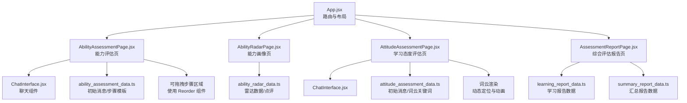
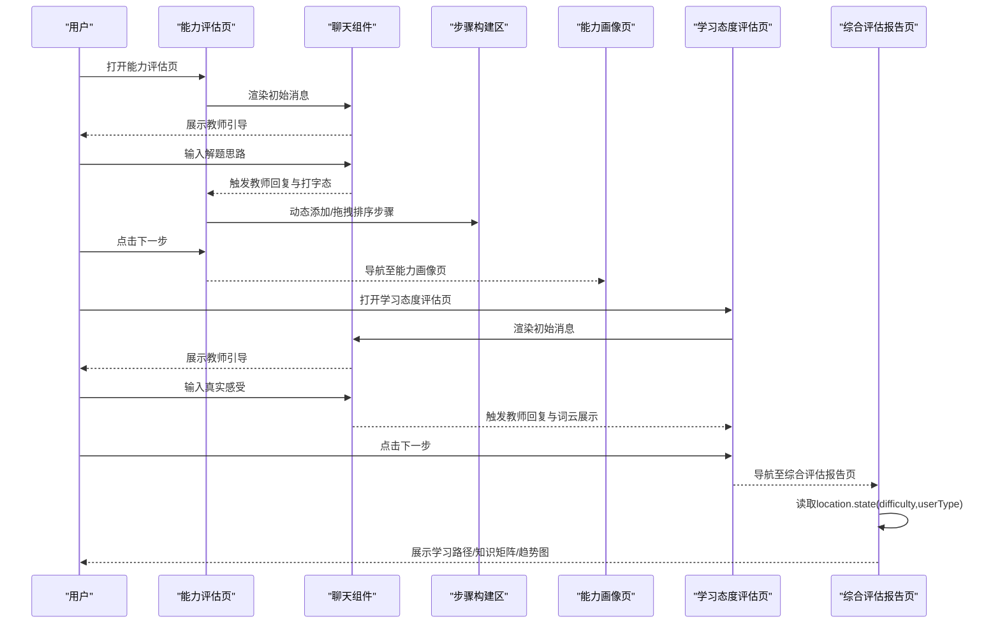
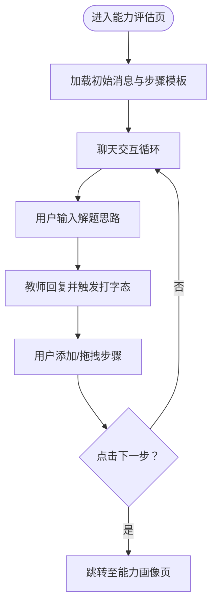
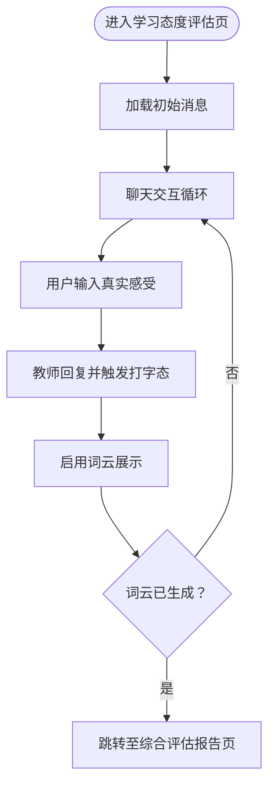
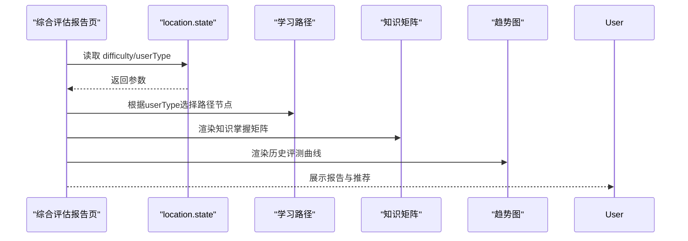
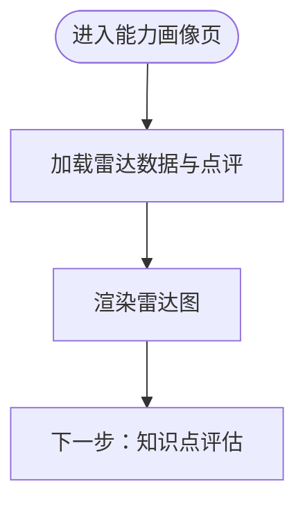
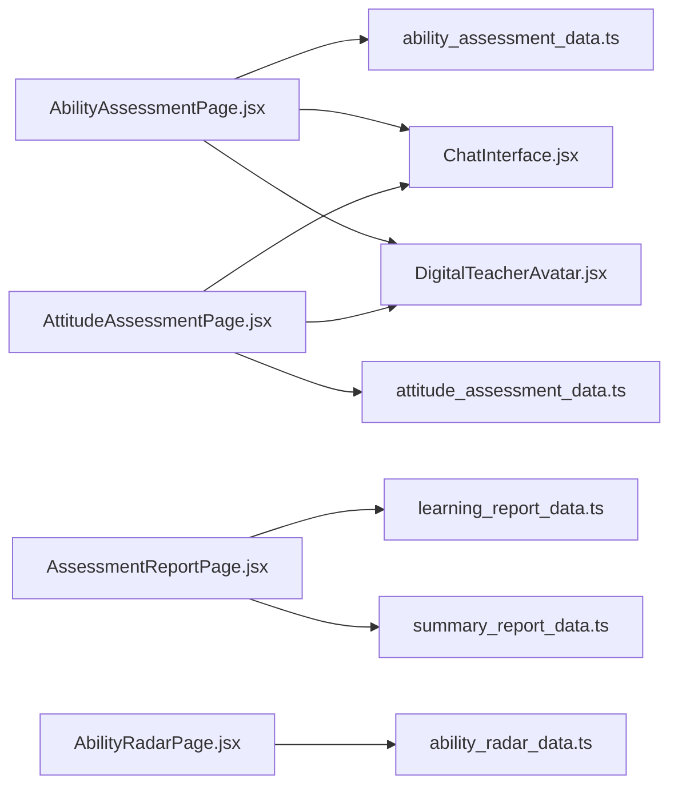

# 能力评估

<cite>
**本文引用的文件列表**
- [App.jsx](file://src/App.jsx)
- [AbilityAssessmentPage.jsx](file://src/pages/AbilityAssessmentPage.jsx)
- [ability_assessment_data.ts](file://src/data/ability_assessment_data.ts)
- [ChatInterface.jsx](file://src/components/ChatInterface.jsx)
- [DigitalTeacherAvatar.jsx](file://src/components/DigitalTeacherAvatar.jsx)
- [AbilityRadarPage.jsx](file://src/pages/AbilityRadarPage.jsx)
- [ability_radar_data.ts](file://src/data/ability_radar_data.ts)
- [AttitudeAssessmentPage.jsx](file://src/pages/AttitudeAssessmentPage.jsx)
- [attitude_assessment_data.ts](file://src/data/attitude_assessment_data.ts)
- [AssessmentReportPage.jsx](file://src/pages/AssessmentReportPage.jsx)
- [summary_report_data.ts](file://src/data/summary_report_data.ts)
- [learning_report_data.ts](file://src/data/learning_report_data.ts)
</cite>

## 目录
1. [引言](#引言)
2. [项目结构](#项目结构)
3. [核心组件](#核心组件)
4. [架构总览](#架构总览)
5. [详细组件分析](#详细组件分析)
6. [依赖关系分析](#依赖关系分析)
7. [性能考量](#性能考量)
8. [故障排查指南](#故障排查指南)
9. [结论](#结论)
10. [附录](#附录)

## 引言
本文件面向能力评估系统，围绕“知识、技能与学习态度”的多维度测评展开，重点解析以下页面与数据：
- 能力评估页 AbilityAssessmentPage.jsx：通过聊天与可拖拽步骤构建，引导学生输出解题思维步骤，形成能力画像的数据输入。
- 学习态度评估页 AttitudeAssessmentPage.jsx：通过聊天与词云展示，采集学习情绪与行为倾向，作为综合报告的输入之一。
- 综合评估报告页 AssessmentReportPage.jsx：整合能力画像、学习路径与知识掌握矩阵，生成初步反馈报告，并与后续学习路径推荐形成数据闭环。

同时，文档将结合 ability_assessment_data.ts 与 attitude_assessment_data.ts 中的题库/初始消息结构，说明动态渲染与评分逻辑；并提供评估流程的完整示例，包含答题状态管理、提交处理及异常情况（如网络中断）的容错策略。

## 项目结构
评估系统采用路由驱动的页面组织方式，核心评估流程由多页面串联而成：
- 路由入口与布局：App.jsx 定义评估相关路由与布局包装。
- 评估流程页面：
  - 能力评估：AbilityAssessmentPage.jsx
  - 能力画像：AbilityRadarPage.jsx
  - 学习态度评估：AttitudeAssessmentPage.jsx
  - 综合报告：AssessmentReportPage.jsx
- 交互组件：
  - ChatInterface.jsx：通用聊天界面，支持文本与多种互动卡片。
  - DigitalTeacherAvatar.jsx：教师头像与状态指示。
- 数据源：
  - ability_assessment_data.ts：能力评估初始消息与步骤模板。
  - attitude_assessment_data.ts：态度评估初始消息与词云关键词。
  - ability_radar_data.ts：能力雷达数据与点评。
  - learning_report_data.ts：学习报告数据（用于报告页的扩展展示）。
  - summary_report_data.ts：汇总报告数据（用于综合报告的输入）。

**图表来源**
- [App.jsx](file://src/App.jsx#L50-L71)
- [AbilityAssessmentPage.jsx](file://src/pages/AbilityAssessmentPage.jsx#L1-L117)
- [AbilityRadarPage.jsx](file://src/pages/AbilityRadarPage.jsx#L1-L91)
- [AttitudeAssessmentPage.jsx](file://src/pages/AttitudeAssessmentPage.jsx#L1-L121)
- [AssessmentReportPage.jsx](file://src/pages/AssessmentReportPage.jsx#L1-L320)
- [ability_assessment_data.ts](file://src/data/ability_assessment_data.ts#L1-L21)
- [attitude_assessment_data.ts](file://src/data/attitude_assessment_data.ts#L1-L23)
- [ability_radar_data.ts](file://src/data/ability_radar_data.ts#L1-L10)
- [learning_report_data.ts](file://src/data/learning_report_data.ts#L1-L375)
- [summary_report_data.ts](file://src/data/summary_report_data.ts#L1-L28)

**章节来源**
- [App.jsx](file://src/App.jsx#L50-L71)

## 核心组件
- AbilityAssessmentPage.jsx
  - 负责：聊天交互、步骤构建与拖拽排序、下一步导航。
  - 关键交互：handleSendMessage、handleAddStep、handleNext。
  - 数据来源：INITIAL_ABILITY_MESSAGES、INITIAL_STEPS。
- AttitudeAssessmentPage.jsx
  - 负责：聊天交互、词云展示、下一步导航。
  - 关键交互：handleSendMessage、showCloud 控制词云显示、getColor 根据类型着色。
  - 数据来源：INITIAL_ATTITUDE_MESSAGES、ATTITUDE_KEYWORDS。
- AssessmentReportPage.jsx
  - 负责：生成综合报告，包含学习路径时间轴、知识掌握矩阵、趋势图等。
  - 关键状态：根据 location.state 传入 difficulty、userType，动态选择学习路径与标签。
  - 数据来源：learning_report_data.ts（学习报告）、summary_report_data.ts（汇总报告）。

**章节来源**
- [AbilityAssessmentPage.jsx](file://src/pages/AbilityAssessmentPage.jsx#L1-L117)
- [ability_assessment_data.ts](file://src/data/ability_assessment_data.ts#L1-L21)
- [AttitudeAssessmentPage.jsx](file://src/pages/AttitudeAssessmentPage.jsx#L1-L121)
- [attitude_assessment_data.ts](file://src/data/attitude_assessment_data.ts#L1-L23)
- [AssessmentReportPage.jsx](file://src/pages/AssessmentReportPage.jsx#L1-L320)
- [learning_report_data.ts](file://src/data/learning_report_data.ts#L1-L375)
- [summary_report_data.ts](file://src/data/summary_report_data.ts#L1-L28)

## 架构总览
评估系统采用“聊天+可视化”的交互模式，将能力与态度评估转化为可量化的数据输入，再由报告页生成学习路径与知识矩阵，形成“评估—反馈—推荐”的闭环。

**图表来源**
- [App.jsx](file://src/App.jsx#L58-L67)
- [AbilityAssessmentPage.jsx](file://src/pages/AbilityAssessmentPage.jsx#L1-L117)
- [AttitudeAssessmentPage.jsx](file://src/pages/AttitudeAssessmentPage.jsx#L1-L121)
- [AssessmentReportPage.jsx](file://src/pages/AssessmentReportPage.jsx#L1-L320)

## 详细组件分析

### 能力评估页 AbilityAssessmentPage.jsx
- 动态渲染与交互
  - 初始消息与步骤：通过 ability_assessment_data.ts 提供 INITIAL_ABILITY_MESSAGES 与 INITIAL_STEPS，页面在挂载时加载。
  - 聊天交互：ChatInterface.jsx 支持发送消息、自动滚动到底部、打字态显示。
  - 步骤构建：使用 Reorder.Group/Item 实现拖拽排序；handleAddStep 可新增步骤。
  - 下一步导航：点击按钮跳转至能力画像页。
- 评分逻辑
  - 当前实现：页面未直接对步骤进行评分，而是通过“思维步骤构建”引导输出，为后续能力画像提供输入。
  - 建议扩展：可在 handleAddStep 或 handleNext 时收集步骤内容，结合规则或模型进行评分与权重分配，形成量化指标。

**图表来源**
- [ability_assessment_data.ts](file://src/data/ability_assessment_data.ts#L1-L21)
- [AbilityAssessmentPage.jsx](file://src/pages/AbilityAssessmentPage.jsx#L1-L117)
- [ChatInterface.jsx](file://src/components/ChatInterface.jsx#L1-L170)

**章节来源**
- [AbilityAssessmentPage.jsx](file://src/pages/AbilityAssessmentPage.jsx#L1-L117)
- [ability_assessment_data.ts](file://src/data/ability_assessment_data.ts#L1-L21)
- [ChatInterface.jsx](file://src/components/ChatInterface.jsx#L1-L170)

### 学习态度评估页 AttitudeAssessmentPage.jsx
- 动态渲染与交互
  - 初始消息：attitude_assessment_data.ts 提供 INITIAL_ATTITUDE_MESSAGES。
  - 聊天交互：ChatInterface.jsx 支持发送消息与打字态。
  - 词云展示：attitude_assessment_data.ts 提供 ATTITUDE_KEYWORDS，页面在收到教师回复后启用 showCloud 并逐个渲染，带延迟与弹性动画。
  - 下一步导航：当词云显示后按钮可用，点击跳转至综合评估报告页。
- 评分逻辑
  - 当前实现：页面未直接对态度进行量化评分，而是通过关键词云呈现情绪倾向，为综合报告提供输入。
  - 建议扩展：可对关键词进行情感标注与加权，结合用户输入统计生成“积极/消极/中性”倾向分值，作为报告页的输入。

**图表来源**
- [attitude_assessment_data.ts](file://src/data/attitude_assessment_data.ts#L1-L23)
- [AttitudeAssessmentPage.jsx](file://src/pages/AttitudeAssessmentPage.jsx#L1-L121)
- [ChatInterface.jsx](file://src/components/ChatInterface.jsx#L1-L170)

**章节来源**
- [AttitudeAssessmentPage.jsx](file://src/pages/AttitudeAssessmentPage.jsx#L1-L121)
- [attitude_assessment_data.ts](file://src/data/attitude_assessment_data.ts#L1-L23)
- [ChatInterface.jsx](file://src/components/ChatInterface.jsx#L1-L170)

### 综合评估报告页 AssessmentReportPage.jsx
- 报告生成与数据闭环
  - 路由参数：从 location.state 读取 difficulty 与 userType，用于动态选择学习路径与标签。
  - 学习路径时间轴：根据 userType 选择不同路径节点，支持当前/完成/锁定状态切换与详情展示。
  - 知识掌握矩阵：展示各知识点掌握度与状态，支持悬停查看详情与建议。
  - 趋势图：展示历史评测分数曲线，辅助判断学习进步趋势。
  - 数据来源：learning_report_data.ts（学习报告）、summary_report_data.ts（汇总报告）。
- 评分与推荐
  - 当前实现：报告页主要展示静态数据与可视化，未直接对评估结果进行评分。
  - 建议扩展：可将能力评估与态度评估的结果映射为能力雷达、知识矩阵与学习路径权重，形成“评估—报告—推荐”的闭环。

**图表来源**
- [AssessmentReportPage.jsx](file://src/pages/AssessmentReportPage.jsx#L1-L320)
- [learning_report_data.ts](file://src/data/learning_report_data.ts#L1-L375)
- [summary_report_data.ts](file://src/data/summary_report_data.ts#L1-L28)

**章节来源**
- [AssessmentReportPage.jsx](file://src/pages/AssessmentReportPage.jsx#L1-L320)
- [learning_report_data.ts](file://src/data/learning_report_data.ts#L1-L375)
- [summary_report_data.ts](file://src/data/summary_report_data.ts#L1-L28)

### 能力画像页 AbilityRadarPage.jsx
- 能力雷达图：基于 ability_radar_data.ts 的数据与点评，展示能力画像。
- 交互：页面加载后延时展示雷达图，提供下一步导航至“知识点评估”。

**图表来源**
- [ability_radar_data.ts](file://src/data/ability_radar_data.ts#L1-L10)
- [AbilityRadarPage.jsx](file://src/pages/AbilityRadarPage.jsx#L1-L91)

**章节来源**
- [AbilityRadarPage.jsx](file://src/pages/AbilityRadarPage.jsx#L1-L91)
- [ability_radar_data.ts](file://src/data/ability_radar_data.ts#L1-L10)

## 依赖关系分析
- 页面与数据
  - AbilityAssessmentPage.jsx 依赖 ability_assessment_data.ts 的初始消息与步骤模板。
  - AttitudeAssessmentPage.jsx 依赖 attitude_assessment_data.ts 的初始消息与词云关键词。
  - AssessmentReportPage.jsx 依赖 learning_report_data.ts 与 summary_report_data.ts。
- 页面与组件
  - 所有页面均复用 ChatInterface.jsx 与 DigitalTeacherAvatar.jsx，保证一致的交互体验。
- 路由与导航
  - App.jsx 定义评估流程路由，串联能力评估、能力画像、学习态度评估与综合报告。

**图表来源**
- [AbilityAssessmentPage.jsx](file://src/pages/AbilityAssessmentPage.jsx#L1-L117)
- [AttitudeAssessmentPage.jsx](file://src/pages/AttitudeAssessmentPage.jsx#L1-L121)
- [AssessmentReportPage.jsx](file://src/pages/AssessmentReportPage.jsx#L1-L320)
- [ability_assessment_data.ts](file://src/data/ability_assessment_data.ts#L1-L21)
- [attitude_assessment_data.ts](file://src/data/attitude_assessment_data.ts#L1-L23)
- [ability_radar_data.ts](file://src/data/ability_radar_data.ts#L1-L10)
- [learning_report_data.ts](file://src/data/learning_report_data.ts#L1-L375)
- [summary_report_data.ts](file://src/data/summary_report_data.ts#L1-L28)

**章节来源**
- [App.jsx](file://src/App.jsx#L58-L67)

## 性能考量
- 渲染优化
  - 使用 Framer Motion 的 AnimatePresence 与布局动画，减少不必要的重排。
  - Reorder.Group 在拖拽排序时仅更新受影响区域，避免整页重绘。
- 图表与大数据
  - 报告页使用响应式图表组件，建议在大数据场景下进行数据采样与懒加载。
- 交互流畅性
  - 聊天自动滚动与打字态使用防抖与节流策略，确保输入与滚动不阻塞主线程。

[本节为通用指导，无需具体文件分析]

## 故障排查指南
- 聊天无响应或输入框不可用
  - 检查 ChatInterface.jsx 的输入框禁用条件与键盘事件绑定。
  - 确认 onSendMessage 回调是否正确传递至父组件。
- 词云不显示
  - 检查 AttitudeAssessmentPage.jsx 的 showCloud 状态与教师回复触发逻辑。
  - 确认 ATTITUDE_KEYWORDS 是否存在且渲染位置可见。
- 步骤拖拽无效
  - 检查 Reorder.Group 的 values 与 onReorder 回调是否同步更新状态。
- 报告页路径不正确
  - 检查 AssessmentReportPage.jsx 从 location.state 读取 difficulty 与 userType 的默认值与传参。
- 网络中断或数据加载失败
  - 建议在数据请求层增加重试与降级策略：超时重试、离线缓存、错误占位与提示。
  - 对于本地化数据（如 ability_assessment_data.ts），可考虑在首次加载失败时提供默认模板与引导。

**章节来源**
- [ChatInterface.jsx](file://src/components/ChatInterface.jsx#L1-L170)
- [AttitudeAssessmentPage.jsx](file://src/pages/AttitudeAssessmentPage.jsx#L1-L121)
- [AssessmentReportPage.jsx](file://src/pages/AssessmentReportPage.jsx#L1-L320)

## 结论
能力评估系统通过“聊天+可视化”的交互方式，将能力与学习态度转化为可追踪的数据输入，并在综合报告页形成学习路径与知识矩阵的可视化反馈。当前实现侧重交互体验与数据展示，建议在后续迭代中引入评分与权重计算，完善“评估—报告—推荐”的闭环，提升个性化学习路径的精准度与可操作性。

[本节为总结性内容，无需具体文件分析]

## 附录
- 评估流程示例（含答题状态管理、提交处理与容错）
  - 答题状态管理
    - 能力评估：维护 messages 与 steps 状态，分别对应聊天记录与步骤列表。
    - 学习态度评估：维护 messages 与 showCloud 状态，控制词云显示。
  - 提交处理
    - 聊天提交：ChatInterface.jsx 统一封装发送逻辑，父组件负责接收并更新状态。
    - 步骤提交：AbilityAssessmentPage.jsx 在 handleNext 时可收集步骤内容，准备进入能力画像页。
  - 容错策略
    - 网络中断：对数据请求设置超时与重试；若本地数据可用则回退至默认模板。
    - 用户误触：按钮禁用条件与提示文案，避免误操作。
    - 数据缺失：location.state 缺失时提供默认值，保证页面可访问。

[本节为通用指导，无需具体文件分析]