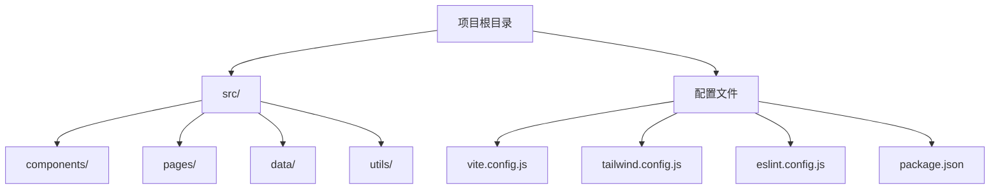
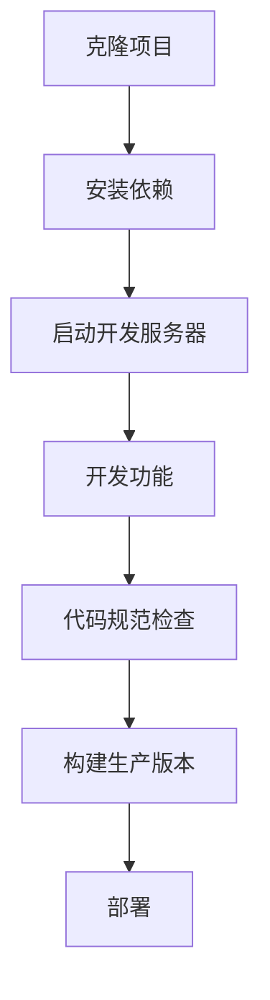
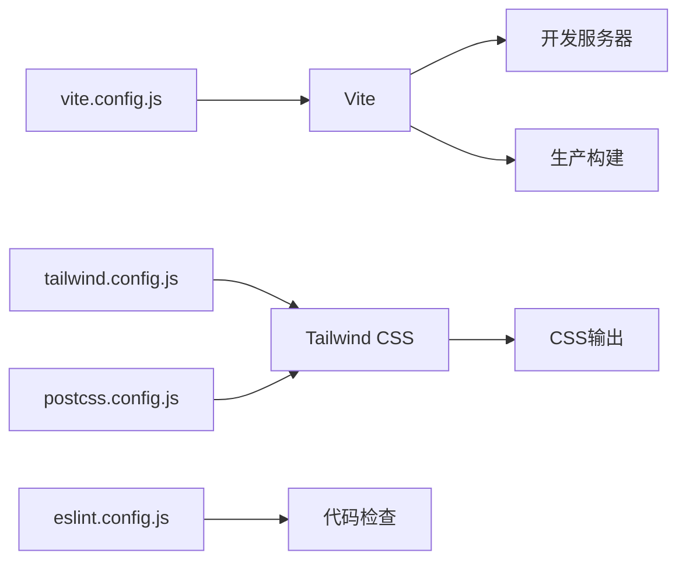

# 开发指南

<cite>
**本文档中引用的文件**  
- [package.json](file://package.json)
- [vite.config.js](file://vite.config.js)
- [tailwind.config.js](file://tailwind.config.js)
- [eslint.config.js](file://eslint.config.js)
- [postcss.config.js](file://postcss.config.js)
- [index.html](file://index.html)
- [src/main.jsx](file://src/main.jsx)
- [src/index.css](file://src/index.css)
- [src/App.jsx](file://src/App.jsx)
- [src/components/Layout.jsx](file://src/components/Layout.jsx)
</cite>

## 目录
1. [简介](#简介)
2. [项目结构](#项目结构)
3. [依赖安装](#依赖安装)
4. [开发服务器启动](#开发服务器启动)
5. [代码规范与ESLint](#代码规范与eslint)
6. [样式配置与Tailwind CSS](#样式配置与tailwind-css)
7. [构建生产版本](#构建生产版本)
8. [常见问题与解决方案](#常见问题与解决方案)
9. [最佳实践建议](#最佳实践建议)
10. [附录](#附录)

## 简介
本开发指南旨在为新加入gemini项目的开发者提供完整的本地开发环境搭建流程。项目基于React + Vite技术栈，采用Tailwind CSS进行样式设计，ESLint进行代码规范检查。通过本指南，开发者将能够快速配置开发环境、理解核心配置文件、启动开发服务器并构建生产版本。

## 项目结构
gemini项目采用模块化结构，主要分为以下几个部分：
- `src/components/`：存放可复用的UI组件，包括聊天组件和uiverse设计系统
- `src/pages/`：存放页面级组件，每个文件对应一个路由页面
- `src/data/`：存放静态数据和配置，如学习对话数据、评估数据等
- `src/utils/`：存放工具函数
- 根目录下的配置文件：`vite.config.js`、`tailwind.config.js`、`eslint.config.js`等



**Diagram sources**
- [vite.config.js](file://vite.config.js)
- [tailwind.config.js](file://tailwind.config.js)
- [eslint.config.js](file://eslint.config.js)
- [package.json](file://package.json)

**Section sources**
- [package.json](file://package.json)
- [src/App.jsx](file://src/App.jsx)

## 依赖安装
项目使用npm作为包管理器，所有依赖已在`package.json`中定义。

### 安装步骤
1. 确保已安装Node.js（建议v16以上版本）
2. 在项目根目录执行安装命令：
```bash
npm install
```

### 核心依赖说明
- **React 19**：前端框架，使用最新版本的React特性
- **Vite**：构建工具，提供快速的开发服务器和高效的生产构建
- **Tailwind CSS**：实用优先的CSS框架，配合PostCSS使用
- **Ant Design Icons & Lucide React**：图标库
- **Framer Motion**：动画库
- **React Router DOM**：路由管理
- **Recharts**：图表组件
- **Three.js & @react-three/fiber**：3D图形渲染

**Section sources**
- [package.json](file://package.json)

## 开发服务器启动
项目使用Vite作为开发服务器，提供热模块替换（HMR）和快速启动体验。

### 启动命令
```bash
npm run dev
```

### vite.config.js关键配置解析
`vite.config.js`文件定义了Vite的核心配置：

- **base: './'**：设置基础公共路径为相对路径，适用于本地文件系统部署
- **plugins: [react()]**：使用Vite的React插件，支持JSX语法和Fast Refresh
- 配置简洁，仅包含必要选项，保持开发服务器的高性能

开发服务器启动后，默认在`http://localhost:5173`提供服务，支持自动打开浏览器和热重载。

**Section sources**
- [vite.config.js](file://vite.config.js)
- [package.json](file://package.json)

## 代码规范与ESLint
项目使用ESLint确保代码质量和一致性。

### eslint.config.js规则集解析
`eslint.config.js`文件定义了ESLint的配置规则：

- **extends配置**：
  - `js.configs.recommended`：使用ESLint推荐的基础规则
  - `reactHooks.configs.flat.recommended`：React Hooks最佳实践规则
  - `reactRefresh.configs.vite`：Vite环境下的React Refresh规则

- **语言选项**：
  - `ecmaVersion: 2020`：支持ES2020语法
  - `sourceType: 'module'`：使用ES模块
  - 启用JSX支持

- **自定义规则**：
  - `'no-unused-vars': ['error', { varsIgnorePattern: '^[A-Z_]' }]`：允许大写字母开头的变量不被使用（如组件、类型等）

### 代码规范执行
```bash
npm run lint
```
该命令会检查整个项目中的JavaScript/JSX文件，报告不符合规范的代码。

**Section sources**
- [eslint.config.js](file://eslint.config.js)
- [package.json](file://package.json)

## 样式配置与Tailwind CSS
项目采用Tailwind CSS作为样式解决方案，结合PostCSS进行处理。

### tailwind.config.js定制化选项
`tailwind.config.js`文件包含Tailwind的定制化配置：

- **content配置**：指定需要扫描的文件路径，确保生成正确的CSS类
  - `./index.html`
  - `./src/**/*.{js,ts,jsx,tsx}`

- **theme扩展**：
  - 自定义`primary`颜色为`#2563EB`（蓝色调），作为项目主色调
  - 使用`extend`而非完全覆盖，保留Tailwind默认主题

- **插件**：当前未启用额外插件，保持配置简洁

### postcss.config.js配置
PostCSS配置文件定义了处理CSS的插件：
- `tailwindcss`：Tailwind CSS核心插件
- `autoprefixer`：自动添加浏览器前缀

### 样式应用示例
在`src/index.css`中通过`@tailwind`指令引入Tailwind的三层架构：
- `@tailwind base`：基础样式重置
- `@tailwind components`：组件样式
- `@tailwind utilities`：工具类

同时可以添加自定义样式，如设置背景色和字体。

**Section sources**
- [tailwind.config.js](file://tailwind.config.js)
- [postcss.config.js](file://postcss.config.js)
- [src/index.css](file://src/index.css)

## 构建生产版本
使用Vite构建生产优化的静态文件。

### 构建命令
```bash
npm run build
```

### 构建流程
1. Vite分析整个应用的依赖图
2. 对JavaScript进行Tree Shaking，移除未使用代码
3. 对CSS进行压缩和优化
4. 生成静态资源文件（HTML、CSS、JavaScript）
5. 输出到`dist`目录

### 预览生产版本
```bash
npm run preview
```
该命令会在本地启动一个静态服务器，预览`dist`目录中的生产构建结果。

**Section sources**
- [vite.config.js](file://vite.config.js)
- [package.json](file://package.json)

## 常见问题与解决方案
### 依赖冲突问题
**现象**：安装依赖时出现版本冲突或peer dependency警告
**解决方案**：
1. 清理npm缓存：`npm cache clean --force`
2. 删除`node_modules`和`package-lock.json`
3. 重新运行`npm install`
4. 如果问题持续，检查`package.json`中的依赖版本是否兼容

### 构建失败问题
**现象**：`npm run build`命令失败
**解决方案**：
1. 首先运行`npm run lint`检查代码规范问题
2. 检查是否有语法错误或未定义的变量
3. 确认所有导入路径正确
4. 查看具体错误信息，通常Vite会提供详细的错误位置

### 样式不生效问题
**现象**：Tailwind CSS类在浏览器中不生效
**解决方案**：
1. 确认`tailwind.config.js`中的`content`配置是否包含当前文件路径
2. 检查是否有拼写错误的Tailwind类名
3. 确认`src/index.css`中正确引入了`@tailwind`指令
4. 重启开发服务器

### 开发服务器启动慢
**现象**：`npm run dev`启动时间过长
**解决方案**：
1. 确保Node.js版本为v16或更高
2. 清理Vite缓存（位于`node_modules/.vite`）
3. 检查是否有大量未使用的依赖，考虑优化`package.json`

**Section sources**
- [tailwind.config.js](file://tailwind.config.js)
- [vite.config.js](file://vite.config.js)
- [eslint.config.js](file://eslint.config.js)

## 最佳实践建议
### 组件开发规范
- 遵循React函数组件和Hooks模式
- 使用JSX语法，保持代码可读性
- 组件命名采用PascalCase（如`LearningCard.jsx`）
- 组件文件放在`src/components/`目录下，按功能分组

### 样式使用原则
- 优先使用Tailwind CSS工具类，避免编写自定义CSS
- 对于重复使用的样式组合，考虑创建组件或使用`@apply`
- 保持`tailwind.config.js`的简洁性，仅扩展必要的主题

### 代码质量保证
- 提交代码前运行`npm run lint`检查
- 使用有意义的变量和函数命名
- 为复杂逻辑添加注释
- 遵循React最佳实践，如正确使用Hooks规则

### 路由管理
- 页面级组件放在`src/pages/`目录
- 路由配置集中在`src/App.jsx`中
- 使用React Router的嵌套路由功能组织相关页面

### 数据管理
- 静态数据放在`src/data/`目录
- 使用模块化的数据文件，按功能划分
- 提供清晰的数据访问接口

**Section sources**
- [src/App.jsx](file://src/App.jsx)
- [src/components/Layout.jsx](file://src/components/Layout.jsx)
- [src/data/learning_dialogue_assessment_data.js](file://src/data/learning_dialogue_assessment_data.js)

## 附录
### 项目启动流程图


### 核心配置文件关系图


**Diagram sources**
- [vite.config.js](file://vite.config.js)
- [tailwind.config.js](file://tailwind.config.js)
- [postcss.config.js](file://postcss.config.js)
- [eslint.config.js](file://eslint.config.js)