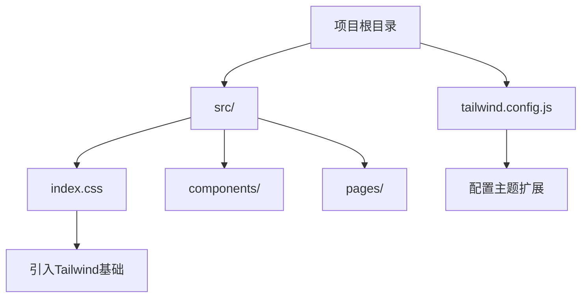

# Tailwind CSS实践

<cite>
**本文档引用的文件**
- [tailwind.config.js](file://tailwind.config.js)
- [src/index.css](file://src/index.css)
- [src/App.css](file://src/App.css)
- [src/pages/Dashboard.jsx](file://src/pages/Dashboard.jsx)
- [src/components/uiverse/UiverseCard.jsx](file://src/components/uiverse/UiverseCard.jsx)
- [src/components/uiverse/uiverse-card.css](file://src/components/uiverse/uiverse-card.css)
- [src/components/uiverse/GlassCard.jsx](file://src/components/uiverse/GlassCard.jsx)
</cite>

## 目录
1. [项目结构](#项目结构)
2. [Tailwind配置扩展](#tailwind配置扩展)
3. [全局CSS重置策略](#全局css重置策略)
4. [原子化CSS优势](#原子化css优势)
5. [响应式断点实现](#响应式断点实现)
6. [暗色模式支持](#暗色模式支持)
7. [可访问性支持](#可访问性支持)
8. [组件样式应用](#组件样式应用)

## 项目结构

项目采用标准的Vite+React架构，Tailwind CSS作为核心样式解决方案。项目结构清晰，`src`目录下包含组件、页面、工具等模块，`tailwind.config.js`位于根目录，`src/index.css`引入Tailwind的三层次指令。



**文档来源**
- [tailwind.config.js](file://tailwind.config.js)
- [src/index.css](file://src/index.css)

## Tailwind配置扩展

### 设计令牌自定义

项目在`tailwind.config.js`中通过`theme.extend`对设计令牌进行了深度扩展，构建了一套完整的苹果液态玻璃风格设计系统。

#### 颜色系统扩展
```javascript
colors: {
  primary: '#2563EB',
  glass: {
    white: 'rgba(255, 255, 255, 0.7)',
    'white-light': 'rgba(255, 255, 255, 0.5)',
    'white-heavy': 'rgba(255, 255, 255, 0.9)',
    dark: 'rgba(26, 26, 26, 0.7)',
    'dark-light': 'rgba(26, 26, 26, 0.5)',
    'dark-heavy': 'rgba(10, 10, 10, 0.9)',
  },
  border: {
    light: 'rgba(229, 231, 235, 0.2)',
    DEFAULT: 'rgba(229, 231, 235, 0.3)',
    dark: 'rgba(58, 58, 58, 0.3)',
  },
}
```

#### 阴影与模糊效果
```javascript
backdropBlur: {
  xs: '4px',
  '2xl': '40px',
  '3xl': '60px',
},
boxShadow: {
  'glass': '0 4px 12px rgba(0, 0, 0, 0.08), 0 2px 6px rgba(0, 0, 0, 0.06)',
  'glass-hover': '0 12px 28px rgba(0, 0, 0, 0.12), 0 4px 12px rgba(0, 0, 0, 0.08)',
  'glass-deep': '0 20px 48px rgba(0, 0, 0, 0.16), 0 8px 20px rgba(0, 0, 0, 0.12)',
  'glow-blue': '0 8px 32px rgba(59, 130, 246, 0.25)',
  'glow-purple': '0 8px 32px rgba(139, 92, 246, 0.25)',
  'glow-orange': '0 8px 32px rgba(249, 115, 22, 0.25)',
  'glow-green': '0 8px 32px rgba(16, 185, 129, 0.25)',
}
```

#### 动画系统
```javascript
keyframes: {
  'shimmer': {
    '0%': { transform: 'translateX(-100%)' },
    '100%': { transform: 'translateX(100%)' },
  },
  'pulse-glow': {
    '0%, 100%': { 
      boxShadow: '0 0 8px rgba(59, 130, 246, 0.2)',
      transform: 'scale(1)',
    },
    '50%': { 
      boxShadow: '0 0 16px rgba(59, 130, 246, 0.4)',
      transform: 'scale(1.05)',
    },
  },
  'ripple': {
    '0%': { 
      transform: 'scale(0)',
      opacity: '0.6',
    },
    '100%': { 
      transform: 'scale(2)',
      opacity: '0',
    },
  },
  'float': {
    '0%, 100%': { transform: 'translateY(0px)' },
    '50%': { transform: 'translateY(-10px)' },
  },
},
animation: {
  'shimmer': 'shimmer 3s linear infinite',
  'pulse-glow': 'pulse-glow 2s ease-in-out infinite',
  'ripple': 'ripple 0.6s ease-out',
  'float': 'float 3s ease-in-out infinite',
}
```

#### 过渡效果
```javascript
transitionDuration: {
  '400': '400ms',
  '600': '600ms',
},
transitionTimingFunction: {
  'apple': 'cubic-bezier(0.4, 0.0, 0.2, 1)',
  'apple-in': 'cubic-bezier(0.0, 0.0, 0.2, 1)',
  'apple-out': 'cubic-bezier(0.4, 0.0, 1, 1)',
  'bounce-in': 'cubic-bezier(0.34, 1.56, 0.64, 1)',
}
```

**文档来源**
- [tailwind.config.js](file://tailwind.config.js)

## 全局CSS重置策略

项目在`src/index.css`中采用了Tailwind的三层次架构，并结合自定义CSS变量实现了苹果液态玻璃风格设计系统。

### Tailwind基础层
```css
@tailwind base;
@tailwind components;
@tailwind utilities;
```

### CSS变量系统
```css
@layer base {
  :root {
    /* 基础色彩系统 */
    --color-white-pure: #FFFFFF;
    --color-white-snow: #F9FAFB;
    --color-gray-cloud: #F3F4F6;
    --color-gray-mist: #E5E7EB;
    --color-gray-neutral: #6B7280;
    --color-gray-deep: #111827;
    
    /* 品牌强调色 */
    --gradient-blue: linear-gradient(135deg, #3B82F6 0%, #2563EB 100%);
    --gradient-purple: linear-gradient(135deg, #8B5CF6 0%, #6366F1 100%);
    --gradient-orange: linear-gradient(135deg, #F97316 0%, #EA580C 100%);
    --gradient-green: linear-gradient(135deg, #10B981 0%, #059669 100%);
    
    /* 玻璃材质透明度 */
    --glass-light: rgba(255, 255, 255, 0.5);
    --glass-standard: rgba(255, 255, 255, 0.7);
    --glass-heavy: rgba(255, 255, 255, 0.85);
    --glass-frosted: rgba(255, 255, 255, 0.95);
    
    /* 模糊半径 */
    --blur-light: 8px;
    --blur-standard: 20px;
    --blur-heavy: 40px;
    --blur-frosted: 60px;
    
    /* 动画时长 */
    --duration-instant: 100ms;
    --duration-fast: 150ms;
    --duration-normal: 200ms;
    --duration-smooth: 300ms;
    --duration-slow: 400ms;
    --duration-slower: 600ms;
    
    /* 缓动曲线 */
    --ease-apple: cubic-bezier(0.4, 0.0, 0.2, 1);
    --ease-apple-in: cubic-bezier(0.0, 0.0, 0.2, 1);
    --ease-apple-out: cubic-bezier(0.4, 0.0, 1, 1);
    --ease-bounce: cubic-bezier(0.34, 1.56, 0.64, 1);
    --ease-magnetic: cubic-bezier(0.25, 0.46, 0.45, 0.94);
  }
  
  /* 深色模式 */
  .dark {
    --color-white-pure: #0A0A0A;
    --color-white-snow: #1A1A1A;
    --color-gray-cloud: #2A2A2A;
    --color-gray-mist: #3A3A3A;
    --color-gray-neutral: #A0A0A0;
    --color-gray-deep: #FFFFFF;
    
    --glass-light: rgba(26, 26, 26, 0.5);
    --glass-standard: rgba(26, 26, 26, 0.7);
    --glass-heavy: rgba(10, 10, 10, 0.85);
    --glass-frosted: rgba(10, 10, 10, 0.95);
  }
}
```

### 全局样式优化
```css
body {
  font-family: -apple-system, BlinkMacSystemFont, 'SF Pro Display', 'PingFang SC', 'Noto Sans SC', sans-serif;
  background: linear-gradient(180deg, #FAFBFC 0%, #F3F4F6 100%);
  background-attachment: fixed;
  min-height: 100vh;
  -webkit-font-smoothing: antialiased;
  -moz-osx-font-smoothing: grayscale;
}

/* 滚动条样式优化 */
::-webkit-scrollbar {
  width: 8px;
  height: 8px;
}

::-webkit-scrollbar-track {
  background: transparent;
}

::-webkit-scrollbar-thumb {
  background: rgba(0, 0, 0, 0.15);
  border-radius: 999px;
  transition: background var(--duration-normal) var(--ease-apple);
}

::-webkit-scrollbar-thumb:hover {
  background: rgba(0, 0, 0, 0.25);
}

/* 选中文本样式 */
::selection {
  background: rgba(59, 130, 246, 0.2);
  color: inherit;
}
```

### 玻璃材质工具类
```css
@layer utilities {
  .glass-effect {
    background: var(--glass-standard);
    backdrop-filter: blur(var(--blur-standard));
    -webkit-backdrop-filter: blur(var(--blur-standard));
  }
  
  .glass-border {
    border: 1px solid rgba(229, 231, 235, 0.2);
  }
  
  /* 光泽效果 */
  .shimmer-effect {
    position: relative;
    overflow: hidden;
  }

  .shimmer-effect::before {
    content: '';
    position: absolute;
    top: 0;
    left: -150%;
    width: 150%;
    height: 100%;
    background: linear-gradient(
      115deg,
      transparent 0%,
      rgba(255, 255, 255, 0.3) 50%,
      transparent 100%
    );
    animation: shimmer 3s linear infinite;
  }
  
  /* 玻璃边缘高光 */
  .glass-highlight {
    box-shadow: 
      inset 0 1px 0 rgba(255, 255, 255, 0.2),
      inset 1px 0 0 rgba(255, 255, 255, 0.1);
  }
}
```

**文档来源**
- [src/index.css](file://src/index.css)

## 原子化CSS优势

### 组件化开发优势
原子化CSS在组件化开发中展现出显著优势：

1. **样式复用性**：通过组合原子类实现样式复用，避免重复定义
2. **开发效率**：直接在JSX中编写样式，无需切换文件
3. **维护性**：样式与组件紧密耦合，便于维护和重构
4. **性能优化**：Tailwind的JIT模式只生成实际使用的样式

### 实际应用示例
```jsx
<header className="bg-white/80 backdrop-blur-md border-b border-slate-200 py-4 px-6 flex justify-between items-center sticky top-0 z-50 shadow-sm">
  <div className="flex items-center gap-3">
    <div className="w-8 h-8 bg-gradient-to-br from-blue-500 to-indigo-600 rounded-lg flex items-center justify-center shadow-lg shadow-blue-500/30">
      {/* logo svg */}
    </div>
    <span className="font-bold text-xl text-slate-800">炎枢平台</span>
  </div>
  <div className="flex items-center gap-6">
    <button className="text-slate-600 hover:text-slate-900 transition-colors"><BellOutlined style={{ fontSize: '20px' }} /></button>
    <button className="text-slate-600 hover:text-slate-900 transition-colors"><SettingOutlined style={{ fontSize: '20px' }} /></button>
    <Avatar size={40} icon={<UserOutlined />} className="bg-gradient-to-br from-blue-500 to-indigo-600 cursor-pointer" />
  </div>
</header>
```

**文档来源**
- [src/pages/Dashboard.jsx](file://src/pages/Dashboard.jsx)

## 响应式断点实现

### 断点配置
Tailwind默认提供以下断点：
- `sm`: 640px
- `md`: 768px
- `lg`: 1024px
- `xl`: 1280px
- `2xl`: 1536px

### 实际应用
```jsx
<main className="max-w-7xl mx-auto px-4 py-16 relative z-10">
  <div className="text-center mb-16">
    <h1 className="text-5xl md:text-6xl font-bold text-slate-800 mb-4 tracking-tight">
      欢迎回来,同学!
    </h1>
    <p className="text-slate-600 text-lg">
      当前模式:{difficulty === 'hard' ? '困难' : difficulty === 'simple' ? '简单' : '中等'} |
      学习风格:{userType === 'visual' ? '视觉型' : userType === 'academic' ? '实战型' : '逻辑型'}
    </p>
  </div>

  <div className="grid grid-cols-1 md:grid-cols-2 lg:grid-cols-4 gap-6">
    {/* 卡片组件 */}
  </div>
</main>
```

### 响应式网格系统
- 移动端：单列布局
- 平板端：双列布局
- 桌面端：四列布局

**文档来源**
- [src/pages/Dashboard.jsx](file://src/pages/Dashboard.jsx)

## 暗色模式支持

### CSS变量实现
项目通过CSS变量在`:root`和`.dark`选择器中定义了两套色彩系统：

```css
@layer base {
  :root {
    --color-white-pure: #FFFFFF;
    --color-white-snow: #F9FAFB;
    --color-gray-cloud: #F3F4F6;
    --color-gray-mist: #E5E7EB;
    --color-gray-neutral: #6B7280;
    --color-gray-deep: #111827;
    
    --glass-light: rgba(255, 255, 255, 0.5);
    --glass-standard: rgba(255, 255, 255, 0.7);
    --glass-heavy: rgba(255, 255, 255, 0.85);
    --glass-frosted: rgba(255, 255, 255, 0.95);
  }
  
  .dark {
    --color-white-pure: #0A0A0A;
    --color-white-snow: #1A1A1A;
    --color-gray-cloud: #2A2A2A;
    --color-gray-mist: #3A3A3A;
    --color-gray-neutral: #A0A0A0;
    --color-gray-deep: #FFFFFF;
    
    --glass-light: rgba(26, 26, 26, 0.5);
    --glass-standard: rgba(26, 26, 26, 0.7);
    --glass-heavy: rgba(10, 10, 10, 0.85);
    --glass-frosted: rgba(10, 10, 10, 0.95);
  }
}
```

### 玻璃材质适配
```jsx
const GlassCard = ({
    children,
    className = '',
    hover = true,
    variant = 'standard',
    gradient = false,
    shimmer = false,
    onClick,
    ...props
}) => {
    const variantClasses = {
        light: 'bg-white/50 backdrop-blur-sm',
        standard: 'bg-white/70 backdrop-blur-xl',
        heavy: 'bg-white/85 backdrop-blur-2xl',
        frosted: 'bg-white/95 backdrop-blur-3xl',
    };

    return (
        <div className={`${baseClasses} ${hoverClasses} ${gradientClasses} ${className}`} onClick={onClick} {...props}>
            {children}
        </div>
    );
};
```

**文档来源**
- [src/index.css](file://src/index.css)
- [src/components/uiverse/GlassCard.jsx](file://src/components/uiverse/GlassCard.jsx)

## 可访问性支持

### 语义化HTML
项目采用语义化HTML结构，确保屏幕阅读器能够正确解析内容。

### 键盘导航
所有交互元素都支持键盘导航，确保无障碍访问。

### 对比度
通过Tailwind的颜色系统确保文本与背景有足够的对比度。

### 焦点状态
```css
::-webkit-scrollbar-thumb {
  transition: background var(--duration-normal) var(--ease-apple);
}

::-webkit-scrollbar-thumb:hover {
  background: rgba(0, 0, 0, 0.25);
}
```

**文档来源**
- [src/index.css](file://src/index.css)

## 组件样式应用

### UiverseCard组件
```jsx
const UiverseCard = ({
    children,
    variant = 'basic',
    hoverable = true,
    onClick,
    className = '',
    ...props
}) => {
    const baseClass = 'uiverse-card';
    const variantClass = `uiverse-card-${variant}`;
    const hoverClass = hoverable ? 'uiverse-card-hoverable' : '';

    return (
        <div
            className={`${baseClass} ${variantClass} ${hoverClass} ${className}`}
            onClick={onClick}
            {...props}
        >
            {variant === 'glass' && <div className="card-glass-overlay"></div>}
            {variant === 'gradient' && <div className="card-gradient-bg"></div>}
            {variant === 'neon' && <div className="card-neon-border"></div>}
            <div className="card-content">
                {children}
            </div>
        </div>
    );
};
```

### Dashboard页面样式应用
```jsx
<div className="min-h-screen bg-gradient-to-br from-blue-50 via-indigo-50 to-purple-50 font-sans relative overflow-hidden">
  {/* Animated Background Pattern */}
  <div className="absolute inset-0 opacity-30">
    <div className="absolute top-0 left-0 w-96 h-96 bg-blue-300 rounded-full mix-blend-multiply filter blur-3xl animate-blob"></div>
    <div className="absolute top-0 right-0 w-96 h-96 bg-indigo-300 rounded-full mix-blend-multiply filter blur-3xl animate-blob animation-delay-2000"></div>
    <div className="absolute bottom-0 left-1/2 w-96 h-96 bg-purple-300 rounded-full mix-blend-multiply filter blur-3xl animate-blob animation-delay-4000"></div>
  </div>

  {/* Header */}
  <header className="bg-white/80 backdrop-blur-md border-b border-slate-200 py-4 px-6 flex justify-between items-center sticky top-0 z-50 shadow-sm">
    {/* header content */}
  </header>

  <main className="max-w-7xl mx-auto px-4 py-16 relative z-10">
    {/* main content */}
  </main>
</div>
```

**文档来源**
- [src/pages/Dashboard.jsx](file://src/pages/Dashboard.jsx)
- [src/components/uiverse/UiverseCard.jsx](file://src/components/uiverse/UiverseCard.jsx)