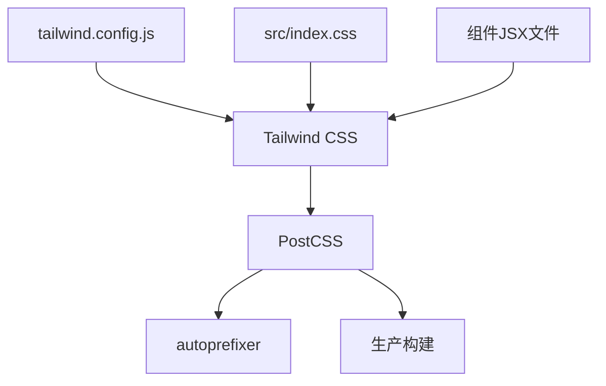
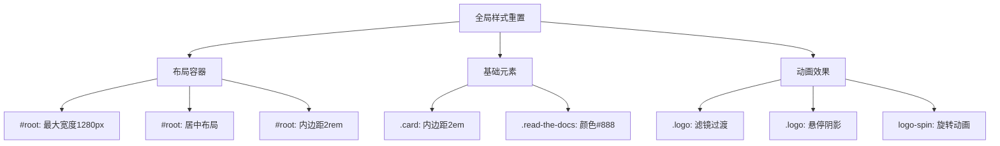
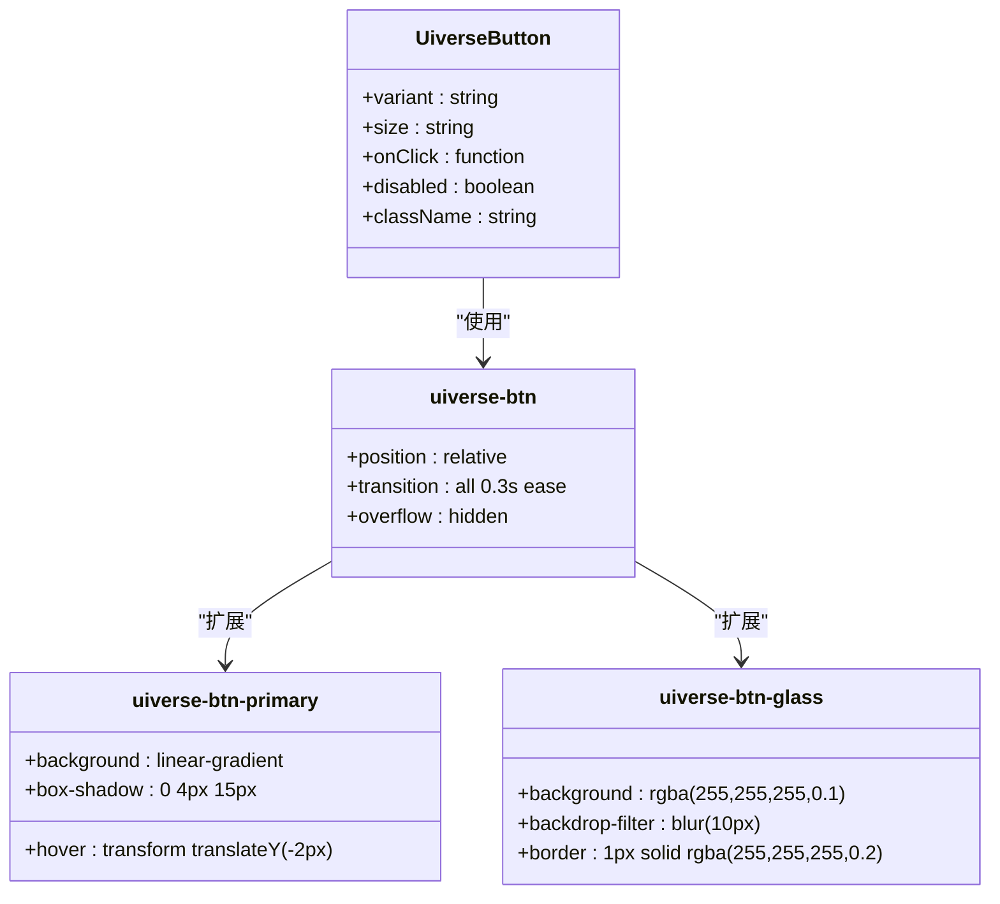
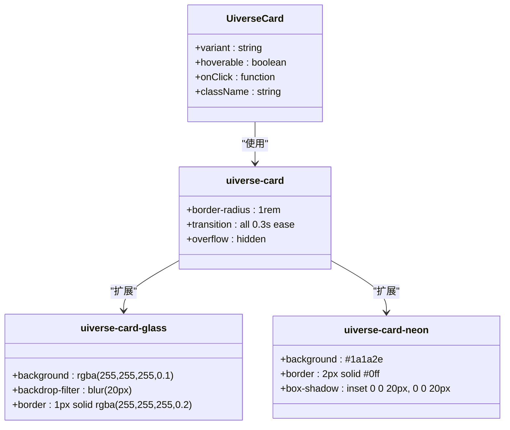
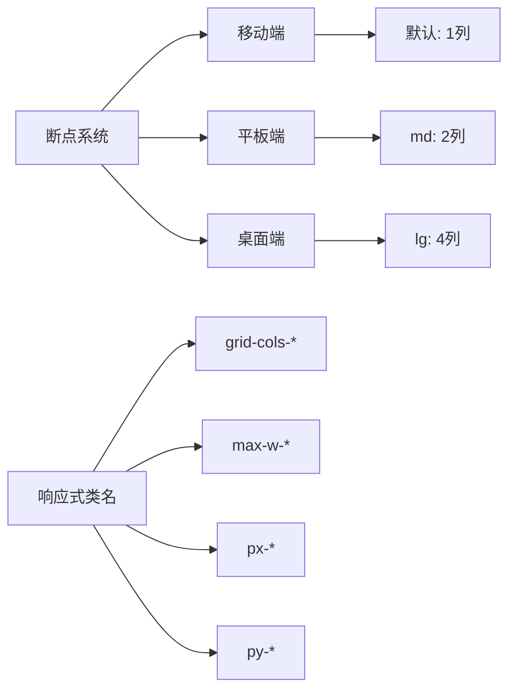
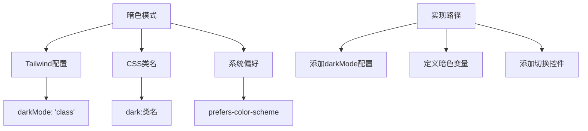
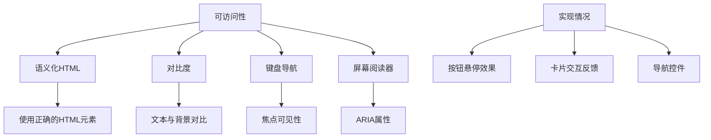
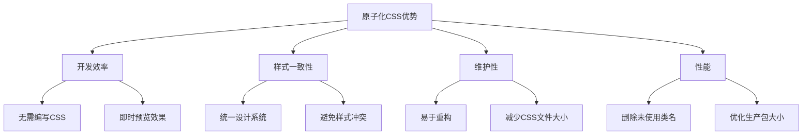
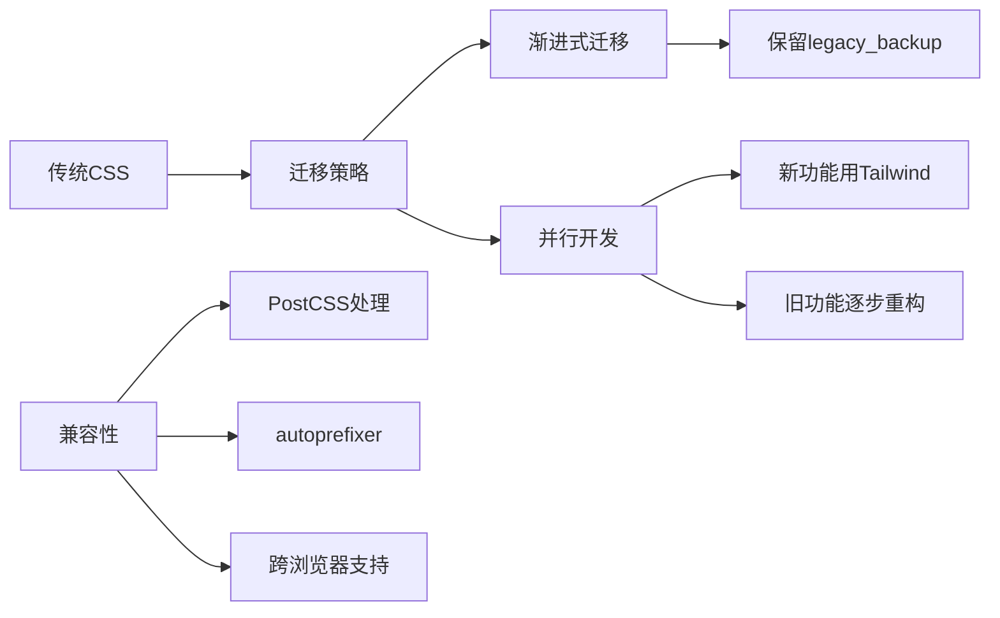

# UI样式系统

<cite>
**本文档引用文件**   
- [tailwind.config.js](file://tailwind.config.js)
- [src/App.css](file://src/App.css)
- [src/index.css](file://src/index.css)
- [src/components/uiverse/uiverse-button.css](file://src/components/uiverse/uiverse-button.css)
- [src/components/uiverse/uiverse-card.css](file://src/components/uiverse/uiverse-card.css)
- [src/components/uiverse/UiverseButton.jsx](file://src/components/uiverse/UiverseButton.jsx)
- [src/components/uiverse/UiverseCard.jsx](file://src/components/uiverse/UiverseCard.jsx)
- [src/main.jsx](file://src/main.jsx)
- [postcss.config.js](file://postcss.config.js)
- [package.json](file://package.json)
- [legacy_backup/styles.css](file://legacy_backup/styles.css)
</cite>

## 目录
1. [项目概述](#项目概述)
2. [Tailwind CSS架构](#tailwind-css架构)
3. [全局样式重置策略](#全局样式重置策略)
4. [uiverse按钮组件分析](#uiverse按钮组件分析)
5. [uiverse卡片组件分析](#uiverse卡片组件分析)
6. [响应式设计实现](#响应式设计实现)
7. [暗色模式支持](#暗色模式支持)
8. [可访问性优化](#可访问性优化)
9. [原子化CSS优势](#原子化css优势)
10. [迁移与兼容性](#迁移与兼容性)

## 项目概述
gemini项目采用Tailwind CSS原子化CSS框架构建现代化UI样式系统，通过组合式类名实现高效、一致的界面开发。项目结合自定义的uiverse组件库，实现了丰富的视觉效果，包括玻璃态、渐变、阴影和过渡动画等现代UI特性。系统通过tailwind.config.js配置文件扩展主题，确保品牌色统一，并在src/App.css中定义全局样式重置。

**Section sources**
- [tailwind.config.js](file://tailwind.config.js#L1-L15)
- [src/index.css](file://src/index.css#L1-L8)
- [src/main.jsx](file://src/main.jsx#L1-L14)

## Tailwind CSS架构
项目通过标准的Tailwind CSS集成方式构建样式系统，采用PostCSS作为构建工具链的核心。在postcss.config.js中配置了tailwindcss和autoprefixer插件，确保样式在不同浏览器中的兼容性。

**Diagram sources**
- [postcss.config.js](file://postcss.config.js#L1-L6)
- [tailwind.config.js](file://tailwind.config.js#L1-L15)
- [src/index.css](file://src/index.css#L1-L3)

**Section sources**
- [postcss.config.js](file://postcss.config.js#L1-L6)
- [package.json](file://package.json#L17-L27)

## 全局样式重置策略
项目在src/App.css中实现了轻量级的全局样式重置，重点关注布局容器和基础元素的样式定义。通过#root选择器设置最大宽度、居中布局和内边距，为应用创建一致的布局基线。同时定义了logo类的悬停效果和动画，以及card类的基础内边距。

**Diagram sources**
- [src/App.css](file://src/App.css#L1-L43)

**Section sources**
- [src/App.css](file://src/App.css#L1-L43)
- [src/index.css](file://src/index.css#L5-L8)

## uiverse按钮组件分析
uiverse按钮组件库提供了多种视觉风格的按钮实现，包括基础按钮、渐变按钮、霓虹按钮和玻璃态按钮。组件通过CSS变量和现代CSS特性实现丰富的交互效果，如悬停渐变、光晕效果和3D深度。

**Diagram sources**
- [src/components/uiverse/uiverse-button.css](file://src/components/uiverse/uiverse-button.css#L1-L249)
- [src/components/uiverse/UiverseButton.jsx](file://src/components/uiverse/UiverseButton.jsx#L1-L48)

**Section sources**
- [src/components/uiverse/uiverse-button.css](file://src/components/uiverse/uiverse-button.css#L1-L249)
- [src/components/uiverse/UiverseButton.jsx](file://src/components/uiverse/UiverseButton.jsx#L1-L48)

## uiverse卡片组件分析
uiverse卡片组件库实现了多种现代UI效果，包括玻璃态、渐变背景、霓虹发光和3D透视。卡片通过CSS伪元素和绝对定位实现复杂的视觉层次，同时保持良好的性能表现。

**Diagram sources**
- [src/components/uiverse/uiverse-card.css](file://src/components/uiverse/uiverse-card.css#L1-L246)
- [src/components/uiverse/UiverseCard.jsx](file://src/components/uiverse/UiverseCard.jsx#L1-L33)

**Section sources**
- [src/components/uiverse/uiverse-card.css](file://src/components/uiverse/uiverse-card.css#L1-L246)
- [src/components/uiverse/UiverseCard.jsx](file://src/components/uiverse/UiverseCard.jsx#L1-L33)

## 响应式设计实现
项目通过Tailwind CSS的响应式前缀系统实现多设备适配。在Dashboard.jsx等页面组件中，使用grid-cols-1 md:grid-cols-2 lg:grid-cols-4等类名定义不同屏幕尺寸下的网格布局。同时利用max-w-7xl、px-4等类名实现流体布局和响应式间距。

**Section sources**
- [src/pages/Dashboard.jsx](file://src/pages/Dashboard.jsx#L55-L56)
- [src/pages/LearningPathPage.jsx](file://src/pages/LearningPathPage.jsx#L67-L68)

## 暗色模式支持
虽然当前代码库中未显式实现暗色模式，但通过Tailwind CSS的暗色模式变体支持，可以轻松添加暗色主题。项目结构为未来添加暗色模式预留了扩展空间，可以通过配置tailwind.config.js中的darkMode选项来启用。

**Section sources**
- [tailwind.config.js](file://tailwind.config.js#L7-L13)
- [src/index.css](file://src/index.css#L6)

## 可访问性优化
项目在多个层面考虑了可访问性，包括使用语义化的HTML结构、适当的对比度和键盘导航支持。按钮和卡片组件都实现了hover和focus状态的视觉反馈，确保用户能够清晰地识别交互元素。

**Section sources**
- [src/components/uiverse/UiverseButton.jsx](file://src/components/uiverse/UiverseButton.jsx#L18-L23)
- [src/components/uiverse/UiverseCard.jsx](file://src/components/uiverse/UiverseCard.jsx#L17-L20)

## 原子化CSS优势
原子化CSS方法在gemini项目中展现了显著优势。通过将样式分解为最小的可重用单元，实现了高度的样式一致性和开发效率。开发者可以直接在JSX中组合类名，无需切换到CSS文件，大大提高了开发速度。

**Section sources**
- [src/pages/Dashboard.jsx](file://src/pages/Dashboard.jsx#L17-L18)
- [src/pages/LearningPathPage.jsx](file://src/pages/LearningPathPage.jsx#L47-L48)

## 迁移与兼容性
项目从传统的CSS方法迁移到Tailwind CSS原子化框架，保留了legacy_backup目录中的原始样式文件作为参考。这种渐进式迁移策略降低了风险，同时允许团队逐步适应新的开发范式。

**Diagram sources**
- [legacy_backup/styles.css](file://legacy_backup/styles.css#L1-L244)
- [postcss.config.js](file://postcss.config.js#L1-L6)

**Section sources**
- [legacy_backup/styles.css](file://legacy_backup/styles.css#L1-L244)
- [tailwind.config.js](file://tailwind.config.js#L3-L5)