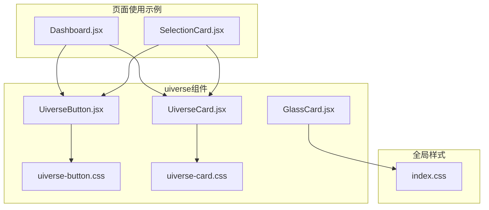
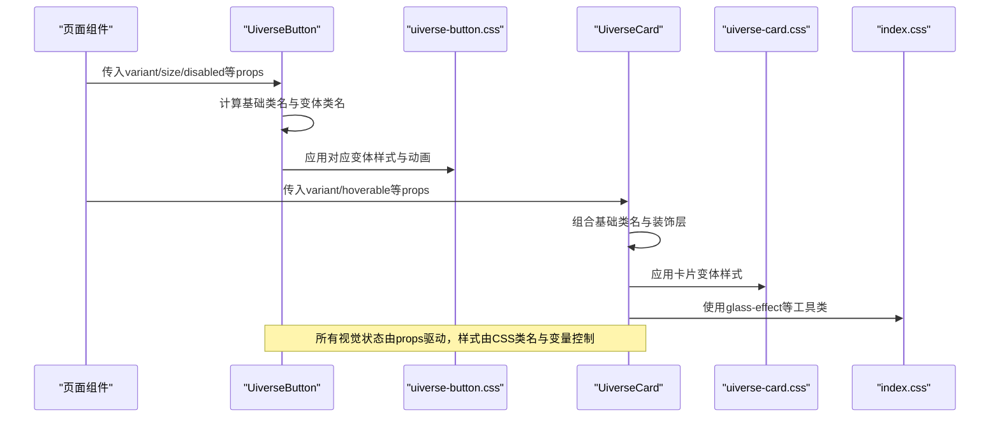
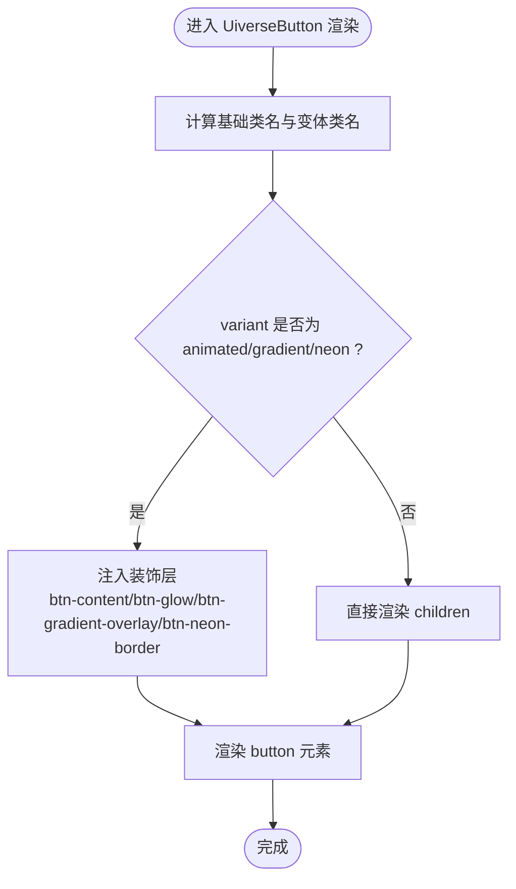
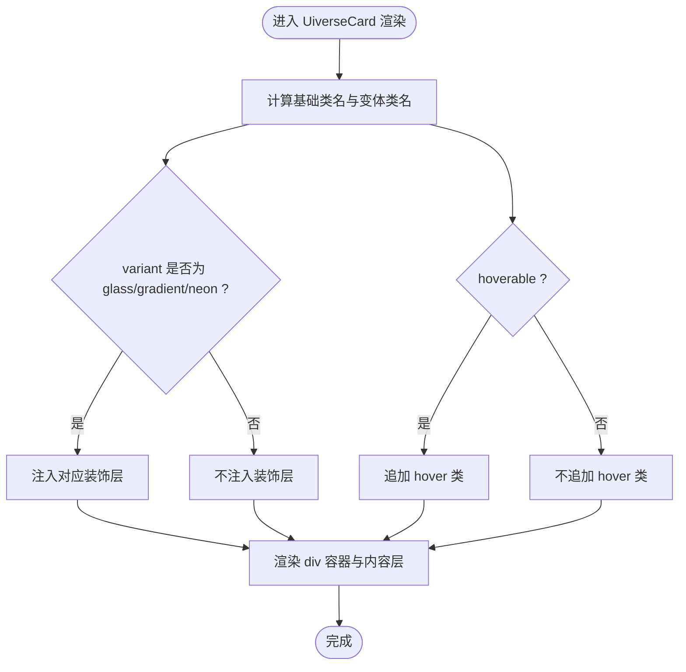
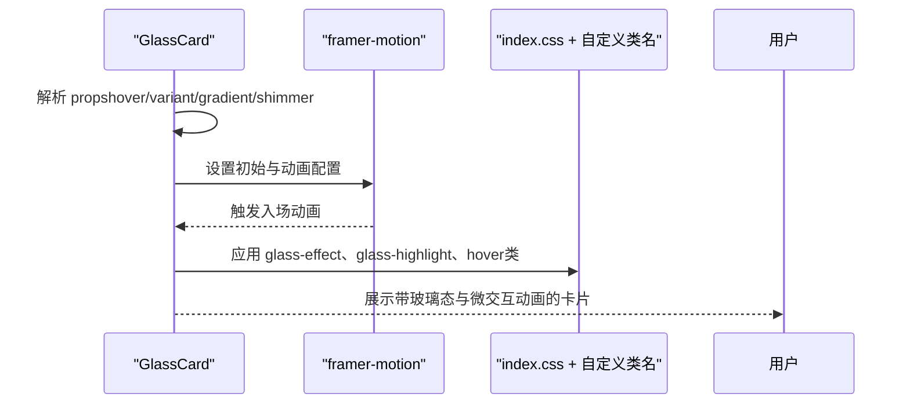
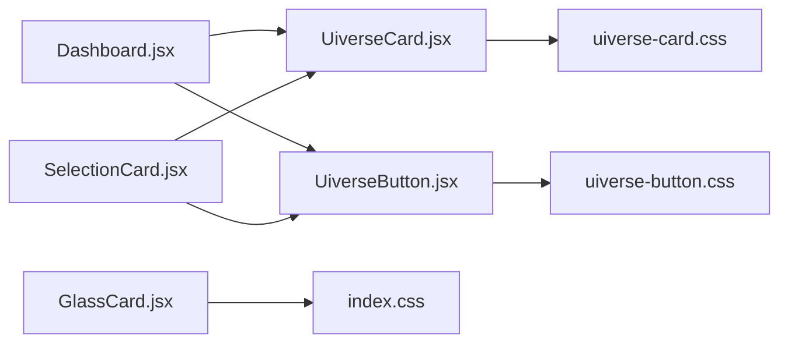

# 组件样式定制

<cite>
**本文引用的文件**
- [UiverseButton.jsx](file://src/components/uiverse/UiverseButton.jsx)
- [uiverse-button.css](file://src/components/uiverse/uiverse-button.css)
- [UiverseCard.jsx](file://src/components/uiverse/UiverseCard.jsx)
- [uiverse-card.css](file://src/components/uiverse/uiverse-card.css)
- [GlassCard.jsx](file://src/components/uiverse/GlassCard.jsx)
- [index.js](file://src/components/uiverse/index.js)
- [index.css](file://src/index.css)
- [Dashboard.jsx](file://src/pages/Dashboard.jsx)
- [SelectionCard.jsx](file://src/components/SelectionCard.jsx)
</cite>

## 目录
1. [简介](#简介)
2. [项目结构](#项目结构)
3. [核心组件](#核心组件)
4. [架构总览](#架构总览)
5. [详细组件分析](#详细组件分析)
6. [依赖关系分析](#依赖关系分析)
7. [性能考量](#性能考量)
8. [故障排查指南](#故障排查指南)
9. [结论](#结论)
10. [附录：样式扩展与主题覆盖最佳实践](#附录样式扩展与主题覆盖最佳实践)

## 简介
本文件聚焦于gemini项目中uiverse组件库的样式定制实现，围绕以下目标展开：
- 解析uiverse-button.css与uiverse-card.css中的CSS变量定义与使用机制
- 阐述玻璃态模糊（glassmorphism）、动态阴影、微交互动画等现代UI效果的技术实现原理
- 结合GlassCard.jsx与UiverseButton.jsx，说明JSX与CSS类名的绑定逻辑及props对视觉状态的控制方式
- 提供样式扩展与主题覆盖的最佳实践，帮助在保持设计一致性的同时进行个性化定制

## 项目结构
uiverse组件位于src/components/uiverse目录下，包含按钮、卡片、输入等组件及其对应的样式文件。全局样式通过src/index.css定义了苹果风格的CSS变量体系，并提供玻璃材质通用类与光泽效果等工具类。

图表来源
- [UiverseButton.jsx](file://src/components/uiverse/UiverseButton.jsx#L1-L47)
- [UiverseCard.jsx](file://src/components/uiverse/UiverseCard.jsx#L1-L32)
- [GlassCard.jsx](file://src/components/uiverse/GlassCard.jsx#L1-L74)
- [uiverse-button.css](file://src/components/uiverse/uiverse-button.css#L1-L249)
- [uiverse-card.css](file://src/components/uiverse/uiverse-card.css#L1-L246)
- [index.css](file://src/index.css#L1-L143)
- [Dashboard.jsx](file://src/pages/Dashboard.jsx#L1-L200)
- [SelectionCard.jsx](file://src/components/SelectionCard.jsx#L1-L28)

章节来源
- [index.js](file://src/components/uiverse/index.js#L1-L13)

## 核心组件
- UiverseButton：基于props的variant/size/disabled控制类名拼接，支持多种视觉变体（如animated、gradient、neon、glass、3d等），并在特定变体下插入额外的装饰层以实现特效。
- UiverseCard：通过variant/hoverable/onClick等props组合基础类名，按需渲染玻璃、渐变、霓虹等装饰层。
- GlassCard：采用framer-motion实现入场动画与悬停交互，结合backdrop-filter与自定义glass-*类名实现苹果风格的液态玻璃效果。

章节来源
- [UiverseButton.jsx](file://src/components/uiverse/UiverseButton.jsx#L1-L47)
- [UiverseCard.jsx](file://src/components/uiverse/UiverseCard.jsx#L1-L32)
- [GlassCard.jsx](file://src/components/uiverse/GlassCard.jsx#L1-L74)

## 架构总览
从“组件JSX + 样式CSS”的角度，uiverse组件遵循“类名驱动样式”的约定式设计：
- 组件通过props决定基础类名（如uiverse-btn-primary、uiverse-card-glass）
- 在特定变体下，组件内部注入额外的装饰元素（如btn-glow、card-glass-overlay、card-neon-border等）
- 样式文件集中定义各类变体的视觉规则与动画关键帧
- 全局index.css提供CSS变量与通用工具类，统一设计语言与性能参数

图表来源
- [UiverseButton.jsx](file://src/components/uiverse/UiverseButton.jsx#L1-L47)
- [uiverse-button.css](file://src/components/uiverse/uiverse-button.css#L1-L249)
- [UiverseCard.jsx](file://src/components/uiverse/UiverseCard.jsx#L1-L32)
- [uiverse-card.css](file://src/components/uiverse/uiverse-card.css#L1-L246)
- [index.css](file://src/index.css#L1-L143)

## 详细组件分析

### UiverseButton：类名绑定与变体控制
- 类名绑定逻辑
  - 基础类名：uiverse-btn
  - 变体类名：根据variant拼接为uiverse-btn-{variant}
  - 尺寸类名：根据size拼接为uiverse-btn-{size}
  - disabled时应用禁用态样式
- 特定变体的装饰层
  - animated：插入btn-content与btn-glow，配合渐变位移与脉冲动画
  - gradient：插入btn-gradient-overlay，悬停时显示渐变遮罩
  - neon：插入btn-neon-border，悬停时显示霓虹边框并旋转
  - glass：直接使用uiverse-btn-glass类（见下节）
- props对视觉状态的控制
  - variant：切换不同视觉风格
  - size：切换尺寸
  - disabled：禁用态
  - onClick/className：透传至原生button

图表来源
- [UiverseButton.jsx](file://src/components/uiverse/UiverseButton.jsx#L1-L47)

章节来源
- [UiverseButton.jsx](file://src/components/uiverse/UiverseButton.jsx#L1-L47)
- [uiverse-button.css](file://src/components/uiverse/uiverse-button.css#L1-L249)

### UiverseCard：卡片变体与装饰层
- 类名绑定逻辑
  - 基础类名：uiverse-card
  - 变体类名：uiverse-card-{variant}
  - hoverable：追加uiverse-card-hoverable
- 装饰层
  - glass：card-glass-overlay
  - gradient：card-gradient-bg
  - neon：card-neon-border
- props对视觉状态的控制
  - variant：basic/glass/gradient/neon/3d/interactive/shine/border-gradient等
  - hoverable：是否启用悬停交互
  - onClick：点击回调
  - className：扩展类名

图表来源
- [UiverseCard.jsx](file://src/components/uiverse/UiverseCard.jsx#L1-L32)

章节来源
- [UiverseCard.jsx](file://src/components/uiverse/UiverseCard.jsx#L1-L32)
- [uiverse-card.css](file://src/components/uiverse/uiverse-card.css#L1-L246)

### GlassCard：苹果风格液态玻璃与微交互动画
- 关键特性
  - 使用framer-motion实现入场动画（opacity/y过渡）
  - 通过props控制hover、variant、gradient、shimmer等视觉状态
  - 基于backdrop-filter与透明度实现玻璃态模糊
  - 使用自定义glass-*类名与index.css中的glass-effect等工具类
- props对视觉状态的控制
  - hover：是否启用悬停交互
  - variant：light/standard/heavy/frosted（影响透明度与模糊半径）
  - gradient：启用渐变边框效果
  - shimmer：启用光泽效果
  - onClick：点击回调
  - className：扩展类名

图表来源
- [GlassCard.jsx](file://src/components/uiverse/GlassCard.jsx#L1-L74)
- [index.css](file://src/index.css#L1-L143)

章节来源
- [GlassCard.jsx](file://src/components/uiverse/GlassCard.jsx#L1-L74)
- [index.css](file://src/index.css#L1-L143)

### CSS变量体系与全局工具类
- 全局CSS变量（苹果风格）
  - 基础色彩系统：白/雪/雾/中性/深灰等
  - 品牌强调色：多组线性渐变
  - 玻璃材质透明度：light/standard/heavy/frosted
  - 模糊半径：light/standard/heavy/frosted
  - 动画时长：instant/fast/normal/smooth/slow/slower
  - 缓动曲线：apple/apple-in/apple-out/bounce/magnetic
  - 深色模式：在.dark下覆盖颜色与玻璃透明度
- 全局工具类
  - glass-effect：统一玻璃材质背景与模糊
  - glass-border：统一玻璃边框
  - shimmer-effect：统一光泽动画
  - glass-highlight：统一玻璃边缘高光

章节来源
- [index.css](file://src/index.css#L1-L143)

## 依赖关系分析
- 组件到样式的依赖
  - UiverseButton.jsx导入uiverse-button.css
  - UiverseCard.jsx导入uiverse-card.css
  - GlassCard.jsx依赖index.css中的glass-effect等工具类
- 页面到组件的依赖
  - Dashboard.jsx使用UiverseCard与UiverseButton
  - SelectionCard.jsx使用UiverseCard与UiverseButton

图表来源
- [Dashboard.jsx](file://src/pages/Dashboard.jsx#L1-L200)
- [SelectionCard.jsx](file://src/components/SelectionCard.jsx#L1-L28)
- [UiverseButton.jsx](file://src/components/uiverse/UiverseButton.jsx#L1-L47)
- [UiverseCard.jsx](file://src/components/uiverse/UiverseCard.jsx#L1-L32)
- [GlassCard.jsx](file://src/components/uiverse/GlassCard.jsx#L1-L74)
- [uiverse-button.css](file://src/components/uiverse/uiverse-button.css#L1-L249)
- [uiverse-card.css](file://src/components/uiverse/uiverse-card.css#L1-L246)
- [index.css](file://src/index.css#L1-L143)

章节来源
- [Dashboard.jsx](file://src/pages/Dashboard.jsx#L1-L200)
- [SelectionCard.jsx](file://src/components/SelectionCard.jsx#L1-L28)
- [index.js](file://src/components/uiverse/index.js#L1-L13)

## 性能考量
- 动画与过渡
  - 使用cubic-bezier缓动曲线与合理的duration，确保流畅体验
  - backdrop-filter在移动端可能带来性能开销，建议在需要时才启用
- 事件与交互
  - hover类仅在交互时生效，避免不必要的重绘
  - framer-motion的入场动画只在首次渲染触发，后续交互通过类名切换
- CSS变量与工具类
  - 通过CSS变量集中管理颜色与模糊参数，减少重复定义，提升维护性

[本节为通用性能讨论，无需列出具体文件来源]

## 故障排查指南
- 按钮无响应或样式异常
  - 检查variant/size/disabled是否正确传递
  - 确认对应变体类名已存在（如uiverse-btn-animated、uiverse-btn-glass）
- 卡片玻璃态不生效
  - 确认index.css中的glass-effect与glass-highlight类可用
  - 检查backdrop-filter与透明度设置是否被浏览器支持
- 动画卡顿
  - 减少同时运行的动画数量
  - 合理设置duration与easing，避免过度复杂的keyframes
- 深色模式颜色不一致
  - 确认根元素或父容器上存在.dark类，以便应用深色模式变量

章节来源
- [uiverse-button.css](file://src/components/uiverse/uiverse-button.css#L1-L249)
- [uiverse-card.css](file://src/components/uiverse/uiverse-card.css#L1-L246)
- [index.css](file://src/index.css#L1-L143)

## 结论
uiverse组件库通过“类名驱动样式”的约定式设计，将视觉变体与交互状态解耦到props与CSS类名中，辅以全局CSS变量与工具类，实现了高度一致且可扩展的现代UI风格。玻璃态模糊、动态阴影与微交互动画均以CSS变量与关键帧为核心实现，既保证了性能，又便于主题化与个性化定制。

[本节为总结性内容，无需列出具体文件来源]

## 附录：样式扩展与主题覆盖最佳实践
- 使用CSS变量统一管理品牌色与玻璃参数
  - 在:root与.dark下分别定义颜色与透明度变量，确保主题一致性
  - 通过var(--glass-standard)、var(--blur-standard)等变量控制玻璃态强度
- 优先复用工具类
  - 使用glass-effect、glass-border、shimmer-effect等工具类，减少重复样式
- 保持类名命名规范
  - 组件基础类名采用语义化前缀（如uiverse-btn、uiverse-card），变体类名以连字符分隔
- 通过props控制视觉状态
  - 将variant、hover、disabled等状态映射为类名，避免在组件内硬编码样式
- 为特殊场景添加装饰层
  - 在需要复杂视觉效果时，通过组件内部注入额外元素（如btn-glow、card-neon-border）实现
- 与全局样式协同
  - 在index.css中集中定义全局变量与工具类，组件样式文件仅关注局部细节
- 页面级覆盖
  - 在页面组件中通过className扩展类名，实现局部覆盖而不破坏全局一致性

章节来源
- [index.css](file://src/index.css#L1-L143)
- [UiverseButton.jsx](file://src/components/uiverse/UiverseButton.jsx#L1-L47)
- [UiverseCard.jsx](file://src/components/uiverse/UiverseCard.jsx#L1-L32)
- [GlassCard.jsx](file://src/components/uiverse/GlassCard.jsx#L1-L74)