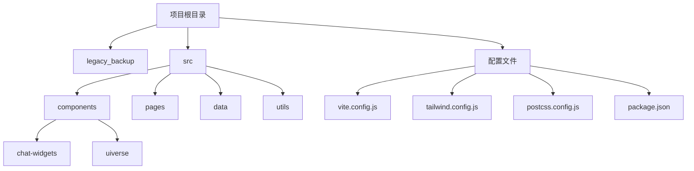
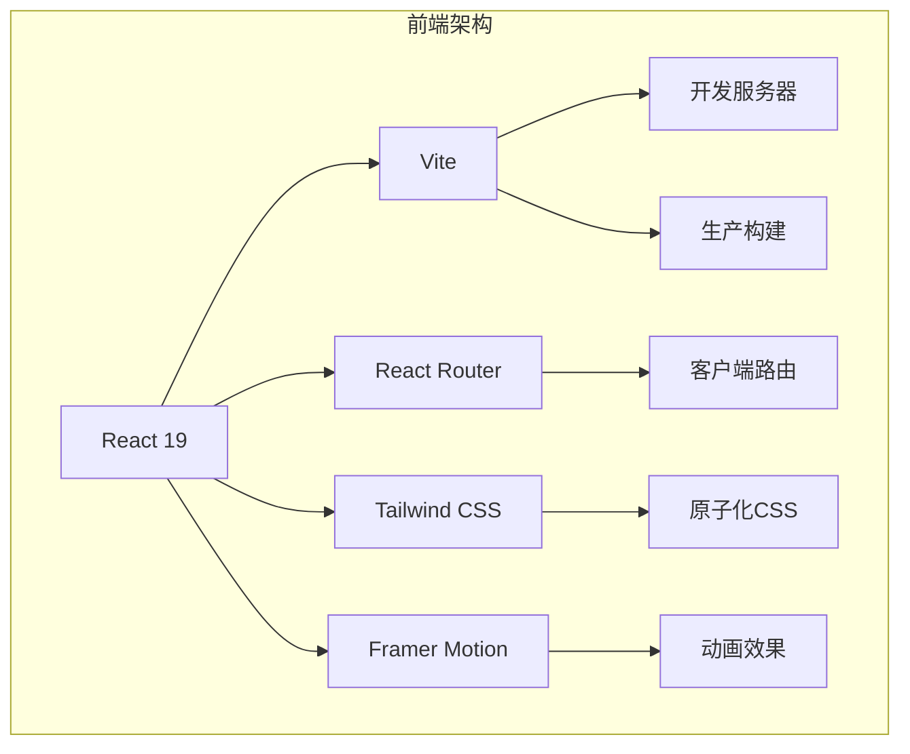
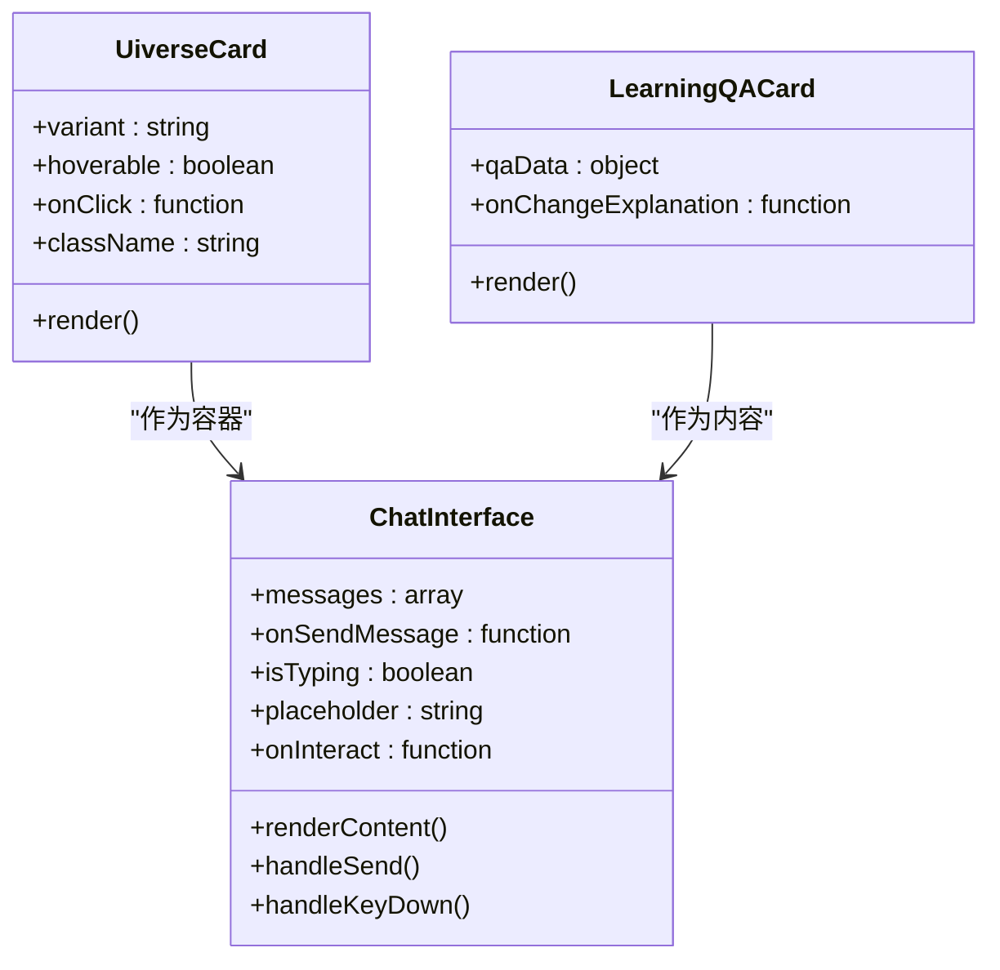
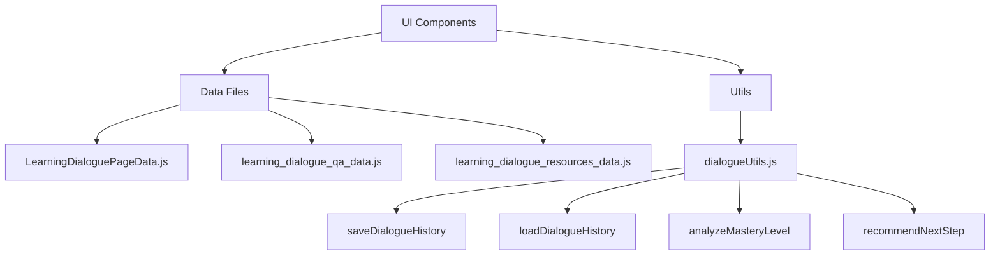
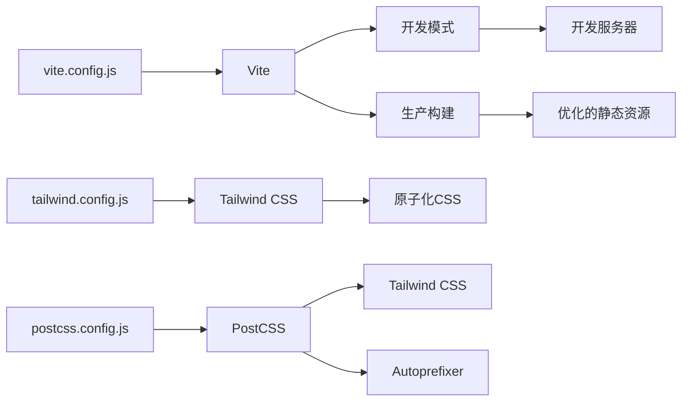
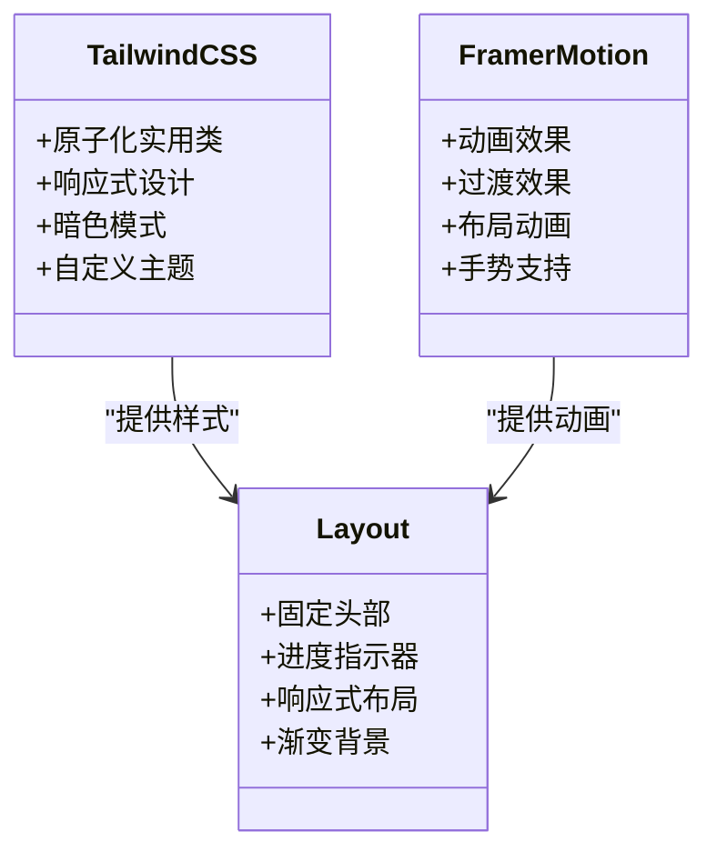
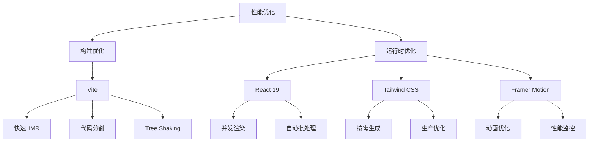

# 技术架构

<cite>
**本文档引用的文件**  
- [main.jsx](file://src/main.jsx)
- [App.jsx](file://src/App.jsx)
- [Layout.jsx](file://src/components/Layout.jsx)
- [vite.config.js](file://vite.config.js)
- [tailwind.config.js](file://tailwind.config.js)
- [postcss.config.js](file://postcss.config.js)
- [package.json](file://package.json)
- [index.css](file://src/index.css)
- [StudentHome.jsx](file://src/pages/StudentHome.jsx)
- [LearningDialoguePage.jsx](file://src/pages/LearningDialoguePage.jsx)
- [ChatInterface.jsx](file://src/components/ChatInterface.jsx)
- [UiverseCard.jsx](file://src/components/uiverse/UiverseCard.jsx)
- [dialogueUtils.js](file://src/utils/dialogueUtils.js)
</cite>

## 目录
1. [项目结构](#项目结构)
2. [核心架构](#核心架构)
3. [组件化设计模式](#组件化设计模式)
4. [路由控制机制](#路由控制机制)
5. [UI与数据分离架构](#ui与数据分离架构)
6. [构建流程与配置](#构建流程与配置)
7. [样式策略](#样式策略)
8. [性能优化考量](#性能优化考量)

## 项目结构

gemini项目采用基于React 19和Vite构建的前端单页应用（SPA）架构，具有清晰的模块化组织结构。项目根目录包含核心配置文件，`src`目录下按功能划分组件、页面和数据模块。



**Diagram sources**  
- [vite.config.js](file://vite.config.js)
- [tailwind.config.js](file://tailwind.config.js)
- [package.json](file://package.json)

**Section sources**  
- [vite.config.js](file://vite.config.js)
- [tailwind.config.js](file://tailwind.config.js)
- [package.json](file://package.json)

## 核心架构

gemini项目采用现代化的前端技术栈，以React 19为核心构建用户界面，Vite作为构建工具提供快速的开发服务器和高效的生产构建。项目通过React Router实现客户端路由控制，采用组件化设计模式组织UI元素，实现了UI与数据的分离。



**Diagram sources**  
- [package.json](file://package.json)
- [vite.config.js](file://vite.config.js)
- [main.jsx](file://src/main.jsx)

**Section sources**  
- [package.json](file://package.json)
- [vite.config.js](file://vite.config.js)
- [main.jsx](file://src/main.jsx)

## 组件化设计模式

项目采用组件化设计模式，将UI分解为可重用的独立组件。组件分为基础UI组件（如UiverseCard）和复合组件（如ChatInterface），通过props传递数据和行为，实现了高内聚低耦合的设计。



**Diagram sources**  
- [UiverseCard.jsx](file://src/components/uiverse/UiverseCard.jsx)
- [ChatInterface.jsx](file://src/components/ChatInterface.jsx)
- [LearningQACard.jsx](file://src/components/chat-widgets/LearningQACard.jsx)

**Section sources**  
- [UiverseCard.jsx](file://src/components/uiverse/UiverseCard.jsx)
- [ChatInterface.jsx](file://src/components/ChatInterface.jsx)

## 路由控制机制

项目使用React Router实现路由控制，通过`HashRouter`在客户端管理URL和视图的映射关系。`App.jsx`作为根组件定义了所有路由规则，`Layout.jsx`提供通用布局并集成进度指示器。

```mermaid
flowchart TD
A[HashRouter] --> B[Routes]
B --> C[/]
B --> D[/goal-selection]
B --> E[/ability-assessment]
B --> F[/learning-report]
C --> G[StudentHome]
D --> H[UnifiedAssessmentPage]
E --> I[AbilityAssessmentPage]
F --> J[LearningReportLayout]
K[Layout] --> L[Outlet]
L --> M[Assessment Pages]
L --> N[Learning Pages]
```

**Diagram sources**  
- [App.jsx](file://src/App.jsx)
- [Layout.jsx](file://src/components/Layout.jsx)
- [main.jsx](file://src/main.jsx)

**Section sources**  
- [App.jsx](file://src/App.jsx)
- [Layout.jsx](file://src/components/Layout.jsx)

## UI与数据分离架构

项目采用UI与数据分离的架构设计，通过`data`目录集中管理静态数据，`utils`目录提供数据处理工具。组件通过导入数据文件和工具函数实现业务逻辑，保持了UI组件的纯净性。



**Diagram sources**  
- [LearningDialoguePage.jsx](file://src/pages/LearningDialoguePage.jsx)
- [dialogueUtils.js](file://src/utils/dialogueUtils.js)
- [data](file://src/data/)

**Section sources**  
- [LearningDialoguePage.jsx](file://src/pages/LearningDialoguePage.jsx)
- [dialogueUtils.js](file://src/utils/dialogueUtils.js)

## 构建流程与配置

项目使用Vite作为构建工具，提供了快速的开发服务器和高效的生产构建。Vite配置文件定义了基础路径和React插件，PostCSS与Tailwind CSS集成实现现代化的CSS处理流程。



**Diagram sources**  
- [vite.config.js](file://vite.config.js)
- [tailwind.config.js](file://tailwind.config.js)
- [postcss.config.js](file://postcss.config.js)

**Section sources**  
- [vite.config.js](file://vite.config.js)
- [tailwind.config.js](file://tailwind.config.js)
- [postcss.config.js](file://postcss.config.js)

## 样式策略

项目采用Tailwind CSS的原子化CSS实践，通过预定义的实用类直接在JSX中编写样式。Framer Motion提供流畅的动画效果，与Tailwind CSS协同实现现代化的用户界面。



**Diagram sources**  
- [Layout.jsx](file://src/components/Layout.jsx)
- [tailwind.config.js](file://tailwind.config.js)
- [index.css](file://src/index.css)

**Section sources**  
- [Layout.jsx](file://src/components/Layout.jsx)
- [tailwind.config.js](file://tailwind.config.js)

## 性能优化考量

项目在架构设计中考虑了多项性能优化策略，包括代码分割、懒加载、状态管理优化和资源优化。Vite的原生ES模块支持提供了快速的热模块替换，Tailwind CSS的按需生成减少了CSS文件体积。



**Diagram sources**  
- [vite.config.js](file://vite.config.js)
- [package.json](file://package.json)
- [tailwind.config.js](file://tailwind.config.js)

**Section sources**  
- [vite.config.js](file://vite.config.js)
- [package.json](file://package.json)
- [tailwind.config.js](file://tailwind.config.js)