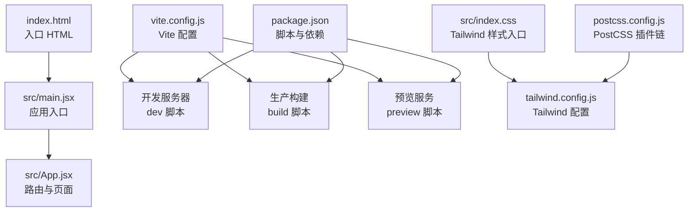
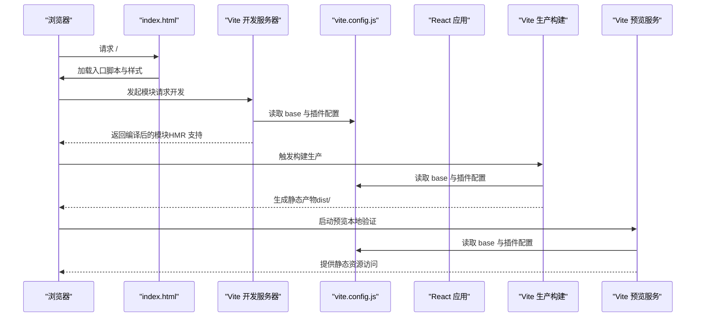
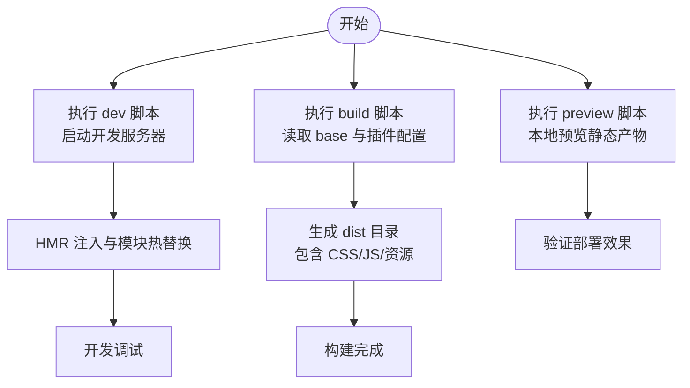
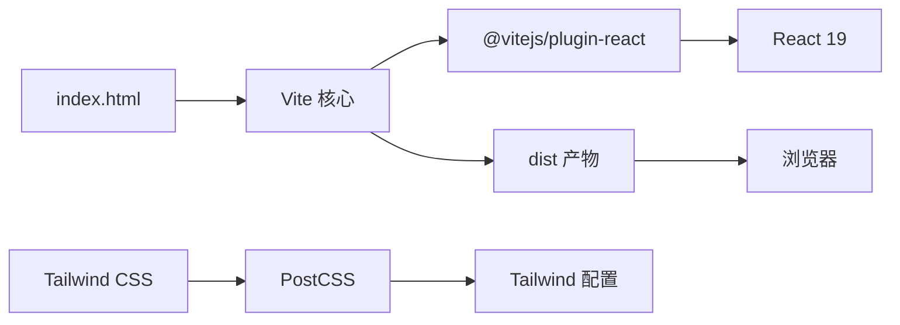

# Vite 配置详解

<cite>
**本文引用的文件**
- [vite.config.js](file://vite.config.js)
- [package.json](file://package.json)
- [index.html](file://index.html)
- [src/main.jsx](file://src/main.jsx)
- [src/App.jsx](file://src/App.jsx)
- [README.md](file://README.md)
- [src/index.css](file://src/index.css)
- [tailwind.config.js](file://tailwind.config.js)
- [postcss.config.js](file://postcss.config.js)
</cite>

## 目录
1. [引言](#引言)
2. [项目结构](#项目结构)
3. [核心组件](#核心组件)
4. [架构总览](#架构总览)
5. [详细组件分析](#详细组件分析)
6. [依赖关系分析](#依赖关系分析)
7. [性能考量](#性能考量)
8. [故障排查指南](#故障排查指南)
9. [结论](#结论)
10. [附录](#附录)

## 引言
本文件围绕 gemini 项目的 Vite 配置进行深入解析，重点聚焦以下方面：
- vite.config.js 中 base: './' 的相对路径配置对静态资源部署的影响
- @vitejs/plugin-react 插件在 React 19 环境下的集成机制
- 开发服务器（dev）、生产构建（build）与预览服务（preview）脚本的执行流程与内部工作原理
- 结合项目实际需求，解释为何采用相对路径而非绝对路径，并给出在 GitHub Pages、Nginx 等不同部署环境下的配置调整建议
- 常见问题如热更新失效、路径 404 错误的排查方法

## 项目结构
该项目为基于 React 19 与 Vite 的前端应用，使用 Tailwind CSS 进行样式管理，通过 HashRouter 实现前端路由。关键配置集中在 vite.config.js、package.json 与入口 HTML 文件中。

图表来源
- [index.html](file://index.html#L1-L14)
- [src/main.jsx](file://src/main.jsx#L1-L14)
- [src/App.jsx](file://src/App.jsx#L1-L101)
- [vite.config.js](file://vite.config.js#L1-L9)
- [package.json](file://package.json#L1-L42)
- [src/index.css](file://src/index.css#L1-L143)
- [tailwind.config.js](file://tailwind.config.js#L1-L97)
- [postcss.config.js](file://postcss.config.js#L1-L7)

章节来源
- [index.html](file://index.html#L1-L14)
- [src/main.jsx](file://src/main.jsx#L1-L14)
- [src/App.jsx](file://src/App.jsx#L1-L101)
- [vite.config.js](file://vite.config.js#L1-L9)
- [package.json](file://package.json#L1-L42)
- [src/index.css](file://src/index.css#L1-L143)
- [tailwind.config.js](file://tailwind.config.js#L1-L97)
- [postcss.config.js](file://postcss.config.js#L1-L7)

## 核心组件
- Vite 配置：定义 base 路径、启用 React 插件等
- React 应用入口：以 HashRouter 包裹，实现无历史记录路由
- 构建与预览脚本：由 package.json 中的 dev/build/preview 统一调度
- 样式体系：Tailwind CSS 与 PostCSS 配置

章节来源
- [vite.config.js](file://vite.config.js#L1-L9)
- [package.json](file://package.json#L1-L42)
- [src/main.jsx](file://src/main.jsx#L1-L14)
- [src/index.css](file://src/index.css#L1-L143)
- [tailwind.config.js](file://tailwind.config.js#L1-L97)
- [postcss.config.js](file://postcss.config.js#L1-L7)

## 架构总览
下图展示了从浏览器请求到应用渲染的关键路径，以及 Vite 在不同阶段的作用。

图表来源
- [index.html](file://index.html#L1-L14)
- [vite.config.js](file://vite.config.js#L1-L9)
- [package.json](file://package.json#L1-L42)

## 详细组件分析

### Vite 配置：base: './' 的相对路径策略
- 相对路径的意义
  - base: './' 将构建产物的公共路径设置为相对当前目录，有利于在子路径或多级目录下正确加载静态资源（如 dist/assets 下的 CSS/JS 文件）
  - 对于需要部署到子路径的场景（例如 GitHub Pages 的仓库页面），相对路径能避免绝对路径导致的资源 404
- 与 HashRouter 的协同
  - 项目使用 HashRouter，URL 中的哈希片段不会触发后端路由，因此对 base 的绝对/相对差异不敏感；但相对路径仍有助于在多层目录部署时保持一致性
- 与入口 HTML 的关系
  - index.html 中的静态资源引用应尽量使用相对路径或以 base 为起点的路径，避免硬编码绝对路径

章节来源
- [vite.config.js](file://vite.config.js#L1-L9)
- [index.html](file://index.html#L1-L14)
- [src/main.jsx](file://src/main.jsx#L1-L14)

### @vitejs/plugin-react 插件在 React 19 环境下的集成机制
- 插件作用
  - 为 React 项目提供快速刷新（Fast Refresh）与 JSX 转换支持，提升开发体验
- 与 React 版本的关系
  - 项目使用 React 19，插件版本与 React 19 兼容，确保在开发与构建阶段均能正确处理 JSX 与 Hook 更新
- 与构建产物的关系
  - 插件参与开发服务器的模块转换与热更新，同时在生产构建中负责 JSX 转换与最小化

章节来源
- [package.json](file://package.json#L1-L42)
- [README.md](file://README.md#L1-L18)

### 开发服务器（dev）、生产构建（build）与预览服务（preview）的执行流程
- 开发服务器（dev）
  - 通过 package.json 中的 dev 脚本启动 Vite 开发服务器
  - 服务器根据 vite.config.js 的 base 与插件配置，对请求的模块进行实时转换与注入 HMR 代码
  - 浏览器通过 WebSocket 接收变更通知，局部刷新页面
- 生产构建（build）
  - 通过 package.json 中的 build 脚本触发 Vite 构建
  - 构建过程读取 vite.config.js 的 base 设置，输出静态资源至 dist 目录
  - 样式由 PostCSS 与 Tailwind 处理，最终产物包含 CSS 与 JS 文件
- 预览服务（preview）
  - 通过 package.json 中的 preview 脚本启动本地静态预览
  - 该服务会读取构建产物并提供静态资源访问，便于在本地验证部署效果

图表来源
- [package.json](file://package.json#L1-L42)
- [vite.config.js](file://vite.config.js#L1-L9)

章节来源
- [package.json](file://package.json#L1-L42)
- [vite.config.js](file://vite.config.js#L1-L9)

### 样式体系与构建链路
- 样式入口与工具链
  - src/index.css 引入 Tailwind 指令，tailwind.config.js 定义主题与动画扩展，postcss.config.js 配置 Tailwind 与 Autoprefixer
- 构建产物中的样式
  - 构建时 Tailwind 会扫描内容并生成所需 CSS，最终产物包含压缩后的样式文件

章节来源
- [src/index.css](file://src/index.css#L1-L143)
- [tailwind.config.js](file://tailwind.config.js#L1-L97)
- [postcss.config.js](file://postcss.config.js#L1-L7)

## 依赖关系分析
- Vite 与 React 插件
  - @vitejs/plugin-react 作为开发与构建阶段的插件，负责 JSX 转换与 HMR
- 样式依赖
  - Tailwind CSS 与 Autoprefixer 通过 PostCSS 配置启用
- 路由依赖
  - HashRouter 用于前端路由，避免对后端路由的依赖，与 base 的相对路径策略相辅相成

图表来源
- [package.json](file://package.json#L1-L42)
- [vite.config.js](file://vite.config.js#L1-L9)
- [postcss.config.js](file://postcss.config.js#L1-L7)
- [tailwind.config.js](file://tailwind.config.js#L1-L97)

章节来源
- [package.json](file://package.json#L1-L42)
- [vite.config.js](file://vite.config.js#L1-L9)
- [postcss.config.js](file://postcss.config.js#L1-L7)
- [tailwind.config.js](file://tailwind.config.js#L1-L97)

## 性能考量
- 使用相对路径 base 可减少因部署路径变化带来的资源重定向与额外开销
- 在生产构建中，确保仅打包必要的样式与脚本，避免冗余资源
- 利用 Tailwind 的按需扫描与 PostCSS 压缩，降低包体大小
- 开发阶段启用 HMR，避免整页刷新带来的性能损耗

## 故障排查指南
- 热更新失效
  - 确认开发服务器已启动且未被代理或反向代理阻断 WebSocket
  - 检查浏览器控制台是否存在网络错误或跨域问题
  - 确保 vite.config.js 的插件与版本兼容
- 路径 404 错误
  - 若部署到子路径，请确认 base 设置为相对路径（'./'），并检查入口 HTML 中的静态资源引用是否与 base 一致
  - 在 GitHub Pages 或 Nginx 等环境中，确保服务器正确指向构建产物目录
- 样式未生效
  - 检查 Tailwind 配置与内容扫描范围是否覆盖到目标文件
  - 确认 PostCSS 插件链顺序正确，Tailwind 在 Autoprefixer 之前运行

章节来源
- [vite.config.js](file://vite.config.js#L1-L9)
- [index.html](file://index.html#L1-L14)
- [src/index.css](file://src/index.css#L1-L143)
- [tailwind.config.js](file://tailwind.config.js#L1-L97)
- [postcss.config.js](file://postcss.config.js#L1-L7)

## 结论
本项目的 Vite 配置以相对路径 base 为核心，结合 @vitejs/plugin-react 与 Tailwind 工具链，实现了高效的开发体验与可移植的生产构建。配合 HashRouter 的前端路由策略，使得应用在多层级部署环境下仍能稳定运行。针对不同部署场景（如 GitHub Pages、Nginx），建议统一采用相对路径 base 并校验入口 HTML 的资源引用，以避免路径相关问题。

## 附录
- 部署环境建议
  - GitHub Pages：使用相对路径 base，确保 Pages 仓库页面指向构建产物目录
  - Nginx：将静态根目录指向 dist 目录，保持 base 为相对路径，避免硬编码绝对路径
- 脚本参考
  - 开发：npm run dev
  - 构建：npm run build
  - 预览：npm run preview

章节来源
- [package.json](file://package.json#L1-L42)
- [vite.config.js](file://vite.config.js#L1-L9)
- [index.html](file://index.html#L1-L14)