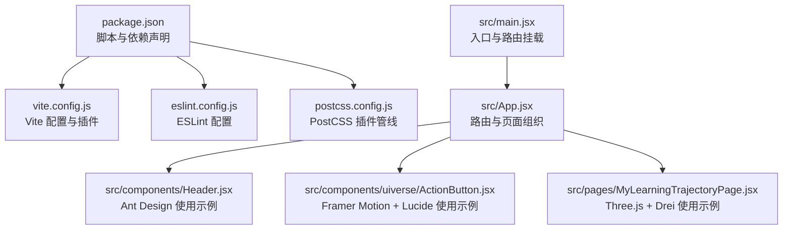
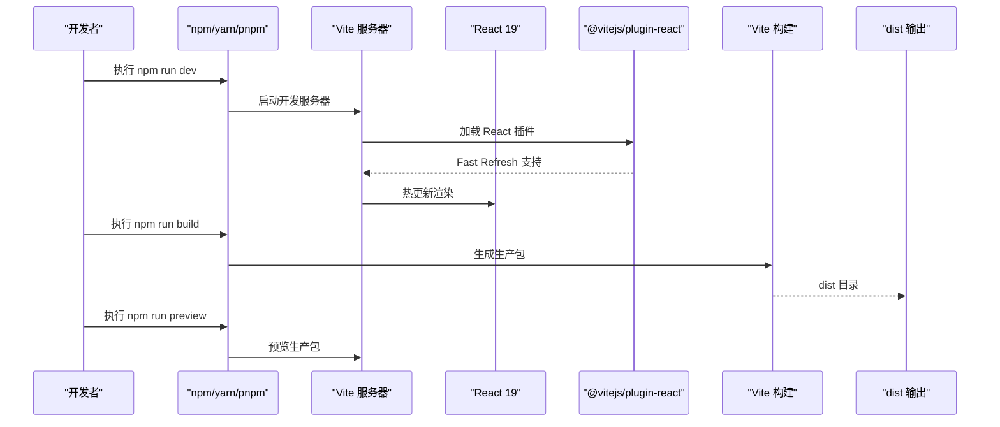
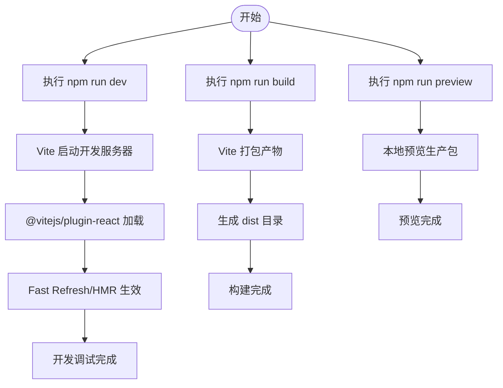
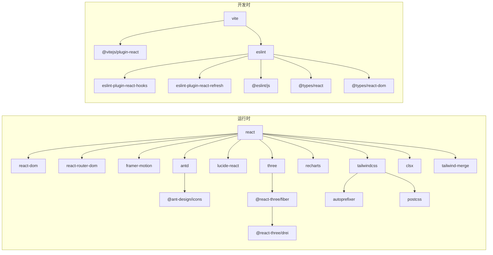

# 依赖管理与脚本配置

<cite>
**本文引用的文件**
- [package.json](file://package.json)
- [vite.config.js](file://vite.config.js)
- [eslint.config.js](file://eslint.config.js)
- [postcss.config.js](file://postcss.config.js)
- [README.md](file://README.md)
- [src/main.jsx](file://src/main.jsx)
- [src/App.jsx](file://src/App.jsx)
- [src/components/Header.jsx](file://src/components/Header.jsx)
- [src/components/uiverse/ActionButton.jsx](file://src/components/uiverse/ActionButton.jsx)
- [src/pages/MyLearningTrajectoryPage.jsx](file://src/pages/MyLearningTrajectoryPage.jsx)
</cite>

## 目录
1. [简介](#简介)
2. [项目结构](#项目结构)
3. [核心组件](#核心组件)
4. [架构总览](#架构总览)
5. [详细组件分析](#详细组件分析)
6. [依赖关系分析](#依赖关系分析)
7. [性能考量](#性能考量)
8. [故障排查指南](#故障排查指南)
9. [结论](#结论)
10. [附录](#附录)

## 简介
本文件围绕项目中的依赖与脚本进行系统化梳理，明确生产依赖与开发依赖的职责边界，解释 dev、build、preview 三个核心脚本的用途与执行流程；同时结合实际代码使用场景，说明 React 19 与 @vitejs/plugin-react 的版本兼容性要求，以及 Ant Design、Framer Motion、Three.js + Drei、Lucide 等库在工程中的集成方式与最佳实践，并给出依赖安装、脚本扩展与版本升级的建议，以及常见依赖冲突的解决策略。

## 项目结构
该仓库采用前端单页应用（SPA）结构，基于 Vite 构建工具链，使用 React 19 作为核心运行时，TailwindCSS 与 PostCSS 提供样式管线，配合 Ant Design、Framer Motion、Three.js + Drei、Lucide 等生态库实现丰富的交互与可视化能力。

图表来源
- [package.json](file://package.json#L1-L41)
- [vite.config.js](file://vite.config.js#L1-L9)
- [eslint.config.js](file://eslint.config.js#L1-L30)
- [postcss.config.js](file://postcss.config.js#L1-L7)
- [src/main.jsx](file://src/main.jsx#L1-L14)
- [src/App.jsx](file://src/App.jsx#L1-L101)
- [src/components/Header.jsx](file://src/components/Header.jsx#L1-L27)
- [src/components/uiverse/ActionButton.jsx](file://src/components/uiverse/ActionButton.jsx#L1-L125)
- [src/pages/MyLearningTrajectoryPage.jsx](file://src/pages/MyLearningTrajectoryPage.jsx#L1-L410)

章节来源
- [package.json](file://package.json#L1-L41)
- [vite.config.js](file://vite.config.js#L1-L9)
- [eslint.config.js](file://eslint.config.js#L1-L30)
- [postcss.config.js](file://postcss.config.js#L1-L7)
- [src/main.jsx](file://src/main.jsx#L1-L14)
- [src/App.jsx](file://src/App.jsx#L1-L101)

## 核心组件
- 依赖与脚本
  - 生产依赖：React、React DOM、React Router DOM、Ant Design、Ant Design Icons、Framer Motion、Lucide React、Three.js、@react-three/fiber、@react-three/drei、Recharts、TailwindCSS、Autoprefixer、PostCSS、Tailwind Merge、clsx 等。
  - 开发依赖：Vite、@vitejs/plugin-react、ESLint 及相关插件、@types/react、@types/react-dom、globals 等。
  - 脚本命令：dev、build、lint、preview。
- 构建与运行
  - Vite 配置启用 React 插件，base 设置为相对路径，确保静态资源正确加载。
  - ESLint 配置采用 flat config，启用推荐规则与 React Hooks、React Refresh 插件，支持 TS 类型感知（通过类型声明与 @types 包）。
  - PostCSS 配置启用 TailwindCSS 与 Autoprefixer，实现原子化样式与浏览器兼容处理。

章节来源
- [package.json](file://package.json#L6-L11)
- [package.json](file://package.json#L12-L29)
- [package.json](file://package.json#L30-L40)
- [vite.config.js](file://vite.config.js#L1-L9)
- [eslint.config.js](file://eslint.config.js#L1-L30)
- [postcss.config.js](file://postcss.config.js#L1-L7)

## 架构总览
下图展示从脚本到构建产物的关键流程，以及各生态库在运行时的协作关系。

图表来源
- [package.json](file://package.json#L6-L11)
- [vite.config.js](file://vite.config.js#L1-L9)

章节来源
- [package.json](file://package.json#L6-L11)
- [vite.config.js](file://vite.config.js#L1-L9)

## 详细组件分析

### 依赖分类与作用
- 生产依赖（运行期必需）
  - React 19 与 React DOM：应用运行时核心。
  - React Router DOM：路由导航与页面切换。
  - Ant Design 与 Ant Design Icons：UI 组件与图标体系。
  - Framer Motion：动画与交互动画。
  - Lucide React：矢量图标库。
  - Three.js 与 @react-three/fiber、@react-three/drei：3D 场景与交互。
  - Recharts：数据可视化图表。
  - TailwindCSS、Autoprefixer、PostCSS、Tailwind Merge、clsx：样式与工具类。
- 开发依赖（构建与质量保障）
  - Vite：开发服务器与打包工具。
  - @vitejs/plugin-react：React 快速刷新与 JSX 转换。
  - ESLint 及插件：代码规范与错误检测。
  - @types/react、@types/react-dom：类型声明。
  - globals：ESLint 全局变量配置。

章节来源
- [package.json](file://package.json#L12-L29)
- [package.json](file://package.json#L30-L40)

### React 19 与 @vitejs/plugin-react 版本兼容性
- React 19 与 Vite 生态的兼容性
  - 项目使用 React 19 与 @vitejs/plugin-react，结合 README 中对 React Compiler 的说明，表明模板默认未启用 React Compiler 以平衡开发与构建性能。
  - 建议保持 React 与 @vitejs/plugin-react 的主版本一致或兼容范围，避免 Fast Refresh 或 JSX 转换异常。
- 版本选择建议
  - React 19.x 与 @vitejs/plugin-react ^4.3.x 通常可稳定共存。
  - 若升级 React，请同步升级 @vitejs/plugin-react 至兼容版本，并验证 HMR 与构建行为。

章节来源
- [package.json](file://package.json#L22-L23)
- [package.json](file://package.json#L34-L34)
- [README.md](file://README.md#L1-L18)

### Ant Design 集成与使用
- 集成方式
  - 安装 antd 与 @ant-design/icons。
  - 在组件中按需引入所需组件与图标。
- 实际使用示例
  - 头部组件中使用 Button 与图标组件，体现 Antd 的基础控件与图标组合。
- 最佳实践
  - 优先按需引入组件，减少打包体积。
  - 使用主题定制与 CSS 变量覆盖，统一风格。

章节来源
- [package.json](file://package.json#L13-L17)
- [src/components/Header.jsx](file://src/components/Header.jsx#L1-L27)

### Framer Motion 动画库集成
- 集成方式
  - 安装 framer-motion。
  - 在组件中导入 motion 与 AnimatePresence 等 API。
- 实际使用示例
  - 动作按钮组件使用 motion 实现波纹与发光效果，体现流畅的交互动画。
- 最佳实践
  - 合理设置动画延迟与缓动曲线，避免影响首屏渲染。
  - 对复杂动画场景使用 useMotionValue 与 useTransform 降低重排成本。

章节来源
- [package.json](file://package.json#L19-L19)
- [src/components/uiverse/ActionButton.jsx](file://src/components/uiverse/ActionButton.jsx#L1-L125)

### Three.js + Drei 3D 渲染集成
- 集成方式
  - 安装 three、@react-three/fiber、@react-three/drei。
  - 在页面中使用 Canvas、useFrame、OrbitControls、Text、Html、Float、Stars、RoundedBox、Line 等组件。
- 实际使用示例
  - 学习轨迹页面通过 Canvas 构建 3D 场景，使用 useFrame 实现动画与轨迹回放，结合 Drei 的辅助控件与几何体。
- 最佳实践
  - 将重型 3D 计算放在 worker 或节流帧循环中，避免阻塞主线程。
  - 合理控制阴影与光源数量，优化渲染性能。

章节来源
- [package.json](file://package.json#L14-L16)
- [package.json](file://package.json#L28-L28)
- [src/pages/MyLearningTrajectoryPage.jsx](file://src/pages/MyLearningTrajectoryPage.jsx#L1-L410)

### 图标库 Lucide 集成
- 集成方式
  - 安装 lucide-react。
  - 在组件中按需导入具体图标。
- 实际使用示例
  - 多个页面与组件中导入并使用多种图标，如发送、播放、暂停、星标等。
- 最佳实践
  - 使用图标尺寸与颜色与主题一致，避免视觉割裂。
  - 对于高频图标，考虑本地 SVG 缓存或按需打包策略。

章节来源
- [package.json](file://package.json#L19-L19)
- [src/components/uiverse/ActionButton.jsx](file://src/components/uiverse/ActionButton.jsx#L1-L125)
- [src/pages/MyLearningTrajectoryPage.jsx](file://src/pages/MyLearningTrajectoryPage.jsx#L1-L410)

### 数据可视化 Recharts
- 集成方式
  - 安装 recharts。
  - 在页面中按需引入图表组件。
- 实际使用场景
  - 报告与仪表盘页面可结合 Recharts 展示统计数据与趋势。
- 最佳实践
  - 使用响应式容器与主题色，保证在不同设备上的一致性。
  - 控制数据更新频率，避免频繁重绘。

章节来源
- [package.json](file://package.json#L25-L25)

### 脚本命令详解与执行流程
- dev（开发模式）
  - 启动 Vite 开发服务器，启用 @vitejs/plugin-react 的快速刷新能力，支持热更新与源码映射。
- build（生产构建）
  - 生成 dist 目录的静态资源，包含 HTML、JS、CSS 与媒体文件，适配生产环境部署。
- preview（预览生产包）
  - 在本地启动静态服务器预览 build 产物，便于验证打包结果与性能表现。
- lint（代码检查）
  - 基于 ESLint 配置对项目进行静态检查，结合 React Hooks 与 React Refresh 规则提升代码质量。

图表来源
- [package.json](file://package.json#L6-L11)
- [vite.config.js](file://vite.config.js#L1-L9)

章节来源
- [package.json](file://package.json#L6-L11)
- [vite.config.js](file://vite.config.js#L1-L9)

### 样式管线与工具链
- PostCSS 与 TailwindCSS
  - 通过 postcss.config.js 启用 tailwindcss 与 autoprefixer，实现原子化样式与浏览器兼容处理。
- 类名合并与工具类
  - 使用 clsx 与 tailwind-merge 进行条件类名合并与冲突消除，减少冗余样式。
- 入口与路由
  - main.jsx 引入全局样式并挂载 HashRouter，App.jsx 组织路由与页面。

章节来源
- [postcss.config.js](file://postcss.config.js#L1-L7)
- [package.json](file://package.json#L17-L20)
- [src/main.jsx](file://src/main.jsx#L1-L14)
- [src/App.jsx](file://src/App.jsx#L1-L101)

## 依赖关系分析
下图展示项目主要依赖之间的关系与使用方向。

图表来源
- [package.json](file://package.json#L12-L40)

章节来源
- [package.json](file://package.json#L12-L40)

## 性能考量
- React 19 与 @vitejs/plugin-react
  - 保持主版本匹配，避免 JSX/TSX 转换与 HMR 差异导致的性能退化。
- 3D 场景优化
  - 控制网格面数与贴图分辨率，合理使用阴影与光源数量。
  - 将动画逻辑与帧循环节流，避免主线程阻塞。
- 动画与交互动画
  - 使用 transform 与 opacity 等 GPU 加速属性，减少强制布局与重绘。
- 样式与打包
  - TailwindCSS 按需引入与摇树优化，避免无用类名进入产物。
  - 使用 clsx 与 tailwind-merge 合并类名，减少重复与冲突。

[本节为通用指导，不直接分析具体文件]

## 故障排查指南
- 构建失败或 HMR 失效
  - 检查 @vitejs/plugin-react 与 React 主版本是否匹配。
  - 确认 vite.config.js 中已启用 react 插件且 base 设置为相对路径。
- ESLint 报错
  - 按 eslint.config.js 的 flat 配置修正规则，必要时调整语言选项与全局变量。
- 3D 场景渲染异常
  - 检查 three、@react-three/fiber、@react-three/drei 的版本兼容性，避免 API 变更导致的报错。
- 图标缺失或样式异常
  - 确认 lucide-react 与 antd 图标使用方式正确，避免命名空间冲突。
- 预览与部署差异
  - 使用 preview 验证生产包，关注静态资源路径与 base 配置。

章节来源
- [vite.config.js](file://vite.config.js#L1-L9)
- [eslint.config.js](file://eslint.config.js#L1-L30)
- [package.json](file://package.json#L12-L40)

## 结论
本项目以 Vite 为核心构建工具，结合 React 19、Ant Design、Framer Motion、Three.js + Drei、Lucide 等生态库，实现了现代化的前端工程化实践。通过明确区分生产与开发依赖、规范脚本命令与工具链配置，项目在开发体验与构建效率之间取得了良好平衡。建议在后续迭代中持续关注各库的版本兼容性，完善按需引入与性能优化策略，以进一步提升用户体验与维护效率。

[本节为总结性内容，不直接分析具体文件]

## 附录

### 依赖安装与升级最佳实践
- 安装新依赖
  - 生产依赖使用 --save，开发依赖使用 --save-dev。
  - 优先选择与 React 19 兼容的插件与库版本。
- 升级策略
  - 先升级 @vitejs/plugin-react 与 Vite，再升级 React，最后升级其他生态库。
  - 使用语义化版本范围（^）保持兼容，升级后执行 lint 与 preview 验证。
- 版本锁定与锁文件
  - 团队统一使用 package-lock.json 或 pnpm-lock.yaml，避免环境差异导致的构建不一致。

[本节为通用指导，不直接分析具体文件]

### 常见依赖冲突与解决策略
- React 与 React DOM 版本不一致
  - 统一升级至相同主版本，确保 Fiber 与 DOM 渲染层匹配。
- @vitejs/plugin-react 与 Vite 版本不匹配
  - 保持 plugin-react 与 Vite 的主版本一致，避免 JSX/TSX 转换差异。
- Three.js 与 @react-three/fiber 版本不兼容
  - 严格遵循官方兼容矩阵，升级时先升级 three，再升级 @react-three/fiber 与 @react-three/drei。
- Ant Design 与 @ant-design/icons 版本不一致
  - 保持 antd 与 @ant-design/icons 的主版本一致，避免图标渲染异常。
- TailwindCSS 与 PostCSS/Autoprefixer 冲突
  - 确保 tailwindcss 与 postcss、autoprefixer 版本兼容，避免编译错误。

[本节为通用指导，不直接分析具体文件]