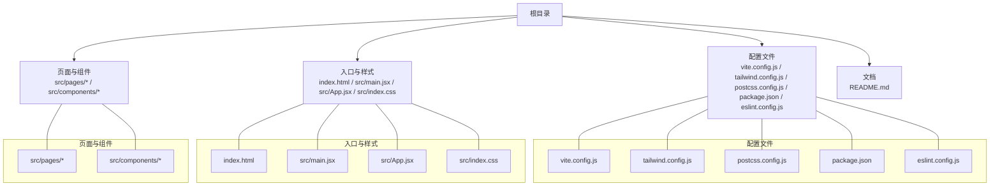
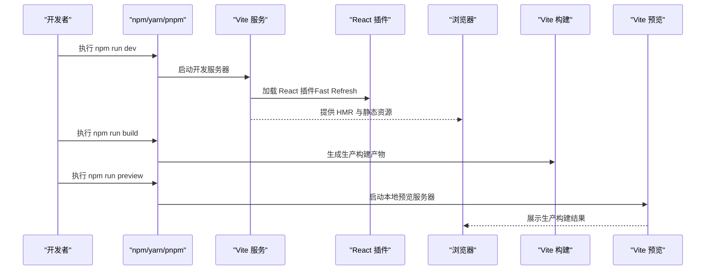
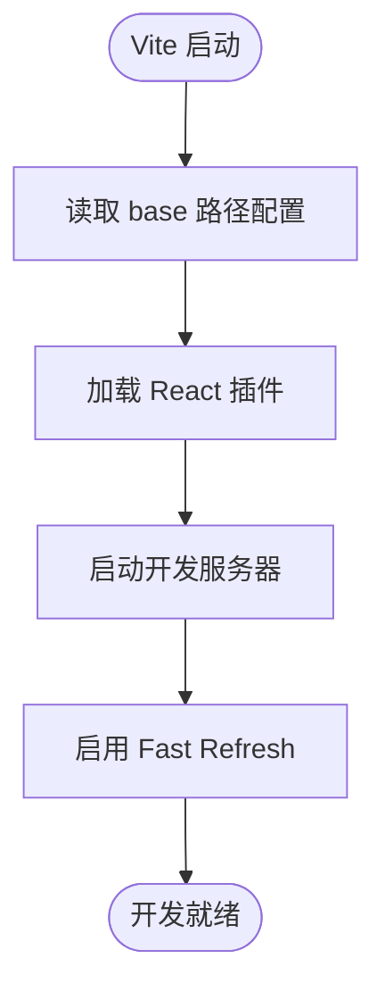
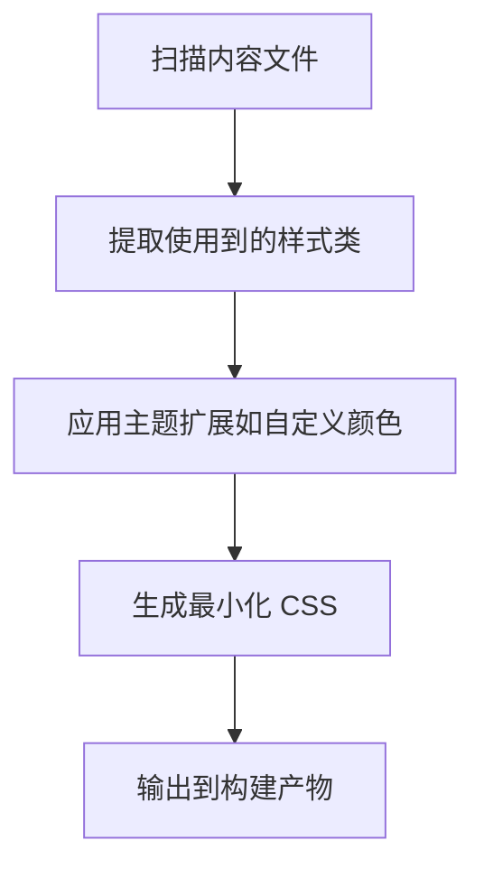
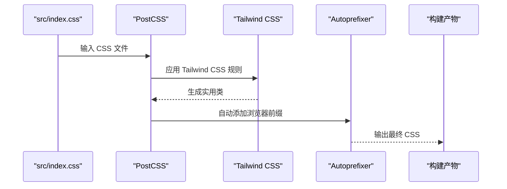
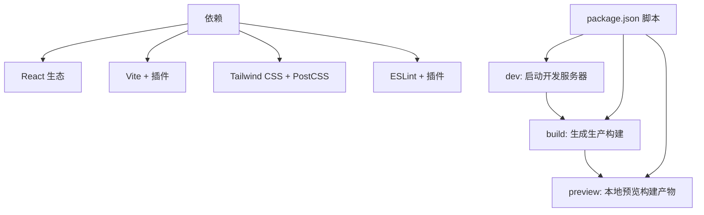
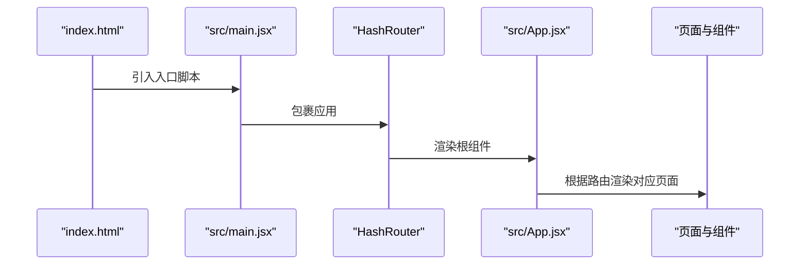
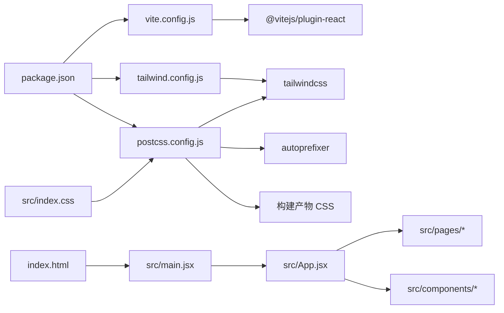

# 构建与配置

<cite>
**本文引用的文件**
- [vite.config.js](file://vite.config.js)
- [tailwind.config.js](file://tailwind.config.js)
- [postcss.config.js](file://postcss.config.js)
- [package.json](file://package.json)
- [README.md](file://README.md)
- [index.html](file://index.html)
- [src/main.jsx](file://src/main.jsx)
- [src/App.jsx](file://src/App.jsx)
- [src/index.css](file://src/index.css)
- [src/components/Layout.jsx](file://src/components/Layout.jsx)
- [src/pages/Dashboard.jsx](file://src/pages/Dashboard.jsx)
- [eslint.config.js](file://eslint.config.js)
</cite>

## 目录
1. [简介](#简介)
2. [项目结构](#项目结构)
3. [核心组件](#核心组件)
4. [架构总览](#架构总览)
5. [详细组件分析](#详细组件分析)
6. [依赖关系分析](#依赖关系分析)
7. [性能考量](#性能考量)
8. [故障排查指南](#故障排查指南)
9. [结论](#结论)
10. [附录](#附录)

## 简介
本文件面向新开发者，系统梳理 gemini 项目的构建系统与工程化配置，重点围绕以下方面展开：
- Vite 构建工具的配置策略及其对开发体验的优化
- vite.config.js 中 base 路径设置与 React 插件集成机制
- tailwind.config.js 中自定义主题颜色与内容扫描路径的配置逻辑
- PostCSS 与 Tailwind CSS 协同工作流程
- package.json 中定义的开发、构建与预览脚本的作用
- 为新开发者提供从开发服务器启动到生产构建与静态资源处理的完整视图
- 常见构建问题的排查指南

## 项目结构
该项目采用 React + Vite 的现代前端工程化方案，核心目录与文件如下：
- 配置层：vite.config.js、tailwind.config.js、postcss.config.js、package.json、eslint.config.js
- 入口与页面：index.html、src/main.jsx、src/App.jsx、src/index.css
- 页面与组件：src/pages/*、src/components/*
- 文档：README.md

图表来源
- [vite.config.js](file://vite.config.js#L1-L9)
- [tailwind.config.js](file://tailwind.config.js#L1-L16)
- [postcss.config.js](file://postcss.config.js#L1-L7)
- [package.json](file://package.json#L1-L42)
- [index.html](file://index.html#L1-L14)
- [src/main.jsx](file://src/main.jsx#L1-L14)
- [src/App.jsx](file://src/App.jsx#L1-L101)
- [src/index.css](file://src/index.css#L1-L8)

章节来源
- [vite.config.js](file://vite.config.js#L1-L9)
- [tailwind.config.js](file://tailwind.config.js#L1-L16)
- [postcss.config.js](file://postcss.config.js#L1-L7)
- [package.json](file://package.json#L1-L42)
- [index.html](file://index.html#L1-L14)
- [src/main.jsx](file://src/main.jsx#L1-L14)
- [src/App.jsx](file://src/App.jsx#L1-L101)
- [src/index.css](file://src/index.css#L1-L8)

## 核心组件
本节聚焦于构建系统的关键配置与运行脚本，帮助快速理解从开发到生产的全流程。

- Vite 配置（vite.config.js）
  - base 路径设置：用于控制打包后静态资源的相对路径前缀，便于在子路径或 GitHub Pages 等场景下正确加载资源
  - React 插件集成：启用 React 快速刷新（Fast Refresh），提升开发体验
- Tailwind CSS 配置（tailwind.config.js）
  - 内容扫描路径：定义哪些文件会被扫描以生成所需样式类，确保按需生成样式
  - 主题扩展：自定义主色等主题变量，统一设计语言
- PostCSS 配置（postcss.config.js）
  - 插件链：tailwindcss 与 autoprefixer 的组合，先生成实用类再自动添加浏览器前缀
- 包管理与脚本（package.json）
  - 开发脚本：启动本地开发服务器
  - 构建脚本：生成生产构建产物
  - 预览脚本：本地预览生产构建
  - 依赖与开发依赖：包含 React、Tailwind CSS、PostCSS、Vite 及其相关插件

章节来源
- [vite.config.js](file://vite.config.js#L1-L9)
- [tailwind.config.js](file://tailwind.config.js#L1-L16)
- [postcss.config.js](file://postcss.config.js#L1-L7)
- [package.json](file://package.json#L1-L42)

## 架构总览
下面用时序图展示从启动开发服务器到生产构建与预览的整体流程，映射到实际配置文件与入口文件。

图表来源
- [package.json](file://package.json#L1-L42)
- [vite.config.js](file://vite.config.js#L1-L9)
- [src/main.jsx](file://src/main.jsx#L1-L14)
- [index.html](file://index.html#L1-L14)

## 详细组件分析

### Vite 配置分析（vite.config.js）
- base 路径设置
  - 作用：决定打包后静态资源的公共路径前缀，避免在子路径部署时出现资源 404
  - 影响范围：影响 HTML 中的静态资源引用、路由与打包输出
- React 插件集成
  - 作用：启用 React 快速刷新（Fast Refresh），在修改组件时无需整页刷新即可看到变化
  - 性能：相比传统热更新，提升开发效率与体验

图表来源
- [vite.config.js](file://vite.config.js#L1-L9)

章节来源
- [vite.config.js](file://vite.config.js#L1-L9)

### Tailwind CSS 配置分析（tailwind.config.js）
- 内容扫描路径
  - 作用：指定 Tailwind 扫描哪些文件以提取使用到的样式类，确保只生成必要的 CSS
  - 影响范围：影响最终 CSS 体积与构建时间
- 主题扩展
  - 作用：通过自定义颜色等主题变量，统一项目设计语言
  - 使用方式：在组件与页面中直接使用自定义类名

图表来源
- [tailwind.config.js](file://tailwind.config.js#L1-L16)
- [src/index.css](file://src/index.css#L1-L8)

章节来源
- [tailwind.config.js](file://tailwind.config.js#L1-L16)
- [src/index.css](file://src/index.css#L1-L8)

### PostCSS 与 Tailwind CSS 协同工作流程
- 插件链
  - tailwindcss：根据 tailwind.config.js 生成所需实用类
  - autoprefixer：自动为 CSS 添加浏览器前缀，保证兼容性
- 工作顺序
  - 在构建阶段，PostCSS 先执行 tailwindcss，再执行 autoprefixer，最后输出到 dist

图表来源
- [postcss.config.js](file://postcss.config.js#L1-L7)
- [tailwind.config.js](file://tailwind.config.js#L1-L16)
- [src/index.css](file://src/index.css#L1-L8)

章节来源
- [postcss.config.js](file://postcss.config.js#L1-L7)
- [tailwind.config.js](file://tailwind.config.js#L1-L16)
- [src/index.css](file://src/index.css#L1-L8)

### package.json 脚本与依赖分析
- 开发脚本
  - 作用：启动本地开发服务器，支持热更新与快速刷新
- 构建脚本
  - 作用：生成生产构建产物，供预览或部署使用
- 预览脚本
  - 作用：本地预览生产构建，验证打包效果
- 依赖与开发依赖
  - React 生态：React、React DOM、React Router
  - 构建生态：Vite、@vitejs/plugin-react、Tailwind CSS、PostCSS、Autoprefixer
  - 工具与规范：ESLint、全局规则、React Hooks 与 React Refresh 插件

图表来源
- [package.json](file://package.json#L1-L42)
- [eslint.config.js](file://eslint.config.js#L1-L30)

章节来源
- [package.json](file://package.json#L1-L42)
- [eslint.config.js](file://eslint.config.js#L1-L30)

### 入口与路由（index.html、src/main.jsx、src/App.jsx）
- index.html
  - 作用：应用的 HTML 入口，挂载根节点与引入入口脚本
- src/main.jsx
  - 作用：创建根节点、注入 HashRouter 并渲染 App
- src/App.jsx
  - 作用：集中定义路由表，组织页面与布局组件

图表来源
- [index.html](file://index.html#L1-L14)
- [src/main.jsx](file://src/main.jsx#L1-L14)
- [src/App.jsx](file://src/App.jsx#L1-L101)

章节来源
- [index.html](file://index.html#L1-L14)
- [src/main.jsx](file://src/main.jsx#L1-L14)
- [src/App.jsx](file://src/App.jsx#L1-L101)

### 组件与页面中的样式使用（示例）
- src/index.css
  - 作用：引入 Tailwind 的 base、components、utilities 三段式，统一基础样式
- src/components/Layout.jsx
  - 作用：布局容器与进度条，大量使用 Tailwind 实用类
- src/pages/Dashboard.jsx
  - 作用：仪表盘页面，使用多种 Tailwind 类名与渐变背景

章节来源
- [src/index.css](file://src/index.css#L1-L8)
- [src/components/Layout.jsx](file://src/components/Layout.jsx#L1-L90)
- [src/pages/Dashboard.jsx](file://src/pages/Dashboard.jsx#L1-L211)

## 依赖关系分析
- 配置文件之间的耦合
  - vite.config.js 依赖 @vitejs/plugin-react
  - tailwind.config.js 依赖 tailwindcss
  - postcss.config.js 依赖 tailwindcss 与 autoprefixer
  - package.json 统一声明依赖与脚本
- 构建链路
  - index.html -> src/main.jsx -> src/App.jsx -> 页面与组件
  - src/index.css -> PostCSS -> Tailwind CSS -> Autoprefixer -> 最终 CSS

图表来源
- [vite.config.js](file://vite.config.js#L1-L9)
- [tailwind.config.js](file://tailwind.config.js#L1-L16)
- [postcss.config.js](file://postcss.config.js#L1-L7)
- [package.json](file://package.json#L1-L42)
- [index.html](file://index.html#L1-L14)
- [src/main.jsx](file://src/main.jsx#L1-L14)
- [src/App.jsx](file://src/App.jsx#L1-L101)
- [src/index.css](file://src/index.css#L1-L8)

章节来源
- [vite.config.js](file://vite.config.js#L1-L9)
- [tailwind.config.js](file://tailwind.config.js#L1-L16)
- [postcss.config.js](file://postcss.config.js#L1-L7)
- [package.json](file://package.json#L1-L42)
- [index.html](file://index.html#L1-L14)
- [src/main.jsx](file://src/main.jsx#L1-L14)
- [src/App.jsx](file://src/App.jsx#L1-L101)
- [src/index.css](file://src/index.css#L1-L8)

## 性能考量
- 开发体验优化
  - React 插件启用 Fast Refresh，减少整页刷新带来的状态丢失
  - Vite 的模块热替换（HMR）与原生 ES 模块支持，显著缩短冷启动与热更新时间
- 构建性能
  - Tailwind 的内容扫描路径应尽量精确，避免扫描无关目录，降低构建时间
  - PostCSS 插件链保持简洁，仅保留必要插件
- 资源加载
  - base 路径设置合理，避免在子路径部署时出现资源 404
- 代码质量
  - ESLint 配置启用 React Hooks 与 React Refresh 规则，减少潜在问题

[本节为通用性能建议，不直接分析具体文件，故无章节来源]

## 故障排查指南
- 构建后资源 404
  - 检查 vite.config.js 中 base 路径是否与部署路径一致
  - 确认 index.html 中静态资源引用是否基于相对路径
- Tailwind 样式未生效
  - 检查 tailwind.config.js 的 content 路径是否包含实际使用的文件
  - 确认 src/index.css 是否正确引入了 Tailwind 三段式
- 浏览器前缀缺失
  - 检查 postcss.config.js 是否启用了 autoprefixer
- 开发服务器无法热更新
  - 确认 @vitejs/plugin-react 已安装并启用
  - 检查 package.json 中的 dev 脚本是否正确
- 预览与生产构建不一致
  - 使用 npm run preview 对比生产构建效果，确认 base 路径与静态资源引用

章节来源
- [vite.config.js](file://vite.config.js#L1-L9)
- [tailwind.config.js](file://tailwind.config.js#L1-L16)
- [postcss.config.js](file://postcss.config.js#L1-L7)
- [package.json](file://package.json#L1-L42)
- [index.html](file://index.html#L1-L14)
- [src/index.css](file://src/index.css#L1-L8)

## 结论
本项目以 Vite 为核心，结合 React 插件、Tailwind CSS 与 PostCSS，构建出高效、可维护且具备良好开发体验的前端工程。通过合理的 base 路径设置、精确的内容扫描路径与简洁的插件链，既能满足开发效率，也能保证生产构建的质量与性能。建议在后续迭代中持续优化内容扫描路径与插件配置，以进一步提升构建速度与产物体积。

[本节为总结性内容，不直接分析具体文件，故无章节来源]

## 附录
- 新开发者上手建议
  - 先运行 npm run dev 启动开发服务器，熟悉 Fast Refresh 与路由导航
  - 修改 src/index.css 或组件类名后观察 Tailwind 样式是否即时生效
  - 使用 npm run build 生成生产构建，并用 npm run preview 验证
- 参考文档
  - README.md 提供了模板与官方插件的基本说明

章节来源
- [README.md](file://README.md#L1-L18)