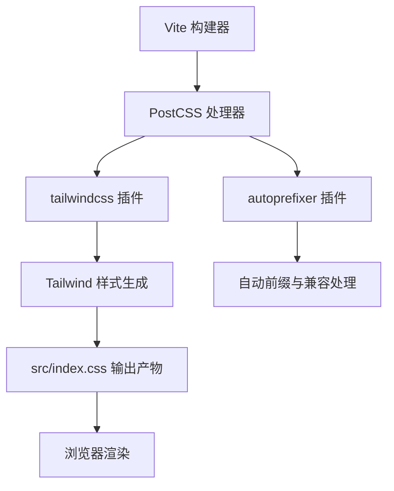
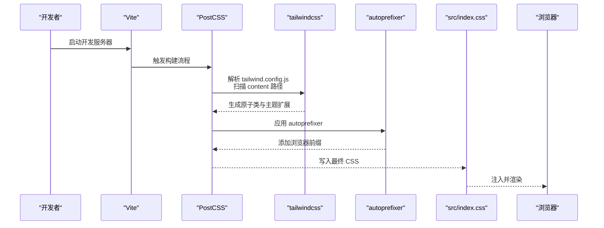
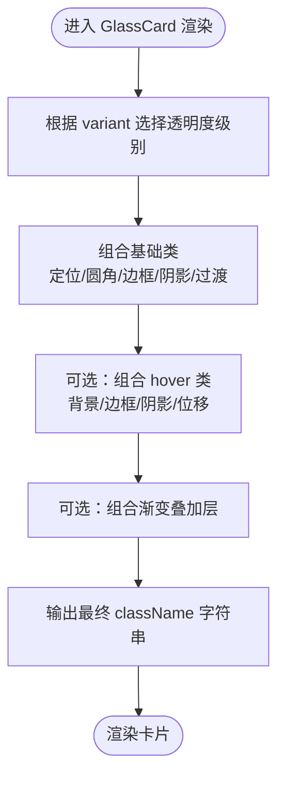
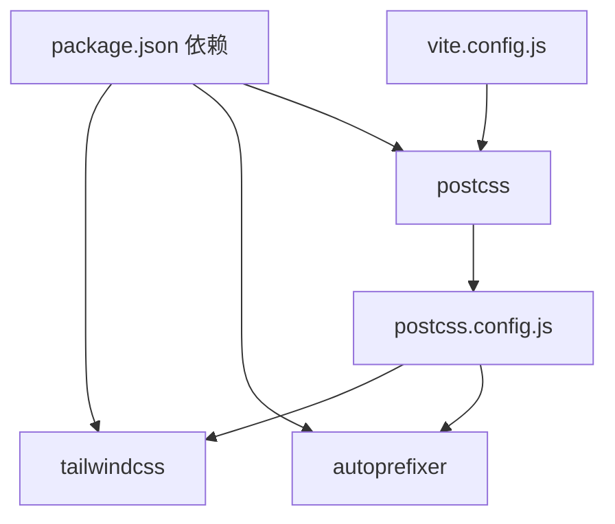

# 样式工程与 Tailwind CSS 集成

<cite>
**本文引用的文件列表**
- [tailwind.config.js](file://tailwind.config.js)
- [postcss.config.js](file://postcss.config.js)
- [package.json](file://package.json)
- [vite.config.js](file://vite.config.js)
- [src/index.css](file://src/index.css)
- [src/App.css](file://src/App.css)
- [src/pages/Dashboard.jsx](file://src/pages/Dashboard.jsx)
- [src/components/uiverse/GlassCard.jsx](file://src/components/uiverse/GlassCard.jsx)
- [src/components/uiverse/ActionButton.jsx](file://src/components/uiverse/ActionButton.jsx)
- [src/components/uiverse/StatCard.jsx](file://src/components/uiverse/StatCard.jsx)
- [src/components/chat-widgets/StyleSelector.jsx](file://src/components/chat-widgets/StyleSelector.jsx)
- [src/components/chat-widgets/PathRecommendCard.jsx](file://src/components/chat-widgets/PathRecommendCard.jsx)
- [src/components/uiverse/uiverse-button.css](file://src/components/uiverse/uiverse-button.css)
- [src/components/uiverse/uiverse-card.css](file://src/components/uiverse/uiverse-card.css)
- [legacy_backup/styles.css](file://legacy_backup/styles.css)
</cite>

## 目录
1. [引言](#引言)
2. [项目结构](#项目结构)
3. [核心组件](#核心组件)
4. [架构总览](#架构总览)
5. [详细组件分析](#详细组件分析)
6. [依赖关系分析](#依赖关系分析)
7. [性能考量](#性能考量)
8. [故障排查指南](#故障排查指南)
9. [结论](#结论)
10. [附录](#附录)

## 引言
本文件系统性梳理 gemini 项目中 Tailwind CSS 的工程化集成方案，围绕以下目标展开：
- 解析 tailwind.config.js 中 content 扫描路径策略（./src/**/*.{js,ts,jsx,tsx}），说明其如何确保类名正确提取。
- 讲解主题扩展中 primary 颜色（#2563EB）的应用方式与命名规范。
- 阐述 PostCSS 配置中 tailwindcss 与 autoprefixer 插件的协同机制及其在生成跨浏览器兼容样式中的作用。
- 提供自定义样式扩展、响应式设计实现与原子类最佳实践指南。
- 给出常见问题（样式未生效、构建体积过大）的定位与解决建议。

## 项目结构
项目采用 Vite + React + Tailwind CSS 的现代前端栈，样式体系由 Tailwind 原子类驱动，同时保留部分传统 CSS 层以支持渐进增强与特定场景（如玻璃卡片、按钮变体等）。关键目录与文件如下：
- 配置层：tailwind.config.js、postcss.config.js、vite.config.js、package.json
- 样式层：src/index.css（引入 Tailwind 三段式指令与自定义基础层）、src/App.css（遗留样式）
- 组件层：src/components 下包含大量使用 Tailwind 原子类的组件；uiverse 子目录提供自定义变体与动画的 CSS 片段
- 页面层：src/pages 下页面组件广泛使用 Tailwind 原子类进行布局与视觉控制

图表来源
- [postcss.config.js](file://postcss.config.js#L1-L6)
- [tailwind.config.js](file://tailwind.config.js#L1-L12)
- [src/index.css](file://src/index.css#L1-L3)

章节来源
- [vite.config.js](file://vite.config.js#L1-L9)
- [package.json](file://package.json#L1-L42)

## 核心组件
本节聚焦 Tailwind 配置与 PostCSS 协同工作流，以及主题扩展与内容扫描策略。

- Tailwind 配置要点
  - content 扫描范围：包含根 HTML 与 src 目录下所有 JS/TS/JSX/TSX 文件，确保动态拼接或条件渲染的类名被正确提取。
  - 主题扩展：
    - colors.primary：用于统一品牌主色，便于在组件中通过 primary 关键字引用。
    - colors.glass/border：为玻璃材质与边框系统提供语义化色值。
    - backdropBlur、boxShadow、keyframes、animation、transitionDuration、transitionTimingFunction：为玻璃卡片、光泽效果、动画与过渡提供可复用能力。
  - plugins：当前为空数组，预留后续插件扩展空间。

- PostCSS 配置要点
  - 插件顺序：先 tailwindcss 后 autoprefixer，保证在生成前缀之前完成类名解析与裁剪。
  - 作用：将 Tailwind 生成的原子类转换为浏览器兼容的最终 CSS，并自动添加必要的 vendor 前缀。

- Vite 集成
  - 通过 Vite 的插件机制接入 React，PostCSS 由 Vite 默认处理链路执行，无需额外配置。

章节来源
- [tailwind.config.js](file://tailwind.config.js#L1-L96)
- [postcss.config.js](file://postcss.config.js#L1-L6)
- [vite.config.js](file://vite.config.js#L1-L9)

## 架构总览
Tailwind 在本项目中的工作流如下：
- 开发阶段：Vite 启动，PostCSS 依次执行 tailwindcss 与 autoprefixer。
- 构建阶段：tailwindcss 基于 content 扫描提取类名，结合主题扩展生成所需原子类；autoprefixer 补全浏览器前缀。
- 运行阶段：src/index.css 注入生成的 CSS，浏览器渲染。

图表来源
- [postcss.config.js](file://postcss.config.js#L1-L6)
- [tailwind.config.js](file://tailwind.config.js#L1-L12)
- [src/index.css](file://src/index.css#L1-L3)

## 详细组件分析

### 内容扫描路径与类名提取策略
- 扫描范围
  - 根 HTML：确保页面根元素上的类名被识别。
  - src/**/*.{js,ts,jsx,tsx}：覆盖所有组件与页面源码，包括动态类名拼接与条件渲染场景。
- 类名提取机制
  - Tailwind 在构建时对上述文件进行 AST 解析，收集所有字符串形式的类名，避免遗漏运行时拼接的类名。
  - 对于模板字符串或变量拼接，需保持类名书写规范，避免被忽略。
- 实践建议
  - 尽量使用静态字符串类名，避免复杂表达式导致扫描失败。
  - 对动态类名，优先通过常量或枚举集中管理，便于扫描与维护。

章节来源
- [tailwind.config.js](file://tailwind.config.js#L1-L12)

### 主题扩展中的 primary 颜色应用
- 定义位置：在 tailwind.config.js 的 theme.extend.colors 中定义 primary 为 #2563EB。
- 使用方式
  - 在组件中直接使用 primary 关键字作为颜色前缀，例如背景、文本、边框等。
  - 在页面与组件中，通过组合 primary 与其他修饰词（如 hover、focus、active）形成一致的品牌视觉。
- 示例参考
  - 页面组件中使用 primary 作为按钮或强调元素的主色。
  - 组件变体中通过 primary 关键字组合渐变、阴影等复合样式。

章节来源
- [tailwind.config.js](file://tailwind.config.js#L1-L26)
- [src/pages/Dashboard.jsx](file://src/pages/Dashboard.jsx#L140-L151)

### PostCSS 中 tailwindcss 与 autoprefixer 的协同机制
- 执行顺序
  - tailwindcss 先于 autoprefixer 执行，确保在生成兼容前缀之前，Tailwind 已完成类名解析与裁剪。
- 作用分工
  - tailwindcss：基于配置生成原子类，结合 content 扫描剔除未使用类，减少体积。
  - autoprefixer：根据目标浏览器列表自动添加必要前缀，提升兼容性。
- 结果
  - 最终输出的 CSS 既满足功能需求，又具备良好的跨浏览器兼容性。

章节来源
- [postcss.config.js](file://postcss.config.js#L1-L6)

### 自定义样式扩展与响应式设计
- 自定义扩展
  - 主题扩展：colors.glass、colors.border、backdropBlur、boxShadow、keyframes、animation、transitionDuration、transitionTimingFunction。
  - 基础层：在 src/index.css 中通过 @layer base 定义全局变量与基础样式，配合 Tailwind 原子类实现统一设计语言。
- 响应式设计
  - 使用 Tailwind 原子类进行断点控制（如 sm、md、lg 等），在组件中按需组合。
  - 对复杂交互（如玻璃卡片 hover 效果）通过组合类名实现一致的过渡与阴影变化。
- 动画与过渡
  - 通过 theme.extend.animation 与 keyframes 定义动画，结合 hover、group 等伪类实现交互反馈。

章节来源
- [tailwind.config.js](file://tailwind.config.js#L27-L96)
- [src/index.css](file://src/index.css#L1-L143)

### 组件级实践示例

#### 玻璃卡片组件（GlassCard）
- 设计要点
  - 透明度与模糊：通过 backdrop-blur 与半透明背景实现苹果液态玻璃风格。
  - 阴影系统：利用主题扩展中的 boxShadow.glass 与 hover 变体，营造层次感。
  - 过渡与交互：通过 transitionDuration 与 transitionTimingFunction 控制平滑过渡。
- 类名组合
  - 基础类：相对定位、圆角、边框、阴影、过渡等。
  - 变体类：根据透明度级别选择不同 backdrop-blur 与背景透明度。
  - 悬停类：hover 时调整背景、边框与阴影，提升交互体验。

图表来源
- [src/components/uiverse/GlassCard.jsx](file://src/components/uiverse/GlassCard.jsx#L1-L74)

章节来源
- [src/components/uiverse/GlassCard.jsx](file://src/components/uiverse/GlassCard.jsx#L1-L74)

#### 按钮变体（ActionButton）
- 设计要点
  - 通过 variants 映射不同变体的背景、悬停、阴影与文字颜色，统一品牌视觉。
  - 使用 primary 关键字与渐变组合，确保主按钮的高辨识度。
- 类名组合
  - 基于 variant 选择预设样式，再叠加 hover 与阴影类，形成一致的交互反馈。

章节来源
- [src/components/uiverse/ActionButton.jsx](file://src/components/uiverse/ActionButton.jsx#L40-L70)

#### 统计卡片（StatCard）
- 设计要点
  - 通过颜色映射表为不同类别分配背景与图标颜色，保持视觉一致性。
  - 利用 Tailwind 原子类实现圆角、边框、阴影与悬停效果。
- 类名组合
  - 背景类、图标颜色类与装饰性渐变叠加，形成层次丰富的卡片外观。

章节来源
- [src/components/uiverse/StatCard.jsx](file://src/components/uiverse/StatCard.jsx#L52-L82)

#### 学习风格选择器（StyleSelector）
- 设计要点
  - 使用语义化颜色类为不同风格提供统一的背景、文本与边框配色。
  - 通过网格布局与过渡类实现响应式与交互反馈。

章节来源
- [src/components/chat-widgets/StyleSelector.jsx](file://src/components/chat-widgets/StyleSelector.jsx#L1-L34)

#### 路径推荐卡片（PathRecommendCard）
- 设计要点
  - 通过条件分支为不同推荐类型选择渐变、背景渐变、边框与发光色，形成差异化视觉。
  - 与页面组件配合，实现统一的品牌主色与辅助色体系。

章节来源
- [src/components/chat-widgets/PathRecommendCard.jsx](file://src/components/chat-widgets/PathRecommendCard.jsx#L41-L63)

### 与遗留样式的对比与迁移
- legacy_backup/styles.css 中定义了 --primary-blue 等变量，体现早期项目对主色的约定。
- 在新架构中，通过 tailwind.config.js 的 primary 定义与 src/index.css 的基础层，实现更统一、可扩展的主题体系。
- 迁移建议
  - 逐步替换内联 style 与固定颜色值为 Tailwind 原子类与主题扩展。
  - 对遗留样式进行模块化拆分，优先使用原子类与主题扩展。

章节来源
- [legacy_backup/styles.css](file://legacy_backup/styles.css#L1-L244)
- [src/index.css](file://src/index.css#L1-L143)

## 依赖关系分析
- 依赖关系
  - tailwindcss 与 autoprefixer 由 PostCSS 插件链路加载。
  - Vite 通过默认配置处理 PostCSS，无需额外配置。
  - 项目中还包含其他 UI 与动画库（如 framer-motion、antd），它们与 Tailwind 并行工作，互不冲突。
- 耦合与内聚
  - Tailwind 配置集中管理主题与扫描范围，降低各组件对具体颜色值的耦合。
  - 组件通过原子类组合实现高内聚、低耦合的样式组织。

图表来源
- [package.json](file://package.json#L1-L42)
- [postcss.config.js](file://postcss.config.js#L1-L6)
- [vite.config.js](file://vite.config.js#L1-L9)

章节来源
- [package.json](file://package.json#L1-L42)
- [postcss.config.js](file://postcss.config.js#L1-L6)
- [vite.config.js](file://vite.config.js#L1-L9)

## 性能考量
- 内容扫描与裁剪
  - 合理设置 content 范围，避免扫描无关文件导致构建时间增加。
  - 保持类名书写规范，减少无效类名导致的冗余输出。
- 动画与过渡
  - 使用主题扩展中的 animation 与 transitionDuration/transitionTimingFunction，避免在组件中重复定义，提升复用性与性能。
- 构建体积优化
  - 通过主题扩展与原子类组合，减少自定义 CSS 数量。
  - 对于第三方库样式，尽量使用原子类替代内联样式，降低重复定义。

[本节为通用指导，不直接分析具体文件]

## 故障排查指南
- 样式未生效
  - 检查 src/index.css 是否正确引入 Tailwind 三段式指令（base、components、utilities）。
  - 确认 tailwind.config.js 的 content 范围是否包含当前组件文件。
  - 检查组件中类名是否符合扫描规则（避免复杂表达式或动态拼接导致未被识别）。
  - 确认 PostCSS 插件顺序是否为 tailwindcss 在前、autoprefixer 在后。
- 构建体积过大
  - 通过 content 范围精确扫描，剔除未使用类。
  - 减少自定义 CSS 与重复定义，优先使用原子类与主题扩展。
  - 对动画与过渡使用统一的 keyframes 与 timing，避免重复定义。
- 浏览器兼容性问题
  - 确保 autoprefixer 正常工作，检查目标浏览器列表与前缀生成情况。
  - 对于需要 polyfill 的特性，考虑引入相应垫片或降级方案。

章节来源
- [src/index.css](file://src/index.css#L1-L3)
- [tailwind.config.js](file://tailwind.config.js#L1-L12)
- [postcss.config.js](file://postcss.config.js#L1-L6)

## 结论
本项目通过明确的 Tailwind 配置与 PostCSS 协同机制，实现了从主题扩展到组件级样式的完整工程化落地。content 扫描策略确保类名提取准确，primary 颜色贯穿全局设计语言，PostCSS 则保障跨浏览器兼容性。配合原子类与主题扩展的最佳实践，可在保证一致性的同时有效控制构建体积与维护成本。

[本节为总结性内容，不直接分析具体文件]

## 附录
- 原子类最佳实践
  - 优先使用 Tailwind 原子类，减少自定义 CSS。
  - 将常用组合封装为组件内部类名，避免在多处重复定义。
  - 使用主题扩展统一颜色、动画与过渡，提升一致性与可维护性。
- 响应式设计建议
  - 使用断点前缀（sm、md、lg 等）进行布局适配。
  - 对交互反馈（hover、focus、active）使用统一的过渡与阴影系统。
- 自定义样式扩展
  - 在 src/index.css 的 @layer base 中定义全局变量与基础样式。
  - 在 tailwind.config.js 的 theme.extend 中扩展颜色、阴影、动画等，形成可复用的设计令牌。

[本节为通用指导，不直接分析具体文件]