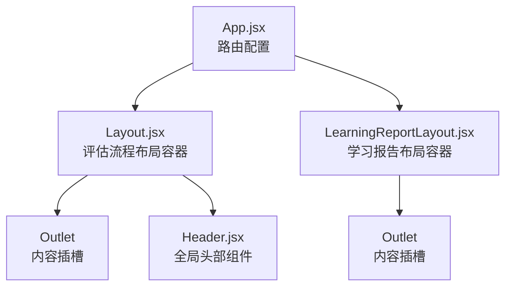
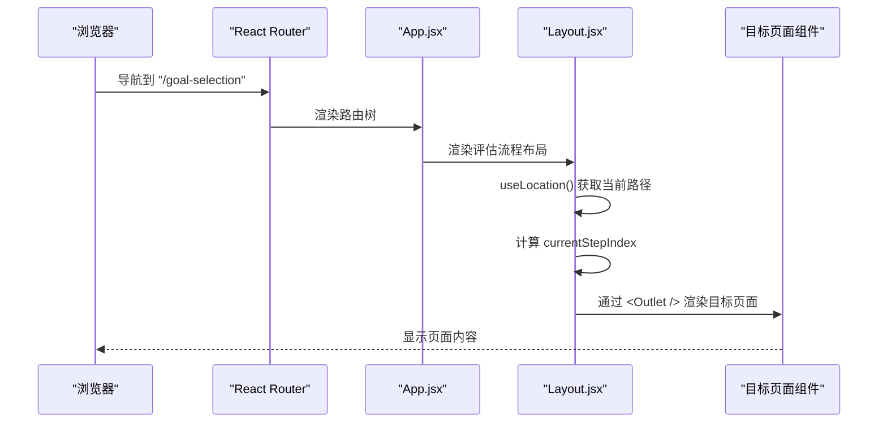
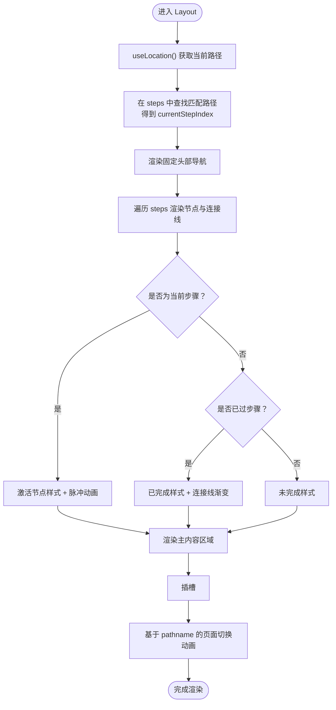
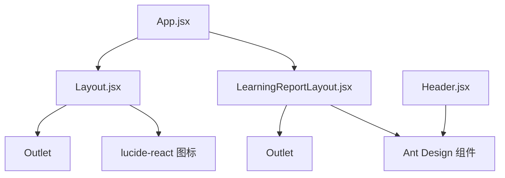

# 布局系统

<cite>
**本文引用的文件**
- [Layout.jsx](file://src/components/Layout.jsx)
- [App.jsx](file://src/App.jsx)
- [Header.jsx](file://src/components/Header.jsx)
- [LearningReportLayout.jsx](file://src/components/LearningReportLayout.jsx)
- [ProgressBar.jsx](file://src/components/ProgressBar.jsx)
</cite>

## 目录
1. [引言](#引言)
2. [项目结构](#项目结构)
3. [核心组件](#核心组件)
4. [架构总览](#架构总览)
5. [详细组件分析](#详细组件分析)
6. [依赖分析](#依赖分析)
7. [性能考虑](#性能考虑)
8. [故障排查指南](#故障排查指南)
9. [结论](#结论)
10. [附录](#附录)

## 引言
本文件聚焦于 gemini 项目的通用布局容器组件 Layout.jsx 的设计与实现，系统性阐述其作为“评估流程”主布局的职责边界：固定头部导航、内容区域留白与响应式布局处理；重点解析进度条导航（steps）的实现机制，说明如何基于当前路由动态计算步骤状态（激活、已完成）；梳理与 Header.jsx 等全局 UI 组件的协作关系，以及通过 Outlet 实现的内容插槽模式；结合 Framer Motion 动画集成方式，给出布局动画的实现要点与最佳实践，并提供自定义布局变体的扩展指导。

## 项目结构
Layout.jsx 位于 src/components 目录下，是评估流程页面的统一布局容器。它通过 React Router 的嵌套路由机制被 App.jsx 中的路由配置所包裹，从而为一组特定页面提供一致的导航与过渡体验。同时，项目中还存在另一个布局组件 LearningReportLayout.jsx，用于学习报告系统的导航与主题风格，二者共同构成项目的主要布局体系。

图表来源
- [App.jsx](file://src/App.jsx#L50-L98)
- [Layout.jsx](file://src/components/Layout.jsx#L5-L140)
- [LearningReportLayout.jsx](file://src/components/LearningReportLayout.jsx#L1-L129)
- [Header.jsx](file://src/components/Header.jsx#L1-L27)

章节来源
- [App.jsx](file://src/App.jsx#L50-L98)

## 核心组件
- Layout.jsx：评估流程的通用布局容器，负责固定头部导航、进度条导航（steps）、内容区域留白与页面切换动画；通过 useLocation 计算当前步骤索引，动态渲染步骤状态；通过 Outlet 插槽承载具体页面内容。
- LearningReportLayout.jsx：学习报告系统的专用布局，提供深色主题、学生信息展示与标签页导航，同样使用 Outlet 承载子路由页面。
- Header.jsx：通用头部组件，提供平台标识与帮助入口，但不参与评估流程的进度导航逻辑。
- ProgressBar.jsx：页面内使用的进度条组件，用于单页内的任务进度提示，与 Layout 的全局 steps 不同。

章节来源
- [Layout.jsx](file://src/components/Layout.jsx#L5-L140)
- [LearningReportLayout.jsx](file://src/components/LearningReportLayout.jsx#L1-L129)
- [Header.jsx](file://src/components/Header.jsx#L1-L27)
- [ProgressBar.jsx](file://src/components/ProgressBar.jsx#L1-L22)

## 架构总览
评估流程的路由与布局关系如下：App.jsx 定义了多组路由，其中评估流程路由被 Layout.jsx 包裹，使其具备统一的头部导航与页面切换动画；LearningReportLayout.jsx 则独立管理学习报告系统的导航与主题。

图表来源
- [App.jsx](file://src/App.jsx#L57-L70)
- [Layout.jsx](file://src/components/Layout.jsx#L5-L140)

## 详细组件分析

### Layout.jsx：评估流程布局容器
职责与特性
- 固定头部导航：使用固定定位，包含品牌 Logo、进度条导航与步骤指示文本；滚动时动态调整阴影，提升层次感。
- 进度条导航（steps）：维护一个步骤数组，每个步骤包含路径、图标与标签；通过 useLocation 获取当前路径，计算当前步骤索引，据此决定节点的激活/已完成/未完成状态与连接线进度。
- 内容区域留白：顶部预留导航栏高度，底部与两侧设置合理的内边距，最大宽度约束与居中布局，保证内容可读性与一致性。
- 响应式布局：在小屏设备隐藏进度条导航，仅保留步骤指示文本，确保移动端可用性。
- 页面切换动画：通过 Framer Motion 对 <Outlet> 内容进行进入/退出动画，增强页面切换的流畅感。

步骤状态计算机制
- 使用路径精确匹配的方式确定当前步骤索引，若当前路径不在步骤表中则显示“准备就绪”。
- 激活状态：当前步骤索引对应的节点高亮并带有脉冲动画。
- 已完成状态：当前步骤之前的节点标记为已完成，连接线渐变填充。
- 未完成状态：当前步骤之后的节点保持默认样式。

与 Header.jsx 的协作关系
- Layout.jsx 自身即为评估流程的头部容器，提供进度导航与步骤指示；Header.jsx 是另一个通用头部组件，通常用于非评估流程页面或仪表盘等场景。两者职责不同，不应在同一页面重复使用。

与 Outlet 的内容插槽模式
- Layout.jsx 在主内容区域使用 <motion.div> 包裹 <Outlet />，通过 key 基于 location.pathname 变化触发动画；这确保每次路由切换都会产生新的动画序列，避免状态残留。

布局动画（Framer Motion）集成
- 头部 Logo 区域：使用 whileHover 与 transition 实现轻微缩放反馈。
- 步骤节点：激活节点使用 scale 放大与发光阴影；未激活节点在悬停时有轻微缩放。
- 当前步骤脉冲：通过 animate 与 transition 实现无限循环的缩放与透明度变化。
- 连接线：使用初始 scaleX: 0 与动画 scaleX: 1，配合 transformOrigin 实现从左到右的渐进填充。
- 页面切换：基于 key={location.pathname} 的进入/退出动画，使用位移与透明度组合，配合缓动曲线提升观感。

图表来源
- [Layout.jsx](file://src/components/Layout.jsx#L5-L140)

章节来源
- [Layout.jsx](file://src/components/Layout.jsx#L5-L140)

### LearningReportLayout.jsx：学习报告布局容器
职责与特性
- 提供学习报告系统的深色主题背景与学生信息展示。
- 顶部导航包含返回按钮、学生头像与姓名、学科与当前主题信息。
- 标签页导航支持“统计报告”“报告详情”“学习建议”，使用 Framer Motion 的 layoutId 实现活动指示器的平滑过渡。
- 通过 <Outlet /> 承载子路由页面，形成嵌套布局。

与 Layout.jsx 的差异
- 主题风格不同：LearningReportLayout 使用深色系与渐变背景，强调报告类内容的沉浸感。
- 导航结构不同：LearningReportLayout 采用标签页导航而非步骤导航。
- 适用范围不同：前者服务于评估流程，后者服务于报告系统。

章节来源
- [LearningReportLayout.jsx](file://src/components/LearningReportLayout.jsx#L1-L129)

### Header.jsx：通用头部组件
职责与特性
- 提供平台标识与帮助入口按钮，适用于非评估流程页面。
- 与 Layout.jsx 的评估流程头部不同，不包含进度导航与步骤指示。

章节来源
- [Header.jsx](file://src/components/Header.jsx#L1-L27)

### ProgressBar.jsx：页面内进度条组件
职责与特性
- 展示单页内的任务进度，例如“了解你的学习风格”的进度条。
- 与 Layout 的全局 steps 不同，属于页面级进度提示，不参与路由级别的步骤导航。

章节来源
- [ProgressBar.jsx](file://src/components/ProgressBar.jsx#L1-L22)

## 依赖分析
- 路由依赖：App.jsx 通过 Routes/Route 将评估流程路由包裹在 Layout.jsx 下，形成嵌套路由结构；LearningReportLayout.jsx 同样通过嵌套路由承载子页面。
- 状态依赖：Layout.jsx 依赖 useLocation 计算当前步骤索引，依赖 useState 维护滚动阴影状态。
- 动画依赖：Framer Motion 提供节点缩放、脉冲、连接线渐进与页面切换动画。
- UI 组件依赖：Layout.jsx 使用 lucide-react 图标库；LearningReportLayout.jsx 使用 Ant Design 的 Button 与图标；Header.jsx 使用 Ant Design 的 Button 与图标。

图表来源
- [App.jsx](file://src/App.jsx#L50-L98)
- [Layout.jsx](file://src/components/Layout.jsx#L1-L5)
- [LearningReportLayout.jsx](file://src/components/LearningReportLayout.jsx#L1-L5)
- [Header.jsx](file://src/components/Header.jsx#L1-L5)

章节来源
- [App.jsx](file://src/App.jsx#L50-L98)
- [Layout.jsx](file://src/components/Layout.jsx#L1-L5)
- [LearningReportLayout.jsx](file://src/components/LearningReportLayout.jsx#L1-L5)
- [Header.jsx](file://src/components/Header.jsx#L1-L5)

## 性能考虑
- 路由切换动画：通过 key={location.pathname} 触发动画，避免不必要的状态复用；缓动曲线与持续时间适中，兼顾流畅与性能。
- 进度条渲染：steps 数组较小且只在头部渲染，开销可控；连接线使用 scaleX 动画，现代浏览器支持良好。
- 滚动监听：仅在 Layout.jsx 中监听滚动事件并更新状态，注意在组件卸载时清理监听器，防止内存泄漏。
- 图标与主题：使用 lucide-react 与 Ant Design 图标，按需引入可减少打包体积；深色主题背景使用 CSS 渐变，避免额外资源加载。

## 故障排查指南
- 路由不匹配导致步骤未高亮
  - 现象：当前步骤节点未高亮或连接线未填充。
  - 排查：确认 App.jsx 中评估流程路由路径与 Layout.jsx 的 steps 数组路径完全一致（大小写与斜杠）。
  - 参考路径
    - [App.jsx](file://src/App.jsx#L57-L70)
    - [Layout.jsx](file://src/components/Layout.jsx#L9-L17)
- 动画异常或卡顿
  - 现象：节点缩放、脉冲或连接线动画不生效。
  - 排查：检查 Framer Motion 是否正确安装与导入；确认动画属性（如 animate/transition）未被覆盖；避免在动画期间频繁重排 DOM。
  - 参考路径
    - [Layout.jsx](file://src/components/Layout.jsx#L43-L118)
- 滚动阴影未变化
  - 现象：滚动后导航栏阴影未改变。
  - 排查：确认 useEffect 中的 scroll 事件绑定与清理逻辑正常执行；检查滚动容器是否为 window。
  - 参考路径
    - [Layout.jsx](file://src/components/Layout.jsx#L22-L29)
- 内容插槽未显示
  - 现象：页面空白或无内容。
  - 排查：确认 App.jsx 中评估流程路由确实包裹在 Layout.jsx 下；检查目标页面组件是否正确导出与导入。
  - 参考路径
    - [App.jsx](file://src/App.jsx#L57-L70)
    - [Layout.jsx](file://src/components/Layout.jsx#L126-L138)

章节来源
- [App.jsx](file://src/App.jsx#L57-L70)
- [Layout.jsx](file://src/components/Layout.jsx#L22-L29)
- [Layout.jsx](file://src/components/Layout.jsx#L43-L118)
- [Layout.jsx](file://src/components/Layout.jsx#L126-L138)

## 结论
Layout.jsx 作为评估流程的统一布局容器，通过固定头部导航、步骤进度条与页面切换动画，提供了清晰的流程引导与一致的用户体验。其与 App.jsx 的嵌套路由配合，实现了内容插槽模式与响应式布局策略。LearningReportLayout.jsx 则为报告系统提供了独立的主题与导航方案。未来可在保持现有结构稳定性的前提下，按需扩展更多布局变体，同时确保动画与交互的一致性与性能表现。

## 附录
- 自定义布局变体扩展指导
  - 新增布局容器：参考 Layout.jsx 的结构，定义 steps 或标签页导航，使用 <Outlet /> 承载子路由页面。
  - 动画集成：优先使用 Framer Motion 的 animate/whileHover/transition 等属性，保持缓动与持续时间一致。
  - 路由配置：在 App.jsx 中新增路由组并包裹新布局容器，确保路径与步骤数组保持一致。
  - 主题与样式：遵循现有 CSS 类命名规范（如 glass、shadow-glass），避免冲突。